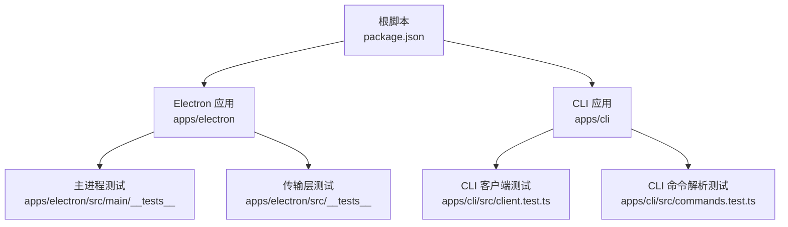
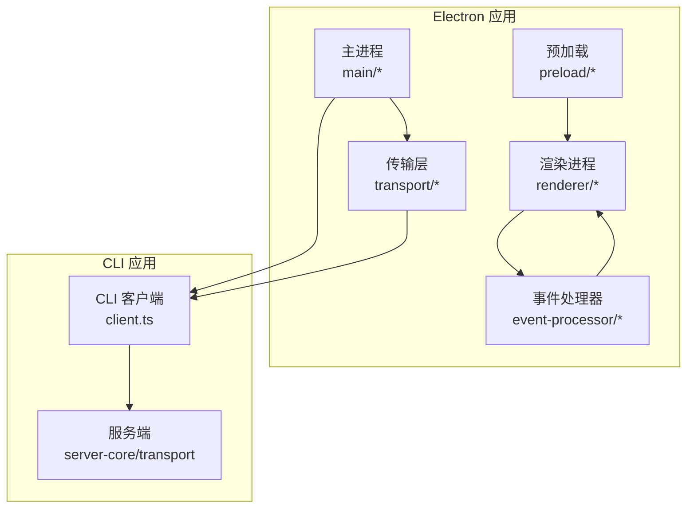
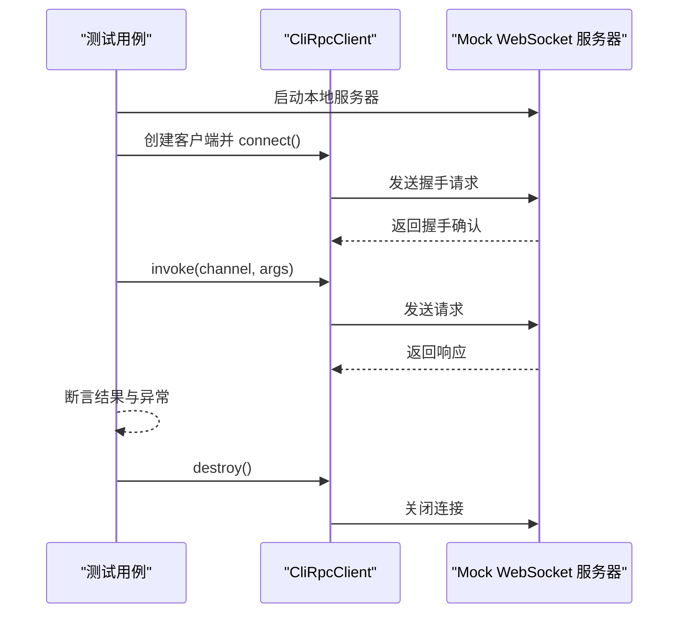
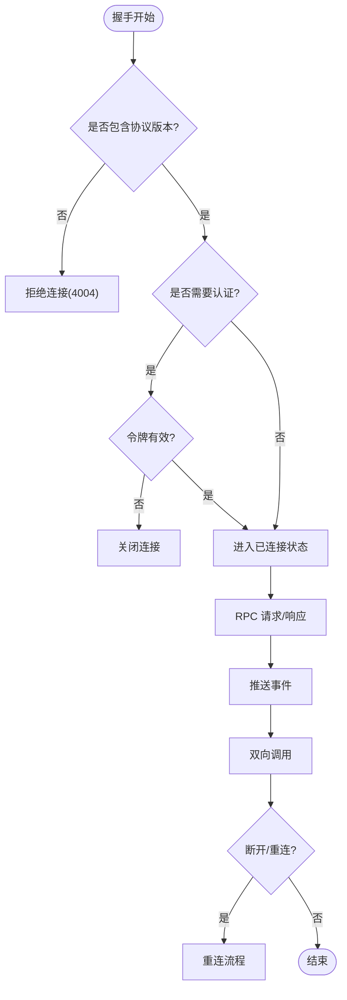
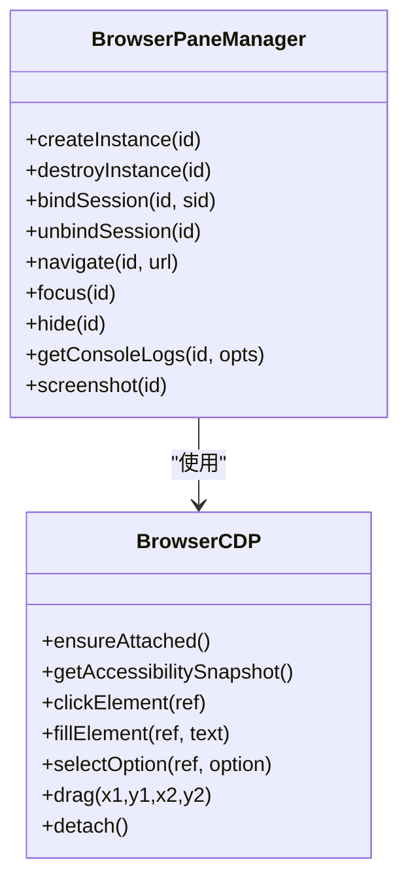
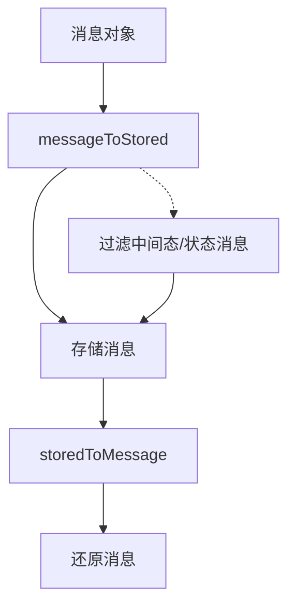
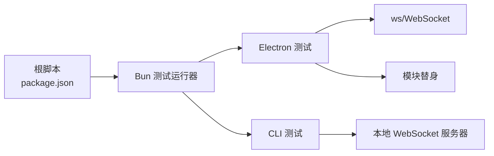

# 测试和调试

<cite>
**本文引用的文件**
- [package.json](file://package.json)
- [apps/electron/package.json](file://apps/electron/package.json)
- [apps/cli/package.json](file://apps/cli/package.json)
- [apps/cli/src/client.test.ts](file://apps/cli/src/client.test.ts)
- [apps/cli/src/commands.test.ts](file://apps/cli/src/commands.test.ts)
- [apps/electron/src/__tests__/transport.test.ts](file://apps/electron/src/__tests__/transport.test.ts)
- [apps/electron/src/main/__tests__/browser-cdp.test.ts](file://apps/electron/src/main/__tests__/browser-cdp.test.ts)
- [apps/electron/src/main/__tests__/browser-pane-manager.test.ts](file://apps/electron/src/main/__tests__/browser-pane-manager.test.ts)
- [apps/electron/src/main/__tests__/connection-setup-logic.test.ts](file://apps/electron/src/main/__tests__/connection-setup-logic.test.ts)
- [apps/electron/src/main/__tests__/connection-setup-updateOnly.test.ts](file://apps/electron/src/main/__tests__/connection-setup-updateOnly.test.ts)
- [apps/electron/src/main/__tests__/session-branching-validation.test.ts](file://apps/electron/src/main/__tests__/session-branching-validation.test.ts)
- [apps/electron/src/main/__tests__/session-message-parity.test.ts](file://apps/electron/src/main/__tests__/session-message-parity.test.ts)
- [apps/electron/src/main/__tests__/session-event-message-parity.test.ts](file://apps/electron/src/main/__tests__/session-event-message-parity.test.ts)
- [apps/electron/src/main/__tests__/session-lazy-load-race.test.ts](file://apps/electron/src/main/__tests__/session-lazy-load-race.test.ts)
- [apps/electron/src/main/__tests__/session-persistence.test.ts](file://apps/electron/src/main/__tests__/session-persistence.test.ts)
</cite>

## 目录

1. [引言](#引言)
2. [项目结构](#项目结构)
3. [核心组件](#核心组件)
4. [架构总览](#架构总览)
5. [详细组件分析](#详细组件分析)
6. [依赖分析](#依赖分析)
7. [性能考虑](#性能考虑)
8. [故障排查指南](#故障排查指南)
9. [结论](#结论)
10. [附录](#附录)

## 引言

本文件面向 Craft Agents 项目的测试与调试工作，系统性梳理测试策略（单元、集成、端到端）、测试框架配置与运行方式、日志系统与调试模式、覆盖率与质量门禁、常见调试场景与技巧，并提供来自真实代码库的示例路径，帮助初学者快速上手，同时为有经验的开发者提供足够深度的技术细节。

## 项目结构

- 根级通过脚本统一驱动测试与类型检查，主应用与 CLI 分别在各自包内维护测试套件。
- Electron 应用包含主进程、渲染进程、预加载层、传输层等多模块测试；CLI 包含命令解析与 RPC 客户端测试；共享包与服务端核心也包含独立测试。
- 测试组织遵循按功能域分层：主进程业务逻辑、传输协议、浏览器工具链、会话持久化与消息一致性、连接配置与校验等。

图表来源

- [package.json](file://package.json#L12-L30)
- [apps/electron/package.json](file://apps/electron/package.json#L17-L37)
- [apps/cli/package.json](file://apps/cli/package.json#L10-L14)

章节来源

- [package.json](file://package.json#L12-L30)
- [apps/electron/package.json](file://apps/electron/package.json#L17-L37)
- [apps/cli/package.json](file://apps/cli/package.json#L10-L14)

## 核心组件

- 测试框架与运行器
  - 根脚本使用 Bun 测试运行器执行所有测试，覆盖 Electron 主/渲染、CLI、共享与服务端核心。
  - CLI 包含独立的测试入口，便于按模块运行。
- 日志与调试
  - Electron 主进程通过日志模块输出信息，测试中通过模块替身（mock）隔离外部依赖，确保可重复性。
  - 调试模式可通过环境变量或构建参数开启（例如服务端启动时设置调试标志）。
- 覆盖率与质量门禁
  - 仓库未显式声明覆盖率阈值或质量门禁规则；建议在 CI 中引入覆盖率统计与阈值控制，结合现有脚本进行门禁。

章节来源

- [package.json](file://package.json#L12-L30)
- [apps/cli/package.json](file://apps/cli/package.json#L10-L14)

## 架构总览

下图展示了测试覆盖的关键模块与交互关系，突出 Electron 主进程、传输层、CLI 客户端以及各业务域测试之间的边界与耦合点。

图表来源

- [apps/electron/src/**tests**/transport.test.ts](file://apps/electron/src/__tests__/transport.test.ts#L1-L683)
- [apps/cli/src/client.test.ts](file://apps/cli/src/client.test.ts#L1-L410)

## 详细组件分析

### CLI 测试策略与实现

- 单元测试
  - 命令解析：验证参数解析、默认值、环境变量覆盖、子命令与标志位组合。
  - RPC 客户端：基于内置 WebSocket 服务器模拟握手、请求响应、推送事件、TLS 连接、超时与错误处理。
- 集成测试
  - 通过本地 WebSocket 服务器与客户端交互，覆盖握手认证、请求超时、服务端错误、断线重连等场景。
- 端到端测试
  - 仓库未提供 CLI 端到端测试；建议补充对真实服务端的集成测试，覆盖完整命令链路。

图表来源

- [apps/cli/src/client.test.ts](file://apps/cli/src/client.test.ts#L171-L204)
- [apps/cli/src/client.test.ts](file://apps/cli/src/client.test.ts#L206-L231)

章节来源

- [apps/cli/src/commands.test.ts](file://apps/cli/src/commands.test.ts#L8-L228)
- [apps/cli/src/client.test.ts](file://apps/cli/src/client.test.ts#L1-L410)

### Electron 传输层测试策略与实现

- 单元测试
  - 握手与认证：验证协议版本缺失、令牌校验失败、无效令牌等场景。
  - RPC 请求/响应：参数传递、并发请求、二进制数据往返、错误码映射。
  - 推送事件：监听器注册、作用域过滤（全量/工作区）、反订阅、二进制事件。
  - 双向调用：服务端对客户端能力调用、能力不存在、客户端断开等。
- 集成测试
  - 通过 WsRpcServer/WsRpcClient 组合，覆盖连接状态机、自动重连、关闭码与原因捕获。
- 端到端测试
  - 仓库未提供端到端测试；建议补充主/渲染进程间真实通信链路的集成测试。

图表来源

- [apps/electron/src/**tests**/transport.test.ts](file://apps/electron/src/__tests__/transport.test.ts#L99-L121)
- [apps/electron/src/**tests**/transport.test.ts](file://apps/electron/src/__tests__/transport.test.ts#L127-L251)
- [apps/electron/src/**tests**/transport.test.ts](file://apps/electron/src/__tests__/transport.test.ts#L257-L346)
- [apps/electron/src/**tests**/transport.test.ts](file://apps/electron/src/__tests__/transport.test.ts#L559-L682)

章节来源

- [apps/electron/src/**tests**/transport.test.ts](file://apps/electron/src/__tests__/transport.test.ts#L1-L683)

### 主进程业务域测试策略与实现

- 浏览器 CDP 工具链
  - 单元测试：调试器附加、可访问性快照、元素点击/填充/选择、拖拽、分离等行为；通过模块替身屏蔽真实 Electron API。
- 浏览器面板管理
  - 单元测试：实例生命周期、会话绑定/解绑、导航策略、窗口显示/隐藏、控制台日志采集与主题信号、截图容错与恢复。
- 连接配置与校验
  - 单元测试：模型列表校验、内置连接创建、设置测试输入校验、错误解析友好化。
- 会话一致性与持久化
  - 单元测试：消息存储往返、中间态过滤、主/渲染消息字段对齐、惰性加载合并逻辑、持久化时间戳保留、空连接安全回退、孤儿连接清理。

图表来源

- [apps/electron/src/main/**tests**/browser-cdp.test.ts](file://apps/electron/src/main/__tests__/browser-cdp.test.ts#L56-L487)
- [apps/electron/src/main/**tests**/browser-pane-manager.test.ts](file://apps/electron/src/main/__tests__/browser-pane-manager.test.ts#L237-L800)

章节来源

- [apps/electron/src/main/**tests**/browser-cdp.test.ts](file://apps/electron/src/main/__tests__/browser-cdp.test.ts#L1-L488)
- [apps/electron/src/main/**tests**/browser-pane-manager.test.ts](file://apps/electron/src/main/__tests__/browser-pane-manager.test.ts#L1-L1119)

### 会话消息一致性与持久化测试

- 消息往返与字段覆盖：确保消息到存储体的转换与还原不丢失字段，角色映射正确，瞬态字段不被持久化。
- 主/渲染消息字段对齐：文本完成、工具开始/结果、错误、后台任务等事件在主/渲染两端生成的消息字段一致。
- 惰性加载合并：在活跃流式阶段避免覆盖已有消息，仅在必要时采用 IPC 响应。
- 持久化时间戳与模型回退：创建时间不被最后消息时间覆盖；空连接时回退到默认模型；孤儿连接引用清理。

图表来源

- [apps/electron/src/main/**tests**/session-message-parity.test.ts](file://apps/electron/src/main/__tests__/session-message-parity.test.ts#L99-L243)
- [apps/electron/src/main/**tests**/session-event-message-parity.test.ts](file://apps/electron/src/main/__tests__/session-event-message-parity.test.ts#L96-L187)
- [apps/electron/src/main/**tests**/session-lazy-load-race.test.ts](file://apps/electron/src/main/__tests__/session-lazy-load-race.test.ts#L26-L45)

章节来源

- [apps/electron/src/main/**tests**/session-message-parity.test.ts](file://apps/electron/src/main/__tests__/session-message-parity.test.ts#L1-L358)
- [apps/electron/src/main/**tests**/session-event-message-parity.test.ts](file://apps/electron/src/main/__tests__/session-event-message-parity.test.ts#L1-L485)
- [apps/electron/src/main/**tests**/session-lazy-load-race.test.ts](file://apps/electron/src/main/__tests__/session-lazy-load-race.test.ts#L1-L193)
- [apps/electron/src/main/**tests**/session-persistence.test.ts](file://apps/electron/src/main/__tests__/session-persistence.test.ts#L1-L145)

### 连接配置与校验测试

- 模型列表校验：支持字符串与对象两种输入，自动选择默认模型，回归修复避免误判。
- 内置连接创建：根据模板派生不同提供商与认证类型，支持带后缀的命名。
- 设置测试输入校验：PI 自定义端点需配合提供商预设，否则拒绝。
- 错误解析友好化：将网络与权限类错误映射为用户可理解的提示，未知错误截断长度。

章节来源

- [apps/electron/src/main/**tests**/connection-setup-logic.test.ts](file://apps/electron/src/main/__tests__/connection-setup-logic.test.ts#L15-L68)
- [apps/electron/src/main/**tests**/connection-setup-logic.test.ts](file://apps/electron/src/main/__tests__/connection-setup-logic.test.ts#L74-L134)
- [apps/electron/src/main/**tests**/connection-setup-logic.test.ts](file://apps/electron/src/main/__tests__/connection-setup-logic.test.ts#L140-L168)
- [apps/electron/src/main/**tests**/connection-setup-logic.test.ts](file://apps/electron/src/main/__tests__/connection-setup-logic.test.ts#L174-L235)

### 更新仅更新保护（updateOnly）测试

- 当启用 updateOnly 且目标连接不存在时，清理临时凭据并拒绝创建；存在则正常更新。
- 该测试通过模拟依赖层直接评估守卫逻辑，确保在重认证流程中不会误创建连接。

章节来源

- [apps/electron/src/main/**tests**/connection-setup-updateOnly.test.ts](file://apps/electron/src/main/__tests__/connection-setup-updateOnly.test.ts#L32-L46)
- [apps/electron/src/main/**tests**/connection-setup-updateOnly.test.ts](file://apps/electron/src/main/__tests__/connection-setup-updateOnly.test.ts#L59-L98)

### 会话分支校验测试

- 仅允许同提供商/同提供商类型/同 PI 认证提供商的分支；跨工作区、消息缺失、或提供商不匹配均拒绝。
- 正确复制源会话指定消息之前的完整历史作为新分支的初始消息集。

章节来源

- [apps/electron/src/main/**tests**/session-branching-validation.test.ts](file://apps/electron/src/main/__tests__/session-branching-validation.test.ts#L14-L78)
- [apps/electron/src/main/**tests**/session-branching-validation.test.ts](file://apps/electron/src/main/__tests__/session-branching-validation.test.ts#L99-L159)

## 依赖分析

- 测试框架与工具
  - 根脚本统一使用 Bun 测试运行器；Electron 包含独立的构建与开发脚本；CLI 包含独立测试入口。
- 外部依赖
  - Electron 主进程测试广泛使用模块替身（mock）隔离真实 Electron API；传输层测试依赖 ws 与 WebSocket。
- 耦合与内聚
  - 传输层测试与主进程业务测试相对独立，通过抽象接口与消息编解码实现高内聚低耦合。
  - CLI 测试通过本地 WebSocket 服务器模拟服务端，降低对外部服务的依赖。

图表来源

- [package.json](file://package.json#L12-L30)
- [apps/electron/src/**tests**/transport.test.ts](file://apps/electron/src/__tests__/transport.test.ts#L8-L11)
- [apps/cli/src/client.test.ts](file://apps/cli/src/client.test.ts#L29-L84)

章节来源

- [package.json](file://package.json#L12-L30)
- [apps/electron/src/**tests**/transport.test.ts](file://apps/electron/src/__tests__/transport.test.ts#L8-L11)
- [apps/cli/src/client.test.ts](file://apps/cli/src/client.test.ts#L29-L98)

## 性能考虑

- 测试性能
  - 使用本地内存服务器与模块替身减少 IO 与外部依赖，提升测试执行速度。
  - 并发请求与事件推送测试需注意资源释放与超时控制，避免测试挂起。
- 覆盖率与质量门禁
  - 建议在 CI 中引入覆盖率统计与阈值控制，结合现有脚本形成质量门禁。
- 日志与调试
  - 主进程日志模块在测试中被替身替代，避免污染测试输出；生产环境可通过环境变量开启调试模式。

## 故障排查指南

- Electron 主进程
  - 连接失败：检查握手协议版本、令牌校验、关闭码与原因；关注自动重连与状态机。
  - CDP 行为异常：确认调试器附加、节点映射稳定、事件监听唯一注册。
  - 窗口与面板：关注弹窗拦截、主题信号、截图容错与恢复。
- 渲染进程
  - 消息一致性：核对主/渲染两端消息字段生成逻辑，确保中间态与状态消息过滤一致。
  - 惰性加载：留意 isProcessing 与消息集合的合并策略，避免覆盖流式消息。
- CLI
  - 连接与认证：验证握手参数、超时与 TLS；服务端错误映射与异常抛出。
  - 参数解析：检查默认值、环境变量覆盖、子命令与标志位组合。

章节来源

- [apps/electron/src/**tests**/transport.test.ts](file://apps/electron/src/__tests__/transport.test.ts#L415-L476)
- [apps/electron/src/main/**tests**/browser-cdp.test.ts](file://apps/electron/src/main/__tests__/browser-cdp.test.ts#L56-L108)
- [apps/electron/src/main/**tests**/browser-pane-manager.test.ts](file://apps/electron/src/main/__tests__/browser-pane-manager.test.ts#L520-L652)
- [apps/electron/src/main/**tests**/session-event-message-parity.test.ts](file://apps/electron/src/main/__tests__/session-event-message-parity.test.ts#L96-L187)
- [apps/electron/src/main/**tests**/session-lazy-load-race.test.ts](file://apps/electron/src/main/__tests__/session-lazy-load-race.test.ts#L59-L115)
- [apps/cli/src/client.test.ts](file://apps/cli/src/client.test.ts#L171-L204)

## 结论

本项目测试体系以 Bun 测试运行器为核心，覆盖 Electron 主/渲染进程、传输层、CLI、会话一致性与持久化、连接配置与校验等多个关键领域。通过模块替身与本地服务器模拟，测试具备高内聚、低耦合与可重复性。建议在 CI 中引入覆盖率与质量门禁，完善端到端测试，进一步提升整体质量与稳定性。

## 附录

- 测试运行与脚本
  - 根脚本提供统一测试入口与类型检查；Electron 与 CLI 包含独立构建与开发脚本。
- 日志与调试
  - 主进程日志模块在测试中被替身替代；服务端启动脚本支持调试模式开关。

章节来源

- [package.json](file://package.json#L12-L30)
- [apps/electron/package.json](file://apps/electron/package.json#L17-L37)
- [apps/cli/package.json](file://apps/cli/package.json#L10-L14)
