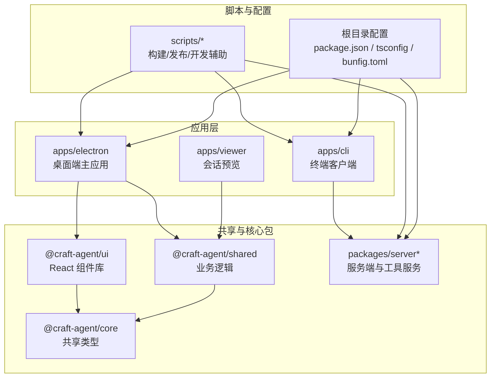
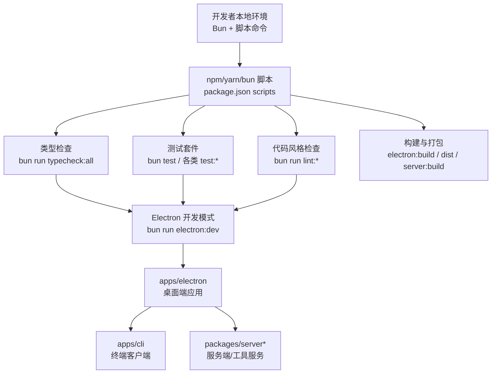
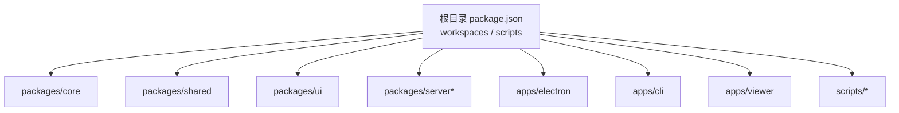

# 贡献指南

<cite>
**本文引用的文件**
- [CONTRIBUTING.md](file://CONTRIBUTING.md)
- [CODE_OF_CONDUCT.md](file://CODE_OF_CONDUCT.md)
- [README.md](file://README.md)
- [package.json](file://package.json)
- [.github/ISSUE_TEMPLATE/bug_report.yml](file://.github/ISSUE_TEMPLATE/bug_report.yml)
- [.github/ISSUE_TEMPLATE/feature_request.yml](file://.github/ISSUE_TEMPLATE/feature_request.yml)
- [.github/workflows/validate.yml](file://.github/workflows/validate.yml)
- [.github/workflows/validate-server.yml](file://.github/workflows/validate-server.yml)
- [apps/electron/eslint.config.mjs](file://apps/electron/eslint.config.mjs)
- [packages/ui/tsconfig.json](file://packages/ui/tsconfig.json)
- [bunfig.toml](file://bunfig.toml)
</cite>

## 目录

1. [简介](#简介)
2. [项目结构](#项目结构)
3. [核心组件](#核心组件)
4. [架构总览](#架构总览)
5. [详细组件分析](#详细组件分析)
6. [依赖分析](#依赖分析)
7. [性能考虑](#性能考虑)
8. [故障排查指南](#故障排查指南)
9. [结论](#结论)
10. [附录](#附录)

## 简介

本指南面向所有希望参与 Craft Agents 开源项目的贡献者，覆盖从环境搭建、开发流程、代码规范、分支与提交信息管理、测试与验证、到文档贡献与社区协作的全流程。文档中的所有流程、脚本与规则均以仓库现有文件为依据，确保新老贡献者都能快速上手并高质量交付。

## 项目结构

仓库采用 Monorepo 结构，主要由以下部分组成：

- apps：应用层
  - electron：桌面端主应用（React + Electron）
  - cli：终端客户端
  - viewer：会话预览应用
- packages：共享与核心包
  - core：共享类型定义
  - shared：业务逻辑与后端抽象
  - ui：React 组件库
  - server / server-core / session-mcp-server / session-tools-core / pi-agent-server：服务端与工具服务
- scripts：构建与发布脚本
- 根目录配置：工作流、贡献指南、行为准则等

图表来源

- [README.md](file://README.md#L343-L366)
- [package.json](file://package.json#L7-L11)

章节来源

- [README.md](file://README.md#L343-L366)
- [package.json](file://package.json#L7-L11)

## 核心组件

- 桌面端主应用（apps/electron）：Electron + React，负责会话管理、权限模式、自动化、主题系统、多文件差异视图等。
- 共享业务逻辑（packages/shared）：包含代理逻辑、认证、MCP 集成、会话持久化、状态系统、配置与凭据存储等。
- UI 组件库（packages/ui）：基于 shadcn/ui 的可复用 React 组件，配合 Tailwind CSS v4。
- 服务端与工具服务（packages/server\*）：远程无头服务器、MCP 工具服务、会话工具核心等。
- 终端客户端（apps/cli）：通过 WebSocket 连接服务端，支持健康检查、会话管理、RPC 调用与自检运行。

章节来源

- [README.md](file://README.md#L343-L366)
- [CONTRIBUTING.md](file://CONTRIBUTING.md#L93-L113)

## 架构总览

下图展示了贡献者在本地进行开发时的典型交互路径：本地开发命令、类型检查、测试与打包脚本，以及与 Electron 应用、CLI 客户端、服务端之间的关系。

图表来源

- [package.json](file://package.json#L12-L70)
- [README.md](file://README.md#L367-L381)

章节来源

- [package.json](file://package.json#L12-L70)
- [README.md](file://README.md#L367-L381)

## 详细组件分析

### 贡献流程与 Issue/PR 规范

- Issue 报告与功能请求模板：仓库提供了标准模板，便于贡献者按结构化方式描述问题或建议。
- PR 提交流程：标题清晰、描述完整、包含测试说明与必要截图；遵循分支命名约定与代码风格。
- 分支命名策略：使用前缀区分特性、修复、重构与文档更新，如 feature/_、fix/_、refactor/_、docs/_。
- 提交前检查：在提交 PR 前必须通过类型检查与测试校验，确保质量门槛。

章节来源

- [CONTRIBUTING.md](file://CONTRIBUTING.md#L39-L53)
- [CONTRIBUTING.md](file://CONTRIBUTING.md#L70-L91)
- [.github/ISSUE_TEMPLATE/bug_report.yml](file://.github/ISSUE_TEMPLATE/bug_report.yml)
- [.github/ISSUE_TEMPLATE/feature_request.yml](file://.github/ISSUE_TEMPLATE/feature_request.yml)

### 代码规范与风格

- 语言与工具：全项目使用 TypeScript；Electron 应用使用 ESLint 平台化配置与自定义规则插件。
- 自定义规则示例：
  - 禁止直接使用 localStorage（需通过统一存储封装）
  - 禁止硬编码路径分隔符（跨平台路径处理）
  - 禁止绕过链接拦截器打开文件（统一通过应用内预览）
  - 禁止在主进程中直接调用具体模型后端 SDK（需通过共享后端抽象层）
  - 禁止在特定模块中直接发起网络请求（需委托共享后端 API）
- UI 层 TS 配置：启用 JSX、声明输出与 bundler 解析，确保组件库与核心包的路径别名正确解析。

章节来源

- [apps/electron/eslint.config.mjs](file://apps/electron/eslint.config.mjs#L1-L226)
- [packages/ui/tsconfig.json](file://packages/ui/tsconfig.json#L1-L19)

### 类型检查与测试要求

- 类型检查：提供统一入口与分包执行脚本，确保所有包的类型安全。
- 测试：涵盖共享包、文档工具脚本与各类场景测试；CI 中同样执行相同校验。
- 本地验证：提供 validate:dev 一键执行类型检查、共享包测试与文档工具自检。

章节来源

- [package.json](file://package.json#L14-L29)
- [.github/workflows/validate.yml](file://.github/workflows/validate.yml)
- [.github/workflows/validate-server.yml](file://.github/workflows/validate-server.yml)

### 分支管理与提交信息

- 分支命名：feature/_、fix/_、refactor/_、docs/_ 等，保持描述性与一致性。
- 提交信息：强调清晰、可追溯，便于审阅与回溯。
- PR 描述：使用模板字段，明确变更摘要、改动点、测试方法与 UI 截图。

章节来源

- [CONTRIBUTING.md](file://CONTRIBUTING.md#L39-L53)
- [CONTRIBUTING.md](file://CONTRIBUTING.md#L77-L91)

### 本地开发工作流

- 环境准备：安装 Bun、Node.js 18+，克隆仓库后执行依赖安装。
- 开发启动：使用 electron:dev 快速热重载开发；也可使用 electron:start 打包后运行。
- 日志调试：开发模式自动开启日志；可通过命令行参数启用更详细日志。
- 环境变量：OAuth 凭证等需在 .env 中配置，避免提交至版本控制。

章节来源

- [CONTRIBUTING.md](file://CONTRIBUTING.md#L13-L35)
- [README.md](file://README.md#L367-L381)
- [README.md](file://README.md#L383-L394)

### 文档贡献

- 文档位置：docs/ 与各应用资源目录下的文档（如 apps/electron/resources/docs/）。
- 贡献方式：遵循 PR 流程，确保文档与代码同步更新；必要时补充示例与截图。
- 内容范围：功能说明、最佳实践、使用示例与常见问题解答。

章节来源

- [README.md](file://README.md#L343-L366)

### 社区行为准则与协作原则

- 行为准则：承诺营造包容、尊重、欢迎新人、接受建设性反馈的社区氛围。
- 举报渠道：遇到不当行为可发送邮件至指定邮箱。
- 成文条款：遵循 Contributor Covenant 2.1 版本。

章节来源

- [CODE_OF_CONDUCT.md](file://CODE_OF_CONDUCT.md#L1-L27)

### 安全与合规

- 许可证：贡献默认采用 Apache 2.0 许可。
- 安全披露：漏洞请参考 SECURITY.md。
- 本地 MCP 隔离：敏感环境变量过滤，防止凭证泄露；如需传递可显式在源配置中设置。

章节来源

- [CONTRIBUTING.md](file://CONTRIBUTING.md#L119-L122)
- [README.md](file://README.md#L623-L636)

## 依赖分析

- Monorepo 工作区：通过根目录 workspaces 管理多包与多应用，统一脚本与依赖。
- 构建与打包：Electron 主进程使用 esbuild，渲染端使用 Vite；服务端构建脚本集中于 scripts。
- 开发工具链：husky 预提交钩子、ESLint 平台化配置、Tailwind CSS v4、React 生态。

图表来源

- [package.json](file://package.json#L7-L11)
- [package.json](file://package.json#L12-L70)

章节来源

- [package.json](file://package.json#L7-L11)
- [package.json](file://package.json#L12-L70)

## 性能考虑

- 本地开发：优先使用 electron:dev 以获得热重载；仅在需要验证打包产物时使用 electron:start。
- 类型检查：在大型变更前先执行 typecheck:all，尽早发现潜在问题。
- 测试覆盖：针对共享包与文档工具的测试应尽量覆盖关键路径，减少回归风险。
- 构建优化：按平台与架构分别构建服务端二进制，减少不必要的重复构建。

章节来源

- [package.json](file://package.json#L14-L23)
- [package.json](file://package.json#L18-L23)

## 故障排查指南

- 开发日志：开发模式自动启用日志；可通过命令行参数或平台特定方式开启更详细日志。
- 平台日志路径：macOS、Windows、Linux 下的日志位置不同，按 README 中指引定位。
- 环境变量：OAuth 凭证需在 .env 中配置，且不要提交到版本控制。
- 本地 MCP 隔离：若出现凭证泄漏迹象，检查源配置是否显式传入所需环境变量。

章节来源

- [README.md](file://README.md#L581-L606)
- [README.md](file://README.md#L383-L394)
- [README.md](file://README.md#L625-L634)

## 结论

本指南基于仓库现有文件，为贡献者提供了从环境准备到代码提交、从风格规范到社区协作的完整路径。建议在首次贡献前通读 CONTRIBUTING.md 与 CODE_OF_CONDUCT.md，并在提交 PR 前确保类型检查、测试与风格检查全部通过。

## 附录

- 常用脚本与命令
  - 开发：electron:dev、electron:start、typecheck:all、test、lint
  - 服务端：server:start、server:dev、server:build
  - 构建：electron:build、electron:dist、viewer:dev、marketing:dev
- 预加载与网络拦截：bunfig.toml 中的 preload 配置用于统一网络拦截器注入。

章节来源

- [package.json](file://package.json#L12-L70)
- [bunfig.toml](file://bunfig.toml#L1-L2)
