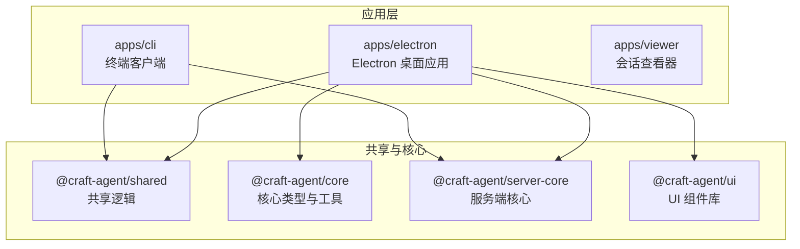
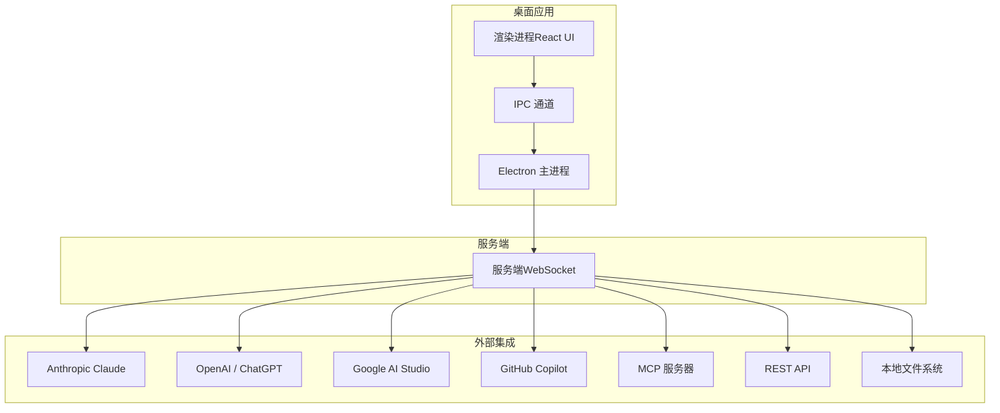
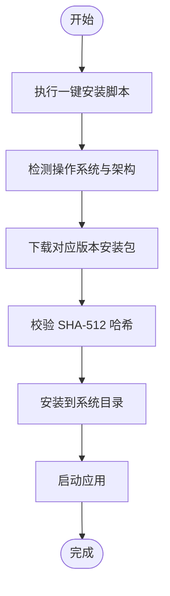
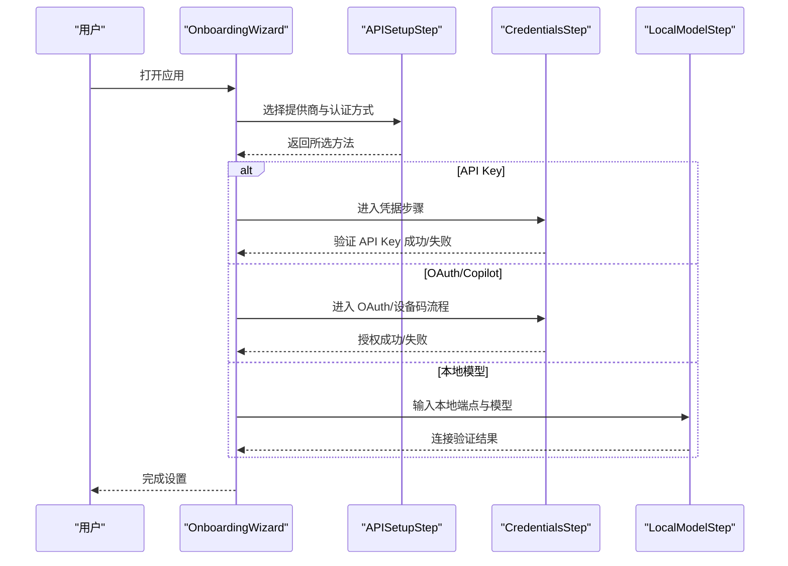
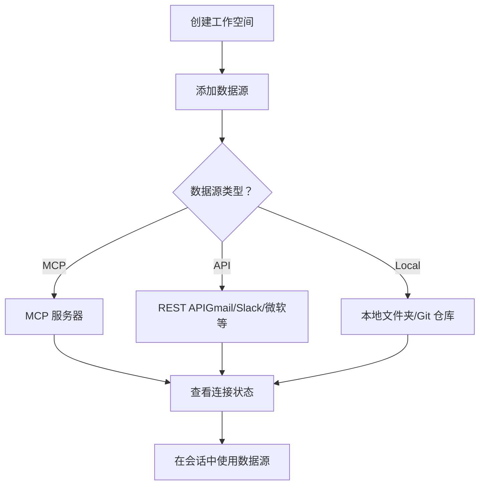
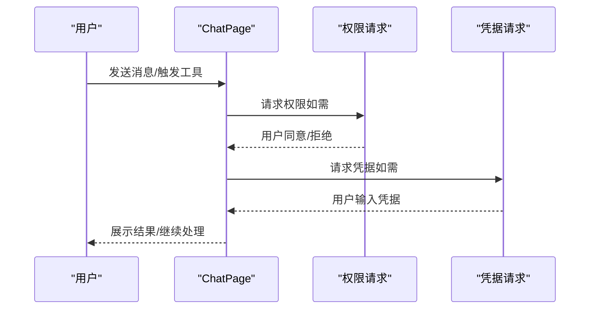
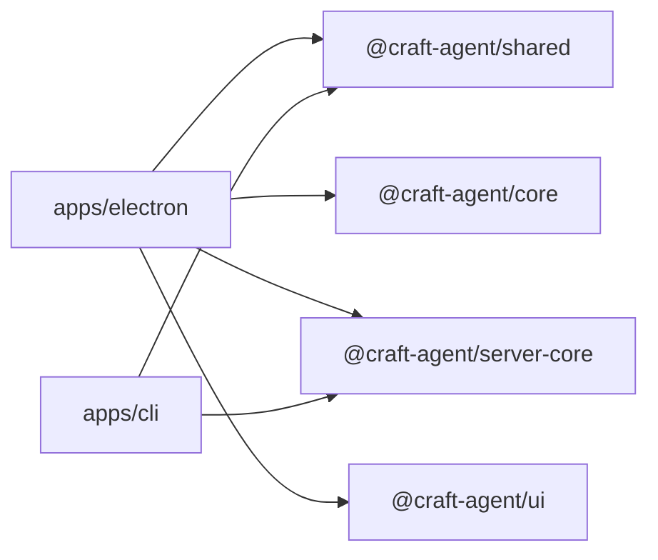

# 快速开始

<cite>
**本文引用的文件**
- [README.md](file://README.md)
- [install-app.sh](file://scripts/install-app.sh)
- [install-app.ps1](file://scripts/install-app.ps1)
- [package.json](file://apps/electron/package.json)
- [OnboardingWizard.tsx](file://apps/electron/src/renderer/components/onboarding/OnboardingWizard.tsx)
- [APISetupStep.tsx](file://apps/electron/src/renderer/components/onboarding/APISetupStep.tsx)
- [ProviderSelectStep.tsx](file://apps/electron/src/renderer/components/onboarding/ProviderSelectStep.tsx)
- [CredentialsStep.tsx](file://apps/electron/src/renderer/components/onboarding/CredentialsStep.tsx)
- [LocalModelStep.tsx](file://apps/electron/src/renderer/components/onboarding/LocalModelStep.tsx)
- [SourcesListPanel.tsx](file://apps/electron/src/renderer/components/app-shell/SourcesListPanel.tsx)
- [ChatPage.tsx](file://apps/electron/src/renderer/pages/ChatPage.tsx)
- [SettingsMenuSelect.tsx](file://apps/electron/src/renderer/components/settings/SettingsMenuSelect.tsx)
- [cli/package.json](file://apps/cli/package.json)
</cite>

## 目录

1. [简介](#简介)
2. [项目结构](#项目结构)
3. [核心组件](#核心组件)
4. [架构总览](#架构总览)
5. [详细组件分析](#详细组件分析)
6. [依赖关系分析](#依赖关系分析)
7. [性能注意事项](#性能注意事项)
8. [故障排除指南](#故障排除指南)
9. [结论](#结论)
10. [附录](#附录)

## 简介

Craft Agents 是一款面向多会话、多来源连接与技能扩展的桌面应用，支持与多种大模型提供商对接，并可连接 MCP 服务器、REST API 与本地文件系统。本“快速开始”旨在帮助你在 10 分钟内完成安装、基础配置与首次使用。

- 支持平台：macOS、Linux、Windows
- 安装方式：一行安装脚本或从源码构建
- 初始设置：通过“引导向导”完成 API 连接配置（Anthropic、Google AI Studio、ChatGPT Plus、GitHub Copilot 等）
- 工作空间与数据源：创建工作空间、连接数据源（MCP、REST、本地文件）
- 常见问题：提供常见配置问题与解决方案

## 项目结构

本仓库采用 Monorepo 结构，主要模块如下：

- apps/electron：Electron 桌面应用（主程序）
- apps/cli：终端客户端
- apps/viewer：会话查看器（Web）
- packages/\*：共享库与核心包
- scripts：安装与打包脚本

图表来源

- [package.json](file://apps/electron/package.json#L39-L75)
- [cli/package.json](file://apps/cli/package.json#L15-L18)

章节来源

- [README.md](file://README.md#L343-L366)

## 核心组件

- 引导向导（OnboardingWizard）：贯穿“欢迎 → 提供商选择 → 凭据/本地模型 → 完成”的完整流程
- API 设置步骤（APISetupStep）：按提供商分段筛选，支持 Claude、Pi 后端及多种认证方式
- 凭据步骤（CredentialsStep）：API Key 或 OAuth 流程，含两步授权码输入与设备码授权
- 本地模型步骤（LocalModelStep）：Ollama 等本地模型配置
- 数据源列表（SourcesListPanel）：展示与管理 MCP、API、本地源
- 聊天页（ChatPage）：会话聊天界面与权限/凭据请求处理
- 设置下拉（SettingsMenuSelect）：通用设置项选择控件

章节来源

- [OnboardingWizard.tsx](file://apps/electron/src/renderer/components/onboarding/OnboardingWizard.tsx#L11-L32)
- [APISetupStep.tsx](file://apps/electron/src/renderer/components/onboarding/APISetupStep.tsx#L36-L62)
- [CredentialsStep.tsx](file://apps/electron/src/renderer/components/onboarding/CredentialsStep.tsx#L22-L43)
- [LocalModelStep.tsx](file://apps/electron/src/renderer/components/onboarding/LocalModelStep.tsx#L14-L25)
- [SourcesListPanel.tsx](file://apps/electron/src/renderer/components/app-shell/SourcesListPanel.tsx#L13-L31)
- [ChatPage.tsx](file://apps/electron/src/renderer/pages/ChatPage.tsx#L24-L25)
- [SettingsMenuSelect.tsx](file://apps/electron/src/renderer/components/settings/SettingsMenuSelect.tsx#L15-L45)

## 架构总览

桌面应用通过 Electron 主进程与渲染进程交互，渲染层使用 React + shadcn/ui，通过 IPC 与主进程通信；CLI 客户端通过 WebSocket 连接到服务端，实现无头运行与自动化。

图表来源

- [README.md](file://README.md#L343-L366)
- [package.json](file://apps/electron/package.json#L39-L75)

## 详细组件分析

### 一、安装与启动（10 分钟入门）

- 一键安装（推荐）
  - macOS / Linux：使用安装脚本自动检测架构、下载、校验并安装到系统路径
  - Windows：PowerShell 一键脚本，自动下载、校验并安装
- 从源码构建
  - 克隆仓库、安装依赖、启动开发或打包构建

图表来源

- [install-app.sh](file://scripts/install-app.sh#L21-L159)
- [install-app.ps1](file://scripts/install-app.ps1#L17-L113)

章节来源

- [README.md](file://README.md#L61-L82)
- [install-app.sh](file://scripts/install-app.sh#L1-L405)
- [install-app.ps1](file://scripts/install-app.ps1#L1-L265)

### 二、初始设置向导（API 连接配置）

引导向导包含以下步骤：欢迎、提供商选择、凭据/本地模型、完成。支持的提供商与认证方式：

- Anthropic：Claude Pro/Max（OAuth）、Anthropic API Key（自定义端点）
- Google AI Studio：API Key
- ChatGPT Plus / Pro：Codex OAuth（Pi 后端）
- GitHub Copilot：OAuth（Pi 后端，设备码流程）
- 本地模型：Ollama 等本地 OpenAI 兼容端点

图表来源

- [OnboardingWizard.tsx](file://apps/electron/src/renderer/components/onboarding/OnboardingWizard.tsx#L114-L184)
- [APISetupStep.tsx](file://apps/electron/src/renderer/components/onboarding/APISetupStep.tsx#L218-L274)
- [CredentialsStep.tsx](file://apps/electron/src/renderer/components/onboarding/CredentialsStep.tsx#L45-L299)
- [LocalModelStep.tsx](file://apps/electron/src/renderer/components/onboarding/LocalModelStep.tsx#L34-L149)

章节来源

- [README.md](file://README.md#L101-L107)
- [APISetupStep.tsx](file://apps/electron/src/renderer/components/onboarding/APISetupStep.tsx#L72-L108)
- [CredentialsStep.tsx](file://apps/electron/src/renderer/components/onboarding/CredentialsStep.tsx#L89-L191)
- [LocalModelStep.tsx](file://apps/electron/src/renderer/components/onboarding/LocalModelStep.tsx#L68-L149)

### 三、创建工作空间与连接数据源

- 创建工作空间：在应用中新建工作空间以组织会话
- 连接数据源：
  - MCP 服务器：Craft、Linear、GitHub、Notion 等
  - REST API：Gmail、Calendar、Drive、Slack、Microsoft 等
  - 本地文件：文件系统、Obsidian 仓库、Git 仓库等
- 在“数据源列表”中查看状态（已连接/需要授权/断开/未测试/禁用）

图表来源

- [SourcesListPanel.tsx](file://apps/electron/src/renderer/components/app-shell/SourcesListPanel.tsx#L13-L31)
- [README.md](file://README.md#L119-L128)

章节来源

- [README.md](file://README.md#L105-L106)
- [SourcesListPanel.tsx](file://apps/electron/src/renderer/components/app-shell/SourcesListPanel.tsx#L44-L129)

### 四、开始聊天与权限/凭据处理

- 在聊天页中发送消息、切换模型/连接、管理标签与状态
- 当工具调用或会话需要权限/凭据时，应用会弹出确认/输入框

图表来源

- [ChatPage.tsx](file://apps/electron/src/renderer/pages/ChatPage.tsx#L127-L129)
- [ChatPage.tsx](file://apps/electron/src/renderer/pages/ChatPage.tsx#L609-L646)

章节来源

- [ChatPage.tsx](file://apps/electron/src/renderer/pages/ChatPage.tsx#L31-L663)

### 五、CLI 客户端（可选）

- 通过 CLI 连接已运行的服务端，进行健康检查、列出会话、发送消息、运行一次性任务等
- 支持多提供商与自定义端点

章节来源

- [README.md](file://README.md#L244-L341)
- [cli/package.json](file://apps/cli/package.json#L10-L13)

## 依赖关系分析

- 应用依赖 Electron、React、shadcn/ui、ws 等
- 共享与核心包为各应用提供统一的类型、配置与业务逻辑
- CLI 依赖服务端核心与共享库，通过 WebSocket 与服务端通信

图表来源

- [package.json](file://apps/electron/package.json#L39-L75)
- [cli/package.json](file://apps/cli/package.json#L15-L18)

章节来源

- [package.json](file://apps/electron/package.json#L17-L38)
- [cli/package.json](file://apps/cli/package.json#L1-L25)

## 性能注意事项

- 使用本地模型（如 Ollama）可降低网络延迟，但需关注模型选择与资源占用
- 大响应内容会自动摘要，避免传输与解析开销
- 会话懒加载与消息分页提升首屏性能
- 通过设置默认模型与连接，减少每次切换成本

## 故障排除指南

- 启动调试日志
  - macOS/Linux/Windows 可通过命令行参数启用调试模式，查看日志输出位置
- 安装失败
  - 校验下载包哈希是否匹配；若不匹配，重新执行安装脚本
  - Windows 需允许安装程序运行；必要时添加到 PATH
- OAuth 授权问题
  - 确认浏览器可用且网络可达；若为 Claude 需要手动输入授权码
  - Copilot 使用设备码流程，复制验证码并在浏览器完成授权
- 本地模型无法连接
  - 确认本地服务端口与模型名称正确；支持逗号分隔多个模型
- 权限/凭据弹窗未出现
  - 检查会话权限模式与工具调用范围；必要时在设置中调整

章节来源

- [README.md](file://README.md#L581-L606)
- [install-app.sh](file://scripts/install-app.sh#L221-L236)
- [install-app.ps1](file://scripts/install-app.ps1#L178-L192)
- [CredentialsStep.tsx](file://apps/electron/src/renderer/components/onboarding/CredentialsStep.tsx#L194-L254)
- [LocalModelStep.tsx](file://apps/electron/src/renderer/components/onboarding/LocalModelStep.tsx#L46-L66)

## 结论

通过本“快速开始”，你可以在 10 分钟内完成安装、配置 API 连接、创建工作空间并连接数据源，随后即可开始使用 Craft Agents 的多会话与多来源能力。遇到问题时，可参考故障排除章节或查看应用日志定位原因。

## 附录

- 一键安装命令
  - macOS / Linux：
    - curl -fsSL agents.craft.do/install-app.sh | bash
  - Windows（PowerShell）：
    - irm agents.craft.do/install-app.ps1 | iex
- 从源码构建
  - git clone 仓库地址
  - cd craft-agents-oss
  - bun install
  - bun run electron:start

章节来源

- [README.md](file://README.md#L61-L82)
- [README.md](file://README.md#L367-L381)
