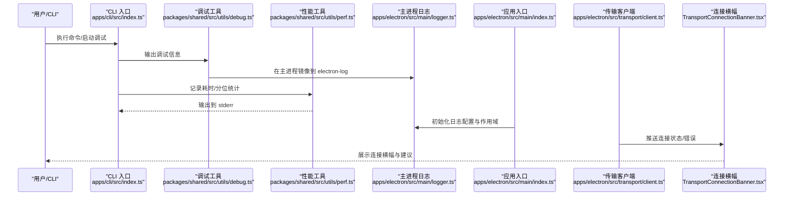
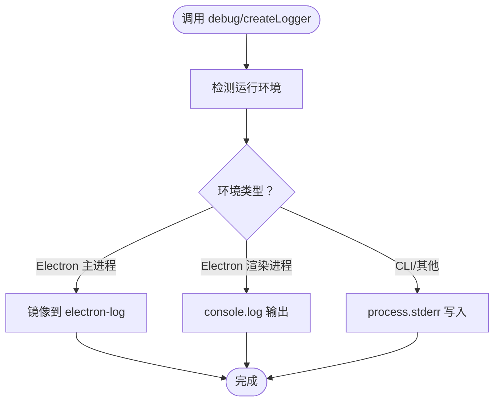
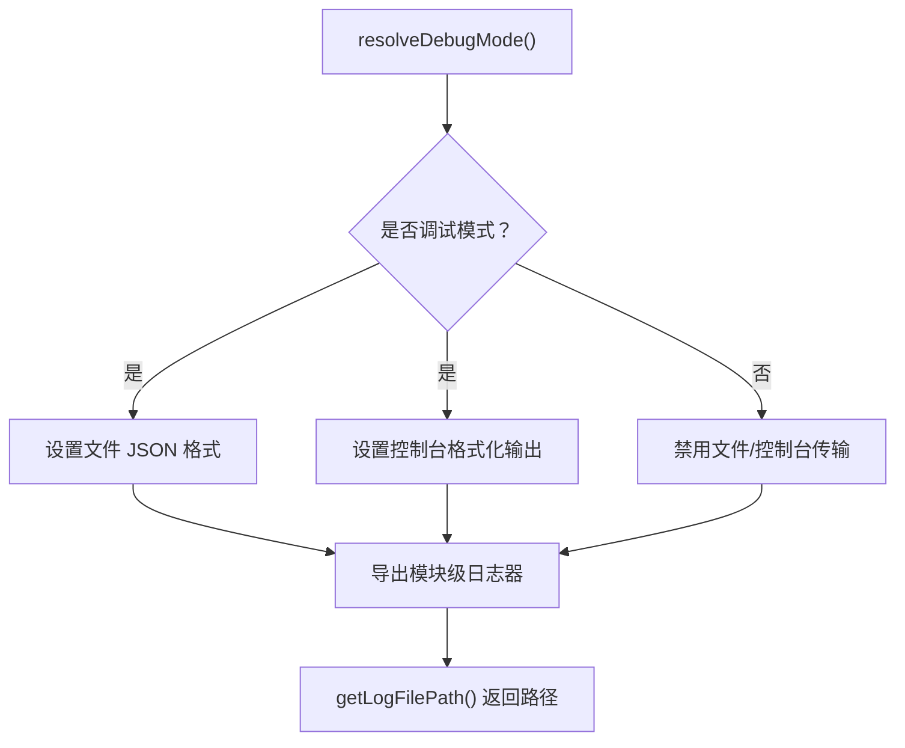
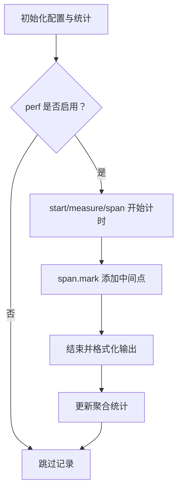
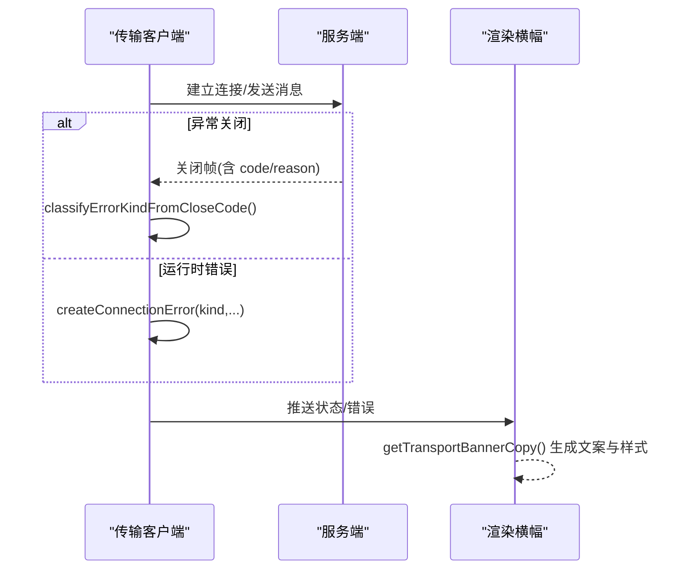
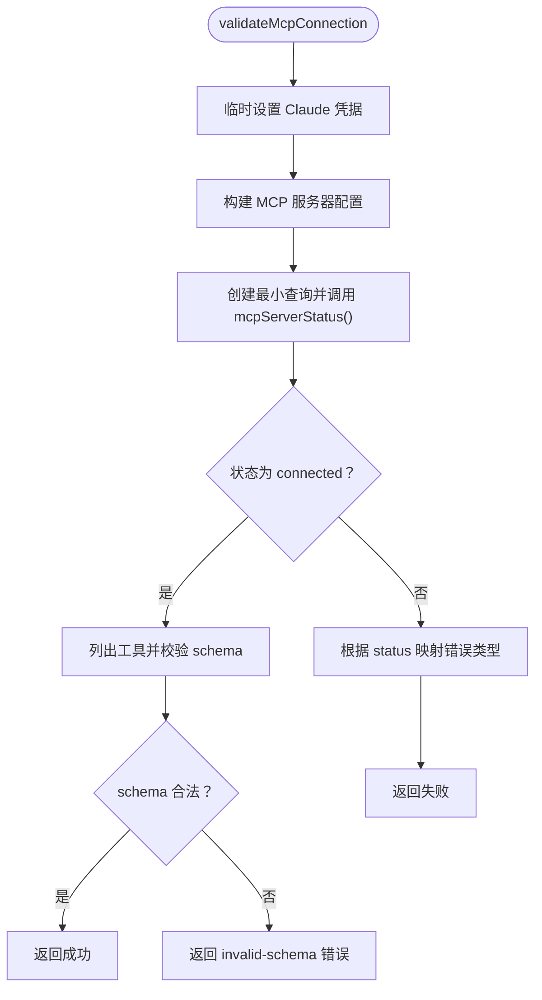
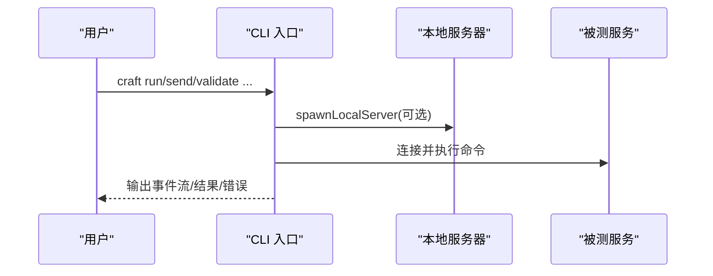
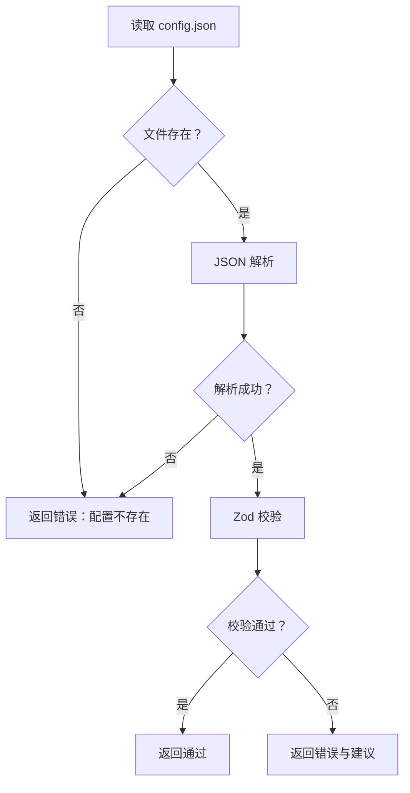
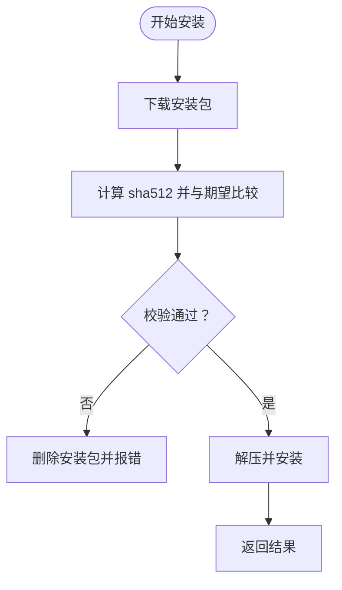
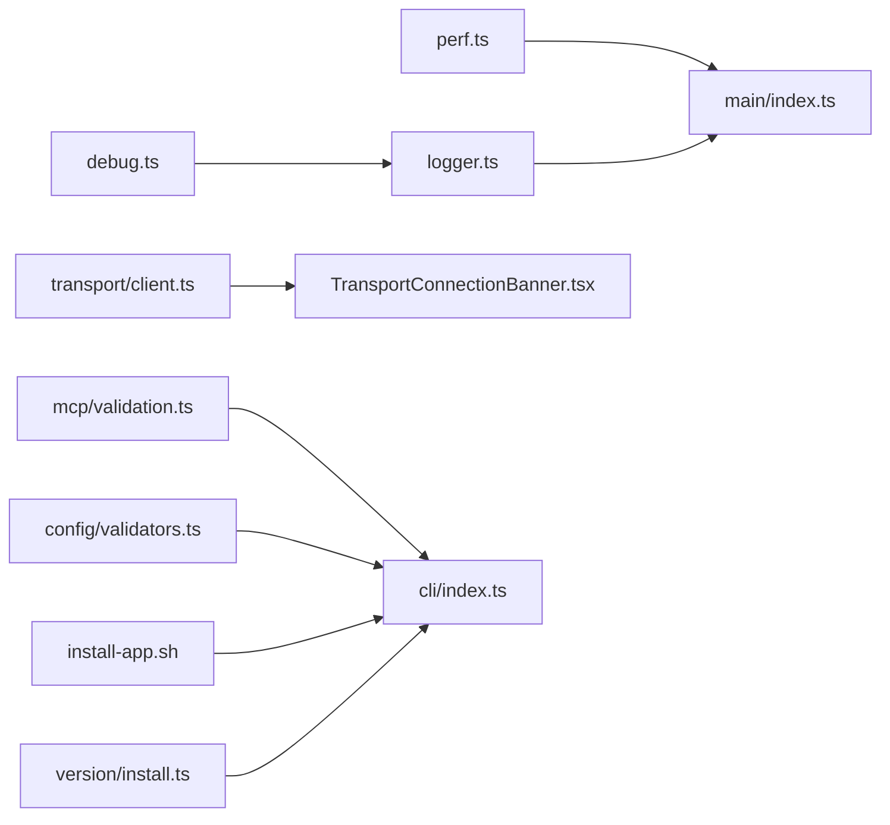

# 故障排除和调试

<cite>
**本文引用的文件**
- [packages/shared/src/utils/debug.ts](file://packages/shared/src/utils/debug.ts)
- [apps/electron/src/main/logger.ts](file://apps/electron/src/main/logger.ts)
- [apps/electron/src/main/index.ts](file://apps/electron/src/main/index.ts)
- [packages/shared/src/utils/perf.ts](file://packages/shared/src/utils/perf.ts)
- [apps/electron/src/transport/client.ts](file://apps/electron/src/transport/client.ts)
- [apps/electron/src/renderer/components/app-shell/TransportConnectionBanner.tsx](file://apps/electron/src/renderer/components/app-shell/TransportConnectionBanner.tsx)
- [packages/shared/src/mcp/validation.ts](file://packages/shared/src/mcp/validation.ts)
- [apps/cli/src/index.ts](file://apps/cli/src/index.ts)
- [packages/shared/src/config/validators.ts](file://packages/shared/src/config/validators.ts)
- [packages/shared/src/agent/claude-agent.ts](file://packages/shared/src/agent/claude-agent.ts)
- [scripts/install-app.sh](file://scripts/install-app.sh)
- [packages/shared/src/version/install.ts](file://packages/shared/src/version/install.ts)
</cite>

## 目录

1. [简介](#简介)
2. [项目结构](#项目结构)
3. [核心组件](#核心组件)
4. [架构总览](#架构总览)
5. [详细组件分析](#详细组件分析)
6. [依赖关系分析](#依赖关系分析)
7. [性能考虑](#性能考虑)
8. [故障排除指南](#故障排除指南)
9. [结论](#结论)
10. [附录](#附录)

## 简介

本文件面向 Craft Agents 的开发者与运维人员，系统化梳理日志系统、调试模式、错误追踪与性能监控的实现与使用方式，并结合真实代码路径给出可操作的排障步骤与最佳实践。内容覆盖 Electron 主进程日志、通用调试工具、性能指标采集、传输层连接状态可视化、MCP 连接验证、CLI 调试与常见安装问题定位等。

## 项目结构

围绕“日志与调试”主题，相关模块主要分布在以下位置：

- 共享调试与性能工具：packages/shared/src/utils/debug.ts、packages/shared/src/utils/perf.ts
- Electron 主进程日志与调试开关：apps/electron/src/main/logger.ts、apps/electron/src/main/index.ts
- 传输层连接状态与错误分类：apps/electron/src/transport/client.ts、apps/electron/src/renderer/components/app-shell/TransportConnectionBanner.tsx
- MCP 连接验证与错误映射：packages/shared/src/mcp/validation.ts
- CLI 调试与输出：apps/cli/src/index.ts
- 配置校验与常见问题提示：packages/shared/src/config/validators.ts
- 安装流程与常见问题：scripts/install-app.sh、packages/shared/src/version/install.ts
- SDK 错误解析与调试文件读取：packages/shared/src/agent/claude-agent.ts

```mermaid
graph TB
subgraph "共享层"
D["debug 工具<br/>packages/shared/src/utils/debug.ts"]
P["perf 性能工具<br/>packages/shared/src/utils/perf.ts"]
M["MCP 连接验证<br/>packages/shared/src/mcp/validation.ts"]
CV["配置校验<br/>packages/shared/src/config/validators.ts"]
end
subgraph "Electron 主进程"
L["主进程日志配置<br/>apps/electron/src/main/logger.ts"]
MI["应用入口与调试开关<br/>apps/electron/src/main/index.ts"]
T["传输客户端<br/>apps/electron/src/transport/client.ts"]
B["连接状态横幅<br/>apps/electron/src/renderer/components/app-shell/TransportConnectionBanner.tsx"]
end
subgraph "CLI"
CLI["CLI 入口与调试输出<br/>apps/cli/src/index.ts"]
end
subgraph "安装与版本"
INST["安装脚本<br/>scripts/install-app.sh"]
VER["版本安装流程<br/>packages/shared/src/version/install.ts"]
end
D --> L
P --> MI
L --> MI
T --> B
M --> CLI
CV --> CLI
INST --> CLI
VER --> CLI
```

图示来源

- [packages/shared/src/utils/debug.ts](file://packages/shared/src/utils/debug.ts#L1-L162)
- [apps/electron/src/main/logger.ts](file://apps/electron/src/main/logger.ts#L1-L80)
- [apps/electron/src/main/index.ts](file://apps/electron/src/main/index.ts#L105-L110)
- [packages/shared/src/utils/perf.ts](file://packages/shared/src/utils/perf.ts#L1-L418)
- [apps/electron/src/transport/client.ts](file://apps/electron/src/transport/client.ts#L201-L727)
- [apps/electron/src/renderer/components/app-shell/TransportConnectionBanner.tsx](file://apps/electron/src/renderer/components/app-shell/TransportConnectionBanner.tsx#L1-L112)
- [packages/shared/src/mcp/validation.ts](file://packages/shared/src/mcp/validation.ts#L137-L336)
- [apps/cli/src/index.ts](file://apps/cli/src/index.ts#L664-L691)
- [packages/shared/src/config/validators.ts](file://packages/shared/src/config/validators.ts#L131-L176)
- [scripts/install-app.sh](file://scripts/install-app.sh#L221-L241)
- [packages/shared/src/version/install.ts](file://packages/shared/src/version/install.ts#L70-L106)

章节来源

- [packages/shared/src/utils/debug.ts](file://packages/shared/src/utils/debug.ts#L1-L162)
- [apps/electron/src/main/logger.ts](file://apps/electron/src/main/logger.ts#L1-L80)
- [apps/electron/src/main/index.ts](file://apps/electron/src/main/index.ts#L105-L110)

## 核心组件

- 调试日志工具（跨环境）：支持按环境自动路由到控制台或文件；支持作用域化日志；支持循环对象安全序列化；支持在 Electron 主进程镜像到 electron-log。
- 主进程日志配置：根据调试模式启用/禁用文件与控制台传输；提供带作用域的模块级日志器；暴露当前日志文件路径查询。
- 性能指标工具：基于高精度计时，聚合统计与分位数，仅在调试或显式开启时输出；输出到 stderr，避免污染 stdout。
- 传输层连接状态：维护连接状态、错误类型分类、重连尝试次数与下次重连时间；渲染端以横幅形式展示连接状态与错误原因。
- MCP 连接验证：通过 SDK 发起最小查询，快速判断服务器连通性与工具 schema 合法性；提供用户友好错误消息映射。
- CLI 调试与输出：支持 --debug 触发调试模式；命令行输出到 stdout/stderr；支持 spinner、颜色、事件监听等调试辅助。
- 配置校验：对 config.json 做存在性、JSON 解析与 Zod Schema 校验，返回错误与建议。
- 安装与版本：安装脚本进行校验和验证；版本安装流程记录调试信息并返回结果。

章节来源

- [packages/shared/src/utils/debug.ts](file://packages/shared/src/utils/debug.ts#L46-L161)
- [apps/electron/src/main/logger.ts](file://apps/electron/src/main/logger.ts#L30-L79)
- [packages/shared/src/utils/perf.ts](file://packages/shared/src/utils/perf.ts#L74-L148)
- [apps/electron/src/transport/client.ts](file://apps/electron/src/transport/client.ts#L511-L727)
- [apps/electron/src/renderer/components/app-shell/TransportConnectionBanner.tsx](file://apps/electron/src/renderer/components/app-shell/TransportConnectionBanner.tsx#L17-L79)
- [packages/shared/src/mcp/validation.ts](file://packages/shared/src/mcp/validation.ts#L137-L336)
- [apps/cli/src/index.ts](file://apps/cli/src/index.ts#L664-L691)
- [packages/shared/src/config/validators.ts](file://packages/shared/src/config/validators.ts#L131-L176)
- [scripts/install-app.sh](file://scripts/install-app.sh#L221-L241)
- [packages/shared/src/version/install.ts](file://packages/shared/src/version/install.ts#L70-L106)

## 架构总览

下图展示了从用户触发到日志/性能输出、连接状态反馈与错误映射的关键链路。



图示来源

- [apps/cli/src/index.ts](file://apps/cli/src/index.ts#L664-L691)
- [packages/shared/src/utils/debug.ts](file://packages/shared/src/utils/debug.ts#L99-L118)
- [apps/electron/src/main/logger.ts](file://apps/electron/src/main/logger.ts#L30-L60)
- [apps/electron/src/main/index.ts](file://apps/electron/src/main/index.ts#L105-L110)
- [packages/shared/src/utils/perf.ts](file://packages/shared/src/utils/perf.ts#L124-L148)
- [apps/electron/src/transport/client.ts](file://apps/electron/src/transport/client.ts#L511-L540)
- [apps/electron/src/renderer/components/app-shell/TransportConnectionBanner.tsx](file://apps/electron/src/renderer/components/app-shell/TransportConnectionBanner.tsx#L81-L112)

## 详细组件分析

### 组件一：调试日志系统（跨环境）

- 自动环境检测：区分 Electron 主进程、渲染进程与 CLI。
- 输出路由：渲染进程使用 console.log（便于 DevTools），主进程同时写入文件与控制台；CLI 使用 stderr 避免污染 stdout。
- 作用域化日志：createLogger 提供 [scope] 前缀，便于模块级排查。
- 循环对象安全序列化：避免 JSON.stringify 抛错。
- Electron 主进程镜像：当可用时将调试信息同步到 electron-log，确保 main.log 可见。



图示来源

- [packages/shared/src/utils/debug.ts](file://packages/shared/src/utils/debug.ts#L10-L25)
- [packages/shared/src/utils/debug.ts](file://packages/shared/src/utils/debug.ts#L99-L118)
- [packages/shared/src/utils/debug.ts](file://packages/shared/src/utils/debug.ts#L148-L161)

章节来源

- [packages/shared/src/utils/debug.ts](file://packages/shared/src/utils/debug.ts#L1-L162)

### 组件二：主进程日志配置与作用域

- 调试模式判定：优先级策略决定是否启用调试（命令行参数、打包态、运行时启发式）。
- 传输配置：调试模式下启用文件与控制台传输；控制台格式化输出；文件大小限制。
- 作用域日志器：导出 main/session/handler/window/agent/search 等模块级日志器。
- 日志文件路径：在调试模式下可查询当前日志文件绝对路径。



图示来源

- [apps/electron/src/main/logger.ts](file://apps/electron/src/main/logger.ts#L12-L26)
- [apps/electron/src/main/logger.ts](file://apps/electron/src/main/logger.ts#L30-L60)
- [apps/electron/src/main/logger.ts](file://apps/electron/src/main/logger.ts#L62-L77)

章节来源

- [apps/electron/src/main/logger.ts](file://apps/electron/src/main/logger.ts#L1-L80)

### 组件三：性能指标工具（perf）

- 启用条件：显式 setPerfEnabled 或与调试模式联动。
- 指标存储：最近指标队列与聚合统计（含 p50/p95）。
- 输出通道：仅在启用时输出到 stderr，避免干扰。
- 使用方式：start/measure/measureSync/span，支持 marks 与 metadata。



图示来源

- [packages/shared/src/utils/perf.ts](file://packages/shared/src/utils/perf.ts#L48-L94)
- [packages/shared/src/utils/perf.ts](file://packages/shared/src/utils/perf.ts#L124-L148)
- [packages/shared/src/utils/perf.ts](file://packages/shared/src/utils/perf.ts#L263-L301)

章节来源

- [packages/shared/src/utils/perf.ts](file://packages/shared/src/utils/perf.ts#L1-L418)

### 组件四：传输层连接状态与错误分类

- 连接状态：维护 mode/status/url/attempt/updatedAt 等字段；复制 lastError/lastClose 以避免外部修改。
- 错误分类：根据关闭码与错误字符串归类为 auth/protocol/timeout/network/server/unknown。
- 重连逻辑：清理定时器、关闭连接、拒绝挂起请求、触发重连。
- 渲染端横幅：根据状态与错误生成标题、描述、色调与重试按钮提示。



图示来源

- [apps/electron/src/transport/client.ts](file://apps/electron/src/transport/client.ts#L511-L540)
- [apps/electron/src/transport/client.ts](file://apps/electron/src/transport/client.ts#L700-L727)
- [apps/electron/src/renderer/components/app-shell/TransportConnectionBanner.tsx](file://apps/electron/src/renderer/components/app-shell/TransportConnectionBanner.tsx#L17-L79)

章节来源

- [apps/electron/src/transport/client.ts](file://apps/electron/src/transport/client.ts#L215-L229)
- [apps/electron/src/transport/client.ts](file://apps/electron/src/transport/client.ts#L511-L727)
- [apps/electron/src/renderer/components/app-shell/TransportConnectionBanner.tsx](file://apps/electron/src/renderer/components/app-shell/TransportConnectionBanner.tsx#L1-L112)

### 组件五：MCP 连接验证与错误映射

- 连接验证：通过 SDK 创建最小查询，调用 mcpServerStatus() 快速判断；成功后列出工具并校验输入 schema。
- 错误映射：优先使用 SDK 的 error 字段；否则根据 errorType 返回用户友好提示；本地 stdio 进程失败与超时有专门提示。
- 失败场景：认证过期、协议不匹配、网络不可达、schema 不合法等。



图示来源

- [packages/shared/src/mcp/validation.ts](file://packages/shared/src/mcp/validation.ts#L137-L336)
- [packages/shared/src/mcp/validation.ts](file://packages/shared/src/mcp/validation.ts#L553-L577)

章节来源

- [packages/shared/src/mcp/validation.ts](file://packages/shared/src/mcp/validation.ts#L137-L336)

### 组件六：CLI 调试与输出

- 参数解析：支持 --url/--token/--timeout/--json/--tls-ca 等；支持环境变量回退。
- 命令集：ping/health/versions/sessions/sources/run/send/invoke/listen/validate 等。
- 调试输出：在调试模式下输出详细信息；支持 spinner、颜色、事件监听。
- 服务器验证：cmdValidate 支持本地启动或连接指定服务器，输出验证步骤摘要。



图示来源

- [apps/cli/src/index.ts](file://apps/cli/src/index.ts#L664-L691)
- [apps/cli/src/index.ts](file://apps/cli/src/index.ts#L578-L662)

章节来源

- [apps/cli/src/index.ts](file://apps/cli/src/index.ts#L1-L800)

### 组件七：配置校验与常见问题提示

- 存在性检查：config.json 是否存在。
- JSON 解析：捕获解析异常并返回错误与建议。
- Schema 校验：使用 Zod 对配置进行结构校验，返回具体问题列表。



图示来源

- [packages/shared/src/config/validators.ts](file://packages/shared/src/config/validators.ts#L131-L176)

章节来源

- [packages/shared/src/config/validators.ts](file://packages/shared/src/config/validators.ts#L131-L176)

### 组件八：安装流程与常见问题

- 校验和验证：脚本对安装包进行 sha512 校验，失败则删除并报错。
- 版本安装：记录调试信息（URL、SHA256、大小），下载并安装，返回成功/失败。
- 常见问题：校验失败、平台不匹配、权限不足、网络中断。



图示来源

- [scripts/install-app.sh](file://scripts/install-app.sh#L221-L241)
- [packages/shared/src/version/install.ts](file://packages/shared/src/version/install.ts#L70-L106)

章节来源

- [scripts/install-app.sh](file://scripts/install-app.sh#L221-L241)
- [packages/shared/src/version/install.ts](file://packages/shared/src/version/install.ts#L70-L106)

## 依赖关系分析

- debug/perf 作为共享工具被 CLI 与 Electron 主进程共同使用。
- Electron 主进程日志器依赖 electron-log；在调试模式下启用文件与控制台传输。
- 传输客户端负责连接状态与错误分类，并通过 IPC 将状态上报至主进程日志。
- 渲染端连接横幅消费传输状态，生成用户可见的提示文案。
- MCP 验证依赖 SDK 与共享工具，返回结构化错误类型，供上层 UI 与 CLI 使用。



图示来源

- [packages/shared/src/utils/debug.ts](file://packages/shared/src/utils/debug.ts#L1-L162)
- [apps/electron/src/main/logger.ts](file://apps/electron/src/main/logger.ts#L1-L80)
- [apps/electron/src/main/index.ts](file://apps/electron/src/main/index.ts#L93-L110)
- [packages/shared/src/utils/perf.ts](file://packages/shared/src/utils/perf.ts#L1-L418)
- [apps/electron/src/transport/client.ts](file://apps/electron/src/transport/client.ts#L507-L540)
- [apps/electron/src/renderer/components/app-shell/TransportConnectionBanner.tsx](file://apps/electron/src/renderer/components/app-shell/TransportConnectionBanner.tsx#L1-L112)
- [packages/shared/src/mcp/validation.ts](file://packages/shared/src/mcp/validation.ts#L137-L336)
- [apps/cli/src/index.ts](file://apps/cli/src/index.ts#L664-L691)
- [packages/shared/src/config/validators.ts](file://packages/shared/src/config/validators.ts#L131-L176)
- [scripts/install-app.sh](file://scripts/install-app.sh#L221-L241)
- [packages/shared/src/version/install.ts](file://packages/shared/src/version/install.ts#L70-L106)

章节来源

- [apps/electron/src/main/index.ts](file://apps/electron/src/main/index.ts#L93-L110)

## 性能考虑

- 性能工具默认关闭，需通过调试模式或显式 setPerfEnabled 启用。
- 输出到 stderr，避免影响 stdout 流。
- 聚合统计包含 p50/p95 分位，便于识别尾延迟。
- 建议在开发与回归测试中启用，生产环境保持默认关闭。

章节来源

- [packages/shared/src/utils/perf.ts](file://packages/shared/src/utils/perf.ts#L74-L94)

## 故障排除指南

### 如何启用调试模式

- CLI：通过命令行参数触发调试模式，随后 debug/perf 工具会生效。
- Electron 主进程：应用入口在调试模式下会设置 CRAFT_DEBUG=1、启用 debug 与 perf。

章节来源

- [apps/electron/src/main/index.ts](file://apps/electron/src/main/index.ts#L105-L110)
- [packages/shared/src/utils/debug.ts](file://packages/shared/src/utils/debug.ts#L49-L51)

### 查看日志文件

- Electron 主进程：在调试模式下可通过 getLogFilePath 获取当前日志文件路径；日志同时输出到控制台与文件。
- 渲染进程：调试日志通过 console.log 输出，可在 DevTools 中查看。

章节来源

- [apps/electron/src/main/logger.ts](file://apps/electron/src/main/logger.ts#L74-L77)
- [packages/shared/src/utils/debug.ts](file://packages/shared/src/utils/debug.ts#L108-L111)

### 连接问题诊断

- 传输层状态：检查连接状态、错误类型与重连尝试次数；根据错误类型采取不同措施（认证、协议、超时、网络）。
- 渲染端横幅：根据状态显示标题、描述与重试按钮，帮助用户快速定位问题。
- MCP 连接：使用 validateMcpConnection 快速判断服务器连通性与工具 schema 合法性。

章节来源

- [apps/electron/src/transport/client.ts](file://apps/electron/src/transport/client.ts#L511-L727)
- [apps/electron/src/renderer/components/app-shell/TransportConnectionBanner.tsx](file://apps/electron/src/renderer/components/app-shell/TransportConnectionBanner.tsx#L17-L79)
- [packages/shared/src/mcp/validation.ts](file://packages/shared/src/mcp/validation.ts#L137-L336)

### 配置问题诊断

- config.json 缺失或格式错误：使用配置校验工具获取具体错误与修复建议。
- 建议：先运行 setup 创建初始配置，再逐步调整字段。

章节来源

- [packages/shared/src/config/validators.ts](file://packages/shared/src/config/validators.ts#L131-L176)

### 安装问题诊断

- 校验和失败：脚本会删除安装包并输出期望与实际值，确认下载完整性与来源可信。
- 权限问题：在某些平台可能因权限导致安装失败，检查文件权限与执行权限。
- 网络中断：重试下载或切换网络环境。

章节来源

- [scripts/install-app.sh](file://scripts/install-app.sh#L221-L241)

### SDK 错误解析与调试文件读取

- SDK 错误：优先使用 SDK 的 error 字段；否则根据 errorType 返回用户友好提示。
- 调试文件读取：在特定场景下读取 SDK 写入的调试文件，提取最近错误信息用于展示。

章节来源

- [packages/shared/src/mcp/validation.ts](file://packages/shared/src/mcp/validation.ts#L283-L336)
- [packages/shared/src/agent/claude-agent.ts](file://packages/shared/src/agent/claude-agent.ts#L1821-L1874)

### 常见问题与解决方案清单

- 远程服务器无法连接
  - 检查 URL 与 Token；确认网络连通性；查看连接横幅中的错误提示。
  - 参考：传输客户端错误分类与渲染横幅文案。
- 认证失败
  - 核对 CRAFT_SERVER_TOKEN 或 OAuth 凭据；重新登录或刷新令牌。
  - 参考：getTransportBannerCopy 中的认证失败提示。
- 协议不匹配
  - 检查客户端与服务端版本兼容性；升级到兼容版本。
- 超时
  - 增加超时时间或检查服务器负载；查看重试间隔与尝试次数。
- 网络异常
  - 检查防火墙/代理；确认主机与端口可达。
- 配置文件损坏
  - 使用配置校验工具定位问题；必要时重建配置。
- 安装包校验失败
  - 重新下载；确认来源与完整性；检查平台匹配。

章节来源

- [apps/electron/src/renderer/components/app-shell/TransportConnectionBanner.tsx](file://apps/electron/src/renderer/components/app-shell/TransportConnectionBanner.tsx#L63-L79)
- [packages/shared/src/mcp/validation.ts](file://packages/shared/src/mcp/validation.ts#L553-L577)
- [packages/shared/src/config/validators.ts](file://packages/shared/src/config/validators.ts#L131-L176)
- [scripts/install-app.sh](file://scripts/install-app.sh#L221-L241)

## 结论

本文件系统化梳理了 Craft Agents 的日志与调试体系：从跨环境的调试工具、主进程日志配置、性能指标采集，到传输层连接状态可视化与 MCP 连接验证，再到 CLI 调试与安装流程的排障要点。建议在开发与回归测试中启用调试与性能工具，在生产环境中保持默认关闭以减少开销。遇到问题时，优先参考连接横幅提示、主进程日志与配置校验结果，结合 SDK 错误映射与安装校验和信息进行定位与修复。

## 附录

- 调试模式启用方式
  - CLI：通过命令行参数触发调试模式。
  - Electron：应用入口在调试模式下自动启用 debug 与 perf。
- 日志查看
  - Electron 主进程：使用 getLogFilePath 获取日志文件路径；调试模式下同时输出到控制台与文件。
  - 渲染进程：DevTools 控制台查看调试日志。
- 性能分析
  - 在调试模式或显式启用后，使用 perf.start/measure/span 记录关键路径耗时；关注 p50/p95 分位。

章节来源

- [apps/electron/src/main/index.ts](file://apps/electron/src/main/index.ts#L105-L110)
- [apps/electron/src/main/logger.ts](file://apps/electron/src/main/logger.ts#L74-L77)
- [packages/shared/src/utils/perf.ts](file://packages/shared/src/utils/perf.ts#L74-L94)
