# 会话数据模型

<cite>
**本文档引用的文件**
- [packages/shared/src/sessions/types.ts](file://packages/shared/src/sessions/types.ts)
- [packages/shared/src/sessions/storage.ts](file://packages/shared/src/sessions/storage.ts)
- [packages/shared/src/sessions/jsonl.ts](file://packages/shared/src/sessions/jsonl.ts)
- [packages/shared/src/sessions/persistence-queue.ts](file://packages/shared/src/sessions/persistence-queue.ts)
- [packages/shared/src/sessions/validation.ts](file://packages/shared/src/sessions/validation.ts)
- [packages/shared/src/sessions/utils.ts](file://packages/shared/src/sessions/utils.ts)
- [packages/shared/src/agent/mode-manager.ts](file://packages/shared/src/agent/mode-manager.ts)
- [packages/server-core/src/sessions/SessionManager.ts](file://packages/server-core/src/sessions/SessionManager.ts)
- [packages/core/src/types/session.ts](file://packages/core/src/types/session.ts)
- [packages/shared/src/agent/core/session-lifecycle.ts](file://packages/shared/src/agent/core/session-lifecycle.ts)
</cite>

## 目录

1. [简介](#简介)
2. [项目结构](#项目结构)
3. [核心组件](#核心组件)
4. [架构总览](#架构总览)
5. [详细组件分析](#详细组件分析)
6. [依赖关系分析](#依赖关系分析)
7. [性能考虑](#性能考虑)
8. [故障排除指南](#故障排除指南)
9. [结论](#结论)

## 简介

本文件系统性梳理了会话数据模型，覆盖会话结构、消息格式、存储策略、生命周期状态、元数据与历史记录、会话ID生成规则、权限控制与持久化机制，并提供完整的创建、更新、删除流程与安全约束说明。目标是帮助开发者与使用者在不深入源码的情况下，也能准确理解并正确使用会话数据模型。

## 项目结构

会话数据模型由共享层（packages/shared）定义与实现，服务端运行时（packages/server-core）消费这些能力，核心类型（packages/core）提供基础会话抽象，渲染端（apps/electron）负责展示与交互。

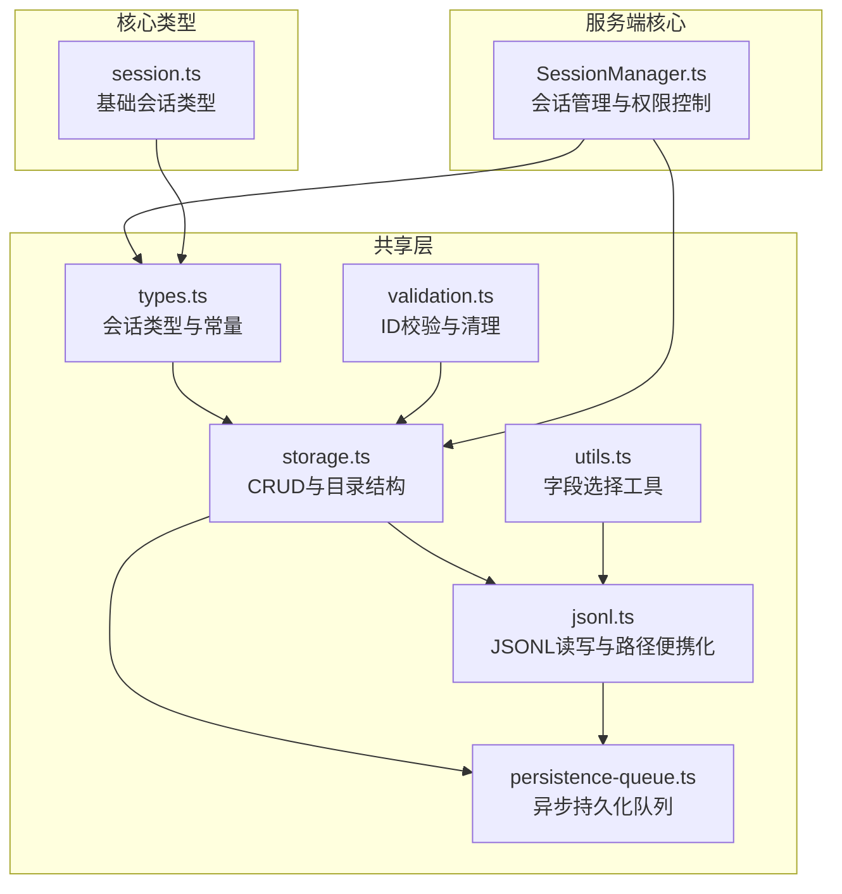

**图表来源**

- [packages/shared/src/sessions/types.ts](file://packages/shared/src/sessions/types.ts#L1-L330)
- [packages/shared/src/sessions/storage.ts](file://packages/shared/src/sessions/storage.ts#L1-L800)
- [packages/shared/src/sessions/jsonl.ts](file://packages/shared/src/sessions/jsonl.ts#L1-L270)
- [packages/shared/src/sessions/persistence-queue.ts](file://packages/shared/src/sessions/persistence-queue.ts#L1-L230)
- [packages/shared/src/sessions/validation.ts](file://packages/shared/src/sessions/validation.ts#L1-L71)
- [packages/shared/src/sessions/utils.ts](file://packages/shared/src/sessions/utils.ts#L1-L26)
- [packages/server-core/src/sessions/SessionManager.ts](file://packages/server-core/src/sessions/SessionManager.ts#L1-L200)
- [packages/core/src/types/session.ts](file://packages/core/src/types/session.ts#L1-L61)

**章节来源**

- [packages/shared/src/sessions/types.ts](file://packages/shared/src/sessions/types.ts#L1-L330)
- [packages/shared/src/sessions/storage.ts](file://packages/shared/src/sessions/storage.ts#L1-L800)
- [packages/shared/src/sessions/jsonl.ts](file://packages/shared/src/sessions/jsonl.ts#L1-L270)
- [packages/shared/src/sessions/persistence-queue.ts](file://packages/shared/src/sessions/persistence-queue.ts#L1-L230)
- [packages/shared/src/sessions/validation.ts](file://packages/shared/src/sessions/validation.ts#L1-L71)
- [packages/shared/src/sessions/utils.ts](file://packages/shared/src/sessions/utils.ts#L1-L26)
- [packages/server-core/src/sessions/SessionManager.ts](file://packages/server-core/src/sessions/SessionManager.ts#L1-L200)
- [packages/core/src/types/session.ts](file://packages/core/src/types/session.ts#L1-L61)

## 核心组件

- 会话类型与常量：定义持久化字段清单、会话配置、存储会话、会话头、会话元数据等。
- 存储与目录：提供工作区级会话目录、会话文件路径、子目录（附件、计划、长响应、下载、数据）管理与ID生成。
- JSONL序列化：以JSONL格式存储会话头（第一行）与消息（后续行），支持便携路径替换与原子写入。
- 异步持久化队列：对频繁变更进行去抖与串行化写入，避免竞态与阻塞主线程。
- 权限模式管理：集中式权限模式（安全/询问/允许全部），与会话元数据联动。
- 会话生命周期：记录消息计数、活动时间、首次内容接收、中止原因等状态。
- 会话ID校验：防御路径穿越攻击，确保文件系统安全。

**章节来源**

- [packages/shared/src/sessions/types.ts](file://packages/shared/src/sessions/types.ts#L16-L51)
- [packages/shared/src/sessions/storage.ts](file://packages/shared/src/sessions/storage.ts#L149-L168)
- [packages/shared/src/sessions/jsonl.ts](file://packages/shared/src/sessions/jsonl.ts#L113-L135)
- [packages/shared/src/sessions/persistence-queue.ts](file://packages/shared/src/sessions/persistence-queue.ts#L50-L84)
- [packages/shared/src/agent/mode-manager.ts](file://packages/shared/src/agent/mode-manager.ts#L1-L200)
- [packages/shared/src/agent/core/session-lifecycle.ts](file://packages/shared/src/agent/core/session-lifecycle.ts#L99-L253)
- [packages/shared/src/sessions/validation.ts](file://packages/shared/src/sessions/validation.ts#L17-L41)

## 架构总览

会话数据模型采用“类型定义—存储实现—序列化—持久化队列—权限控制”的分层设计。共享层提供统一的类型与接口，服务端通过SessionManager消费这些能力；JSONL保证跨平台可移植性与原子写入；异步队列平衡性能与一致性；权限模式贯穿会话生命周期。

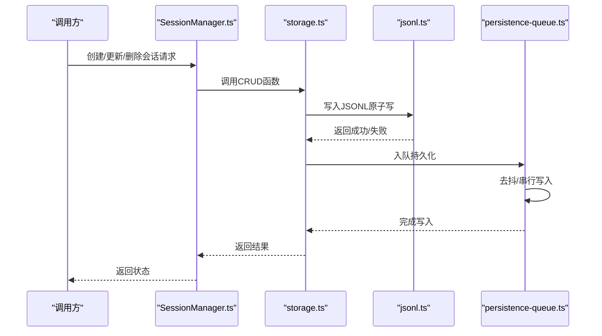

**图表来源**

- [packages/server-core/src/sessions/SessionManager.ts](file://packages/server-core/src/sessions/SessionManager.ts#L1-L200)
- [packages/shared/src/sessions/storage.ts](file://packages/shared/src/sessions/storage.ts#L296-L315)
- [packages/shared/src/sessions/jsonl.ts](file://packages/shared/src/sessions/jsonl.ts#L113-L135)
- [packages/shared/src/sessions/persistence-queue.ts](file://packages/shared/src/sessions/persistence-queue.ts#L69-L84)

## 详细组件分析

### 会话结构与数据模型

- 持久化字段清单：通过常量数组统一声明，确保序列化/反序列化一致性。
- 会话配置（SessionConfig）：包含标识、时间戳、显示信息、权限模式、标签、工作目录、模型连接、归档状态、分支来源、触发来源等。
- 存储会话（StoredSession）：在配置基础上附加消息列表与令牌用量统计。
- 会话头（SessionHeader）：JSONL首行，包含预计算字段（消息数、最后消息角色、预览、最后最终助手消息ID、令牌用量）以加速列表加载。
- 会话元数据（SessionMetadata）：用于列表视图，不含消息体，包含便携化路径与派生字段。

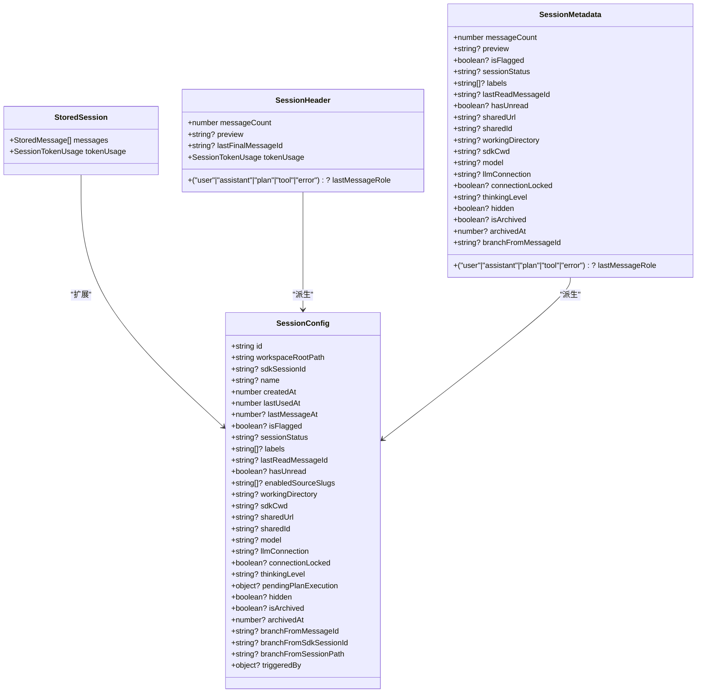

**图表来源**

- [packages/shared/src/sessions/types.ts](file://packages/shared/src/sessions/types.ts#L94-L168)
- [packages/shared/src/sessions/types.ts](file://packages/shared/src/sessions/types.ts#L173-L176)
- [packages/shared/src/sessions/types.ts](file://packages/shared/src/sessions/types.ts#L184-L262)
- [packages/shared/src/sessions/types.ts](file://packages/shared/src/sessions/types.ts#L267-L329)

**章节来源**

- [packages/shared/src/sessions/types.ts](file://packages/shared/src/sessions/types.ts#L16-L51)
- [packages/shared/src/sessions/types.ts](file://packages/shared/src/sessions/types.ts#L94-L168)
- [packages/shared/src/sessions/types.ts](file://packages/shared/src/sessions/types.ts#L173-L176)
- [packages/shared/src/sessions/types.ts](file://packages/shared/src/sessions/types.ts#L184-L262)
- [packages/shared/src/sessions/types.ts](file://packages/shared/src/sessions/types.ts#L267-L329)

### 消息格式与历史记录

- JSONL格式：首行为会话头（SessionHeader），后续每行为一条消息（StoredMessage）。
- 路径便携化：将绝对路径替换为占位符，跨机器加载时再展开，保证可移植性。
- 历史记录：消息按顺序追加，中间流式消息（isIntermediate）不持久化；列表页通过预计算字段快速展示。

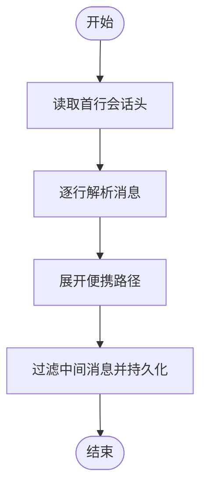

**图表来源**

- [packages/shared/src/sessions/jsonl.ts](file://packages/shared/src/sessions/jsonl.ts#L76-L111)
- [packages/shared/src/sessions/jsonl.ts](file://packages/shared/src/sessions/jsonl.ts#L113-L135)
- [packages/shared/src/sessions/jsonl.ts](file://packages/shared/src/sessions/jsonl.ts#L142-L156)

**章节来源**

- [packages/shared/src/sessions/jsonl.ts](file://packages/shared/src/sessions/jsonl.ts#L1-L270)

### 存储策略与目录结构

- 工作区会话根目录：每个工作区一个会话根目录。
- 会话目录：包含主文件session.jsonl与子目录（plans、attachments、long_responses、data、downloads）。
- 目录创建：确保存在，不存在则递归创建；同时创建必要的子目录。
- 文件路径：提供获取会话目录、JSONL文件、附件/计划/下载/数据目录的工具函数。

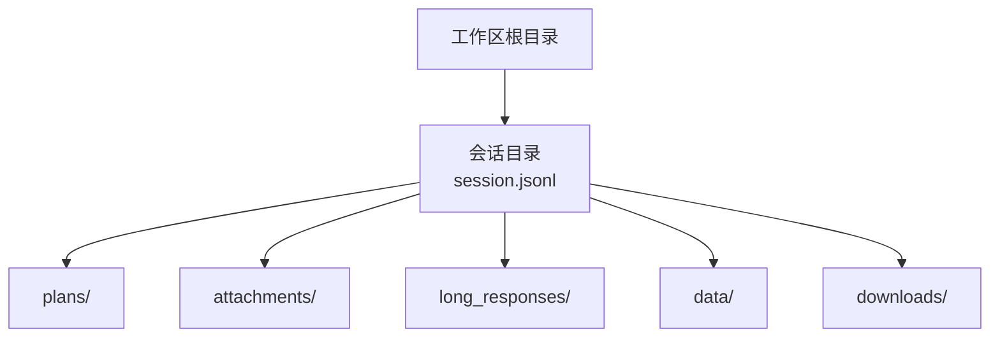

**图表来源**

- [packages/shared/src/sessions/storage.ts](file://packages/shared/src/sessions/storage.ts#L53-L115)
- [packages/shared/src/sessions/storage.ts](file://packages/shared/src/sessions/storage.ts#L117-L143)

**章节来源**

- [packages/shared/src/sessions/storage.ts](file://packages/shared/src/sessions/storage.ts#L53-L143)

### 会话ID生成规则与安全

- 生成规则：基于日期与形容词/名词组合，形如YYMMDD-adjective-noun。
- 去重策略：扫描现有会话ID集合，确保唯一性。
- 安全校验：禁止路径穿越、空值、非法字符、绝对路径等；提供清理函数作为纵深防御。
- 集成测试：验证存储函数对ID的安全处理。

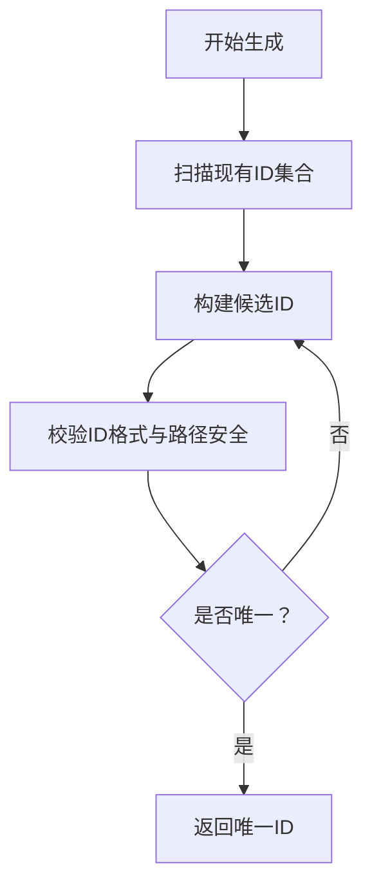

**图表来源**

- [packages/shared/src/sessions/storage.ts](file://packages/shared/src/sessions/storage.ts#L149-L168)
- [packages/shared/src/sessions/validation.ts](file://packages/shared/src/sessions/validation.ts#L17-L41)

**章节来源**

- [packages/shared/src/sessions/storage.ts](file://packages/shared/src/sessions/storage.ts#L149-L168)
- [packages/shared/src/sessions/validation.ts](file://packages/shared/src/sessions/validation.ts#L1-L71)

### 会话生命周期状态

- 生命周期管理器：跟踪消息计数、活动时间、是否收到内容、中止原因等。
- 中止策略：若在未收到任何内容且为第一条消息时中止，应清空会话状态以避免残留。
- 重置与停用：支持重置到初始状态与停用会话。

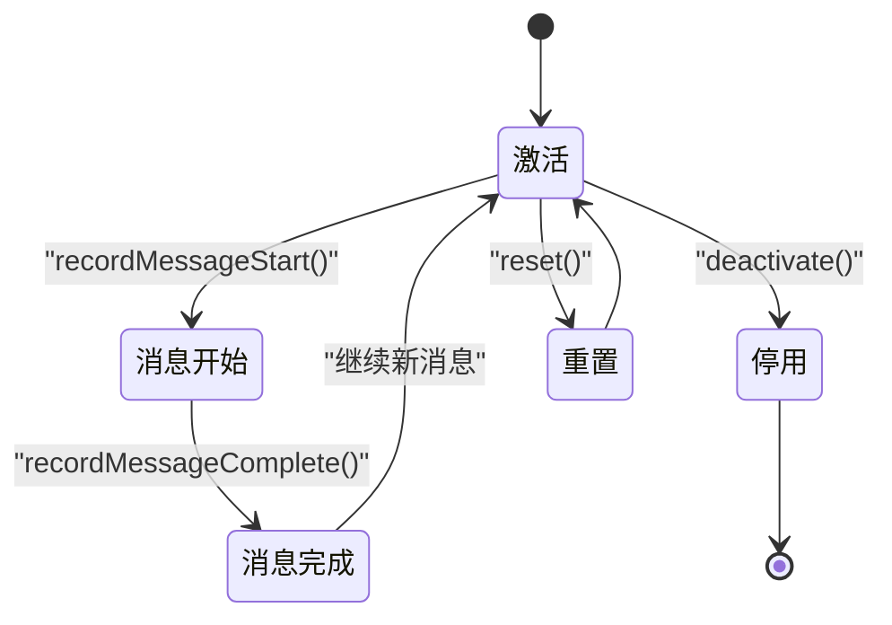

**图表来源**

- [packages/shared/src/agent/core/session-lifecycle.ts](file://packages/shared/src/agent/core/session-lifecycle.ts#L99-L253)

**章节来源**

- [packages/shared/src/agent/core/session-lifecycle.ts](file://packages/shared/src/agent/core/session-lifecycle.ts#L99-L253)

### 会话元数据与历史记录

- 元数据派生：从会话头转换为列表元数据，包含预计算字段（消息数、最后消息角色、预览、最后最终助手消息ID、令牌用量）。
- 列表排序：按最近使用时间降序排列。
- 历史记录：通过消息列表与令牌用量统计维护会话历史。

**章节来源**

- [packages/shared/src/sessions/jsonl.ts](file://packages/shared/src/sessions/jsonl.ts#L142-L156)
- [packages/shared/src/sessions/storage.ts](file://packages/shared/src/sessions/storage.ts#L386-L423)

### 会话权限控制

- 权限模式：安全（只读）、询问（危险操作需确认）、允许全部（跳过检查）。
- 模式管理：集中式状态机，记录当前模式、上一模式、版本号、变更时间与变更来源。
- 会话集成：服务端会话管理器在设置模式时同步更新模式管理器与会话元数据。

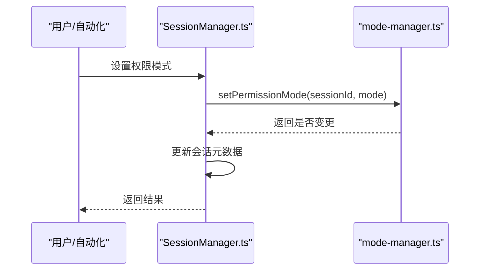

**图表来源**

- [packages/server-core/src/sessions/SessionManager.ts](file://packages/server-core/src/sessions/SessionManager.ts#L4900-L4987)
- [packages/shared/src/agent/mode-manager.ts](file://packages/shared/src/agent/mode-manager.ts#L264-L397)

**章节来源**

- [packages/shared/src/agent/mode-manager.ts](file://packages/shared/src/agent/mode-manager.ts#L1-L200)
- [packages/server-core/src/sessions/SessionManager.ts](file://packages/server-core/src/sessions/SessionManager.ts#L4900-L4987)

### 会话持久化机制

- 去抖与串行：对同一会话的多次写入合并为一次，避免竞争与阻塞。
- 原子写入：先写临时文件，再重命名覆盖，防止崩溃导致损坏。
- 外部元数据保护：检测磁盘与本地签名差异，保留外部变更（如直接编辑）或本地变更，避免互相覆盖。

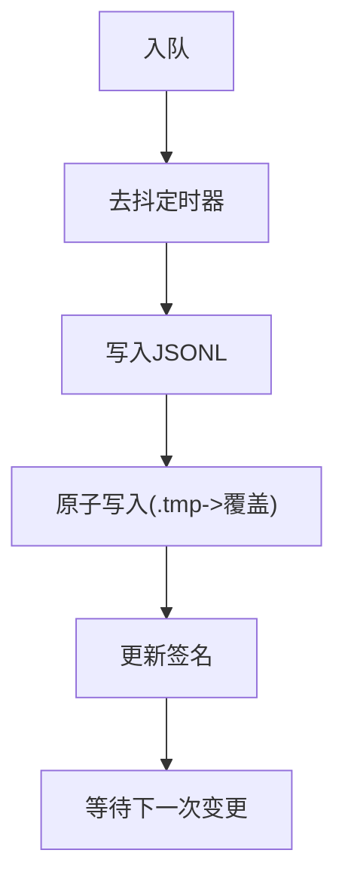

**图表来源**

- [packages/shared/src/sessions/persistence-queue.ts](file://packages/shared/src/sessions/persistence-queue.ts#L69-L84)
- [packages/shared/src/sessions/persistence-queue.ts](file://packages/shared/src/sessions/persistence-queue.ts#L86-L159)
- [packages/shared/src/sessions/jsonl.ts](file://packages/shared/src/sessions/jsonl.ts#L113-L135)

**章节来源**

- [packages/shared/src/sessions/persistence-queue.ts](file://packages/shared/src/sessions/persistence-queue.ts#L1-L230)
- [packages/shared/src/sessions/jsonl.ts](file://packages/shared/src/sessions/jsonl.ts#L113-L135)

### 会话创建、更新、删除流程

- 创建：确保会话目录存在，生成唯一ID，初始化配置与空消息列表，立即持久化。
- 更新：加载会话，更新指定字段，保存（异步队列去抖后写入）。
- 删除：删除会话目录及其所有关联文件。

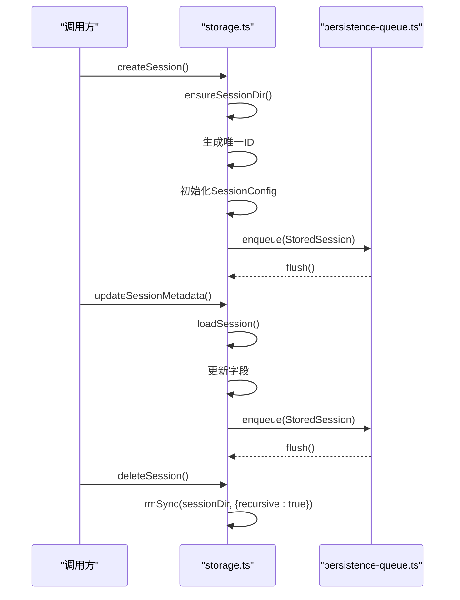

**图表来源**

- [packages/shared/src/sessions/storage.ts](file://packages/shared/src/sessions/storage.ts#L174-L238)
- [packages/shared/src/sessions/storage.ts](file://packages/shared/src/sessions/storage.ts#L521-L567)
- [packages/shared/src/sessions/storage.ts](file://packages/shared/src/sessions/storage.ts#L425-L441)
- [packages/shared/src/sessions/persistence-queue.ts](file://packages/shared/src/sessions/persistence-queue.ts#L69-L84)

**章节来源**

- [packages/shared/src/sessions/storage.ts](file://packages/shared/src/sessions/storage.ts#L174-L238)
- [packages/shared/src/sessions/storage.ts](file://packages/shared/src/sessions/storage.ts#L521-L567)
- [packages/shared/src/sessions/storage.ts](file://packages/shared/src/sessions/storage.ts#L425-L441)
- [packages/shared/src/sessions/persistence-queue.ts](file://packages/shared/src/sessions/persistence-queue.ts#L69-L84)

### 会话数据示例结构与字段说明

以下为典型字段说明（非代码示例）：

- 会话标识与归属：id、workspaceRootPath、sdkSessionId
- 时间戳：createdAt、lastUsedAt、lastMessageAt
- 显示与状态：name、isFlagged、sessionStatus、labels、hidden
- 读取追踪：lastReadMessageId、hasUnread
- 配置：enabledSourceSlugs、permissionMode、previousPermissionMode、workingDirectory、sdkCwd
- 连接与模型：model、llmConnection、connectionLocked、thinkingLevel
- 分享：sharedUrl、sharedId
- 计划执行：pendingPlanExecution（包含planPath与awaitingCompaction）
- 归档：isArchived、archivedAt
- 分支来源：branchFromMessageId、branchFromSdkSessionId、branchFromSessionPath
- 触发来源：triggeredBy（包含自动化名称、事件、时间戳）
- 消息与令牌：messages（StoredMessage[]）、tokenUsage（输入/输出/总/上下文/成本）

**章节来源**

- [packages/shared/src/sessions/types.ts](file://packages/shared/src/sessions/types.ts#L94-L168)
- [packages/shared/src/sessions/types.ts](file://packages/shared/src/sessions/types.ts#L184-L262)
- [packages/shared/src/sessions/types.ts](file://packages/shared/src/sessions/types.ts#L267-L329)

### 业务规则与约束条件

- 字段持久化：仅SESSION_PERSISTENT_FIELDS中的字段会被序列化到JSONL。
- 路径便携化：绝对路径在写入前被替换为占位符，读取时再展开。
- 原子写入：防止崩溃导致部分写入。
- 外部元数据保护：当磁盘与本地签名不一致时，保留外部变更或本地变更，避免互相覆盖。
- 权限模式：默认“询问”，支持循环切换；恢复时与会话元数据保持一致。
- 会话ID：必须满足格式与安全要求，禁止路径穿越与非法字符。
- 生命周期：首次消息前中止需清空状态，避免残留。

**章节来源**

- [packages/shared/src/sessions/utils.ts](file://packages/shared/src/sessions/utils.ts#L15-L25)
- [packages/shared/src/sessions/jsonl.ts](file://packages/shared/src/sessions/jsonl.ts#L28-L48)
- [packages/shared/src/sessions/jsonl.ts](file://packages/shared/src/sessions/jsonl.ts#L113-L135)
- [packages/shared/src/sessions/persistence-queue.ts](file://packages/shared/src/sessions/persistence-queue.ts#L120-L136)
- [packages/shared/src/agent/mode-manager.ts](file://packages/shared/src/agent/mode-manager.ts#L264-L397)
- [packages/shared/src/sessions/validation.ts](file://packages/shared/src/sessions/validation.ts#L17-L41)
- [packages/shared/src/agent/core/session-lifecycle.ts](file://packages/shared/src/agent/core/session-lifecycle.ts#L197-L208)

## 依赖关系分析

- 类型依赖：SessionConfig/SessionHeader/SessionMetadata/SessionTokenUsage均来自types.ts。
- 存储依赖：storage.ts依赖jsonl.ts与persistence-queue.ts。
- 服务端依赖：SessionManager.ts依赖shared/sessions导出的CRUD与队列。
- 核心类型：core/session.ts提供基础抽象，供上层使用。

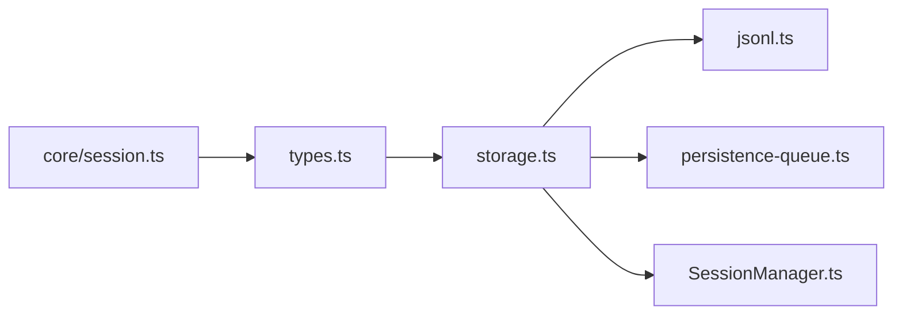

**图表来源**

- [packages/shared/src/sessions/types.ts](file://packages/shared/src/sessions/types.ts#L1-L330)
- [packages/shared/src/sessions/storage.ts](file://packages/shared/src/sessions/storage.ts#L1-L800)
- [packages/shared/src/sessions/jsonl.ts](file://packages/shared/src/sessions/jsonl.ts#L1-L270)
- [packages/shared/src/sessions/persistence-queue.ts](file://packages/shared/src/sessions/persistence-queue.ts#L1-L230)
- [packages/server-core/src/sessions/SessionManager.ts](file://packages/server-core/src/sessions/SessionManager.ts#L1-L200)
- [packages/core/src/types/session.ts](file://packages/core/src/types/session.ts#L1-L61)

**章节来源**

- [packages/shared/src/sessions/types.ts](file://packages/shared/src/sessions/types.ts#L1-L330)
- [packages/shared/src/sessions/storage.ts](file://packages/shared/src/sessions/storage.ts#L1-L800)
- [packages/shared/src/sessions/jsonl.ts](file://packages/shared/src/sessions/jsonl.ts#L1-L270)
- [packages/shared/src/sessions/persistence-queue.ts](file://packages/shared/src/sessions/persistence-queue.ts#L1-L230)
- [packages/server-core/src/sessions/SessionManager.ts](file://packages/server-core/src/sessions/SessionManager.ts#L1-L200)
- [packages/core/src/types/session.ts](file://packages/core/src/types/session.ts#L1-L61)

## 性能考虑

- 列表加载优化：通过SessionHeader预计算字段（消息数、最后消息角色、预览、最后最终助手消息ID、令牌用量）避免解析消息体。
- 异步持久化：去抖与串行写入降低I/O频率，避免主线程阻塞。
- 原子写入：减少文件损坏风险，提升可靠性。
- 路径便携化：减少跨平台路径差异带来的解析开销。

[本节为通用指导，无需列出具体文件来源]

## 故障排除指南

- 无法读取会话：检查JSONL首行是否可解析，确认路径便携化是否正确展开。
- 写入失败：确认会话目录存在且有写权限；查看临时文件是否遗留（由清理逻辑处理）。
- 权限模式异常：核对模式管理器状态与会话元数据一致性，必要时进行恢复与对齐。
- 会话ID冲突：确认ID生成与校验逻辑，避免非法字符与路径穿越。
- 中止后状态残留：确保在“首次消息前且未收到内容”场景下清空状态。

**章节来源**

- [packages/shared/src/sessions/jsonl.ts](file://packages/shared/src/sessions/jsonl.ts#L54-L70)
- [packages/shared/src/sessions/jsonl.ts](file://packages/shared/src/sessions/jsonl.ts#L113-L135)
- [packages/shared/src/agent/mode-manager.ts](file://packages/shared/src/agent/mode-manager.ts#L264-L397)
- [packages/shared/src/sessions/validation.ts](file://packages/shared/src/sessions/validation.ts#L17-L41)
- [packages/shared/src/agent/core/session-lifecycle.ts](file://packages/shared/src/agent/core/session-lifecycle.ts#L197-L208)

## 结论

该会话数据模型以类型安全为核心，结合JSONL序列化、便携路径与原子写入，实现了高性能、可移植、可靠的会话持久化；通过集中式权限管理模式与生命周期管理，保障了安全性与可用性。遵循本文档的规则与流程，可在多端环境中稳定地创建、更新与删除会话，并正确处理历史记录与元数据。
