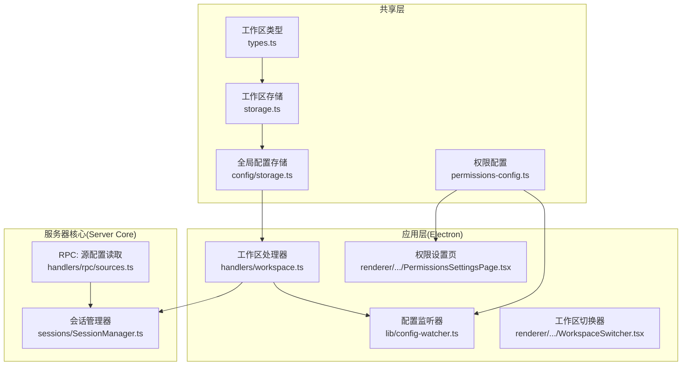
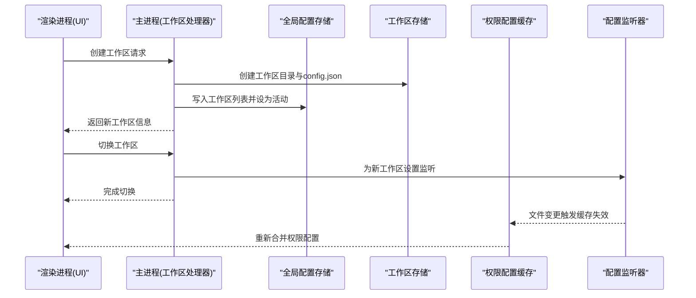
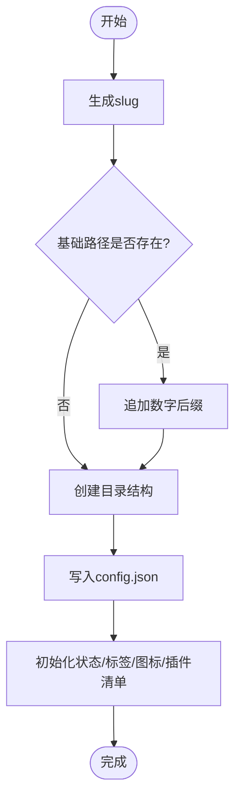
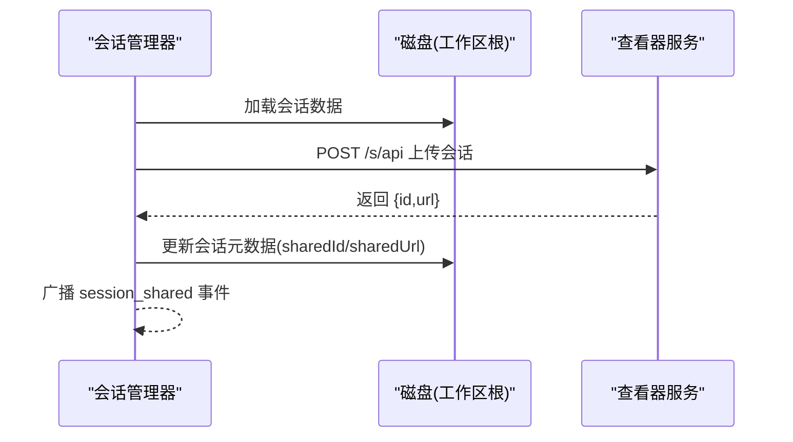
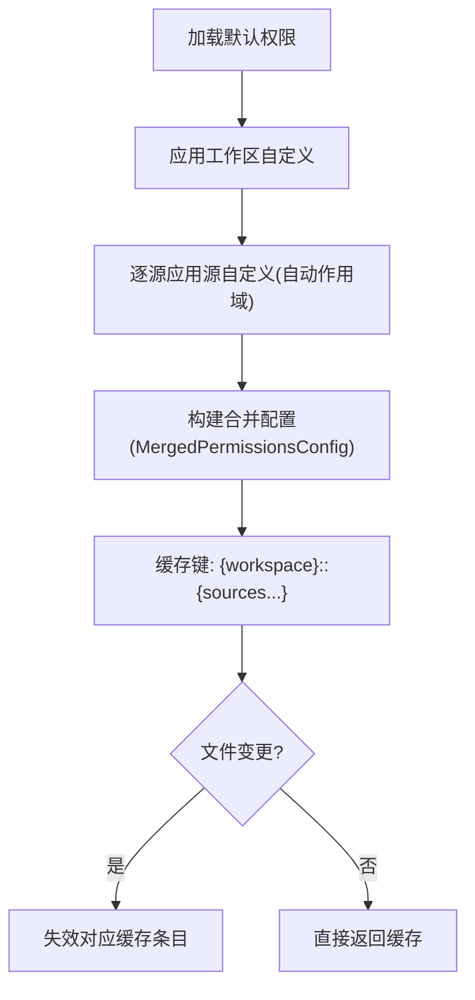
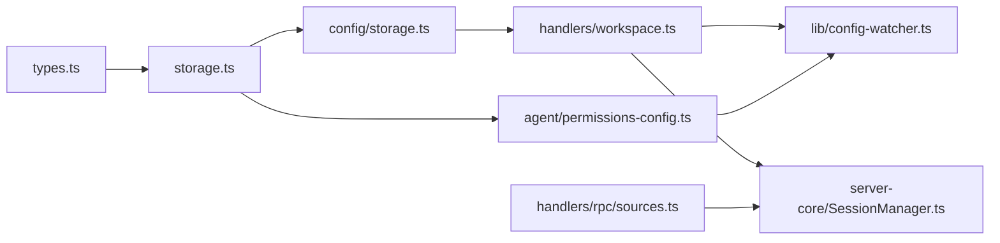

# 工作区模型

<cite>
**本文档引用的文件**
- [packages/shared/src/workspaces/types.ts](file://packages/shared/src/workspaces/types.ts)
- [packages/shared/src/workspaces/storage.ts](file://packages/shared/src/workspaces/storage.ts)
- [packages/shared/src/config/storage.ts](file://packages/shared/src/config/storage.ts)
- [packages/shared/src/agent/permissions-config.ts](file://packages/shared/src/agent/permissions-config.ts)
- [apps/electron/src/main/handlers/workspace.ts](file://apps/electron/src/main/handlers/workspace.ts)
- [apps/electron/src/main/lib/config-watcher.ts](file://apps/electron/src/main/lib/config-watcher.ts)
- [packages/server-core/src/sessions/SessionManager.ts](file://packages/server-core/src/sessions/SessionManager.ts)
- [apps/electron/src/renderer/pages/settings/PermissionsSettingsPage.tsx](file://apps/electron/src/renderer/pages/settings/PermissionsSettingsPage.tsx)
- [apps/electron/src/renderer/components/app-shell/WorkspaceSwitcher.tsx](file://apps/electron/src/renderer/components/app-shell/WorkspaceSwitcher.tsx)
- [packages/shared/src/sessions/slug-generator.ts](file://packages/shared/src/sessions/slug-generator.ts)
- [apps/electron/src/renderer/lib/slugify.ts](file://apps/electron/src/renderer/lib/slugify.ts)
- [packages/server-core/src/handlers/rpc/sources.ts](file://packages/server-core/src/handlers/rpc/sources.ts)
</cite>

## 目录

1. [简介](#简介)
2. [项目结构](#项目结构)
3. [核心组件](#核心组件)
4. [架构总览](#架构总览)
5. [详细组件分析](#详细组件分析)
6. [依赖关系分析](#依赖关系分析)
7. [性能考虑](#性能考虑)
8. [故障排除指南](#故障排除指南)
9. [结论](#结论)
10. [附录](#附录)

## 简介

本文件系统化地阐述工作区（Workspace）模型，覆盖其数据结构、配置项、创建与组织方式、权限管理、与会话的关系、隔离机制与资源共享规则，并提供命名规范、标识符生成策略、迁移与备份建议以及多用户协作与权限继承机制。目标是帮助开发者与使用者在不深入源码的情况下，也能准确理解并正确使用工作区。

## 项目结构

工作区模型由共享层（Shared）与应用层（Electron Renderer/Main）协同实现：

- 共享层定义工作区类型、存储与配置加载逻辑，负责跨进程/平台的一致性。
- 应用层（Electron）提供窗口管理、RPC通道、文件系统监听与UI交互。
- 服务器核心（Server Core）负责会话生命周期与分享能力，与工作区强关联。

图表来源

- [packages/shared/src/workspaces/types.ts](file://packages/shared/src/workspaces/types.ts#L1-L92)
- [packages/shared/src/workspaces/storage.ts](file://packages/shared/src/workspaces/storage.ts#L1-L508)
- [packages/shared/src/config/storage.ts](file://packages/shared/src/config/storage.ts#L1-L1200)
- [packages/shared/src/agent/permissions-config.ts](file://packages/shared/src/agent/permissions-config.ts#L1-L778)
- [apps/electron/src/main/handlers/workspace.ts](file://apps/electron/src/main/handlers/workspace.ts#L1-L454)
- [apps/electron/src/main/lib/config-watcher.ts](file://apps/electron/src/main/lib/config-watcher.ts#L325-L357)
- [packages/server-core/src/sessions/SessionManager.ts](file://packages/server-core/src/sessions/SessionManager.ts#L3233-L3403)
- [packages/server-core/src/handlers/rpc/sources.ts](file://packages/server-core/src/handlers/rpc/sources.ts#L118-L149)

章节来源

- [packages/shared/src/workspaces/types.ts](file://packages/shared/src/workspaces/types.ts#L1-L92)
- [packages/shared/src/workspaces/storage.ts](file://packages/shared/src/workspaces/storage.ts#L1-L508)
- [packages/shared/src/config/storage.ts](file://packages/shared/src/config/storage.ts#L1-L1200)

## 核心组件

- 工作区类型与配置：定义工作区的标识、名称、别名、默认会话设置、本地MCP服务器开关、时间戳等。
- 工作区存储：提供工作区目录结构、配置读写、唯一路径生成、颜色主题设置、本地MCP启用检测、插件清单生成等。
- 全局配置存储：维护工作区列表、活动工作区、会话持久化、计划存储、草稿存储等。
- 权限配置：工作区级与源级权限合并、缓存、失效与校验、默认权限同步与迁移。
- 应用层处理器：工作区创建、切换、图像读写、主题设置、视图管理等RPC处理。
- 配置监听：递归监听工作区目录变化，自动刷新权限与标签/状态等配置。
- 会话管理：与工作区绑定的会话生命周期、分享到查看器、更新与撤销分享。

章节来源

- [packages/shared/src/workspaces/types.ts](file://packages/shared/src/workspaces/types.ts#L33-L62)
- [packages/shared/src/workspaces/storage.ts](file://packages/shared/src/workspaces/storage.ts#L97-L139)
- [packages/shared/src/config/storage.ts](file://packages/shared/src/config/storage.ts#L440-L573)
- [packages/shared/src/agent/permissions-config.ts](file://packages/shared/src/agent/permissions-config.ts#L457-L560)
- [apps/electron/src/main/handlers/workspace.ts](file://apps/electron/src/main/handlers/workspace.ts#L58-L136)
- [apps/electron/src/main/lib/config-watcher.ts](file://apps/electron/src/main/lib/config-watcher.ts#L325-L357)
- [packages/server-core/src/sessions/SessionManager.ts](file://packages/server-core/src/sessions/SessionManager.ts#L3241-L3398)

## 架构总览

工作区作为顶层组织单元，承载会话与数据源；权限系统通过默认、工作区与源级配置叠加形成最终运行时权限；应用层通过RPC与配置监听实现动态更新；服务器核心负责会话持久化与分享。

图表来源

- [apps/electron/src/main/handlers/workspace.ts](file://apps/electron/src/main/handlers/workspace.ts#L58-L136)
- [packages/shared/src/workspaces/storage.ts](file://packages/shared/src/workspaces/storage.ts#L267-L322)
- [packages/shared/src/config/storage.ts](file://packages/shared/src/config/storage.ts#L531-L573)
- [packages/shared/src/agent/permissions-config.ts](file://packages/shared/src/agent/permissions-config.ts#L457-L560)
- [apps/electron/src/main/lib/config-watcher.ts](file://apps/electron/src/main/lib/config-watcher.ts#L325-L357)

## 详细组件分析

### 数据模型：工作区配置

- 基本属性
  - id：工作区唯一标识符（随机UUID片段）
  - name：显示名称
  - slug：URL/文件系统安全的别名（基于名称生成）
  - createdAt/updatedAt：创建与更新时间戳
- 默认会话设置（defaults）
  - model：默认大模型
  - defaultLlmConnection：默认LLM连接（按slug）
  - enabledSourceSlugs：默认启用的数据源slug列表
  - permissionMode：默认权限模式（safe/ask/allow-all）
  - cyclablePermissionModes：可循环的权限模式集合（最小2个）
  - workingDirectory：默认工作目录（支持路径变量展开）
  - thinkingLevel：思考级别（off/think/max）
  - colorTheme：工作区颜色主题覆盖（未设置则继承应用默认）
- 本地MCP服务器配置（localMcpServers）
  - enabled：是否允许在该工作区内启动stdio型MCP服务器
  - 解析优先级：环境变量 > 工作区配置 > 默认值

章节来源

- [packages/shared/src/workspaces/types.ts](file://packages/shared/src/workspaces/types.ts#L33-L62)
- [packages/shared/src/workspaces/storage.ts](file://packages/shared/src/workspaces/storage.ts#L275-L300)
- [packages/shared/src/workspaces/storage.ts](file://packages/shared/src/workspaces/storage.ts#L447-L469)

### 工作区创建与组织

- 创建流程
  - 生成slug（URL安全）
  - 合并全局默认与用户提供的defaults
  - 初始化目录结构：sources/sessions/skills
  - 写入config.json，初始化状态/标签/图标/插件清单
- 唯一路径生成
  - 若基础slug已存在，则追加数字后缀（如“-2”、“-3”），确保唯一
- 重命名
  - 更新工作区config.json中的name字段
- 自动发现
  - 在默认位置扫描有效工作区并加入全局配置

图表来源

- [packages/shared/src/workspaces/storage.ts](file://packages/shared/src/workspaces/storage.ts#L243-L258)
- [packages/shared/src/workspaces/storage.ts](file://packages/shared/src/workspaces/storage.ts#L267-L322)

章节来源

- [packages/shared/src/workspaces/storage.ts](file://packages/shared/src/workspaces/storage.ts#L243-L322)
- [packages/shared/src/config/storage.ts](file://packages/shared/src/config/storage.ts#L575-L613)

### 工作区与会话的关系

- 会话归属
  - 会话必须属于某个工作区，工作区决定默认设置与权限边界
- 会话ID生成
  - 使用日期前缀+人类可读短语，冲突时追加数字后缀或随机后缀
- 会话分享
  - 支持上传到查看器、更新分享、撤销分享，分享状态保存在会话元数据中
  - 分享事件广播至工作区内的所有窗口

图表来源

- [packages/server-core/src/sessions/SessionManager.ts](file://packages/server-core/src/sessions/SessionManager.ts#L3241-L3295)
- [packages/server-core/src/sessions/SessionManager.ts](file://packages/server-core/src/sessions/SessionManager.ts#L3302-L3346)
- [packages/server-core/src/sessions/SessionManager.ts](file://packages/server-core/src/sessions/SessionManager.ts#L3353-L3398)

章节来源

- [packages/shared/src/sessions/slug-generator.ts](file://packages/shared/src/sessions/slug-generator.ts#L49-L78)
- [packages/server-core/src/sessions/SessionManager.ts](file://packages/server-core/src/sessions/SessionManager.ts#L3241-L3398)

### 权限管理与继承机制

- 配置层级
  - 应用默认（~/.craft-agent/permissions/default.json）
  - 工作区自定义（workspace/permissions.json）
  - 源自定义（workspace/sources/{slug}/permissions.json）
- 合并策略
  - 默认配置为硬约束（如禁止某些工具），不可被JSON覆盖
  - 自定义配置采用“累加更宽松”的策略
  - 源级MCP模式自动作用域限定（mcp**<sourceSlug>**）
- 缓存与失效
  - 内存缓存，文件变更触发精确失效
  - 默认配置变更影响所有上下文，清空相关缓存
- 运行时检查
  - API端点规则按方法与路径正则匹配
  - 写操作路径按glob模式允许

图表来源

- [packages/shared/src/agent/permissions-config.ts](file://packages/shared/src/agent/permissions-config.ts#L551-L609)
- [packages/shared/src/agent/permissions-config.ts](file://packages/shared/src/agent/permissions-config.ts#L708-L758)
- [apps/electron/src/main/lib/config-watcher.ts](file://apps/electron/src/main/lib/config-watcher.ts#L349-L357)

章节来源

- [packages/shared/src/agent/permissions-config.ts](file://packages/shared/src/agent/permissions-config.ts#L457-L778)
- [apps/electron/src/main/lib/config-watcher.ts](file://apps/electron/src/main/lib/config-watcher.ts#L325-L357)
- [apps/electron/src/renderer/pages/settings/PermissionsSettingsPage.tsx](file://apps/electron/src/renderer/pages/settings/PermissionsSettingsPage.tsx#L108-L130)

### 工作区隔离与资源共享

- 隔离边界
  - 工作区根目录下独立的sources/sessions/skills空间
  - 颜色主题可在工作区层面覆盖，不影响其他工作区
  - 本地MCP启用策略以工作区为单位控制
- 资源共享
  - 视图、标签、状态等配置在工作区内共享
  - 插件清单使工作区可作为SDK插件被加载，暴露技能/命令/代理
- 外部资源
  - 查看器分享将会话数据上传至远端，实现跨设备/跨实例共享

章节来源

- [packages/shared/src/workspaces/storage.ts](file://packages/shared/src/workspaces/storage.ts#L69-L87)
- [packages/shared/src/workspaces/storage.ts](file://packages/shared/src/workspaces/storage.ts#L397-L441)
- [packages/shared/src/workspaces/storage.ts](file://packages/shared/src/workspaces/storage.ts#L487-L505)
- [packages/server-core/src/sessions/SessionManager.ts](file://packages/server-core/src/sessions/SessionManager.ts#L3241-L3295)

### 命名规则与标识符生成

- 名称到slug
  - 小写、替换非字母数字字符为空格、压缩多个空格、去首尾、截断长度
  - 若结果为空，回退为固定字符串
- 工作区ID
  - 基于随机字节生成UUID风格字符串
- 会话ID
  - 日期前缀 + 人类可读短语，冲突时追加数字或随机后缀
- slug验证
  - 渲染侧提供slugify与有效性校验工具

章节来源

- [packages/shared/src/workspaces/storage.ts](file://packages/shared/src/workspaces/storage.ts#L220-L232)
- [packages/shared/src/config/storage.ts](file://packages/shared/src/config/storage.ts#L424-L430)
- [packages/shared/src/sessions/slug-generator.ts](file://packages/shared/src/sessions/slug-generator.ts#L49-L78)
- [apps/electron/src/renderer/lib/slugify.ts](file://apps/electron/src/renderer/lib/slugify.ts#L16-L35)

### 多用户协作与权限继承

- 协作场景
  - 工作区作为协作边界：成员在同一工作区内共享会话、标签、视图与权限配置
  - 通过分享链接与查看器实现跨实例/跨设备协作
- 权限继承
  - 默认权限为硬约束，工作区与源自定义仅能扩展，不能撤销默认限制
  - 源级MCP模式自动作用域限定，避免跨源误用
- UI与RPC
  - 设置页展示默认与自定义权限规则，支持编辑
  - RPC通道提供工作区设置读取与更新

章节来源

- [apps/electron/src/renderer/pages/settings/PermissionsSettingsPage.tsx](file://apps/electron/src/renderer/pages/settings/PermissionsSettingsPage.tsx#L132-L317)
- [apps/electron/src/main/handlers/settings.ts](file://apps/electron/src/main/handlers/settings.ts#L82-L104)
- [packages/server-core/src/handlers/rpc/sources.ts](file://packages/server-core/src/handlers/rpc/sources.ts#L118-L149)

### 工作区迁移与备份方案

- 迁移要点
  - 默认工作区目录：~/.craft-agent/workspaces/
  - 自动发现：启动时扫描默认目录，补充未跟踪的工作区
  - 配置迁移：权限默认文件与主题文件从打包资源同步到用户目录，保持用户自定义
- 备份建议
  - 复制整个工作区根目录（包含config.json、sources、sessions、skills）
  - 备份全局配置：~/.craft-agent/config.json 与相关默认文件
  - 备份凭据：~/.craft-agent/credentials.enc（如需完整迁移）
- 恢复步骤
  - 将工作区目录放回原位或新位置，确保config.json存在
  - 启动应用后自动加载；必要时调用同步函数补齐工作区列表

章节来源

- [packages/shared/src/config/storage.ts](file://packages/shared/src/config/storage.ts#L580-L613)
- [packages/shared/src/agent/permissions-config.ts](file://packages/shared/src/agent/permissions-config.ts#L61-L121)
- [packages/shared/src/config/storage.ts](file://packages/shared/src/config/storage.ts#L397-L414)

## 依赖关系分析

图表来源

- [packages/shared/src/workspaces/types.ts](file://packages/shared/src/workspaces/types.ts#L1-L92)
- [packages/shared/src/workspaces/storage.ts](file://packages/shared/src/workspaces/storage.ts#L1-L508)
- [packages/shared/src/config/storage.ts](file://packages/shared/src/config/storage.ts#L1-L1200)
- [apps/electron/src/main/handlers/workspace.ts](file://apps/electron/src/main/handlers/workspace.ts#L1-L454)
- [apps/electron/src/main/lib/config-watcher.ts](file://apps/electron/src/main/lib/config-watcher.ts#L325-L357)
- [packages/shared/src/agent/permissions-config.ts](file://packages/shared/src/agent/permissions-config.ts#L1-L778)
- [packages/server-core/src/sessions/SessionManager.ts](file://packages/server-core/src/sessions/SessionManager.ts#L3233-L3403)
- [packages/server-core/src/handlers/rpc/sources.ts](file://packages/server-core/src/handlers/rpc/sources.ts#L118-L149)

章节来源

- [packages/shared/src/workspaces/storage.ts](file://packages/shared/src/workspaces/storage.ts#L1-L508)
- [packages/shared/src/config/storage.ts](file://packages/shared/src/config/storage.ts#L1-L1200)

## 性能考虑

- 存储与I/O
  - 使用原子写入避免崩溃导致的配置损坏
  - 路径变量展开与便携化减少跨机器差异带来的重复解析
- 缓存与监听
  - 权限配置缓存按上下文键缓存，文件变更精确失效，降低重复计算
  - 递归监听工作区目录，仅在权限文件等关键文件变更时触发
- 会话分享
  - 异步操作状态用于UI反馈，避免阻塞主线程
  - 分享/更新/撤销均进行错误处理与状态清理

[本节为通用指导，无需特定文件分析]

## 故障排除指南

- 工作区无法加载
  - 检查config.json是否存在且格式正确
  - 确认工作区目录结构完整（sources/sessions/skills）
- 权限规则不生效
  - 确认默认权限文件存在且有效
  - 检查工作区/源级permissions.json语法与正则表达式
  - 观察配置监听日志，确认缓存已失效并重建
- 图像读写失败
  - 确保相对路径无越权（不允许..），扩展名在允许列表内
  - SVG与栅格图分别走不同处理路径
- 会话分享异常
  - 检查查看器服务可达性与响应状态
  - 关注413（过大）与通用HTTP错误码

章节来源

- [apps/electron/src/main/handlers/workspace.ts](file://apps/electron/src/main/handlers/workspace.ts#L143-L195)
- [packages/shared/src/agent/permissions-config.ts](file://packages/shared/src/agent/permissions-config.ts#L333-L363)
- [apps/electron/src/main/lib/config-watcher.ts](file://apps/electron/src/main/lib/config-watcher.ts#L325-L357)
- [packages/server-core/src/sessions/SessionManager.ts](file://packages/server-core/src/sessions/SessionManager.ts#L3241-L3295)

## 结论

工作区模型通过清晰的类型定义、稳健的存储与配置管理、灵活的权限继承与作用域控制，以及完善的会话分享与协作能力，为多场景使用提供了可靠基础。遵循本文档的命名与标识符规则、迁移与备份建议，可确保工作区在复杂环境下稳定运行与演进。

## 附录

- 字段说明速查
  - id/name/slug/createdAt/updatedAt：工作区基本标识与时间
  - defaults.model/defaultLlmConnection/enabledSourceSlugs/permissionMode/cyclablePermissionModes/workingDirectory/thinkingLevel/colorTheme：默认会话设置与主题覆盖
  - localMcpServers.enabled：本地MCP启用开关
- 常用RPC通道
  - 工作区获取、创建、切换、图像读写、主题设置、视图管理等
- UI入口
  - 工作区切换器、权限设置页等

[本节为概览性内容，无需特定文件分析]
