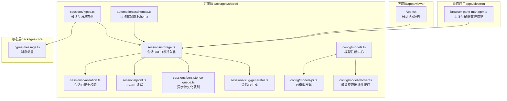
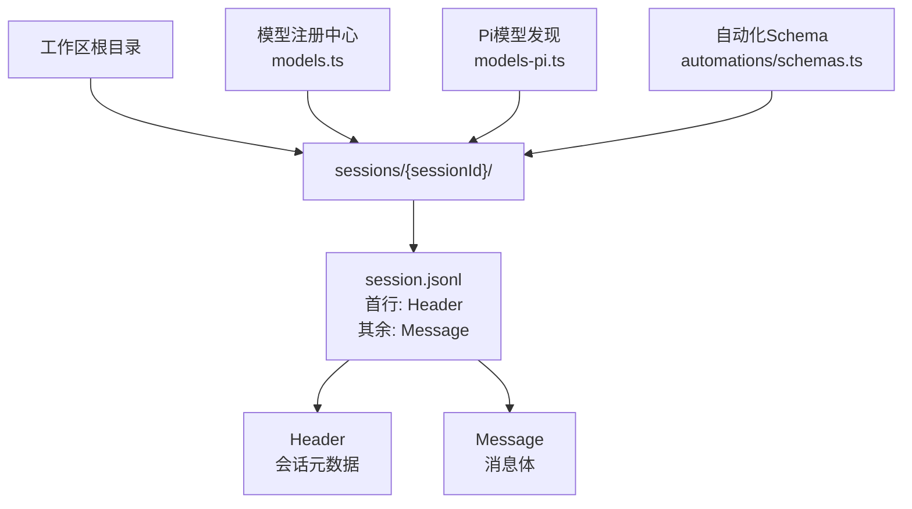
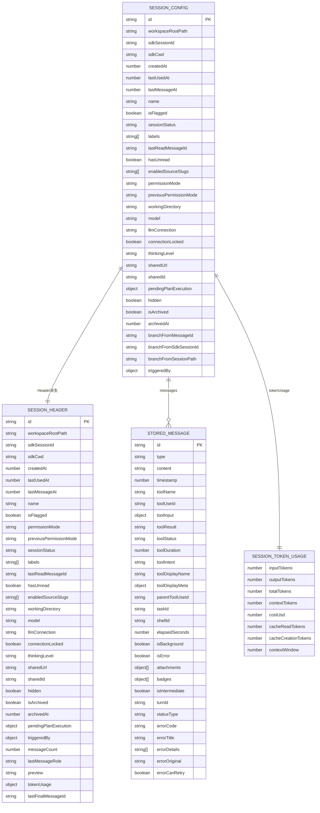
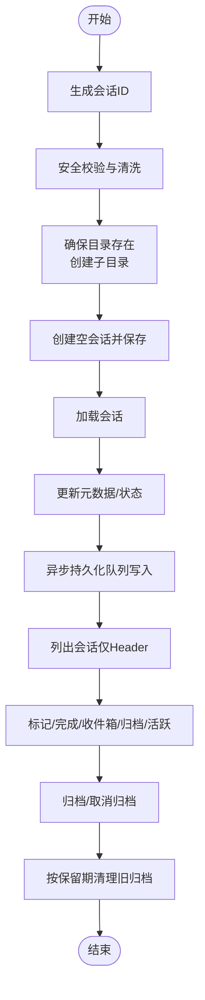
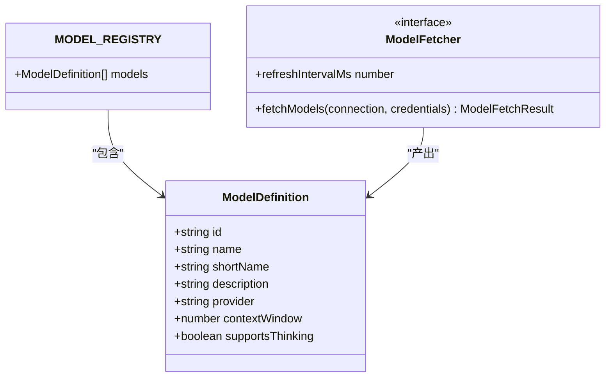
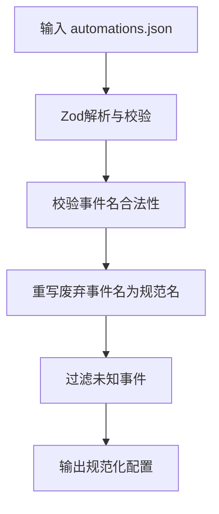
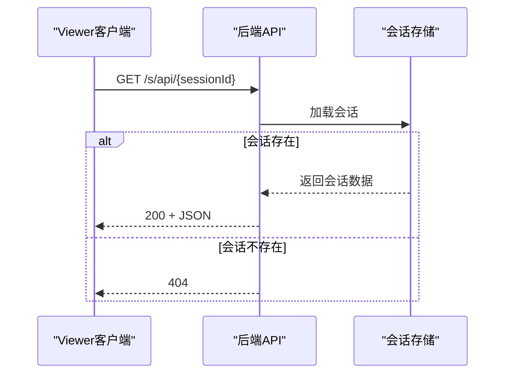
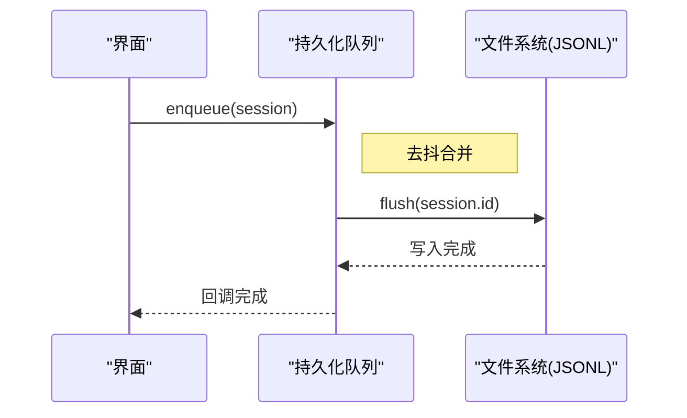
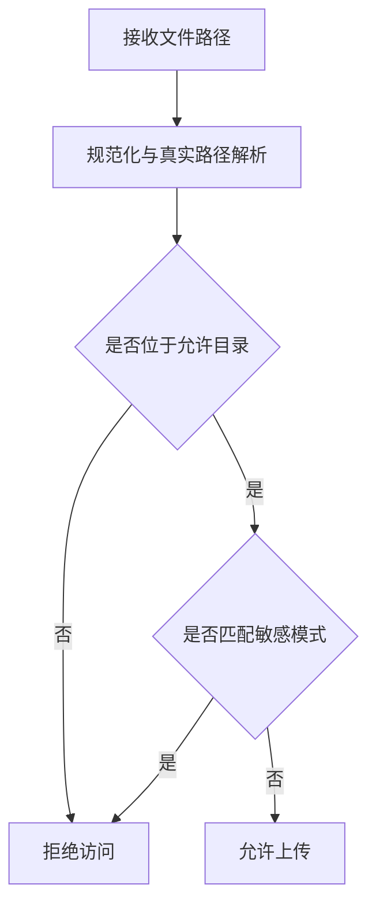
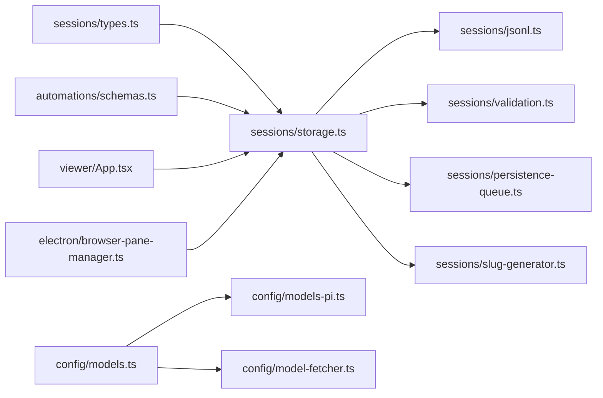

# 数据模型

<cite>
**本文引用的文件**
- [packages/shared/src/sessions/types.ts](file://packages/shared/src/sessions/types.ts)
- [packages/shared/src/sessions/storage.ts](file://packages/shared/src/sessions/storage.ts)
- [packages/shared/src/sessions/validation.ts](file://packages/shared/src/sessions/validation.ts)
- [packages/shared/src/sessions/jsonl.ts](file://packages/shared/src/sessions/jsonl.ts)
- [packages/shared/src/sessions/persistence-queue.ts](file://packages/shared/src/sessions/persistence-queue.ts)
- [packages/shared/src/sessions/slug-generator.ts](file://packages/shared/src/sessions/slug-generator.ts)
- [packages/shared/src/config/models.ts](file://packages/shared/src/config/models.ts)
- [packages/shared/src/config/models-pi.ts](file://packages/shared/src/config/models-pi.ts)
- [packages/shared/src/config/model-fetcher.ts](file://packages/shared/src/config/model-fetcher.ts)
- [packages/shared/src/automations/schemas.ts](file://packages/shared/src/automations/schemas.ts)
- [apps/viewer/src/App.tsx](file://apps/viewer/src/App.tsx)
- [apps/electron/src/main/browser-pane-manager.ts](file://apps/electron/src/main/browser-pane-manager.ts)
- [packages/core/src/types/message.ts](file://packages/core/src/types/message.ts)
</cite>

## 目录

1. [简介](#简介)
2. [项目结构](#项目结构)
3. [核心组件](#核心组件)
4. [架构总览](#架构总览)
5. [详细组件分析](#详细组件分析)
6. [依赖分析](#依赖分析)
7. [性能考量](#性能考量)
8. [故障排查指南](#故障排查指南)
9. [结论](#结论)
10. [附录](#附录)

## 简介

本文件系统化梳理 Craft Agents 的数据模型，覆盖实体关系、字段定义与数据类型、主键/外键与索引、约束与校验规则、业务规则、数据库模式图、示例数据、数据访问模式、缓存策略、性能优化、数据生命周期与归档、迁移路径与版本管理、以及数据安全与隐私、访问控制等。

## 项目结构

围绕“会话”这一核心实体，数据模型主要分布在以下模块：

- 会话与消息：会话元数据、消息持久化、JSONL 文件格式、目录结构与安全校验
- 模型注册与发现：统一模型定义、提供方过滤、Pi 模型动态发现
- 自动化配置：Zod 校验的自动化配置结构
- 视图与访问：Viewer 前端对会话的读取接口
- 安全与权限：上传与敏感文件访问控制

**图表来源**

- [packages/shared/src/sessions/types.ts](file://packages/shared/src/sessions/types.ts#L1-L330)
- [packages/shared/src/sessions/storage.ts](file://packages/shared/src/sessions/storage.ts#L1-L1058)
- [packages/shared/src/sessions/validation.ts](file://packages/shared/src/sessions/validation.ts#L1-L71)
- [packages/shared/src/sessions/jsonl.ts](file://packages/shared/src/sessions/jsonl.ts#L1-L200)
- [packages/shared/src/sessions/persistence-queue.ts](file://packages/shared/src/sessions/persistence-queue.ts#L1-L200)
- [packages/shared/src/sessions/slug-generator.ts](file://packages/shared/src/sessions/slug-generator.ts#L80-L122)
- [packages/shared/src/config/models.ts](file://packages/shared/src/config/models.ts#L1-L236)
- [packages/shared/src/config/models-pi.ts](file://packages/shared/src/config/models-pi.ts#L1-L193)
- [packages/shared/src/config/model-fetcher.ts](file://packages/shared/src/config/model-fetcher.ts#L1-L82)
- [packages/shared/src/automations/schemas.ts](file://packages/shared/src/automations/schemas.ts#L1-L104)
- [packages/core/src/types/message.ts](file://packages/core/src/types/message.ts#L206-L248)
- [apps/viewer/src/App.tsx](file://apps/viewer/src/App.tsx#L48-L102)
- [apps/electron/src/main/browser-pane-manager.ts](file://apps/electron/src/main/browser-pane-manager.ts#L1537-L1583)

**章节来源**

- [packages/shared/src/sessions/types.ts](file://packages/shared/src/sessions/types.ts#L1-L330)
- [packages/shared/src/sessions/storage.ts](file://packages/shared/src/sessions/storage.ts#L1-L1058)
- [packages/shared/src/sessions/validation.ts](file://packages/shared/src/sessions/validation.ts#L1-L71)
- [packages/shared/src/sessions/jsonl.ts](file://packages/shared/src/sessions/jsonl.ts#L1-L200)
- [packages/shared/src/sessions/persistence-queue.ts](file://packages/shared/src/sessions/persistence-queue.ts#L1-L200)
- [packages/shared/src/sessions/slug-generator.ts](file://packages/shared/src/sessions/slug-generator.ts#L80-L122)
- [packages/shared/src/config/models.ts](file://packages/shared/src/config/models.ts#L1-L236)
- [packages/shared/src/config/models-pi.ts](file://packages/shared/src/config/models-pi.ts#L1-L193)
- [packages/shared/src/config/model-fetcher.ts](file://packages/shared/src/config/model-fetcher.ts#L1-L82)
- [packages/shared/src/automations/schemas.ts](file://packages/shared/src/automations/schemas.ts#L1-L104)
- [packages/core/src/types/message.ts](file://packages/core/src/types/message.ts#L206-L248)
- [apps/viewer/src/App.tsx](file://apps/viewer/src/App.tsx#L48-L102)
- [apps/electron/src/main/browser-pane-manager.ts](file://apps/electron/src/main/browser-pane-manager.ts#L1537-L1583)

## 核心组件

- 会话与消息类型：定义会话元数据、消息体、令牌用量、状态与标签等字段及类型
- 会话存储与CRUD：提供创建、加载、保存、列表、删除、归档、清理等操作；采用 JSONL 文件格式与目录结构
- 安全校验：防止路径穿越的会话ID校验与清洗
- 模型注册与发现：集中式模型注册、按提供方过滤、Pi 提供方动态发现
- 自动化配置Schema：使用 Zod 对自动化配置进行强类型校验
- Viewer 读取：通过 /s/api/{sessionId} 接口读取会话
- 上传与敏感文件防护：限制上传路径与敏感文件访问

**章节来源**

- [packages/shared/src/sessions/types.ts](file://packages/shared/src/sessions/types.ts#L1-L330)
- [packages/shared/src/sessions/storage.ts](file://packages/shared/src/sessions/storage.ts#L1-L1058)
- [packages/shared/src/sessions/validation.ts](file://packages/shared/src/sessions/validation.ts#L1-L71)
- [packages/shared/src/config/models.ts](file://packages/shared/src/config/models.ts#L1-L236)
- [packages/shared/src/config/models-pi.ts](file://packages/shared/src/config/models-pi.ts#L1-L193)
- [packages/shared/src/automations/schemas.ts](file://packages/shared/src/automations/schemas.ts#L1-L104)
- [apps/viewer/src/App.tsx](file://apps/viewer/src/App.tsx#L48-L102)
- [apps/electron/src/main/browser-pane-manager.ts](file://apps/electron/src/main/browser-pane-manager.ts#L1537-L1583)

## 架构总览

会话数据以“工作区根目录/sessions/{会话ID}/”的目录结构存储，主文件为 session.jsonl，首行是会话头（Header），后续行为消息行（Message）。会话元数据在 Header 中预计算，用于快速列表展示。消息体来自核心层的消息类型定义。模型信息来自共享层的模型注册与发现模块。自动化配置由 Zod Schema 校验。Viewer 通过 HTTP API 读取会话。

**图表来源**

- [packages/shared/src/sessions/storage.ts](file://packages/shared/src/sessions/storage.ts#L1-L14)
- [packages/shared/src/sessions/types.ts](file://packages/shared/src/sessions/types.ts#L178-L330)
- [packages/shared/src/config/models.ts](file://packages/shared/src/config/models.ts#L47-L94)
- [packages/shared/src/config/models-pi.ts](file://packages/shared/src/config/models-pi.ts#L75-L109)
- [packages/shared/src/automations/schemas.ts](file://packages/shared/src/automations/schemas.ts#L57-L87)

## 详细组件分析

### 会话与消息数据模型

- 会话持久化字段清单：标识、时间戳、显示名、标记、状态、标签、已读追踪、源启用、权限模式、工作目录、模型/连接、共享信息、计划执行、归档、分支来源、触发来源等
- 会话头（Header）：包含所有元数据，用于列表快速渲染；包含消息计数、最后消息角色、预览、令牌用量、最后最终消息ID等派生字段
- 存储消息（StoredMessage）：排除瞬态字段，包含工具调用、任务、附件、转 turno、状态类型、错误信息等
- 令牌用量（SessionTokenUsage）：输入/输出/总计/上下文/成本，以及可选缓存统计与上下文窗口

**图表来源**

- [packages/shared/src/sessions/types.ts](file://packages/shared/src/sessions/types.ts#L26-L168)
- [packages/shared/src/sessions/types.ts](file://packages/shared/src/sessions/types.ts#L184-L262)
- [packages/core/src/types/message.ts](file://packages/core/src/types/message.ts#L206-L248)

**章节来源**

- [packages/shared/src/sessions/types.ts](file://packages/shared/src/sessions/types.ts#L26-L168)
- [packages/shared/src/sessions/types.ts](file://packages/shared/src/sessions/types.ts#L184-L262)
- [packages/core/src/types/message.ts](file://packages/core/src/types/message.ts#L206-L248)

### 会话存储与目录结构

- 目录结构：工作区 sessions 目录下按会话ID分目录，包含 session.jsonl、attachments、plans、data、long_responses、downloads 等子目录
- 生成与校验：会话ID生成采用人类可读格式（YYMMDD-形容词-名词），并进行安全校验与清洗
- CRUD：创建、加载、保存、列表、删除、清空消息、最新会话获取、元数据更新、归档/取消归档、计划执行状态管理
- 过滤：标记、完成、收件箱、归档、活跃会话、按保留期删除旧归档会话
- JSONL：首行 Header，其余行 Message；列表时仅读取 Header 实现快速加载

**图表来源**

- [packages/shared/src/sessions/storage.ts](file://packages/shared/src/sessions/storage.ts#L165-L168)
- [packages/shared/src/sessions/validation.ts](file://packages/shared/src/sessions/validation.ts#L24-L41)
- [packages/shared/src/sessions/storage.ts](file://packages/shared/src/sessions/storage.ts#L321-L335)
- [packages/shared/src/sessions/storage.ts](file://packages/shared/src/sessions/storage.ts#L343-L384)
- [packages/shared/src/sessions/storage.ts](file://packages/shared/src/sessions/storage.ts#L608-L623)
- [packages/shared/src/sessions/storage.ts](file://packages/shared/src/sessions/storage.ts#L746-L762)

**章节来源**

- [packages/shared/src/sessions/storage.ts](file://packages/shared/src/sessions/storage.ts#L1-L14)
- [packages/shared/src/sessions/storage.ts](file://packages/shared/src/sessions/storage.ts#L64-L115)
- [packages/shared/src/sessions/storage.ts](file://packages/shared/src/sessions/storage.ts#L165-L168)
- [packages/shared/src/sessions/validation.ts](file://packages/shared/src/sessions/validation.ts#L24-L41)
- [packages/shared/src/sessions/storage.ts](file://packages/shared/src/sessions/storage.ts#L321-L335)
- [packages/shared/src/sessions/storage.ts](file://packages/shared/src/sessions/storage.ts#L343-L384)
- [packages/shared/src/sessions/storage.ts](file://packages/shared/src/sessions/storage.ts#L608-L623)
- [packages/shared/src/sessions/storage.ts](file://packages/shared/src/sessions/storage.ts#L746-L762)

### 模型注册与发现

- 集中式模型注册：统一的 ModelDefinition 列表，支持按提供方过滤
- Pi 动态发现：从 SDK 获取提供方与模型，转换为统一格式，并进行排除与排序
- 插件接口：ModelFetcher 抽象出不同提供方的模型获取能力，保证类型安全

**图表来源**

- [packages/shared/src/config/models.ts](file://packages/shared/src/config/models.ts#L26-L41)
- [packages/shared/src/config/models.ts](file://packages/shared/src/config/models.ts#L51-L94)
- [packages/shared/src/config/models-pi.ts](file://packages/shared/src/config/models-pi.ts#L27-L40)
- [packages/shared/src/config/model-fetcher.ts](file://packages/shared/src/config/model-fetcher.ts#L60-L75)

**章节来源**

- [packages/shared/src/config/models.ts](file://packages/shared/src/config/models.ts#L26-L41)
- [packages/shared/src/config/models.ts](file://packages/shared/src/config/models.ts#L51-L94)
- [packages/shared/src/config/models-pi.ts](file://packages/shared/src/config/models-pi.ts#L75-L109)
- [packages/shared/src/config/model-fetcher.ts](file://packages/shared/src/config/model-fetcher.ts#L60-L75)

### 自动化配置Schema

- Prompt 行动、动作定义、匹配器、事件名称（含别名重写）、配置版本
- 使用 Zod 进行强类型校验，将无效事件过滤并发出警告，将废弃事件名重写为规范名

**图表来源**

- [packages/shared/src/automations/schemas.ts](file://packages/shared/src/automations/schemas.ts#L57-L87)

**章节来源**

- [packages/shared/src/automations/schemas.ts](file://packages/shared/src/automations/schemas.ts#L16-L87)

### 视图与访问模式

- Viewer 通过 /s/api/{sessionId} 读取会话；若不存在返回 404
- 会话ID在 URL 变更时响应刷新

**图表来源**

- [apps/viewer/src/App.tsx](file://apps/viewer/src/App.tsx#L65-L91)
- [packages/shared/src/sessions/storage.ts](file://packages/shared/src/sessions/storage.ts#L321-L335)

**章节来源**

- [apps/viewer/src/App.tsx](file://apps/viewer/src/App.tsx#L48-L102)
- [packages/shared/src/sessions/storage.ts](file://packages/shared/src/sessions/storage.ts#L321-L335)

### 数据访问模式与缓存策略

- 访问模式
  - 快速列表：仅读取 JSONL 首行 Header，避免解析全部消息
  - 即时写入：统一通过持久化队列，Windows 下更可靠
  - 异步合并：队列对多次快速写入进行去抖合并
- 缓存策略
  - Header 预计算字段用于列表渲染，减少 IO
  - 模型默认值与显示名解析可基于内存缓存（如短名到ID映射）

**图表来源**

- [packages/shared/src/sessions/storage.ts](file://packages/shared/src/sessions/storage.ts#L305-L308)
- [packages/shared/src/sessions/persistence-queue.ts](file://packages/shared/src/sessions/persistence-queue.ts#L1-L200)

**章节来源**

- [packages/shared/src/sessions/storage.ts](file://packages/shared/src/sessions/storage.ts#L305-L308)
- [packages/shared/src/sessions/persistence-queue.ts](file://packages/shared/src/sessions/persistence-queue.ts#L1-L200)

### 数据安全、隐私与访问控制

- 会话ID安全：严格正则与 basename 校验，防止路径穿越
- 上传限制：仅允许 homedir/tmp 目录内上传，拒绝敏感文件模式（如 .ssh、.aws、.env、密钥文件）
- 敏感文件防护：检测并拒绝敏感路径与文件名

**图表来源**

- [apps/electron/src/main/browser-pane-manager.ts](file://apps/electron/src/main/browser-pane-manager.ts#L1537-L1583)
- [packages/shared/src/sessions/validation.ts](file://packages/shared/src/sessions/validation.ts#L24-L41)

**章节来源**

- [packages/shared/src/sessions/validation.ts](file://packages/shared/src/sessions/validation.ts#L24-L41)
- [apps/electron/src/main/browser-pane-manager.ts](file://apps/electron/src/main/browser-pane-manager.ts#L1537-L1583)

## 依赖分析

- 组件耦合
  - sessions/types.ts 与 core/types/message.ts 联动，确保消息字段一致性
  - sessions/storage.ts 依赖 sessions/jsonl.ts、validation.ts、persistence-queue.ts、slug-generator.ts
  - config/models.ts 与 models-pi.ts、model-fetcher.ts 共同构成模型发现体系
  - automations/schemas.ts 与 sessions/storage.ts 解耦，仅在配置层面交互
- 外部集成
  - Viewer 通过 HTTP API 读取会话
  - Electron 主进程负责上传与安全控制

**图表来源**

- [packages/shared/src/sessions/types.ts](file://packages/shared/src/sessions/types.ts#L1-L330)
- [packages/shared/src/sessions/storage.ts](file://packages/shared/src/sessions/storage.ts#L1-L1058)
- [packages/shared/src/sessions/jsonl.ts](file://packages/shared/src/sessions/jsonl.ts#L1-L200)
- [packages/shared/src/sessions/validation.ts](file://packages/shared/src/sessions/validation.ts#L1-L71)
- [packages/shared/src/sessions/persistence-queue.ts](file://packages/shared/src/sessions/persistence-queue.ts#L1-L200)
- [packages/shared/src/sessions/slug-generator.ts](file://packages/shared/src/sessions/slug-generator.ts#L80-L122)
- [packages/shared/src/config/models.ts](file://packages/shared/src/config/models.ts#L1-L236)
- [packages/shared/src/config/models-pi.ts](file://packages/shared/src/config/models-pi.ts#L1-L193)
- [packages/shared/src/config/model-fetcher.ts](file://packages/shared/src/config/model-fetcher.ts#L1-L82)
- [packages/shared/src/automations/schemas.ts](file://packages/shared/src/automations/schemas.ts#L1-L104)
- [apps/viewer/src/App.tsx](file://apps/viewer/src/App.tsx#L48-L102)
- [apps/electron/src/main/browser-pane-manager.ts](file://apps/electron/src/main/browser-pane-manager.ts#L1537-L1583)

**章节来源**

- [packages/shared/src/sessions/storage.ts](file://packages/shared/src/sessions/storage.ts#L1-L1058)
- [packages/shared/src/config/models.ts](file://packages/shared/src/config/models.ts#L1-L236)
- [packages/shared/src/automations/schemas.ts](file://packages/shared/src/automations/schemas.ts#L1-L104)

## 性能考量

- 列表渲染性能：仅读取 Header，避免解析全部消息
- 写入性能：异步持久化队列合并写入，降低磁盘压力
- 模型解析：短名到ID映射与显示名解析可做内存缓存
- 上传安全：提前拒绝敏感路径与文件，减少后续处理开销

[本节为通用指导，无需特定文件来源]

## 故障排查指南

- 会话ID安全错误：检查是否包含路径分隔符或不合规字符
- 会话未找到：确认 sessionId 是否正确，Viewer 返回 404 时需重建或修正
- 上传被拒：检查上传路径是否在允许目录内，是否命中敏感文件模式
- 归档清理：确认归档时间与保留天数设置，检查删除结果

**章节来源**

- [packages/shared/src/sessions/validation.ts](file://packages/shared/src/sessions/validation.ts#L24-L41)
- [apps/viewer/src/App.tsx](file://apps/viewer/src/App.tsx#L70-L78)
- [apps/electron/src/main/browser-pane-manager.ts](file://apps/electron/src/main/browser-pane-manager.ts#L1537-L1583)
- [packages/shared/src/sessions/storage.ts](file://packages/shared/src/sessions/storage.ts#L746-L762)

## 结论

Craft Agents 的数据模型以“会话”为中心，采用 JSONL 文件与目录结构实现高效、可维护的本地存储；通过类型系统与 Schema 校验保障数据一致性；结合安全校验与上传限制，确保用户数据与系统安全。模型注册与发现机制支持多提供方扩展。建议在生产环境中配合异步持久化与 Header 预计算字段进一步优化性能，并完善自动化配置的版本管理与迁移策略。

[本节为总结性内容，无需特定文件来源]

## 附录

### 示例数据

- 会话头（Header）示例字段
  - id、workspaceRootPath、sdkSessionId、sdkCwd、createdAt、lastUsedAt、lastMessageAt、name、isFlagged、sessionStatus、labels、lastReadMessageId、hasUnread、enabledSourceSlugs、workingDirectory、model、llmConnection、connectionLocked、thinkingLevel、sharedUrl、sharedId、hidden、isArchived、archivedAt、pendingPlanExecution、triggeredBy、messageCount、lastMessageRole、preview、tokenUsage、lastFinalMessageId
- 存储消息（StoredMessage）示例字段
  - id、type、content、timestamp、toolName、toolUseId、toolInput、toolResult、toolStatus、toolDuration、toolIntent、toolDisplayName、toolDisplayMeta、parentToolUseId、taskId、shellId、elapsedSeconds、isBackground、isError、attachments、badges、isIntermediate、turnId、statusType、errorCode、errorTitle、errorDetails、errorOriginal、errorCanRetry
- 令牌用量（SessionTokenUsage）示例字段
  - inputTokens、outputTokens、totalTokens、contextTokens、costUsd、cacheReadTokens、cacheCreationTokens、contextWindow

**章节来源**

- [packages/shared/src/sessions/types.ts](file://packages/shared/src/sessions/types.ts#L184-L262)
- [packages/core/src/types/message.ts](file://packages/core/src/types/message.ts#L206-L248)

### 数据生命周期与保留策略

- 归档：通过 isArchived 与 archivedAt 字段管理
- 清理：按保留天数删除旧归档会话
- 最新会话：通过 lastUsedAt 排序与 getOrCreateLatestSession 获取

**章节来源**

- [packages/shared/src/sessions/types.ts](file://packages/shared/src/sessions/types.ts#L156-L167)
- [packages/shared/src/sessions/storage.ts](file://packages/shared/src/sessions/storage.ts#L608-L623)
- [packages/shared/src/sessions/storage.ts](file://packages/shared/src/sessions/storage.ts#L746-L762)
- [packages/shared/src/sessions/storage.ts](file://packages/shared/src/sessions/storage.ts#L470-L484)

### 迁移路径与版本管理

- Header 兼容：接受旧字段（如 todoState）并迁移为 sessionStatus
- 事件名兼容：废弃事件名自动重写为规范名并发出警告
- Schema 版本：automations.json 支持 version 字段，便于未来演进

**章节来源**

- [packages/shared/src/sessions/storage.ts](file://packages/shared/src/sessions/storage.ts#L392-L396)
- [packages/shared/src/automations/schemas.ts](file://packages/shared/src/automations/schemas.ts#L57-L87)
