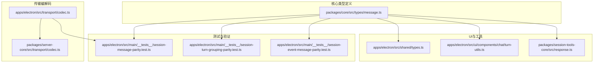
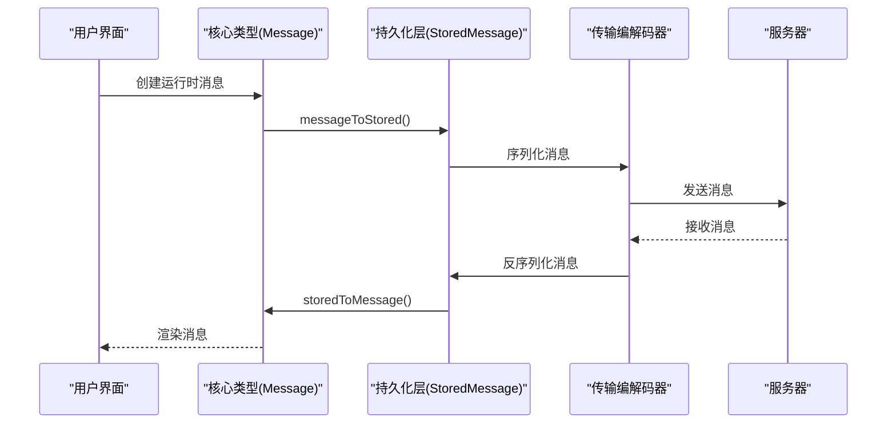
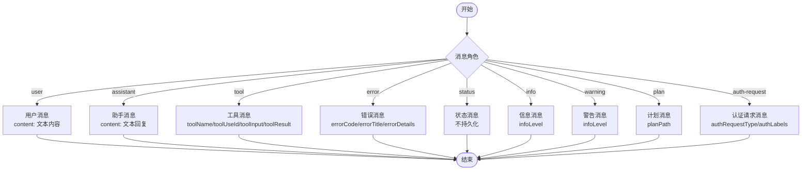
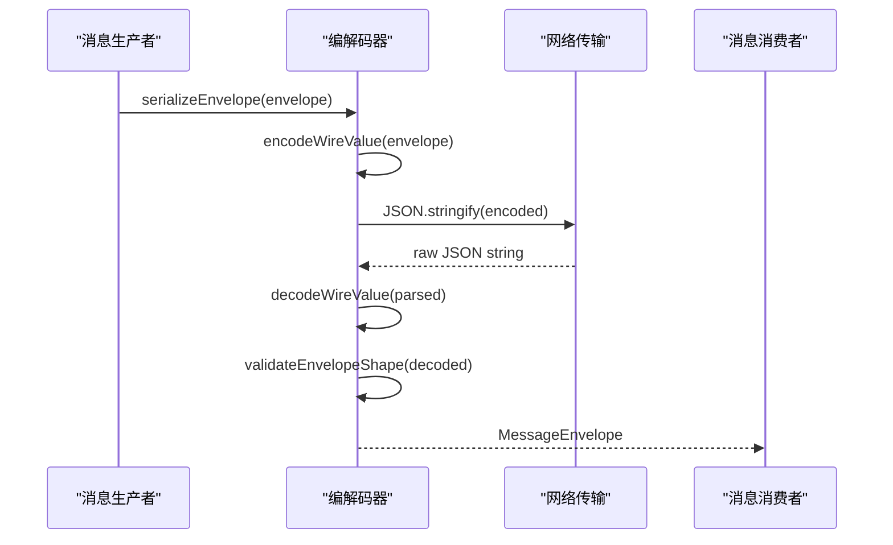
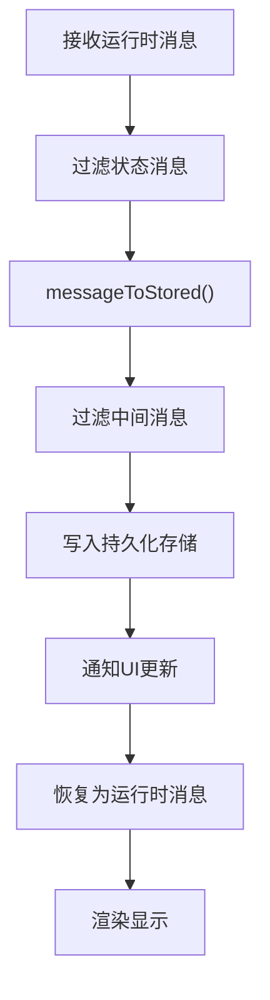
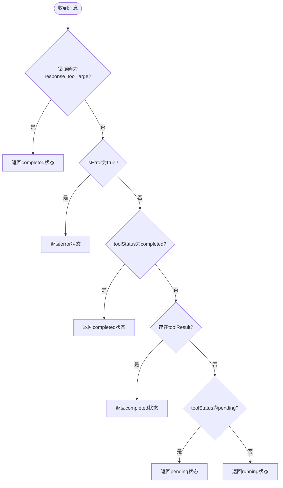
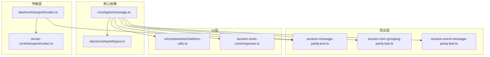

```mermaid
classDiagram
class Message {
+string id
+MessageRole role
+string content
+number timestamp
+string? toolName
+string? toolUseId
+Record~string, unknown~? toolInput
+string? toolResult
+ToolStatus? toolStatus
+number? toolDuration
+string? toolIntent
+string? toolDisplayName
+ToolDisplayMeta? toolDisplayMeta
+string? parentToolUseId
+string? taskId
+string? shellId
+number? elapsedSeconds
+boolean? isBackground
+StoredAttachment[]? attachments
+ContentBadge[]? badges
+boolean? isError
+boolean? isStreaming
+boolean? isPending
+boolean? isQueued
+boolean? isIntermediate
+string? turnId
+string? statusType
+string? errorCode
+string? errorTitle
+string[]? errorDetails
+string? errorOriginal
+boolean? errorCanRetry
+string? planPath
+string? authRequestId
+AuthRequestType? authRequestType
+string? authSourceSlug
+string? authSourceName
+AuthStatus? authStatus
+CredentialInputMode? authCredentialMode
+string? authHeaderName
+string[]? authHeaderNames
+object? authLabels
+string? authDescription
+string? authHint
+string? authSourceUrl
+boolean? authPasswordRequired
+string? authError
+string? authEmail
+string? authWorkspace
}
class StoredMessage {
+string id
+MessageRole type
+string content
+number? timestamp
+string? toolName
+string? toolUseId
+Record~string, unknown~? toolInput
+string? toolResult
+ToolStatus? toolStatus
+number? toolDuration
+string? toolIntent
+string? toolDisplayName
+ToolDisplayMeta? toolDisplayMeta
+string? parentToolUseId
+string? taskId
+string? shellId
+number? elapsedSeconds
+boolean? isBackground
+StoredAttachment[]? attachments
+ContentBadge[]? badges
+boolean? isError
+boolean? isQueued
+string? errorCode
+string? errorTitle
+string[]? errorDetails
+string? errorOriginal
+boolean? errorCanRetry
+string? planPath
+string? authRequestId
+AuthRequestType? authRequestType
+string? authSourceSlug
+string? authSourceName
+AuthStatus? authStatus
+CredentialInputMode? authCredentialMode
+string? authHeaderName
+string[]? authHeaderNames
+object? authLabels
+string? authDescription
+string? authHint
+string? authSourceUrl
+boolean? authPasswordRequired
+string? authError
+string? authEmail
+string? authWorkspace
}
Message --> StoredMessage : "messageToStored()"
StoredMessage --> Message : "storedToMessage()"
```

# 消息数据模型

<cite>
**本文档引用的文件**
- [packages/core/src/types/message.ts](file://packages/core/src/types/message.ts)
- [apps/electron/src/main/__tests__/session-message-parity.test.ts](file://apps/electron/src/main/__tests__/session-message-parity.test.ts)
- [apps/electron/src/main/__tests__/session-turn-grouping-parity.test.ts](file://apps/electron/src/main/__tests__/session-turn-grouping-parity.test.ts)
- [apps/electron/src/main/__tests__/session-event-message-parity.test.ts](file://apps/electron/src/main/__tests__/session-event-message-parity.test.ts)
- [apps/electron/src/transport/codec.ts](file://apps/electron/src/transport/codec.ts)
- [packages/server-core/src/transport/codec.ts](file://packages/server-core/src/transport/codec.ts)
- [apps/electron/src/shared/types.ts](file://apps/electron/src/shared/types.ts)
- [apps/electron/src/ui/components/chat/turn-utils.ts](file://apps/electron/src/ui/components/chat/turn-utils.ts)
- [packages/session-tools-core/src/response.ts](file://packages/session-tools-core/src/response.ts)
</cite>

## 目录

1. [简介](#简介)
2. [项目结构](#项目结构)
3. [核心组件](#核心组件)
4. [架构概览](#架构概览)
5. [详细组件分析](#详细组件分析)
6. [依赖关系分析](#依赖关系分析)
7. [性能考虑](#性能考虑)
8. [故障排除指南](#故障排除指南)
9. [结论](#结论)

## 简介

本文件详细描述了Craft Agents项目中的消息数据模型，包括消息结构、消息类型、消息内容格式以及相关的时间戳和元数据管理。文档涵盖了不同类型消息的结构差异（文本、工具调用、工具响应等），并提供了消息序列化和反序列化的实现细节。同时，文档还记录了消息ID生成策略、消息验证规则、业务逻辑约束，以及针对消息存储优化和查询性能的考虑。

## 项目结构

消息数据模型在项目中主要分布在以下位置：

- 核心类型定义：位于 `packages/core/src/types/message.ts`
- 消息持久化测试：位于 `apps/electron/src/main/__tests__/session-message-parity.test.ts`
- 转换编解码器：位于 `apps/electron/src/transport/codec.ts` 和 `packages/server-core/src/transport/codec.ts`
- UI转换单元测试：位于 `apps/electron/src/main/__tests__/session-turn-grouping-parity.test.ts`
- 事件到消息映射测试：位于 `apps/electron/src/main/__tests__/session-event-message-parity.test.ts`
- 类型导出与共享：位于 `apps/electron/src/shared/types.ts`
- 工具状态转换：位于 `apps/electron/src/ui/components/chat/turn-utils.ts`
- 工具响应构建：位于 `packages/session-tools-core/src/response.ts`

**图表来源**

- [packages/core/src/types/message.ts](file://packages/core/src/types/message.ts#L1-L437)
- [apps/electron/src/transport/codec.ts](file://apps/electron/src/transport/codec.ts#L1-L5)
- [packages/server-core/src/transport/codec.ts](file://packages/server-core/src/transport/codec.ts#L1-L155)
- [apps/electron/src/main/**tests**/session-message-parity.test.ts](file://apps/electron/src/main/__tests__/session-message-parity.test.ts#L1-L357)
- [apps/electron/src/main/**tests**/session-turn-grouping-parity.test.ts](file://apps/electron/src/main/__tests__/session-turn-grouping-parity.test.ts#L1-L30)
- [apps/electron/src/main/**tests**/session-event-message-parity.test.ts](file://apps/electron/src/main/__tests__/session-event-message-parity.test.ts#L1-L30)
- [apps/electron/src/shared/types.ts](file://apps/electron/src/shared/types.ts#L1-L808)
- [apps/electron/src/ui/components/chat/turn-utils.ts](file://apps/electron/src/ui/components/chat/turn-utils.ts#L240-L251)
- [packages/session-tools-core/src/response.ts](file://packages/session-tools-core/src/response.ts#L49-L65)

**章节来源**

- [packages/core/src/types/message.ts](file://packages/core/src/types/message.ts#L1-L437)
- [apps/electron/src/transport/codec.ts](file://apps/electron/src/transport/codec.ts#L1-L5)
- [packages/server-core/src/transport/codec.ts](file://packages/server-core/src/transport/codec.ts#L1-L155)

## 核心组件

消息数据模型的核心由以下关键接口和函数组成：

- Message：运行时消息对象，包含所有运行时字段（如流式状态、待处理标记等）
- StoredMessage：持久化消息对象，排除仅瞬态字段
- MessageRole：消息角色枚举，涵盖用户、助手、工具、错误、状态、信息、警告、计划、认证请求等
- ToolStatus：工具执行状态枚举，包括待定、执行中、完成、错误、后台
- 生成消息ID：通过 `generateMessageId()` 函数生成唯一标识符
- 转换函数：`messageToStored()` 和 `storedToMessage()` 实现运行时与持久化格式之间的双向转换

这些组件共同确保消息在不同阶段（运行时、持久化、传输）的一致性和完整性。

**章节来源**

- [packages/core/src/types/message.ts](file://packages/core/src/types/message.ts#L8-L436)
- [apps/electron/src/main/**tests**/session-message-parity.test.ts](file://apps/electron/src/main/__tests__/session-message-parity.test.ts#L17-L25)

## 架构概览

消息数据模型在整个系统中的流转路径如下：

**图表来源**

- [packages/core/src/types/message.ts](file://packages/core/src/types/message.ts#L432-L436)
- [apps/electron/src/main/**tests**/session-message-parity.test.ts](file://apps/electron/src/main/__tests__/session-message-parity.test.ts#L17-L25)
- [apps/electron/src/transport/codec.ts](file://apps/electron/src/transport/codec.ts#L1-L5)
- [packages/server-core/src/transport/codec.ts](file://packages/server-core/src/transport/codec.ts#L145-L155)

## 详细组件分析

### 消息结构与字段说明

消息模型包含两类核心结构：运行时消息和持久化消息。两者的主要区别在于是否包含瞬态字段（如流式状态、待处理标记等）。

- 运行时消息（Message）字段：
  - 基础字段：id、role、content、timestamp
  - 工具相关：toolName、toolUseId、toolInput、toolResult、toolStatus、toolDuration、toolIntent、toolDisplayName、toolDisplayMeta、parentToolUseId
  - 后台任务：taskId、shellId、elapsedSeconds、isBackground
  - 附件与徽章：attachments、badges
  - 错误与状态：isError、isStreaming、isPending、isQueued、isIntermediate、turnId、statusType、infoLevel
  - 认证请求：authRequestId、authRequestType、authSourceSlug、authSourceName、authStatus、authCredentialMode、authHeaderName、authHeaderNames、authLabels、authDescription、authHint、authSourceUrl、authPasswordRequired、authError、authEmail、authWorkspace

- 持久化消息（StoredMessage）字段：
  - 基础字段：id、type、content、timestamp
  - 工具相关：toolName、toolUseId、toolInput、toolResult、toolStatus、toolDuration、toolIntent、toolDisplayName、toolDisplayMeta、parentToolUseId
  - 后台任务：taskId、shellId、elapsedSeconds、isBackground
  - 附件与徽章：attachments、badges
  - 错误与状态：isError、isQueued、errorCode、errorTitle、errorDetails、errorOriginal、errorCanRetry、statusType
  - 认证请求：authRequestId、authRequestType、authSourceSlug、authSourceName、authStatus、authCredentialMode、authHeaderName、authHeaderNames、authLabels、authDescription、authHint、authSourceUrl、authPasswordRequired、authError、authEmail、authWorkspace

**图表来源**

- [packages/core/src/types/message.ts](file://packages/core/src/types/message.ts#L132-L274)

**章节来源**

- [packages/core/src/types/message.ts](file://packages/core/src/types/message.ts#L132-L274)

### 消息类型与角色映射

消息角色用于区分不同类型的消息，支持的角色包括：

- user：用户发送的消息
- assistant：助手生成的回复
- tool：工具调用或工具结果
- error：错误消息
- status：状态消息（通常不持久化）
- info：信息消息
- warning：警告消息
- plan：计划消息
- auth-request：认证请求消息

**图表来源**

- [packages/core/src/types/message.ts](file://packages/core/src/types/message.ts#L8-L17)

**章节来源**

- [packages/core/src/types/message.ts](file://packages/core/src/types/message.ts#L8-L17)

### 消息ID生成策略

消息ID采用统一的生成策略，确保全局唯一性：

- 格式：以 "msg-" 开头，后跟时间戳和随机字符串
- 时间戳：使用当前毫秒时间
- 随机部分：从随机数转换为36进制，取前6位字符
- 唯一性保证：结合时间戳和随机字符串，降低冲突概率

该策略既保证了消息ID的可读性（包含时间信息），又确保了分布式环境下的唯一性。

**章节来源**

- [packages/core/src/types/message.ts](file://packages/core/src/types/message.ts#L432-L436)

### 序列化与反序列化实现

消息在传输过程中的序列化和反序列化通过编解码器实现：

编解码器的关键特性：

- 支持多种消息类型：handshake、handshake_ack、request、response、event、error
- 对Uint8Array进行Base64编码/解码
- 严格的形状验证，确保消息结构正确
- 错误处理：对无效形状抛出异常

**图表来源**

- [packages/server-core/src/transport/codec.ts](file://packages/server-core/src/transport/codec.ts#L145-L155)

**章节来源**

- [packages/server-core/src/transport/codec.ts](file://packages/server-core/src/transport/codec.ts#L1-L155)
- [apps/electron/src/transport/codec.ts](file://apps/electron/src/transport/codec.ts#L1-L5)

### 消息持久化流程

消息持久化遵循以下流程，确保数据一致性：

持久化过程的关键点：

- 状态消息（status）不被持久化
- 中间消息（isIntermediate）在写入时被过滤
- timestamp在恢复时默认设置为当前时间
- parentToolUseId无条件传递

**图表来源**

- [apps/electron/src/main/**tests**/session-message-parity.test.ts](file://apps/electron/src/main/__tests__/session-message-parity.test.ts#L295-L357)

**章节来源**

- [apps/electron/src/main/**tests**/session-message-parity.test.ts](file://apps/electron/src/main/__tests__/session-message-parity.test.ts#L17-L25)
- [apps/electron/src/main/**tests**/session-message-parity.test.ts](file://apps/electron/src/main/__tests__/session-message-parity.test.ts#L295-L357)

### 不同类型消息的结构差异

#### 文本消息

- 最小结构：id、role、content、timestamp
- 典型用途：用户输入、助手回复
- 特殊字段：无

#### 工具调用消息

- 必需字段：toolName、toolUseId
- 输入参数：toolInput（任意结构）
- 显示信息：toolDisplayName、toolDisplayMeta
- 状态跟踪：toolStatus、toolDuration

#### 工具响应消息

- 关联字段：toolUseId（与对应工具调用关联）
- 结果内容：toolResult
- 错误处理：isError标志
- 完成确认：toolStatus设为completed

#### 认证请求消息

- 认证类型：authRequestType（支持多种认证方式）
- 凭据模式：authCredentialMode（单令牌、基本认证、自定义头部等）
- 用户交互：authLabels、authDescription、authHint
- 状态管理：authStatus（待定、完成、取消、失败）

**章节来源**

- [packages/core/src/types/message.ts](file://packages/core/src/types/message.ts#L132-L274)

### 工具状态转换

工具状态从消息到UI状态的转换逻辑：

**图表来源**

- [apps/electron/src/ui/components/chat/turn-utils.ts](file://apps/electron/src/ui/components/chat/turn-utils.ts#L240-L251)

**章节来源**

- [apps/electron/src/ui/components/chat/turn-utils.ts](file://apps/electron/src/ui/components/chat/turn-utils.ts#L240-L251)

### 工具响应构建

工具响应的构建支持多种场景：

- 单一文本块：textContent()
- 多文本块：multiBlockResponse()，支持错误标记

这些工具函数确保工具响应的一致性和可扩展性。

**章节来源**

- [packages/session-tools-core/src/response.ts](file://packages/session-tools-core/src/response.ts#L49-L65)

## 依赖关系分析

消息数据模型的依赖关系如下：

**图表来源**

- [apps/electron/src/shared/types.ts](file://apps/electron/src/shared/types.ts#L10-L43)
- [packages/core/src/types/message.ts](file://packages/core/src/types/message.ts#L1-L437)
- [apps/electron/src/transport/codec.ts](file://apps/electron/src/transport/codec.ts#L1-L5)
- [packages/server-core/src/transport/codec.ts](file://packages/server-core/src/transport/codec.ts#L1-L155)
- [apps/electron/src/main/**tests**/session-message-parity.test.ts](file://apps/electron/src/main/__tests__/session-message-parity.test.ts#L1-L357)
- [apps/electron/src/main/**tests**/session-turn-grouping-parity.test.ts](file://apps/electron/src/main/__tests__/session-turn-grouping-parity.test.ts#L1-L30)
- [apps/electron/src/main/**tests**/session-event-message-parity.test.ts](file://apps/electron/src/main/__tests__/session-event-message-parity.test.ts#L1-L30)
- [apps/electron/src/ui/components/chat/turn-utils.ts](file://apps/electron/src/ui/components/chat/turn-utils.ts#L240-L251)
- [packages/session-tools-core/src/response.ts](file://packages/session-tools-core/src/response.ts#L49-L65)

**章节来源**

- [apps/electron/src/shared/types.ts](file://apps/electron/src/shared/types.ts#L10-L43)
- [packages/core/src/types/message.ts](file://packages/core/src/types/message.ts#L1-L437)

## 性能考虑

基于代码分析，消息数据模型在性能方面有以下特点和建议：

### 存储优化

- 附件处理：用户消息的附件在持久化时移除Base64数据，仅保存文件路径和缩略图，减少存储空间占用
- 临时字段排除：运行时特有的流式状态、待处理标记等字段不会被持久化，降低存储开销
- 中间消息过滤：在写入持久化存储前过滤掉中间消息，避免冗余数据

### 查询性能

- 时间戳索引：消息包含时间戳字段，便于按时间排序和范围查询
- 角色过滤：支持按消息角色快速筛选不同类型的消息
- 转换单元测试：确保消息转换过程的性能和正确性

### 序列化性能

- 编解码器优化：使用高效的Base64编码/解码算法，支持大数组的分块处理
- 形状验证：在序列化前进行严格的形状验证，避免无效数据进入系统

## 故障排除指南

### 常见问题与解决方案

#### 消息ID冲突

- 症状：生成重复的消息ID
- 解决方案：检查时间戳精度和随机数生成器，确保足够的随机性

#### 持久化失败

- 症状：消息无法保存到数据库
- 解决方案：检查附件文件路径是否存在，验证存储权限

#### 传输错误

- 症状：消息在传输过程中损坏
- 解决方案：验证编解码器版本一致性，检查网络连接稳定性

#### UI显示异常

- 症状：消息显示不正确或状态错误
- 解决方案：检查工具状态转换逻辑，验证消息到UI状态的映射

**章节来源**

- [packages/server-core/src/transport/codec.ts](file://packages/server-core/src/transport/codec.ts#L121-L155)
- [apps/electron/src/ui/components/chat/turn-utils.ts](file://apps/electron/src/ui/components/chat/turn-utils.ts#L240-L251)

## 结论

Craft Agents的消息数据模型设计充分考虑了多阶段处理的需求，通过清晰的类型分离（运行时消息 vs 持久化消息）、严格的序列化/反序列化机制、以及完善的测试覆盖，确保了消息在不同组件间的可靠流转。该模型支持丰富的消息类型和复杂的工具交互场景，同时在存储优化和性能方面也做了充分考量。通过本文档提供的详细说明和最佳实践，开发者可以更好地理解和使用消息数据模型，构建稳定可靠的对话系统。
