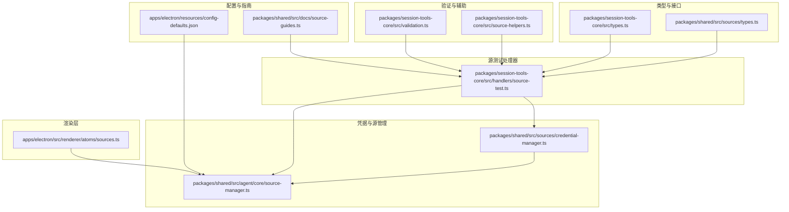
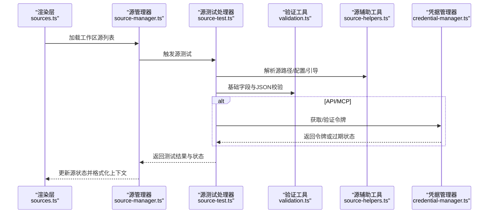
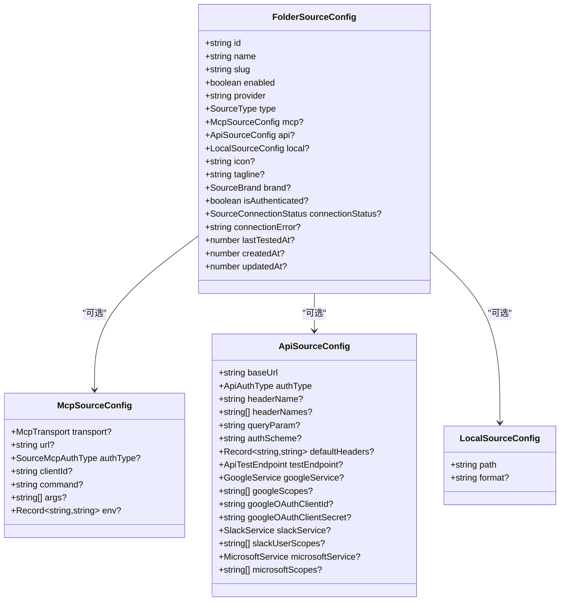
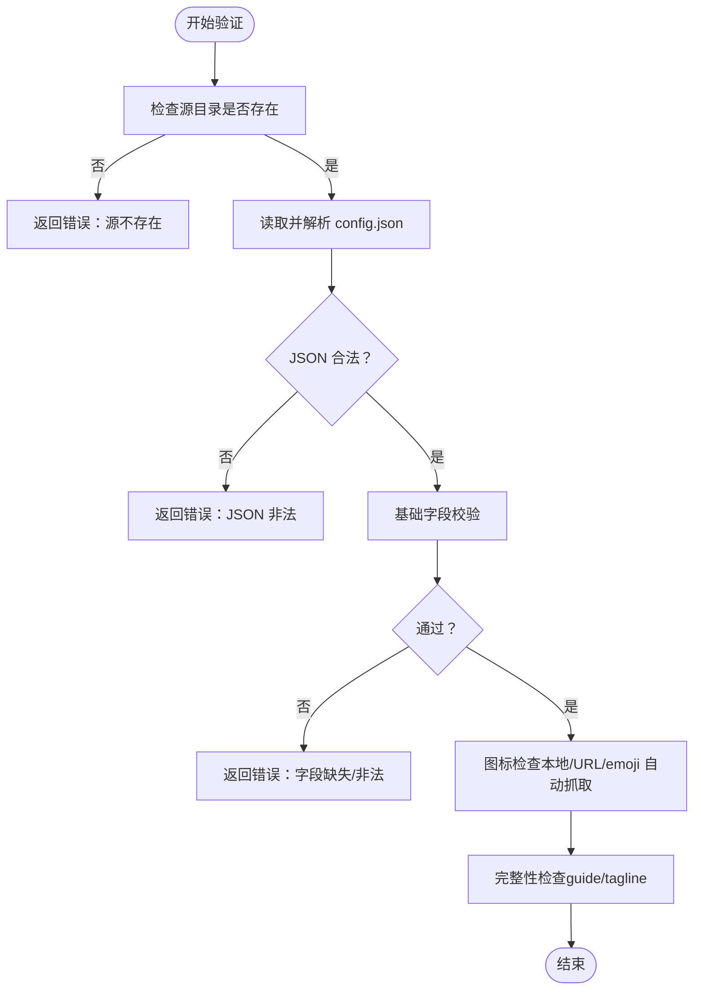
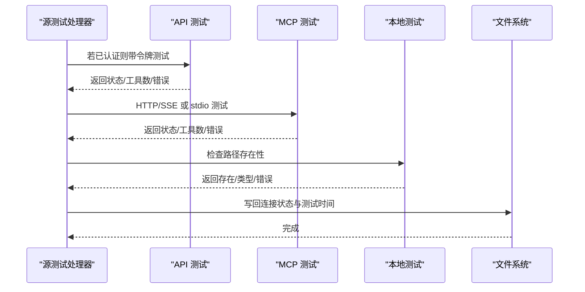
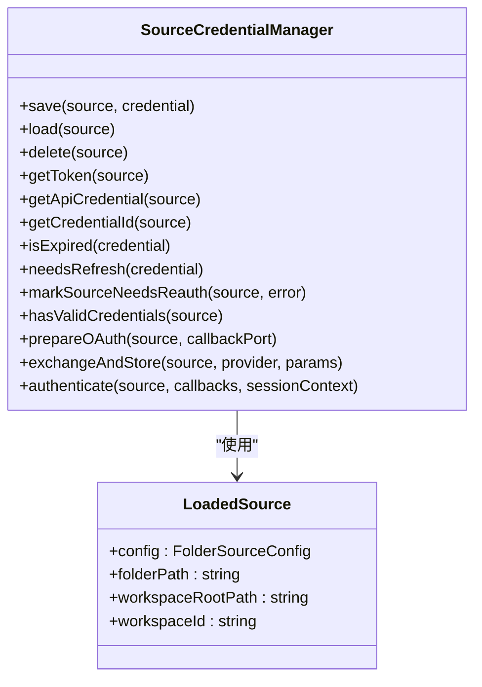
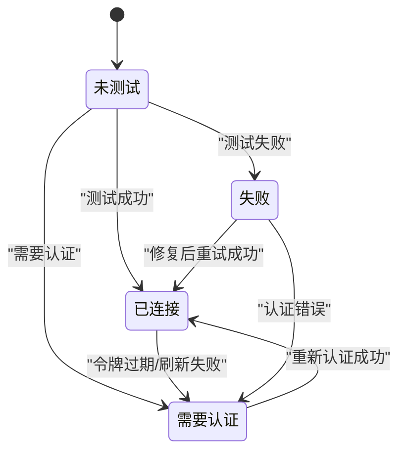
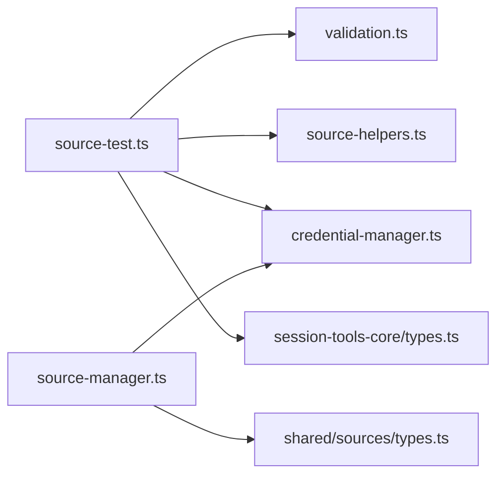

# 源配置模型

<cite>
**本文档引用的文件**
- [packages/session-tools-core/src/types.ts](file://packages/session-tools-core/src/types.ts)
- [packages/shared/src/sources/types.ts](file://packages/shared/src/sources/types.ts)
- [packages/session-tools-core/src/validation.ts](file://packages/session-tools-core/src/validation.ts)
- [packages/session-tools-core/src/source-helpers.ts](file://packages/session-tools-core/src/source-helpers.ts)
- [packages/session-tools-core/src/handlers/source-test.ts](file://packages/session-tools-core/src/handlers/source-test.ts)
- [packages/shared/src/agent/core/source-manager.ts](file://packages/shared/src/agent/core/source-manager.ts)
- [packages/shared/src/sources/credential-manager.ts](file://packages/shared/src/sources/credential-manager.ts)
- [apps/electron/src/renderer/atoms/sources.ts](file://apps/electron/src/renderer/atoms/sources.ts)
- [apps/electron/resources/config-defaults.json](file://apps/electron/resources/config-defaults.json)
- [packages/shared/src/docs/source-guides.ts](file://packages/shared/src/docs/source-guides.ts)
</cite>

## 目录

1. [简介](#简介)
2. [项目结构](#项目结构)
3. [核心组件](#核心组件)
4. [架构总览](#架构总览)
5. [详细组件分析](#详细组件分析)
6. [依赖关系分析](#依赖关系分析)
7. [性能考虑](#性能考虑)
8. [故障排除指南](#故障排除指南)
9. [结论](#结论)
10. [附录](#附录)

## 简介

本文件系统化梳理了“源配置模型”的数据结构、验证与连接管理机制，覆盖 MCP、API、本地文件三类数据源类型，并对配置参数、验证规则、生命周期管理、连接状态监控、错误处理、安全存储与凭据管理、动态更新与热重载等方面进行深入说明。同时提供各类数据源的配置要点与最佳实践，帮助开发者在不同运行环境下正确配置与维护数据源。

## 项目结构

围绕“源配置模型”，本仓库的关键实现分布在以下模块：

- 类型定义：统一的数据源类型、认证方式、连接状态等
- 验证工具：基础字段校验、JSON 合法性检查、技能/Mermaid 等扩展校验
- 源辅助工具：源目录、配置文件、引导文档路径解析与读取
- 源测试处理器：对源配置进行综合验证、图标处理、连通性测试、认证状态检查与元数据更新
- 凭据管理器：统一的凭据存储、加载、刷新、OAuth 流程与过期检测
- 源管理器：集中式源状态跟踪、上下文注入格式化、自动激活检测
- 渲染层原子：工作区源列表的状态存储与导航联动
- 默认配置：应用级默认项（与源配置相关的工作区默认项）
- 引导指南：域名提取与指南解析（已迁移至 MCP 文档服务）

图表来源

- [packages/session-tools-core/src/types.ts](file://packages/session-tools-core/src/types.ts#L214-L314)
- [packages/shared/src/sources/types.ts](file://packages/shared/src/sources/types.ts#L13-L460)
- [packages/session-tools-core/src/validation.ts](file://packages/session-tools-core/src/validation.ts#L320-L375)
- [packages/session-tools-core/src/source-helpers.ts](file://packages/session-tools-core/src/source-helpers.ts#L18-L95)
- [packages/session-tools-core/src/handlers/source-test.ts](file://packages/session-tools-core/src/handlers/source-test.ts#L54-L163)
- [packages/shared/src/sources/credential-manager.ts](file://packages/shared/src/sources/credential-manager.ts#L115-L200)
- [packages/shared/src/agent/core/source-manager.ts](file://packages/shared/src/agent/core/source-manager.ts#L40-L120)
- [apps/electron/src/renderer/atoms/sources.ts](file://apps/electron/src/renderer/atoms/sources.ts#L8-L17)
- [apps/electron/resources/config-defaults.json](file://apps/electron/resources/config-defaults.json#L1-L22)
- [packages/shared/src/docs/source-guides.ts](file://packages/shared/src/docs/source-guides.ts#L1-L228)

章节来源

- [packages/session-tools-core/src/types.ts](file://packages/session-tools-core/src/types.ts#L214-L314)
- [packages/shared/src/sources/types.ts](file://packages/shared/src/sources/types.ts#L13-L460)
- [packages/session-tools-core/src/validation.ts](file://packages/session-tools-core/src/validation.ts#L320-L375)
- [packages/session-tools-core/src/source-helpers.ts](file://packages/session-tools-core/src/source-helpers.ts#L18-L95)
- [packages/session-tools-core/src/handlers/source-test.ts](file://packages/session-tools-core/src/handlers/source-test.ts#L54-L163)
- [packages/shared/src/sources/credential-manager.ts](file://packages/shared/src/sources/credential-manager.ts#L115-L200)
- [packages/shared/src/agent/core/source-manager.ts](file://packages/shared/src/agent/core/source-manager.ts#L40-L120)
- [apps/electron/src/renderer/atoms/sources.ts](file://apps/electron/src/renderer/atoms/sources.ts#L8-L17)
- [apps/electron/resources/config-defaults.json](file://apps/electron/resources/config-defaults.json#L1-L22)
- [packages/shared/src/docs/source-guides.ts](file://packages/shared/src/docs/source-guides.ts#L1-L228)

## 核心组件

- 数据源类型与配置
  - 支持三种类型：mcp、api、local
  - MCP 支持 http/sse/http+oauth 以及本地 stdio 传输
  - API 支持 bearer/header/query/basic/multi-header 等多种认证方式
  - 本地支持指定路径与格式提示
- 连接状态与元数据
  - 连接状态包括 connected、needs_auth、failed、untested、local_disabled
  - 记录最近测试时间、错误信息、是否已认证等
- 验证与完整性
  - 基础字段校验（slug/name/type）、URL/路径存在性、图标与引导文档完整性
- 凭据与安全
  - 统一凭据 ID 解析、OAuth 流程、令牌过期检测、刷新策略
- 生命周期与状态管理
  - 源状态跟踪、上下文注入格式化、自动激活检测、UI 展示与导航联动

章节来源

- [packages/session-tools-core/src/types.ts](file://packages/session-tools-core/src/types.ts#L214-L314)
- [packages/shared/src/sources/types.ts](file://packages/shared/src/sources/types.ts#L13-L460)
- [packages/session-tools-core/src/validation.ts](file://packages/session-tools-core/src/validation.ts#L320-L375)
- [packages/shared/src/agent/core/source-manager.ts](file://packages/shared/src/agent/core/source-manager.ts#L40-L120)

## 架构总览

下图展示了从配置到测试、再到凭据与状态管理的整体流程：

图表来源

- [apps/electron/src/renderer/atoms/sources.ts](file://apps/electron/src/renderer/atoms/sources.ts#L8-L17)
- [packages/shared/src/agent/core/source-manager.ts](file://packages/shared/src/agent/core/source-manager.ts#L40-L120)
- [packages/session-tools-core/src/handlers/source-test.ts](file://packages/session-tools-core/src/handlers/source-test.ts#L54-L163)
- [packages/session-tools-core/src/validation.ts](file://packages/session-tools-core/src/validation.ts#L320-L375)
- [packages/session-tools-core/src/source-helpers.ts](file://packages/session-tools-core/src/source-helpers.ts#L18-L95)
- [packages/shared/src/sources/credential-manager.ts](file://packages/shared/src/sources/credential-manager.ts#L115-L200)

## 详细组件分析

### 数据模型与类型定义

- 源类型与认证
  - SourceType: mcp | api | local
  - MCP: transport(http/sse/stdio)、authType(oauth/bearer/none)、命令行参数与环境变量
  - API: baseUrl、authType(bearer/header/query/basic/oauth/none)、多头认证、查询参数、测试端点
  - Local: path、format 提示
- 连接状态
  - SourceConnectionStatus: connected | needs_auth | failed | untested | local_disabled
- 关键接口
  - FolderSourceConfig: 存储于 config.json 的主配置
  - LoadedSource: 完整加载后的源对象（含 guide、路径、品牌等）
  - SourceConfig: 会话工具使用的简化配置（含 connectionStatus/connectionError 等）

图表来源

- [packages/shared/src/sources/types.ts](file://packages/shared/src/sources/types.ts#L213-L372)

章节来源

- [packages/shared/src/sources/types.ts](file://packages/shared/src/sources/types.ts#L13-L460)

### 配置验证与完整性检查

- 基础验证
  - 必填字段：slug、name、type
  - 字段类型与取值范围校验
  - slug 格式正则校验
- JSON 文件合法性
  - 文件存在性、UTF-8 BOM 处理、JSON 解析
- 完整性检查
  - guide.md 存在性与内容长度建议
  - tagline 存在性与长度建议
  - icon 类型与来源（本地文件/URL/emoji），自动抓取与下载

图表来源

- [packages/session-tools-core/src/handlers/source-test.ts](file://packages/session-tools-core/src/handlers/source-test.ts#L65-L132)
- [packages/session-tools-core/src/validation.ts](file://packages/session-tools-core/src/validation.ts#L100-L148)
- [packages/session-tools-core/src/source-helpers.ts](file://packages/session-tools-core/src/source-helpers.ts#L57-L74)

章节来源

- [packages/session-tools-core/src/validation.ts](file://packages/session-tools-core/src/validation.ts#L320-L375)
- [packages/session-tools-core/src/handlers/source-test.ts](file://packages/session-tools-core/src/handlers/source-test.ts#L65-L132)

### 连接测试与状态管理

- API 连接测试
  - 若已认证且可用令牌，优先进行带认证请求测试
  - 支持自定义测试端点（方法、路径、头部、体）
  - 超时控制与常见状态码处理（401/403/404 等）
- MCP 连接测试
  - HTTP/SSE：调用验证接口获取工具数量、服务器名称与版本
  - stdio：验证命令/参数/环境变量，若无专用验证接口则仅报告配置
- 本地连接测试
  - 检查路径存在性与类型（文件/目录）
- 状态更新
  - 成功/失败/未测试/需要认证等状态写回配置文件
  - 记录最近测试时间与错误信息

图表来源

- [packages/session-tools-core/src/handlers/source-test.ts](file://packages/session-tools-core/src/handlers/source-test.ts#L332-L764)

章节来源

- [packages/session-tools-core/src/handlers/source-test.ts](file://packages/session-tools-core/src/handlers/source-test.ts#L332-L764)

### 凭据管理与安全存储

- 凭据类型与解析
  - 根据源类型与认证方式确定凭据 ID 类型（source_oauth、source_bearer、source_apikey、source_basic）
  - 支持多头认证（headerNames）与基本认证（username/password）解析
- OAuth 流程
  - 支持 Google/Slack/Microsoft OAuth 与 MCP OAuth
  - 服务端准备授权 URL、交换令牌并保存，标记源为已认证
- 过期与刷新
  - 过期检测与提前刷新（5 分钟窗口）
  - 并发刷新去重（防止微软轮换刷新令牌时的竞争条件）
- 错误处理
  - 刷新失败或令牌缺失时，标记源为需要重新认证，UI 显示并提供修复指引

图表来源

- [packages/shared/src/sources/credential-manager.ts](file://packages/shared/src/sources/credential-manager.ts#L115-L501)

章节来源

- [packages/shared/src/sources/credential-manager.ts](file://packages/shared/src/sources/credential-manager.ts#L115-L501)

### 源生命周期与状态监控

- 生命周期
  - 创建：生成 config.json 与 guide.md（可选）
  - 加载：解析配置、图标、引导、品牌
  - 测试：连通性与认证状态检查
  - 运行：按需自动激活、上下文注入、工具调用
  - 更新：动态修改配置后，重新测试并更新状态
  - 删除：清理配置与缓存
- 状态监控
  - SourceManager 维护活动/预期活动源集合，格式化上下文注入
  - 自动检测工具调用失败是否由源未激活导致，触发自动激活
  - 对需要认证或失败的源，提供修复建议

图表来源

- [packages/shared/src/agent/core/source-manager.ts](file://packages/shared/src/agent/core/source-manager.ts#L40-L120)
- [packages/shared/src/sources/credential-manager.ts](file://packages/shared/src/sources/credential-manager.ts#L328-L341)

章节来源

- [packages/shared/src/agent/core/source-manager.ts](file://packages/shared/src/agent/core/source-manager.ts#L40-L120)
- [packages/shared/src/sources/credential-manager.ts](file://packages/shared/src/sources/credential-manager.ts#L328-L341)

### 动态更新与热重载机制

- 渲染层状态
  - 使用 Jotai 原子存储当前工作区源列表，导航时自动选择
- 源状态变更
  - 测试处理器将最新状态写回配置文件，SourceManager 重新格式化上下文
- 自动激活
  - 当工具调用失败且定位到未激活源时，自动尝试激活并重试

章节来源

- [apps/electron/src/renderer/atoms/sources.ts](file://apps/electron/src/renderer/atoms/sources.ts#L8-L17)
- [packages/shared/src/agent/core/source-manager.ts](file://packages/shared/src/agent/core/source-manager.ts#L289-L329)

## 依赖关系分析

- 类型依赖
  - session-tools-core/types.ts 与 shared/sources/types.ts 共同定义了源配置的核心类型
- 处理器依赖
  - source-test.ts 依赖 validation.ts 与 source-helpers.ts 进行校验与文件操作
  - 依赖 credential-manager.ts 进行认证状态检查
- 管理依赖
  - source-manager.ts 依赖 credential-manager.ts 与 types.ts 进行状态格式化与自动激活检测

图表来源

- [packages/session-tools-core/src/handlers/source-test.ts](file://packages/session-tools-core/src/handlers/source-test.ts#L1-L26)
- [packages/session-tools-core/src/validation.ts](file://packages/session-tools-core/src/validation.ts#L1-L16)
- [packages/session-tools-core/src/source-helpers.ts](file://packages/session-tools-core/src/source-helpers.ts#L1-L16)
- [packages/shared/src/sources/credential-manager.ts](file://packages/shared/src/sources/credential-manager.ts#L1-L30)
- [packages/shared/src/agent/core/source-manager.ts](file://packages/shared/src/agent/core/source-manager.ts#L1-L20)
- [packages/shared/src/sources/types.ts](file://packages/shared/src/sources/types.ts#L1-L20)
- [packages/session-tools-core/src/types.ts](file://packages/session-tools-core/src/types.ts#L1-L20)

章节来源

- [packages/session-tools-core/src/handlers/source-test.ts](file://packages/session-tools-core/src/handlers/source-test.ts#L1-L26)
- [packages/shared/src/agent/core/source-manager.ts](file://packages/shared/src/agent/core/source-manager.ts#L1-L20)

## 性能考虑

- 连接测试超时控制：默认 10 秒，避免阻塞
- 并发刷新去重：同一源的刷新请求合并，减少重复网络请求
- 最小化文件系统访问：仅在必要时读取配置与图标，图标下载后缓存
- 上下文格式化：按需构建，避免重复计算

## 故障排除指南

- 常见问题与处理
  - 401/403：认证失败或令牌过期，触发“需要重新认证”状态
  - 404：端点不存在或路径错误，检查 testEndpoint.path
  - 无法到达：URL 错误或网络问题，使用 WebSearch 验证
  - 令牌缺失：刷新失败或存储异常，检查凭据管理器日志
- UI 与上下文提示
  - SourceManager 在系统提示中注入源状态与修复建议
  - 自动激活失败时，提供具体工具名与修复步骤

章节来源

- [packages/session-tools-core/src/handlers/source-test.ts](file://packages/session-tools-core/src/handlers/source-test.ts#L528-L541)
- [packages/shared/src/agent/core/source-manager.ts](file://packages/shared/src/agent/core/source-manager.ts#L247-L269)

## 结论

该源配置模型以清晰的类型定义为基础，结合严格的验证与完善的连接测试流程，实现了对 MCP、API、本地文件三类数据源的一致管理。通过统一的凭据管理与状态跟踪，系统能够在运行时自动处理认证与连接问题，并通过上下文注入与自动激活提升用户体验。建议在实际部署中：

- 明确各源的认证方式与测试端点
- 合理设置标签与引导文档，提升使用体验
- 利用自动激活与上下文提示，降低用户干预成本
- 定期执行源测试，确保连接状态准确

## 附录

### 数据源类型与配置参数对照

- MCP 源
  - 传输：http/sse/stdio
  - 认证：oauth/bearer/none
  - 关键参数：url/command/args/env
- API 源
  - 认证：bearer/header/query/basic/oauth/none
  - 关键参数：baseUrl、headerName/headerNames、queryParam、authScheme、defaultHeaders、testEndpoint
  - OAuth 参数：googleService/googleScopes、slackService/slackUserScopes、microsoftService/microsoftScopes 及客户端凭据
- 本地源
  - 关键参数：path、format

章节来源

- [packages/shared/src/sources/types.ts](file://packages/shared/src/sources/types.ts#L213-L300)

### 配置示例与最佳实践

- API 源示例要点
  - 设置 baseUrl 与 authType
  - 如需多头认证，提供 headerNames 数组并在令牌中提供对应键值
  - 如需 OAuth，配置 provider 与相应服务/作用域
- MCP 源示例要点
  - http/sse：提供 url；如需 OAuth，设置 authType 为 oauth
  - stdio：提供 command、args、env；确保命令可执行
- 本地源示例要点
  - 指定可访问的绝对路径；如为目录，注意权限与遍历性能

章节来源

- [packages/shared/src/sources/types.ts](file://packages/shared/src/sources/types.ts#L254-L300)
- [packages/session-tools-core/src/handlers/source-test.ts](file://packages/session-tools-core/src/handlers/source-test.ts#L368-L764)

### 默认值与可选参数

- 应用默认项（与源配置相关）
  - 工作区默认：localMcpServers.enabled=true
- 源配置默认项
  - MCP：transport 默认 http
  - API：authScheme 默认 Bearer
  - 其余多数字段为可选，需根据具体源类型与认证方式显式配置

章节来源

- [apps/electron/resources/config-defaults.json](file://apps/electron/resources/config-defaults.json#L13-L21)
- [packages/shared/src/sources/types.ts](file://packages/shared/src/sources/types.ts#L213-L292)

### 引导指南与域名提取

- 引导指南解析：支持 YAML frontmatter 与分节标记
- 域名提取：从 URL 主机名或 provider 映射推断域名，用于匹配指南
- 注意：内置指南已迁移至 MCP 文档服务，不再内置于包中

章节来源

- [packages/shared/src/docs/source-guides.ts](file://packages/shared/src/docs/source-guides.ts#L1-L228)
