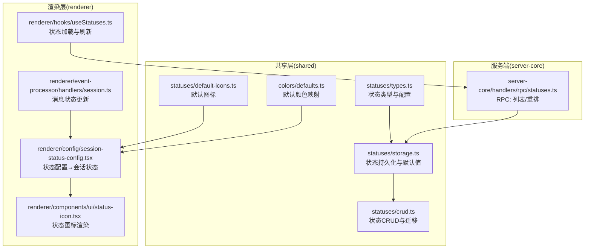
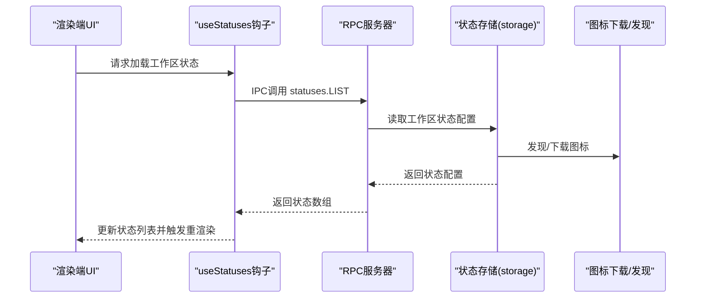
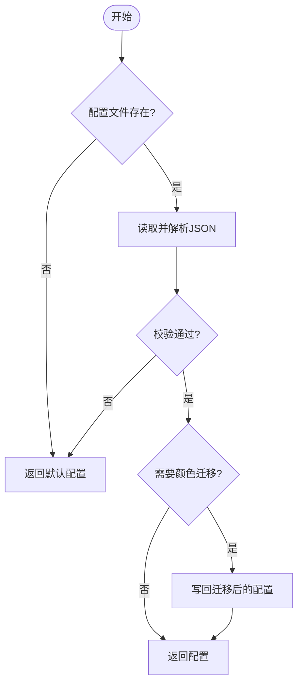
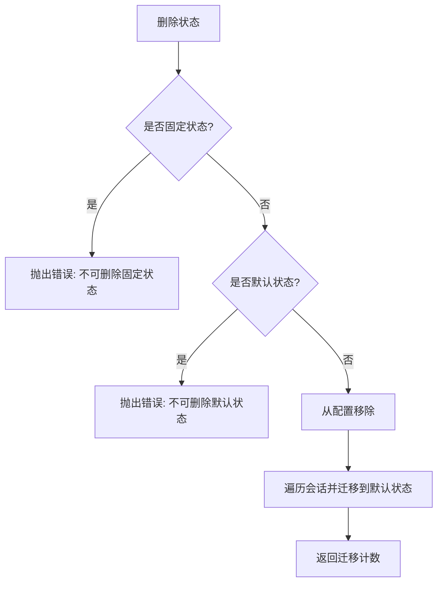
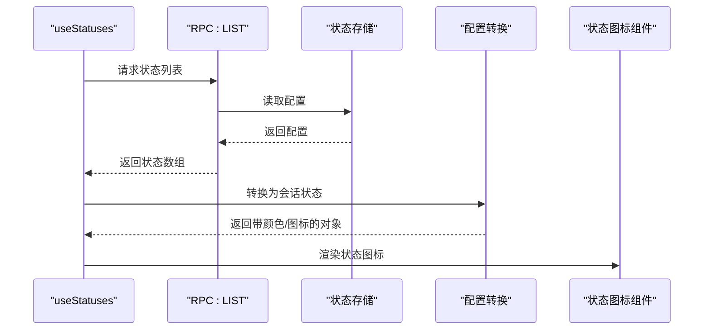
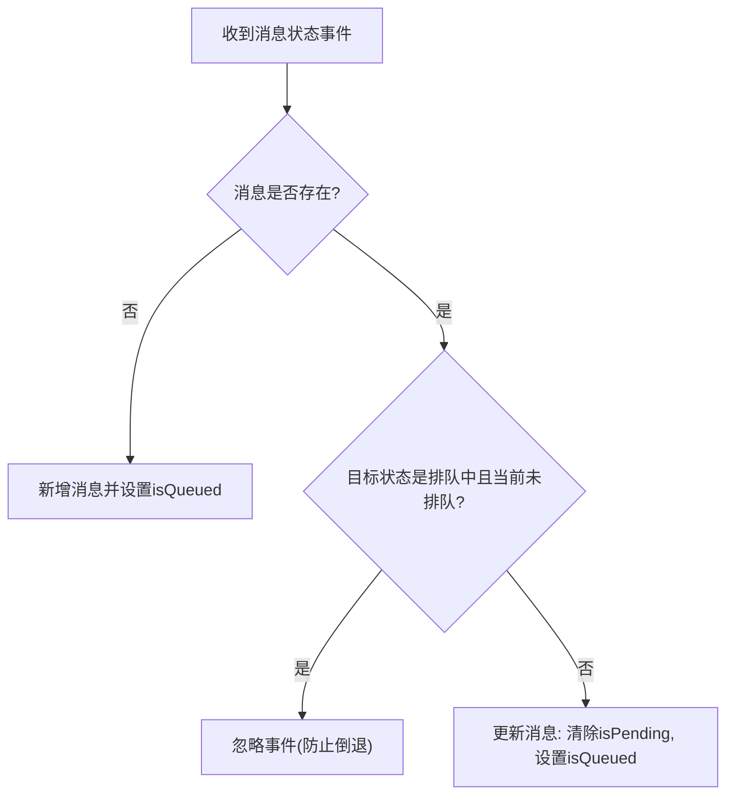
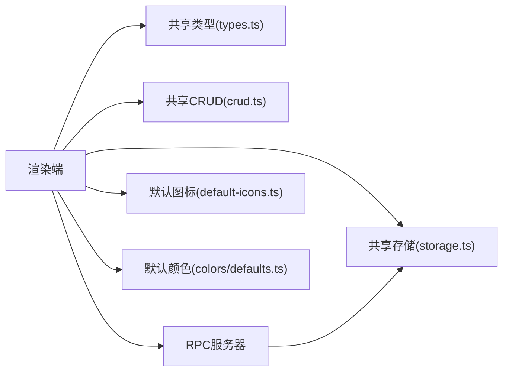

# 状态系统模型

<cite>
**本文引用的文件**
- [packages/shared/src/statuses/index.ts](file://packages/shared/src/statuses/index.ts)
- [packages/shared/src/statuses/types.ts](file://packages/shared/src/statuses/types.ts)
- [packages/shared/src/statuses/storage.ts](file://packages/shared/src/statuses/storage.ts)
- [packages/shared/src/statuses/crud.ts](file://packages/shared/src/statuses/crud.ts)
- [packages/shared/src/statuses/default-icons.ts](file://packages/shared/src/statuses/default-icons.ts)
- [packages/shared/src/colors/defaults.ts](file://packages/shared/src/colors/defaults.ts)
- [apps/electron/src/renderer/config/session-status-config.tsx](file://apps/electron/src/renderer/config/session-status-config.tsx)
- [apps/electron/src/renderer/hooks/useStatuses.ts](file://apps/electron/src/renderer/hooks/useStatuses.ts)
- [apps/electron/src/renderer/components/ui/status-icon.tsx](file://apps/electron/src/renderer/components/ui/status-icon.tsx)
- [packages/server-core/src/handlers/rpc/statuses.ts](file://packages/server-core/src/handlers/rpc/statuses.ts)
- [apps/electron/src/renderer/event-processor/handlers/session.ts](file://apps/electron/src/renderer/event-processor/handlers/session.ts)
</cite>

## 目录

1. [引言](#引言)
2. [项目结构](#项目结构)
3. [核心组件](#核心组件)
4. [架构总览](#架构总览)
5. [详细组件分析](#详细组件分析)
6. [依赖关系分析](#依赖关系分析)
7. [性能考量](#性能考量)
8. [故障排查指南](#故障排查指南)
9. [结论](#结论)
10. [附录](#附录)

## 引言

本文件系统性梳理状态系统模型，覆盖动态状态、状态转换与自定义状态的实现；明确状态定义、状态枚举与状态属性；解释状态之间的转换规则与状态机逻辑；给出内置状态与自定义状态的配置示例；阐述状态系统的扩展机制与插件接口；记录状态的持久化存储与状态同步机制；并提供状态系统的性能优化与状态查询接口建议。

## 项目结构

状态系统围绕“工作区级可配置状态”展开，采用共享模块（shared）定义类型与持久化逻辑，渲染端（renderer）负责状态到 UI 的呈现与交互，服务端（server-core）通过 RPC 暴露状态列表与排序能力，事件处理器（event-processor）在运行时处理消息状态变更。



**图表来源**

- [packages/shared/src/statuses/types.ts](file://packages/shared/src/statuses/types.ts#L1-L95)
- [packages/shared/src/statuses/storage.ts](file://packages/shared/src/statuses/storage.ts#L1-L322)
- [packages/shared/src/statuses/crud.ts](file://packages/shared/src/statuses/crud.ts#L1-L197)
- [packages/shared/src/statuses/default-icons.ts](file://packages/shared/src/statuses/default-icons.ts#L1-L71)
- [packages/shared/src/colors/defaults.ts](file://packages/shared/src/colors/defaults.ts#L1-L40)
- [apps/electron/src/renderer/config/session-status-config.tsx](file://apps/electron/src/renderer/config/session-status-config.tsx#L1-L176)
- [apps/electron/src/renderer/components/ui/status-icon.tsx](file://apps/electron/src/renderer/components/ui/status-icon.tsx#L1-L63)
- [apps/electron/src/renderer/hooks/useStatuses.ts](file://apps/electron/src/renderer/hooks/useStatuses.ts#L1-L79)
- [packages/server-core/src/handlers/rpc/statuses.ts](file://packages/server-core/src/handlers/rpc/statuses.ts#L1-L31)
- [apps/electron/src/renderer/event-processor/handlers/session.ts](file://apps/electron/src/renderer/event-processor/handlers/session.ts#L488-L520)

**章节来源**

- [packages/shared/src/statuses/index.ts](file://packages/shared/src/statuses/index.ts#L1-L21)
- [packages/shared/src/statuses/types.ts](file://packages/shared/src/statuses/types.ts#L1-L95)
- [packages/shared/src/statuses/storage.ts](file://packages/shared/src/statuses/storage.ts#L1-L322)
- [packages/shared/src/statuses/crud.ts](file://packages/shared/src/statuses/crud.ts#L1-L197)
- [packages/shared/src/statuses/default-icons.ts](file://packages/shared/src/statuses/default-icons.ts#L1-L71)
- [packages/shared/src/colors/defaults.ts](file://packages/shared/src/colors/defaults.ts#L1-L40)
- [apps/electron/src/renderer/config/session-status-config.tsx](file://apps/electron/src/renderer/config/session-status-config.tsx#L1-L176)
- [apps/electron/src/renderer/hooks/useStatuses.ts](file://apps/electron/src/renderer/hooks/useStatuses.ts#L1-L79)
- [apps/electron/src/renderer/components/ui/status-icon.tsx](file://apps/electron/src/renderer/components/ui/status-icon.tsx#L1-L63)
- [packages/server-core/src/handlers/rpc/statuses.ts](file://packages/server-core/src/handlers/rpc/statuses.ts#L1-L31)
- [apps/electron/src/renderer/event-processor/handlers/session.ts](file://apps/electron/src/renderer/event-processor/handlers/session.ts#L488-L520)

## 核心组件

- 状态类型与配置：定义状态标识、标签、颜色、图标、分类、固定/默认标记、显示顺序等字段，以及工作区状态配置结构与 CRUD 输入类型。
- 状态持久化：提供默认配置生成、配置加载/保存、图标发现与下载、校验与迁移等能力。
- 状态 CRUD：支持创建、更新、删除、重排、重置为默认等操作，并对固定状态与默认状态施加业务约束。
- 渲染配置：将后端配置转换为前端可用的会话状态对象，解析颜色、图标、类别、是否可着色等属性。
- 图标与颜色：内置默认图标与颜色映射，支持系统色与自定义色，自动适配明暗主题。
- RPC 接口：提供状态列表与重排的 RPC 处理器，供渲染端通过 IPC 调用。
- 运行时状态更新：事件处理器根据消息状态更新队列/进行中标志，保证事件乱序场景下的状态一致性。

**章节来源**

- [packages/shared/src/statuses/types.ts](file://packages/shared/src/statuses/types.ts#L1-L95)
- [packages/shared/src/statuses/storage.ts](file://packages/shared/src/statuses/storage.ts#L1-L322)
- [packages/shared/src/statuses/crud.ts](file://packages/shared/src/statuses/crud.ts#L1-L197)
- [apps/electron/src/renderer/config/session-status-config.tsx](file://apps/electron/src/renderer/config/session-status-config.tsx#L1-L176)
- [packages/shared/src/colors/defaults.ts](file://packages/shared/src/colors/defaults.ts#L1-L40)
- [packages/server-core/src/handlers/rpc/statuses.ts](file://packages/server-core/src/handlers/rpc/statuses.ts#L1-L31)
- [apps/electron/src/renderer/event-processor/handlers/session.ts](file://apps/electron/src/renderer/event-processor/handlers/session.ts#L488-L520)

## 架构总览

状态系统以“工作区”为作用域，状态配置由共享模块统一管理，渲染端负责 UI 呈现与交互，服务端通过 RPC 提供状态列表与排序能力，事件处理器在运行时维护消息级别的状态一致性。



**图表来源**

- [apps/electron/src/renderer/hooks/useStatuses.ts](file://apps/electron/src/renderer/hooks/useStatuses.ts#L1-L79)
- [packages/server-core/src/handlers/rpc/statuses.ts](file://packages/server-core/src/handlers/rpc/statuses.ts#L1-L31)
- [packages/shared/src/statuses/storage.ts](file://packages/shared/src/statuses/storage.ts#L136-L169)

## 详细组件分析

### 数据模型与状态定义

- 状态配置（StatusConfig）
  - 字段：唯一ID、显示名、可选颜色、图标（emoji或URL）、分类（开放/关闭）、是否固定、是否默认、显示顺序。
  - 分类决定过滤行为：开放状态出现在收件箱，关闭状态出现在归档。
- 工作区状态配置（WorkspaceStatusConfig）
  - 包含版本号、状态数组、默认状态ID（通常为“待办”）。
- 状态枚举与属性
  - 内置状态ID集合：backlog、todo、needs-review、done、cancelled。
  - 固定状态：todo、done、cancelled 不可删除/重命名。
  - 默认状态：in-progress、needs-review 可修改但不可删除。
- 状态属性
  - 颜色：系统色或自定义色；默认颜色映射由共享模块提供。
  - 图标：本地SVG优先于URL下载，再回退到emoji；未找到时使用默认SVG。
  - 可着色性：非emoji图标可随主题色变化，emoji保持原色。

```mermaid
classDiagram
class StatusConfig {
+string id
+string label
+EntityColor color
+string icon
+StatusCategory category
+boolean isFixed
+boolean isDefault
+number order
}
class WorkspaceStatusConfig {
+number version
+StatusConfig[] statuses
+string defaultStatusId
}
class StatusCategory {
<<enum>>
"open"
"closed"
}
WorkspaceStatusConfig --> StatusConfig : "包含多个"
```

**图表来源**

- [packages/shared/src/statuses/types.ts](file://packages/shared/src/statuses/types.ts#L31-L74)

**章节来源**

- [packages/shared/src/statuses/types.ts](file://packages/shared/src/statuses/types.ts#L1-L95)
- [packages/shared/src/colors/defaults.ts](file://packages/shared/src/colors/defaults.ts#L1-L40)
- [packages/shared/src/statuses/default-icons.ts](file://packages/shared/src/statuses/default-icons.ts#L1-L71)

### 状态持久化与存储

- 默认配置：包含内置状态与默认顺序，缺失时自动回退。
- 加载策略：若配置不存在或无效，返回默认配置；首次加载自动确保默认图标文件存在；旧版颜色格式自动迁移。
- 保存策略：写入工作区 statuses/config.json；目录不存在则自动创建。
- 图标策略：优先本地文件，其次URL下载，最后emoji；下载后按状态ID重命名为 {statusId}.{ext}。
- 校验与迁移：验证必需固定状态存在；迁移旧颜色格式并写回磁盘。



**图表来源**

- [packages/shared/src/statuses/storage.ts](file://packages/shared/src/statuses/storage.ts#L136-L169)

**章节来源**

- [packages/shared/src/statuses/storage.ts](file://packages/shared/src/statuses/storage.ts#L1-L322)

### 状态CRUD与业务规则

- 创建：基于标签生成URL安全的ID，冲突时追加数字后缀；顺序为当前最大值+1。
- 更新：禁止更改固定状态的分类；允许修改标签、颜色、图标、分类。
- 删除：禁止删除固定状态与默认状态；删除后将使用该状态的会话迁移到“待办”，并返回迁移数量。
- 重排：接收新顺序数组，校验所有ID有效后批量更新顺序。
- 重置默认：删除所有自定义状态，恢复内置默认配置，并迁移无效状态的会话。



**图表来源**

- [packages/shared/src/statuses/crud.ts](file://packages/shared/src/statuses/crud.ts#L96-L123)

**章节来源**

- [packages/shared/src/statuses/crud.ts](file://packages/shared/src/statuses/crud.ts#L1-L197)

### 渲染配置与UI集成

- 配置转换：将 StatusConfig 转换为 SessionStatus，解析实体颜色为CSS颜色字符串，确定图标是否可着色，生成带样式的图标节点。
- 辅助函数：按ID获取图标、样式、颜色、标签；清理图标缓存以响应配置更新。
- 图标组件：封装 EntityIcon，按工作区与状态ID定位图标文件，支持无容器渲染与无边框渲染。
- 钩子：useStatuses 通过IPC拉取状态列表，监听状态变更事件并自动刷新，同时清理图标缓存。



**图表来源**

- [apps/electron/src/renderer/hooks/useStatuses.ts](file://apps/electron/src/renderer/hooks/useStatuses.ts#L1-L79)
- [apps/electron/src/renderer/config/session-status-config.tsx](file://apps/electron/src/renderer/config/session-status-config.tsx#L46-L88)
- [apps/electron/src/renderer/components/ui/status-icon.tsx](file://apps/electron/src/renderer/components/ui/status-icon.tsx#L1-L63)

**章节来源**

- [apps/electron/src/renderer/config/session-status-config.tsx](file://apps/electron/src/renderer/config/session-status-config.tsx#L1-L176)
- [apps/electron/src/renderer/components/ui/status-icon.tsx](file://apps/electron/src/renderer/components/ui/status-icon.tsx#L1-L63)
- [apps/electron/src/renderer/hooks/useStatuses.ts](file://apps/electron/src/renderer/hooks/useStatuses.ts#L1-L79)

### 状态转换与状态机逻辑

- 动态状态：状态ID为任意字符串，支持自定义状态；内置状态ID集合用于约定与默认行为。
- 状态转换规则：
  - 固定状态（如“待办/完成/取消”）不允许删除或重命名，确保工作流稳定性。
  - 自定义状态可增删改，但需遵守顺序与分类约束。
  - 会话消息状态：事件处理器维护 isQueued 与 isPending 标志，避免“处理中”回退到“排队中”的状态倒退。
- 状态机逻辑要点：
  - 事件序列保护：当已进入“处理中”后，晚到的“排队中”事件被忽略。
  - 状态迁移：删除状态时，使用该状态的会话迁移到默认状态（通常是“待办”）。



**图表来源**

- [apps/electron/src/renderer/event-processor/handlers/session.ts](file://apps/electron/src/renderer/event-processor/handlers/session.ts#L488-L520)

**章节来源**

- [apps/electron/src/renderer/event-processor/handlers/session.ts](file://apps/electron/src/renderer/event-processor/handlers/session.ts#L488-L520)
- [packages/shared/src/statuses/crud.ts](file://packages/shared/src/statuses/crud.ts#L178-L196)

### 扩展机制与插件接口

- 插件接口（RPC）：服务端注册 statuses.LIST 与 statuses.REORDER 通道，渲染端通过IPC调用。
- 扩展点：
  - 自定义状态：通过 CRUD 创建新状态，设置分类与顺序。
  - 自定义图标：提供本地SVG或URL图标，系统自动下载并命名。
  - 自定义颜色：使用系统色或自定义色，自动适配明暗主题。
- 配置变更通知：渲染端监听状态变更事件，自动刷新并清理图标缓存。

**章节来源**

- [packages/server-core/src/handlers/rpc/statuses.ts](file://packages/server-core/src/handlers/rpc/statuses.ts#L1-L31)
- [apps/electron/src/renderer/hooks/useStatuses.ts](file://apps/electron/src/renderer/hooks/useStatuses.ts#L57-L70)

### 状态持久化存储与同步机制

- 存储位置：工作区根路径下 statuses/config.json 与 statuses/icons/ 下的图标文件。
- 同步机制：
  - RPC 列表：渲染端通过 statuses.LIST 获取最新配置。
  - RPC 重排：statuses.REORDER 接收新的状态ID顺序，写回配置。
  - 文件变更：配置或图标文件变更后，渲染端收到通知并刷新。
- 自愈能力：首次加载自动创建默认图标文件；颜色格式迁移后写回磁盘。

**章节来源**

- [packages/shared/src/statuses/storage.ts](file://packages/shared/src/statuses/storage.ts#L136-L169)
- [packages/server-core/src/handlers/rpc/statuses.ts](file://packages/server-core/src/handlers/rpc/statuses.ts#L11-L30)
- [apps/electron/src/renderer/hooks/useStatuses.ts](file://apps/electron/src/renderer/hooks/useStatuses.ts#L57-L70)

## 依赖关系分析

- 组件耦合：
  - 渲染端依赖共享模块的类型与颜色/图标工具。
  - RPC 依赖共享模块的存储与配置读取。
  - 事件处理器依赖渲染端的状态配置解析结果。
- 外部依赖：
  - 文件系统：statuses/config.json 与 statuses/icons/。
  - IPC/RPC：渲染端与服务端通信。
- 循环依赖：
  - CRUD 中内部导入会话存储以执行会话迁移，属于受控的内部依赖。



**图表来源**

- [packages/shared/src/statuses/types.ts](file://packages/shared/src/statuses/types.ts#L1-L95)
- [packages/shared/src/statuses/storage.ts](file://packages/shared/src/statuses/storage.ts#L1-L322)
- [packages/shared/src/statuses/crud.ts](file://packages/shared/src/statuses/crud.ts#L1-L197)
- [packages/shared/src/statuses/default-icons.ts](file://packages/shared/src/statuses/default-icons.ts#L1-L71)
- [packages/shared/src/colors/defaults.ts](file://packages/shared/src/colors/defaults.ts#L1-L40)
- [packages/server-core/src/handlers/rpc/statuses.ts](file://packages/server-core/src/handlers/rpc/statuses.ts#L1-L31)

**章节来源**

- [packages/shared/src/statuses/index.ts](file://packages/shared/src/statuses/index.ts#L1-L21)
- [packages/shared/src/statuses/types.ts](file://packages/shared/src/statuses/types.ts#L1-L95)
- [packages/shared/src/statuses/storage.ts](file://packages/shared/src/statuses/storage.ts#L1-L322)
- [packages/shared/src/statuses/crud.ts](file://packages/shared/src/statuses/crud.ts#L1-L197)
- [packages/shared/src/statuses/default-icons.ts](file://packages/shared/src/statuses/default-icons.ts#L1-L71)
- [packages/shared/src/colors/defaults.ts](file://packages/shared/src/colors/defaults.ts#L1-L40)
- [packages/server-core/src/handlers/rpc/statuses.ts](file://packages/server-core/src/handlers/rpc/statuses.ts#L1-L31)

## 性能考量

- 图标缓存：渲染端提供图标缓存清理函数，配置更新后主动清理，避免陈旧图标导致的重复IO。
- 事件序列保护：在消息状态更新中避免状态回退，减少不必要的UI重绘与状态广播。
- 颜色解析：颜色解析与图标生成在渲染端进行，避免重复计算；系统色自动适配明暗主题，减少样式切换成本。
- 文件I/O最小化：首次加载自动确保默认图标文件存在，减少后续查找失败带来的额外开销。

**章节来源**

- [apps/electron/src/renderer/config/session-status-config.tsx](file://apps/electron/src/renderer/config/session-status-config.tsx#L167-L175)
- [apps/electron/src/renderer/event-processor/handlers/session.ts](file://apps/electron/src/renderer/event-processor/handlers/session.ts#L493-L498)

## 故障排查指南

- 配置加载失败
  - 现象：状态列表为空或回退默认。
  - 排查：检查 statuses/config.json 是否存在且可解析；确认必需固定状态存在。
  - 处理：删除损坏配置或重置为默认。
- 图标不显示
  - 现象：状态图标缺失或显示为默认圆点。
  - 排查：确认 statuses/icons/ 下是否存在对应 {statusId}.svg/png/jpg；若配置为URL，检查下载是否成功。
  - 处理：触发图标缓存清理并刷新；必要时重新下载。
- 状态变更未生效
  - 现象：修改状态分类/删除状态后会话未迁移。
  - 排查：确认CRUD操作返回值与日志；检查会话存储中的状态字段。
  - 处理：执行重置默认或手动迁移无效状态。
- 事件乱序导致状态倒退
  - 现象：消息状态从“处理中”回退到“排队中”。
  - 排查：检查事件到达顺序与处理器逻辑。
  - 处理：利用事件序列保护逻辑忽略晚到事件。

**章节来源**

- [packages/shared/src/statuses/storage.ts](file://packages/shared/src/statuses/storage.ts#L147-L168)
- [packages/shared/src/statuses/crud.ts](file://packages/shared/src/statuses/crud.ts#L96-L123)
- [apps/electron/src/renderer/event-processor/handlers/session.ts](file://apps/electron/src/renderer/event-processor/handlers/session.ts#L493-L498)

## 结论

该状态系统以工作区为中心，通过共享模块统一定义与持久化状态配置，渲染端负责UI呈现与交互，服务端提供RPC能力，事件处理器保障运行时状态一致性。系统支持内置与自定义状态、颜色与图标灵活配置、严格的业务规则与迁移策略，并具备良好的扩展性与性能表现。

## 附录

### 内置状态与自定义状态配置示例

- 内置状态（固定/默认）
  - backlog：开放，固定，表示尚未计划。
  - todo：开放，固定，表示待办。
  - needs-review：开放，默认，表示需要审阅。
  - done：关闭，固定，表示已完成。
  - cancelled：关闭，固定，表示已取消。
- 自定义状态
  - 通过 CRUD 创建新状态，设置分类与顺序；可指定颜色与图标。
  - 示例路径参考：
    - [packages/shared/src/statuses/crud.ts](file://packages/shared/src/statuses/crud.ts#L26-L57)
    - [packages/shared/src/statuses/types.ts](file://packages/shared/src/statuses/types.ts#L79-L94)

### 状态查询接口

- 列出状态：statuses.LIST（RPC）
  - 输入：工作区ID
  - 输出：按顺序排列的状态数组
  - 参考：[packages/server-core/src/handlers/rpc/statuses.ts](file://packages/server-core/src/handlers/rpc/statuses.ts#L13-L19)
- 重排状态：statuses.REORDER（RPC）
  - 输入：工作区ID、新的状态ID顺序数组
  - 输出：无（写回配置）
  - 参考：[packages/server-core/src/handlers/rpc/statuses.ts](file://packages/server-core/src/handlers/rpc/statuses.ts#L23-L29)

### 状态转换规则速查

- 固定状态不可删除/重命名。
- 默认状态不可删除，仅可修改。
- 删除状态会将使用该状态的会话迁移到默认状态。
- 事件处理器避免状态回退，保证顺序一致性。
- 参考：
  - [packages/shared/src/statuses/crud.ts](file://packages/shared/src/statuses/crud.ts#L76-L123)
  - [apps/electron/src/renderer/event-processor/handlers/session.ts](file://apps/electron/src/renderer/event-processor/handlers/session.ts#L493-L498)
