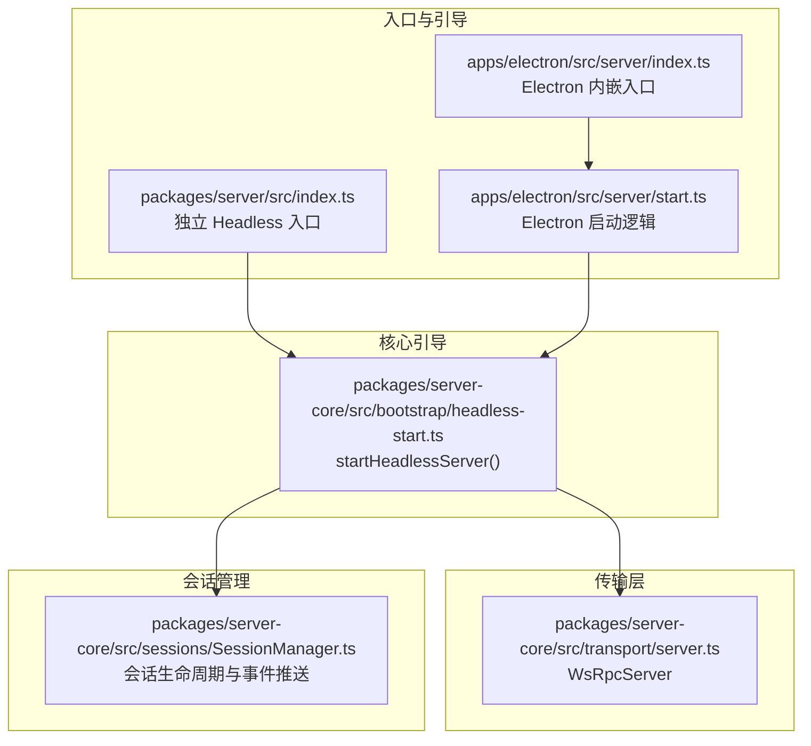
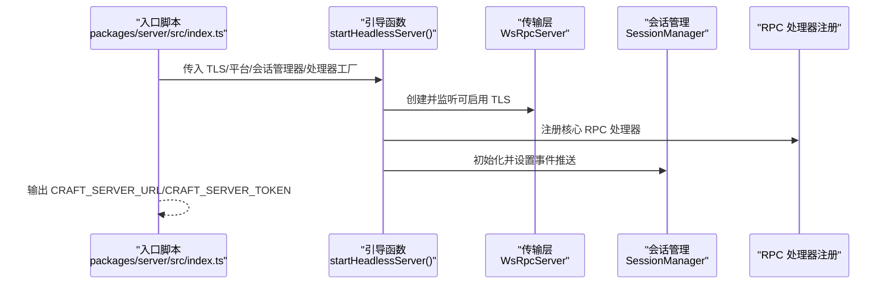
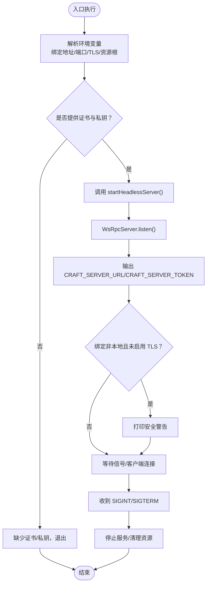
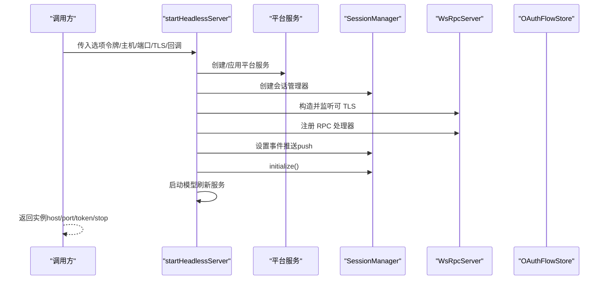
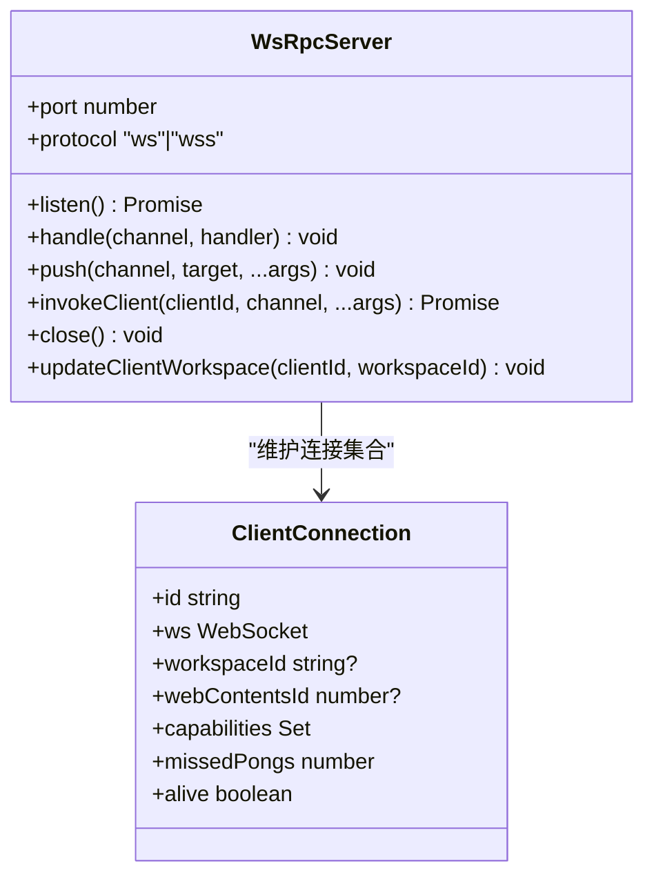
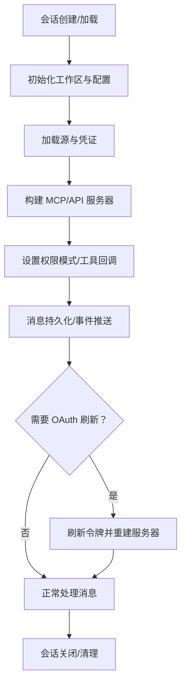
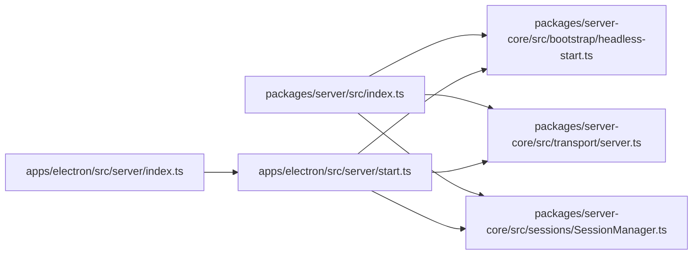

# 服务器端实现

<cite>
**本文引用的文件**
- [packages/server/src/index.ts](file://packages/server/src/index.ts)
- [apps/electron/src/server/index.ts](file://apps/electron/src/server/index.ts)
- [apps/electron/src/server/start.ts](file://apps/electron/src/server/start.ts)
- [packages/server-core/src/bootstrap/headless-start.ts](file://packages/server-core/src/bootstrap/headless-start.ts)
- [packages/server-core/src/transport/server.ts](file://packages/server-core/src/transport/server.ts)
- [packages/server-core/src/sessions/SessionManager.ts](file://packages/server-core/src/sessions/SessionManager.ts)
- [apps/cli/src/server-spawner.ts](file://apps/cli/src/server-spawner.ts)
- [packages/pi-agent-server/src/index.ts](file://packages/pi-agent-server/src/index.ts)
</cite>

## 目录

1. [引言](#引言)
2. [项目结构](#项目结构)
3. [核心组件](#核心组件)
4. [架构总览](#架构总览)
5. [详细组件分析](#详细组件分析)
6. [依赖分析](#依赖分析)
7. [性能考量](#性能考量)
8. [故障排查指南](#故障排查指南)
9. [结论](#结论)
10. [附录：环境变量与安全配置](#附录环境变量与安全配置)

## 引言

本文件面向 Craft Agents 服务器端实现，系统性阐述其架构设计、启动流程、调用关系、接口与使用模式，并结合仓库中的真实代码路径进行说明。内容覆盖服务器启动、TLS 与安全、会话管理、资源清理、与客户端交互、以及常见问题与优化建议，兼顾初学者可读性与资深开发者的深度需求。

## 项目结构

服务器端由“入口脚本 + 核心引导 + 传输层 + 会话管理”构成，支持两种运行形态：

- 独立 Headless 服务器（packages/server）
- Electron 内嵌 Headless 服务器（apps/electron）

图表来源

- [packages/server/src/index.ts](file://packages/server/src/index.ts#L55-L113)
- [apps/electron/src/server/index.ts](file://apps/electron/src/server/index.ts#L18-L20)
- [apps/electron/src/server/start.ts](file://apps/electron/src/server/start.ts#L17-L76)
- [packages/server-core/src/bootstrap/headless-start.ts](file://packages/server-core/src/bootstrap/headless-start.ts#L70-L175)
- [packages/server-core/src/transport/server.ts](file://packages/server-core/src/transport/server.ts#L83-L246)
- [packages/server-core/src/sessions/SessionManager.ts](file://packages/server-core/src/sessions/SessionManager.ts#L1-L200)

章节来源

- [packages/server/src/index.ts](file://packages/server/src/index.ts#L1-L135)
- [apps/electron/src/server/index.ts](file://apps/electron/src/server/index.ts#L1-L21)
- [apps/electron/src/server/start.ts](file://apps/electron/src/server/start.ts#L1-L88)
- [packages/server-core/src/bootstrap/headless-start.ts](file://packages/server-core/src/bootstrap/headless-start.ts#L1-L176)
- [packages/server-core/src/transport/server.ts](file://packages/server-core/src/transport/server.ts#L1-L558)
- [packages/server-core/src/sessions/SessionManager.ts](file://packages/server-core/src/sessions/SessionManager.ts#L1-L800)

## 核心组件

- 独立 Headless 入口：负责解析环境变量、加载 TLS 证书、初始化平台与子系统、注册 RPC 处理器、创建会话管理器、启动服务并输出连接信息。
- Electron 内嵌入口：在 Electron 主进程中动态导入启动逻辑，复用相同的引导流程。
- 核心引导（startHeadlessServer）：统一处理令牌校验、监听端口、注册处理器、设置事件推送、初始化模型刷新服务、清理钩子等。
- 传输层（WsRpcServer）：WebSocket RPC 服务器，负责握手、心跳、鉴权、请求分发、推送路由与错误处理。
- 会话管理（SessionManager）：管理会话生命周期、消息持久化、权限模式、OAuth 刷新、工具与源集成、事件推送等。

章节来源

- [packages/server/src/index.ts](file://packages/server/src/index.ts#L22-L113)
- [apps/electron/src/server/start.ts](file://apps/electron/src/server/start.ts#L17-L76)
- [packages/server-core/src/bootstrap/headless-start.ts](file://packages/server-core/src/bootstrap/headless-start.ts#L70-L175)
- [packages/server-core/src/transport/server.ts](file://packages/server-core/src/transport/server.ts#L83-L558)
- [packages/server-core/src/sessions/SessionManager.ts](file://packages/server-core/src/sessions/SessionManager.ts#L1-L200)

## 架构总览

下图展示从入口到传输层与会话管理的整体调用链路，以及 TLS 与安全控制点。

图表来源

- [packages/server/src/index.ts](file://packages/server/src/index.ts#L55-L113)
- [packages/server-core/src/bootstrap/headless-start.ts](file://packages/server-core/src/bootstrap/headless-start.ts#L70-L175)
- [packages/server-core/src/transport/server.ts](file://packages/server-core/src/transport/server.ts#L196-L246)

章节来源

- [packages/server/src/index.ts](file://packages/server/src/index.ts#L39-L113)
- [packages/server-core/src/bootstrap/headless-start.ts](file://packages/server-core/src/bootstrap/headless-start.ts#L70-L175)
- [packages/server-core/src/transport/server.ts](file://packages/server-core/src/transport/server.ts#L196-L246)

## 详细组件分析

### 组件一：独立 Headless 入口（packages/server/src/index.ts）

- 功能要点
  - 解析环境变量（如绑定地址、端口、TLS 证书与私钥、资源根目录等）。
  - 条件加载 TLS 配置，若仅提供证书或密钥则直接退出。
  - 调用核心引导函数 startHeadlessServer，注入平台、会话管理器、处理器注册、事件推送与清理钩子。
  - 输出服务器 URL 与令牌；对非本地绑定且未启用 TLS 的场景发出警告。
  - 注册 SIGINT/SIGTERM 信号以优雅关闭。

图表来源

- [packages/server/src/index.ts](file://packages/server/src/index.ts#L39-L126)

章节来源

- [packages/server/src/index.ts](file://packages/server/src/index.ts#L1-L135)

### 组件二：Electron 内嵌入口（apps/electron/src/server/index.ts 与 start.ts）

- 功能要点
  - Electron 内嵌入口仅做环境变量默认值设置与动态导入启动逻辑。
  - 启动逻辑与独立入口一致，但使用 Electron 运行时平台与资源路径。

章节来源

- [apps/electron/src/server/index.ts](file://apps/electron/src/server/index.ts#L1-L21)
- [apps/electron/src/server/start.ts](file://apps/electron/src/server/start.ts#L1-L88)

### 组件三：核心引导（startHeadlessServer）

- 功能要点
  - 校验并获取服务器令牌；初始化平台与全局配置；设置打包资源根目录。
  - 创建会话管理器、OAuth 流程存储；构建 WsRpcServer 并监听；注册 RPC 处理器；设置事件推送；启动模型刷新服务。
  - 提供 stop 关闭流程：停止模型刷新、清理会话管理器、关闭传输层、释放 OAuth 存储。

图表来源

- [packages/server-core/src/bootstrap/headless-start.ts](file://packages/server-core/src/bootstrap/headless-start.ts#L70-L175)

章节来源

- [packages/server-core/src/bootstrap/headless-start.ts](file://packages/server-core/src/bootstrap/headless-start.ts#L70-L175)

### 组件四：传输层（WsRpcServer）

- 功能要点
  - 支持 ws 与 wss 双协议，按需启用 TLS。
  - 握手阶段校验协议版本、可选令牌校验、能力集声明；建立客户端连接后发送握手确认并注册生命周期回调。
  - 请求分发：根据通道名查找处理器，上下文包含客户端 ID、工作区 ID、窗口 ID；异常转换为响应错误。
  - 心跳机制：定期 ping，统计失联次数，超限自动断开。
  - 推送路由：支持向所有客户端、同一工作区或指定客户端推送事件。
  - 客户端请求：invokeClient 发起请求并等待响应，超时与断连均抛出带特定错误码的异常。

图表来源

- [packages/server-core/src/transport/server.ts](file://packages/server-core/src/transport/server.ts#L83-L558)

章节来源

- [packages/server-core/src/transport/server.ts](file://packages/server-core/src/transport/server.ts#L1-L558)

### 组件五：会话管理（SessionManager）

- 功能要点
  - 会话生命周期：创建、初始化、消息持久化、状态更新、关闭与清理。
  - 权限模式与用户交互：支持安全/询问/全允许三种模式，配合前端授权请求与重试机制。
  - 源与工具：加载工作区源、构建 MCP/API 服务器、OAuth 令牌刷新、桥接服务更新。
  - 事件推送：将会话事件通过传输层推送给客户端；支持批量写入队列与异步操作状态。
  - 资源安全：附件路径验证策略、敏感文件访问限制、临时目录隔离等。

图表来源

- [packages/server-core/src/sessions/SessionManager.ts](file://packages/server-core/src/sessions/SessionManager.ts#L209-L339)

章节来源

- [packages/server-core/src/sessions/SessionManager.ts](file://packages/server-core/src/sessions/SessionManager.ts#L1-L800)

### 组件六：CLI 服务器启动器（apps/cli/src/server-spawner.ts）

- 功能要点
  - 自动定位 Electron 内嵌服务器入口文件。
  - 以子进程方式启动服务器，注入随机令牌与本地绑定参数。
  - 从标准输出读取服务器 URL 与令牌，提供停止方法。
  - 支持启动超时与静默模式。

章节来源

- [apps/cli/src/server-spawner.ts](file://apps/cli/src/server-spawner.ts#L1-L145)

### 组件七：Pi Agent 子进程服务器（packages/pi-agent-server/src/index.ts）

- 功能要点
  - 通过 JSONL 协议与主进程通信，承载 Pi SDK 的会话与工具执行。
  - 实现回调服务器用于外部 LLM 查询；代理工具定义与执行；权限拦截与大结果摘要。
  - 会话分支与恢复、模型解析与提示注入、认证存储与模型注册表。

章节来源

- [packages/pi-agent-server/src/index.ts](file://packages/pi-agent-server/src/index.ts#L1-L800)

## 依赖分析

- 入口脚本依赖核心引导模块与会话管理器；在 Electron 模式下通过 start.ts 复用相同引导。
- 核心引导依赖传输层（WsRpcServer）、会话管理器、平台服务、模型刷新服务与搜索/图像处理平台。
- 传输层依赖协议编解码与 ws 库；会话管理器依赖共享的会话存储、源与工具生态。

图表来源

- [packages/server/src/index.ts](file://packages/server/src/index.ts#L22-L113)
- [apps/electron/src/server/index.ts](file://apps/electron/src/server/index.ts#L18-L20)
- [apps/electron/src/server/start.ts](file://apps/electron/src/server/start.ts#L17-L76)
- [packages/server-core/src/bootstrap/headless-start.ts](file://packages/server-core/src/bootstrap/headless-start.ts#L70-L175)
- [packages/server-core/src/transport/server.ts](file://packages/server-core/src/transport/server.ts#L83-L246)
- [packages/server-core/src/sessions/SessionManager.ts](file://packages/server-core/src/sessions/SessionManager.ts#L1-L200)

章节来源

- [packages/server/src/index.ts](file://packages/server/src/index.ts#L22-L113)
- [apps/electron/src/server/start.ts](file://apps/electron/src/server/start.ts#L17-L76)
- [packages/server-core/src/bootstrap/headless-start.ts](file://packages/server-core/src/bootstrap/headless-start.ts#L70-L175)
- [packages/server-core/src/transport/server.ts](file://packages/server-core/src/transport/server.ts#L83-L246)
- [packages/server-core/src/sessions/SessionManager.ts](file://packages/server-core/src/sessions/SessionManager.ts#L1-L200)

## 性能考量

- 心跳与断连：传输层定期 ping 并统计失联次数，避免僵尸连接占用资源。
- 请求超时：客户端请求默认超时时间有助于快速失败与资源回收。
- 批量持久化：会话管理器的消息持久化采用队列化处理，降低频繁 IO 带来的抖动。
- 模型刷新：引导阶段启动模型刷新服务，避免首次查询延迟。
- 大响应摘要：对长文本结果进行摘要，减少网络与前端渲染压力。

[本节为通用性能讨论，不直接分析具体文件]

## 故障排查指南

- 无法启动（端口被占用或无效）
  - 检查 CRAFT_RPC_PORT 是否在 0-65535 之间；若为 0 则使用系统分配端口。
  - 查看引导日志中监听成功信息与最终端口。
- 认证失败
  - 确认客户端握手时携带的令牌与服务端令牌一致；服务端要求鉴权时必须提供有效令牌。
- TLS 配置错误
  - 同时提供证书与私钥文件路径；可选提供 CA 链；确保文件权限正确。
- 安全警告
  - 若绑定到非本地地址且未启用 TLS，服务会打印安全警告；建议配置 TLS 或仅绑定本地地址。
- 客户端无响应或超时
  - 检查客户端是否正确握手并通过能力集声明；查看传输层心跳与断连日志；确认请求通道已注册。
- 会话异常终止
  - 查看会话管理器的日志与事件；检查权限模式与授权请求；确认 OAuth 刷新流程是否成功。

章节来源

- [packages/server-core/src/bootstrap/headless-start.ts](file://packages/server-core/src/bootstrap/headless-start.ts#L93-L107)
- [packages/server-core/src/transport/server.ts](file://packages/server-core/src/transport/server.ts#L295-L383)
- [packages/server/src/index.ts](file://packages/server/src/index.ts#L118-L126)

## 结论

Craft Agents 服务器端通过清晰的分层设计实现了高内聚、低耦合的服务架构：入口脚本负责环境与 TLS 解析，核心引导统一装配平台、传输与会话，传输层提供稳健的 RPC 通道，会话管理器承载业务状态与资源。该架构既满足独立部署需求，又可在 Electron 中无缝内嵌，具备良好的扩展性与安全性。

[本节为总结性内容，不直接分析具体文件]

## 附录：环境变量与安全配置

- 服务器令牌
  - CRAFT_SERVER_TOKEN：必需，客户端握手时必须提供。
- 绑定与端口
  - CRAFT_RPC_HOST：默认 127.0.0.1；生产环境建议仅本地绑定或启用 TLS。
  - CRAFT_RPC_PORT：默认 9100；设为 0 使用系统分配端口。
- TLS 配置
  - CRAFT_RPC_TLS_CERT：PEM 证书路径（启用 wss）。
  - CRAFT_RPC_TLS_KEY：PEM 私钥路径（与证书配套）。
  - CRAFT_RPC_TLS_CA：可选，PEM CA 链用于客户端证书校验。
- 资源与打包
  - CRAFT_APP_ROOT：应用根目录，默认当前工作目录。
  - CRAFT_RESOURCES_PATH：资源目录，默认当前工作目录/resources。
  - CRAFT_IS_PACKAGED：'true' 表示生产模式。
  - CRAFT_BUNDLED_ASSETS_ROOT：打包资产根目录（独立入口优先使用）。
- 版本与调试
  - CRAFT_VERSION：应用版本号。
  - CRAFT_DEBUG：'true' 开启调试日志。

安全建议

- 生产环境务必启用 TLS（设置证书与私钥），避免明文令牌在网络中传输。
- 仅在受信网络内暴露服务器，必要时使用反向代理与防火墙策略。
- 定期轮换令牌，限制令牌作用域与有效期。

章节来源

- [packages/server/src/index.ts](file://packages/server/src/index.ts#L8-L20)
- [packages/server-core/src/bootstrap/headless-start.ts](file://packages/server-core/src/bootstrap/headless-start.ts#L93-L98)
- [packages/server-core/src/transport/server.ts](file://packages/server-core/src/transport/server.ts#L49-L58)
