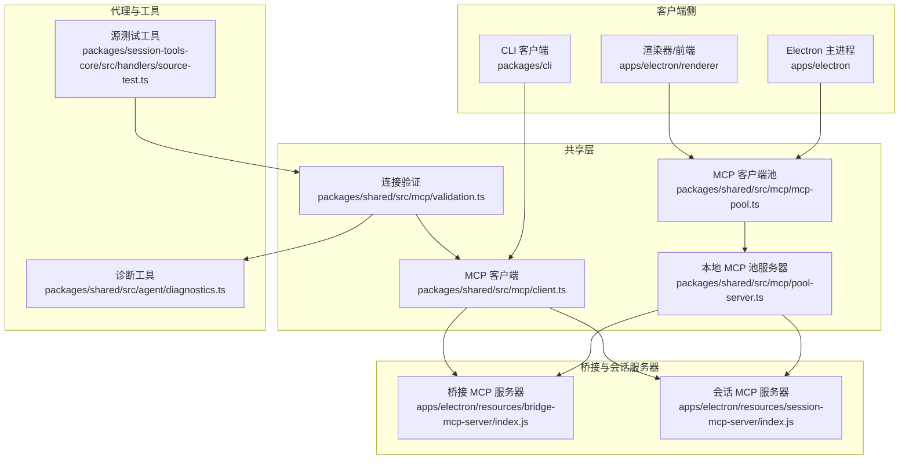
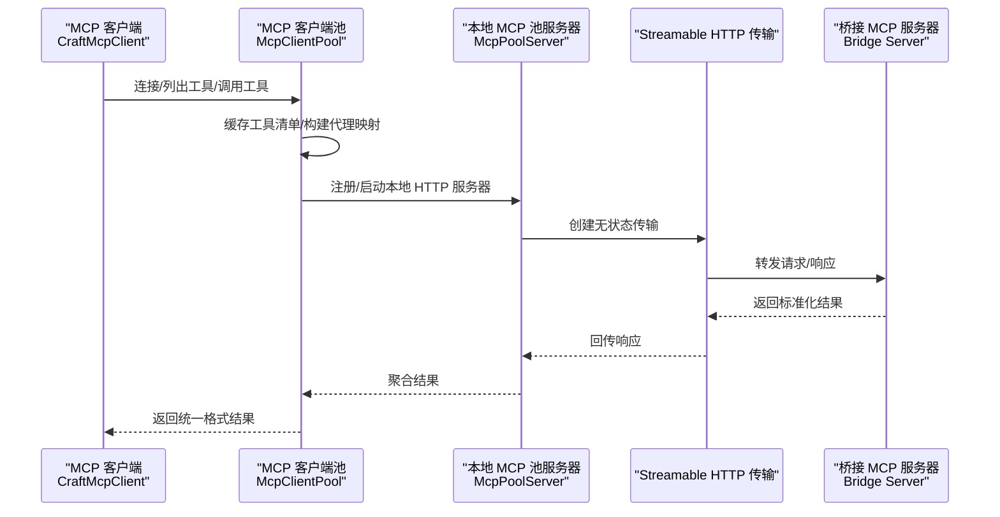
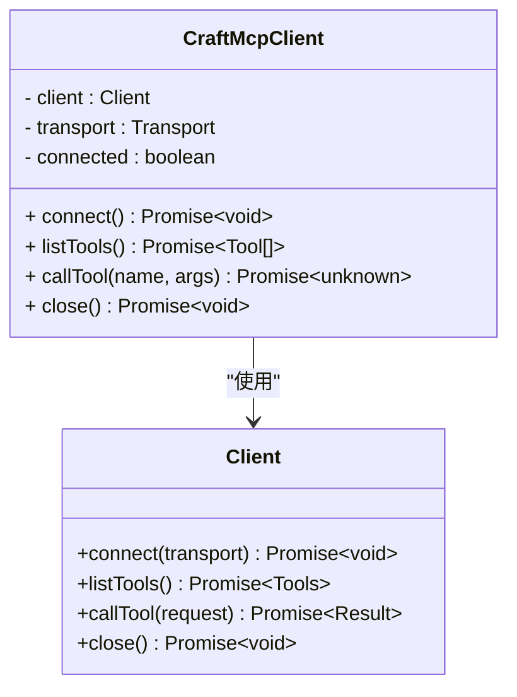
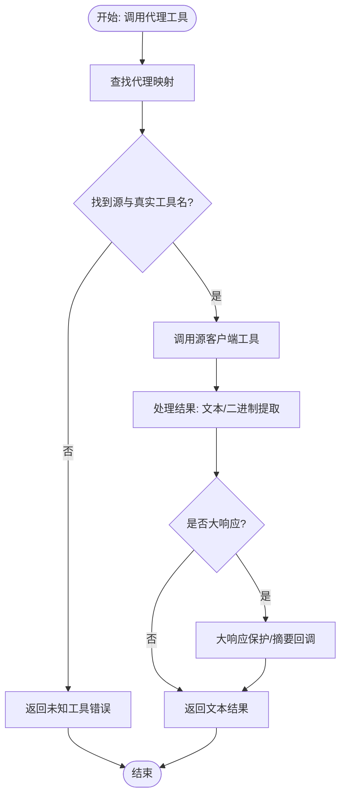
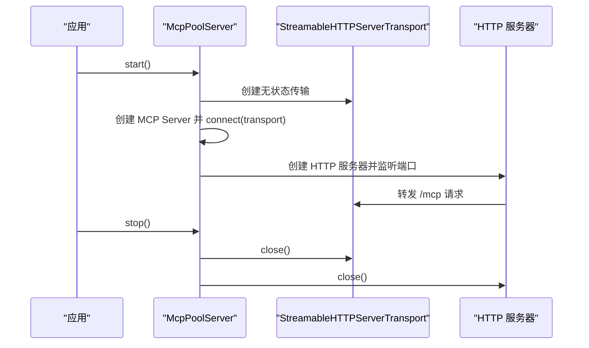
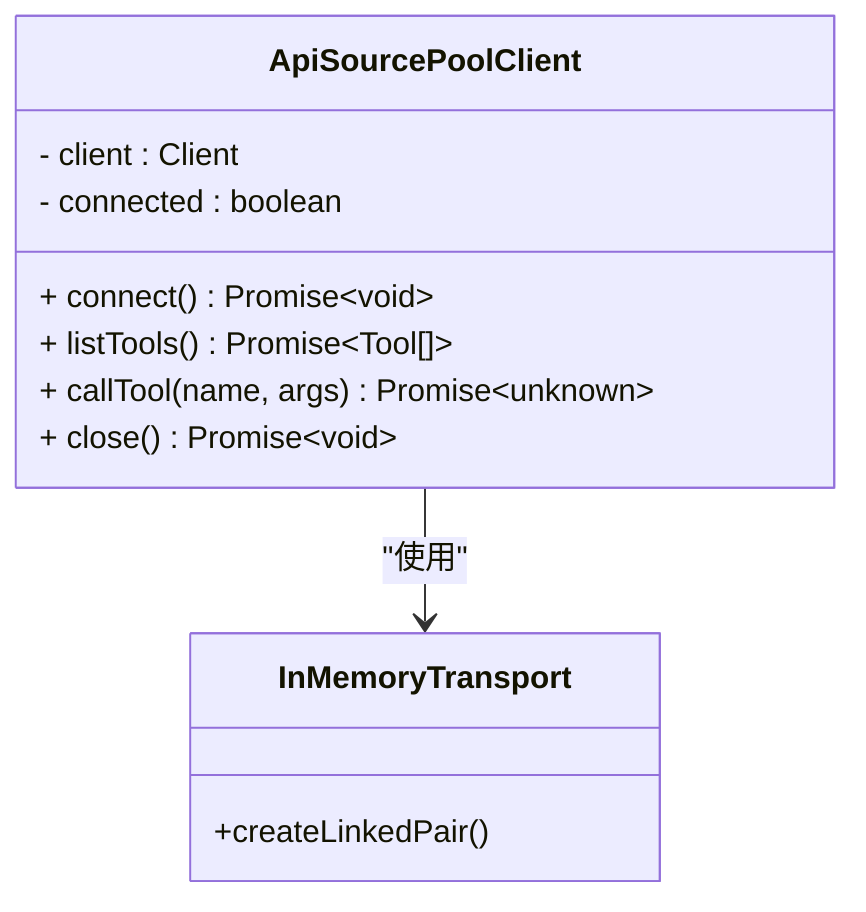
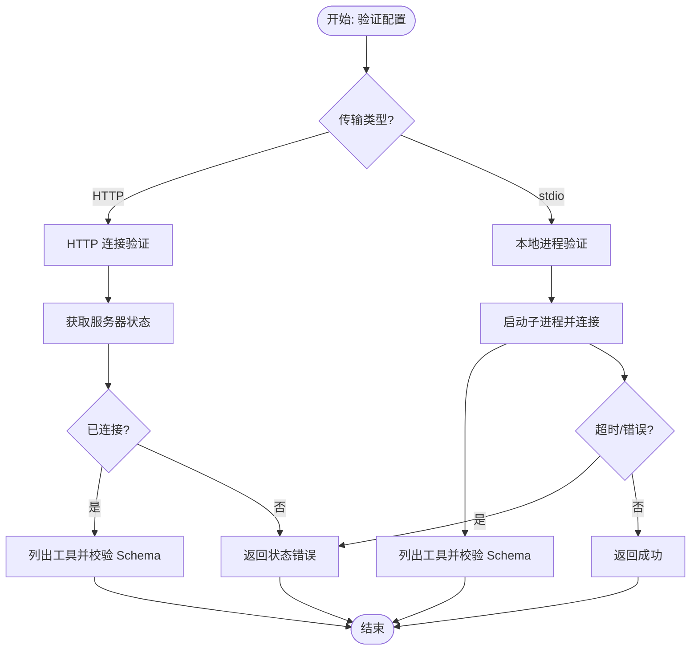
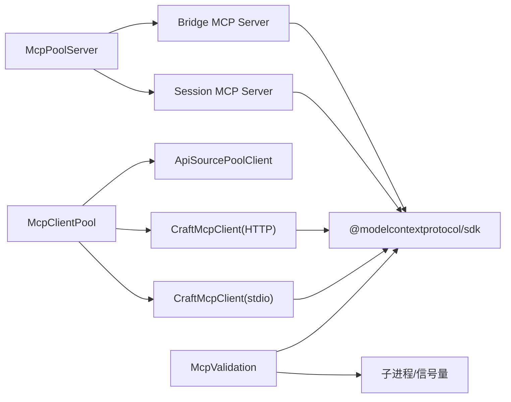

# MCP 协议实现

<cite>
**本文档引用的文件**
- [packages/shared/src/mcp/client.ts](file://packages/shared/src/mcp/client.ts)
- [packages/shared/src/mcp/mcp-pool.ts](file://packages/shared/src/mcp/mcp-pool.ts)
- [packages/shared/src/mcp/pool-server.ts](file://packages/shared/src/mcp/pool-server.ts)
- [packages/shared/src/mcp/validation.ts](file://packages/shared/src/mcp/validation.ts)
- [packages/shared/src/mcp/api-source-pool-client.ts](file://packages/shared/src/mcp/api-source-pool-client.ts)
- [apps/electron/resources/bridge-mcp-server/index.js](file://apps/electron/resources/bridge-mcp-server/index.js)
- [apps/electron/resources/session-mcp-server/index.js](file://apps/electron/resources/session-mcp-server/index.js)
- [packages/shared/src/agent/diagnostics.ts](file://packages/shared/src/agent/diagnostics.ts)
- [packages/session-tools-core/src/handlers/source-test.ts](file://packages/session-tools-core/src/handlers/source-test.ts)
</cite>

## 目录

1. [简介](#简介)
2. [项目结构](#项目结构)
3. [核心组件](#核心组件)
4. [架构总览](#架构总览)
5. [详细组件分析](#详细组件分析)
6. [依赖关系分析](#依赖关系分析)
7. [性能考量](#性能考量)
8. [故障排除指南](#故障排除指南)
9. [结论](#结论)
10. [附录](#附录)

## 简介

本文件系统化阐述 Craft Agents 项目中 MCP（Model Context Protocol）协议的实现与集成方案。内容覆盖协议核心概念、消息格式与通信机制，本地 MCP 服务器实现架构（协议解析、消息路由、错误处理），以及与 Craft Agents 代理系统的集成路径与数据流转。文档同时提供版本兼容性、安全考虑与性能优化建议，并通过图示与路径引用帮助读者快速定位实现细节。

## 项目结构

围绕 MCP 的实现主要分布在以下模块：

- 客户端与连接池：统一管理 HTTP 与 stdio 两种传输方式，集中缓存工具清单与代理工具映射，负责工具调用与结果归一化。
- 本地 MCP 服务器：在应用内以 HTTP 形式暴露 MCP 接口，支持状态无关（无会话）模式，便于客户端直接访问。
- 验证与诊断：提供远程与本地 MCP 连接验证、工具 Schema 校验、网络可达性检查。
- 集成层：在会话工具与代理后端之间作为统一入口，屏蔽不同来源 MCP 的差异。

图表来源

- [packages/shared/src/mcp/client.ts](file://packages/shared/src/mcp/client.ts#L72-L154)
- [packages/shared/src/mcp/mcp-pool.ts](file://packages/shared/src/mcp/mcp-pool.ts#L78-L414)
- [packages/shared/src/mcp/pool-server.ts](file://packages/shared/src/mcp/pool-server.ts#L40-L178)
- [packages/shared/src/mcp/validation.ts](file://packages/shared/src/mcp/validation.ts#L137-L336)
- [apps/electron/resources/bridge-mcp-server/index.js](file://apps/electron/resources/bridge-mcp-server/index.js#L17494-L17520)
- [apps/electron/resources/session-mcp-server/index.js](file://apps/electron/resources/session-mcp-server/index.js#L17400-L17600)
- [packages/shared/src/agent/diagnostics.ts](file://packages/shared/src/agent/diagnostics.ts#L358-L388)
- [packages/session-tools-core/src/handlers/source-test.ts](file://packages/session-tools-core/src/handlers/source-test.ts#L626-L669)

章节来源

- [packages/shared/src/mcp/client.ts](file://packages/shared/src/mcp/client.ts#L1-L154)
- [packages/shared/src/mcp/mcp-pool.ts](file://packages/shared/src/mcp/mcp-pool.ts#L1-L414)
- [packages/shared/src/mcp/pool-server.ts](file://packages/shared/src/mcp/pool-server.ts#L1-L178)
- [packages/shared/src/mcp/validation.ts](file://packages/shared/src/mcp/validation.ts#L1-L578)
- [apps/electron/resources/bridge-mcp-server/index.js](file://apps/electron/resources/bridge-mcp-server/index.js#L17494-L17520)
- [apps/electron/resources/session-mcp-server/index.js](file://apps/electron/resources/session-mcp-server/index.js#L17400-L17600)
- [packages/shared/src/agent/diagnostics.ts](file://packages/shared/src/agent/diagnostics.ts#L358-L388)
- [packages/session-tools-core/src/handlers/source-test.ts](file://packages/session-tools-core/src/handlers/source-test.ts#L626-L669)

## 核心组件

- MCP 客户端（CraftMcpClient）
  - 支持 HTTP 与 stdio 两种传输，自动健康检查，统一工具列表与调用接口。
  - 在 stdio 模式下过滤敏感环境变量，降低凭证泄露风险。
- MCP 客户端池（McpClientPool）
  - 统一注册/注销 MCP 源，缓存工具清单，构建代理工具名映射，集中执行工具调用并进行结果归一化与大响应处理。
  - 支持同步连接集，动态增删源，通知工具变更事件。
- 本地 MCP 池服务器（McpPoolServer）
  - 基于 Streamable HTTP 传输创建无状态 MCP 服务器，监听 /mcp 路径，将所有方法（GET/POST/DELETE）转发给传输层。
- API 源池客户端（ApiSourcePoolClient）
  - 通过内存传输连接本地 McpServer 实例，暴露与远端一致的 PoolClient 接口。
- 连接验证（McpValidation）
  - 提供 HTTP 与 stdio 两类验证流程，校验工具 Schema 属性命名规则，返回结构化错误信息与类型化错误，支持超时控制与进程清理。

章节来源

- [packages/shared/src/mcp/client.ts](file://packages/shared/src/mcp/client.ts#L72-L154)
- [packages/shared/src/mcp/mcp-pool.ts](file://packages/shared/src/mcp/mcp-pool.ts#L78-L414)
- [packages/shared/src/mcp/pool-server.ts](file://packages/shared/src/mcp/pool-server.ts#L40-L178)
- [packages/shared/src/mcp/api-source-pool-client.ts](file://packages/shared/src/mcp/api-source-pool-client.ts#L15-L53)
- [packages/shared/src/mcp/validation.ts](file://packages/shared/src/mcp/validation.ts#L137-L336)

## 架构总览

MCP 在 Craft Agents 中采用“客户端池 + 本地 HTTP 服务器”的双层架构：

- 客户端池统一管理多源 MCP，屏蔽底层差异，向上提供代理工具名与标准化结果。
- 本地 MCP 池服务器以 HTTP 形式对外暴露 MCP 接口，便于 Electron 主进程或外部客户端直接访问。
- 桥接与会话服务器分别承载不同场景下的 MCP 功能扩展（如任务、进度、日志级别等）。

图表来源

- [packages/shared/src/mcp/client.ts](file://packages/shared/src/mcp/client.ts#L111-L154)
- [packages/shared/src/mcp/mcp-pool.ts](file://packages/shared/src/mcp/mcp-pool.ts#L129-L155)
- [packages/shared/src/mcp/pool-server.ts](file://packages/shared/src/mcp/pool-server.ts#L61-L83)
- [apps/electron/resources/bridge-mcp-server/index.js](file://apps/electron/resources/bridge-mcp-server/index.js#L17494-L17520)

## 详细组件分析

### MCP 客户端（CraftMcpClient）

- 传输选择
  - HTTP：使用可流式的 HTTP 客户端传输，支持自定义请求头。
  - stdio：本地子进程传输，合并并过滤敏感环境变量后传递给子进程。
- 连接与健康检查
  - 连接成功后立即调用 listTools 进行健康检查，失败则关闭连接并抛出错误。
- 工具调用
  - 统一调用接口，返回标准化结果；上层通过客户端池进行代理工具名到真实工具名的映射。

图表来源

- [packages/shared/src/mcp/client.ts](file://packages/shared/src/mcp/client.ts#L72-L154)

章节来源

- [packages/shared/src/mcp/client.ts](file://packages/shared/src/mcp/client.ts#L72-L154)

### MCP 客户端池（McpClientPool）

- 生命周期管理
  - connect/connectInProcess：注册并连接新源，缓存工具清单与代理映射。
  - disconnect/disconnectAll：断开源并清理缓存。
  - sync：根据期望集合连接新增源、断开移除源，返回失败列表。
- 工具发现与代理
  - getTools/getConnectedSlugs/isConnected：查询连接状态与工具清单。
  - getProxyToolDefs：生成代理工具定义（mcp**{slug}**{toolName}）。
- 工具执行与结果处理
  - callTool：按代理名查找源与真实工具名，调用后对文本/二进制内容进行提取与保存，结合大响应保护策略返回最终文本。
  - isProxyTool：判断是否为受管代理工具。

图表来源

- [packages/shared/src/mcp/mcp-pool.ts](file://packages/shared/src/mcp/mcp-pool.ts#L324-L405)

章节来源

- [packages/shared/src/mcp/mcp-pool.ts](file://packages/shared/src/mcp/mcp-pool.ts#L78-L414)

### 本地 MCP 池服务器（McpPoolServer）

- 启动流程
  - 创建无状态 Streamable HTTP 传输与 MCP Server，绑定 HTTP 服务器到随机端口，仅接受 /mcp 路径请求。
  - 将所有方法（GET/POST/DELETE）通过传输层统一处理。
- 停止流程
  - 关闭传输、服务器与 HTTP 服务，重置端口。

图表来源

- [packages/shared/src/mcp/pool-server.ts](file://packages/shared/src/mcp/pool-server.ts#L61-L83)
- [packages/shared/src/mcp/pool-server.ts](file://packages/shared/src/mcp/pool-server.ts#L158-L177)

章节来源

- [packages/shared/src/mcp/pool-server.ts](file://packages/shared/src/mcp/pool-server.ts#L40-L178)

### API 源池客户端（ApiSourcePoolClient）

- 通过内存传输连接本地 McpServer 实例，实现与远端一致的 PoolClient 接口，便于在客户端池中统一调度。

图表来源

- [packages/shared/src/mcp/api-source-pool-client.ts](file://packages/shared/src/mcp/api-source-pool-client.ts#L15-L53)

章节来源

- [packages/shared/src/mcp/api-source-pool-client.ts](file://packages/shared/src/mcp/api-source-pool-client.ts#L1-L53)

### 连接验证（McpValidation）

- HTTP 验证
  - 使用最小查询与 SDK 的 mcpServerStatus 获取连接状态，随后直接使用 MCP 客户端列出工具并校验输入 Schema 的属性命名。
- stdio 验证
  - 动态导入 SDK stdio 传输，创建子进程并连接，列出工具，校验属性命名，支持超时与进程清理。
- 错误处理
  - 结构化返回错误类型（如 needs-auth、invalid-schema、failed 等），并提供用户友好提示。

图表来源

- [packages/shared/src/mcp/validation.ts](file://packages/shared/src/mcp/validation.ts#L137-L336)
- [packages/shared/src/mcp/validation.ts](file://packages/shared/src/mcp/validation.ts#L355-L547)

章节来源

- [packages/shared/src/mcp/validation.ts](file://packages/shared/src/mcp/validation.ts#L1-L578)

### 与 Craft Agents 代理系统的集成

- 诊断与可达性检查
  - 对本地 MCP 服务器进行可达性检查，区分超时与不可达等错误场景，用于界面提示。
- 源测试与验证
  - 在会话工具中对 MCP 源进行测试，输出工具数量、示例工具名与服务器信息，辅助用户确认配置正确性。

章节来源

- [packages/shared/src/agent/diagnostics.ts](file://packages/shared/src/agent/diagnostics.ts#L358-L388)
- [packages/session-tools-core/src/handlers/source-test.ts](file://packages/session-tools-core/src/handlers/source-test.ts#L626-L669)

## 依赖关系分析

- 组件耦合
  - McpClientPool 与 ApiSourcePoolClient 共同实现 PoolClient 接口，确保远端与本地源在池中行为一致。
  - McpPoolServer 与 Bridge/Session 服务器共享传输层（Streamable HTTP），保证消息路由一致性。
- 外部依赖
  - @modelcontextprotocol/sdk 提供官方 MCP 客户端、服务器、传输与类型定义。
  - 验证模块依赖 Claude Agent SDK 与子进程能力，用于 stdio 场景的进程生命周期管理。

图表来源

- [packages/shared/src/mcp/mcp-pool.ts](file://packages/shared/src/mcp/mcp-pool.ts#L78-L163)
- [packages/shared/src/mcp/pool-server.ts](file://packages/shared/src/mcp/pool-server.ts#L61-L83)
- [apps/electron/resources/bridge-mcp-server/index.js](file://apps/electron/resources/bridge-mcp-server/index.js#L17494-L17520)
- [apps/electron/resources/session-mcp-server/index.js](file://apps/electron/resources/session-mcp-server/index.js#L17400-L17600)
- [packages/shared/src/mcp/validation.ts](file://packages/shared/src/mcp/validation.ts#L355-L547)

章节来源

- [packages/shared/src/mcp/mcp-pool.ts](file://packages/shared/src/mcp/mcp-pool.ts#L78-L163)
- [packages/shared/src/mcp/pool-server.ts](file://packages/shared/src/mcp/pool-server.ts#L61-L83)
- [packages/shared/src/mcp/validation.ts](file://packages/shared/src/mcp/validation.ts#L355-L547)

## 性能考量

- 无状态传输
  - 本地 MCP 池服务器采用无会话 ID 的传输配置，避免会话跟踪开销，适合一次性请求与低延迟场景。
- 工具缓存
  - 客户端池缓存工具清单与代理映射，减少重复连接与查询成本。
- 大响应保护
  - 对可能产生大量文本的结果进行保护与摘要回调，避免内存与渲染压力。
- 二进制内容处理
  - 对图片/音频等二进制内容进行解码与落盘，仅返回描述信息，降低传输与渲染负担。
- 连接复用
  - 客户端池在多源间共享连接，减少重复握手与初始化成本。

## 故障排除指南

- 连接失败
  - 检查 URL 与网络连通性；对于本地 stdio 服务器，确认命令存在、权限允许且未被占用。
- 认证问题
  - 验证授权头或令牌有效性；必要时重新登录或刷新令牌。
- Schema 校验失败
  - 工具输入 Schema 的属性名需满足命名规则；修正后重新验证。
- 超时与进程异常
  - stdio 服务器启动超时或进程崩溃时，查看 stderr 输出与进程状态；适当增加超时时间或修复服务器实现。
- 诊断与测试
  - 使用内置诊断工具检查 MCP 服务器可达性；通过源测试工具输出工具数量与示例，辅助定位问题。

章节来源

- [packages/shared/src/mcp/validation.ts](file://packages/shared/src/mcp/validation.ts#L553-L577)
- [packages/shared/src/agent/diagnostics.ts](file://packages/shared/src/agent/diagnostics.ts#L358-L388)
- [packages/session-tools-core/src/handlers/source-test.ts](file://packages/session-tools-core/src/handlers/source-test.ts#L626-L669)

## 结论

Craft Agents 的 MCP 实现通过“客户端池 + 本地 HTTP 服务器”的架构，实现了对多源 MCP 的统一接入与高效调度。配合严格的连接验证、Schema 校验与大响应保护机制，既保障了安全性与稳定性，又兼顾了性能与用户体验。该实现为与代理系统及会话工具的深度集成提供了清晰的数据流与控制流路径。

## 附录

- 协议版本与兼容性
  - 项目基于官方 SDK 的 MCP Server/Client 能力，遵循 SDK 的版本语义与能力声明；具体版本兼容性请参考 SDK 发布说明。
- 安全考虑
  - stdio 传输中过滤敏感环境变量，避免凭证泄露；HTTP 传输建议使用受信网络与 TLS；对工具 Schema 的属性命名进行约束，防止潜在注入风险。
- 响应格式规范
  - 工具调用结果统一为文本形式；二进制内容通过落盘与描述信息返回；错误结果包含明确的错误类型与消息，便于前端展示与用户理解。
