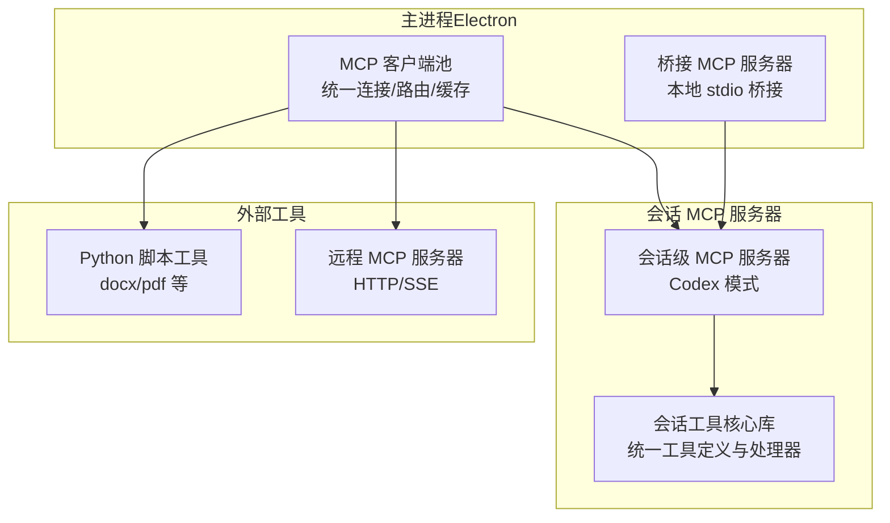
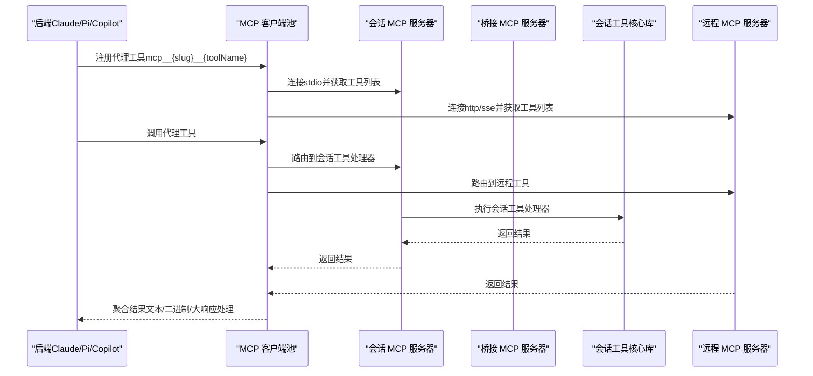
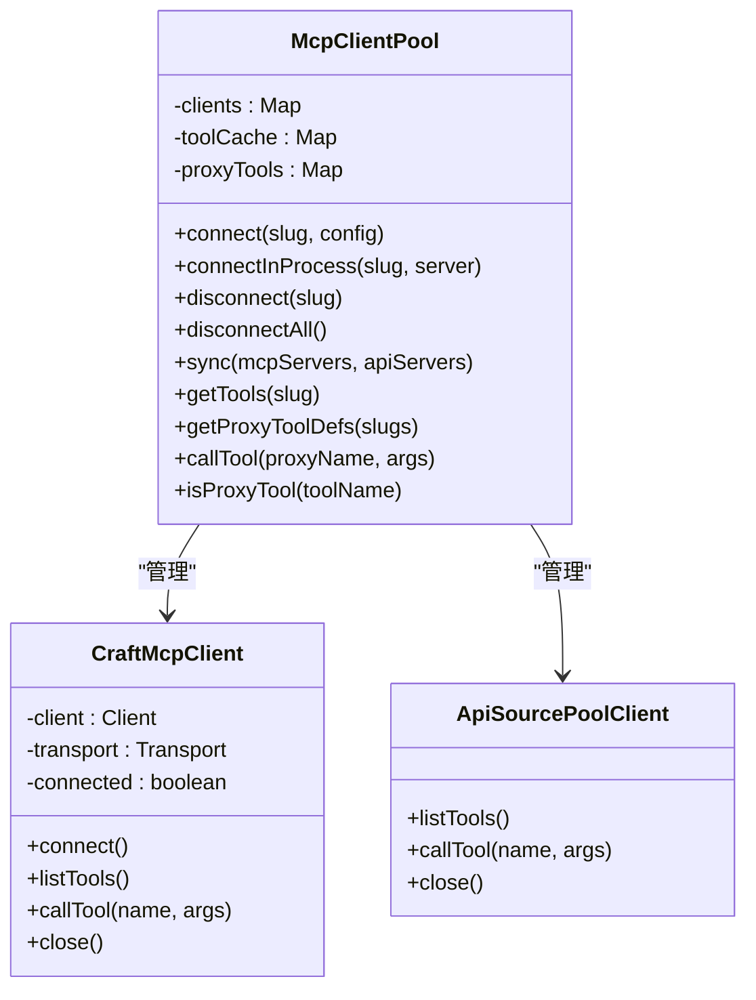
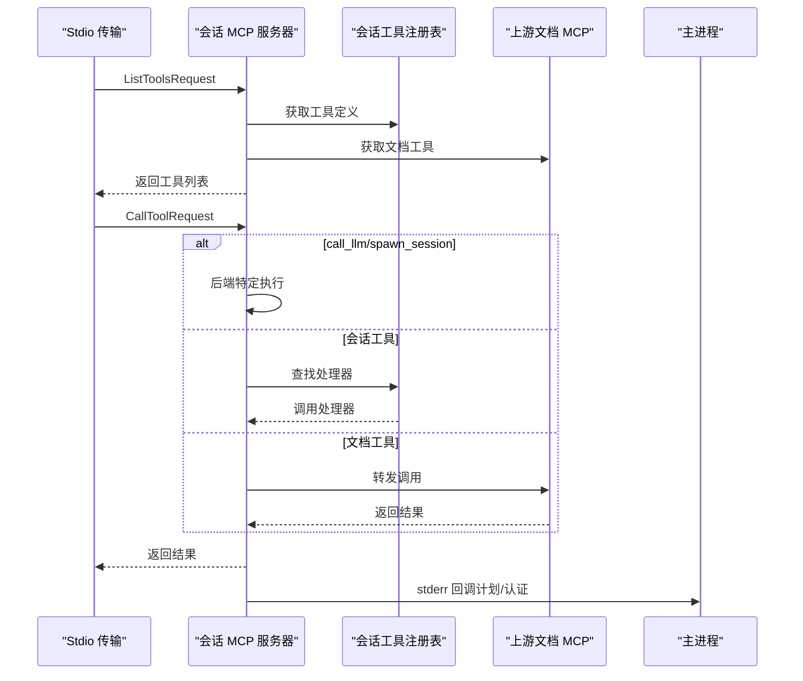
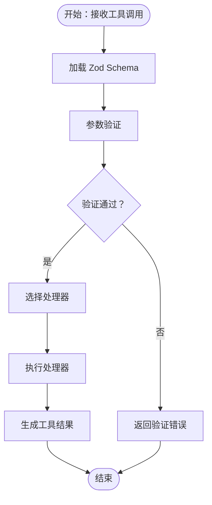
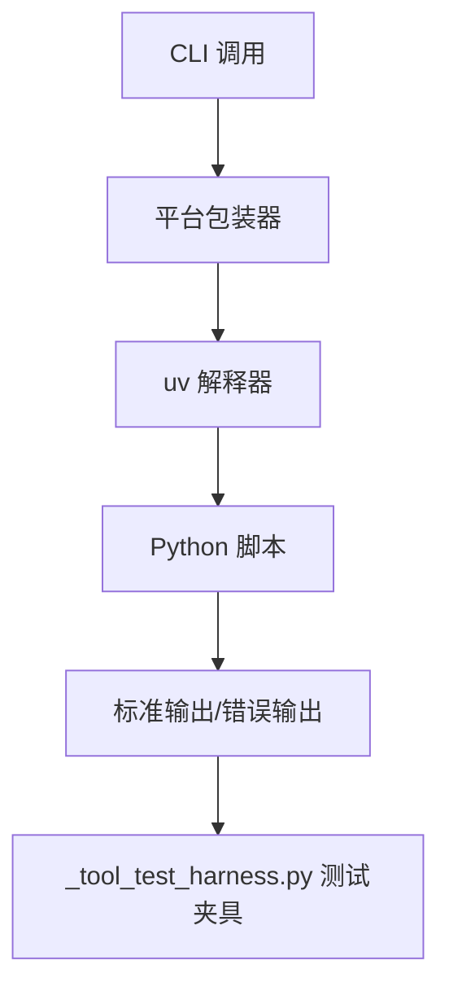
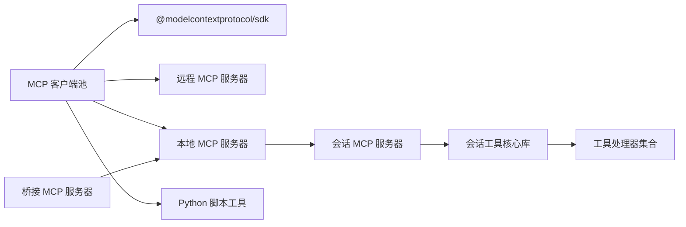

# MCP 集成架构

<cite>
**本文档引用的文件**
- [packages/session-mcp-server/src/index.ts](file://packages/session-mcp-server/src/index.ts)
- [packages/shared/src/mcp/mcp-pool.ts](file://packages/shared/src/mcp/mcp-pool.ts)
- [packages/shared/src/mcp/client.ts](file://packages/shared/src/mcp/client.ts)
- [packages/session-tools-core/src/index.ts](file://packages/session-tools-core/src/index.ts)
- [packages/session-tools-core/src/tool-defs.ts](file://packages/session-tools-core/src/tool-defs.ts)
- [apps/electron/resources/bridge-mcp-server/index.js](file://apps/electron/resources/bridge-mcp-server/index.js)
- [apps/electron/resources/scripts/docx_tool.py](file://apps/electron/resources/scripts/docx_tool.py)
- [apps/electron/resources/scripts/pdf_tool.py](file://apps/electron/resources/scripts/pdf_tool.py)
- [apps/electron/resources/scripts/tests/_tool_test_harness.py](file://apps/electron/resources/scripts/tests/_tool_test_harness.py)
- [apps/cli/src/server-spawner.ts](file://apps/cli/src/server-spawner.ts)
</cite>

## 目录

1. [简介](#简介)
2. [项目结构](#项目结构)
3. [核心组件](#核心组件)
4. [架构总览](#架构总览)
5. [详细组件分析](#详细组件分析)
6. [依赖关系分析](#依赖关系分析)
7. [性能考虑](#性能考虑)
8. [故障排除指南](#故障排除指南)
9. [结论](#结论)

## 简介

本文件面向 Craft Agents 的 MCP（Model Context Protocol）集成架构，系统性阐述本地 MCP 服务器桥接、工具注册机制、请求处理流程，以及如何将外部工具（含本地 Python 脚本）无缝集成到代理系统中。文档覆盖工具发现、参数验证、执行结果处理、协议实现细节、工具接口规范、与会话管理系统的集成方式，并包含本地工具执行环境、Python 脚本管理、错误处理与日志记录机制。

## 项目结构

Craft Agents 的 MCP 集成采用“主进程集中式客户端池 + 子进程/远程 MCP 服务器”的分层架构：

- 主进程（Electron）维护统一的 MCP 客户端池，负责连接、工具发现、路由与结果聚合。
- 会话级 MCP 服务器（Codex 模式）在子进程中运行，提供会话专用工具与回调通信。
- 外部工具通过本地 Python 脚本或远程 MCP 服务接入，统一由客户端池管理。
- 会话工具核心库提供标准化的工具定义、参数校验与处理器，确保多后端一致性。

图表来源

- [packages/shared/src/mcp/mcp-pool.ts](file://packages/shared/src/mcp/mcp-pool.ts#L78-L193)
- [packages/session-mcp-server/src/index.ts](file://packages/session-mcp-server/src/index.ts#L512-L568)
- [apps/electron/resources/bridge-mcp-server/index.js](file://apps/electron/resources/bridge-mcp-server/index.js#L1-L800)

章节来源

- [packages/shared/src/mcp/mcp-pool.ts](file://packages/shared/src/mcp/mcp-pool.ts#L1-L414)
- [packages/session-mcp-server/src/index.ts](file://packages/session-mcp-server/src/index.ts#L1-L577)

## 核心组件

- MCP 客户端池：集中管理所有 MCP 源连接，提供工具发现、代理工具名映射、调用路由与结果聚合。
- 会话 MCP 服务器：基于 MCP SDK 在子进程中提供会话级工具，支持回调通信与上游文档工具代理。
- 会话工具核心库：提供统一的工具定义、Zod 参数校验、处理器与工具注册表，保证多后端一致性。
- 桥接 MCP 服务器：在 Electron 主进程中桥接本地 stdio 服务器，作为统一入口。
- Python 脚本工具：本地可执行工具，通过包装器与测试夹具进行调用与验证。

章节来源

- [packages/shared/src/mcp/mcp-pool.ts](file://packages/shared/src/mcp/mcp-pool.ts#L78-L414)
- [packages/session-mcp-server/src/index.ts](file://packages/session-mcp-server/src/index.ts#L1-L577)
- [packages/session-tools-core/src/index.ts](file://packages/session-tools-core/src/index.ts#L1-L233)

## 架构总览

下图展示 MCP 集成的整体交互：主进程客户端池负责连接与路由；会话 MCP 服务器提供会话工具并支持回调；外部工具通过本地脚本或远程服务接入；桥接服务器作为本地 stdio 入口。

图表来源

- [packages/shared/src/mcp/mcp-pool.ts](file://packages/shared/src/mcp/mcp-pool.ts#L129-L141)
- [packages/session-mcp-server/src/index.ts](file://packages/session-mcp-server/src/index.ts#L527-L564)
- [apps/electron/resources/bridge-mcp-server/index.js](file://apps/electron/resources/bridge-mcp-server/index.js#L1-L800)

## 详细组件分析

### 组件 A：MCP 客户端池（集中式连接与路由）

- 连接生命周期：支持 HTTP/SSE/stdio 三种传输类型；对本地 stdio 源进行过滤控制；提供连接/断开与批量同步能力。
- 工具发现与代理映射：从客户端获取工具列表，生成代理工具名（mcp**{slug}**{toolName}），建立 slug→原工具名映射。
- 工具执行：根据代理名解析源与原始工具名，调用对应客户端；统一处理文本/二进制内容块与大响应保护。
- 错误处理：捕获连接失败、工具不存在、调用异常等场景，返回结构化错误信息。

图表来源

- [packages/shared/src/mcp/mcp-pool.ts](file://packages/shared/src/mcp/mcp-pool.ts#L78-L414)
- [packages/shared/src/mcp/client.ts](file://packages/shared/src/mcp/client.ts#L72-L154)

章节来源

- [packages/shared/src/mcp/mcp-pool.ts](file://packages/shared/src/mcp/mcp-pool.ts#L78-L414)
- [packages/shared/src/mcp/client.ts](file://packages/shared/src/mcp/client.ts#L1-L154)

### 组件 B：会话 MCP 服务器（Codex 模式）

- 会话上下文：封装会话路径、文件系统、回调（计划提交、认证请求）、凭据管理（读取主进程写入的缓存文件）。
- 工具注册：从会话工具核心库获取工具定义（JSON Schema），合并上游文档工具。
- 请求处理：统一处理工具列表与调用；内置 call_llm/spawn_session 的后端特定执行逻辑（预计算结果或 HTTP 回调）。
- 上游代理：连接 Craft Agents 文档 MCP 服务器，代理文档类工具调用。
- 回调通信：通过 stderr 发送结构化消息到主进程，触发 UI 行为（如显示计划、发起认证）。

图表来源

- [packages/session-mcp-server/src/index.ts](file://packages/session-mcp-server/src/index.ts#L527-L564)
- [packages/session-mcp-server/src/index.ts](file://packages/session-mcp-server/src/index.ts#L285-L332)
- [packages/session-mcp-server/src/index.ts](file://packages/session-mcp-server/src/index.ts#L343-L446)

章节来源

- [packages/session-mcp-server/src/index.ts](file://packages/session-mcp-server/src/index.ts#L1-L577)

### 组件 C：会话工具核心库（工具定义与处理器）

- 工具定义：以 Zod Schema 描述输入参数，提供描述文本与注册表；支持按功能筛选（安全模式、后端工具名等）。
- 处理器集合：涵盖提交计划、配置验证、技能验证、Mermaid 验证、源测试、OAuth 触发、凭据提示、偏好更新、数据转换、脚本沙箱、模板渲染、开发者反馈等。
- 参数验证：提供统一的验证结果格式化与合并策略，支持 JSON 文件校验与字段存在性检查。
- 文件系统与凭据：提供节点文件系统适配、源配置加载、凭据检测与头部名称推断等辅助能力。

图表来源

- [packages/session-tools-core/src/tool-defs.ts](file://packages/session-tools-core/src/tool-defs.ts#L1-L200)
- [packages/session-tools-core/src/index.ts](file://packages/session-tools-core/src/index.ts#L132-L233)

章节来源

- [packages/session-tools-core/src/tool-defs.ts](file://packages/session-tools-core/src/tool-defs.ts#L1-L601)
- [packages/session-tools-core/src/index.ts](file://packages/session-tools-core/src/index.ts#L1-L233)

### 组件 D：桥接 MCP 服务器（Electron 主进程）

- 作用：在主进程中桥接本地 stdio 服务器，作为统一入口，避免直接暴露子进程细节。
- 实现：通过 Node.js 模块化打包产物提供桥接入口，供主进程启动与管理。

章节来源

- [apps/electron/resources/bridge-mcp-server/index.js](file://apps/electron/resources/bridge-mcp-server/index.js#L1-L800)

### 组件 E：本地工具执行环境与 Python 脚本管理

- 包装器与测试夹具：提供跨平台包装器（Windows 使用 .cmd，其他平台直接执行），并通过测试夹具自动定位 uv 可执行文件与脚本目录。
- Python 工具：docx_tool.py 提供创建、模板填充、信息提取、替换等功能；pdf_tool.py 提供组织、编辑、安全、转换等操作。
- 执行流程：CLI 启动 → 包装器解析 → uv 解析脚本元数据 → 执行命令 → 输出结果。

图表来源

- [apps/electron/resources/scripts/tests/\_tool_test_harness.py](file://apps/electron/resources/scripts/tests/_tool_test_harness.py#L58-L83)
- [apps/electron/resources/scripts/docx_tool.py](file://apps/electron/resources/scripts/docx_tool.py#L1-L391)
- [apps/electron/resources/scripts/pdf_tool.py](file://apps/electron/resources/scripts/pdf_tool.py#L1-L800)

章节来源

- [apps/electron/resources/scripts/tests/\_tool_test_harness.py](file://apps/electron/resources/scripts/tests/_tool_test_harness.py#L1-L83)
- [apps/electron/resources/scripts/docx_tool.py](file://apps/electron/resources/scripts/docx_tool.py#L1-L391)
- [apps/electron/resources/scripts/pdf_tool.py](file://apps/electron/resources/scripts/pdf_tool.py#L1-L800)

### 组件 F：会话管理与服务器启动（CLI）

- 服务器启动：CLI 提供服务器启动器，自动定位 Electron 服务器入口，读取标准输出中的 URL 与令牌，支持超时与静默模式。
- 集成：用于测试或开发环境快速启动本地服务器，便于 MCP 与工具链联调。

章节来源

- [apps/cli/src/server-spawner.ts](file://apps/cli/src/server-spawner.ts#L1-L145)

## 依赖关系分析

- 客户端池依赖 MCP SDK（HTTP/stdio 传输），并抽象出统一的 PoolClient 接口，兼容远程 MCP 与内嵌 API 源。
- 会话 MCP 服务器依赖会话工具核心库，复用工具定义与处理器，同时提供回调通信与上游文档代理。
- Python 脚本工具通过包装器与测试夹具解耦平台差异，统一由主进程或 CLI 管理。
- 桥接服务器作为本地 stdio 入口，简化主进程与子进程的通信边界。

图表来源

- [packages/shared/src/mcp/mcp-pool.ts](file://packages/shared/src/mcp/mcp-pool.ts#L1-L414)
- [packages/shared/src/mcp/client.ts](file://packages/shared/src/mcp/client.ts#L1-L154)
- [packages/session-mcp-server/src/index.ts](file://packages/session-mcp-server/src/index.ts#L1-L577)

章节来源

- [packages/shared/src/mcp/mcp-pool.ts](file://packages/shared/src/mcp/mcp-pool.ts#L1-L414)
- [packages/shared/src/mcp/client.ts](file://packages/shared/src/mcp/client.ts#L1-L154)
- [packages/session-mcp-server/src/index.ts](file://packages/session-mcp-server/src/index.ts#L1-L577)

## 性能考虑

- 连接复用：客户端池对同一源复用连接，减少握手开销。
- 工具缓存：缓存工具列表与代理映射，降低查询成本。
- 大响应保护：对超长响应进行摘要或落盘处理，避免内存压力。
- 二进制处理：对图片/音频等二进制内容进行解码与保存，返回简要提示。
- 本地过滤：在工作区禁用本地 stdio 源时，提前过滤，避免无效连接尝试。

## 故障排除指南

- 连接失败：检查 URL/端口、网络连通性、认证头；确认健康检查通过。
- 工具不可用：确认工具已正确注册、代理名拼写正确、源已连接。
- 回调无响应：检查 stderr 输出前缀与主进程监听逻辑；确认回调消息格式正确。
- 大响应问题：启用摘要回调或检查会话目录空间；必要时调整阈值。
- Python 工具异常：使用测试夹具定位 uv 与脚本路径；检查脚本依赖与权限。

章节来源

- [packages/shared/src/mcp/client.ts](file://packages/shared/src/mcp/client.ts#L111-L127)
- [packages/shared/src/mcp/mcp-pool.ts](file://packages/shared/src/mcp/mcp-pool.ts#L382-L393)
- [packages/session-mcp-server/src/index.ts](file://packages/session-mcp-server/src/index.ts#L69-L76)

## 结论

Craft Agents 的 MCP 集成通过“主进程集中式客户端池 + 会话级 MCP 服务器 + 外部工具桥接”的架构，实现了多后端一致的工具注册与调用体验。会话工具核心库确保参数验证与处理器的一致性，Python 脚本工具通过包装器与测试夹具实现跨平台可执行。整体方案具备良好的扩展性、安全性（敏感环境变量过滤）与可观测性（回调与日志），适合在复杂代理系统中稳定运行。
