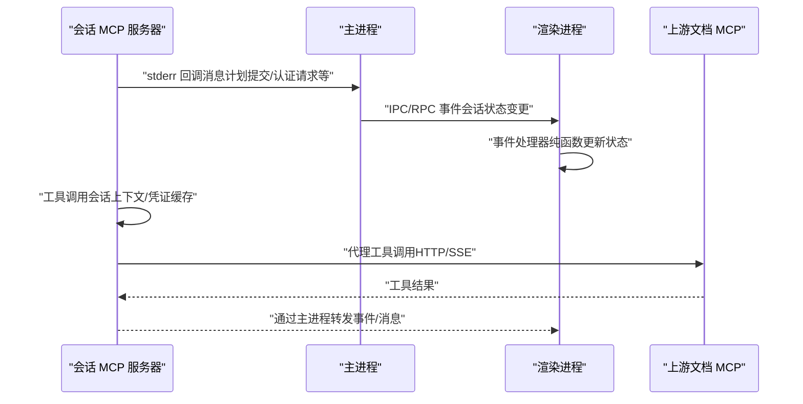
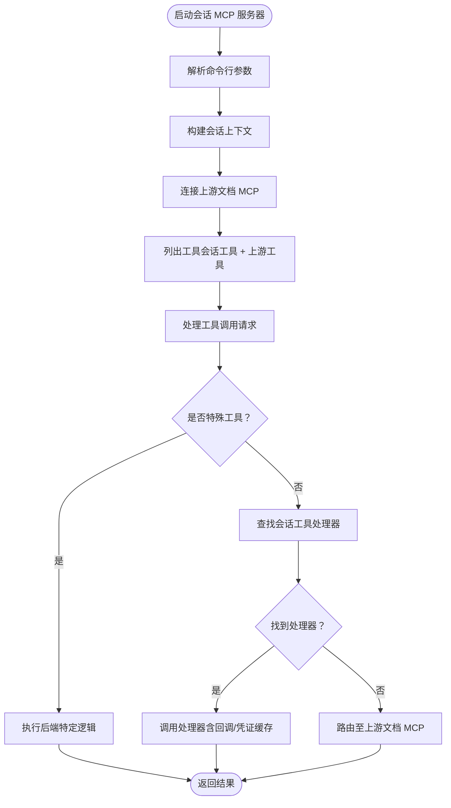
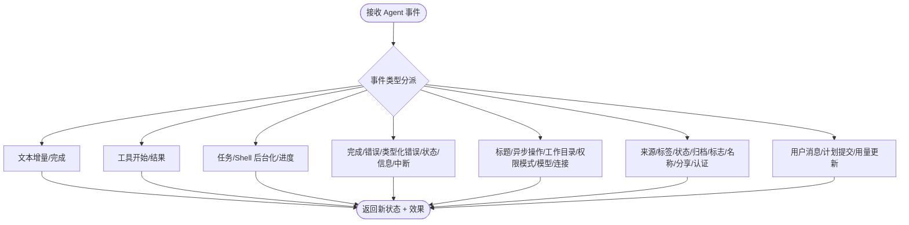
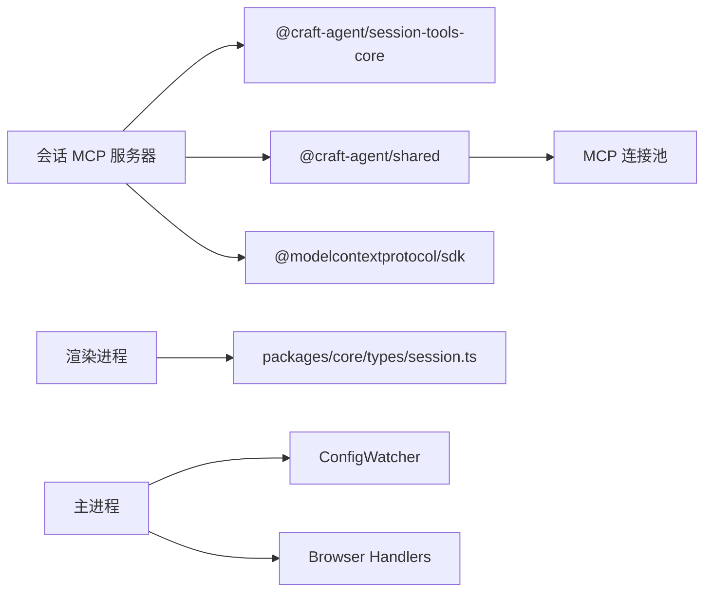

# 会话 MCP 集成

<cite>
**本文引用的文件**
- [packages/session-mcp-server/package.json](file://packages/session-mcp-server/package.json)
- [packages/session-mcp-server/src/index.ts](file://packages/session-mcp-server/src/index.ts)
- [apps/electron/resources/session-mcp-server/index.js](file://apps/electron/resources/session-mcp-server/index.js)
- [apps/electron/src/renderer/event-processor/handlers/session.ts](file://apps/electron/src/renderer/event-processor/handlers/session.ts)
- [apps/electron/src/renderer/event-processor/processor.ts](file://apps/electron/src/renderer/event-processor/processor.ts)
- [apps/electron/src/renderer/utils/session.ts](file://apps/electron/src/renderer/utils/session.ts)
- [packages/core/src/types/session.ts](file://packages/core/src/types/session.ts)
- [apps/electron/src/main/lib/config-watcher.ts](file://apps/electron/src/main/lib/config-watcher.ts)
- [apps/electron/src/main/handlers/browser.ts](file://apps/electron/src/main/handlers/browser.ts)
- [packages/shared/src/mcp/pool-server.ts](file://packages/shared/src/mcp/pool-server.ts)
- [packages/session-tools-core/src/handlers/source-test.ts](file://packages/session-tools-core/src/handlers/source-test.ts)
- [packages/shared/CLAUDE.md](file://packages/shared/CLAUDE.md)
</cite>

## 目录

1. [简介](#简介)
2. [项目结构](#项目结构)
3. [核心组件](#核心组件)
4. [架构总览](#架构总览)
5. [详细组件分析](#详细组件分析)
6. [依赖关系分析](#依赖关系分析)
7. [性能考量](#性能考量)
8. [故障排除指南](#故障排除指南)
9. [结论](#结论)
10. [附录](#附录)

## 简介

本文件面向“会话 MCP 集成”系统，系统性阐述会话管理器与 MCP（Model Context Protocol）服务器之间的交互方式，覆盖会话状态同步、工具调用协调、消息路由、会话级配置与权限控制、资源管理、错误恢复策略、性能监控，以及多会话并发场景下的协调机制与一致性保障。目标读者既包括开发者也包括需要理解系统运行机制的产品与运维人员。

## 项目结构

该仓库采用多包工作区结构，会话 MCP 集成相关的关键模块分布如下：

- 会话级 MCP 服务器：packages/session-mcp-server，提供会话作用域工具与回调通信能力
- Electron 主进程与渲染进程：负责事件处理、UI 同步、配置监听与浏览器面板等
- 共享能力：packages/shared 提供 MCP 连接池、凭证管理、配置校验等通用能力
- 会话工具核心：packages/session-tools-core 提供工具注册表与处理器定义

```mermaid
graph TB
subgraph "会话 MCP 服务器"
Srv["packages/session-mcp-server<br/>会话级 MCP 服务"]
end
subgraph "Electron 主进程"
Main["主进程事件处理<br/>配置监听"]
end
subgraph "渲染进程"
RProc["事件处理器<br/>纯函数状态机"]
Utils["会话工具函数"]
end
subgraph "共享能力"
Pool["MCP 连接池"]
Cred["凭证管理"]
end
Srv <- --> |"Stdio/HTTP 传输"| Main
Main <- --> |"IPC/RPC 通道"| RProc
RProc <- --> |"事件/状态"| Utils
Srv -.->|"上游代理/工具扩展"| Pool
Main -.->|"配置变更通知"| Cred
```

图示来源

- [packages/session-mcp-server/src/index.ts](file://packages/session-mcp-server/src/index.ts#L1-L577)
- [apps/electron/src/renderer/event-processor/processor.ts](file://apps/electron/src/renderer/event-processor/processor.ts#L1-L214)
- [apps/electron/src/main/lib/config-watcher.ts](file://apps/electron/src/main/lib/config-watcher.ts#L1-L1078)
- [packages/shared/src/mcp/pool-server.ts](file://packages/shared/src/mcp/pool-server.ts#L40-L83)

章节来源

- [packages/session-mcp-server/package.json](file://packages/session-mcp-server/package.json#L1-L25)
- [packages/session-mcp-server/src/index.ts](file://packages/session-mcp-server/src/index.ts#L1-L577)
- [apps/electron/src/renderer/event-processor/processor.ts](file://apps/electron/src/renderer/event-processor/processor.ts#L1-L214)
- [apps/electron/src/main/lib/config-watcher.ts](file://apps/electron/src/main/lib/config-watcher.ts#L1-L1078)
- [packages/shared/src/mcp/pool-server.ts](file://packages/shared/src/mcp/pool-server.ts#L40-L83)

## 核心组件

- 会话 MCP 服务器（Session MCP Server）
  - 基于 MCP SDK 的 Stdio/HTTP 传输，提供会话作用域工具集合
  - 支持回调通信（通过 stderr 发送结构化消息），用于触发 UI 行为或暂停执行
  - 提供上游文档工具代理（Craft Agents Docs），实现工具能力扩展
  - 会话级上下文包含文件系统访问、回调、凭证缓存读取、偏好设置更新、开发者反馈写入等
- 渲染进程事件处理器（Event Processor）
  - 纯函数状态机，统一处理 agent 事件，确保状态一致性与可测试性
  - 覆盖完成、错误、状态、权限请求、凭据请求、计划提交、认证请求等事件
- 主进程配置监听（ConfigWatcher）
  - 监听全局配置与工作区文件变化，触发回调以更新应用状态
  - 对会话元数据变更（session.jsonl 头部）进行解析与分发
- 共享能力
  - MCP 连接池：提供 HTTP/SSE 形式的 MCP 服务端点
  - 凭证管理：支持刷新与过期检查，Codex/Copilot 场景下采用被动刷新模型

章节来源

- [packages/session-mcp-server/src/index.ts](file://packages/session-mcp-server/src/index.ts#L1-L577)
- [apps/electron/src/renderer/event-processor/handlers/session.ts](file://apps/electron/src/renderer/event-processor/handlers/session.ts#L1-L874)
- [apps/electron/src/main/lib/config-watcher.ts](file://apps/electron/src/main/lib/config-watcher.ts#L1-L1078)
- [packages/shared/src/mcp/pool-server.ts](file://packages/shared/src/mcp/pool-server.ts#L40-L83)
- [packages/shared/CLAUDE.md](file://packages/shared/CLAUDE.md#L142-L165)

## 架构总览

会话 MCP 集成遵循“会话隔离 + 工具注册 + 回调驱动”的设计原则。每个会话拥有独立的 MCP 子进程或 HTTP 服务，通过 Stdio 或 HTTP 传输与主进程交互；主进程负责事件汇聚与 UI 同步，渲染进程通过纯函数处理器保证状态一致性；凭证与配置变更由主进程集中管理并通过回调/事件下发到渲染层。



图示来源

- [packages/session-mcp-server/src/index.ts](file://packages/session-mcp-server/src/index.ts#L69-L76)
- [apps/electron/src/renderer/event-processor/processor.ts](file://apps/electron/src/renderer/event-processor/processor.ts#L1-L214)
- [packages/shared/src/mcp/pool-server.ts](file://packages/shared/src/mcp/pool-server.ts#L40-L83)

## 详细组件分析

### 会话 MCP 服务器（Session MCP Server）

- 传输与初始化
  - 使用 MCP SDK 的 StdioServerTransport 启动，支持命令行参数注入会话标识、工作区根路径、计划目录等
  - 初始化时连接上游文档 MCP 服务器，缓存工具列表以便路由
- 会话上下文与回调
  - 创建 SessionToolContext，封装文件系统、回调、凭证缓存读取、偏好设置更新、开发者反馈写入等能力
  - 通过 stderr 发送回调消息，主进程解析并触发 UI 动作或暂停执行
- 工具路由
  - 优先从会话工具注册表中查找处理器；若未命中且工具属于上游文档服务器，则转交至上游客户端
  - 特殊工具（如 call_llm、spawn_session）在不同后端（Codex/Copilot）下采用预计算结果或 HTTP 回调两种执行路径
- 凭证缓存
  - 从工作区源目录下的 .credential-cache.json 读取解密后的令牌，支持过期时间检查
  - 不具备刷新能力（刷新需由主进程执行）



图示来源

- [packages/session-mcp-server/src/index.ts](file://packages/session-mcp-server/src/index.ts#L466-L577)
- [packages/session-mcp-server/src/index.ts](file://packages/session-mcp-server/src/index.ts#L527-L564)

章节来源

- [packages/session-mcp-server/src/index.ts](file://packages/session-mcp-server/src/index.ts#L1-L577)

### 渲染进程事件处理器（Event Processor）

- 设计原则
  - 纯函数、无副作用、始终返回新引用，保证原子同步与可测试性
  - 统一入口 processEvent，按事件类型分派到具体处理器
- 事件覆盖范围
  - 文本增量/完成、工具开始/结果、任务/Shell 后台化与进度、完成/错误/类型化错误、状态/信息、中断、标题生成/重生成、异步操作、工作目录变更、权限模式变更、会话模型变更、连接变更、来源/标签变更、会话状态/归档/标志、名称变更、权限/凭据请求、计划提交、用户消息、分享/取消分享、认证请求/完成、用量更新等
- 与会话状态的关系
  - 会话状态包含消息列表、处理中标志、当前状态、令牌用量、最后阅读消息 ID 等字段
  - 处理器在必要时清理/标记运行中工具状态，确保 UI 与状态一致



图示来源

- [apps/electron/src/renderer/event-processor/processor.ts](file://apps/electron/src/renderer/event-processor/processor.ts#L1-L214)
- [apps/electron/src/renderer/event-processor/handlers/session.ts](file://apps/electron/src/renderer/event-processor/handlers/session.ts#L1-L874)
- [packages/core/src/types/session.ts](file://packages/core/src/types/session.ts#L1-L61)

章节来源

- [apps/electron/src/renderer/event-processor/processor.ts](file://apps/electron/src/renderer/event-processor/processor.ts#L1-L214)
- [apps/electron/src/renderer/event-processor/handlers/session.ts](file://apps/electron/src/renderer/event-processor/handlers/session.ts#L1-L874)
- [packages/core/src/types/session.ts](file://packages/core/src/types/session.ts#L1-L61)

### 主进程配置监听（ConfigWatcher）

- 监听范围
  - 全局配置（config.json、preferences.json、theme.json）
  - 工作区递归目录（sources/skills/statuses/labels/automations 等）
  - 会话元数据（sessions/{id}/session.jsonl）
- 变更处理
  - 对新增/删除目录触发列表变更回调
  - 对文件变更进行去抖动处理，避免频繁刷新
  - 对图标下载、权限缓存失效等进行联动处理
- 与会话事件的衔接
  - 会话元数据变更通过回调进入渲染进程事件处理器，驱动 UI 更新

章节来源

- [apps/electron/src/main/lib/config-watcher.ts](file://apps/electron/src/main/lib/config-watcher.ts#L1-L1078)

### 共享能力：MCP 连接池与凭证管理

- MCP 连接池
  - 提供基于 HTTP 的 MCP 服务端点，支持所有方法（GET/POST/DELETE）通过流式 HTTP 传输路由
  - 无状态模式，适合在多会话场景下复用
- 凭证管理（Codex/Copilot 场景）
  - 主进程解密并写入 .credential-cache.json，子进程仅读取
  - 每次请求检查过期时间，过期则返回认证错误
  - 刷新由主进程执行，子进程不参与刷新流程

章节来源

- [packages/shared/src/mcp/pool-server.ts](file://packages/shared/src/mcp/pool-server.ts#L40-L83)
- [packages/shared/CLAUDE.md](file://packages/shared/CLAUDE.md#L142-L165)

### 会话生命周期中的 MCP 交互点

- 启动阶段
  - 会话 MCP 服务器启动，建立 Stdio/HTTP 传输，加载会话工具注册表与上游工具
- 工具调用阶段
  - 渲染进程发起工具调用，主进程将请求转发至会话 MCP 服务器
  - 服务器根据工具类型选择处理器或上游代理，必要时通过回调暂停执行等待用户确认
- 结束阶段
  - 工具完成后，服务器通过回调通知主进程，主进程推送事件到渲染进程
  - 渲染进程事件处理器更新会话状态，UI 展示最终结果

章节来源

- [packages/session-mcp-server/src/index.ts](file://packages/session-mcp-server/src/index.ts#L527-L564)
- [apps/electron/src/renderer/event-processor/processor.ts](file://apps/electron/src/renderer/event-processor/processor.ts#L1-L214)

### 多会话并发协调机制

- 会话隔离
  - 每个会话拥有独立的 MCP 子进程或 HTTP 服务实例，避免相互干扰
- 资源共享与冲突解决
  - 共享资源（如上游文档 MCP、全局配置）通过连接池与配置监听统一管理
  - 文件系统访问按会话路径隔离，避免跨会话写入
- 状态一致性
  - 渲染进程事件处理器保证状态更新的原子性与幂等性
  - 主进程配置监听对变更进行去抖动与批量处理，减少 UI 抖动

章节来源

- [packages/shared/src/mcp/pool-server.ts](file://packages/shared/src/mcp/pool-server.ts#L40-L83)
- [apps/electron/src/main/lib/config-watcher.ts](file://apps/electron/src/main/lib/config-watcher.ts#L1-L1078)

## 依赖关系分析

- 会话 MCP 服务器依赖
  - session-tools-core：工具注册表与处理器定义
  - shared：特性开关、工具定义导出、配置与验证
  - @modelcontextprotocol/sdk：MCP 协议与传输
- 渲染进程依赖
  - 事件处理器与会话工具函数，依赖 core types 定义会话状态结构
- 主进程依赖
  - 配置监听器、浏览器面板管理器等，负责与渲染进程通信



图示来源

- [packages/session-mcp-server/package.json](file://packages/session-mcp-server/package.json#L15-L23)
- [packages/session-mcp-server/src/index.ts](file://packages/session-mcp-server/src/index.ts#L36-L50)
- [apps/electron/src/renderer/utils/session.ts](file://apps/electron/src/renderer/utils/session.ts#L1-L170)
- [apps/electron/src/main/handlers/browser.ts](file://apps/electron/src/main/handlers/browser.ts#L1-L185)
- [packages/shared/src/mcp/pool-server.ts](file://packages/shared/src/mcp/pool-server.ts#L40-L83)

章节来源

- [packages/session-mcp-server/package.json](file://packages/session-mcp-server/package.json#L1-L25)
- [packages/session-mcp-server/src/index.ts](file://packages/session-mcp-server/src/index.ts#L1-L577)
- [apps/electron/src/renderer/utils/session.ts](file://apps/electron/src/renderer/utils/session.ts#L1-L170)
- [apps/electron/src/main/handlers/browser.ts](file://apps/electron/src/main/handlers/browser.ts#L1-L185)
- [packages/shared/src/mcp/pool-server.ts](file://packages/shared/src/mcp/pool-server.ts#L40-L83)

## 性能考量

- 事件处理
  - 事件处理器为纯函数，避免锁竞争与竞态条件，提升并发稳定性
- 文件系统与配置监听
  - 配置监听采用去抖动策略，降低频繁变更带来的 UI 重绘成本
- 工具调用
  - 会话工具注册表按需查找，减少不必要的解析开销
  - 上游文档 MCP 采用缓存工具列表，避免重复查询
- 传输与回调
  - Stdio 传输低开销，回调通过单行 JSON 写入 stderr，主进程解析高效
- 资源管理
  - 凭证缓存文件权限严格控制，避免安全风险与额外 IO 开销

## 故障排除指南

- 会话 MCP 服务器无法启动
  - 检查命令行参数（会话 ID、工作区根路径、计划目录）是否正确传入
  - 查看 stderr 输出的启动日志与错误信息
- 工具调用失败
  - 确认工具是否存在于会话工具注册表或上游文档 MCP
  - 对于 call_llm/spawn_session，确认后端是否支持预计算结果或 HTTP 回调端口配置
- 认证失败
  - 检查 .credential-cache.json 是否存在且未过期
  - Codex/Copilot 场景下，确认主进程已写入缓存文件
- 事件未同步到 UI
  - 确认主进程是否正确转发 IPC/RPC 事件
  - 检查事件处理器是否正确处理对应事件类型
- 配置变更未生效
  - 检查 ConfigWatcher 是否在监听目标路径
  - 确认变更文件格式符合预期并能通过校验

章节来源

- [packages/session-mcp-server/src/index.ts](file://packages/session-mcp-server/src/index.ts#L466-L577)
- [packages/shared/CLAUDE.md](file://packages/shared/CLAUDE.md#L142-L165)
- [apps/electron/src/renderer/event-processor/processor.ts](file://apps/electron/src/renderer/event-processor/processor.ts#L1-L214)
- [apps/electron/src/main/lib/config-watcher.ts](file://apps/electron/src/main/lib/config-watcher.ts#L1-L1078)

## 结论

会话 MCP 集成系统通过“会话隔离 + 工具注册 + 回调驱动”的架构，在保证安全性与一致性的同时，实现了灵活的工具扩展与高效的事件处理。会话级上下文、凭证缓存与配置监听共同构成了稳定的运行基础；渲染进程的纯函数事件处理器确保了状态的一致性与可维护性。在多会话并发场景下，通过连接池与去抖动策略进一步提升了系统的鲁棒性与性能。

## 附录

- 会话工具测试与验证
  - 支持对 HTTP/SSE MCP 服务器进行连通性与工具数量检测
  - 对 Stdio MCP 源提供基本配置检查与提示

章节来源

- [packages/session-tools-core/src/handlers/source-test.ts](file://packages/session-tools-core/src/handlers/source-test.ts#L666-L701)
