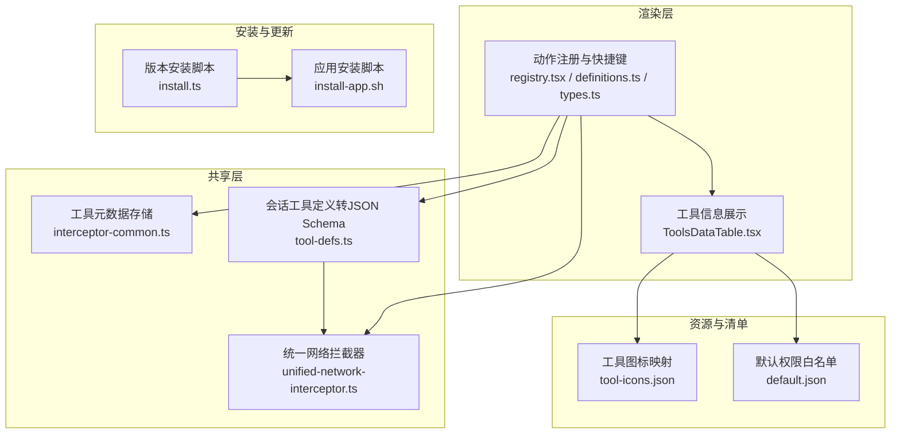
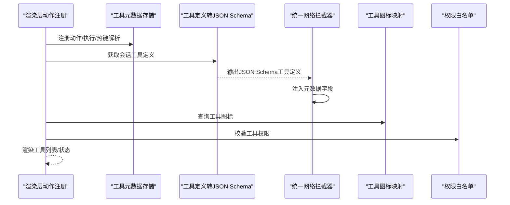
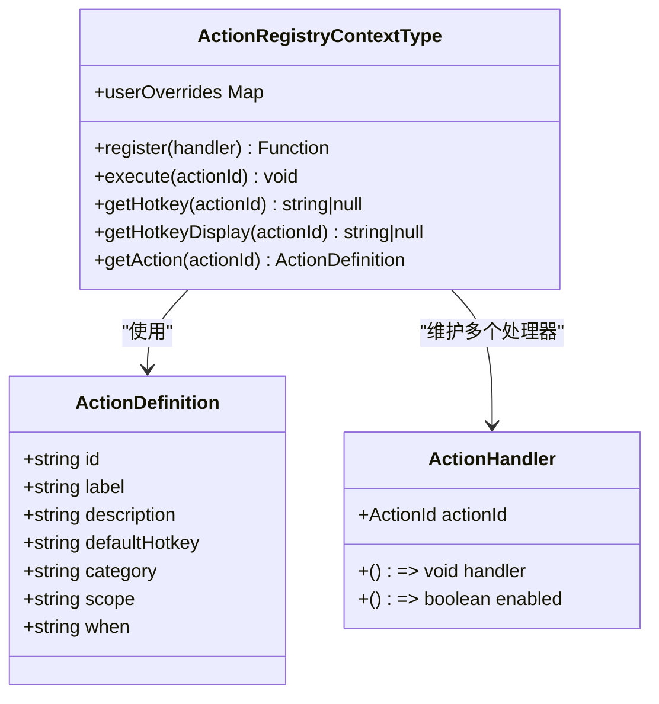
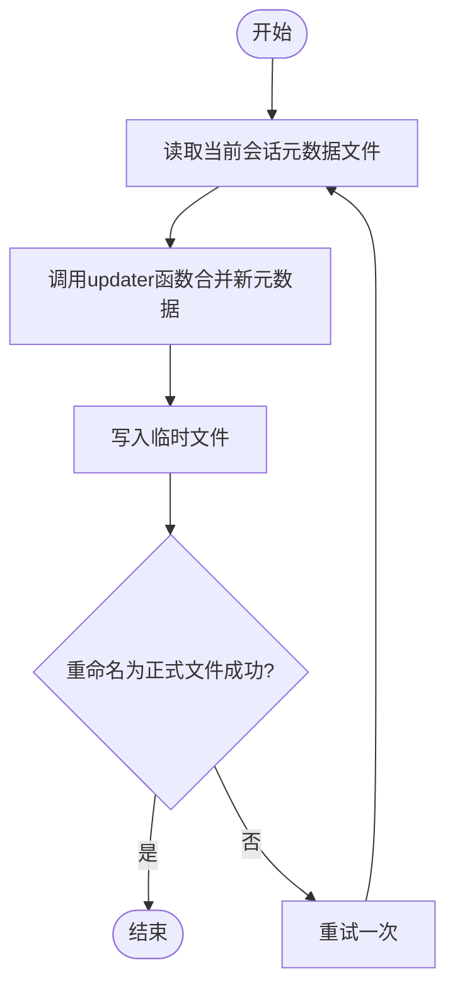
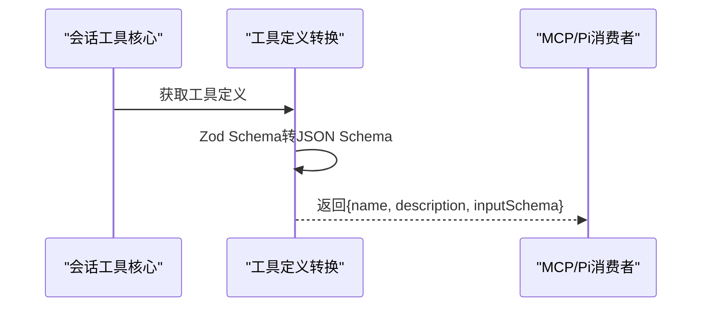
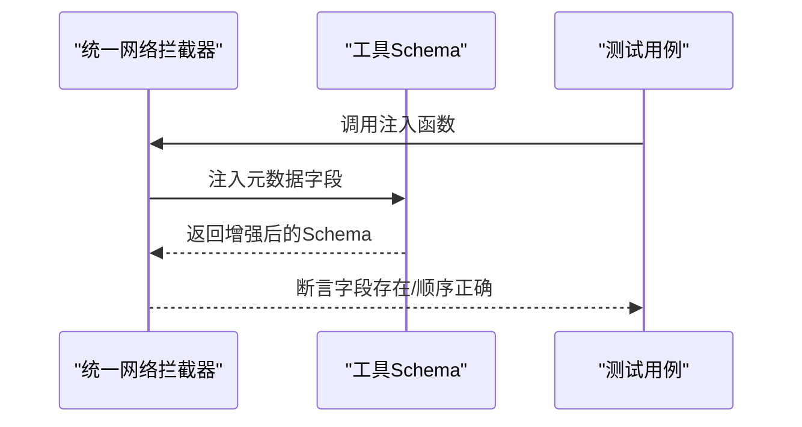
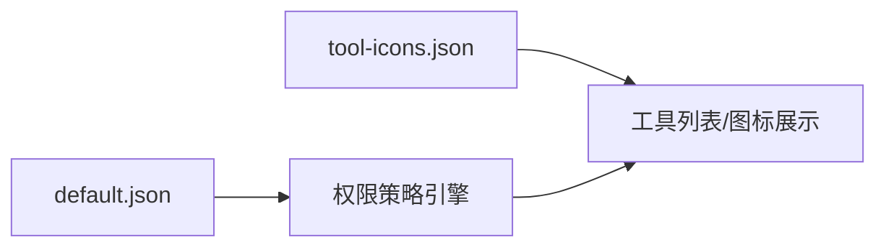
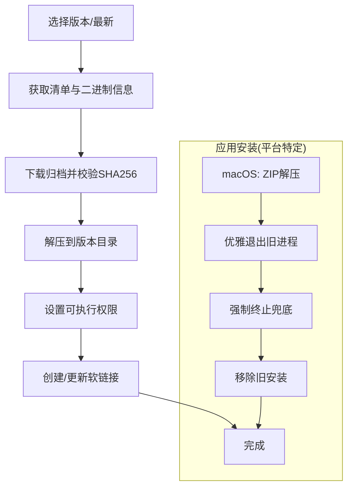
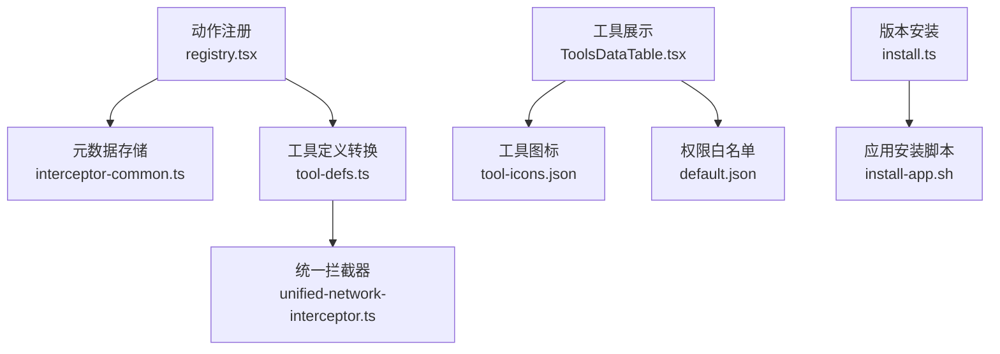

# 工具注册与发现

<cite>
**本文引用的文件**
- [apps/electron/resources/tool-icons/tool-icons.json](file://apps/electron/resources/tool-icons/tool-icons.json)
- [apps/electron/resources/permissions/default.json](file://apps/electron/resources/permissions/default.json)
- [apps/electron/src/renderer/actions/registry.tsx](file://apps/electron/src/renderer/actions/registry.tsx)
- [apps/electron/src/renderer/actions/types.ts](file://apps/electron/src/renderer/actions/types.ts)
- [apps/electron/src/renderer/actions/definitions.ts](file://apps/electron/src/renderer/actions/definitions.ts)
- [packages/shared/src/interceptor-common.ts](file://packages/shared/src/interceptor-common.ts)
- [packages/session-tools-core/src/tool-defs.ts](file://packages/session-tools-core/src/tool-defs.ts)
- [packages/shared/src/unified-network-interceptor.ts](file://packages/shared/src/unified-network-interceptor.ts)
- [packages/shared/src/__tests__/unified-network-interceptor.schema.test.ts](file://packages/shared/src/__tests__/unified-network-interceptor.schema.test.ts)
- [packages/shared/src/version/install.ts](file://packages/shared/src/version/install.ts)
- [scripts/install-app.sh](file://scripts/install-app.sh)
- [apps/electron/src/renderer/components/info/ToolsDataTable.tsx](file://apps/electron/src/renderer/components/info/ToolsDataTable.tsx)
</cite>

## 目录

1. [引言](#引言)
2. [项目结构](#项目结构)
3. [核心组件](#核心组件)
4. [架构总览](#架构总览)
5. [详细组件分析](#详细组件分析)
6. [依赖关系分析](#依赖关系分析)
7. [性能考量](#性能考量)
8. [故障排查指南](#故障排查指南)
9. [结论](#结论)
10. [附录](#附录)

## 引言

本文件围绕“工具注册与发现”机制，系统阐述工具的注册流程、元数据管理、动态发现与权限控制，并覆盖工具图标系统、分类与权限配置、接口规范、参数验证与返回值格式、生命周期（安装/更新/卸载）以及最佳实践。文档以仓库中已实现的功能为依据，结合渲染层动作注册、共享层工具元数据存储、会话工具定义转换、MCP 权限白名单与拦截器注入等模块，形成从 UI 到后端的一体化说明。

## 项目结构

与“工具注册与发现”直接相关的结构主要分布在以下位置：

- 渲染层动作注册：提供全局快捷键、动作分发与热键绑定能力
- 共享层工具元数据：持久化存储与并发合并写入
- 会话工具定义：将内部工具定义转换为 JSON Schema，供 MCP 等消费
- MCP 权限与拦截器：在统一网络拦截器中注入工具元数据字段
- 工具图标与权限清单：工具图标映射与默认权限白名单
- 安装与更新脚本：应用版本安装、更新与卸载流程

图表来源

- [apps/electron/src/renderer/actions/registry.tsx](file://apps/electron/src/renderer/actions/registry.tsx#L1-L197)
- [apps/electron/src/renderer/actions/definitions.ts](file://apps/electron/src/renderer/actions/definitions.ts#L1-L224)
- [apps/electron/src/renderer/actions/types.ts](file://apps/electron/src/renderer/actions/types.ts#L1-L26)
- [apps/electron/src/renderer/components/info/ToolsDataTable.tsx](file://apps/electron/src/renderer/components/info/ToolsDataTable.tsx#L1-L31)
- [packages/shared/src/interceptor-common.ts](file://packages/shared/src/interceptor-common.ts#L223-L281)
- [packages/session-tools-core/src/tool-defs.ts](file://packages/session-tools-core/src/tool-defs.ts#L567-L600)
- [packages/shared/src/unified-network-interceptor.ts](file://packages/shared/src/unified-network-interceptor.ts)
- [apps/electron/resources/tool-icons/tool-icons.json](file://apps/electron/resources/tool-icons/tool-icons.json#L1-L60)
- [apps/electron/resources/permissions/default.json](file://apps/electron/resources/permissions/default.json#L1-L246)
- [packages/shared/src/version/install.ts](file://packages/shared/src/version/install.ts#L1-L106)
- [scripts/install-app.sh](file://scripts/install-app.sh#L238-L279)

章节来源

- [apps/electron/src/renderer/actions/registry.tsx](file://apps/electron/src/renderer/actions/registry.tsx#L1-L197)
- [apps/electron/src/renderer/actions/definitions.ts](file://apps/electron/src/renderer/actions/definitions.ts#L1-L224)
- [apps/electron/src/renderer/actions/types.ts](file://apps/electron/src/renderer/actions/types.ts#L1-L26)
- [apps/electron/src/renderer/components/info/ToolsDataTable.tsx](file://apps/electron/src/renderer/components/info/ToolsDataTable.tsx#L1-L31)
- [packages/shared/src/interceptor-common.ts](file://packages/shared/src/interceptor-common.ts#L223-L281)
- [packages/session-tools-core/src/tool-defs.ts](file://packages/session-tools-core/src/tool-defs.ts#L567-L600)
- [packages/shared/src/unified-network-interceptor.ts](file://packages/shared/src/unified-network-interceptor.ts)
- [apps/electron/resources/tool-icons/tool-icons.json](file://apps/electron/resources/tool-icons/tool-icons.json#L1-L60)
- [apps/electron/resources/permissions/default.json](file://apps/electron/resources/permissions/default.json#L1-L246)
- [packages/shared/src/version/install.ts](file://packages/shared/src/version/install.ts#L1-L106)
- [scripts/install-app.sh](file://scripts/install-app.sh#L238-L279)

## 核心组件

- 动作注册与快捷键系统：提供动作注册、执行、热键解析与显示、作用域与上下文判断
- 工具元数据存储：按会话目录持久化工具元数据，支持并发合并写入与失败重试
- 会话工具定义到 JSON Schema 转换：将内部工具定义导出为 MCP 消费的输入模式
- 统一网络拦截器：在工具 Schema 中注入元数据字段，便于权限与意图识别
- 工具图标与权限清单：工具图标映射与默认权限白名单
- 安装与更新：版本下载、校验、解压、软链接与应用安装脚本

章节来源

- [apps/electron/src/renderer/actions/registry.tsx](file://apps/electron/src/renderer/actions/registry.tsx#L1-L197)
- [packages/shared/src/interceptor-common.ts](file://packages/shared/src/interceptor-common.ts#L223-L281)
- [packages/session-tools-core/src/tool-defs.ts](file://packages/session-tools-core/src/tool-defs.ts#L567-L600)
- [packages/shared/src/unified-network-interceptor.ts](file://packages/shared/src/unified-network-interceptor.ts)
- [apps/electron/resources/tool-icons/tool-icons.json](file://apps/electron/resources/tool-icons/tool-icons.json#L1-L60)
- [apps/electron/resources/permissions/default.json](file://apps/electron/resources/permissions/default.json#L1-L246)
- [packages/shared/src/version/install.ts](file://packages/shared/src/version/install.ts#L1-L106)

## 架构总览

工具注册与发现贯穿渲染层动作、共享层元数据、会话工具定义与 MCP 权限拦截器，最终由安装脚本完成版本生命周期管理。

图表来源

- [apps/electron/src/renderer/actions/registry.tsx](file://apps/electron/src/renderer/actions/registry.tsx#L1-L197)
- [packages/shared/src/interceptor-common.ts](file://packages/shared/src/interceptor-common.ts#L223-L281)
- [packages/session-tools-core/src/tool-defs.ts](file://packages/session-tools-core/src/tool-defs.ts#L567-L600)
- [packages/shared/src/unified-network-interceptor.ts](file://packages/shared/src/unified-network-interceptor.ts)
- [apps/electron/resources/tool-icons/tool-icons.json](file://apps/electron/resources/tool-icons/tool-icons.json#L1-L60)
- [apps/electron/resources/permissions/default.json](file://apps/electron/resources/permissions/default.json#L1-L246)

## 详细组件分析

### 动作注册与快捷键系统

- 提供注册处理器、执行动作、查询热键与显示字符串、作用域与上下文判断
- 支持用户热键覆盖、平台差异（Mac Cmd/Ctrl）与特殊键物理码匹配
- 基于 when 表达式控制触发时机，避免与文本输入冲突

图表来源

- [apps/electron/src/renderer/actions/registry.tsx](file://apps/electron/src/renderer/actions/registry.tsx#L1-L197)
- [apps/electron/src/renderer/actions/types.ts](file://apps/electron/src/renderer/actions/types.ts#L1-L26)
- [apps/electron/src/renderer/actions/definitions.ts](file://apps/electron/src/renderer/actions/definitions.ts#L1-L224)

章节来源

- [apps/electron/src/renderer/actions/registry.tsx](file://apps/electron/src/renderer/actions/registry.tsx#L1-L197)
- [apps/electron/src/renderer/actions/types.ts](file://apps/electron/src/renderer/actions/types.ts#L1-L26)
- [apps/electron/src/renderer/actions/definitions.ts](file://apps/electron/src/renderer/actions/definitions.ts#L1-L224)

### 工具元数据存储与并发合并

- 以会话目录为单位持久化工具元数据文件
- 读取/写入采用原子替换（临时文件+重命名），并发写入时进行一次重试
- 失败时记录调试日志但不抛出异常，保证非阻塞性

图表来源

- [packages/shared/src/interceptor-common.ts](file://packages/shared/src/interceptor-common.ts#L223-L281)

章节来源

- [packages/shared/src/interceptor-common.ts](file://packages/shared/src/interceptor-common.ts#L223-L281)

### 会话工具定义到 JSON Schema 转换

- 将内部工具定义转换为 JSON Schema 输入模式，便于 MCP/Pi 等消费者使用
- 可选前缀与开发者反馈工具开关
- 避免类型实例过深导致的编译问题，剥离不必要的元信息

图表来源

- [packages/session-tools-core/src/tool-defs.ts](file://packages/session-tools-core/src/tool-defs.ts#L567-L600)

章节来源

- [packages/session-tools-core/src/tool-defs.ts](file://packages/session-tools-core/src/tool-defs.ts#L567-L600)

### 统一网络拦截器中的元数据注入

- 在工具 Schema 中注入元数据字段（如显示名、意图），用于权限与意图识别
- 测试用例验证空 Schema 与已有属性场景下的行为

图表来源

- [packages/shared/src/unified-network-interceptor.ts](file://packages/shared/src/unified-network-interceptor.ts)
- [packages/shared/src/**tests**/unified-network-interceptor.schema.test.ts](file://packages/shared/src/__tests__/unified-network-interceptor.schema.test.ts#L1-L34)

章节来源

- [packages/shared/src/unified-network-interceptor.ts](file://packages/shared/src/unified-network-interceptor.ts)
- [packages/shared/src/**tests**/unified-network-interceptor.schema.test.ts](file://packages/shared/src/__tests__/unified-network-interceptor.schema.test.ts#L1-L34)

### 工具图标系统与权限配置

- 工具图标映射：通过 JSON 文件维护工具 ID、显示名与图标文件及命令别名
- 默认权限白名单：定义允许的 Bash/MCP/API/写路径等模式，支持只读与安全操作

图表来源

- [apps/electron/resources/tool-icons/tool-icons.json](file://apps/electron/resources/tool-icons/tool-icons.json#L1-L60)
- [apps/electron/resources/permissions/default.json](file://apps/electron/resources/permissions/default.json#L1-L246)

章节来源

- [apps/electron/resources/tool-icons/tool-icons.json](file://apps/electron/resources/tool-icons/tool-icons.json#L1-L60)
- [apps/electron/resources/permissions/default.json](file://apps/electron/resources/permissions/default.json#L1-L246)

### 工具生命周期管理（安装/更新/卸载）

- 版本安装：下载归档、校验 SHA256、解压、设置可执行权限、创建软链接
- 应用安装：macOS 平台 ZIP 解压、优雅退出旧进程、强制终止兜底、清理旧安装
- 更新与卸载：通过脚本与安装流程实现版本切换与清理

图表来源

- [packages/shared/src/version/install.ts](file://packages/shared/src/version/install.ts#L1-L106)
- [scripts/install-app.sh](file://scripts/install-app.sh#L238-L279)

章节来源

- [packages/shared/src/version/install.ts](file://packages/shared/src/version/install.ts#L1-L106)
- [scripts/install-app.sh](file://scripts/install-app.sh#L238-L279)

## 依赖关系分析

- 渲染层动作注册依赖共享层工具元数据存储与会话工具定义转换
- 统一网络拦截器依赖工具 Schema 转换结果，向 MCP/Pi 消费者提供标准化输入
- 工具图标与权限清单为 UI 层提供展示与权限校验数据源
- 安装脚本为应用提供版本生命周期管理

图表来源

- [apps/electron/src/renderer/actions/registry.tsx](file://apps/electron/src/renderer/actions/registry.tsx#L1-L197)
- [packages/shared/src/interceptor-common.ts](file://packages/shared/src/interceptor-common.ts#L223-L281)
- [packages/session-tools-core/src/tool-defs.ts](file://packages/session-tools-core/src/tool-defs.ts#L567-L600)
- [packages/shared/src/unified-network-interceptor.ts](file://packages/shared/src/unified-network-interceptor.ts)
- [apps/electron/src/renderer/components/info/ToolsDataTable.tsx](file://apps/electron/src/renderer/components/info/ToolsDataTable.tsx#L1-L31)
- [apps/electron/resources/tool-icons/tool-icons.json](file://apps/electron/resources/tool-icons/tool-icons.json#L1-L60)
- [apps/electron/resources/permissions/default.json](file://apps/electron/resources/permissions/default.json#L1-L246)
- [packages/shared/src/version/install.ts](file://packages/shared/src/version/install.ts#L1-L106)
- [scripts/install-app.sh](file://scripts/install-app.sh#L238-L279)

## 性能考量

- 元数据存储采用原子写入与一次性重试，降低并发写入丢失风险
- 工具定义转换使用 JSON Schema 生成，避免深层类型推断开销
- 渲染层动作注册使用内存 Map 存储处理器，查找与执行复杂度低
- 安装流程并行下载与解压，减少等待时间；软链接避免重复拷贝

## 故障排查指南

- 元数据写入失败：检查会话目录权限与磁盘空间；查看调试日志定位具体错误
- 并发写入丢失：确认是否多次并发写入；必要时增加重试或串行化
- 快捷键冲突：检查用户热键覆盖与平台修饰键差异；核对 when 表达式
- 权限拒绝：核对默认权限白名单与工具命令模式；确保仅使用只读或授权操作
- 安装失败：确认网络连通性与 SHA256 校验；查看平台特定安装脚本输出

章节来源

- [packages/shared/src/interceptor-common.ts](file://packages/shared/src/interceptor-common.ts#L223-L281)
- [apps/electron/src/renderer/actions/registry.tsx](file://apps/electron/src/renderer/actions/registry.tsx#L1-L197)
- [apps/electron/resources/permissions/default.json](file://apps/electron/resources/permissions/default.json#L1-L246)
- [packages/shared/src/version/install.ts](file://packages/shared/src/version/install.ts#L1-L106)

## 结论

该机制通过渲染层动作注册、共享层元数据存储、会话工具定义转换与统一拦截器注入，形成了从 UI 到后端的完整工具注册与发现闭环；配合工具图标与权限清单，实现了可视化与安全可控的工具管理；安装脚本保障了版本生命周期的稳定性与可维护性。建议在扩展新工具时遵循统一 Schema 与拦截器注入规范，确保权限与元数据一致性。

## 附录

### 工具接口规范与参数验证

- 接口规范：工具定义转换为 JSON Schema，包含名称、描述与输入模式
- 参数验证：返回结构化验证结果，包含错误与警告列表
- 返回值格式：人类可读文本，首行指示通过/失败，随后列出错误与警告项

章节来源

- [packages/session-tools-core/src/tool-defs.ts](file://packages/session-tools-core/src/tool-defs.ts#L567-L600)
- [packages/shared/src/**tests**/unified-network-interceptor.schema.test.ts](file://packages/shared/src/__tests__/unified-network-interceptor.schema.test.ts#L1-L34)
- [packages/shared/src/interceptor-common.ts](file://packages/shared/src/interceptor-common.ts#L223-L281)

### 工具分类与权限配置

- 分类：动作定义中包含类别字段，便于 UI 分组展示
- 权限：默认权限白名单覆盖 Bash/MCP/API/写路径等模式，确保只读与安全操作优先

章节来源

- [apps/electron/src/renderer/actions/definitions.ts](file://apps/electron/src/renderer/actions/definitions.ts#L1-L224)
- [apps/electron/resources/permissions/default.json](file://apps/electron/resources/permissions/default.json#L1-L246)

### 工具图标系统

- 图标映射：通过 JSON 文件维护工具 ID、显示名、图标文件与命令别名
- UI 展示：工具表格组件根据图标映射与权限状态渲染

章节来源

- [apps/electron/resources/tool-icons/tool-icons.json](file://apps/electron/resources/tool-icons/tool-icons.json#L1-L60)
- [apps/electron/src/renderer/components/info/ToolsDataTable.tsx](file://apps/electron/src/renderer/components/info/ToolsDataTable.tsx#L1-L31)
