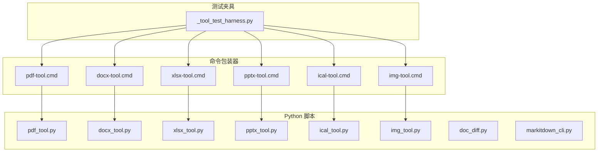
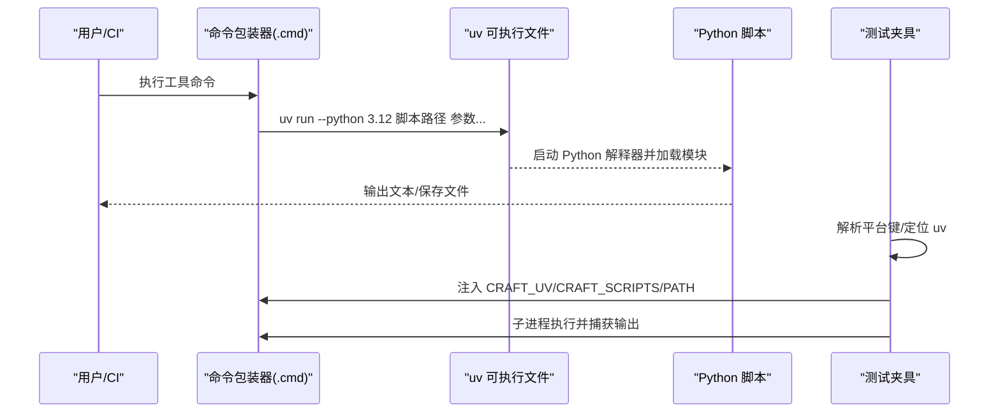
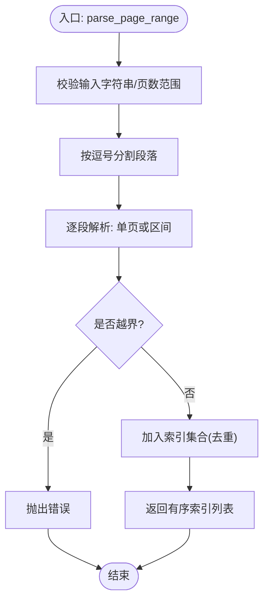
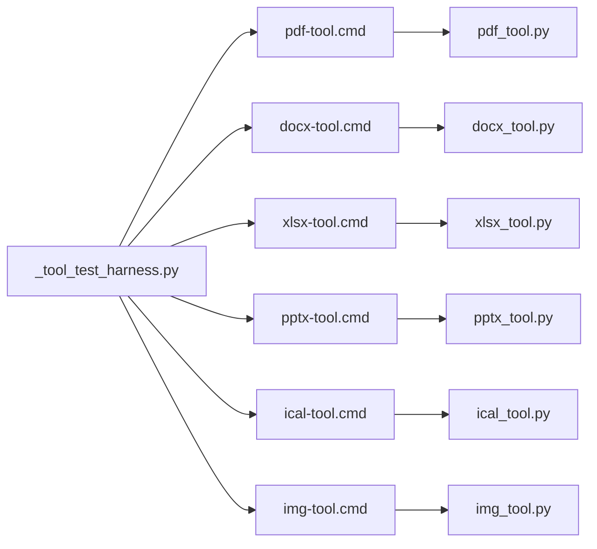

# 本地工具执行

<cite>
**本文引用的文件**
- [apps/electron/resources/scripts/docx_tool.py](file://apps/electron/resources/scripts/docx_tool.py)
- [apps/electron/resources/scripts/pdf_tool.py](file://apps/electron/resources/scripts/pdf_tool.py)
- [apps/electron/resources/scripts/xlsx_tool.py](file://apps/electron/resources/scripts/xlsx_tool.py)
- [apps/electron/resources/scripts/pptx_tool.py](file://apps/electron/resources/scripts/pptx_tool.py)
- [apps/electron/resources/scripts/ical_tool.py](file://apps/electron/resources/scripts/ical_tool.py)
- [apps/electron/resources/scripts/img_tool.py](file://apps/electron/resources/scripts/img_tool.py)
- [apps/electron/resources/scripts/doc_diff.py](file://apps/electron/resources/scripts/doc_diff.py)
- [apps/electron/resources/scripts/markitdown_cli.py](file://apps/electron/resources/scripts/markitdown_cli.py)
- [apps/electron/resources/bin/pdf-tool.cmd](file://apps/electron/resources/bin/pdf-tool.cmd)
- [apps/electron/resources/bin/docx-tool.cmd](file://apps/electron/resources/bin/docx-tool.cmd)
- [apps/electron/resources/bin/xlsx-tool.cmd](file://apps/electron/resources/bin/xlsx-tool.cmd)
- [apps/electron/resources/bin/pptx-tool.cmd](file://apps/electron/resources/bin/pptx-tool.cmd)
- [apps/electron/resources/bin/ical-tool.cmd](file://apps/electron/resources/bin/ical-tool.cmd)
- [apps/electron/resources/bin/img-tool.cmd](file://apps/electron/resources/bin/img-tool.cmd)
- [apps/electron/resources/scripts/tests/_tool_test_harness.py](file://apps/electron/resources/scripts/tests/_tool_test_harness.py)
- [apps/cli/src/client.ts](file://apps/cli/src/client.ts)
</cite>

## 目录

1. [简介](#简介)
2. [项目结构](#项目结构)
3. [核心组件](#核心组件)
4. [架构总览](#架构总览)
5. [详细组件分析](#详细组件分析)
6. [依赖关系分析](#依赖关系分析)
7. [性能考量](#性能考量)
8. [故障排查指南](#故障排查指南)
9. [结论](#结论)
10. [附录](#附录)

## 简介

本文件面向“本地工具执行系统”，聚焦于 Python 工具脚本的管理与执行、执行环境隔离（uv + 指定 Python 版本）、跨平台兼容（Windows/Linux/macOS）与命令包装器、以及常见文档/图像/日历等工具的实现原理与使用方式。文档还涵盖工具执行的安全边界、超时控制与资源限制建议、以及工具开发与测试流程。

## 项目结构

该系统以“命令包装器 + Python 脚本 + 测试夹具”为核心组织方式：

- 命令包装器：位于 apps/electron/resources/bin 下，按工具名命名，统一通过 uv 运行对应 Python 脚本。
- Python 脚本：位于 apps/electron/resources/scripts 下，每个工具一个独立模块，采用 Click 定义子命令与参数。
- 测试夹具：位于 scripts/tests 下，提供跨平台解析 uv 二进制、构建执行环境、运行工具的通用能力。

图表来源

- [apps/electron/resources/bin/pdf-tool.cmd](file://apps/electron/resources/bin/pdf-tool.cmd#L1-L3)
- [apps/electron/resources/bin/docx-tool.cmd](file://apps/electron/resources/bin/docx-tool.cmd#L1-L3)
- [apps/electron/resources/bin/xlsx-tool.cmd](file://apps/electron/resources/bin/xlsx-tool.cmd#L1-L3)
- [apps/electron/resources/bin/pptx-tool.cmd](file://apps/electron/resources/bin/pptx-tool.cmd#L1-L3)
- [apps/electron/resources/bin/ical-tool.cmd](file://apps/electron/resources/bin/ical-tool.cmd#L1-L3)
- [apps/electron/resources/bin/img-tool.cmd](file://apps/electron/resources/bin/img-tool.cmd#L1-L3)
- [apps/electron/resources/scripts/pdf_tool.py](file://apps/electron/resources/scripts/pdf_tool.py#L1-L1322)
- [apps/electron/resources/scripts/docx_tool.py](file://apps/electron/resources/scripts/docx_tool.py#L1-L391)
- [apps/electron/resources/scripts/xlsx_tool.py](file://apps/electron/resources/scripts/xlsx_tool.py#L1-L376)
- [apps/electron/resources/scripts/pptx_tool.py](file://apps/electron/resources/scripts/pptx_tool.py#L1-L365)
- [apps/electron/resources/scripts/ical_tool.py](file://apps/electron/resources/scripts/ical_tool.py#L1-L373)
- [apps/electron/resources/scripts/img_tool.py](file://apps/electron/resources/scripts/img_tool.py#L1-L371)
- [apps/electron/resources/scripts/doc_diff.py](file://apps/electron/resources/scripts/doc_diff.py#L1-L252)
- [apps/electron/resources/scripts/markitdown_cli.py](file://apps/electron/resources/scripts/markitdown_cli.py#L1-L138)
- [apps/electron/resources/scripts/tests/\_tool_test_harness.py](file://apps/electron/resources/scripts/tests/_tool_test_harness.py#L1-L83)

章节来源

- [apps/electron/resources/bin/pdf-tool.cmd](file://apps/electron/resources/bin/pdf-tool.cmd#L1-L3)
- [apps/electron/resources/bin/docx-tool.cmd](file://apps/electron/resources/bin/docx-tool.cmd#L1-L3)
- [apps/electron/resources/bin/xlsx-tool.cmd](file://apps/electron/resources/bin/xlsx-tool.cmd#L1-L3)
- [apps/electron/resources/bin/pptx-tool.cmd](file://apps/electron/resources/bin/pptx-tool.cmd#L1-L3)
- [apps/electron/resources/bin/ical-tool.cmd](file://apps/electron/resources/bin/ical-tool.cmd#L1-L3)
- [apps/electron/resources/bin/img-tool.cmd](file://apps/electron/resources/bin/img-tool.cmd#L1-L3)
- [apps/electron/resources/scripts/tests/\_tool_test_harness.py](file://apps/electron/resources/scripts/tests/_tool_test_harness.py#L1-L83)

## 核心组件

- 命令包装器（.cmd/.sh）：统一通过 uv run --python 指定版本运行对应 Python 脚本，确保环境一致性与可移植性。
- Python 工具脚本：每个工具以 Click 定义命令组与子命令，支持标准输出或写入文件；多数工具提供 info/extract/read 等基础能力。
- 测试夹具：解析平台键、定位 uv 可执行文件、注入环境变量（如 CRAFT_UV、CRAFT_SCRIPTS），封装子进程调用，便于自动化测试。

章节来源

- [apps/electron/resources/scripts/tests/\_tool_test_harness.py](file://apps/electron/resources/scripts/tests/_tool_test_harness.py#L1-L83)
- [apps/electron/resources/scripts/pdf_tool.py](file://apps/electron/resources/scripts/pdf_tool.py#L1-L1322)
- [apps/electron/resources/scripts/docx_tool.py](file://apps/electron/resources/scripts/docx_tool.py#L1-L391)
- [apps/electron/resources/scripts/xlsx_tool.py](file://apps/electron/resources/scripts/xlsx_tool.py#L1-L376)
- [apps/electron/resources/scripts/pptx_tool.py](file://apps/electron/resources/scripts/pptx_tool.py#L1-L365)
- [apps/electron/resources/scripts/ical_tool.py](file://apps/electron/resources/scripts/ical_tool.py#L1-L373)
- [apps/electron/resources/scripts/img_tool.py](file://apps/electron/resources/scripts/img_tool.py#L1-L371)

## 架构总览

下图展示从命令包装器到 Python 脚本的调用链路，以及测试夹具如何在不同平台上解析 uv 并注入环境变量。

图表来源

- [apps/electron/resources/bin/pdf-tool.cmd](file://apps/electron/resources/bin/pdf-tool.cmd#L1-L3)
- [apps/electron/resources/bin/docx-tool.cmd](file://apps/electron/resources/bin/docx-tool.cmd#L1-L3)
- [apps/electron/resources/bin/xlsx-tool.cmd](file://apps/electron/resources/bin/xlsx-tool.cmd#L1-L3)
- [apps/electron/resources/bin/pptx-tool.cmd](file://apps/electron/resources/bin/pptx-tool.cmd#L1-L3)
- [apps/electron/resources/bin/ical-tool.cmd](file://apps/electron/resources/bin/ical-tool.cmd#L1-L3)
- [apps/electron/resources/bin/img-tool.cmd](file://apps/electron/resources/bin/img-tool.cmd#L1-L3)
- [apps/electron/resources/scripts/tests/\_tool_test_harness.py](file://apps/electron/resources/scripts/tests/_tool_test_harness.py#L37-L82)

## 详细组件分析

### PDF 工具（pdf_tool.py）

- 功能概览：组织类（提取/合并/拆分/旋转/重排/复制）、编辑类（水印/填表/压缩/裁剪/缩放/压平等）、安全类（加密/解密/打码/净化）、转换类（图片/PDF/DOCX/PPTX）。
- 关键点：
  - 页面范围解析严格，避免越界与静默失败。
  - 水印/叠加层通过纯 Python 构造最小 PDF 结构，避免额外依赖。
  - 支持元数据读取/编辑、表单字段填充、页面尺寸与页面数统计。
- 输出格式：文本/JSON/PDF 文件；支持写入文件或标准输出。

图表来源

- [apps/electron/resources/scripts/pdf_tool.py](file://apps/electron/resources/scripts/pdf_tool.py#L71-L136)

章节来源

- [apps/electron/resources/scripts/pdf_tool.py](file://apps/electron/resources/scripts/pdf_tool.py#L1-L1322)

### DOCX 工具（docx_tool.py）

- 功能概览：创建（支持 Markdown）、模板填充、信息查询、查找替换、内容抽取。
- 关键点：
  - Markdown 到段落的映射（标题/列表/段落/分页符）。
  - 模板占位符替换（保留格式）。
  - 文档信息统计（段落数/表格数/样式/字数/核心属性/模板占位符）。
- 输出格式：JSON/文本；支持写入文件或标准输出。

章节来源

- [apps/electron/resources/scripts/docx_tool.py](file://apps/electron/resources/scripts/docx_tool.py#L1-L391)

### XLSX 工具（xlsx_tool.py）

- 功能概览：读取（单表/全表/区域）、写入单元格、信息查询、新增工作表、导出 CSV/JSON。
- 关键点：
  - 行列数据转记录（带表头）。
  - 多格式输出（文本/CSV/JSON）。
  - 写入时类型转换（数字/布尔/字符串）。
- 输出格式：文本/CSV/JSON；支持写入文件或标准输出。

章节来源

- [apps/electron/resources/scripts/xlsx_tool.py](file://apps/electron/resources/scripts/xlsx_tool.py#L1-L376)

### PPTX 工具（pptx_tool.py）

- 功能概览：创建（Markdown/JSON/模板）、信息查询、内容抽取。
- 关键点：
  - Markdown 分页符分隔幻灯片；标题/正文/编号/缩进层级处理。
  - JSON 结构化数据驱动创建。
  - 抽取时保留缩进层级与表格内容。
- 输出格式：JSON/文本；支持写入文件或标准输出。

章节来源

- [apps/electron/resources/scripts/pptx_tool.py](file://apps/electron/resources/scripts/pptx_tool.py#L1-L365)

### 日历工具（ical_tool.py）

- 功能概览：读取事件、创建日历、按日期范围过滤。
- 关键点：
  - 日期/时间解析与本地时区对齐，保证过滤一致性。
  - 生成 .ics 时复制时区定义，保持时区语义。
- 输出格式：JSON/文本/ics；支持写入文件或标准输出。

章节来源

- [apps/electron/resources/scripts/ical_tool.py](file://apps/electron/resources/scripts/ical_tool.py#L1-L373)

### 图像工具（img_tool.py）

- 功能概览：缩放、裁剪、旋转、格式转换、信息查询、文字水印、图像合成。
- 关键点：
  - JPEG 不支持透明通道，自动转 RGB。
  - 水印文字字体回退策略（多平台字体路径）。
  - 合成支持覆盖/混合/透明度。
- 输出格式：文本/图像文件；支持写入文件或标准输出。

章节来源

- [apps/electron/resources/scripts/img_tool.py](file://apps/electron/resources/scripts/img_tool.py#L1-L371)

### 文档对比工具（doc_diff.py）

- 功能概览：将两个文档转换为 Markdown，再进行统一差异/并排差异/摘要统计。
- 关键点：
  - 对非文本文件优先使用 markitdown；若不可用则回退至 docx 提取或报错。
  - 统一差异/并排差异/词级别摘要三类输出。
- 输出格式：文本；支持写入文件或标准输出。

章节来源

- [apps/electron/resources/scripts/doc_diff.py](file://apps/electron/resources/scripts/doc_diff.py#L1-L252)

### 通用 Markdown 转换器（markitdown_cli.py）

- 功能概览：将多种文档格式转换为 Markdown。
- 关键点：
  - 针对 .docx 的快速回退路径，避免依赖链。
  - 对纯文本扩展名直接读取。
  - 对不支持扩展名给出警告但继续尝试转换。
- 输出格式：文本；支持写入文件或标准输出。

章节来源

- [apps/electron/resources/scripts/markitdown_cli.py](file://apps/electron/resources/scripts/markitdown_cli.py#L1-L138)

## 依赖关系分析

- 命令包装器与脚本一一对应，通过 uv run --python 3.12 固定解释器版本，确保跨平台一致性。
- Python 脚本内部依赖各自声明的第三方库（Click、Pillow、openpyxl、python-pptx、icalendar 等），由 uv 环境管理。
- 测试夹具负责解析平台键、定位 uv、注入环境变量（CRAFT_UV、CRAFT_SCRIPTS、PATH），统一子进程调用。

图表来源

- [apps/electron/resources/bin/pdf-tool.cmd](file://apps/electron/resources/bin/pdf-tool.cmd#L1-L3)
- [apps/electron/resources/bin/docx-tool.cmd](file://apps/electron/resources/bin/docx-tool.cmd#L1-L3)
- [apps/electron/resources/bin/xlsx-tool.cmd](file://apps/electron/resources/bin/xlsx-tool.cmd#L1-L3)
- [apps/electron/resources/bin/pptx-tool.cmd](file://apps/electron/resources/bin/pptx-tool.cmd#L1-L3)
- [apps/electron/resources/bin/ical-tool.cmd](file://apps/electron/resources/bin/ical-tool.cmd#L1-L3)
- [apps/electron/resources/bin/img-tool.cmd](file://apps/electron/resources/bin/img-tool.cmd#L1-L3)
- [apps/electron/resources/scripts/tests/\_tool_test_harness.py](file://apps/electron/resources/scripts/tests/_tool_test_harness.py#L1-L83)

章节来源

- [apps/electron/resources/scripts/tests/\_tool_test_harness.py](file://apps/electron/resources/scripts/tests/_tool_test_harness.py#L1-L83)

## 性能考量

- 解析与渲染
  - PDF：页面渲染与水印叠加可能受 DPI/分辨率影响，建议在包装器侧设置合理 DPI 或缓存中间结果（若需要复用）。
  - 图像：缩放/旋转/合成使用高质量重采样，注意大图内存占用；建议限制最大目标尺寸或分块处理。
- I/O 与序列化
  - Excel：读取全表时建议指定区域或仅读取必要工作表，避免不必要的内存压力。
  - 文档转换：markitdown 在部分平台存在可选依赖问题，建议提前安装所需运行时以减少启动失败重试。
- 并发与批处理
  - 当前脚本为单次命令执行模型，批量任务建议在上层调度器中串行/并行编排，避免同时触发大量高内存操作。

## 故障排查指南

- uv 未找到
  - 现象：找不到 uv 或无法运行工具。
  - 排查：确认测试夹具已正确解析平台键并定位 uv；检查 PATH 中包含 uv 所在目录；或显式设置 CRAFT_UV。
- Python 版本不匹配
  - 现象：工具提示需要 Python 3.12。
  - 排查：确认命令包装器使用 --python 3.12；若系统自带 Python 版本不符，优先使用打包的 uv。
- 权限与路径
  - 现象：无法写入输出文件或读取输入文件。
  - 排查：确认输出路径存在且具备写权限；输入路径正确；跨平台路径分隔符一致。
- 第三方依赖缺失
  - 现象：图像/文档转换时报错（如字体、FFmpeg、DLL 缺失）。
  - 排查：安装 Microsoft Visual C++ 运行时（针对 Windows）；确保系统字体可用；必要时在 uv 环境中安装缺失依赖。
- 超时与资源限制
  - 建议：在上层调用侧设置请求超时与进程级资源限制（CPU/内存/文件句柄），避免长时间阻塞或 OOM。

章节来源

- [apps/electron/resources/scripts/tests/\_tool_test_harness.py](file://apps/electron/resources/scripts/tests/_tool_test_harness.py#L37-L82)
- [apps/electron/resources/scripts/img_tool.py](file://apps/electron/resources/scripts/img_tool.py#L274-L323)
- [apps/electron/resources/scripts/markitdown_cli.py](file://apps/electron/resources/scripts/markitdown_cli.py#L120-L133)

## 结论

该本地工具执行系统通过“命令包装器 + uv + Python 脚本”的组合，实现了稳定的跨平台文档与媒体处理能力。每个工具脚本职责清晰、参数与输出标准化，配合严格的页面范围解析、格式推断与错误处理，满足日常办公场景下的批量与交互式需求。建议在生产环境中结合超时控制与资源限制，进一步提升稳定性与安全性。

## 附录

### 命令包装器与脚本映射

- pdf-tool.cmd → pdf_tool.py
- docx-tool.cmd → docx_tool.py
- xlsx-tool.cmd → xlsx_tool.py
- pptx-tool.cmd → pptx_tool.py
- ical-tool.cmd → ical_tool.py
- img-tool.cmd → img_tool.py

章节来源

- [apps/electron/resources/bin/pdf-tool.cmd](file://apps/electron/resources/bin/pdf-tool.cmd#L1-L3)
- [apps/electron/resources/bin/docx-tool.cmd](file://apps/electron/resources/bin/docx-tool.cmd#L1-L3)
- [apps/electron/resources/bin/xlsx-tool.cmd](file://apps/electron/resources/bin/xlsx-tool.cmd#L1-L3)
- [apps/electron/resources/bin/pptx-tool.cmd](file://apps/electron/resources/bin/pptx-tool.cmd#L1-L3)
- [apps/electron/resources/bin/ical-tool.cmd](file://apps/electron/resources/bin/ical-tool.cmd#L1-L3)
- [apps/electron/resources/bin/img-tool.cmd](file://apps/electron/resources/bin/img-tool.cmd#L1-L3)

### 工具开发指南（新增工具）

- 命名与目录
  - 新增 Python 脚本：apps/electron/resources/scripts/<tool>\_tool.py
  - 新增命令包装器：apps/electron/resources/bin/<tool>-tool.cmd（Windows）或 <tool>（Linux/macOS）
- 环境与依赖
  - 在脚本头部添加 # /// script ... # /// 注释块，声明 requires-python 与 dependencies。
  - 包装器通过 uv run --python 3.12 执行脚本，确保解释器版本一致。
- 参数与输出
  - 使用 Click 定义命令组与子命令；提供 -o/--output 将结果写入文件或标准输出。
  - 对于复杂数据，优先输出 JSON；文本输出需保持简洁一致。
- 错误处理
  - 对异常进行捕获并打印错误信息，退出码非零；避免静默失败。
- 测试与调试
  - 使用测试夹具构建环境并运行工具，观察输出与退出码。
  - 在本地先用 uv pip install 对应依赖，再运行工具验证功能。

章节来源

- [apps/electron/resources/scripts/tests/\_tool_test_harness.py](file://apps/electron/resources/scripts/tests/_tool_test_harness.py#L37-L82)
- [apps/electron/resources/scripts/pdf_tool.py](file://apps/electron/resources/scripts/pdf_tool.py#L1-L1322)
- [apps/electron/resources/scripts/docx_tool.py](file://apps/electron/resources/scripts/docx_tool.py#L1-L391)
- [apps/electron/resources/scripts/xlsx_tool.py](file://apps/electron/resources/scripts/xlsx_tool.py#L1-L376)
- [apps/electron/resources/scripts/pptx_tool.py](file://apps/electron/resources/scripts/pptx_tool.py#L1-L365)
- [apps/electron/resources/scripts/ical_tool.py](file://apps/electron/resources/scripts/ical_tool.py#L1-L373)
- [apps/electron/resources/scripts/img_tool.py](file://apps/electron/resources/scripts/img_tool.py#L1-L371)
