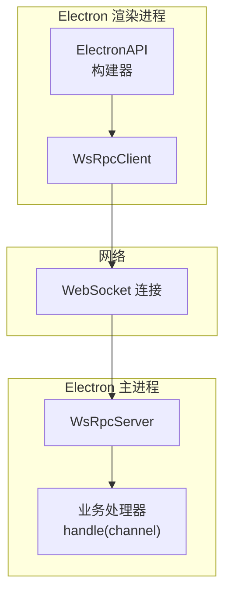
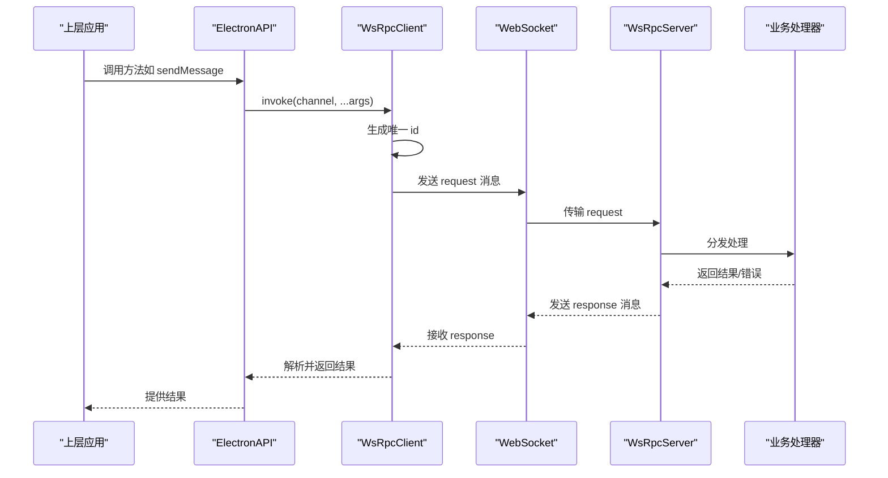
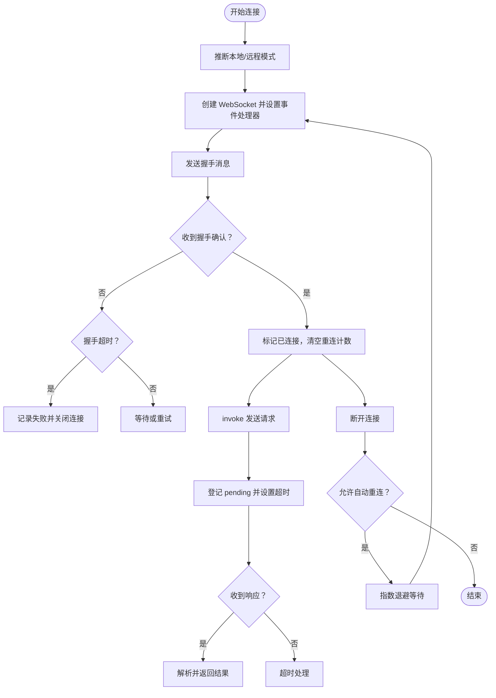
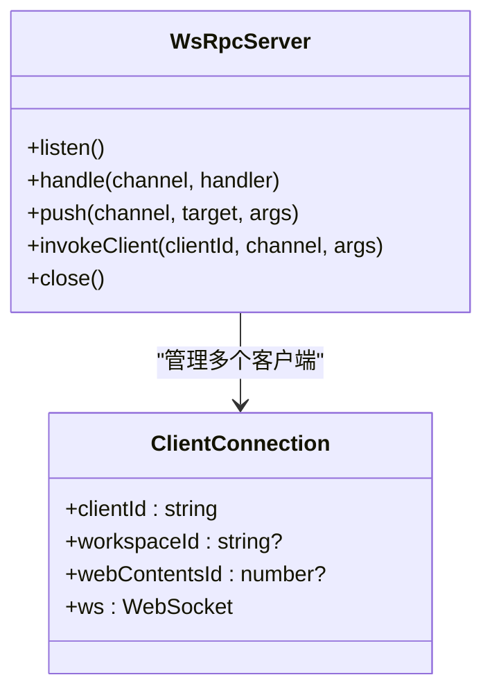
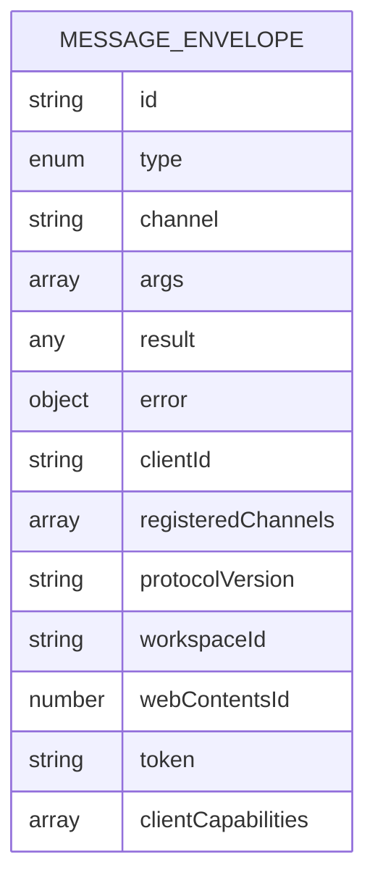
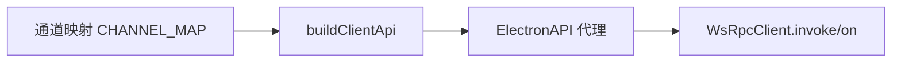
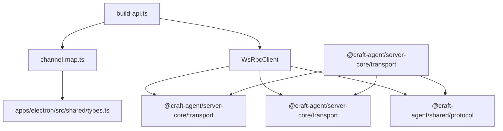

# 传输层设计

<cite>
**本文引用的文件**
- [apps/electron/src/transport/index.ts](file://apps/electron/src/transport/index.ts)
- [apps/electron/src/transport/client.ts](file://apps/electron/src/transport/client.ts)
- [apps/electron/src/transport/server.ts](file://apps/electron/src/transport/server.ts)
- [apps/electron/src/transport/codec.ts](file://apps/electron/src/transport/codec.ts)
- [apps/electron/src/transport/channel-map.ts](file://apps/electron/src/transport/channel-map.ts)
- [apps/electron/src/transport/build-api.ts](file://apps/electron/src/transport/build-api.ts)
- [apps/electron/src/shared/types.ts](file://apps/electron/src/shared/types.ts)
- [packages/server-core/src/transport/types.ts](file://packages/server-core/src/transport/types.ts)
- [packages/server-core/src/transport/server.ts](file://packages/server-core/src/transport/server.ts)
- [packages/shared/src/protocol/types.ts](file://packages/shared/src/protocol/types.ts)
- [apps/electron/src/transport/__tests__/codec.test.ts](file://apps/electron/src/transport/__tests__/codec.test.ts)
- [apps/electron/src/transport/__tests__/channel-map-parity.test.ts](file://apps/electron/src/transport/__tests__/channel-map-parity.test.ts)
- [apps/electron/src/__tests__/transport.test.ts](file://apps/electron/src/__tests__/transport.test.ts)
</cite>

## 目录

1. [简介](#简介)
2. [项目结构](#项目结构)
3. [核心组件](#核心组件)
4. [架构总览](#架构总览)
5. [详细组件分析](#详细组件分析)
6. [依赖关系分析](#依赖关系分析)
7. [性能考量](#性能考量)
8. [故障排查指南](#故障排查指南)
9. [结论](#结论)
10. [附录：通信协议规范与消息格式](#附录通信协议规范与消息格式)

## 简介

本文件系统性阐述 Craft Agents 传输层的设计与实现，聚焦基于 WebSocket 的 RPC 通信协议。内容涵盖消息编解码、连接管理、错误恢复机制、可靠消息传递保障、断线重连策略、双向通信支持、客户端与服务器端实现差异、认证与安全考虑、性能优化与并发处理、以及与上层业务逻辑的解耦设计。同时提供通信协议规范与消息格式示例，帮助开发者正确接入与扩展。

## 项目结构

传输层位于 Electron 应用的渲染进程与主进程之间，通过 WebSocket 实现 RPC 调用与事件推送。关键模块包括：

- 客户端：WsRpcClient（封装握手、请求/响应关联、事件订阅、自动重连）
- 服务器端：WsRpcServer（基于 server-core 包，负责处理器注册、推送、鉴权与 TLS 支持）
- 编解码：统一的消息封包与校验
- 通道映射：将高层 API 方法映射到具体的 RPC 通道
- 类型与状态：统一的连接状态模型与错误分类

图表来源

- [apps/electron/src/transport/client.ts](file://apps/electron/src/transport/client.ts#L101-L728)
- [apps/electron/src/transport/server.ts](file://apps/electron/src/transport/server.ts#L1-L2)
- [packages/server-core/src/transport/server.ts](file://packages/server-core/src/transport/server.ts#L83-L321)

章节来源

- [apps/electron/src/transport/index.ts](file://apps/electron/src/transport/index.ts#L1-L6)
- [apps/electron/src/transport/client.ts](file://apps/electron/src/transport/client.ts#L101-L728)
- [apps/electron/src/transport/server.ts](file://apps/electron/src/transport/server.ts#L1-L2)
- [apps/electron/src/transport/codec.ts](file://apps/electron/src/transport/codec.ts#L1-L6)
- [apps/electron/src/transport/channel-map.ts](file://apps/electron/src/transport/channel-map.ts#L1-L335)
- [apps/electron/src/transport/build-api.ts](file://apps/electron/src/transport/build-api.ts#L25-L66)
- [apps/electron/src/shared/types.ts](file://apps/electron/src/shared/types.ts#L122-L161)
- [packages/server-core/src/transport/types.ts](file://packages/server-core/src/transport/types.ts#L15-L29)
- [packages/server-core/src/transport/server.ts](file://packages/server-core/src/transport/server.ts#L83-L321)

## 核心组件

- WsRpcClient：在渲染进程或 Node 环境中运行，负责握手、请求/响应关联、事件监听、能力调用（capability）、自动重连与连接状态上报。
- WsRpcServer：在主进程中运行，负责处理器注册、向指定客户端推送事件、向客户端发起能力调用、鉴权与协议版本检查、TLS 支持。
- 编解码器：对消息进行序列化/反序列化与形状校验，确保消息结构合法。
- 通道映射与 API 构建器：将高层 ElectronAPI 方法映射到具体 RPC 通道，并生成可直接使用的代理 API。
- 连接状态模型：统一的状态机与错误分类，便于 UI 与上层逻辑感知与处理。

章节来源

- [apps/electron/src/transport/client.ts](file://apps/electron/src/transport/client.ts#L101-L728)
- [packages/server-core/src/transport/server.ts](file://packages/server-core/src/transport/server.ts#L83-L321)
- [apps/electron/src/transport/codec.ts](file://apps/electron/src/transport/codec.ts#L1-L6)
- [apps/electron/src/transport/channel-map.ts](file://apps/electron/src/transport/channel-map.ts#L1-L335)
- [apps/electron/src/transport/build-api.ts](file://apps/electron/src/transport/build-api.ts#L25-L66)
- [apps/electron/src/shared/types.ts](file://apps/electron/src/shared/types.ts#L122-L161)

## 架构总览

传输层采用“客户端-服务器”双端实现，通过 WebSocket 建立全双工通道。客户端负责：

- 发起握手并携带工作区标识、令牌、客户端能力等信息
- 将上层调用转换为带 id 的请求，等待服务端响应
- 订阅服务端推送的事件
- 处理服务端发起的能力调用（capability）
- 维护连接状态与自动重连

服务器端负责：

- 验证协议版本与鉴权
- 注册处理器并执行业务逻辑
- 向客户端推送事件
- 向特定客户端发起能力调用
- 管理客户端生命周期与心跳

图表来源

- [apps/electron/src/transport/client.ts](file://apps/electron/src/transport/client.ts#L157-L183)
- [packages/server-core/src/transport/server.ts](file://packages/server-core/src/transport/server.ts#L286-L321)
- [apps/electron/src/transport/build-api.ts](file://apps/electron/src/transport/build-api.ts#L25-L66)

## 详细组件分析

### 客户端 WsRpcClient

- 连接生命周期
  - 支持本地（127.0.0.1 或 localhost）与远程模式推断
  - 握手阶段发送协议版本、工作区 ID、webContentsId、令牌与客户端能力
  - 连接超时控制与失败回退
- 请求/响应关联
  - 每个请求分配唯一 id，维护 pending 映射，超时自动清理
  - 成功/失败分别 resolve/reject，错误包含 code、data 等
- 事件订阅与能力调用
  - on(channel) 订阅服务端推送事件
  - handleCapability(channel) 注册服务端发起的能力调用处理器
- 自动重连
  - 指数退避重连，最大延迟可配置
  - 断线后拒绝未完成请求，更新连接状态
- 连接状态与错误分类
  - 状态机：idle/connecting/connected/reconnecting/disconnected/failed
  - 错误分类：auth/protocol/timeout/network/server/unknown
  - 提供连接状态变更回调与查询接口

图表来源

- [apps/electron/src/transport/client.ts](file://apps/electron/src/transport/client.ts#L263-L334)
- [apps/electron/src/transport/client.ts](file://apps/electron/src/transport/client.ts#L379-L471)
- [apps/electron/src/transport/client.ts](file://apps/electron/src/transport/client.ts#L511-L589)

章节来源

- [apps/electron/src/transport/client.ts](file://apps/electron/src/transport/client.ts#L101-L728)
- [apps/electron/src/shared/types.ts](file://apps/electron/src/shared/types.ts#L122-L161)

### 服务器端 WsRpcServer

- 协议与鉴权
  - 强制协议版本匹配（按主版本号）
  - 可选鉴权：支持令牌校验回调与强制鉴权开关
- 处理器注册与调用
  - handle(channel, handler) 注册业务处理器
  - push(channel, target, ...args) 向指定客户端推送事件
  - invokeClient(clientId, channel, ...args) 向客户端发起能力调用
- 安全与健壮性
  - 非握手前的非法消息直接关闭连接
  - JSON 解析失败返回 4002，握手缺少版本返回 4004
- 生命周期钩子
  - onClientConnected/onClientDisconnected 回调用于统计与资源清理

图表来源

- [packages/server-core/src/transport/server.ts](file://packages/server-core/src/transport/server.ts#L83-L321)

章节来源

- [packages/server-core/src/transport/server.ts](file://packages/server-core/src/transport/server.ts#L83-L321)

### 编解码与消息格式

- 消息类型
  - handshake：客户端发起，包含协议版本、工作区 ID、webContentsId、令牌、客户端能力
  - handshake_ack：服务端确认，包含 clientId 与已注册通道集合
  - request/response：RPC 请求/响应，携带 id、channel、args/result/error
  - event：服务端向客户端推送的事件
  - error：协议级错误通知
- 形状校验
  - 对 id、type、channel、clientId、error 结构进行严格校验
  - 支持字符串与数值类型的错误码
- 序列化/反序列化
  - 统一使用 JSON 字符串传输
  - 异常输入会被拒绝并触发连接关闭

图表来源

- [packages/shared/src/protocol/types.ts](file://packages/shared/src/protocol/types.ts#L11-L17)
- [apps/electron/src/transport/**tests**/codec.test.ts](file://apps/electron/src/transport/__tests__/codec.test.ts#L8-L96)

章节来源

- [apps/electron/src/transport/codec.ts](file://apps/electron/src/transport/codec.ts#L1-L6)
- [apps/electron/src/transport/**tests**/codec.test.ts](file://apps/electron/src/transport/__tests__/codec.test.ts#L1-L116)

### 通道映射与 API 构建

- 通道映射 CHANNEL_MAP
  - 将高层 ElectronAPI 方法映射到具体 RPC 通道
  - 支持嵌套命名空间（如 browserPane.create）
  - 支持 transform 转换器，对返回值进行预处理
- API 构建器 buildClientApi
  - 基于通道映射生成类型安全的客户端代理
  - 提供 isChannelAvailable 检查，兼容服务端未声明通道的情况

图表来源

- [apps/electron/src/transport/channel-map.ts](file://apps/electron/src/transport/channel-map.ts#L19-L335)
- [apps/electron/src/transport/build-api.ts](file://apps/electron/src/transport/build-api.ts#L25-L66)

章节来源

- [apps/electron/src/transport/channel-map.ts](file://apps/electron/src/transport/channel-map.ts#L1-L335)
- [apps/electron/src/transport/build-api.ts](file://apps/electron/src/transport/build-api.ts#L25-L66)
- [apps/electron/src/transport/**tests**/channel-map-parity.test.ts](file://apps/electron/src/transport/__tests__/channel-map-parity.test.ts#L1-L48)

### 连接状态与错误分类

- 连接状态
  - idle/connecting/connected/reconnecting/disconnected/failed
  - 包含尝试次数、下次重试时间、最后错误与关闭信息
- 错误分类
  - auth/protocol/timeout/network/server/unknown
  - 依据错误码与关闭码进行归类
- UI 集成
  - 提供连接状态变更回调，便于界面显示与交互

章节来源

- [apps/electron/src/shared/types.ts](file://apps/electron/src/shared/types.ts#L122-L161)
- [apps/electron/src/transport/client.ts](file://apps/electron/src/transport/client.ts#L41-L71)
- [apps/electron/src/transport/client.ts](file://apps/electron/src/transport/client.ts#L697-L726)

## 依赖关系分析

- 客户端依赖
  - server-core 的 RpcClient 接口与编解码工具
  - shared 的协议类型与通道常量
- 服务器端依赖
  - server-core 的 RpcServer 接口与 WsRpcServer 实现
  - shared 的协议类型与推送目标类型
- 通道映射与 API 构建
  - 依赖 shared 的 RPC 通道常量与 ElectronAPI 类型

图表来源

- [apps/electron/src/transport/index.ts](file://apps/electron/src/transport/index.ts#L1-L6)
- [apps/electron/src/transport/client.ts](file://apps/electron/src/transport/client.ts#L9-L15)
- [apps/electron/src/transport/server.ts](file://apps/electron/src/transport/server.ts#L1-L2)
- [apps/electron/src/transport/codec.ts](file://apps/electron/src/transport/codec.ts#L1-L6)
- [apps/electron/src/transport/channel-map.ts](file://apps/electron/src/transport/channel-map.ts#L8-L9)
- [apps/electron/src/transport/build-api.ts](file://apps/electron/src/transport/build-api.ts#L8-L9)

章节来源

- [apps/electron/src/transport/index.ts](file://apps/electron/src/transport/index.ts#L1-L6)
- [apps/electron/src/transport/client.ts](file://apps/electron/src/transport/client.ts#L9-L15)
- [apps/electron/src/transport/server.ts](file://apps/electron/src/transport/server.ts#L1-L2)
- [apps/electron/src/transport/codec.ts](file://apps/electron/src/transport/codec.ts#L1-L6)
- [apps/electron/src/transport/channel-map.ts](file://apps/electron/src/transport/channel-map.ts#L8-L9)
- [apps/electron/src/transport/build-api.ts](file://apps/electron/src/transport/build-api.ts#L8-L9)

## 性能考量

- 连接与重连
  - 指数退避重连避免雪崩效应，最大延迟可配置
  - 握手与请求超时参数可调，平衡可靠性与响应速度
- 并发处理
  - 客户端 pending 映射与超时定时器确保高并发下的请求有序回收
  - 服务器端按客户端分发处理，避免阻塞其他连接
- 序列化与网络
  - 使用紧凑的 JSON 表达，减少带宽占用
  - 事件推送批量化与去抖（由上层业务决定）
- 内存与资源
  - 断线时及时清理 pending、定时器与监听器
  - 客户端销毁流程统一关闭连接并拒绝剩余请求

[本节为通用性能建议，不直接分析具体文件]

## 故障排查指南

- 常见错误与定位
  - 握手失败：检查协议版本是否匹配、令牌是否有效、工作区 ID 是否正确
  - 连接超时：检查网络连通性、防火墙、代理与握手超时配置
  - 断线重连：观察重连次数与最大延迟，确认 autoReconnect 设置
  - 通道不可用：确认服务端是否注册了对应处理器，或使用 isChannelAvailable 判断
- 日志与监控
  - 使用连接状态变更回调输出关键事件（连接、断开、失败）
  - 在客户端与服务器端捕获异常并记录错误码与消息
- 测试验证
  - 使用单元测试覆盖编解码与通道映射一致性
  - 使用集成测试验证握手、RPC、推送与错误处理流程

章节来源

- [apps/electron/src/**tests**/transport.test.ts](file://apps/electron/src/__tests__/transport.test.ts#L1-L510)
- [apps/electron/src/transport/**tests**/codec.test.ts](file://apps/electron/src/transport/__tests__/codec.test.ts#L1-L116)
- [apps/electron/src/transport/**tests**/channel-map-parity.test.ts](file://apps/electron/src/transport/__tests__/channel-map-parity.test.ts#L1-L48)

## 结论

Craft Agents 传输层以 WebSocket 为基础，结合严格的握手与协议版本校验、可靠的请求/响应关联、完善的事件订阅与能力调用机制，实现了跨进程的双向通信。通过指数退避重连、连接状态模型与错误分类，系统在复杂网络环境下仍能保持稳定与可用。通道映射与 API 构建器进一步提升了与上层业务的解耦程度，便于扩展与维护。

[本节为总结性内容，不直接分析具体文件]

## 附录：通信协议规范与消息格式

### 消息类型与字段

- handshake
  - 必填：id、type='handshake'、protocolVersion
  - 可选：workspaceId、webContentsId、token、clientCapabilities
- handshake_ack
  - 必填：id、type='handshake_ack'、clientId
  - 可选：registeredChannels
- request
  - 必填：id、type='request'、channel
  - 可选：args
- response
  - 必填：id、type='response'
  - 可选：result 或 error（二选一）
- event
  - 必填：id、type='event'、channel
  - 可选：args
- error
  - 必填：id、type='error'、error（包含 code 与 message）

章节来源

- [packages/shared/src/protocol/types.ts](file://packages/shared/src/protocol/types.ts#L11-L17)
- [apps/electron/src/transport/**tests**/codec.test.ts](file://apps/electron/src/transport/__tests__/codec.test.ts#L8-L96)

### 服务器端错误码与语义

- 4002：Invalid JSON（非 JSON 输入）
- 4003：Expected handshake（握手前发送非握手消息）
- 4004：Protocol version unsupported（协议版本不匹配）
- 4005：Auth failed（鉴权失败）
- 其他：根据具体场景返回相应错误码

章节来源

- [packages/server-core/src/transport/server.ts](file://packages/server-core/src/transport/server.ts#L286-L321)

### 客户端错误分类与来源

- auth：鉴权相关（如 4005、令牌无效）
- protocol：协议版本不兼容（如 4004）
- timeout：握手/请求超时（如 HANDSHAKE_TIMEOUT、CLIENT_REQUEST_TIMEOUT）
- network：网络异常（如 1006/1001、WS_ERROR）
- server：服务端处理异常（如 CHANNEL_NOT_FOUND、HANDLER_ERROR）
- unknown：未知错误

章节来源

- [apps/electron/src/transport/client.ts](file://apps/electron/src/transport/client.ts#L41-L71)
- [apps/electron/src/transport/client.ts](file://apps/electron/src/transport/client.ts#L697-L726)
