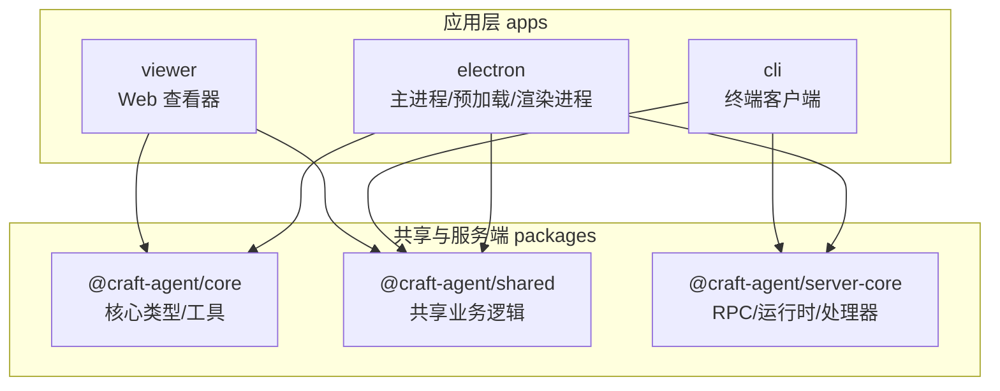
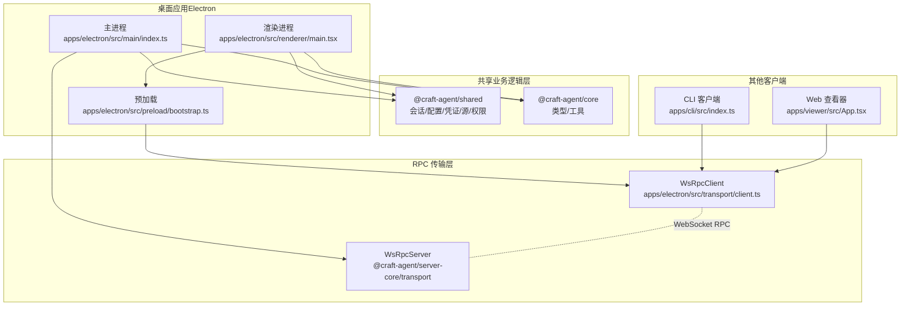
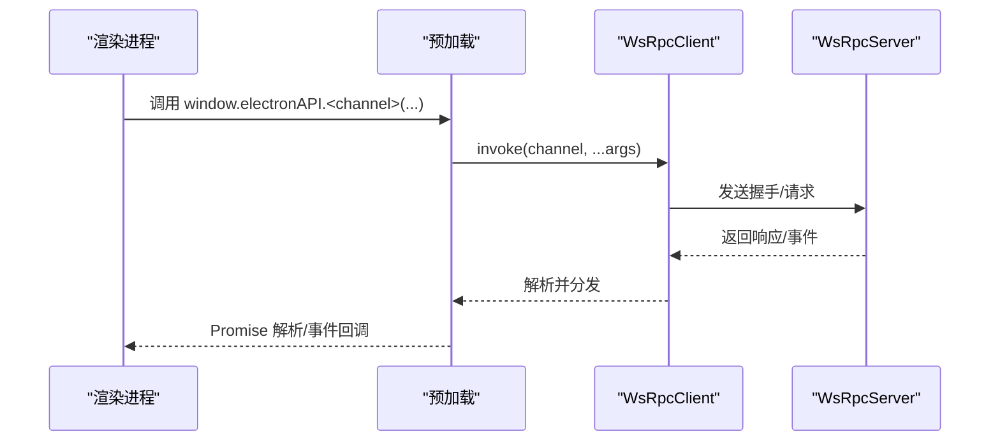
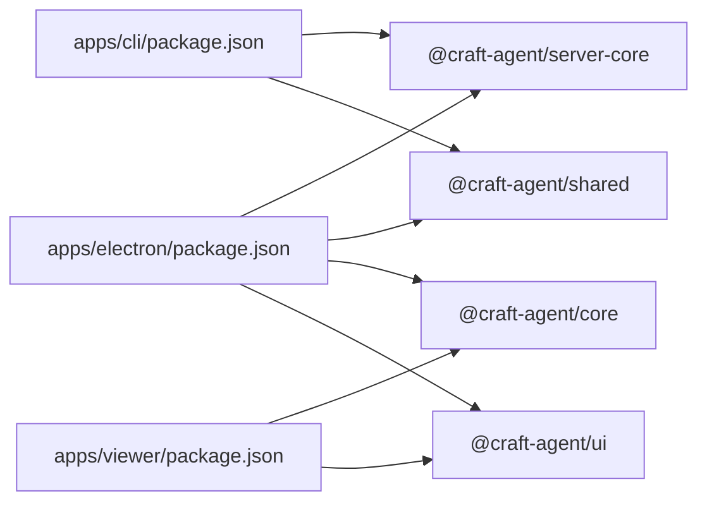

# 整体架构概览

<cite>
**本文档引用的文件**
- [README.md](file://README.md)
- [package.json](file://package.json)
- [apps/electron/package.json](file://apps/electron/package.json)
- [apps/cli/package.json](file://apps/cli/package.json)
- [apps/viewer/package.json](file://apps/viewer/package.json)
- [apps/electron/src/main/index.ts](file://apps/electron/src/main/index.ts)
- [apps/electron/src/renderer/main.tsx](file://apps/electron/src/renderer/main.tsx)
- [apps/electron/src/preload/bootstrap.ts](file://apps/electron/src/preload/bootstrap.ts)
- [apps/electron/src/transport/index.ts](file://apps/electron/src/transport/index.ts)
- [apps/electron/src/transport/client.ts](file://apps/electron/src/transport/client.ts)
- [apps/electron/src/transport/server.ts](file://apps/electron/src/transport/server.ts)
- [apps/electron/src/runtime/platform.ts](file://apps/electron/src/runtime/platform.ts)
- [packages/shared/src/index.ts](file://packages/shared/src/index.ts)
- [packages/core/src/index.ts](file://packages/core/src/index.ts)
- [packages/server-core/src/index.ts](file://packages/server-core/src/index.ts)
</cite>

## 目录

1. [引言](#引言)
2. [项目结构](#项目结构)
3. [核心组件](#核心组件)
4. [架构总览](#架构总览)
5. [详细组件分析](#详细组件分析)
6. [依赖分析](#依赖分析)
7. [性能考量](#性能考量)
8. [故障排查指南](#故障排查指南)
9. [结论](#结论)
10. [附录](#附录)

## 引言

本文件面向 Craft Agents 的整体架构概览，聚焦三层架构模式：Electron 主进程、渲染进程与共享业务逻辑层。文档阐述各层职责、边界划分与技术选型，并解释跨层通信机制（基于 WebSocket 的 RPC）、安全与性能优化策略。目标是帮助开发者与产品人员快速理解系统如何组织、如何扩展以及如何在多端（桌面、终端、Web 查看器）协同工作。

## 项目结构

项目采用 Monorepo 结构，核心模块分布如下：

- apps：应用层
  - electron：Electron 桌面应用（主进程、预加载、渲染进程）
  - cli：终端客户端
  - viewer：Web 查看器
- packages：共享与服务端核心
  - core：核心类型与工具
  - shared：共享业务逻辑（会话、配置、凭证、源管理等）
  - server-core：RPC 传输、运行时、处理器等服务端基础设施
  - 其他服务端包（如 server、pi-agent-server 等）

图表来源

- [package.json](file://package.json#L7-L11)
- [apps/electron/package.json](file://apps/electron/package.json#L39-L75)
- [apps/cli/package.json](file://apps/cli/package.json#L15-L18)
- [apps/viewer/package.json](file://apps/viewer/package.json#L13-L18)

章节来源

- [README.md](file://README.md#L343-L366)
- [package.json](file://package.json#L7-L11)

## 核心组件

- Electron 主进程（桌面应用）
  - 负责应用生命周期、窗口管理、系统菜单、自动更新、深链处理、通知、平台能力注入（图像处理、日志、错误上报）等。
  - 在本地模式下启动本地 WebSocket RPC 服务器；在远程模式下作为薄客户端连接远端服务器。
- 渲染进程（React UI）
  - 基于 Vite 构建，使用 React + shadcn/ui + TailwindCSS v4，提供聊天界面、侧边栏、设置、自动化等功能。
  - 初始化 Sentry 错误上报，提供崩溃兜底 UI。
- 预加载脚本（Preload）
  - 建立 WebSocket RPC 客户端，暴露受控的 window.electronAPI 给渲染进程。
  - 注册能力通道（如打开外部链接、文件对话框），实现主进程能力桥接。
- 共享业务逻辑层（packages/shared）
  - 提供会话持久化、配置存储、凭证加密、源管理（MCP/API/本地）、权限模型、主题与图标等。
- RPC 传输层（apps/electron/transport 与 server-core）
  - 基于 WebSocket 的 RPC 协议，支持握手、请求/响应、事件订阅、能力通道、自动重连与错误分类。

章节来源

- [apps/electron/src/main/index.ts](file://apps/electron/src/main/index.ts#L295-L738)
- [apps/electron/src/renderer/main.tsx](file://apps/electron/src/renderer/main.tsx#L1-L113)
- [apps/electron/src/preload/bootstrap.ts](file://apps/electron/src/preload/bootstrap.ts#L1-L314)
- [packages/shared/src/index.ts](file://packages/shared/src/index.ts#L1-L33)
- [apps/electron/src/transport/index.ts](file://apps/electron/src/transport/index.ts#L1-L6)
- [packages/server-core/src/index.ts](file://packages/server-core/src/index.ts#L1-L5)

## 架构总览

系统采用“桌面主进程 + 渲染进程 + 共享业务逻辑层”的三层架构，并通过 WebSocket RPC 实现跨层通信。主进程负责系统级能力与服务端逻辑（本地模式），渲染进程负责 UI 与用户交互，共享业务逻辑层提供可复用的领域能力。CLI 与 Web 查看器作为薄客户端，复用同一套共享逻辑并通过 RPC 连接到本地或远端服务器。

图表来源

- [apps/electron/src/main/index.ts](file://apps/electron/src/main/index.ts#L371-L415)
- [apps/electron/src/preload/bootstrap.ts](file://apps/electron/src/preload/bootstrap.ts#L32-L100)
- [apps/electron/src/transport/client.ts](file://apps/electron/src/transport/client.ts#L101-L151)
- [apps/electron/src/transport/server.ts](file://apps/electron/src/transport/server.ts#L1-L2)
- [apps/cli/package.json](file://apps/cli/package.json#L15-L18)
- [apps/viewer/package.json](file://apps/viewer/package.json#L13-L18)

## 详细组件分析

### 三层架构职责与边界

- 主进程（Electron）
  - 系统集成：窗口管理、菜单、深链、通知、自动更新、日志、错误上报、平台能力（图像处理、路径打开、日志文件路径）。
  - 服务端逻辑：本地模式下创建并监听本地 WebSocket RPC 服务器，注册 RPC 处理器，注入平台服务钩子。
  - 生命周期：应用初始化、首次运行默认工作区创建、窗口状态保存与恢复、退出前刷新会话写入与资源清理。
- 渲染进程（React）
  - UI 层：聊天界面、侧边栏、设置、自动化、主题切换、通知气泡等。
  - 错误处理：Sentry 初始化与错误边界兜底，控制台噪声过滤。
- 预加载（Preload）
  - 通信桥：建立 WsRpcClient，暴露受控 API（window.electronAPI），注册能力通道（打开外部链接、文件对话框等）。
  - OAuth 流程：本地回调服务器 + 服务端协作，完成多提供商 OAuth。
- 共享业务逻辑层（packages/shared）
  - 会话：持久化、状态管理、消息流。
  - 配置：全局与工作区配置、偏好设置、主题。
  - 凭证：加密存储（AES-256-GCM）。
  - 源：MCP、REST API、本地文件系统。
  - 权限：三档权限模式与规则。
  - 工具：图标、文档、发布说明等种子资源。

章节来源

- [apps/electron/src/main/index.ts](file://apps/electron/src/main/index.ts#L364-L738)
- [apps/electron/src/renderer/main.tsx](file://apps/electron/src/renderer/main.tsx#L23-L112)
- [apps/electron/src/preload/bootstrap.ts](file://apps/electron/src/preload/bootstrap.ts#L32-L100)
- [packages/shared/src/index.ts](file://packages/shared/src/index.ts#L1-L33)

### 跨层通信机制（WebSocket RPC）

- 通道映射与构建
  - 预加载通过 CHANNEL_MAP 与 buildClientApi 将 RPC 通道映射为调用代理，统一 invoke/on 接口。
- 连接与握手
  - 客户端发送握手包（协议版本、工作区 ID、webContentsId、令牌、能力列表）。
  - 服务端返回握手确认，携带已注册通道集合。
- 请求/响应与事件
  - invoke 返回 Promise；on 订阅事件；能力通道由服务端调用客户端能力。
- 自动重连与状态
  - 指数退避重连；连接状态变更事件；错误分类（认证、协议、超时、网络、服务器、未知）。
- 本地/远程模式
  - 本地模式：主进程内嵌 WS 服务器；远程模式：Thin Client 通过环境变量连接远端服务器，强制 TLS（非本地）。

图表来源

- [apps/electron/src/preload/bootstrap.ts](file://apps/electron/src/preload/bootstrap.ts#L102-L105)
- [apps/electron/src/transport/client.ts](file://apps/electron/src/transport/client.ts#L157-L183)
- [apps/electron/src/transport/server.ts](file://apps/electron/src/transport/server.ts#L1-L2)

章节来源

- [apps/electron/src/preload/bootstrap.ts](file://apps/electron/src/preload/bootstrap.ts#L32-L100)
- [apps/electron/src/transport/client.ts](file://apps/electron/src/transport/client.ts#L101-L229)

### 安全考虑

- OAuth 流程
  - 本地回调服务器接收授权码，服务端完成令牌交换与存储，避免凭据泄露到远端。
- 传输安全
  - 远程 Thin Client 强制 wss://（TLS），拒绝非本地 ws:// 明文连接。
- 凭证存储
  - 使用 AES-256-GCM 加密存储敏感信息。
- 深度清理
  - 主进程错误上报与面包屑中对敏感头与数据进行脱敏。
- 子进程隔离
  - 本地 MCP 服务器启动时过滤敏感环境变量，仅允许显式允许的变量透传。

章节来源

- [apps/electron/src/preload/bootstrap.ts](file://apps/electron/src/preload/bootstrap.ts#L167-L229)
- [apps/electron/src/main/index.ts](file://apps/electron/src/main/index.ts#L20-L59)
- [README.md](file://README.md#L625-L634)

### 性能优化策略

- 启动与热重载
  - 主进程早期加载 Shell 环境，确保工具可用；Vite 开发模式热更新渲染进程。
- 日志与调试
  - 开发模式启用调试与性能标记；打包后禁用冗余日志。
- 图像处理
  - 原生图像处理（缩放、格式转换），减少额外库依赖。
- 会话写入
  - 退出前刷新所有会话写入，保证数据一致性。
- 自动更新
  - 应用启动时检查更新，避免替换已安装应用导致的异常重启。

章节来源

- [apps/electron/src/main/index.ts](file://apps/electron/src/main/index.ts#L1-L14)
- [apps/electron/src/main/index.ts](file://apps/electron/src/main/index.ts#L105-L110)
- [apps/electron/src/main/index.ts](file://apps/electron/src/main/index.ts#L437-L496)
- [apps/electron/src/main/index.ts](file://apps/electron/src/main/index.ts#L777-L800)

## 依赖分析

- 技术栈与版本
  - 运行时：Bun
  - AI 后端：Claude Agent SDK、Pi SDK
  - 桌面：Electron + React
  - UI：shadcn/ui + Tailwind CSS v4
  - 构建：esbuild（主进程）+ Vite（渲染进程）
  - 凭证：AES-256-GCM 加密文件存储
- 包依赖关系
  - apps/electron 依赖 @craft-agent/server-core、@craft-agent/shared、@craft-agent/core、@craft-agent/ui
  - apps/cli 依赖 @craft-agent/shared、@craft-agent/server-core
  - apps/viewer 依赖 @craft-agent/core、@craft-agent/ui
  - packages/server-core 提供 transport/runtime/handlers 等基础设施

图表来源

- [apps/electron/package.json](file://apps/electron/package.json#L39-L75)
- [apps/cli/package.json](file://apps/cli/package.json#L15-L18)
- [apps/viewer/package.json](file://apps/viewer/package.json#L13-L18)

章节来源

- [README.md](file://README.md#L569-L580)
- [package.json](file://package.json#L108-L167)
- [apps/electron/package.json](file://apps/electron/package.json#L39-L75)
- [apps/cli/package.json](file://apps/cli/package.json#L15-L18)
- [apps/viewer/package.json](file://apps/viewer/package.json#L13-L18)

## 性能考量

- 构建与打包
  - 主进程使用 esbuild 快速打包，渲染进程使用 Vite，提升开发体验与构建速度。
- 传输层优化
  - WebSocket 自动重连与指数退避，降低网络抖动影响；通道可用性检查减少无效调用。
- 资源与缓存
  - 打包内置 CLI 工具与脚本，首次使用自动下载依赖并缓存，后续使用更快。
- UI 与渲染
  - React + Jotai 状态管理，按需渲染与主题切换，避免不必要的重绘。

## 故障排查指南

- 启动与日志
  - 开发模式可通过命令行参数启用调试日志；日志路径因平台而异。
- WebSocket 连接问题
  - 检查连接状态事件与错误分类；确认令牌与握手参数；远程连接必须使用 wss://。
- OAuth 失败
  - 确认本地回调服务器端口未被占用；检查服务端流程是否正确清理；查看控制台与主进程日志。
- 会话持久化
  - 退出前会刷新会话写入；若出现数据丢失，检查主进程退出流程与磁盘权限。

章节来源

- [README.md](file://README.md#L581-L606)
- [apps/electron/src/preload/bootstrap.ts](file://apps/electron/src/preload/bootstrap.ts#L121-L157)
- [apps/electron/src/transport/client.ts](file://apps/electron/src/transport/client.ts#L657-L676)

## 结论

Craft Agents 通过三层架构与 WebSocket RPC 实现了桌面、终端与 Web 场景的一致体验。主进程承担系统与服务端职责，渲染进程专注 UI 与交互，共享业务逻辑层提供可复用能力。该架构在安全性（OAuth、传输加密、凭证加密）、可维护性（Monorepo、清晰边界）与性能（快速构建、自动重连、原生图像处理）方面均具备良好平衡。未来可在协议演进、可观测性增强与跨平台打包上持续优化。

## 附录

- 架构决策与权衡
  - Electron：统一桌面体验、系统集成功能强、生态成熟。
  - React：组件化 UI、生态丰富、开发效率高。
  - TypeScript：类型安全、团队协作与长期维护。
  - WebSocket RPC：跨进程通信简洁、事件驱动、易于扩展。
- 远程薄客户端模式
  - 通过环境变量指定远端服务器地址与令牌，渲染进程仍保持一致 UI，业务逻辑在远端执行，适合多机访问与高性能计算场景。
