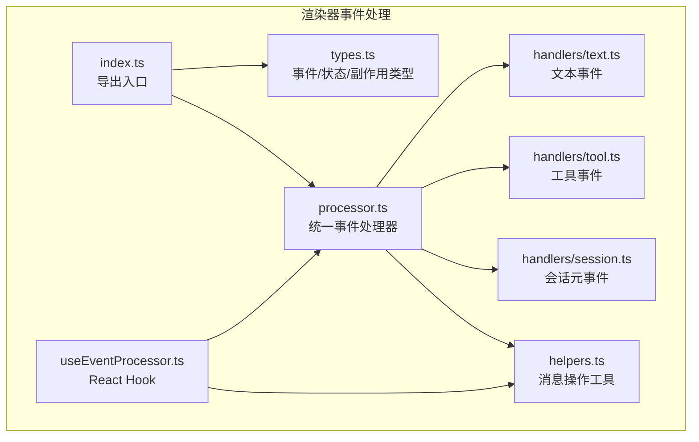
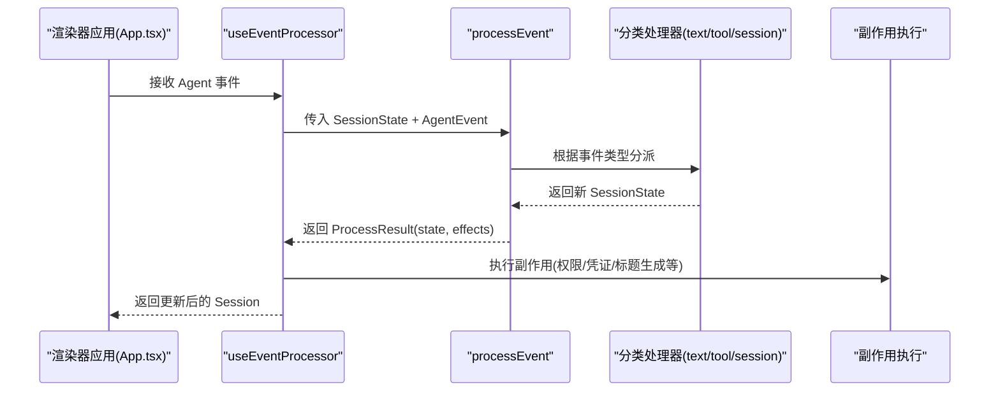
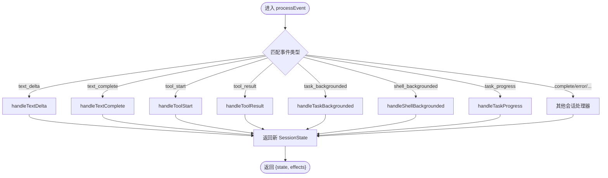
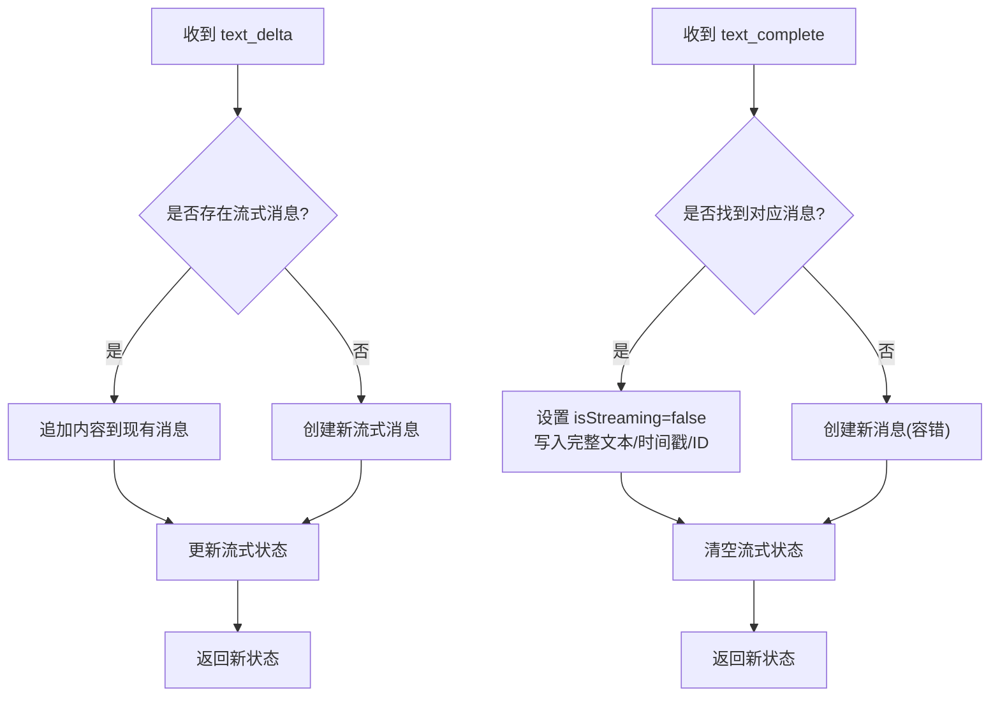
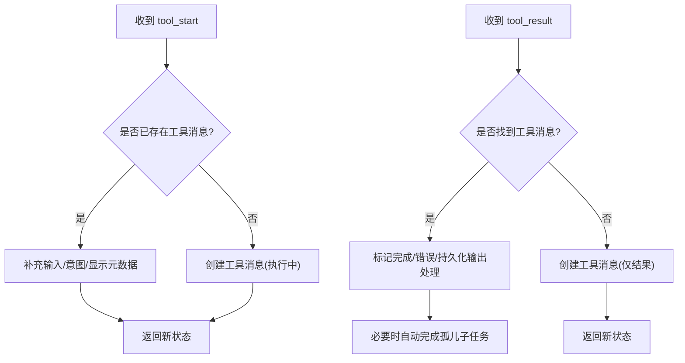
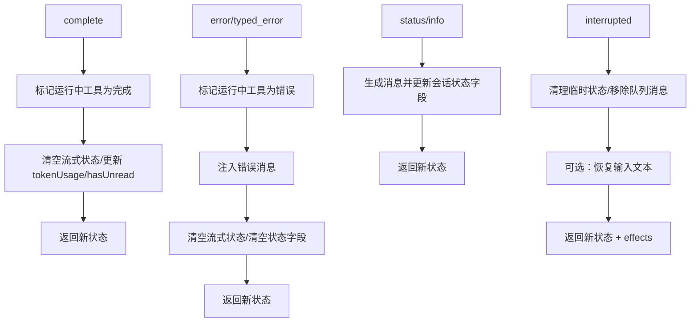
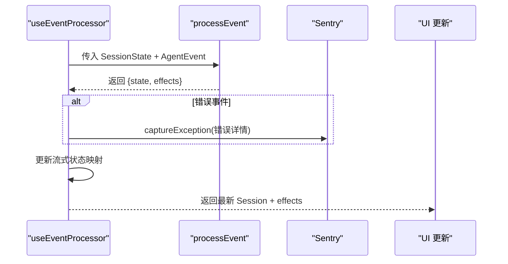
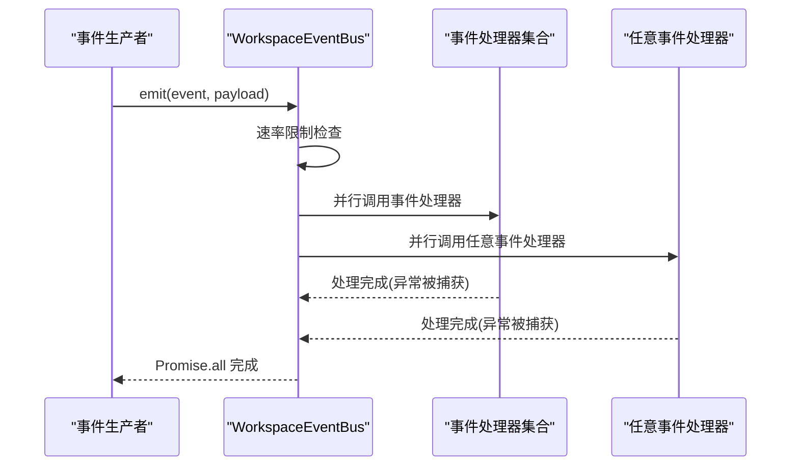
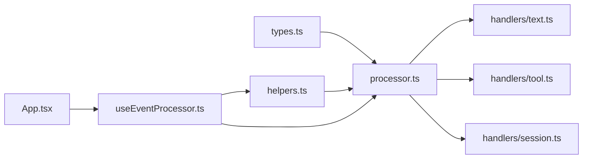

# 事件处理系统

<cite>
**本文引用的文件**
- [apps/electron/src/renderer/event-processor/index.ts](file://apps/electron/src/renderer/event-processor/index.ts)
- [apps/electron/src/renderer/event-processor/types.ts](file://apps/electron/src/renderer/event-processor/types.ts)
- [apps/electron/src/renderer/event-processor/processor.ts](file://apps/electron/src/renderer/event-processor/processor.ts)
- [apps/electron/src/renderer/event-processor/useEventProcessor.ts](file://apps/electron/src/renderer/event-processor/useEventProcessor.ts)
- [apps/electron/src/renderer/event-processor/helpers.ts](file://apps/electron/src/renderer/event-processor/helpers.ts)
- [apps/electron/src/renderer/event-processor/handlers/text.ts](file://apps/electron/src/renderer/event-processor/handlers/text.ts)
- [apps/electron/src/renderer/event-processor/handlers/tool.ts](file://apps/electron/src/renderer/event-processor/handlers/tool.ts)
- [apps/electron/src/renderer/event-processor/handlers/session.ts](file://apps/electron/src/renderer/event-processor/handlers/session.ts)
- [packages/shared/src/automations/event-bus.ts](file://packages/shared/src/automations/event-bus.ts)
- [apps/electron/src/renderer/App.tsx](file://apps/electron/src/renderer/App.tsx)
</cite>

## 目录

1. [简介](#简介)
2. [项目结构](#项目结构)
3. [核心组件](#核心组件)
4. [架构总览](#架构总览)
5. [详细组件分析](#详细组件分析)
6. [依赖关系分析](#依赖关系分析)
7. [性能考量](#性能考量)
8. [故障排查指南](#故障排查指南)
9. [结论](#结论)
10. [附录：示例与最佳实践](#附录示例与最佳实践)

## 简介

本文件系统性梳理 Craft Agents 的事件处理体系，覆盖两类事件通道：

- 渲染器侧会话事件处理器：统一处理来自代理的会话级事件（文本流式、工具调用、状态变更等），通过纯函数保证可预测的状态演进与可测试性。
- 工作区自动化事件总线：面向自动化子系统的事件总线，支持按事件类型注册/注销处理器、全局处理器、速率限制与一次性清理。

文档将从设计原理、事件类型定义、处理器注册与路由、上下文管理、性能优化、监控与调试等方面展开，并提供示例与最佳实践。

## 项目结构

渲染器事件处理模块采用“集中式处理器 + 分类处理器”的组织方式：

- 入口导出：统一导出处理器、类型与辅助函数，便于上层使用。
- 类型定义：集中定义会话状态、事件类型、副作用与处理结果。
- 处理器：单一纯函数根据事件类型分派到对应分类处理器。
- 分类处理器：按功能域拆分（文本、工具、会话元数据）。
- 辅助函数：消息查找、插入、更新与空会话创建等纯函数。
- Hook：在应用层集成事件处理，维护每会话的流式状态并上报错误。

图表来源

- [apps/electron/src/renderer/event-processor/index.ts](file://apps/electron/src/renderer/event-processor/index.ts#L1-L40)
- [apps/electron/src/renderer/event-processor/types.ts](file://apps/electron/src/renderer/event-processor/types.ts#L1-L501)
- [apps/electron/src/renderer/event-processor/processor.ts](file://apps/electron/src/renderer/event-processor/processor.ts#L1-L214)
- [apps/electron/src/renderer/event-processor/useEventProcessor.ts](file://apps/electron/src/renderer/event-processor/useEventProcessor.ts#L1-L131)
- [apps/electron/src/renderer/event-processor/helpers.ts](file://apps/electron/src/renderer/event-processor/helpers.ts#L1-L167)
- [apps/electron/src/renderer/event-processor/handlers/text.ts](file://apps/electron/src/renderer/event-processor/handlers/text.ts#L1-L145)
- [apps/electron/src/renderer/event-processor/handlers/tool.ts](file://apps/electron/src/renderer/event-processor/handlers/tool.ts#L1-L247)
- [apps/electron/src/renderer/event-processor/handlers/session.ts](file://apps/electron/src/renderer/event-processor/handlers/session.ts#L1-L874)

章节来源

- [apps/electron/src/renderer/event-processor/index.ts](file://apps/electron/src/renderer/event-processor/index.ts#L1-L40)
- [apps/electron/src/renderer/event-processor/types.ts](file://apps/electron/src/renderer/event-processor/types.ts#L1-L501)

## 核心组件

- 统一事件处理器：接收当前会话状态与事件，返回新状态与副作用列表，保证不可变更新与单一路由。
- 分类处理器：分别处理文本流式、工具执行、会话元信息与状态变更等事件，保持职责单一与可测试。
- Hook 集成：在应用层以 React Hook 形式消费事件，维护每会话的流式状态，捕获错误事件并上报。
- 消息工具：基于消息 ID 的查找与更新，避免位置依赖导致的竞态与不一致。
- 自动化事件总线：工作区粒度的事件总线，支持速率限制、任意事件处理器与一次性清理。

章节来源

- [apps/electron/src/renderer/event-processor/processor.ts](file://apps/electron/src/renderer/event-processor/processor.ts#L61-L213)
- [apps/electron/src/renderer/event-processor/useEventProcessor.ts](file://apps/electron/src/renderer/event-processor/useEventProcessor.ts#L78-L130)
- [apps/electron/src/renderer/event-processor/helpers.ts](file://apps/electron/src/renderer/event-processor/helpers.ts#L1-L167)
- [packages/shared/src/automations/event-bus.ts](file://packages/shared/src/automations/event-bus.ts#L161-L319)

## 架构总览

渲染器事件处理采用“纯函数 + 副作用分离”的架构：

- 输入：当前会话状态（会话 + 流式文本）与单一 Agent 事件。
- 处理：统一调度器根据事件类型分派至对应处理器；处理器内部仅做不可变状态更新。
- 输出：新的会话状态与副作用清单；副作用由 Hook 在纯函数之外执行（如权限请求、输入恢复等）。
- 错误：错误事件通过 Sentry 上报，确保错误捕获与纯处理逻辑解耦。

图表来源

- [apps/electron/src/renderer/App.tsx](file://apps/electron/src/renderer/App.tsx#L1-L200)
- [apps/electron/src/renderer/event-processor/useEventProcessor.ts](file://apps/electron/src/renderer/event-processor/useEventProcessor.ts#L82-L115)
- [apps/electron/src/renderer/event-processor/processor.ts](file://apps/electron/src/renderer/event-processor/processor.ts#L61-L213)
- [apps/electron/src/renderer/event-processor/handlers/text.ts](file://apps/electron/src/renderer/event-processor/handlers/text.ts#L24-L70)
- [apps/electron/src/renderer/event-processor/handlers/tool.ts](file://apps/electron/src/renderer/event-processor/handlers/tool.ts#L23-L66)
- [apps/electron/src/renderer/event-processor/handlers/session.ts](file://apps/electron/src/renderer/event-processor/handlers/session.ts#L52-L90)

## 详细组件分析

### 统一事件处理器（processEvent）

- 设计要点
  - 单一入口：所有 Agent 事件经由该函数进入，保证状态演进路径唯一。
  - 不可变更新：返回全新 SessionState 引用，避免共享引用导致的同步问题。
  - 分派清晰：按事件类型 switch 到对应处理器，便于扩展与维护。
- 实现模式
  - 同步处理：处理器均为纯函数，无异步副作用。
  - 批量处理：同一事件序列通过多次调用 processEvent 顺序处理，最终由上层合并副作用。
- 上下文管理
  - 事件状态传递：通过 SessionState 将会话与流式文本状态在处理器间传递。
  - 错误传播：错误事件由 Hook 捕获并上报 Sentry，不影响处理器的纯函数特性。
  - 超时处理：未在处理器内实现超时逻辑，超时控制由上游事件源或外部调度负责。

图表来源

- [apps/electron/src/renderer/event-processor/processor.ts](file://apps/electron/src/renderer/event-processor/processor.ts#L61-L213)

章节来源

- [apps/electron/src/renderer/event-processor/processor.ts](file://apps/electron/src/renderer/event-processor/processor.ts#L61-L213)

### 文本事件处理器（handleTextDelta / handleTextComplete）

- 设计要点
  - 流式累积：将增量文本写入流式状态与消息内容，避免位置依赖。
  - 容错与回退：若消息不存在，自动创建；若完成事件先于开始事件到达，亦能正确补全。
  - 时间戳与 ID：优先使用主进程提供的权威时间戳与消息 ID，确保重放顺序与分支一致性。
- 实现模式
  - 同步处理：纯函数，无异步 IO。
  - 批量处理：多个 text_delta 事件按序累积，最后以 text_complete 结束。
- 上下文管理
  - 事件状态传递：通过 StreamingState 与 SessionState 双通道传递。
  - 错误传播：未在处理器内处理，交由上层统一处理。
  - 超时处理：未内置超时，依赖外部机制保障消息完整性。

图表来源

- [apps/electron/src/renderer/event-processor/handlers/text.ts](file://apps/electron/src/renderer/event-processor/handlers/text.ts#L24-L144)

章节来源

- [apps/electron/src/renderer/event-processor/handlers/text.ts](file://apps/electron/src/renderer/event-processor/handlers/text.ts#L24-L144)

### 工具事件处理器（handleToolStart / handleToolResult / 后台任务）

- 设计要点
  - 双事件模型：SDK 发送两次工具事件（空输入与完整输入），处理器需兼容。
  - 容错与孤儿处理：当结果事件先于开始事件到达时，自动创建消息；父任务完成后自动完成孤儿子任务。
  - 后台任务：支持任务与 Shell 的后台执行标记与进度更新。
- 实现模式
  - 同步处理：纯函数，无异步副作用。
  - 批量处理：多工具并发执行，按工具 ID 对齐更新。
- 上下文管理
  - 事件状态传递：通过消息数组与工具 ID 关联，避免位置依赖。
  - 错误传播：错误检测与标记在处理器内完成，交由上层统一处理。
  - 超时处理：未内置超时，依赖外部任务轮询或取消机制。

图表来源

- [apps/electron/src/renderer/event-processor/handlers/tool.ts](file://apps/electron/src/renderer/event-processor/handlers/tool.ts#L23-L161)

章节来源

- [apps/electron/src/renderer/event-processor/handlers/tool.ts](file://apps/electron/src/renderer/event-processor/handlers/tool.ts#L23-L161)

### 会话元事件处理器（complete / error / typed_error / 权限/凭证/状态/分享等）

- 设计要点
  - 完整性保障：complete 时清理运行中工具；error/typed_error 时统一注入错误消息并清空流式状态。
  - 状态一致性：status/info 区分瞬时状态与持久消息；interrupted 时清理临时状态并可恢复输入。
  - 副作用提取：权限/凭证请求与模式变更等以 Effect 形式返回，由上层执行。
- 实现模式
  - 同步处理：纯函数，无异步副作用。
  - 批量处理：多事件顺序处理，Effect 合并执行。
- 上下文管理
  - 事件状态传递：通过 SessionState 与 Effect 双通道。
  - 错误传播：错误事件由 Hook 捕获并上报 Sentry。
  - 超时处理：未内置超时，依赖外部中断或重试机制。

图表来源

- [apps/electron/src/renderer/event-processor/handlers/session.ts](file://apps/electron/src/renderer/event-processor/handlers/session.ts#L52-L171)
- [apps/electron/src/renderer/event-processor/handlers/session.ts](file://apps/electron/src/renderer/event-processor/handlers/session.ts#L177-L207)
- [apps/electron/src/renderer/event-processor/handlers/session.ts](file://apps/electron/src/renderer/event-processor/handlers/session.ts#L263-L315)

章节来源

- [apps/electron/src/renderer/event-processor/handlers/session.ts](file://apps/electron/src/renderer/event-processor/handlers/session.ts#L52-L171)
- [apps/electron/src/renderer/event-processor/handlers/session.ts](file://apps/electron/src/renderer/event-processor/handlers/session.ts#L177-L207)
- [apps/electron/src/renderer/event-processor/handlers/session.ts](file://apps/electron/src/renderer/event-processor/handlers/session.ts#L263-L315)

### Hook 集成与副作用执行（useEventProcessor）

- 设计要点
  - 流式状态管理：每会话独立的流式状态映射，避免与 React 状态混用。
  - 副作用分离：纯处理器只返回副作用清单，实际副作用在 Hook 中执行。
  - 错误上报：对 error/typed_error 事件进行 Sentry 异常捕获，保留堆栈与标签。
- 实现模式
  - 同步处理：Hook 内部同步执行副作用。
  - 批量处理：多事件顺序处理，副作用合并执行。
- 上下文管理
  - 事件状态传递：通过 SessionState 与 Effect 双通道。
  - 错误传播：Sentry 上报，便于追踪与聚合。
  - 超时处理：未内置超时，依赖外部中断或重试机制。

图表来源

- [apps/electron/src/renderer/event-processor/useEventProcessor.ts](file://apps/electron/src/renderer/event-processor/useEventProcessor.ts#L21-L44)
- [apps/electron/src/renderer/event-processor/useEventProcessor.ts](file://apps/electron/src/renderer/event-processor/useEventProcessor.ts#L82-L115)

章节来源

- [apps/electron/src/renderer/event-processor/useEventProcessor.ts](file://apps/electron/src/renderer/event-processor/useEventProcessor.ts#L78-L130)

### 自动化事件总线（WorkspaceEventBus）

- 设计要点
  - 工作区隔离：每个工作区拥有独立事件总线实例，避免全局状态耦合。
  - 类型安全：事件与载荷类型映射明确，支持泛型事件载荷。
  - 速率限制：针对不同事件设置速率上限，防止事件风暴。
  - 动态注册：支持按事件类型注册/注销处理器与任意事件处理器。
- 实现模式
  - 同步处理：处理器同步执行；任意事件处理器用于日志/指标/调试。
  - 异步处理：emit 内部并行触发处理器，等待全部完成。
  - 批量处理：Promise.all 并发等待所有处理器完成。
- 上下文管理
  - 事件状态传递：通过载荷携带 workspaceId、sessionId 等上下文。
  - 错误传播：处理器异常被捕获并记录，不影响其他处理器执行。
  - 超时处理：未内置超时，可通过外部包装实现。

图表来源

- [packages/shared/src/automations/event-bus.ts](file://packages/shared/src/automations/event-bus.ts#L177-L228)

章节来源

- [packages/shared/src/automations/event-bus.ts](file://packages/shared/src/automations/event-bus.ts#L161-L319)

## 依赖关系分析

- 组件内聚与耦合
  - 统一处理器与分类处理器之间为单向依赖，内聚高、耦合低。
  - Hook 依赖处理器与辅助函数，但不反向依赖上层组件，利于测试。
  - 自动化事件总线与业务处理器解耦，通过事件名与载荷契约交互。
- 外部依赖
  - Sentry：用于错误事件的异常捕获与上报。
  - Jotai：用于会话状态原子化管理（在应用层使用）。
  - 主进程：提供权威时间戳与消息 ID，确保一致性。

图表来源

- [apps/electron/src/renderer/event-processor/types.ts](file://apps/electron/src/renderer/event-processor/types.ts#L1-L501)
- [apps/electron/src/renderer/event-processor/processor.ts](file://apps/electron/src/renderer/event-processor/processor.ts#L1-L214)
- [apps/electron/src/renderer/event-processor/helpers.ts](file://apps/electron/src/renderer/event-processor/helpers.ts#L1-L167)
- [apps/electron/src/renderer/event-processor/handlers/text.ts](file://apps/electron/src/renderer/event-processor/handlers/text.ts#L1-L145)
- [apps/electron/src/renderer/event-processor/handlers/tool.ts](file://apps/electron/src/renderer/event-processor/handlers/tool.ts#L1-L247)
- [apps/electron/src/renderer/event-processor/handlers/session.ts](file://apps/electron/src/renderer/event-processor/handlers/session.ts#L1-L874)
- [apps/electron/src/renderer/App.tsx](file://apps/electron/src/renderer/App.tsx#L1-L200)

章节来源

- [apps/electron/src/renderer/App.tsx](file://apps/electron/src/renderer/App.tsx#L1-L200)

## 性能考量

- 事件队列管理
  - 渲染器侧：事件按序进入统一处理器，处理器内部无阻塞 IO，适合高吞吐场景。
  - 自动化事件总线：emit 并行触发处理器，Promise.all 等待完成，适合处理器数量可控的场景。
- 并发控制
  - 渲染器侧：单会话单处理器调用，避免竞态；多会话可并行处理。
  - 自动化事件总线：默认并行，可通过速率限制减少抖动。
- 背压处理
  - 未见显式背压策略；建议在上游引入节流/去抖或限速队列。
- 内存与引用
  - 不可变更新：每次返回新引用，有利于响应式框架高效更新。
  - 流式状态：仅在 Hook 内存映射中保存，避免冗余持久化。

[本节为通用性能讨论，无需特定文件引用]

## 故障排查指南

- 日志与追踪
  - 渲染器侧：处理器与 Hook 内部有调试日志与 Sentry 异常捕获，便于定位错误事件。
  - 自动化事件总线：emit 前后有日志与速率限制告警，便于发现事件风暴。
- 常见问题
  - 文本完成事件早于开始事件：文本处理器具备容错，自动创建消息并补全。
  - 工具结果事件缺失：父任务完成后自动完成孤儿子任务，减少悬挂状态。
  - 权限/凭证请求：以 Effect 形式返回，上层需正确执行相应 UI 或流程。
- 调试技巧
  - 使用 getStreamingState 获取当前流式状态，辅助验证文本累积与完成时机。
  - 使用 getHandlerCount 查看事件总线处理器数量，辅助诊断泄漏或重复注册。

章节来源

- [apps/electron/src/renderer/event-processor/useEventProcessor.ts](file://apps/electron/src/renderer/event-processor/useEventProcessor.ts#L121-L123)
- [packages/shared/src/automations/event-bus.ts](file://packages/shared/src/automations/event-bus.ts#L192-L196)

## 结论

Craft Agents 的事件处理系统通过“统一处理器 + 分类处理器 + 副作用分离”的设计，在保证可预测性与可测试性的同时，提供了良好的扩展性与可观测性。渲染器侧以纯函数为核心，结合 Hook 进行副作用执行与错误上报；自动化侧以事件总线为核心，提供速率限制与动态注册能力。整体架构清晰、职责分明，适合在复杂会话与自动化场景中稳定演进。

[本节为总结性内容，无需特定文件引用]

## 附录：示例与最佳实践

- 示例：文本事件处理
  - 场景：连续 text_delta 事件与最终 text_complete 事件。
  - 步骤：处理器累积增量内容，完成时替换为完整文本并清除流式状态。
  - 参考路径：[apps/electron/src/renderer/event-processor/handlers/text.ts](file://apps/electron/src/renderer/event-processor/handlers/text.ts#L24-L144)
- 示例：工具事件处理
  - 场景：工具开始与结果事件，含后台任务与进度更新。
  - 步骤：先创建/更新工具消息，再标记完成/错误；必要时自动完成孤儿子任务。
  - 参考路径：[apps/electron/src/renderer/event-processor/handlers/tool.ts](file://apps/electron/src/renderer/event-processor/handlers/tool.ts#L23-L161)
- 示例：会话元事件处理
  - 场景：complete、error、interrupted、权限/凭证请求等。
  - 步骤：清理临时状态、注入消息、返回副作用；错误事件统一上报 Sentry。
  - 参考路径：[apps/electron/src/renderer/event-processor/handlers/session.ts](file://apps/electron/src/renderer/event-processor/handlers/session.ts#L52-L171), [apps/electron/src/renderer/event-processor/useEventProcessor.ts](file://apps/electron/src/renderer/event-processor/useEventProcessor.ts#L21-L44)
- 最佳实践
  - 保持处理器纯函数，副作用统一在 Hook 层执行。
  - 使用消息 ID 与时间戳，避免位置依赖引发的竞态。
  - 对高频事件启用速率限制，防止事件风暴。
  - 明确事件边界与载荷契约，便于扩展与维护。

[本节为示例与最佳实践汇总，无需特定文件引用]
