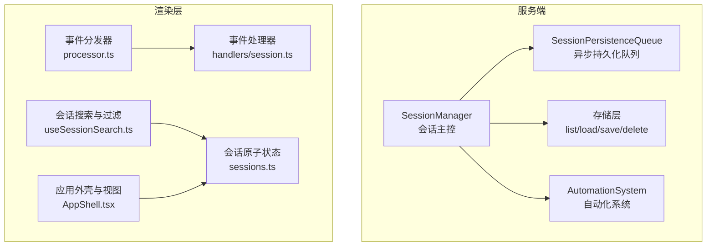
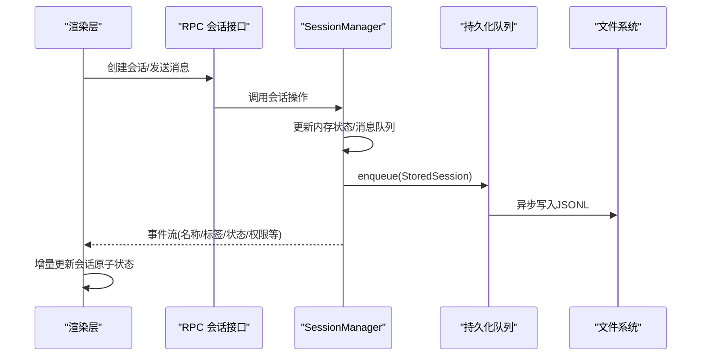
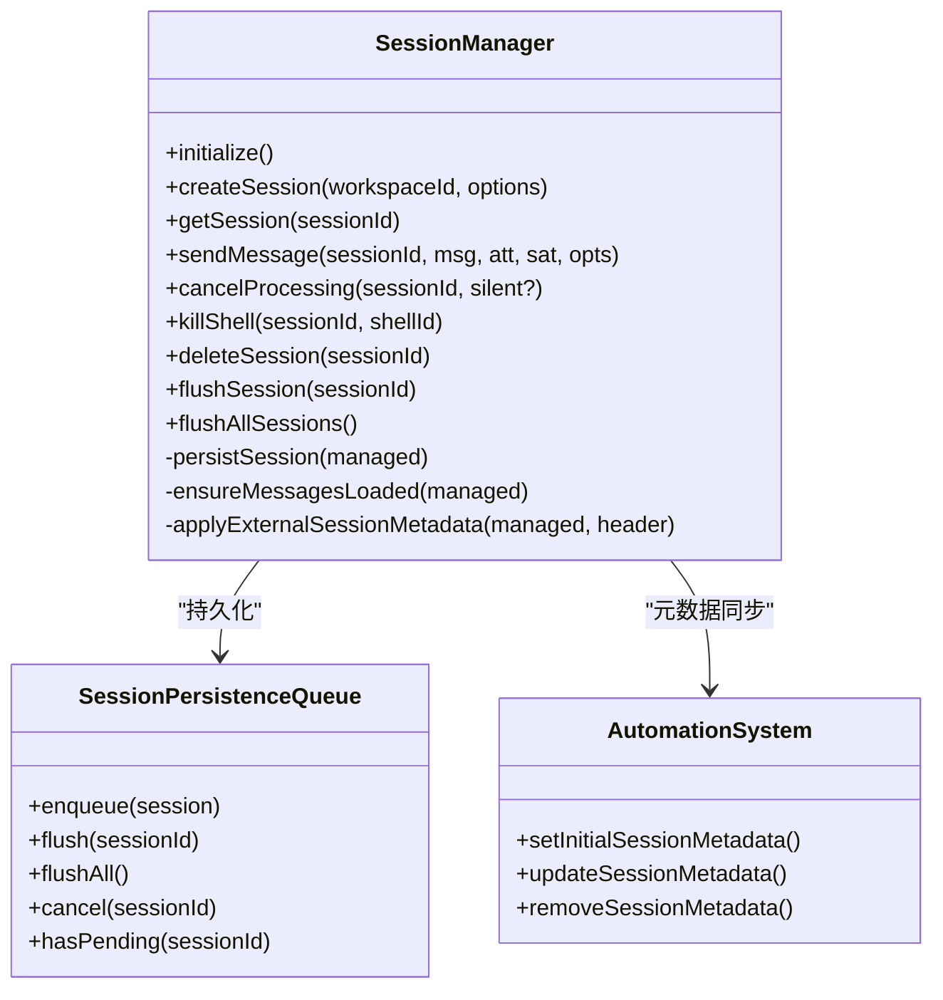
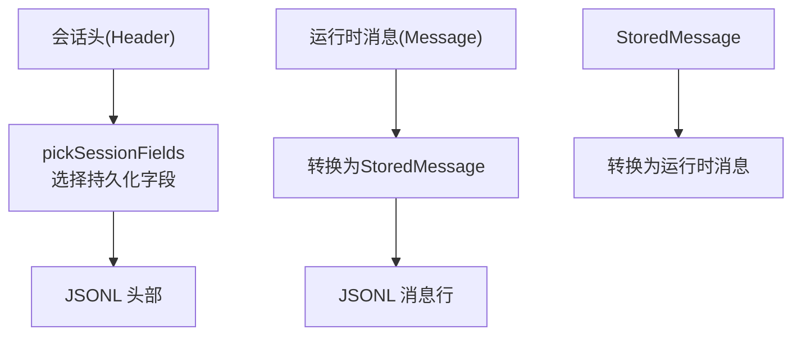
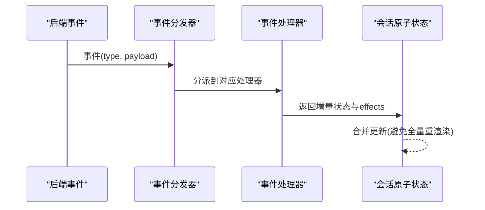
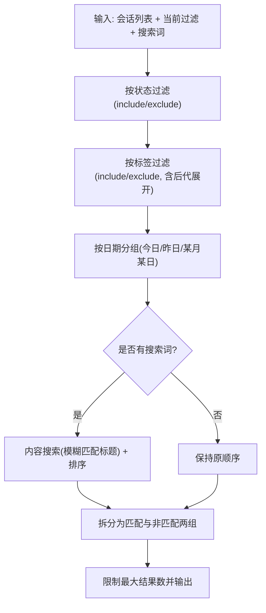
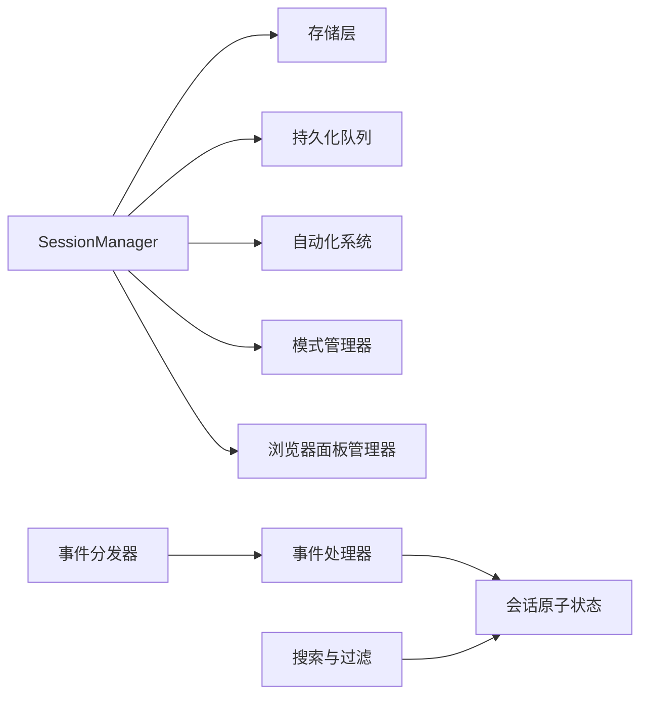

# 会话管理系统

<cite>
**本文引用的文件**
- [packages/server-core/src/sessions/SessionManager.ts](file://packages/server-core/src/sessions/SessionManager.ts)
- [packages/shared/src/sessions/persistence-queue.ts](file://packages/shared/src/sessions/persistence-queue.ts)
- [packages/shared/src/sessions/storage.ts](file://packages/shared/src/sessions/storage.ts)
- [packages/shared/src/sessions/utils.ts](file://packages/shared/src/sessions/utils.ts)
- [packages/shared/src/agent/core/session-lifecycle.ts](file://packages/shared/src/agent/core/session-lifecycle.ts)
- [packages/shared/src/agent/mode-manager.ts](file://packages/shared/src/agent/mode-manager.ts)
- [apps/electron/src/renderer/event-processor/handlers/session.ts](file://apps/electron/src/renderer/event-processor/handlers/session.ts)
- [apps/electron/src/renderer/event-processor/processor.ts](file://apps/electron/src/renderer/event-processor/processor.ts)
- [apps/electron/src/renderer/hooks/useSessionSearch.ts](file://apps/electron/src/renderer/hooks/useSessionSearch.ts)
- [apps/electron/src/renderer/atoms/sessions.ts](file://apps/electron/src/renderer/atoms/sessions.ts)
- [apps/electron/src/main/__tests__/session-branch-cleanup.test.ts](file://apps/electron/src/main/__tests__/session-branch-cleanup.test.ts)
- [apps/electron/src/main/__tests__/browser-pane-manager.test.ts](file://apps/electron/src/main/__tests__/browser-pane-manager.test.ts)
- [apps/electron/src/renderer/components/app-shell/AppShell.tsx](file://apps/electron/src/renderer/components/app-shell/AppShell.tsx)
- [packages/shared/src/automations/automation-system.ts](file://packages/shared/src/automations/automation-system.ts)
- [packages/server-core/src/handlers/rpc/sessions.ts](file://packages/server-core/src/handlers/rpc/sessions.ts)
</cite>

## 目录

1. [简介](#简介)
2. [项目结构](#项目结构)
3. [核心组件](#核心组件)
4. [架构总览](#架构总览)
5. [详细组件分析](#详细组件分析)
6. [依赖关系分析](#依赖关系分析)
7. [性能考量](#性能考量)
8. [故障排查指南](#故障排查指南)
9. [结论](#结论)
10. [附录](#附录)

## 简介

本文件系统性地文档化 Craft Agents 的会话管理系统，覆盖会话生命周期管理（创建、更新、删除、持久化）、SessionManager 实现原理（状态跟踪、事件处理、内存管理与资源清理）、会话数据结构与消息格式、状态转换规则、会话搜索与过滤（标签系统、状态筛选、时间范围查询）等。同时提供最佳实践（性能优化、并发控制、错误恢复策略），并给出可直接定位到源码路径的示例与使用模式。

## 项目结构

会话管理横跨服务端与渲染层：

- 服务端：由 SessionManager 统一编排，负责会话创建、消息处理、持久化、外部元数据同步、权限与认证、自动化系统集成、浏览器面板绑定等。
- 渲染层：负责 UI 原子状态、事件处理器、搜索与过滤逻辑、增量 UI 更新等。

图表来源

- [packages/server-core/src/sessions/SessionManager.ts](file://packages/server-core/src/sessions/SessionManager.ts#L834-L1200)
- [packages/shared/src/sessions/persistence-queue.ts](file://packages/shared/src/sessions/persistence-queue.ts#L59-L229)
- [apps/electron/src/renderer/event-processor/processor.ts](file://apps/electron/src/renderer/event-processor/processor.ts#L149-L213)
- [apps/electron/src/renderer/hooks/useSessionSearch.ts](file://apps/electron/src/renderer/hooks/useSessionSearch.ts#L1-L379)
- [apps/electron/src/renderer/atoms/sessions.ts](file://apps/electron/src/renderer/atoms/sessions.ts#L187-L223)

章节来源

- [packages/server-core/src/sessions/SessionManager.ts](file://packages/server-core/src/sessions/SessionManager.ts#L834-L1200)
- [packages/shared/src/sessions/persistence-queue.ts](file://packages/shared/src/sessions/persistence-queue.ts#L59-L229)
- [apps/electron/src/renderer/event-processor/processor.ts](file://apps/electron/src/renderer/event-processor/processor.ts#L149-L213)
- [apps/electron/src/renderer/hooks/useSessionSearch.ts](file://apps/electron/src/renderer/hooks/useSessionSearch.ts#L1-L379)
- [apps/electron/src/renderer/atoms/sessions.ts](file://apps/electron/src/renderer/atoms/sessions.ts#L187-L223)

## 核心组件

- SessionManager：会话生命周期与运行时主控，负责创建、消息发送、外部元数据同步、持久化、权限与认证、自动化系统集成、浏览器面板绑定、资源清理等。
- SessionPersistenceQueue：异步、去抖动、序列化的会话持久化队列，避免主线程阻塞与竞态。
- 事件处理器与分发器：将后端事件映射为 UI 状态变更，支持增量更新与批处理。
- 搜索与过滤：基于标题、内容、标签、状态、时间分组的组合过滤与排序。
- 会话原子状态：渲染层的细粒度状态管理，避免全量重渲染。

章节来源

- [packages/server-core/src/sessions/SessionManager.ts](file://packages/server-core/src/sessions/SessionManager.ts#L834-L1200)
- [packages/shared/src/sessions/persistence-queue.ts](file://packages/shared/src/sessions/persistence-queue.ts#L59-L229)
- [apps/electron/src/renderer/event-processor/handlers/session.ts](file://apps/electron/src/renderer/event-processor/handlers/session.ts#L191-L696)
- [apps/electron/src/renderer/hooks/useSessionSearch.ts](file://apps/electron/src/renderer/hooks/useSessionSearch.ts#L1-L379)
- [apps/electron/src/renderer/atoms/sessions.ts](file://apps/electron/src/renderer/atoms/sessions.ts#L187-L223)

## 架构总览

会话从“创建”到“持久化”的关键流程如下：

图表来源

- [packages/server-core/src/handlers/rpc/sessions.ts](file://packages/server-core/src/handlers/rpc/sessions.ts#L167-L194)
- [packages/server-core/src/sessions/SessionManager.ts](file://packages/server-core/src/sessions/SessionManager.ts#L1444-L1482)
- [packages/shared/src/sessions/persistence-queue.ts](file://packages/shared/src/sessions/persistence-queue.ts#L73-L187)
- [packages/shared/src/sessions/storage.ts](file://packages/shared/src/sessions/storage.ts#L305-L335)

## 详细组件分析

### SessionManager：会话生命周期与运行时主控

- 会话创建
  - 支持从工作区默认配置、连接/模型/思维层级/默认启用源等初始化。
  - 分支会话校验与预检，确保提供方一致、消息存在且路径正确。
  - 预创建阶段即初始化权限模式与自动化元数据快照，避免 UI 与执行之间的竞态。
- 消息发送与处理
  - 懒加载消息：首次访问才从磁盘加载，减少内存占用；并发加载通过 Promise 去重。
  - 消息队列：处理“处理中”时的新消息，采用中断与排队策略，保证一致性。
  - 权限与认证：统一的权限模式管理与认证请求处理，支持 OAuth 令牌刷新与桥接更新。
- 外部元数据同步
  - 监听磁盘上 JSONL 头部变化，延迟到处理空闲时应用，避免覆盖本地修改。
  - 自动化系统参与元数据差异计算与事件广播。
- 持久化与清理
  - 使用去抖动与序列化写入，避免竞态与阻塞；支持立即刷新与全部刷新。
  - 删除会话时清理代理、池服务器、自动化元数据、磁盘文件，并广播删除事件。
- 资源清理
  - 关闭时清理计时器、权限请求、记住窗口、工具回调等，防止内存泄漏。

图表来源

- [packages/server-core/src/sessions/SessionManager.ts](file://packages/server-core/src/sessions/SessionManager.ts#L834-L1200)
- [packages/shared/src/sessions/persistence-queue.ts](file://packages/shared/src/sessions/persistence-queue.ts#L59-L229)
- [packages/shared/src/automations/automation-system.ts](file://packages/shared/src/automations/automation-system.ts#L321-L347)

章节来源

- [packages/server-core/src/sessions/SessionManager.ts](file://packages/server-core/src/sessions/SessionManager.ts#L1353-L1482)
- [packages/server-core/src/sessions/SessionManager.ts](file://packages/server-core/src/sessions/SessionManager.ts#L1780-L1864)
- [packages/server-core/src/sessions/SessionManager.ts](file://packages/server-core/src/sessions/SessionManager.ts#L3873-L3902)
- [packages/shared/src/sessions/persistence-queue.ts](file://packages/shared/src/sessions/persistence-queue.ts#L59-L229)
- [packages/shared/src/automations/automation-system.ts](file://packages/shared/src/automations/automation-system.ts#L321-L347)

### 会话数据结构与消息格式

- 会话头（Header）
  - 包含名称、标签、是否加旗、会话状态、权限模式、最后已读消息 ID、是否未读等。
  - 仅持久化白名单字段，通过 pickSessionFields 保证新字段自动传播。
- 存储消息（StoredMessage）
  - 角色(role)/类型(type)映射、时间戳、附件等；中间态消息不持久化。
- 运行时消息（Message）
  - 增加 isQueued/isPending/isIntermediate 等运行时标记；与存储消息双向转换。
- 会话对象（Session）
  - 仅元数据（不含消息）用于列表展示；按最后消息时间倒序。

图表来源

- [packages/shared/src/sessions/utils.ts](file://packages/shared/src/sessions/utils.ts#L15-L25)
- [packages/server-core/src/sessions/SessionManager.ts](file://packages/server-core/src/sessions/SessionManager.ts#L813-L824)
- [packages/shared/src/sessions/storage.ts](file://packages/shared/src/sessions/storage.ts#L305-L335)

章节来源

- [packages/shared/src/sessions/utils.ts](file://packages/shared/src/sessions/utils.ts#L15-L25)
- [packages/server-core/src/sessions/SessionManager.ts](file://packages/server-core/src/sessions/SessionManager.ts#L813-L824)
- [packages/shared/src/sessions/storage.ts](file://packages/shared/src/sessions/storage.ts#L305-L335)

### 事件处理与状态转换

- 后端事件到 UI 状态的映射
  - 名称变更、标签变更、会话状态变更、加旗/取消、归档/取消归档、权限请求、认证请求/完成等。
- 事件处理器
  - 将事件转换为增量状态更新，支持“当前状态”与“流式状态”两路输出。
- 事件分发器
  - 对未知事件返回新引用以触发订阅更新，确保 UI 同步。

图表来源

- [apps/electron/src/renderer/event-processor/processor.ts](file://apps/electron/src/renderer/event-processor/processor.ts#L149-L213)
- [apps/electron/src/renderer/event-processor/handlers/session.ts](file://apps/electron/src/renderer/event-processor/handlers/session.ts#L191-L696)
- [apps/electron/src/renderer/atoms/sessions.ts](file://apps/electron/src/renderer/atoms/sessions.ts#L210-L223)

章节来源

- [apps/electron/src/renderer/event-processor/processor.ts](file://apps/electron/src/renderer/event-processor/processor.ts#L149-L213)
- [apps/electron/src/renderer/event-processor/handlers/session.ts](file://apps/electron/src/renderer/event-processor/handlers/session.ts#L191-L696)
- [apps/electron/src/renderer/atoms/sessions.ts](file://apps/electron/src/renderer/atoms/sessions.ts#L210-L223)

### 会话搜索与过滤

- 过滤维度
  - 当前视图状态过滤（include/exclude）
  - 标签过滤（include/exclude，支持后代展开）
  - 时间分组（今日/昨日/某月某日）
  - 内容搜索（模糊匹配标题，按匹配数与分数排序）
- 结果分组
  - 匹配当前过滤条件与非匹配结果分离，限制最大返回数量。
- 视图级状态
  - 状态过滤与标签过滤以 Map<SessionStatusId, FilterMode> 和 Map<string, FilterMode> 表示，支持仅在当前视图生效。

图表来源

- [apps/electron/src/renderer/hooks/useSessionSearch.ts](file://apps/electron/src/renderer/hooks/useSessionSearch.ts#L126-L379)
- [apps/electron/src/renderer/components/app-shell/AppShell.tsx](file://apps/electron/src/renderer/components/app-shell/AppShell.tsx#L642-L681)
- [apps/electron/src/renderer/components/app-shell/AppShell.tsx](file://apps/electron/src/renderer/components/app-shell/AppShell.tsx#L1450-L1494)

章节来源

- [apps/electron/src/renderer/hooks/useSessionSearch.ts](file://apps/electron/src/renderer/hooks/useSessionSearch.ts#L126-L379)
- [apps/electron/src/renderer/components/app-shell/AppShell.tsx](file://apps/electron/src/renderer/components/app-shell/AppShell.tsx#L642-L681)
- [apps/electron/src/renderer/components/app-shell/AppShell.tsx](file://apps/electron/src/renderer/components/app-shell/AppShell.tsx#L1450-L1494)

### SessionLifecycleManager：会话生命周期与清理

- 生命周期指标
  - 活跃状态、消息计数、开始/最近活动时间、是否收到过助手内容。
- 中止原因管理
  - 记录与消费中止原因；在“首条消息且未收到内容”时指示应清空会话。
- 回调通知
  - 消息完成或首次收到内容时触发 onStateChange。

章节来源

- [packages/shared/src/agent/core/session-lifecycle.ts](file://packages/shared/src/agent/core/session-lifecycle.ts#L45-L253)

### 权限模式与模式管理

- 模式管理器
  - 为每个会话维护状态、回调与订阅集合；提供注册/注销与清理。
- 会话级权限模式
  - 通过 setPermissionMode/hydratePreviousPermissionMode 初始化与恢复；与自动化系统联动。

章节来源

- [packages/shared/src/agent/mode-manager.ts](file://packages/shared/src/agent/mode-manager.ts#L311-L356)
- [packages/server-core/src/sessions/SessionManager.ts](file://packages/server-core/src/sessions/SessionManager.ts#L1412-L1431)

### 删除与回滚（分支失败场景）

- 最佳努力删除：即使运行时销毁/停止抛错，仍尽力清理运行时与存储。
- 分支创建预检失败时回滚：删除运行时会话与磁盘文件，确保一致性。

章节来源

- [apps/electron/src/main/**tests**/session-branch-cleanup.test.ts](file://apps/electron/src/main/__tests__/session-branch-cleanup.test.ts#L44-L101)
- [packages/server-core/src/sessions/SessionManager.ts](file://packages/server-core/src/sessions/SessionManager.ts#L2100-L2114)

## 依赖关系分析

- SessionManager 依赖
  - 存储层：list/load/save/create/delete/pickSessionFields
  - 持久化队列：去抖动与序列化写入
  - 自动化系统：元数据快照与差异计算
  - 模式管理器：权限模式初始化与订阅
  - 浏览器面板管理器：会话绑定与实例解析
- 渲染层依赖
  - 事件处理器：将后端事件映射为 UI 状态
  - 会话原子状态：细粒度更新，避免全量重渲染
  - 搜索与过滤：组合过滤与排序

图表来源

- [packages/server-core/src/sessions/SessionManager.ts](file://packages/server-core/src/sessions/SessionManager.ts#L834-L1200)
- [packages/shared/src/sessions/storage.ts](file://packages/shared/src/sessions/storage.ts#L305-L335)
- [packages/shared/src/sessions/persistence-queue.ts](file://packages/shared/src/sessions/persistence-queue.ts#L59-L229)
- [packages/shared/src/automations/automation-system.ts](file://packages/shared/src/automations/automation-system.ts#L321-L347)
- [apps/electron/src/renderer/event-processor/processor.ts](file://apps/electron/src/renderer/event-processor/processor.ts#L149-L213)
- [apps/electron/src/renderer/atoms/sessions.ts](file://apps/electron/src/renderer/atoms/sessions.ts#L187-L223)

章节来源

- [packages/server-core/src/sessions/SessionManager.ts](file://packages/server-core/src/sessions/SessionManager.ts#L834-L1200)
- [apps/electron/src/renderer/event-processor/processor.ts](file://apps/electron/src/renderer/event-processor/processor.ts#L149-L213)
- [apps/electron/src/renderer/atoms/sessions.ts](file://apps/electron/src/renderer/atoms/sessions.ts#L187-L223)

## 性能考量

- 懒加载与去重
  - 消息懒加载与 Promise 去重，避免并发重复 IO。
- 增量 UI 更新
  - 事件处理器返回增量状态，配合会话原子状态避免全量重渲染。
- 批量与去抖动
  - 事件批处理（每 50ms 刷新一次）与持久化队列去抖动，降低 IPC 与磁盘压力。
- 图像压缩
  - 发送前对图片进行压缩，减少历史记录体积与传输开销。
- 性能监控
  - 渲染层提供会话切换耗时统计与近期指标，便于分析与优化。

章节来源

- [packages/server-core/src/sessions/SessionManager.ts](file://packages/server-core/src/sessions/SessionManager.ts#L826-L838)
- [packages/server-core/src/sessions/SessionManager.ts](file://packages/server-core/src/sessions/SessionManager.ts#L1796-L1813)
- [apps/electron/src/renderer/atoms/sessions.ts](file://apps/electron/src/renderer/atoms/sessions.ts#L210-L223)
- [apps/electron/src/renderer/lib/perf.ts](file://apps/electron/src/renderer/lib/perf.ts#L93-L150)

## 故障排查指南

- 会话创建失败（分支）
  - 检查提供方/模型/PI 认证提供者是否一致；检查消息 ID 是否存在于源会话。
  - 若预检失败，查看回滚逻辑是否成功清理运行时与磁盘。
- 持久化异常
  - 查看持久化队列 pending 与 lastWrittenHeaderSignature；必要时调用 flushAll。
- 外部元数据不同步
  - 确认 isProcessing 状态；若正在处理，等待处理结束再应用外部变更。
- 权限与认证问题
  - 检查权限模式初始化与自动化系统元数据；确认 OAuth 刷新与桥接更新是否成功。
- 资源泄漏
  - 关闭时检查计时器、权限请求、记住窗口、工具回调是否清理。

章节来源

- [apps/electron/src/main/**tests**/session-branch-cleanup.test.ts](file://apps/electron/src/main/__tests__/session-branch-cleanup.test.ts#L44-L101)
- [packages/shared/src/sessions/persistence-queue.ts](file://packages/shared/src/sessions/persistence-queue.ts#L192-L200)
- [packages/server-core/src/sessions/SessionManager.ts](file://packages/server-core/src/sessions/SessionManager.ts#L1121-L1132)
- [packages/server-core/src/sessions/SessionManager.ts](file://packages/server-core/src/sessions/SessionManager.ts#L5825-L5855)

## 结论

Craft Agents 的会话管理系统通过 SessionManager 将“创建—处理—持久化—清理”完整串联，结合异步持久化队列、事件驱动的 UI 更新、完善的搜索与过滤能力，实现了高性能、可观测、可扩展的会话体验。遵循本文最佳实践与使用模式，可在复杂场景下保持稳定性与一致性。

## 附录

- 使用模式参考
  - 创建会话：[packages/server-core/src/sessions/SessionManager.ts](file://packages/server-core/src/sessions/SessionManager.ts#L1875-L2138)
  - 发送消息：[packages/server-core/src/handlers/rpc/sessions.ts](file://packages/server-core/src/handlers/rpc/sessions.ts#L167-L194)
  - 持久化写入：[packages/shared/src/sessions/storage.ts](file://packages/shared/src/sessions/storage.ts#L305-L308)
  - 事件映射与增量更新：[apps/electron/src/renderer/event-processor/handlers/session.ts](file://apps/electron/src/renderer/event-processor/handlers/session.ts#L191-L696)
  - 搜索与过滤：[apps/electron/src/renderer/hooks/useSessionSearch.ts](file://apps/electron/src/renderer/hooks/useSessionSearch.ts#L126-L379)
  - 会话原子状态更新：[apps/electron/src/renderer/atoms/sessions.ts](file://apps/electron/src/renderer/atoms/sessions.ts#L210-L223)
