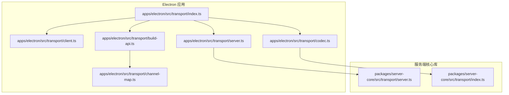
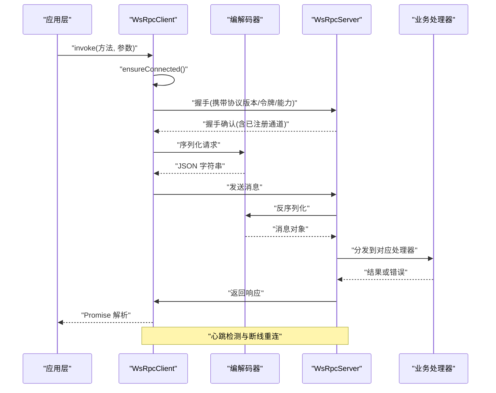
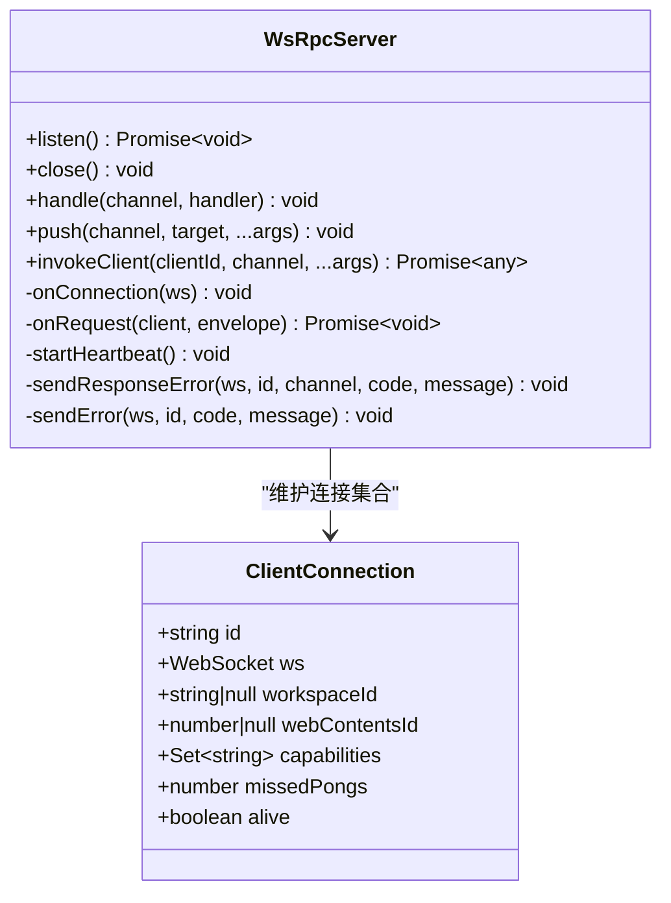
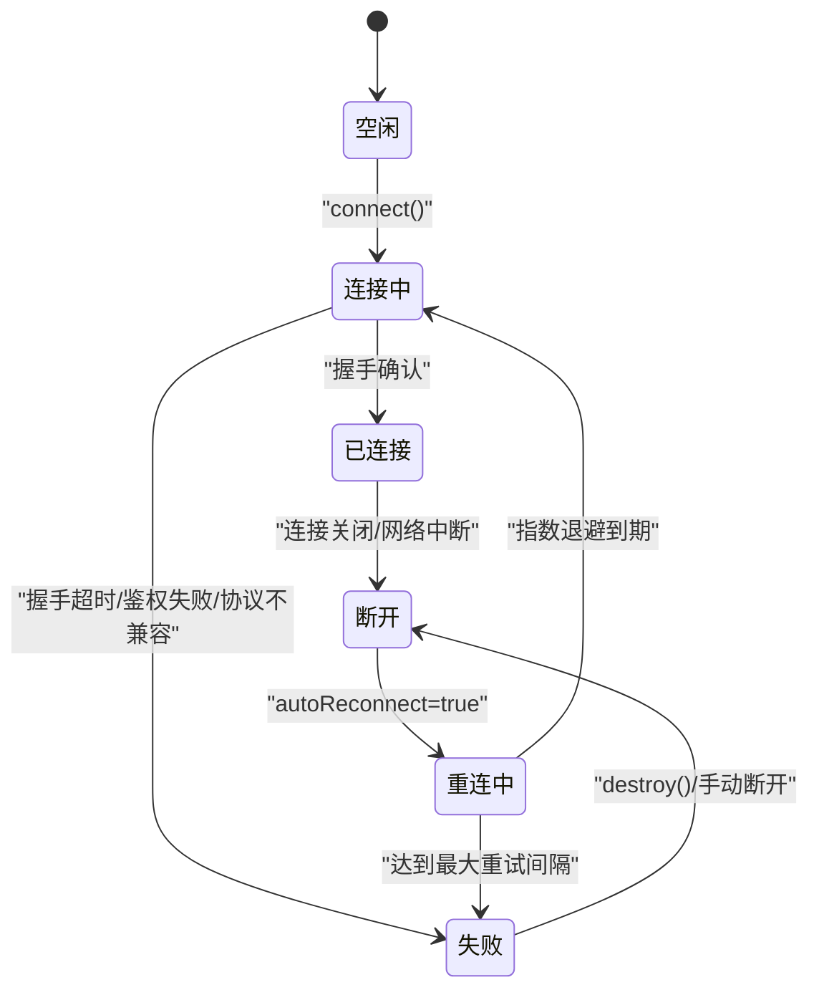
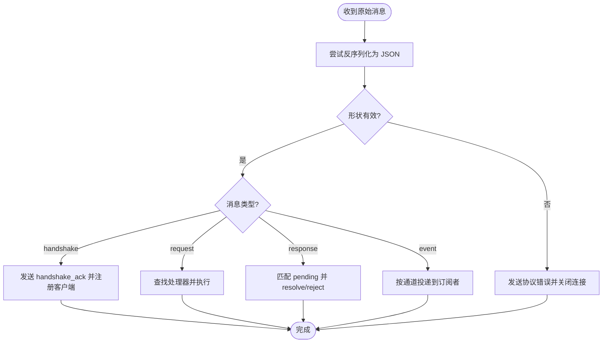
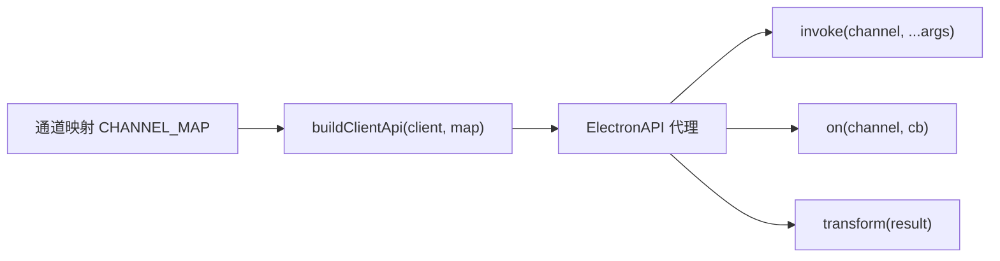
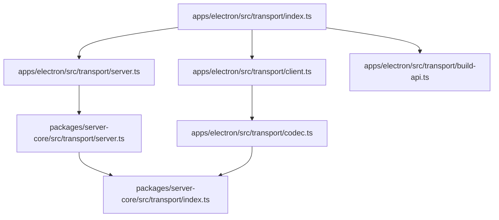

# 传输层架构

<cite>
**本文引用的文件**
- [apps/electron/src/transport/index.ts](file://apps/electron/src/transport/index.ts)
- [apps/electron/src/transport/server.ts](file://apps/electron/src/transport/server.ts)
- [apps/electron/src/transport/client.ts](file://apps/electron/src/transport/client.ts)
- [apps/electron/src/transport/codec.ts](file://apps/electron/src/transport/codec.ts)
- [apps/electron/src/transport/channel-map.ts](file://apps/electron/src/transport/channel-map.ts)
- [apps/electron/src/transport/build-api.ts](file://apps/electron/src/transport/build-api.ts)
- [packages/server-core/src/transport/server.ts](file://packages/server-core/src/transport/server.ts)
- [packages/server-core/src/transport/index.ts](file://packages/server-core/src/transport/index.ts)
- [apps/electron/src/__tests__/transport.test.ts](file://apps/electron/src/__tests__/transport.test.ts)
- [apps/electron/src/transport/__tests__/codec.test.ts](file://apps/electron/src/transport/__tests__/codec.test.ts)
- [apps/electron/src/transport/__tests__/channel-map-parity.test.ts](file://apps/electron/src/transport/__tests__/channel-map-parity.test.ts)
</cite>

## 目录

1. [引言](#引言)
2. [项目结构](#项目结构)
3. [核心组件](#核心组件)
4. [架构总览](#架构总览)
5. [组件详解](#组件详解)
6. [依赖关系分析](#依赖关系分析)
7. [性能考量](#性能考量)
8. [故障排查指南](#故障排查指南)
9. [结论](#结论)
10. [附录](#附录)

## 引言

本文件系统性梳理 Craft Agents 的传输层架构，聚焦基于 WebSocket 的 RPC 实现，覆盖服务端与客户端的连接建立、消息路由、通道映射、编解码器设计、错误处理、心跳与断线重连、安全（认证、授权、完整性）以及性能优化与监控建议。目标是帮助开发者快速理解并高效扩展传输层能力。

## 项目结构

传输层相关代码主要分布在以下位置：

- Electron 应用侧：客户端、通道映射、API 构建器、编解码器导出入口
- 服务端核心库：WebSocket RPC 服务器、编解码器、推送与能力模型导出

图表来源

- [apps/electron/src/transport/index.ts](file://apps/electron/src/transport/index.ts#L1-L6)
- [apps/electron/src/transport/client.ts](file://apps/electron/src/transport/client.ts#L1-L728)
- [apps/electron/src/transport/channel-map.ts](file://apps/electron/src/transport/channel-map.ts#L1-L335)
- [apps/electron/src/transport/build-api.ts](file://apps/electron/src/transport/build-api.ts#L1-L66)
- [apps/electron/src/transport/codec.ts](file://apps/electron/src/transport/codec.ts#L1-L6)
- [apps/electron/src/transport/server.ts](file://apps/electron/src/transport/server.ts#L1-L2)
- [packages/server-core/src/transport/server.ts](file://packages/server-core/src/transport/server.ts#L1-L558)
- [packages/server-core/src/transport/index.ts](file://packages/server-core/src/transport/index.ts#L1-L6)

章节来源

- [apps/electron/src/transport/index.ts](file://apps/electron/src/transport/index.ts#L1-L6)
- [apps/electron/src/transport/server.ts](file://apps/electron/src/transport/server.ts#L1-L2)
- [apps/electron/src/transport/client.ts](file://apps/electron/src/transport/client.ts#L1-L728)
- [apps/electron/src/transport/codec.ts](file://apps/electron/src/transport/codec.ts#L1-L6)
- [apps/electron/src/transport/channel-map.ts](file://apps/electron/src/transport/channel-map.ts#L1-L335)
- [apps/electron/src/transport/build-api.ts](file://apps/electron/src/transport/build-api.ts#L1-L66)
- [packages/server-core/src/transport/server.ts](file://packages/server-core/src/transport/server.ts#L1-L558)
- [packages/server-core/src/transport/index.ts](file://packages/server-core/src/transport/index.ts#L1-L6)

## 核心组件

- 客户端 WsRpcClient：负责握手、请求/响应关联、事件订阅、能力调用、自动重连、连接状态管理与错误分类。
- 服务端 WsRpcServer：负责监听、握手校验（协议版本、可选认证）、请求分发、响应回传、事件推送、心跳检测与离线清理。
- 编解码器：统一的消息封包与校验，确保跨端一致性与安全性。
- 通道映射与 API 构建：将高层方法名映射到底层通道，构建类型安全的客户端代理。
- 连接状态与错误模型：标准化的状态机与错误分类，便于 UI 展示与自动化重连。

章节来源

- [apps/electron/src/transport/client.ts](file://apps/electron/src/transport/client.ts#L101-L728)
- [packages/server-core/src/transport/server.ts](file://packages/server-core/src/transport/server.ts#L83-L558)
- [apps/electron/src/transport/codec.ts](file://apps/electron/src/transport/codec.ts#L1-L6)
- [apps/electron/src/transport/channel-map.ts](file://apps/electron/src/transport/channel-map.ts#L1-L335)
- [apps/electron/src/transport/build-api.ts](file://apps/electron/src/transport/build-api.ts#L25-L66)

## 架构总览

下图展示从应用到服务端的典型交互路径，包括握手、RPC 调用、事件订阅与推送、心跳与断线重连。

图表来源

- [apps/electron/src/transport/client.ts](file://apps/electron/src/transport/client.ts#L263-L471)
- [packages/server-core/src/transport/server.ts](file://packages/server-core/src/transport/server.ts#L275-L403)
- [apps/electron/src/transport/codec.ts](file://apps/electron/src/transport/codec.ts#L1-L6)

## 组件详解

### 1) WebSocket RPC 服务器（WsRpcServer）

- 连接生命周期
  - 监听：支持 ws/wss，TLS 可选；随机端口绑定后启动心跳定时器。
  - 握手：严格校验协议版本主版本号一致；可选令牌认证；记录客户端能力集合。
  - 请求分发：按通道查找处理器，上下文包含客户端标识与工作区信息；异常以错误响应返回。
  - 响应回传：客户端发起的 RPC 响应通过 pendingInvokes 关联。
  - 事件推送：支持广播、按工作区、按客户端三种目标路由。
- 心跳与离线检测
  - 定期 ping，客户端需在阈值内回 pong；超限则主动终止连接并清理。
- 错误处理
  - 协议级错误（版本不兼容、握手超时等）通过 type:'error' 发送并关闭连接。
  - 处理器错误封装为 type:'response' 并携带错误码与消息。
- 线程安全与并发
  - 使用 Map 维护客户端、处理器、待响应队列，避免竞态。

图表来源

- [packages/server-core/src/transport/server.ts](file://packages/server-core/src/transport/server.ts#L83-L558)

章节来源

- [packages/server-core/src/transport/server.ts](file://packages/server-core/src/transport/server.ts#L83-L558)

### 2) WebSocket RPC 客户端（WsRpcClient）

- 连接建立
  - 支持本地（127.0.0.1/localhost）与远程模式推断；握手阶段携带协议版本、工作区、webContentsId、令牌与客户端能力。
  - 连接超时控制与失败原因分类（网络、协议、鉴权、超时等）。
- 消息路由
  - 请求/响应：使用 UUID 关联，超时自动清理；错误包含 code、message、data。
  - 事件订阅：按通道注册回调集合；服务端推送事件分发给订阅者。
  - 能力调用：服务端对客户端发起的能力请求（如工具调用），由客户端能力处理器处理并回包。
- 断线重连
  - 指数退避（最大上限可配置）；自动重连开关；手动触发 reconnectNow。
- 连接状态与可观测性
  - TransportConnectionState 提供状态快照；onConnectionStateChanged 回调；getConnectionState 深拷贝保护。
- 错误分类与恢复
  - 分类器根据错误码与关闭码归类；失败时触发 readyPromise 拒绝，避免静默失败。

图表来源

- [apps/electron/src/transport/client.ts](file://apps/electron/src/transport/client.ts#L313-L589)

章节来源

- [apps/electron/src/transport/client.ts](file://apps/electron/src/transport/client.ts#L101-L728)

### 3) 编解码器与消息模型

- 统一封包
  - 所有消息以 MessageEnvelope 形式传输，包含 id、type、channel、args、serverId、clientId、registeredChannels、error/result 等字段。
- 序列化/反序列化
  - 采用 JSON 字符串承载；服务端/客户端共享同一套编解码逻辑。
- 验证规则
  - 严格的封包形状校验，缺失关键字段或类型不符将被拒绝；握手确认必须包含 clientId；错误响应允许数字或字符串类型的 code。
- 边界与健壮性
  - 反序列化失败直接丢弃；服务端对非 JSON 与非法封包进行 4002/4003 关闭。

图表来源

- [packages/server-core/src/transport/server.ts](file://packages/server-core/src/transport/server.ts#L286-L398)
- [apps/electron/src/transport/codec.ts](file://apps/electron/src/transport/codec.ts#L1-L6)

章节来源

- [apps/electron/src/transport/**tests**/codec.test.ts](file://apps/electron/src/transport/__tests__/codec.test.ts#L1-L116)
- [packages/server-core/src/transport/server.ts](file://packages/server-core/src/transport/server.ts#L286-L398)

### 4) 通道映射与 API 构建

- 通道映射（CHANNEL_MAP）
  - 将高层方法名映射到具体 RPC 通道；支持“命名空间.方法”形式（如 browserPane.create）。
  - 支持 transform 对结果进行轻量转换（例如只取 setupNeeds）。
- API 构建（buildClientApi）
  - 生成 ElectronAPI 类型安全代理；自动挂载嵌套命名空间；暴露 isChannelAvailable 用于 UI 判断可用性。
- 映射一致性保障
  - 通过编译期断言确保 CHANNEL_MAP 与 ElectronAPI 方法集保持同步，避免运行时遗漏或冗余。

图表来源

- [apps/electron/src/transport/channel-map.ts](file://apps/electron/src/transport/channel-map.ts#L1-L335)
- [apps/electron/src/transport/build-api.ts](file://apps/electron/src/transport/build-api.ts#L25-L66)

章节来源

- [apps/electron/src/transport/channel-map.ts](file://apps/electron/src/transport/channel-map.ts#L1-L335)
- [apps/electron/src/transport/build-api.ts](file://apps/electron/src/transport/build-api.ts#L25-L66)
- [apps/electron/src/transport/**tests**/channel-map-parity.test.ts](file://apps/electron/src/transport/__tests__/channel-map-parity.test.ts#L1-L48)

### 5) 客户端连接管理、心跳与断线重连

- 连接状态机
  - idle → connecting/reconnecting → connected/disconnected → failed
  - 状态变更通过回调通知上层 UI 或业务逻辑。
- 心跳
  - 服务端周期性 ping，客户端需回 pong；连续未回 pong 达阈值即断开，防止僵尸连接。
- 重连策略
  - 指数退避，上限可配；支持手动触发立即重连；销毁客户端会清理所有挂起请求并置为断开状态。
- 能力协商
  - 握手阶段服务端返回已注册通道列表；客户端据此判断是否可用，避免无效调用。

章节来源

- [apps/electron/src/transport/client.ts](file://apps/electron/src/transport/client.ts#L313-L589)
- [packages/server-core/src/transport/server.ts](file://packages/server-core/src/transport/server.ts#L449-L465)

### 6) 安全考虑（认证、授权、完整性）

- 认证与授权
  - 可选 Bearer 令牌；服务端可注入 validateToken 校验；鉴权失败返回 AUTH_FAILED 并关闭连接。
- 协议版本控制
  - 主版本不一致直接拒绝握手，避免不兼容升级导致的异常行为。
- 消息完整性
  - 通过统一编解码与封包校验保证消息结构正确；错误响应携带 code/message/data，便于前端分类处理。
- 传输加密
  - 支持 wss（TLS），证书/私钥/可选 CA/口令由配置提供。

章节来源

- [packages/server-core/src/transport/server.ts](file://packages/server-core/src/transport/server.ts#L306-L338)
- [apps/electron/src/transport/client.ts](file://apps/electron/src/transport/client.ts#L313-L333)

### 7) 测试与回归保障

- 传输层集成测试
  - 覆盖握手、RPC、推送、错误、认证、协议版本、断线重连等场景。
- 编解码器测试
  - 验证封包形状校验、序列化往返、非法输入处理。
- 通道映射一致性测试
  - 编译期断言确保方法集与映射表一致，避免运行时遗漏。

章节来源

- [apps/electron/src/**tests**/transport.test.ts](file://apps/electron/src/__tests__/transport.test.ts#L1-L510)
- [apps/electron/src/transport/**tests**/codec.test.ts](file://apps/electron/src/transport/__tests__/codec.test.ts#L1-L116)
- [apps/electron/src/transport/**tests**/channel-map-parity.test.ts](file://apps/electron/src/transport/__tests__/channel-map-parity.test.ts#L1-L48)

## 依赖关系分析

- Electron 传输层导出
  - 通过 index.ts 导出客户端、服务端、通道映射与 API 构建器，并复用服务端核心库的编解码器与类型定义。
- 服务端核心库
  - server.ts 提供 WsRpcServer；index.ts 暴露 server、codec、capabilities、push 与类型。
- 依赖链
  - 客户端依赖编解码器与协议常量；服务端同样依赖编解码器与协议常量；两者通过统一的 MessageEnvelope 通信。

图表来源

- [apps/electron/src/transport/index.ts](file://apps/electron/src/transport/index.ts#L1-L6)
- [apps/electron/src/transport/server.ts](file://apps/electron/src/transport/server.ts#L1-L2)
- [apps/electron/src/transport/client.ts](file://apps/electron/src/transport/client.ts#L1-L728)
- [apps/electron/src/transport/codec.ts](file://apps/electron/src/transport/codec.ts#L1-L6)
- [apps/electron/src/transport/build-api.ts](file://apps/electron/src/transport/build-api.ts#L1-L66)
- [packages/server-core/src/transport/server.ts](file://packages/server-core/src/transport/server.ts#L1-L558)
- [packages/server-core/src/transport/index.ts](file://packages/server-core/src/transport/index.ts#L1-L6)

章节来源

- [apps/electron/src/transport/index.ts](file://apps/electron/src/transport/index.ts#L1-L6)
- [packages/server-core/src/transport/index.ts](file://packages/server-core/src/transport/index.ts#L1-L6)

## 性能考量

- 连接与消息
  - 使用统一的编解码器减少序列化开销；避免在消息中传递大对象，必要时采用流式或分片策略。
- 心跳与保活
  - 合理设置心跳间隔与容忍丢失次数，避免频繁 ping/pong 带来的 CPU 开销。
- 并发与内存
  - pending 请求与客户端集合使用 Map 结构，注意在断开时及时清理，防止内存泄漏。
- 重连退避
  - 指数退避上限合理配置，避免雪崩效应；在高抖动网络中可引入随机抖动因子。
- 监控指标建议
  - 连接成功率、握手耗时、请求延迟分布、错误码分布、重连次数与平均间隔、活跃连接数、消息吞吐量、心跳丢失率。

## 故障排查指南

- 常见错误与定位
  - 握手超时：检查客户端 connectTimeout 与服务端握手超时；确认网络可达与代理配置。
  - 协议版本不兼容：核对客户端协议版本主版本号；升级客户端或服务端至兼容版本。
  - 鉴权失败：确认令牌格式与有效期；服务端 validateToken 返回值；日志中错误码 AUTH_FAILED。
  - 通道不可用：服务端未注册处理器或客户端未声明能力；检查 CHANNEL_MAP 与服务端 handle 注册。
  - 请求超时：服务端处理器阻塞或客户端 requestTimeout 过短；增加超时或优化处理器。
- 可观测性
  - 使用 onConnectionStateChanged 获取连接状态快照；结合 getConnectionState 查看最近错误与关闭信息。
  - 在服务端启用生命周期回调（onClientConnected/onClientDisconnected）统计连接趋势。
- 自动化诊断
  - 在客户端启用 autoReconnect 并观察 reconnectAttempt 与 nextRetryInMs；若持续失败，切换到手动重连并上报错误。

章节来源

- [apps/electron/src/transport/client.ts](file://apps/electron/src/transport/client.ts#L49-L727)
- [packages/server-core/src/transport/server.ts](file://packages/server-core/src/transport/server.ts#L275-L403)
- [apps/electron/src/**tests**/transport.test.ts](file://apps/electron/src/__tests__/transport.test.ts#L466-L476)

## 结论

该传输层以统一的编解码器与消息模型为核心，结合严格的握手与心跳机制，提供了可靠的 WebSocket RPC 能力。通过通道映射与 API 构建器，实现了高层方法与底层通道的清晰分离；通过完善的错误分类与断线重连策略，提升了系统的鲁棒性。建议在生产环境中启用 TLS、完善监控与告警，并持续通过测试保障通道映射与协议演进的一致性。

## 附录

- 关键流程参考
  - 握手与认证：[packages/server-core/src/transport/server.ts](file://packages/server-core/src/transport/server.ts#L295-L338)
  - 请求分发与错误回传：[packages/server-core/src/transport/server.ts](file://packages/server-core/src/transport/server.ts#L409-L443)
  - 客户端连接与重连：[apps/electron/src/transport/client.ts](file://apps/electron/src/transport/client.ts#L263-L589)
  - 编解码与封包校验：[apps/electron/src/transport/codec.ts](file://apps/electron/src/transport/codec.ts#L1-L6)
  - 通道映射与 API 构建：[apps/electron/src/transport/channel-map.ts](file://apps/electron/src/transport/channel-map.ts#L1-L335), [apps/electron/src/transport/build-api.ts](file://apps/electron/src/transport/build-api.ts#L25-L66)
