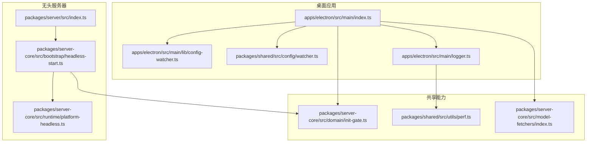
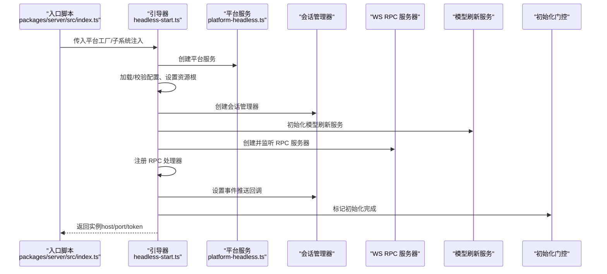
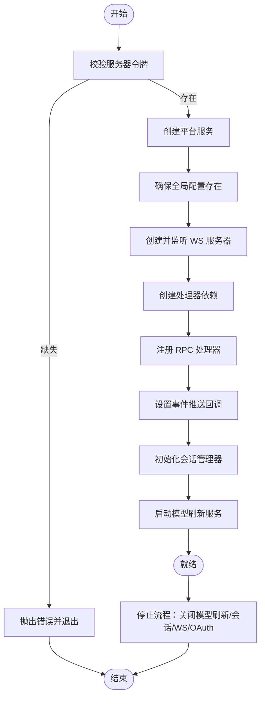
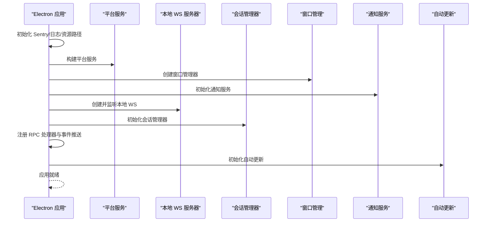
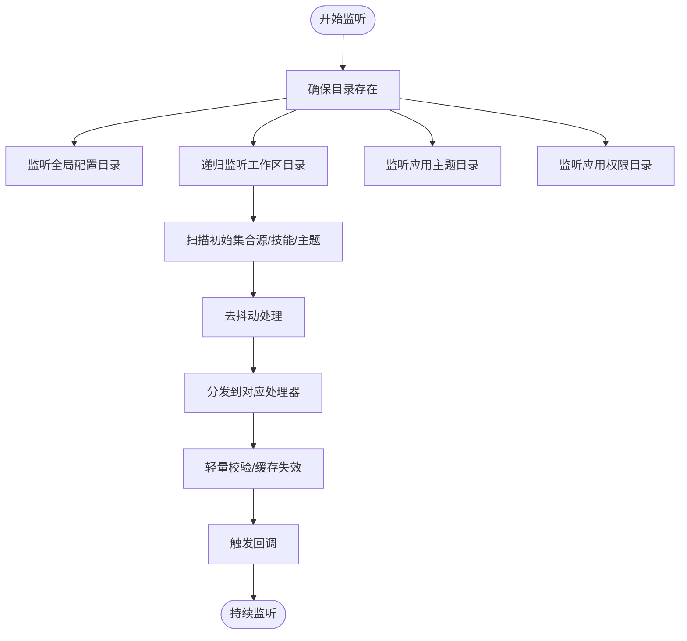
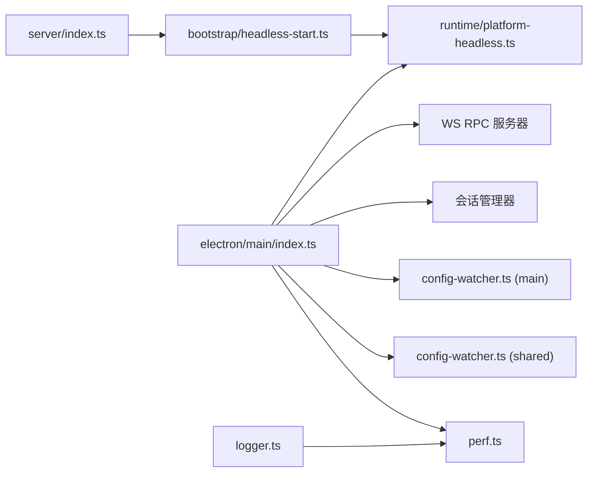

# 引导和初始化

<cite>
**本文引用的文件**
- [packages/server/src/index.ts](file://packages/server/src/index.ts)
- [packages/server-core/src/bootstrap/headless-start.ts](file://packages/server-core/src/bootstrap/headless-start.ts)
- [packages/server-core/src/runtime/platform-headless.ts](file://packages/server-core/src/runtime/platform-headless.ts)
- [apps/electron/src/main/index.ts](file://apps/electron/src/main/index.ts)
- [apps/electron/src/main/lib/config-watcher.ts](file://apps/electron/src/main/lib/config-watcher.ts)
- [packages/shared/src/config/watcher.ts](file://packages/shared/src/config/watcher.ts)
- [packages/server-core/src/domain/init-gate.ts](file://packages/server-core/src/domain/init-gate.ts)
- [packages/server-core/src/model-fetchers/index.ts](file://packages/server-core/src/model-fetchers/index.ts)
- [apps/electron/src/main/logger.ts](file://apps/electron/src/main/logger.ts)
- [packages/shared/src/utils/perf.ts](file://packages/shared/src/utils/perf.ts)
</cite>

## 目录

1. [简介](#简介)
2. [项目结构](#项目结构)
3. [核心组件](#核心组件)
4. [架构总览](#架构总览)
5. [详细组件分析](#详细组件分析)
6. [依赖关系分析](#依赖关系分析)
7. [性能考量](#性能考量)
8. [故障排查指南](#故障排查指南)
9. [结论](#结论)
10. [附录：最佳实践与常见问题](#附录最佳实践与常见问题)

## 简介

本文件系统性阐述 Craft Agents 的引导与初始化体系，覆盖以下主题：

- 服务器启动流程：配置加载、依赖解析、服务初始化顺序
- 引导程序实现：初始化阶段划分、平台服务注入、服务注册机制
- 配置监视器：文件监听、热重载、配置校验
- 初始化错误处理与回滚：部分失败恢复、降级模式、健康检查
- 调试方法：启动日志、依赖图谱、初始化耗时分析
- 引导配置最佳实践与常见问题

## 项目结构

本项目采用多包工作区（monorepo）组织，引导与初始化相关的关键位置如下：

- 无头服务器入口：packages/server/src/index.ts
- 通用引导逻辑：packages/server-core/src/bootstrap/headless-start.ts
- 平台服务（无头）：packages/server-core/src/runtime/platform-headless.ts
- 桌面应用主进程引导：apps/electron/src/main/index.ts
- 配置监视器（桌面侧）：apps/electron/src/main/lib/config-watcher.ts
- 配置监视器（共享库）：packages/shared/src/config/watcher.ts
- 初始化门控（InitGate）：packages/server-core/src/domain/init-gate.ts
- 模型刷新服务：packages/server-core/src/model-fetchers/index.ts
- 日志与性能工具：apps/electron/src/main/logger.ts、packages/shared/src/utils/perf.ts

图表来源

- [packages/server/src/index.ts](file://packages/server/src/index.ts#L1-L135)
- [packages/server-core/src/bootstrap/headless-start.ts](file://packages/server-core/src/bootstrap/headless-start.ts#L1-L176)
- [packages/server-core/src/runtime/platform-headless.ts](file://packages/server-core/src/runtime/platform-headless.ts#L1-L89)
- [apps/electron/src/main/index.ts](file://apps/electron/src/main/index.ts#L1-L831)
- [apps/electron/src/main/lib/config-watcher.ts](file://apps/electron/src/main/lib/config-watcher.ts#L1-L1078)
- [packages/shared/src/config/watcher.ts](file://packages/shared/src/config/watcher.ts#L1-L1085)
- [packages/server-core/src/domain/init-gate.ts](file://packages/server-core/src/domain/init-gate.ts#L1-L34)
- [packages/server-core/src/model-fetchers/index.ts](file://packages/server-core/src/model-fetchers/index.ts#L224-L254)
- [apps/electron/src/main/logger.ts](file://apps/electron/src/main/logger.ts#L1-L80)
- [packages/shared/src/utils/perf.ts](file://packages/shared/src/utils/perf.ts#L1-L417)

章节来源

- [packages/server/src/index.ts](file://packages/server/src/index.ts#L1-L135)
- [packages/server-core/src/bootstrap/headless-start.ts](file://packages/server-core/src/bootstrap/headless-start.ts#L1-L176)
- [packages/server-core/src/runtime/platform-headless.ts](file://packages/server-core/src/runtime/platform-headless.ts#L1-L89)
- [apps/electron/src/main/index.ts](file://apps/electron/src/main/index.ts#L1-L831)
- [apps/electron/src/main/lib/config-watcher.ts](file://apps/electron/src/main/lib/config-watcher.ts#L1-L1078)
- [packages/shared/src/config/watcher.ts](file://packages/shared/src/config/watcher.ts#L1-L1085)
- [packages/server-core/src/domain/init-gate.ts](file://packages/server-core/src/domain/init-gate.ts#L1-L34)
- [packages/server-core/src/model-fetchers/index.ts](file://packages/server-core/src/model-fetchers/index.ts#L224-L254)
- [apps/electron/src/main/logger.ts](file://apps/electron/src/main/logger.ts#L1-L80)
- [packages/shared/src/utils/perf.ts](file://packages/shared/src/utils/perf.ts#L1-L417)

## 核心组件

- 无头服务器引导器：负责令牌校验、平台注入、会话管理器初始化、RPC 服务注册与事件推送、模型刷新服务启动与清理。
- 平台服务（Headless）：提供日志、图像处理、运行环境信息等能力，适配无界面运行。
- 桌面应用主进程引导：构建平台服务、注册 IPC/WS 通道、初始化会话管理器、事件广播、通知与自动更新、深链处理、窗口状态持久化。
- 配置监视器：递归监听配置文件变更，触发回调并进行轻量校验；支持源、技能、权限、状态、标签、自动化、主题等多类资源。
- 初始化门控（InitGate）：协调异步初始化阶段，确保一次性 settle，避免重复初始化。
- 模型刷新服务：按需拉取/刷新模型列表，支持凭据解析与定时刷新。

章节来源

- [packages/server-core/src/bootstrap/headless-start.ts](file://packages/server-core/src/bootstrap/headless-start.ts#L70-L176)
- [packages/server-core/src/runtime/platform-headless.ts](file://packages/server-core/src/runtime/platform-headless.ts#L44-L89)
- [apps/electron/src/main/index.ts](file://apps/electron/src/main/index.ts#L295-L738)
- [apps/electron/src/main/lib/config-watcher.ts](file://apps/electron/src/main/lib/config-watcher.ts#L176-L293)
- [packages/shared/src/config/watcher.ts](file://packages/shared/src/config/watcher.ts#L180-L291)
- [packages/server-core/src/domain/init-gate.ts](file://packages/server-core/src/domain/init-gate.ts#L5-L33)
- [packages/server-core/src/model-fetchers/index.ts](file://packages/server-core/src/model-fetchers/index.ts#L238-L252)

## 架构总览

下图展示从入口到服务可用的端到端引导路径，以及关键依赖注入点与事件流。

图表来源

- [packages/server/src/index.ts](file://packages/server/src/index.ts#L55-L113)
- [packages/server-core/src/bootstrap/headless-start.ts](file://packages/server-core/src/bootstrap/headless-start.ts#L70-L176)
- [packages/server-core/src/runtime/platform-headless.ts](file://packages/server-core/src/runtime/platform-headless.ts#L44-L89)
- [packages/server-core/src/domain/init-gate.ts](file://packages/server-core/src/domain/init-gate.ts#L5-L33)

## 详细组件分析

### 无头服务器引导器（headless-start）

- 职责
  - 解析环境变量（令牌、绑定地址、端口、TLS），校验参数合法性
  - 创建平台服务并注入到各子系统
  - 初始化全局配置与资源目录
  - 启动 WS RPC 服务器，注册处理器，建立事件推送通道
  - 初始化会话管理器与模型刷新服务，并在停止时执行清理
- 关键流程
  - 令牌校验：要求必须提供 serverToken 或通过环境变量传入
  - 端口校验：限定范围并转换为整数
  - TLS 可选：当提供证书/私钥路径时启用 wss
  - 事件推送：将会话事件推送到客户端
  - 停止流程：依次关闭模型刷新、会话管理器、WS 服务器、OAuth 流程存储

图表来源

- [packages/server-core/src/bootstrap/headless-start.ts](file://packages/server-core/src/bootstrap/headless-start.ts#L70-L176)

章节来源

- [packages/server-core/src/bootstrap/headless-start.ts](file://packages/server-core/src/bootstrap/headless-start.ts#L70-L176)

### 平台服务（Headless）

- 能力
  - 日志：控制台输出，支持调试模式
  - 图像处理：基于 sharp 的元数据读取与缩放/格式转换
  - 运行环境：应用根路径、资源路径、打包状态、版本号
  - 错误捕获：统一记录到日志
- 使用场景
  - 无界面运行（Bun/Node）下的默认平台实现
  - 作为依赖注入载体，供会话、搜索、图像处理等模块使用

章节来源

- [packages/server-core/src/runtime/platform-headless.ts](file://packages/server-core/src/runtime/platform-headless.ts#L44-L89)

### 桌面应用主进程引导（Electron）

- 职责
  - 初始化 Sentry、日志、打包资源路径、CLI 工具路径
  - 注册深链协议、缩略图协议、通知与自动更新
  - 构建平台服务（含图像处理、日志、错误上报），注入到会话、搜索、图像处理等子系统
  - 创建本地 WS RPC 服务器，注册 IPC/WS 通道，初始化会话管理器并建立事件推送
  - 窗口管理、电源管理、凭据健康检查、窗口状态持久化
- 关键点
  - thin client 模式：若设置 CRAFT_SERVER_URL 则跳过本地服务端初始化
  - headless 模式：仅运行服务器，不创建窗口
  - 事件推送：通过 EventSink 将事件广播至渲染层

图表来源

- [apps/electron/src/main/index.ts](file://apps/electron/src/main/index.ts#L295-L738)

章节来源

- [apps/electron/src/main/index.ts](file://apps/electron/src/main/index.ts#L295-L738)

### 配置监视器（ConfigWatcher）

- 功能
  - 全局配置：config.json、preferences.json、theme.json
  - 工作区配置：sources、skills、permissions、statuses、labels、automations、sessions
  - 递归监听与去抖动处理，支持图标下载与缓存失效
- 回调类型
  - 配置变更、列表变更、权限变更、图标变更、会话元数据变更、校验错误、读取错误
- 生命周期
  - start：确保目录存在、递归监听、扫描初始集合、初始化 LLM 连接哈希
  - stop：清理去抖定时器、关闭所有 FSWatcher、清空已知集合

图表来源

- [apps/electron/src/main/lib/config-watcher.ts](file://apps/electron/src/main/lib/config-watcher.ts#L220-L264)
- [packages/shared/src/config/watcher.ts](file://packages/shared/src/config/watcher.ts#L227-L275)

章节来源

- [apps/electron/src/main/lib/config-watcher.ts](file://apps/electron/src/main/lib/config-watcher.ts#L176-L293)
- [packages/shared/src/config/watcher.ts](file://packages/shared/src/config/watcher.ts#L180-L291)

### 初始化门控（InitGate）

- 设计
  - 单次 settle 的 Promise 容器，wait() 返回未决 Promise，markReady()/markFailed() 保证只执行一次
- 用途
  - 统一协调异步初始化阶段，避免竞态与重复初始化

章节来源

- [packages/server-core/src/domain/init-gate.ts](file://packages/server-core/src/domain/init-gate.ts#L5-L33)

### 模型刷新服务

- 设计
  - 单例模式，通过 initModelRefreshService() 初始化，getModelRefreshService() 获取
  - 支持 startAll()/stopAll() 控制定时任务
- 集成
  - 在引导阶段创建并在会话初始化后启动；在停止时安全关闭

章节来源

- [packages/server-core/src/model-fetchers/index.ts](file://packages/server-core/src/model-fetchers/index.ts#L238-L252)

## 依赖关系分析

- 入口到引导器
  - packages/server/src/index.ts -> packages/server-core/src/bootstrap/headless-start.ts
- 引导器到平台
  - headless-start.ts -> runtime/platform-headless.ts
- 主进程到平台与服务
  - apps/electron/src/main/index.ts -> 平台服务注入（会话、搜索、图像处理）
  - 主进程 -> WS RPC 服务器 -> 事件推送 -> 渲染层
- 配置监视器
  - apps/electron/src/main/lib/config-watcher.ts 与 packages/shared/src/config/watcher.ts 提供相同能力的不同实现入口
- 性能与日志
  - apps/electron/src/main/logger.ts 与 packages/shared/src/utils/perf.ts 提供日志与性能追踪

图表来源

- [packages/server/src/index.ts](file://packages/server/src/index.ts#L55-L113)
- [packages/server-core/src/bootstrap/headless-start.ts](file://packages/server-core/src/bootstrap/headless-start.ts#L70-L176)
- [packages/server-core/src/runtime/platform-headless.ts](file://packages/server-core/src/runtime/platform-headless.ts#L44-L89)
- [apps/electron/src/main/index.ts](file://apps/electron/src/main/index.ts#L295-L738)
- [apps/electron/src/main/lib/config-watcher.ts](file://apps/electron/src/main/lib/config-watcher.ts#L176-L293)
- [packages/shared/src/config/watcher.ts](file://packages/shared/src/config/watcher.ts#L180-L291)
- [apps/electron/src/main/logger.ts](file://apps/electron/src/main/logger.ts#L1-L80)
- [packages/shared/src/utils/perf.ts](file://packages/shared/src/utils/perf.ts#L1-L417)

## 性能考量

- 性能追踪
  - perf 工具默认关闭，可通过调试模式或显式 setPerfEnabled(true) 启用
  - 支持 start/measure/span、聚合统计、最近指标与摘要格式化
- 日志与性能
  - Electron 主进程日志在调试模式下输出到文件与控制台，便于定位性能瓶颈
- 启动优化建议
  - 合理拆分初始化步骤，利用 InitGate 串行化关键阶段
  - 对耗时操作使用去抖动（ConfigWatcher）与延迟加载
  - 在无头模式下避免不必要的 GUI 相关初始化

章节来源

- [packages/shared/src/utils/perf.ts](file://packages/shared/src/utils/perf.ts#L1-L417)
- [apps/electron/src/main/logger.ts](file://apps/electron/src/main/logger.ts#L31-L60)

## 故障排查指南

- 启动失败
  - 令牌缺失：检查 CRAFT_SERVER_TOKEN 是否正确设置
  - 端口非法：确认 CRAFT_RPC_PORT 在 0-65535 范围内
  - TLS 配置：证书/私钥/CA 文件路径需同时提供且有效
- 事件推送异常
  - 确认 WS 服务器已监听并正确设置事件推送回调
  - 检查客户端连接状态与令牌校验
- 配置变更未生效
  - 确认 ConfigWatcher 正在运行且监听路径正确
  - 查看去抖动与校验结果回调，定位具体文件与错误
- 停止流程
  - 确保 stop() 被调用，清理模型刷新、会话管理器、WS 服务器、OAuth 存储
- 凭据健康检查
  - 应用启动时进行凭据健康检查，失败会在设置页提示

章节来源

- [packages/server-core/src/bootstrap/headless-start.ts](file://packages/server-core/src/bootstrap/headless-start.ts#L70-L176)
- [apps/electron/src/main/index.ts](file://apps/electron/src/main/index.ts#L651-L703)
- [apps/electron/src/main/lib/config-watcher.ts](file://apps/electron/src/main/lib/config-watcher.ts#L481-L493)

## 结论

Craft Agents 的引导与初始化体系以“可插拔平台服务 + 明确初始化顺序 + 事件驱动”为核心设计原则。无头服务器与桌面应用主进程分别在不同运行环境下复用同一套引导器与平台抽象，既保证了行为一致性，又提供了灵活的扩展点。通过配置监视器、性能追踪与日志系统，开发者可以高效定位问题并优化启动性能。

## 附录：最佳实践与常见问题

- 最佳实践
  - 明确区分“平台服务注入”与“业务服务初始化”，使用 InitGate 串联关键阶段
  - 在生产环境启用 TLS，避免明文传输令牌
  - 启用调试模式与性能追踪，定位启动瓶颈
  - 对外部配置变更使用去抖动与轻量校验，减少无效刷新
- 常见问题
  - 无法连接：检查绑定地址是否为 localhost/127.0.0.1，或启用 TLS
  - 配置未生效：确认 ConfigWatcher 已 start，且监听路径存在
  - 崩溃后残留：确保 stop() 被调用，必要时手动清理文件与资源
  - 日志过多：在生产环境禁用文件与控制台日志，或降低日志级别
