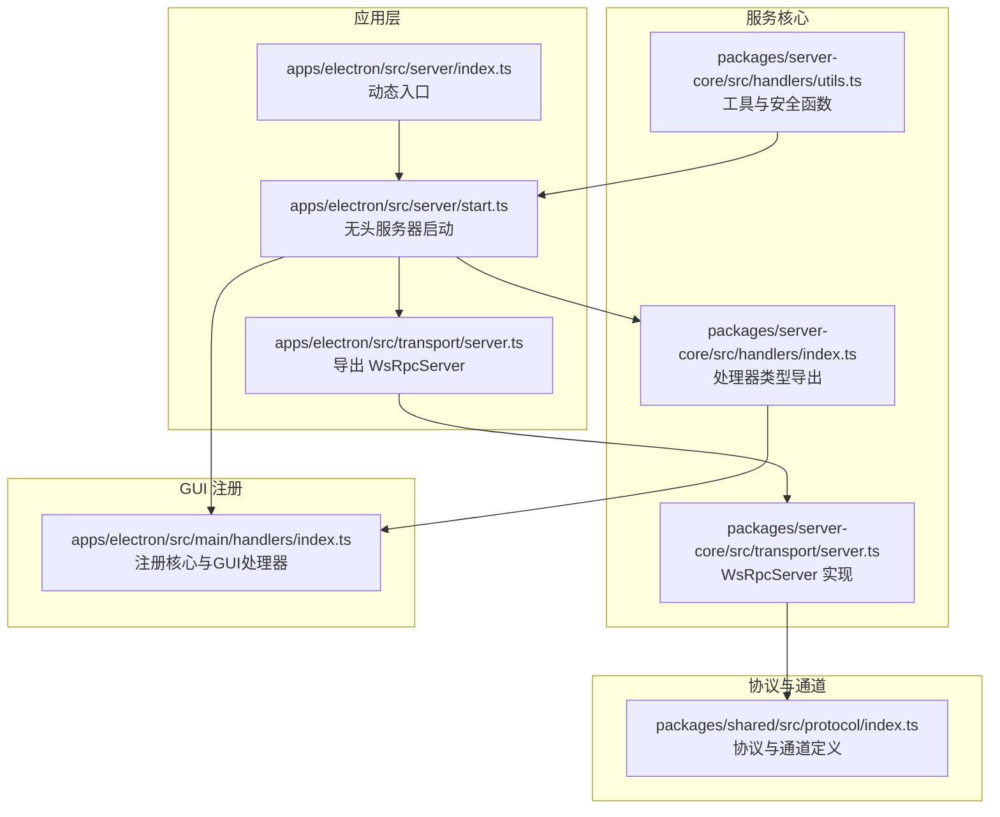
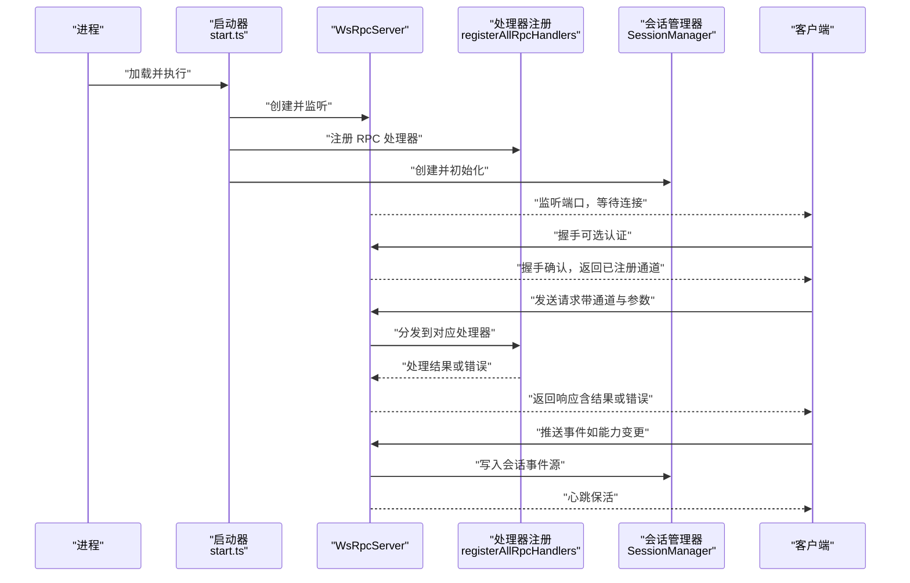
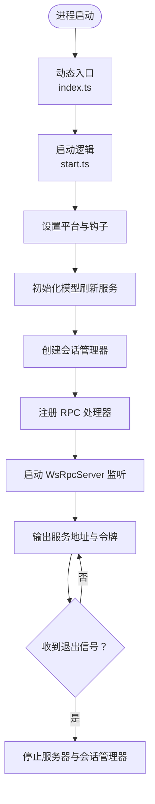
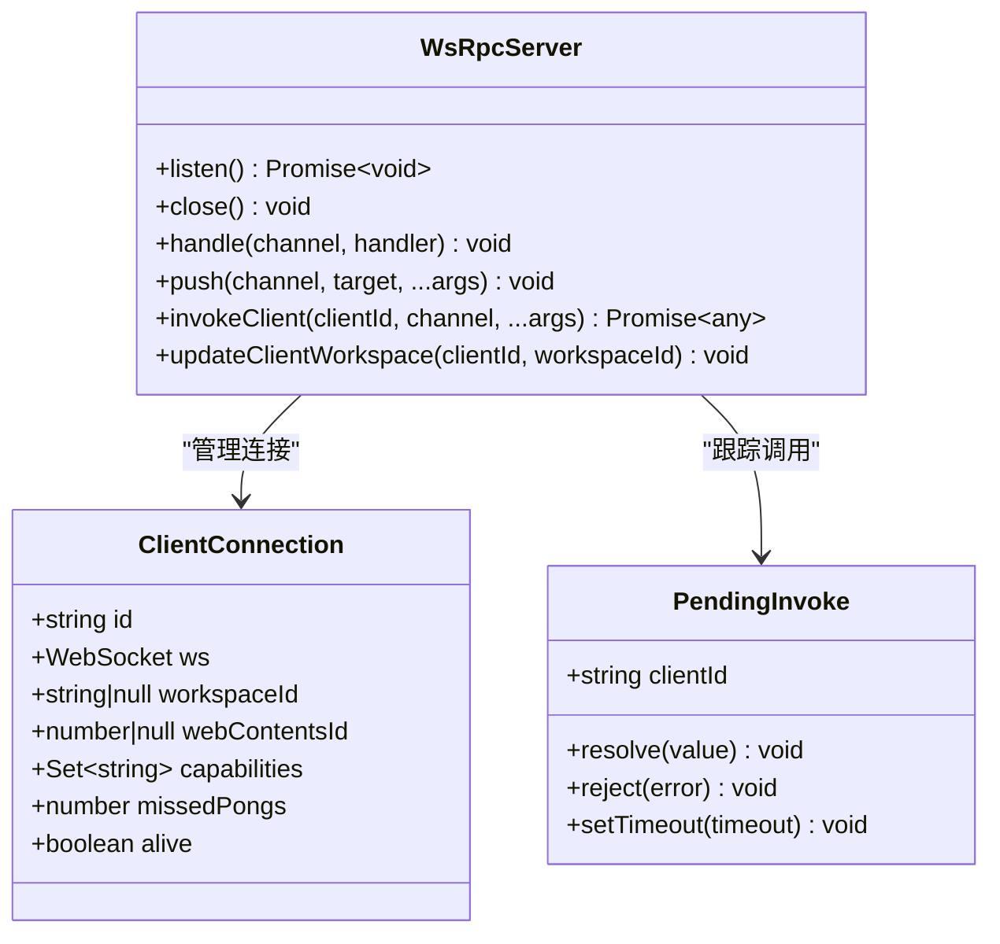
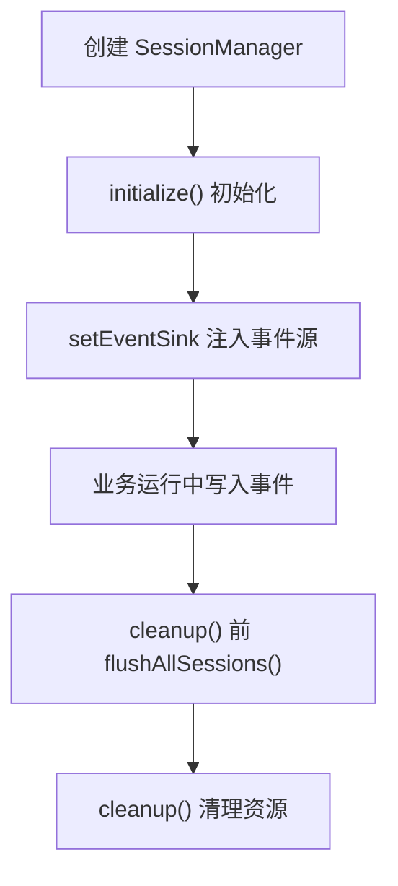
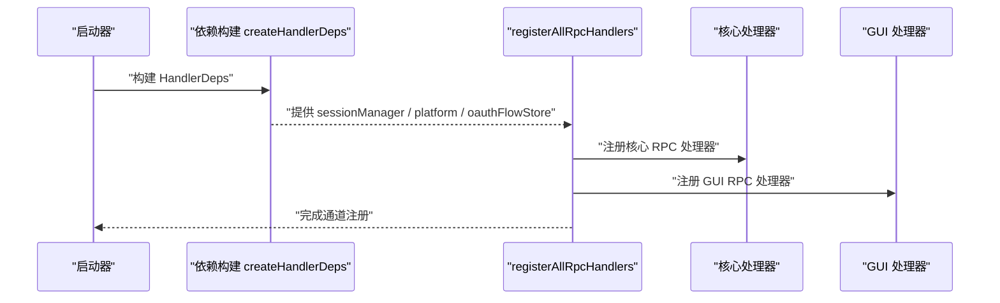
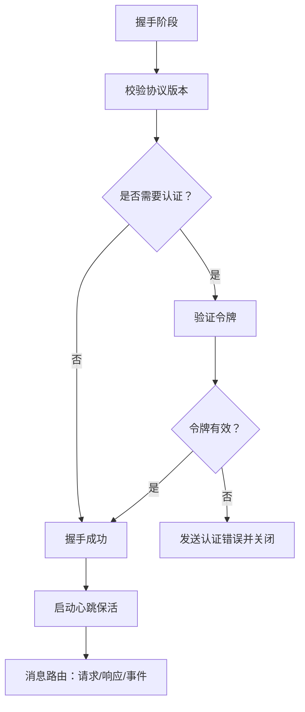
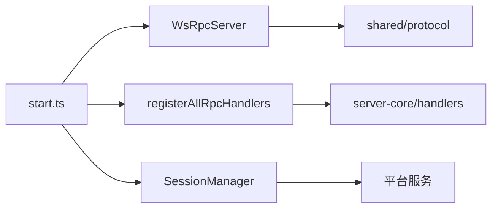
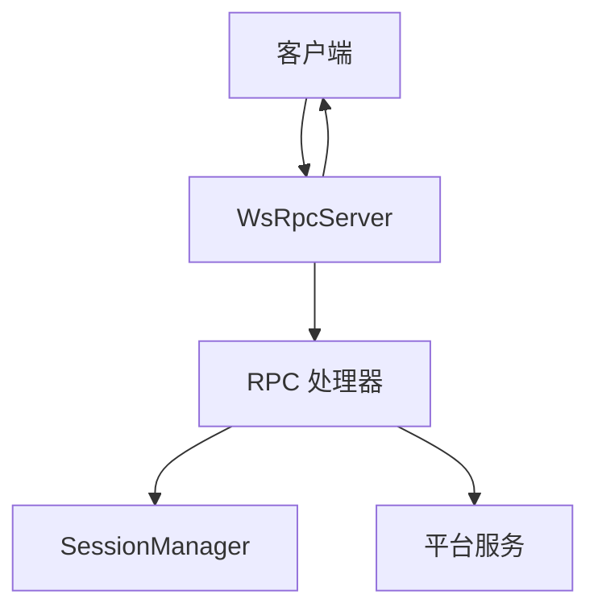

# 服务器架构

<cite>
**本文引用的文件**
- [apps/electron/src/server/index.ts](file://apps/electron/src/server/index.ts)
- [apps/electron/src/server/start.ts](file://apps/electron/src/server/start.ts)
- [apps/electron/src/transport/server.ts](file://apps/electron/src/transport/server.ts)
- [packages/server-core/src/transport/server.ts](file://packages/server-core/src/transport/server.ts)
- [packages/server-core/src/handlers/index.ts](file://packages/server-core/src/handlers/index.ts)
- [apps/electron/src/main/handlers/index.ts](file://apps/electron/src/main/handlers/index.ts)
- [packages/server-core/src/handlers/utils.ts](file://packages/server-core/src/handlers/utils.ts)
- [packages/shared/src/protocol/index.ts](file://packages/shared/src/protocol/index.ts)
</cite>

## 目录

1. [简介](#简介)
2. [项目结构](#项目结构)
3. [核心组件](#核心组件)
4. [架构总览](#架构总览)
5. [组件详解](#组件详解)
6. [依赖关系分析](#依赖关系分析)
7. [性能考量](#性能考量)
8. [故障排查指南](#故障排查指南)
9. [结论](#结论)
10. [附录](#附录)

## 简介

本文件面向 Craft Agents 服务器端架构，聚焦于 WebSocket RPC 服务器（WsRpcServer）、会话管理器（SessionManager）与事件处理器的组织方式，系统性阐述服务器如何完成客户端连接接入、会话状态管理、业务逻辑执行、消息路由与错误处理，并给出启动流程、配置管理与资源清理的关键路径。同时提供部署拓扑与数据流图，帮助读者快速理解服务器与客户端的交互模式。

## 项目结构

服务器相关代码主要分布在以下位置：

- 应用入口与启动：apps/electron/src/server/index.ts 与 apps/electron/src/server/start.ts
- 传输层（WebSocket RPC）：packages/server-core/src/transport/server.ts
- 处理器注册与依赖注入：apps/electron/src/main/handlers/index.ts 与 packages/server-core/src/handlers/index.ts
- 协议与通道定义：packages/shared/src/protocol/index.ts
- 工具与安全：packages/server-core/src/handlers/utils.ts

**图表来源**

- [apps/electron/src/server/index.ts](file://apps/electron/src/server/index.ts#L1-L21)
- [apps/electron/src/server/start.ts](file://apps/electron/src/server/start.ts#L1-L88)
- [apps/electron/src/transport/server.ts](file://apps/electron/src/transport/server.ts#L1-L2)
- [packages/server-core/src/transport/server.ts](file://packages/server-core/src/transport/server.ts#L1-L558)
- [packages/server-core/src/handlers/index.ts](file://packages/server-core/src/handlers/index.ts#L1-L7)
- [apps/electron/src/main/handlers/index.ts](file://apps/electron/src/main/handlers/index.ts#L1-L25)
- [packages/server-core/src/handlers/utils.ts](file://packages/server-core/src/handlers/utils.ts#L1-L112)
- [packages/shared/src/protocol/index.ts](file://packages/shared/src/protocol/index.ts#L1-L5)

**章节来源**

- [apps/electron/src/server/index.ts](file://apps/electron/src/server/index.ts#L1-L21)
- [apps/electron/src/server/start.ts](file://apps/electron/src/server/start.ts#L1-L88)
- [apps/electron/src/transport/server.ts](file://apps/electron/src/transport/server.ts#L1-L2)
- [packages/server-core/src/transport/server.ts](file://packages/server-core/src/transport/server.ts#L1-L558)
- [packages/server-core/src/handlers/index.ts](file://packages/server-core/src/handlers/index.ts#L1-L7)
- [apps/electron/src/main/handlers/index.ts](file://apps/electron/src/main/handlers/index.ts#L1-L25)
- [packages/server-core/src/handlers/utils.ts](file://packages/server-core/src/handlers/utils.ts#L1-L112)
- [packages/shared/src/protocol/index.ts](file://packages/shared/src/protocol/index.ts#L1-L5)

## 核心组件

- WebSocket RPC 服务器（WsRpcServer）
  - 负责连接生命周期、握手、心跳、可选认证、请求分发与推送路由
  - 支持本地（127.0.0.1，无需认证）与远程（0.0.0.0，可启用认证）两种模式
  - 提供 handle(channel, handler) 注册处理器、push(channel, target, ...args) 推送事件、invokeClient(clientId, channel, ...args) 调用客户端能力
- 会话管理器（SessionManager）
  - 在无头启动时由服务核心创建并初始化，负责会话持久化、分支与回滚、事件源注入与清理
- 处理器注册与依赖注入
  - 通过 createHandlerDeps 构建依赖上下文（包含 sessionManager、platform、oauthFlowStore 等），在 registerAllRpcHandlers 中统一注册核心与 GUI 处理器
- 协议与通道
  - 通过共享协议模块提供通道、DTO、事件与版本常量，确保客户端与服务器协议一致

**章节来源**

- [packages/server-core/src/transport/server.ts](file://packages/server-core/src/transport/server.ts#L83-L132)
- [apps/electron/src/server/start.ts](file://apps/electron/src/server/start.ts#L48-L59)
- [apps/electron/src/main/handlers/index.ts](file://apps/electron/src/main/handlers/index.ts#L21-L24)
- [packages/shared/src/protocol/index.ts](file://packages/shared/src/protocol/index.ts#L1-L5)

## 架构总览

下图展示服务器启动到运行的总体流程，以及与客户端的交互模式：

**图表来源**

- [apps/electron/src/server/start.ts](file://apps/electron/src/server/start.ts#L17-L76)
- [packages/server-core/src/transport/server.ts](file://packages/server-core/src/transport/server.ts#L196-L246)
- [apps/electron/src/main/handlers/index.ts](file://apps/electron/src/main/handlers/index.ts#L21-L24)

## 组件详解

### 启动流程与配置管理

- 动态入口
  - index.ts 设置打包标记并动态导入 start.ts，作为无头 Bun 入口点
- 无头服务器启动
  - start.ts 使用服务核心引导函数创建服务器实例，设置平台钩子（模型拉取、会话平台、运行时钩子、搜索与图像处理平台），初始化模型刷新服务与会话管理器，注册 RPC 处理器，并在进程退出信号时优雅关闭
- 配置项
  - 通过环境变量控制绑定地址、端口、令牌、应用根目录、资源路径、打包状态与调试日志等

**图表来源**

- [apps/electron/src/server/index.ts](file://apps/electron/src/server/index.ts#L17-L21)
- [apps/electron/src/server/start.ts](file://apps/electron/src/server/start.ts#L17-L76)

**章节来源**

- [apps/electron/src/server/index.ts](file://apps/electron/src/server/index.ts#L1-L21)
- [apps/electron/src/server/start.ts](file://apps/electron/src/server/start.ts#L1-L88)

### WebSocket RPC 服务器（WsRpcServer）

- 连接与握手
  - 限制握手超时时间；校验协议版本；可选令牌验证；记录客户端能力集合；建立心跳保活
- 请求分发
  - 根据通道查找处理器，构造请求上下文（clientId、workspaceId、webContentsId），捕获异常并以响应错误返回
- 推送路由
  - 支持向所有客户端、同一工作区或指定客户端推送事件；支持排除目标
- 客户端调用
  - invokeClient 用于向特定客户端发起请求，内部维护待决调用并在超时或断开时拒绝
- 关闭与清理
  - 关闭前拒绝所有待决调用，终止所有连接，清理定时器与内部状态

**图表来源**

- [packages/server-core/src/transport/server.ts](file://packages/server-core/src/transport/server.ts#L28-L43)
- [packages/server-core/src/transport/server.ts](file://packages/server-core/src/transport/server.ts#L83-L132)

**章节来源**

- [packages/server-core/src/transport/server.ts](file://packages/server-core/src/transport/server.ts#L1-L558)

### 会话管理器（SessionManager）

- 创建与初始化
  - 由 start.ts 的 createSessionManager 回调创建实例，并在 initializeSessionManager 中初始化
- 事件源与清理
  - 通过 setSessionEventSink 注入事件源；在 cleanupSessionManager 中先 flush 所有会话，再进行清理
- 平台与运行时钩子
  - 通过 setSessionPlatform 与 setSessionRuntimeHooks 注入平台能力与异常上报钩子

**图表来源**

- [apps/electron/src/server/start.ts](file://apps/electron/src/server/start.ts#L48-L69)

**章节来源**

- [apps/electron/src/server/start.ts](file://apps/electron/src/server/start.ts#L48-L69)

### 处理器注册与依赖注入

- 依赖构建
  - createHandlerDeps 返回包含 sessionManager、platform、oauthFlowStore 的依赖对象；headless 模式下不包含 GUI 管理器
- 注册顺序
  - 先注册核心 RPC 处理器，再注册 GUI 专属处理器，形成统一的 RPC 通道集合
- 通道与上下文
  - 处理器通过 RequestContext 获取当前客户端身份与工作区信息，结合平台服务执行业务逻辑

**图表来源**

- [apps/electron/src/server/start.ts](file://apps/electron/src/server/start.ts#L48-L55)
- [apps/electron/src/main/handlers/index.ts](file://apps/electron/src/main/handlers/index.ts#L21-L24)

**章节来源**

- [apps/electron/src/server/start.ts](file://apps/electron/src/server/start.ts#L48-L55)
- [apps/electron/src/main/handlers/index.ts](file://apps/electron/src/main/handlers/index.ts#L1-L25)

### 协议与消息路由

- 协议版本
  - 握手阶段严格校验主版本一致性，不兼容则拒绝连接
- 认证
  - 可选令牌验证，失败时发送协议级错误并关闭连接
- 心跳
  - 定期 ping，客户端需及时 pong；超过最大错过次数将主动断开
- 推送目标
  - 支持广播、按工作区与按客户端三种目标类型，可排除特定客户端

**图表来源**

- [packages/server-core/src/transport/server.ts](file://packages/server-core/src/transport/server.ts#L295-L383)
- [packages/server-core/src/transport/server.ts](file://packages/server-core/src/transport/server.ts#L449-L465)
- [packages/server-core/src/transport/server.ts](file://packages/server-core/src/transport/server.ts#L471-L483)

**章节来源**

- [packages/server-core/src/transport/server.ts](file://packages/server-core/src/transport/server.ts#L1-L558)
- [packages/shared/src/protocol/index.ts](file://packages/shared/src/protocol/index.ts#L1-L5)

### 安全与工具

- 文件路径安全
  - 规范化路径、解析真实路径、限定允许目录（用户主目录与临时目录）、阻断敏感文件模式
- 名称清洗
  - 清洗非法字符、长度限制与隐藏文件风险
- 工作区校验
  - 通过名称或 ID 获取工作区并抛错，保证操作前置条件

**章节来源**

- [packages/server-core/src/handlers/utils.ts](file://packages/server-core/src/handlers/utils.ts#L1-L112)

## 依赖关系分析

- 组件耦合
  - 启动器对传输层、处理器注册与会话管理器存在直接依赖；传输层仅依赖共享协议与编解码器
- 外部依赖
  - 传输层依赖 ws 与 node:https；处理器依赖共享配置与平台服务
- 循环依赖
  - 当前结构清晰，未见循环依赖迹象

**图表来源**

- [apps/electron/src/server/start.ts](file://apps/electron/src/server/start.ts#L17-L76)
- [packages/server-core/src/transport/server.ts](file://packages/server-core/src/transport/server.ts#L1-L558)
- [apps/electron/src/main/handlers/index.ts](file://apps/electron/src/main/handlers/index.ts#L21-L24)
- [packages/shared/src/protocol/index.ts](file://packages/shared/src/protocol/index.ts#L1-L5)

**章节来源**

- [apps/electron/src/server/start.ts](file://apps/electron/src/server/start.ts#L1-L88)
- [packages/server-core/src/transport/server.ts](file://packages/server-core/src/transport/server.ts#L1-L558)
- [apps/electron/src/main/handlers/index.ts](file://apps/electron/src/main/handlers/index.ts#L1-L25)
- [packages/shared/src/protocol/index.ts](file://packages/shared/src/protocol/index.ts#L1-L5)

## 性能考量

- 心跳保活
  - 定期 ping/pong 降低僵尸连接占用，missedPongs 达阈值即断开，避免资源泄露
- 待决调用管理
  - invokeClient 超时与断线统一拒绝，防止内存泄漏与悬挂任务
- 广播与路由
  - push 采用遍历客户端映射，建议在高并发场景下评估目标过滤与批量推送策略
- 平台钩子
  - 将模型拉取、搜索与图像处理平台注入，减少跨层调用成本

[本节为通用指导，不涉及具体文件分析]

## 故障排查指南

- 握手失败
  - 协议版本不匹配、令牌缺失或无效、握手超时均会导致连接被拒绝
- 认证失败
  - 确认 validateToken 回调正确实现且令牌来源可信
- 心跳断开
  - 检查客户端网络状况与 pong 处理；确认服务器心跳周期与最大错过次数配置
- 请求超时
  - invokeClient 默认超时约 30 秒，检查处理器耗时与客户端响应能力
- 断线清理
  - 服务器关闭时会拒绝所有待决调用并终止连接，确保客户端重连后重新握手

**章节来源**

- [packages/server-core/src/transport/server.ts](file://packages/server-core/src/transport/server.ts#L295-L383)
- [packages/server-core/src/transport/server.ts](file://packages/server-core/src/transport/server.ts#L151-L190)
- [packages/server-core/src/transport/server.ts](file://packages/server-core/src/transport/server.ts#L449-L465)

## 结论

Craft Agents 服务器采用“无头启动 + WebSocket RPC”的架构设计，通过 WsRpcServer 统一处理连接、认证、心跳与消息路由，借助 SessionManager 管理会话状态与事件源，配合处理器注册体系实现核心与 GUI 功能的模块化扩展。该架构具备清晰的启动流程、完善的错误处理与资源清理机制，适合在本地与远程环境中部署运行。

[本节为总结性内容，不涉及具体文件分析]

## 附录

- 部署拓扑（概念示意）
  - 服务器监听固定端口，客户端通过 ws/wss 连接；可选 TLS 与令牌认证；心跳保活；按工作区/客户端推送事件
- 数据流图（概念示意）
  - 客户端发送请求 → 服务器分发到处理器 → 处理器读写会话与平台服务 → 服务器返回响应/推送事件

[本图为概念示意，不对应具体源码文件]
