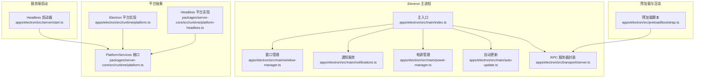
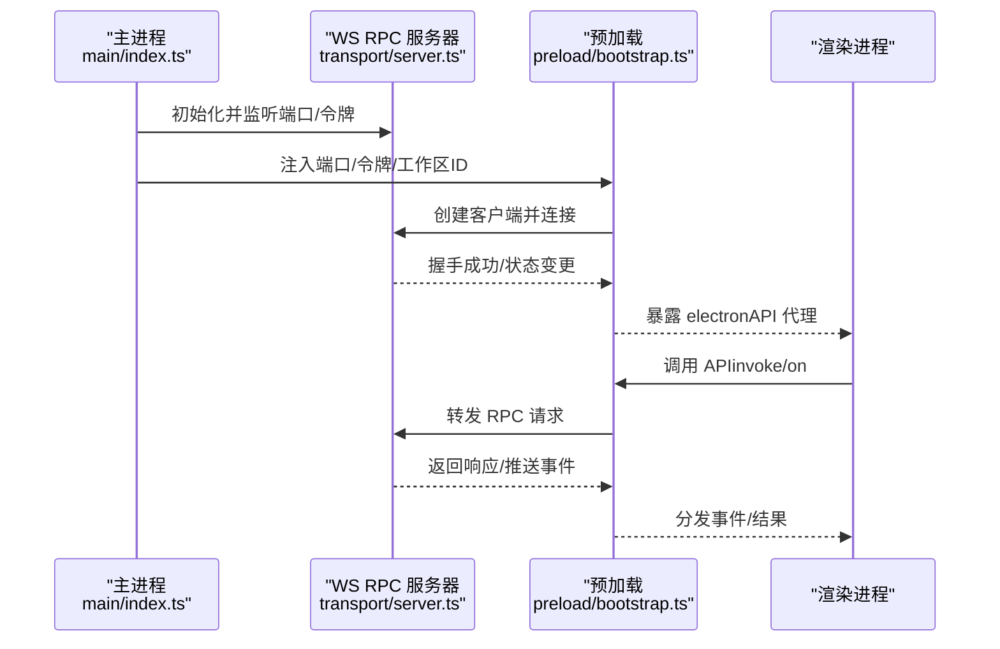
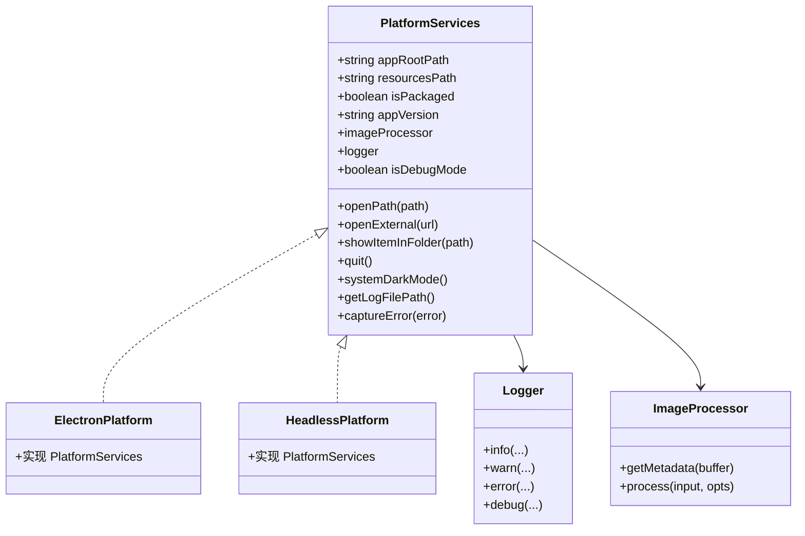
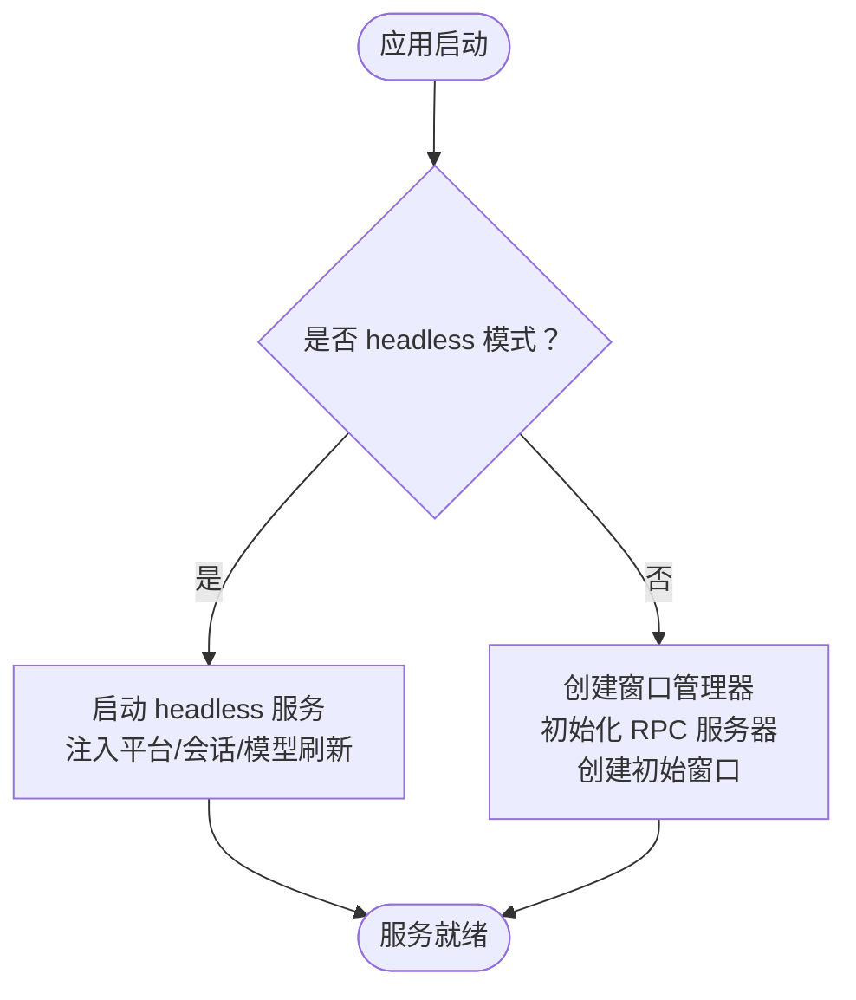
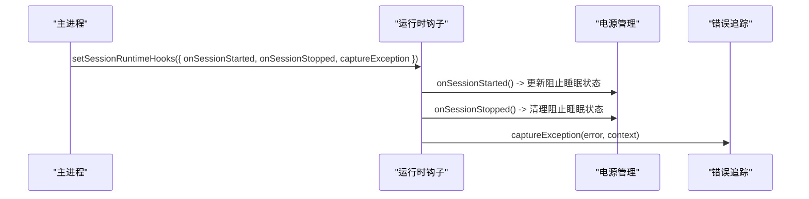
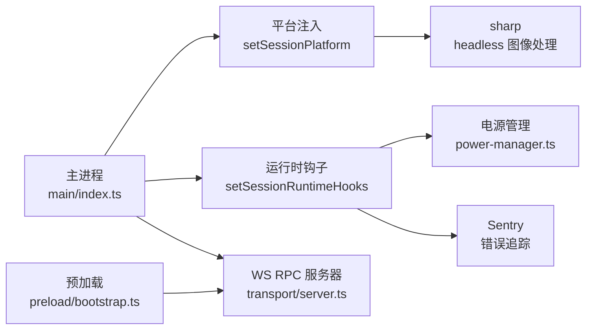

# 运行时管理

<cite>
**本文引用的文件**
- [apps/electron/src/runtime/platform.ts](file://apps/electron/src/runtime/platform.ts)
- [apps/electron/src/runtime/platform-headless.ts](file://apps/electron/src/runtime/platform-headless.ts)
- [apps/electron/src/main/index.ts](file://apps/electron/src/main/index.ts)
- [apps/electron/src/server/start.ts](file://apps/electron/src/server/start.ts)
- [apps/electron/src/preload/bootstrap.ts](file://apps/electron/src/preload/bootstrap.ts)
- [apps/electron/src/main/power-manager.ts](file://apps/electron/src/main/power-manager.ts)
- [apps/electron/src/main/notifications.ts](file://apps/electron/src/main/notifications.ts)
- [apps/electron/src/main/window-manager.ts](file://apps/electron/src/main/window-manager.ts)
- [apps/electron/src/transport/server.ts](file://apps/electron/src/transport/server.ts)
- [packages/server-core/src/runtime/platform.ts](file://packages/server-core/src/runtime/platform.ts)
- [packages/server-core/src/runtime/platform-headless.ts](file://packages/server-core/src/runtime/platform-headless.ts)
- [apps/cli/src/index.ts](file://apps/cli/src/index.ts)
</cite>

## 目录

1. [简介](#简介)
2. [项目结构](#项目结构)
3. [核心组件](#核心组件)
4. [架构总览](#架构总览)
5. [详细组件分析](#详细组件分析)
6. [依赖关系分析](#依赖关系分析)
7. [性能考虑](#性能考虑)
8. [故障排查指南](#故障排查指南)
9. [结论](#结论)
10. [附录](#附录)

## 简介

本文件面向 Craft Agents 运行时管理系统，系统支持两种运行形态：带界面（图形）与无界面（headless）。本文档聚焦以下主题：

- 运行时环境初始化流程：平台检测、资源配置、依赖注入
- headless 模式与图形界面模式的区别与切换机制
- 运行时钩子系统：生命周期事件、资源清理、异常处理
- 资源管理：内存、垃圾回收、文件句柄
- 安全沙箱与权限控制
- 性能监控与调优

## 项目结构

运行时相关代码主要分布在 Electron 主进程、渲染进程预加载脚本、服务端启动器以及跨平台运行时平台抽象层中。核心模块包括：

- 平台抽象与注入：server-core 的 PlatformServices 抽象，Electron 与 Headless 实现
- 主进程初始化：窗口管理、RPC 服务器、通知、电源管理、自动更新
- 预加载脚本：WebSocket RPC 客户端、能力桥接、传输状态上报
- CLI：本地服务器启动、参数解析、会话与消息发送

图表来源

- [apps/electron/src/main/index.ts](file://apps/electron/src/main/index.ts#L295-L720)
- [apps/electron/src/main/window-manager.ts](file://apps/electron/src/main/window-manager.ts#L53-L408)
- [apps/electron/src/main/notifications.ts](file://apps/electron/src/main/notifications.ts#L31-L296)
- [apps/electron/src/main/power-manager.ts](file://apps/electron/src/main/power-manager.ts#L25-L109)
- [apps/electron/src/preload/bootstrap.ts](file://apps/electron/src/preload/bootstrap.ts#L32-L165)
- [apps/electron/src/server/start.ts](file://apps/electron/src/server/start.ts#L17-L76)
- [packages/server-core/src/runtime/platform.ts](file://packages/server-core/src/runtime/platform.ts#L39-L65)
- [apps/electron/src/runtime/platform.ts](file://apps/electron/src/runtime/platform.ts#L1-L8)
- [packages/server-core/src/runtime/platform-headless.ts](file://packages/server-core/src/runtime/platform-headless.ts#L44-L89)

章节来源

- [apps/electron/src/main/index.ts](file://apps/electron/src/main/index.ts#L295-L720)
- [apps/electron/src/server/start.ts](file://apps/electron/src/server/start.ts#L17-L76)
- [packages/server-core/src/runtime/platform.ts](file://packages/server-core/src/runtime/platform.ts#L39-L65)

## 核心组件

- 平台抽象与注入
  - PlatformServices 接口定义了日志、图像处理、系统集成、应用元数据等能力，作为依赖注入的边界，使核心逻辑与平台实现解耦。
  - Electron 平台实现通过原生 API 提供系统集成功能；Headless 平台实现通过 sharp、控制台等替代方案提供能力。
- 主进程初始化
  - 在 app.whenReady 后完成资源打包路径设置、默认配置与种子数据初始化、RPC 服务器创建、事件广播管线建立、窗口恢复或创建、自动更新与通知初始化等。
- 预加载脚本
  - 基于 WebSocket 的 RPC 客户端连接主进程 RPC 服务器，构建客户端 API 代理，注册能力回调，上报传输状态到主进程。
- 服务端启动器（Headless）
  - 动态启动 headless 服务，注入平台能力、模型刷新服务、会话管理器、RPC 处理器注册与事件回推。

章节来源

- [packages/server-core/src/runtime/platform.ts](file://packages/server-core/src/runtime/platform.ts#L9-L85)
- [packages/server-core/src/runtime/platform-headless.ts](file://packages/server-core/src/runtime/platform-headless.ts#L44-L89)
- [apps/electron/src/runtime/platform.ts](file://apps/electron/src/runtime/platform.ts#L1-L8)
- [apps/electron/src/main/index.ts](file://apps/electron/src/main/index.ts#L364-L720)
- [apps/electron/src/preload/bootstrap.ts](file://apps/electron/src/preload/bootstrap.ts#L66-L165)
- [apps/electron/src/server/start.ts](file://apps/electron/src/server/start.ts#L17-L76)

## 架构总览

下图展示了从主进程到预加载、再到渲染层的运行时交互，以及 headless 模式的独立启动路径。

图表来源

- [apps/electron/src/main/index.ts](file://apps/electron/src/main/index.ts#L558-L643)
- [apps/electron/src/preload/bootstrap.ts](file://apps/electron/src/preload/bootstrap.ts#L66-L165)
- [apps/electron/src/transport/server.ts](file://apps/electron/src/transport/server.ts#L1-L2)

## 详细组件分析

### 平台抽象与依赖注入

- PlatformServices 接口
  - 日志、图像处理、系统集成（打开外部链接/路径、显示项）、应用生命周期（退出、深色模式）、可观测性（错误捕获、日志文件路径）。
- Electron 平台实现
  - 使用原生 Electron API（shell、nativeImage、nativeTheme、app）实现系统集成功能；图像处理基于 nativeImage；日志通过主进程日志器。
- Headless 平台实现
  - 使用 sharp 进行图像处理；控制台输出日志；GUI 方法留空（由处理器侧进行可选链保护或能力路由）。

图表来源

- [packages/server-core/src/runtime/platform.ts](file://packages/server-core/src/runtime/platform.ts#L9-L85)
- [packages/server-core/src/runtime/platform-headless.ts](file://packages/server-core/src/runtime/platform-headless.ts#L44-L89)
- [apps/electron/src/runtime/platform.ts](file://apps/electron/src/runtime/platform.ts#L1-L8)

章节来源

- [packages/server-core/src/runtime/platform.ts](file://packages/server-core/src/runtime/platform.ts#L39-L65)
- [packages/server-core/src/runtime/platform-headless.ts](file://packages/server-core/src/runtime/platform-headless.ts#L44-L89)
- [apps/electron/src/runtime/platform.ts](file://apps/electron/src/runtime/platform.ts#L1-L8)

### headless 模式与图形界面模式

- 切换机制
  - 图形界面模式：主进程在 app.whenReady 后创建窗口管理器、RPC 服务器、事件广播，并创建初始窗口。
  - Headless 模式：通过环境变量触发 headless 启动流程，动态导入 headless 启动器，仅运行服务端逻辑，不创建窗口。
- 关键差异
  - GUI 能力：图形模式提供 openPath/openExternal/showItemInFolder/quit/systemDarkMode 等；headless 模式这些方法留空，由处理器侧保护。
  - 事件传播：图形模式通过窗口管理器与 RPC 事件通道双向联动；headless 模式通过控制台输出连接信息与令牌。
  - 电源与通知：图形模式启用电源管理与系统通知；headless 模式不启用。

图表来源

- [apps/electron/src/main/index.ts](file://apps/electron/src/main/index.ts#L375-L649)
- [apps/electron/src/server/start.ts](file://apps/electron/src/server/start.ts#L17-L76)

章节来源

- [apps/electron/src/main/index.ts](file://apps/electron/src/main/index.ts#L375-L649)
- [apps/electron/src/server/start.ts](file://apps/electron/src/server/start.ts#L17-L76)

### 运行时钩子系统（生命周期、清理、异常）

- 生命周期钩子
  - 会话开始/结束：通过 setSessionRuntimeHooks 注入 onSessionStarted/onSessionStopped，用于电源管理等。
  - 应用退出前清理：before-quit 中 flush 所有会话写入、清理会话管理器、浏览器面板实例、OAuth 流程存储、停止模型刷新计时器。
- 异常处理
  - Sentry 错误追踪：主进程初始化 Sentry，过滤敏感头与面包屑；在钩子中通过 captureException 上报错误并附加标签（如 provider 类型、认证类型等）。
  - 预加载传输状态上报：将连接失败/重连等状态同步到主进程日志，便于定位问题。

图表来源

- [apps/electron/src/main/index.ts](file://apps/electron/src/main/index.ts#L480-L496)
- [apps/electron/src/main/power-manager.ts](file://apps/electron/src/main/power-manager.ts#L55-L70)
- [apps/electron/src/main/notifications.ts](file://apps/electron/src/main/notifications.ts#L152-L167)

章节来源

- [apps/electron/src/main/index.ts](file://apps/electron/src/main/index.ts#L480-L496)
- [apps/electron/src/main/power-manager.ts](file://apps/electron/src/main/power-manager.ts#L55-L70)
- [apps/electron/src/main/notifications.ts](file://apps/electron/src/main/notifications.ts#L152-L167)

### 资源管理（内存、GC、文件句柄）

- 内存与 GC
  - 采用 Bun/Node 运行时，遵循各自 GC 行为；headless 模式通过 sharp 处理图像，注意及时释放缓冲区。
- 文件句柄
  - 会话写入：before-quit 阶段 flushAllSessions，确保未落盘数据持久化。
  - 客户端资源清理：清理单个客户端的文件监视器，避免句柄泄漏。
- 图像处理
  - Electron 使用 nativeImage；headless 使用 sharp，支持 resize/format/quality 等选项。

章节来源

- [apps/electron/src/main/index.ts](file://apps/electron/src/main/index.ts#L777-L800)
- [apps/electron/src/server/start.ts](file://apps/electron/src/server/start.ts#L63-L70)
- [packages/server-core/src/runtime/platform-headless.ts](file://packages/server-core/src/runtime/platform-headless.ts#L60-L74)

### 安全沙箱与权限控制

- 权限与隔离
  - 平台抽象屏蔽 GUI 能力（headless 模式），处理器侧以可选链保护或能力路由规避直接调用。
  - 预加载脚本对非本地 ws 连接强制要求 wss，防止明文令牌泄露。
- 敏感信息处理
  - Sentry 自动脱敏请求头与面包屑中的敏感字段；主进程日志对敏感上下文进行脱敏。
- 传输安全
  - 非本地 ws:// 连接被拒绝，必须使用 wss；必要时在服务端启用 TLS。

章节来源

- [apps/electron/src/preload/bootstrap.ts](file://apps/electron/src/preload/bootstrap.ts#L45-L54)
- [apps/electron/src/main/index.ts](file://apps/electron/src/main/index.ts#L30-L58)

### 性能监控与调优

- 性能开关
  - 开发模式启用调试与性能统计；通过环境变量控制 headless 模式日志级别。
- 传输与事件
  - 预加载上报连接状态（连接/重连/断开），辅助定位网络抖动与超时问题。
- 电源与显示
  - 会话处理期间保持屏幕唤醒，避免因系统节能导致任务中断。
- 自动更新
  - 后台下载、缓存检测、进度广播，减少用户感知的中断。

章节来源

- [apps/electron/src/main/index.ts](file://apps/electron/src/main/index.ts#L105-L110)
- [apps/electron/src/preload/bootstrap.ts](file://apps/electron/src/preload/bootstrap.ts#L121-L157)
- [apps/electron/src/main/power-manager.ts](file://apps/electron/src/main/power-manager.ts#L25-L79)
- [apps/electron/src/main/auto-update.ts](file://apps/electron/src/main/auto-update.ts#L129-L221)

## 依赖关系分析

- 组件耦合
  - 主进程通过 setSessionPlatform/setSessionRuntimeHooks 将平台与运行时钩子注入核心子系统，降低平台耦合度。
  - 预加载与主进程通过 IPC/WS 通信，职责清晰：预加载负责桥接与传输状态上报，主进程负责业务处理与系统集成。
- 外部依赖
  - Electron 原生模块（shell、nativeImage、nativeTheme、powerSaveBlocker、Notification 等）
  - sharp（headless 图像处理）
  - Sentry（错误追踪与脱敏）

图表来源

- [apps/electron/src/main/index.ts](file://apps/electron/src/main/index.ts#L477-L496)
- [apps/electron/src/preload/bootstrap.ts](file://apps/electron/src/preload/bootstrap.ts#L66-L100)
- [apps/electron/src/main/power-manager.ts](file://apps/electron/src/main/power-manager.ts#L37-L70)
- [packages/server-core/src/runtime/platform-headless.ts](file://packages/server-core/src/runtime/platform-headless.ts#L60-L74)

章节来源

- [apps/electron/src/main/index.ts](file://apps/electron/src/main/index.ts#L477-L496)
- [apps/electron/src/preload/bootstrap.ts](file://apps/electron/src/preload/bootstrap.ts#L66-L100)

## 性能考虑

- 传输层
  - 使用 WebSocket RPC，连接状态实时上报，便于快速发现网络问题。
- 图像处理
  - headless 使用 sharp，支持按需 resize/format/quality，避免不必要的大图处理。
- 会话写入
  - 退出前 flushAllSessions，避免频繁小写入造成磁盘压力。
- 电源管理
  - 会话处理期间保持屏幕唤醒，减少因系统节能导致的任务中断与重试成本。

## 故障排查指南

- 连接问题
  - 非本地 ws:// 被拒绝：检查服务端是否启用 TLS 或改为 wss。
  - 连接状态异常：查看预加载上报的连接状态（连接/重连/断开）与错误原因。
- 会话无法结束
  - 检查 before-quit 是否正常执行 flushAllSessions 与 cleanup。
- 图像处理失败
  - headless 模式确认 sharp 可用；Electron 模式确认 nativeImage 输入有效。
- 权限与能力
  - headless 模式 GUI 能力不可用属预期，处理器侧应进行可选链保护。

章节来源

- [apps/electron/src/preload/bootstrap.ts](file://apps/electron/src/preload/bootstrap.ts#L121-L157)
- [apps/electron/src/main/index.ts](file://apps/electron/src/main/index.ts#L777-L800)
- [packages/server-core/src/runtime/platform-headless.ts](file://packages/server-core/src/runtime/platform-headless.ts#L60-L74)

## 结论

Craft Agents 运行时通过平台抽象与依赖注入实现了跨平台一致性，主进程负责系统级能力与生命周期管理，预加载负责传输与桥接，headless 模式则专注于服务端能力与最小化资源占用。结合电源管理、错误追踪与自动更新，系统在可用性与稳定性方面具备良好表现。建议在生产环境中启用 TLS、合理配置日志级别与 Sentry 脱敏规则，并关注图像处理与会话写入的性能瓶颈。

## 附录

- CLI 运行时行为
  - CLI 支持本地服务器启动、参数解析、会话创建与消息发送、超时与清理策略等，适用于 headless 场景下的自动化与测试。

章节来源

- [apps/cli/src/index.ts](file://apps/cli/src/index.ts#L578-L662)
