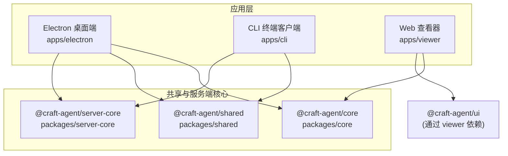
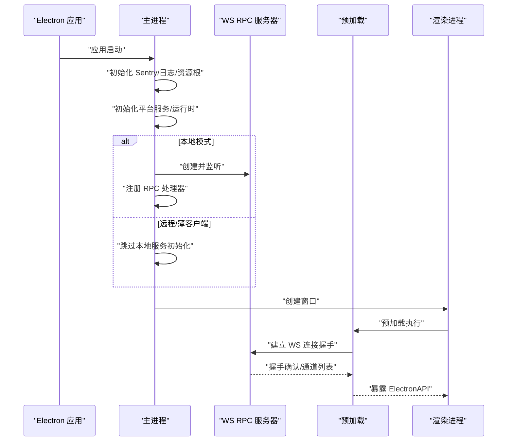
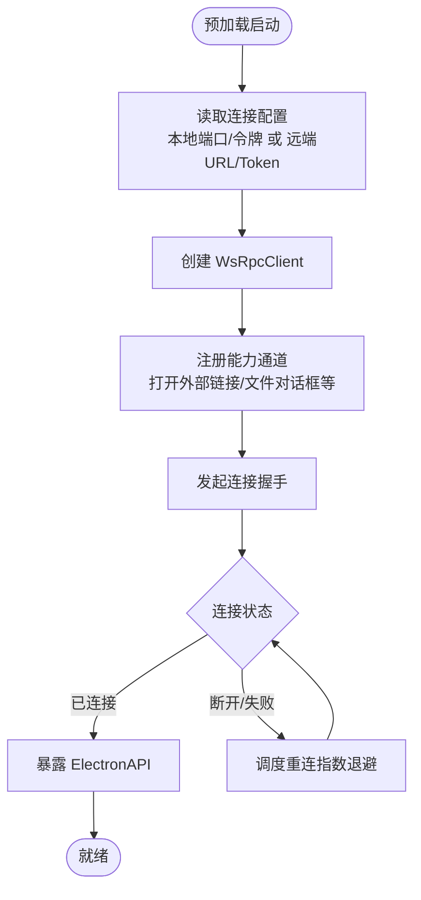
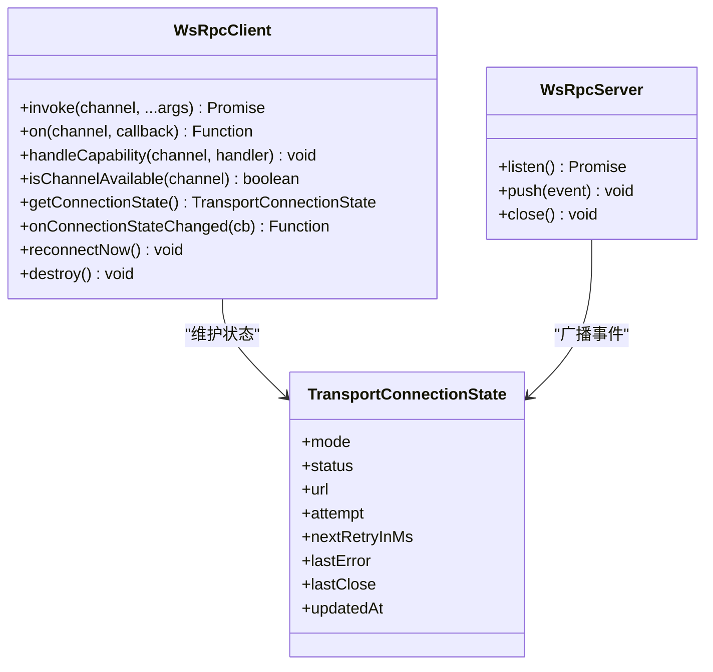
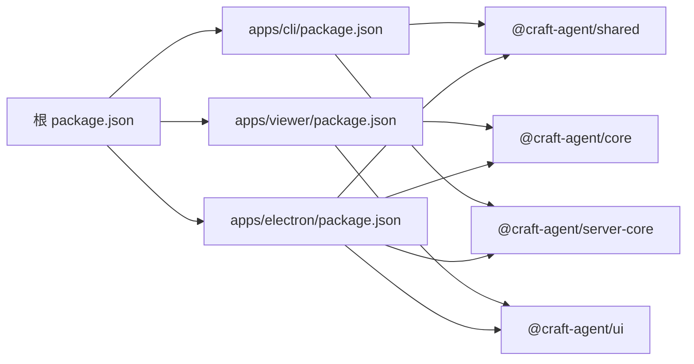
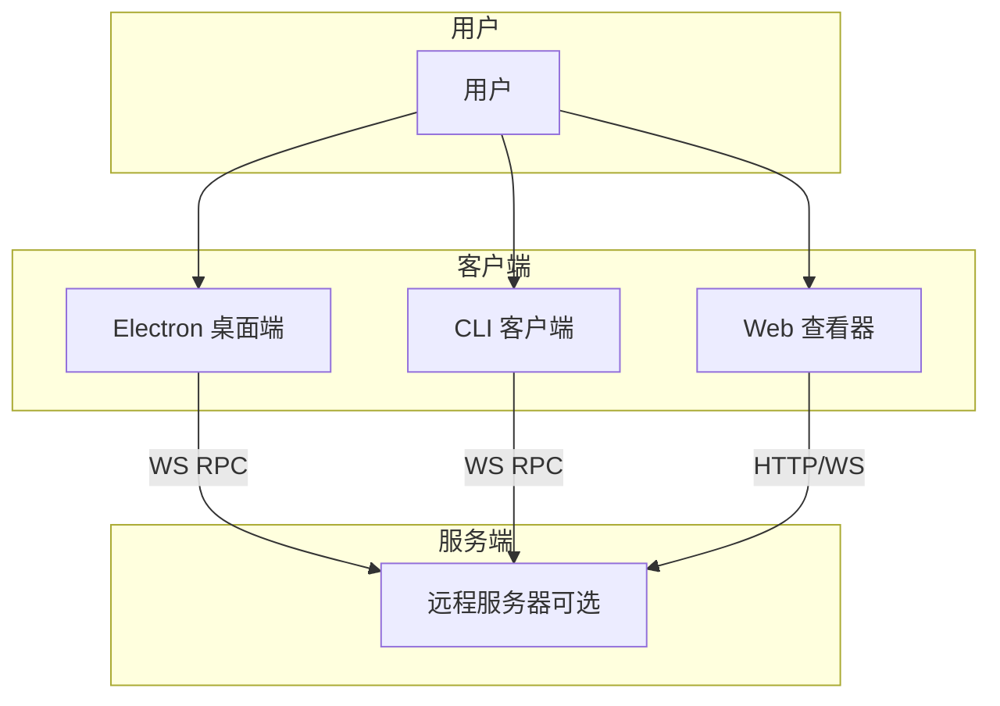

# 架构设计

<cite>
**本文引用的文件**
- [README.md](file://README.md)
- [package.json](file://package.json)
- [apps/electron/package.json](file://apps/electron/package.json)
- [apps/cli/package.json](file://apps/cli/package.json)
- [apps/viewer/package.json](file://apps/viewer/package.json)
- [apps/electron/src/main/index.ts](file://apps/electron/src/main/index.ts)
- [apps/electron/src/renderer/main.tsx](file://apps/electron/src/renderer/main.tsx)
- [apps/electron/src/preload/bootstrap.ts](file://apps/electron/src/preload/bootstrap.ts)
- [apps/electron/src/transport/index.ts](file://apps/electron/src/transport/index.ts)
- [apps/electron/src/transport/server.ts](file://apps/electron/src/transport/server.ts)
- [apps/electron/src/transport/client.ts](file://apps/electron/src/transport/client.ts)
- [apps/electron/src/shared/types.ts](file://apps/electron/src/shared/types.ts)
- [packages/shared/src/index.ts](file://packages/shared/src/index.ts)
- [packages/server-core/src/index.ts](file://packages/server-core/src/index.ts)
- [packages/core/src/index.ts](file://packages/core/src/index.ts)
</cite>

## 目录

1. [引言](#引言)
2. [项目结构](#项目结构)
3. [核心组件](#核心组件)
4. [架构总览](#架构总览)
5. [详细组件分析](#详细组件分析)
6. [依赖分析](#依赖分析)
7. [性能考量](#性能考量)
8. [故障排查指南](#故障排查指南)
9. [结论](#结论)
10. [附录](#附录)

## 引言

本架构设计文档面向 Craft Agents 的整体系统，聚焦于分层架构与跨进程通信设计：Electron 主进程负责应用生命周期、系统服务与本地/远程会话运行时；渲染进程承载 React UI；共享业务逻辑层（packages/shared）提供跨主/渲染/服务器复用的领域能力。文档阐述组件交互关系、数据流与集成模式，解释技术决策、权衡与约束，并给出基础设施要求、可扩展性与部署拓扑建议。

## 项目结构

仓库采用 Monorepo 结构，按功能域划分工作区：

- apps：应用层
  - electron：桌面端 Electron 应用（主/预加载/渲染）
  - cli：终端客户端
  - viewer：Web 会话查看器
- packages：共享与服务端核心
  - core：类型与工具
  - shared：业务逻辑（会话、认证、凭据、源、配置等）
  - server-core：RPC 传输、运行时、处理器引导
  - 其他服务端子包（如 server、pi-agent-server 等）



图表来源

- [package.json](file://package.json#L7-L11)
- [apps/electron/package.json](file://apps/electron/package.json#L39-L78)
- [apps/cli/package.json](file://apps/cli/package.json#L15-L18)
- [apps/viewer/package.json](file://apps/viewer/package.json#L13-L18)

章节来源

- [package.json](file://package.json#L7-L11)
- [README.md](file://README.md#L343-L366)

## 核心组件

- Electron 主进程（apps/electron/src/main/index.ts）
  - 负责应用初始化、窗口管理、通知、自动更新、深链处理、平台服务注入、RPC 服务器（本地模式）与事件广播。
- 预加载脚本（apps/electron/src/preload/bootstrap.ts）
  - 建立 WebSocket RPC 客户端，桥接主进程对话框能力，暴露安全的 ElectronAPI 到渲染进程。
- 渲染进程（apps/electron/src/renderer/main.tsx）
  - 初始化 Sentry（双端）、主题与全局状态，挂载 React 应用。
- 传输层（apps/electron/src/transport/\* 与 packages/server-core/transport）
  - WebSocket RPC 协议实现（握手、请求/响应、事件订阅、自动重连、通道可用性检查）。
- 共享业务逻辑（packages/shared）
  - 会话、认证、凭据、源、配置、工作区、提示词、验证等跨层复用模块。
- 服务器核心（packages/server-core）
  - RPC 传输抽象、运行时注入、处理器注册、会话管理器等。

章节来源

- [apps/electron/src/main/index.ts](file://apps/electron/src/main/index.ts#L295-L738)
- [apps/electron/src/preload/bootstrap.ts](file://apps/electron/src/preload/bootstrap.ts#L1-L314)
- [apps/electron/src/renderer/main.tsx](file://apps/electron/src/renderer/main.tsx#L1-L113)
- [apps/electron/src/transport/client.ts](file://apps/electron/src/transport/client.ts#L1-L728)
- [packages/shared/src/index.ts](file://packages/shared/src/index.ts#L1-L33)
- [packages/server-core/src/index.ts](file://packages/server-core/src/index.ts#L1-L5)

## 架构总览

系统采用“主进程 + 预加载 + 渲染进程”的经典 Electron 分层，结合“共享业务逻辑层”与“RPC 传输层”，形成清晰的职责边界与复用路径。主进程在本地模式下内嵌 RPC 服务器，渲染进程通过预加载脚本建立 WebSocket 连接，调用统一的 RPC 通道完成会话、源、设置等操作；在远程模式下，渲染进程连接到远端服务器，主进程仅作为薄客户端。

```mermaid
graph TB
subgraph "主进程"
MP["Electron 主进程<br/>apps/electron/src/main/index.ts"]
RPCS["WS RPC 服务器<br/>packages/server-core/transport"]
WM["窗口管理"]
NM["通知/徽章"]
AU["自动更新"]
end
subgraph "预加载"
PL["预加载脚本<br/>apps/electron/src/preload/bootstrap.ts"]
WS["WS RPC 客户端"]
end
subgraph "渲染进程"
RND["React 应用<br/>apps/electron/src/renderer/main.tsx"]
API["ElectronAPI 接口"]
end
subgraph "共享层"
SH["@craft-agent/shared"]
SRV_CORE["@craft-agent/server-core"]
CORE["@craft-agent/core"]
end
RND --> API
API --> PL
PL <- --> WS
WS <- --> RPCS
RPCS --> MP
MP --> WM
MP --> NM
MP --> AU
API --> SH
API --> SRV_CORE
API --> CORE
```

图表来源

- [apps/electron/src/main/index.ts](file://apps/electron/src/main/index.ts#L371-L643)
- [apps/electron/src/preload/bootstrap.ts](file://apps/electron/src/preload/bootstrap.ts#L32-L100)
- [apps/electron/src/renderer/main.tsx](file://apps/electron/src/renderer/main.tsx#L1-L113)
- [apps/electron/src/transport/index.ts](file://apps/electron/src/transport/index.ts#L1-L6)
- [packages/server-core/src/index.ts](file://packages/server-core/src/index.ts#L1-L5)
- [packages/shared/src/index.ts](file://packages/shared/src/index.ts#L1-L33)
- [packages/core/src/index.ts](file://packages/core/src/index.ts#L1-L16)

## 详细组件分析

### 组件 A：主进程（应用生命周期与 RPC 服务器）

- 职责
  - 初始化 Sentry、日志、资源根目录、后端运行时、模型刷新服务、通知与徽章、浏览器面板管理、深链与缩略协议。
  - 在本地模式创建并监听 WS RPC 服务器，注册 RPC 处理器，向渲染进程广播事件。
  - 在远程/薄客户端模式跳过本地服务初始化，仅创建窗口。
- 关键流程
  - 应用启动 → 注册协议/深链 → 初始化平台服务与运行时 → 可选创建 RPC 服务器 → 注册处理器 → 创建初始窗口 → 启动模型刷新。
  - 事件广播：会话事件、菜单事件、通知事件经由 EventSink 推送至渲染进程。
- 错误与安全
  - Sentry 初始化与用户标识；敏感头与面包屑脱敏；深链与协议注册时机严格前置。
- 性能与可靠性
  - 会话写入在退出前 flush；浏览器实例销毁；OAuth 流程存储清理。



图表来源

- [apps/electron/src/main/index.ts](file://apps/electron/src/main/index.ts#L295-L643)
- [apps/electron/src/preload/bootstrap.ts](file://apps/electron/src/preload/bootstrap.ts#L32-L100)

章节来源

- [apps/electron/src/main/index.ts](file://apps/electron/src/main/index.ts#L295-L738)

### 组件 B：预加载与 RPC 客户端

- 职责
  - 获取本地 RPC 端口/令牌或使用环境变量连接远端服务器；建立 WsRpcClient；注册能力通道（打开外部链接、文件对话框等）；桥接主进程能力；上报传输状态。
- 关键流程
  - 读取连接参数 → 创建客户端 → 注册能力 → 连接 → 订阅传输状态 → 暴露 ElectronAPI。
- 安全与隔离
  - 远程非本地连接强制 wss://；OAuth 回调本地监听；能力通道最小化暴露。
- 可靠性
  - 自动重连（指数退避）；请求超时；通道可用性检查；错误分类与状态上报。



图表来源

- [apps/electron/src/preload/bootstrap.ts](file://apps/electron/src/preload/bootstrap.ts#L32-L100)
- [apps/electron/src/transport/client.ts](file://apps/electron/src/transport/client.ts#L263-L334)

章节来源

- [apps/electron/src/preload/bootstrap.ts](file://apps/electron/src/preload/bootstrap.ts#L1-L314)
- [apps/electron/src/transport/client.ts](file://apps/electron/src/transport/client.ts#L1-L728)

### 组件 C：渲染进程（React UI）

- 职责
  - 初始化 Sentry（双端）、主题提供者、全局状态（Jotai），渲染应用入口。
- 与主/预加载交互
  - 通过 ElectronAPI 调用 RPC 通道；订阅会话事件、未读摘要、深链导航等。
- 错误边界
  - 使用 Sentry ErrorBoundary 提供崩溃兜底 UI。

章节来源

- [apps/electron/src/renderer/main.tsx](file://apps/electron/src/renderer/main.tsx#L1-L113)
- [apps/electron/src/shared/types.ts](file://apps/electron/src/shared/types.ts#L205-L559)

### 组件 D：共享业务逻辑层（packages/shared）

- 职责
  - 会话持久化与状态管理、认证与 OAuth、凭据加密存储、源（MCP/API/本地）管理、工作区组织、配置与偏好、提示词、验证与版本管理等。
- 设计要点
  - 以子路径导出模块，避免渲染进程直接引入重型 SDK；在主进程注入平台服务（图像处理、日志、搜索等）。
- 与 Electron 集成
  - 通过 @craft-agent/server-core 注入平台服务；在主进程初始化阶段设置。

章节来源

- [packages/shared/src/index.ts](file://packages/shared/src/index.ts#L1-L33)
- [apps/electron/src/main/index.ts](file://apps/electron/src/main/index.ts#L476-L496)

### 组件 E：RPC 传输层（客户端/服务器）

- 职责
  - 握手（协议版本、工作区/窗口上下文、令牌、能力声明）、请求/响应、事件订阅、能力调用（服务端→客户端）、自动重连与错误分类。
- 协议与通道
  - 通过 CHANNEL_MAP 映射通道；WsRpcServer/WsRpcClient 实现统一消息编解码与状态机。
- 可靠性
  - 请求超时、最大重连延迟、连接状态监听、通道可用性探测。



图表来源

- [apps/electron/src/transport/client.ts](file://apps/electron/src/transport/client.ts#L61-L71)
- [apps/electron/src/transport/server.ts](file://apps/electron/src/transport/server.ts#L1-L2)
- [apps/electron/src/transport/index.ts](file://apps/electron/src/transport/index.ts#L1-L6)

章节来源

- [apps/electron/src/transport/client.ts](file://apps/electron/src/transport/client.ts#L1-L728)
- [apps/electron/src/transport/index.ts](file://apps/electron/src/transport/index.ts#L1-L6)

## 依赖分析

- 应用层依赖
  - Electron 应用依赖 @craft-agent/core、@craft-agent/shared、@craft-agent/server-core、@craft-agent/ui 等工作区包。
  - CLI 依赖 @craft-agent/shared 与 @craft-agent/server-core。
  - Viewer 依赖 @craft-agent/core 与 @craft-agent/ui。
- 第三方依赖
  - Electron、React、Sentry（主/渲染/预加载）、@anthropic-ai/claude-agent-sdk、@mariozechner/pi-coding-agent 等。
- 版本与构建
  - 使用 Bun 作为运行时与构建工具；Electron 打包使用 electron-builder；主进程使用 esbuild，渲染进程使用 Vite。



图表来源

- [apps/electron/package.json](file://apps/electron/package.json#L39-L78)
- [apps/cli/package.json](file://apps/cli/package.json#L15-L18)
- [apps/viewer/package.json](file://apps/viewer/package.json#L13-L18)
- [package.json](file://package.json#L7-L11)

章节来源

- [apps/electron/package.json](file://apps/electron/package.json#L1-L80)
- [apps/cli/package.json](file://apps/cli/package.json#L1-L25)
- [apps/viewer/package.json](file://apps/viewer/package.json#L1-L37)
- [package.json](file://package.json#L108-L167)

## 性能考量

- 本地模式
  - 主进程内嵌 WS RPC 服务器，渲染进程与主进程在同一机器，延迟低；但需注意会话写盘与资源释放（退出前 flush、清理浏览器实例、OAuth 存储）。
- 远程/薄客户端模式
  - 渲染进程连接远端服务器，预加载负责传输状态上报与重连；建议使用 wss:// 并启用 TLS。
- 传输层优化
  - 请求超时、自动重连（指数退避）、通道可用性检查；避免在渲染进程直接引入重型模块，减少首屏与内存占用。
- 日志与监控
  - 主/渲染双端 Sentry 初始化，脱敏敏感信息；调试模式下输出详细日志路径。

[本节为通用指导，不直接分析具体文件]

## 故障排查指南

- 连接问题
  - 检查预加载是否正确读取本地端口/令牌或远端 URL/Token；确认握手是否成功；查看传输状态回调与主进程日志。
- OAuth 流程
  - 确认本地回调服务器端口可用；服务端已准备流程并返回授权 URL；用户同意后回调正确到达并完成令牌交换。
- 凭据与健康检查
  - 启动时进行凭据健康检查，若异常在设置页提示；必要时清理无效凭据。
- 安全与合规
  - 远程连接必须使用 wss://；敏感头与面包屑在主/渲染两端均进行脱敏；避免在渲染进程直接暴露主进程能力。

章节来源

- [apps/electron/src/preload/bootstrap.ts](file://apps/electron/src/preload/bootstrap.ts#L39-L54)
- [apps/electron/src/main/index.ts](file://apps/electron/src/main/index.ts#L654-L666)

## 结论

Craft Agents 采用 Electron 主/渲染分层与共享业务逻辑层相结合的架构，通过统一的 WebSocket RPC 传输实现跨进程通信。主进程在本地模式内嵌服务，渲染进程专注 UI 与交互；共享层提供会话、认证、源与配置等跨层能力。该设计在保证用户体验的同时，兼顾了可扩展性与安全性，并支持远程薄客户端部署模式。

[本节为总结性内容，不直接分析具体文件]

## 附录

### 系统上下文图（概念性）



[此图为概念性示意，不对应具体代码文件]

### 技术栈与版本兼容性

- 运行时与构建
  - Bun（运行时与脚本）、esbuild（主进程）、Vite（渲染进程）、electron-builder（打包）。
- 桌面与 UI
  - Electron、React、shadcn/ui、Tailwind CSS v4。
- AI 与 SDK
  - @anthropic-ai/claude-agent-sdk、Pi SDK（@mariozechner/pi-coding-agent）。
- 监控与日志
  - @sentry/electron、@sentry/react、electron-log。
- 第三方依赖示例（部分）
  - @radix-ui、@tiptap、react-markdown、ws、sharp、jotai、zod 等。

章节来源

- [README.md](file://README.md#L569-L580)
- [package.json](file://package.json#L108-L167)
