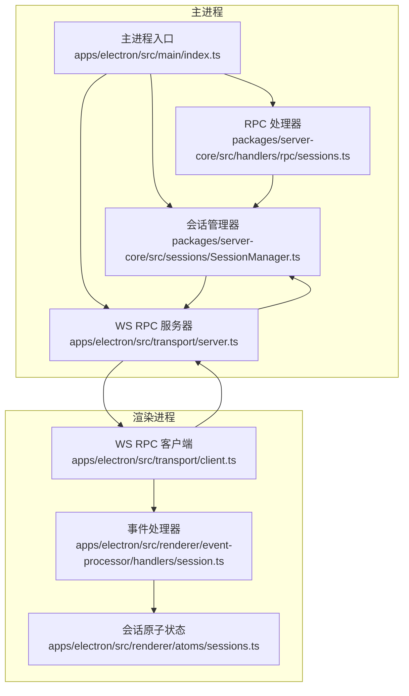
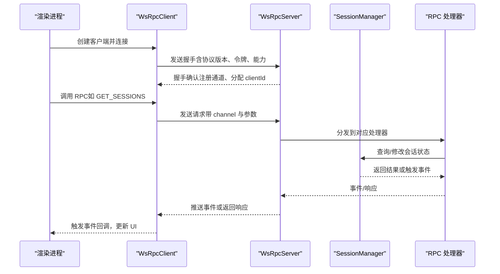
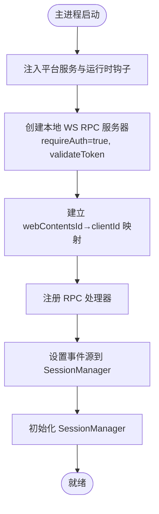
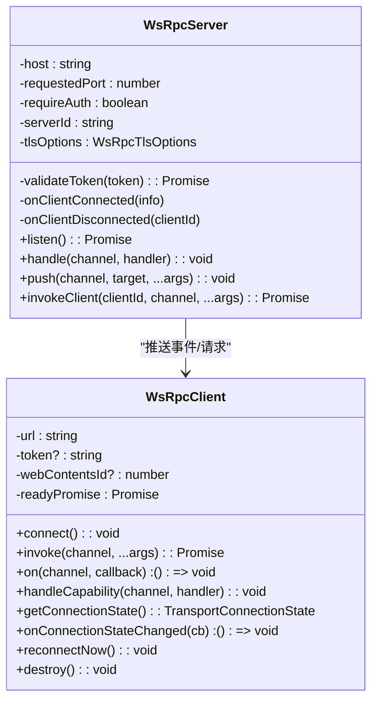
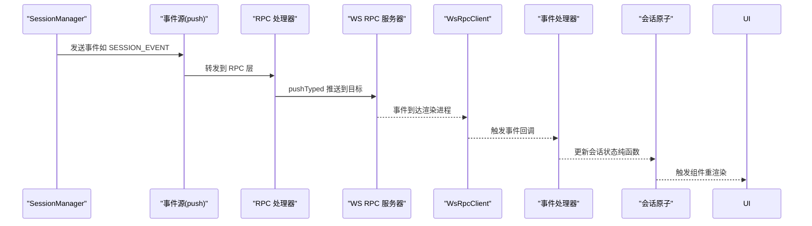
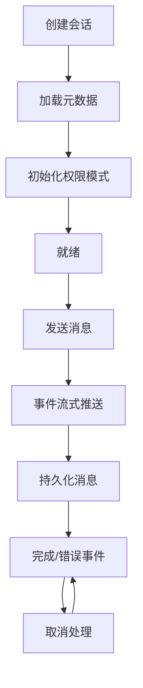
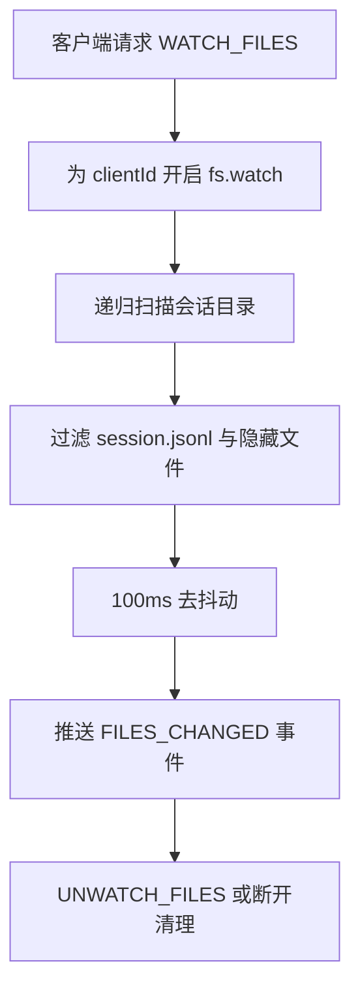
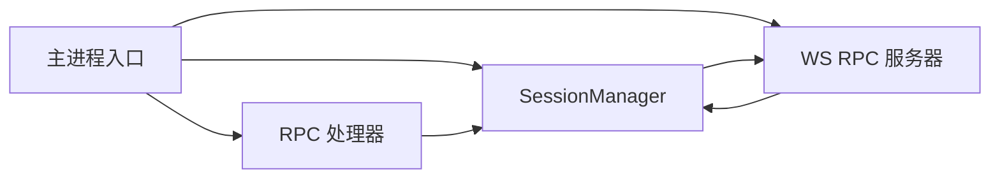

# 会话管理集成

<cite>
**本文档引用的文件**
- [apps/electron/src/main/index.ts](file://apps/electron/src/main/index.ts)
- [packages/server-core/src/sessions/SessionManager.ts](file://packages/server-core/src/sessions/SessionManager.ts)
- [packages/server-core/src/handlers/rpc/sessions.ts](file://packages/server-core/src/handlers/rpc/sessions.ts)
- [apps/electron/src/transport/server.ts](file://apps/electron/src/transport/server.ts)
- [apps/electron/src/transport/client.ts](file://apps/electron/src/transport/client.ts)
- [apps/electron/src/renderer/event-processor/handlers/session.ts](file://apps/electron/src/renderer/event-processor/handlers/session.ts)
- [apps/electron/src/renderer/atoms/sessions.ts](file://apps/electron/src/renderer/atoms/sessions.ts)
- [apps/electron/src/server/start.ts](file://apps/electron/src/server/start.ts)
</cite>

## 目录

1. [简介](#简介)
2. [项目结构](#项目结构)
3. [核心组件](#核心组件)
4. [架构总览](#架构总览)
5. [详细组件分析](#详细组件分析)
6. [依赖关系分析](#依赖关系分析)
7. [性能考虑](#性能考虑)
8. [故障排除指南](#故障排除指南)
9. [结论](#结论)

## 简介

本文件系统性阐述 Craft Agents 会话管理集成的设计与实现，重点覆盖以下方面：

- 主进程与 SessionManager 的协作：会话生命周期管理、事件传播与状态同步
- WebSocket RPC 服务器的配置与管理：本地连接、身份验证、客户端映射
- 事件源注入机制：如何将会话事件通过 RPC 服务器推送到渲染进程
- 关键功能：会话持久化、文件监控清理、客户端断开处理
- 配置选项、性能监控与故障排除建议

## 项目结构

围绕会话管理的关键模块分布如下：

- 主进程入口与服务装配：负责初始化 SessionManager、构建 RPC 服务器、注册处理器并注入事件源
- 会话管理器：负责会话生命周期、消息持久化、外部变更监听、权限与认证流程
- RPC 处理器：定义会话相关 RPC 接口（获取会话、发送消息、文件监控等）
- 传输层：WebSocket RPC 客户端/服务器实现，支持握手、鉴权、重连与事件推送
- 渲染进程事件处理器：将推送事件转换为 UI 状态更新
- 原子状态管理：基于 Jotai 的会话原子家族，隔离更新、优化渲染性能

**图表来源**

- [apps/electron/src/main/index.ts](file://apps/electron/src/main/index.ts#L558-L643)
- [packages/server-core/src/sessions/SessionManager.ts](file://packages/server-core/src/sessions/SessionManager.ts#L834-L883)
- [packages/server-core/src/handlers/rpc/sessions.ts](file://packages/server-core/src/handlers/rpc/sessions.ts#L105-L103)
- [apps/electron/src/transport/server.ts](file://apps/electron/src/transport/server.ts#L1-L2)
- [apps/electron/src/transport/client.ts](file://apps/electron/src/transport/client.ts#L101-L151)
- [apps/electron/src/renderer/event-processor/handlers/session.ts](file://apps/electron/src/renderer/event-processor/handlers/session.ts#L1-L800)
- [apps/electron/src/renderer/atoms/sessions.ts](file://apps/electron/src/renderer/atoms/sessions.ts#L117-L185)

**章节来源**

- [apps/electron/src/main/index.ts](file://apps/electron/src/main/index.ts#L558-L643)
- [packages/server-core/src/sessions/SessionManager.ts](file://packages/server-core/src/sessions/SessionManager.ts#L834-L883)
- [packages/server-core/src/handlers/rpc/sessions.ts](file://packages/server-core/src/handlers/rpc/sessions.ts#L105-L103)
- [apps/electron/src/transport/server.ts](file://apps/electron/src/transport/server.ts#L1-L2)
- [apps/electron/src/transport/client.ts](file://apps/electron/src/transport/client.ts#L101-L151)
- [apps/electron/src/renderer/event-processor/handlers/session.ts](file://apps/electron/src/renderer/event-processor/handlers/session.ts#L1-L800)
- [apps/electron/src/renderer/atoms/sessions.ts](file://apps/electron/src/renderer/atoms/sessions.ts#L117-L185)

## 核心组件

- 主进程入口与平台注入
  - 初始化 SessionManager、模型刷新服务、通知与电源管理
  - 构建本地 WS RPC 服务器，启用令牌鉴权，建立客户端映射
  - 注册 RPC 处理器，设置事件源，启动会话管理器初始化
- 会话管理器（SessionManager）
  - 负责会话生命周期：加载、创建、删除、取消、持久化
  - 维护会话状态与消息队列，处理权限请求、凭据请求与认证完成
  - 监听工作区配置变化，广播源、标签、状态等变更
  - 提供读写接口给 RPC 层，支持批量增量事件推送
- RPC 处理器（sessions.ts）
  - 暴露会话相关 RPC 接口：获取会话列表、消息、创建、删除、发送消息、取消、文件监控等
  - 实现 per-client 文件监控与去抖动推送
  - 将错误与完成事件回传到调用客户端
- 传输层（WsRpcServer/WsRpcClient）
  - 支持握手、协议版本检查、令牌鉴权、超时与自动重连
  - 事件推送采用目标定向（按客户端/窗口/工作区）分发
- 渲染进程事件处理器与状态原子
  - 将事件转换为纯函数式状态更新，避免副作用
  - 使用 Jotai 原子家族隔离每个会话的状态，提升渲染性能

**章节来源**

- [apps/electron/src/main/index.ts](file://apps/electron/src/main/index.ts#L377-L643)
- [packages/server-core/src/sessions/SessionManager.ts](file://packages/server-core/src/sessions/SessionManager.ts#L834-L1599)
- [packages/server-core/src/handlers/rpc/sessions.ts](file://packages/server-core/src/handlers/rpc/sessions.ts#L105-L449)
- [apps/electron/src/transport/server.ts](file://apps/electron/src/transport/server.ts#L1-L2)
- [apps/electron/src/transport/client.ts](file://apps/electron/src/transport/client.ts#L101-L728)
- [apps/electron/src/renderer/event-processor/handlers/session.ts](file://apps/electron/src/renderer/event-processor/handlers/session.ts#L1-L874)
- [apps/electron/src/renderer/atoms/sessions.ts](file://apps/electron/src/renderer/atoms/sessions.ts#L117-L559)

## 架构总览

主进程在本地启动 WS RPC 服务器，使用随机令牌进行本地鉴权；渲染进程通过 WsRpcClient 连接，握手阶段携带工作区与 webContentsId；SessionManager 作为业务中枢，接收 RPC 请求并驱动会话生命周期，同时通过事件源将事件推送给所有渲染进程。

**图表来源**

- [apps/electron/src/transport/client.ts](file://apps/electron/src/transport/client.ts#L297-L471)
- [apps/electron/src/transport/server.ts](file://apps/electron/src/transport/server.ts#L1-L2)
- [packages/server-core/src/handlers/rpc/sessions.ts](file://packages/server-core/src/handlers/rpc/sessions.ts#L109-L184)
- [packages/server-core/src/sessions/SessionManager.ts](file://packages/server-core/src/sessions/SessionManager.ts#L834-L883)

**章节来源**

- [apps/electron/src/transport/client.ts](file://apps/electron/src/transport/client.ts#L297-L471)
- [apps/electron/src/transport/server.ts](file://apps/electron/src/transport/server.ts#L1-L2)
- [packages/server-core/src/handlers/rpc/sessions.ts](file://packages/server-core/src/handlers/rpc/sessions.ts#L109-L184)
- [packages/server-core/src/sessions/SessionManager.ts](file://packages/server-core/src/sessions/SessionManager.ts#L834-L883)

## 详细组件分析

### 主进程与 SessionManager 协作

- 初始化与平台注入
  - 设置平台服务（日志、图像处理、捕获异常），注入到会话运行时钩子
  - 初始化模型刷新服务、通知服务、浏览器面板管理器
- 本地 WS RPC 服务器
  - 绑定主机与端口（支持环境变量定制），启用 requireAuth 并使用 validateToken 校验
  - 维护 webContentsId 到 clientId 的映射，断开连接时清理文件监控
- 事件源注入
  - 将 RPC 服务器 push 方法注入 SessionManager，使其能向渲染进程广播事件
  - 同时注入到窗口菜单、通知等模块，统一事件推送入口
- 会话管理器初始化
  - 初始化会话管理器，加载磁盘会话元数据，等待初始化门禁后对外提供 RPC

**图表来源**

- [apps/electron/src/main/index.ts](file://apps/electron/src/main/index.ts#L476-L643)

**章节来源**

- [apps/electron/src/main/index.ts](file://apps/electron/src/main/index.ts#L476-L643)

### WebSocket RPC 服务器配置与管理

- 服务器选项
  - 主机与端口：默认绑定 127.0.0.1，端口可由环境变量指定
  - 鉴权：requireAuth=true，validateToken 校验本地令牌
  - 事件回调：onClientConnected/onClientDisconnected，维护客户端映射与资源清理
- 客户端映射
  - 断开连接时清理 per-client 文件监控，防止资源泄漏
  - 通过 resolveClientId 将 webContentsId 映射到 clientId，用于定向推送
- 本地连接与远程模式
  - 客户端根据 URL 自动推断本地/远程模式，本地模式默认使用 127.0.0.1 或 localhost

**图表来源**

- [apps/electron/src/transport/server.ts](file://apps/electron/src/transport/server.ts#L1-L2)
- [apps/electron/src/transport/client.ts](file://apps/electron/src/transport/client.ts#L101-L728)

**章节来源**

- [apps/electron/src/transport/server.ts](file://apps/electron/src/transport/server.ts#L1-L2)
- [apps/electron/src/transport/client.ts](file://apps/electron/src/transport/client.ts#L101-L728)

### 事件源注入机制与状态同步

- 事件源注入
  - SessionManager.setEventSink 将 RPC 服务器 push 绑定为事件源
  - RPC 处理器在会话状态变更时调用 pushTyped 推送事件
- 事件类型与目标
  - 支持按客户端、窗口或工作区定向推送，确保多窗口/多客户端的一致性
  - 事件包括：complete、error、sources*changed、labels_changed、status、info、interrupted、title*\*、async_operation、working_directory_changed、permission_mode_changed、session_model_changed、llm_connection_changed、user_message、session_shared/unshared、auth_request/completed 等
- 渲染进程处理
  - 事件处理器将事件转换为纯函数式状态更新，避免副作用
  - 使用 Jotai 原子家族隔离每个会话状态，仅在必要时触发订阅组件重渲染

**图表来源**

- [packages/server-core/src/sessions/SessionManager.ts](file://packages/server-core/src/sessions/SessionManager.ts#L834-L883)
- [packages/server-core/src/handlers/rpc/sessions.ts](file://packages/server-core/src/handlers/rpc/sessions.ts#L163-L184)
- [apps/electron/src/renderer/event-processor/handlers/session.ts](file://apps/electron/src/renderer/event-processor/handlers/session.ts#L1-L874)
- [apps/electron/src/renderer/atoms/sessions.ts](file://apps/electron/src/renderer/atoms/sessions.ts#L117-L559)

**章节来源**

- [packages/server-core/src/sessions/SessionManager.ts](file://packages/server-core/src/sessions/SessionManager.ts#L834-L883)
- [packages/server-core/src/handlers/rpc/sessions.ts](file://packages/server-core/src/handlers/rpc/sessions.ts#L163-L184)
- [apps/electron/src/renderer/event-processor/handlers/session.ts](file://apps/electron/src/renderer/event-processor/handlers/session.ts#L1-L874)
- [apps/electron/src/renderer/atoms/sessions.ts](file://apps/electron/src/renderer/atoms/sessions.ts#L117-L559)

### 会话生命周期管理

- 加载与初始化
  - 初始化时从磁盘加载会话元数据，恢复权限模式与历史状态
  - 通过初始化门禁确保 RPC 处理器不会在未准备好的情况下返回空数据
- 创建与删除
  - CREATE/DELETE RPC 接口直接委托给 SessionManager
- 发送消息与取消
  - SEND_MESSAGE 异步处理，错误通过事件推送回调客户端
  - CANCEL 支持静默取消，中断工具执行与后台任务
- 持久化与刷新
  - 消息持久化采用队列去抖动，flushAllSessions 在退出时保证数据落盘
- 权限与认证
  - 统一的权限请求与凭据请求事件，支持用户交互与自动授权
  - 认证完成后自动启用对应源并重建服务器配置

**图表来源**

- [packages/server-core/src/sessions/SessionManager.ts](file://packages/server-core/src/sessions/SessionManager.ts#L1353-L1482)
- [packages/server-core/src/handlers/rpc/sessions.ts](file://packages/server-core/src/handlers/rpc/sessions.ts#L147-L194)

**章节来源**

- [packages/server-core/src/sessions/SessionManager.ts](file://packages/server-core/src/sessions/SessionManager.ts#L1353-L1482)
- [packages/server-core/src/handlers/rpc/sessions.ts](file://packages/server-core/src/handlers/rpc/sessions.ts#L147-L194)

### 文件监控与客户端断开处理

- per-client 文件监控
  - WATCH_FILES 为每个客户端开启文件系统监控，递归扫描会话目录，忽略内部与隐藏文件
  - 使用去抖动（100ms）合并快速变更，减少事件风暴
  - UNWATCH_FILES 显式清理监控句柄，避免内存泄漏
- 客户端断开清理
  - onClientDisconnected 回调中清理客户端对应的文件监控
  - 断线重连时重新建立映射，确保资源回收

**图表来源**

- [packages/server-core/src/handlers/rpc/sessions.ts](file://packages/server-core/src/handlers/rpc/sessions.ts#L374-L411)

**章节来源**

- [packages/server-core/src/handlers/rpc/sessions.ts](file://packages/server-core/src/handlers/rpc/sessions.ts#L374-L411)

### 配置选项与环境变量

- 本地 RPC 服务器
  - CRAFT_RPC_HOST：绑定地址，默认 127.0.0.1
  - CRAFT_RPC_PORT：绑定端口，0 表示随机端口
  - 本地令牌：每次启动生成随机 UUID，用于 requireAuth 校验
- 无头服务器
  - 通过 start.ts 动态启动，打印 CRAFT_SERVER_URL 与 CRAFT_SERVER_TOKEN
- 其他运行时
  - CRAFT_IS_PACKAGED：打包状态
  - CRAFT_SERVER_URL/CRAFT_SERVER_TOKEN：远程客户端连接信息（无头模式）

**章节来源**

- [apps/electron/src/main/index.ts](file://apps/electron/src/main/index.ts#L558-L604)
- [apps/electron/src/server/start.ts](file://apps/electron/src/server/start.ts#L17-L87)

## 依赖关系分析

- 组件耦合
  - 主进程与 SessionManager 强耦合：主进程负责初始化与事件源注入
  - RPC 处理器与 SessionManager 弱耦合：通过接口调用，便于扩展新处理器
  - 传输层与业务解耦：事件推送抽象为 push 方法，不关心具体业务
- 外部依赖
  - Electron 主进程 API（app、BrowserWindow、ipcMain）
  - 文件系统监控（fs.watch）
  - 日志与性能计时（perf）

**图表来源**

- [apps/electron/src/main/index.ts](file://apps/electron/src/main/index.ts#L558-L643)
- [packages/server-core/src/sessions/SessionManager.ts](file://packages/server-core/src/sessions/SessionManager.ts#L834-L883)
- [packages/server-core/src/handlers/rpc/sessions.ts](file://packages/server-core/src/handlers/rpc/sessions.ts#L105-L103)

**章节来源**

- [apps/electron/src/main/index.ts](file://apps/electron/src/main/index.ts#L558-L643)
- [packages/server-core/src/sessions/SessionManager.ts](file://packages/server-core/src/sessions/SessionManager.ts#L834-L883)
- [packages/server-core/src/handlers/rpc/sessions.ts](file://packages/server-core/src/handlers/rpc/sessions.ts#L105-L103)

## 性能考虑

- 事件批处理
  - 会话增量事件采用 50ms 批量刷新，降低渲染压力
- 懒加载与内存优化
  - 会话列表初始只加载元数据，消息按需懒加载，显著降低内存占用
  - Jotai 原子家族隔离更新，避免全局重渲染
- 持久化去抖动
  - 会话持久化使用队列去抖动，合并频繁写入
- 文件监控去抖动
  - 100ms 去抖动减少文件变更风暴对 UI 的影响

**章节来源**

- [packages/server-core/src/sessions/SessionManager.ts](file://packages/server-core/src/sessions/SessionManager.ts#L826-L832)
- [apps/electron/src/renderer/atoms/sessions.ts](file://apps/electron/src/renderer/atoms/sessions.ts#L443-L524)

## 故障排除指南

- 连接失败
  - 检查本地 RPC 服务器是否启动、令牌是否正确
  - 查看客户端连接状态与错误分类（auth、protocol、timeout、network、server、unknown）
- 事件未到达
  - 确认事件目标定向（client/window/workspace/all）是否匹配
  - 检查 onClientDisconnected 是否清理了客户端映射
- 消息丢失或重复
  - 确认会话处于处理中时，渲染侧以原子状态为准，避免覆盖正在流式的增量
- 文件监控异常
  - 确认 UNWATCH_FILES 是否被调用，断开连接后是否清理监控
- 会话持久化问题
  - 应用退出前确保 flushAllSessions 成功，避免数据丢失

**章节来源**

- [apps/electron/src/transport/client.ts](file://apps/electron/src/transport/client.ts#L697-L726)
- [apps/electron/src/transport/server.ts](file://apps/electron/src/transport/server.ts#L1-L2)
- [packages/server-core/src/handlers/rpc/sessions.ts](file://packages/server-core/src/handlers/rpc/sessions.ts#L24-L35)
- [packages/server-core/src/sessions/SessionManager.ts](file://packages/server-core/src/sessions/SessionManager.ts#L1474-L1482)

## 结论

Craft Agents 的会话管理集成通过主进程与 SessionManager 的紧密协作，结合本地 WS RPC 服务器与事件源注入机制，实现了稳定、可扩展且高性能的会话生命周期管理。渲染进程通过事件处理器与原子状态管理，确保 UI 的实时性与一致性。文件监控与断开清理等细节进一步增强了系统的健壮性。建议在生产环境中关注令牌安全、事件批处理与持久化策略，并利用提供的诊断与错误分类能力进行持续优化。
