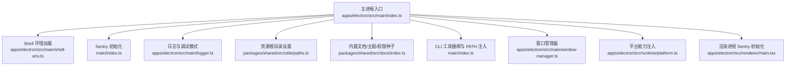
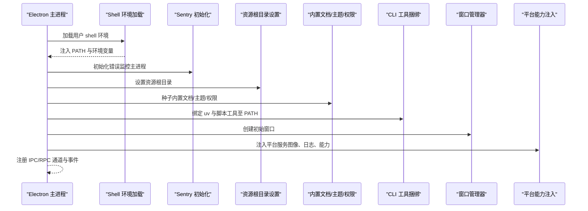
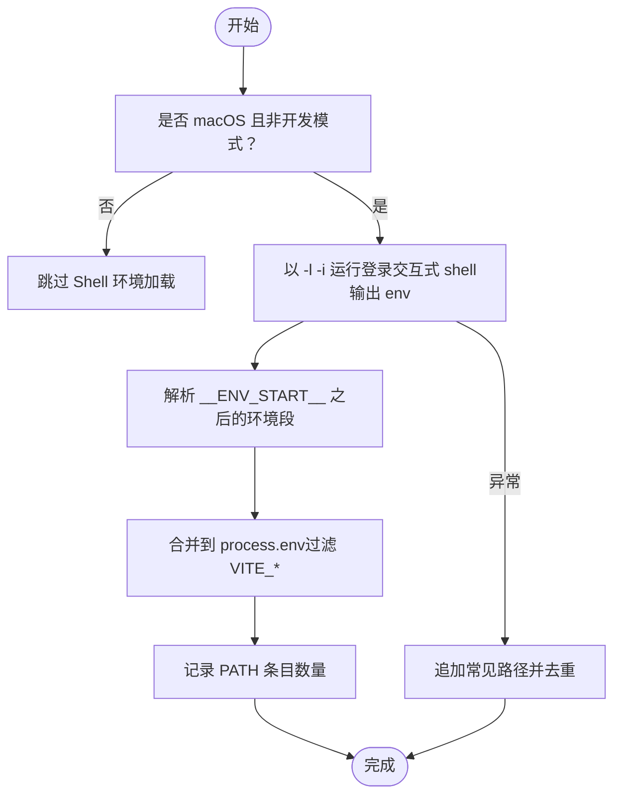
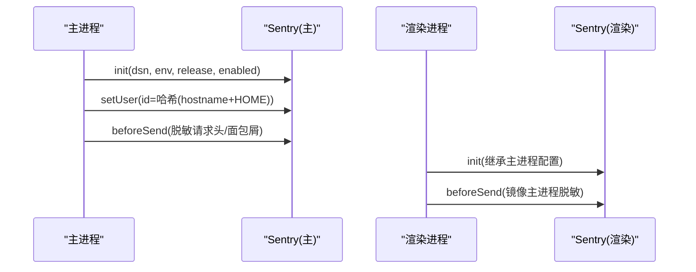
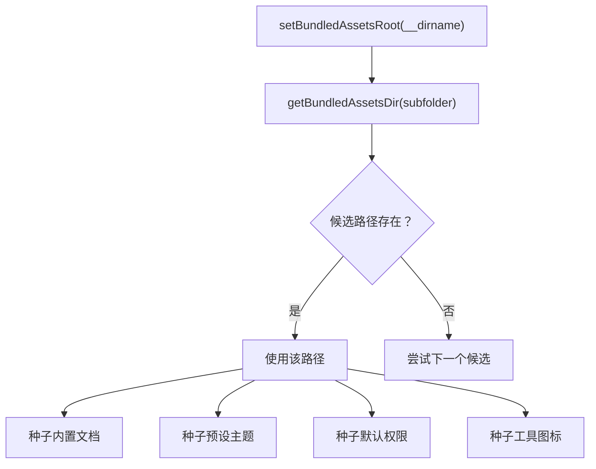
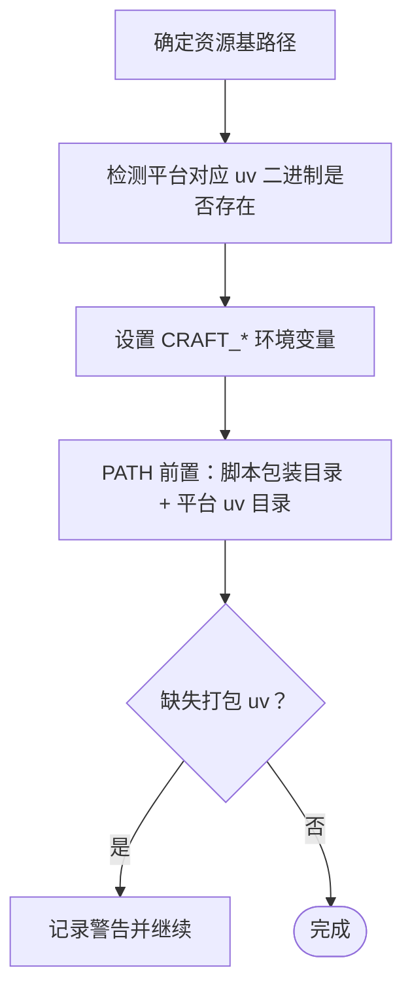
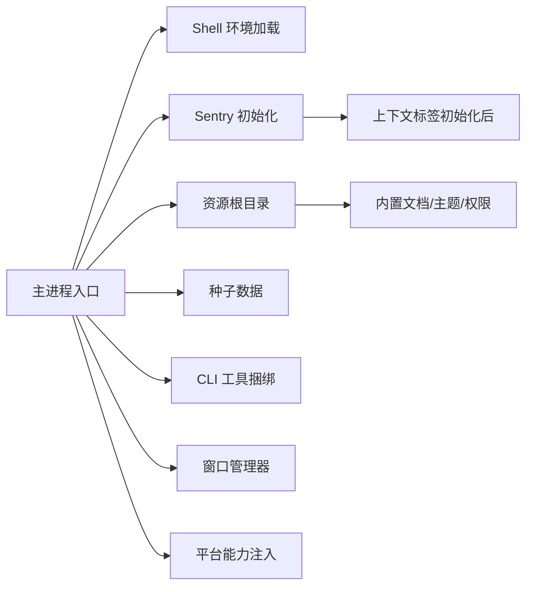

# 应用程序初始化

<cite>
**本文引用的文件**
- [apps/electron/src/main/index.ts](file://apps/electron/src/main/index.ts)
- [apps/electron/src/main/shell-env.ts](file://apps/electron/src/main/shell-env.ts)
- [apps/electron/src/main/logger.ts](file://apps/electron/src/main/logger.ts)
- [apps/electron/src/main/window-manager.ts](file://apps/electron/src/main/window-manager.ts)
- [apps/electron/src/runtime/platform.ts](file://apps/electron/src/runtime/platform.ts)
- [packages/shared/src/utils/paths.ts](file://packages/shared/src/utils/paths.ts)
- [packages/shared/src/docs/index.ts](file://packages/shared/src/docs/index.ts)
- [packages/shared/src/utils/perf.ts](file://packages/shared/src/utils/perf.ts)
- [packages/shared/src/utils/debug.ts](file://packages/shared/src/utils/debug.ts)
- [apps/electron/src/renderer/main.tsx](file://apps/electron/src/renderer/main.tsx)
- [apps/electron/package.json](file://apps/electron/package.json)
- [package.json](file://package.json)
</cite>

## 目录

1. [简介](#简介)
2. [项目结构](#项目结构)
3. [核心组件](#核心组件)
4. [架构总览](#架构总览)
5. [详细组件分析](#详细组件分析)
6. [依赖关系分析](#依赖关系分析)
7. [性能考量](#性能考量)
8. [故障排除指南](#故障排除指南)
9. [结论](#结论)

## 简介

本文件面向 Craft Agents 桌面应用（Electron）的“应用程序初始化”阶段，系统化梳理从进程启动到主窗口创建的完整序列，重点覆盖以下方面：

- 环境变量加载与 shell 环境注入，确保 Homebrew、nvm 等工具在代理环境中可用
- Sentry 错误监控初始化与敏感数据脱敏策略
- 资源路径配置与打包/开发模式差异
- CLI 工具捆绑与 PATH 注入
- 初始化失败的错误处理策略、性能监控配置与调试模式启用机制
- 常见问题排查与解决方案

## 项目结构

Electron 主进程入口位于 apps/electron/src/main/index.ts，其初始化流程贯穿环境准备、监控、资源与 CLI 工具配置、服务注册、窗口管理、自动更新与深链处理等模块。

图表来源

- [apps/electron/src/main/index.ts](file://apps/electron/src/main/index.ts#L1-L831)
- [apps/electron/src/main/shell-env.ts](file://apps/electron/src/main/shell-env.ts#L1-L110)
- [apps/electron/src/main/logger.ts](file://apps/electron/src/main/logger.ts#L1-L80)
- [apps/electron/src/main/window-manager.ts](file://apps/electron/src/main/window-manager.ts#L1-L200)
- [apps/electron/src/runtime/platform.ts](file://apps/electron/src/runtime/platform.ts#L1-L8)
- [packages/shared/src/utils/paths.ts](file://packages/shared/src/utils/paths.ts#L190-L217)
- [packages/shared/src/docs/index.ts](file://packages/shared/src/docs/index.ts#L32-L77)
- [apps/electron/src/renderer/main.tsx](file://apps/electron/src/renderer/main.tsx#L23-L67)

章节来源

- [apps/electron/src/main/index.ts](file://apps/electron/src/main/index.ts#L1-L831)
- [apps/electron/src/main/shell-env.ts](file://apps/electron/src/main/shell-env.ts#L1-L110)
- [apps/electron/src/main/logger.ts](file://apps/electron/src/main/logger.ts#L1-L80)
- [apps/electron/src/main/window-manager.ts](file://apps/electron/src/main/window-manager.ts#L1-L200)
- [apps/electron/src/runtime/platform.ts](file://apps/electron/src/runtime/platform.ts#L1-L8)
- [packages/shared/src/utils/paths.ts](file://packages/shared/src/utils/paths.ts#L190-L217)
- [packages/shared/src/docs/index.ts](file://packages/shared/src/docs/index.ts#L32-L77)
- [apps/electron/src/renderer/main.tsx](file://apps/electron/src/renderer/main.tsx#L23-L67)

## 核心组件

- Shell 环境加载：在 macOS GUI 启动场景下，通过登录交互式 shell 注入完整 PATH 与用户环境变量，并在失败时回退常用路径。
- Sentry 错误监控：主/渲染进程分别初始化，统一脱敏敏感头与面包屑数据，按构建状态启用。
- 资源路径与种子数据：设置资源根目录，加载内置文档、主题与权限配置；支持打包与开发两种候选路径解析。
- CLI 工具捆绑：根据平台选择 uv 可执行文件，注入 CRAFT_UV、CRAFT_SCRIPTS、CRAFT_RESOURCES_BASE 等环境变量，并将工具包装脚本与 uv 平台二进制加入 PATH。
- 日志与调试：统一解析调试模式，配置文件/控制台输出格式；渲染进程复用主进程 Sentry 配置。
- 性能监控：轻量级性能计时与聚合统计，默认关闭，可通过调试或显式开关启用。
- 窗口管理：创建窗口、透明效果适配、导航拦截、RPC 事件桥接等。

章节来源

- [apps/electron/src/main/shell-env.ts](file://apps/electron/src/main/shell-env.ts#L28-L109)
- [apps/electron/src/main/index.ts](file://apps/electron/src/main/index.ts#L20-L59)
- [apps/electron/src/main/index.ts](file://apps/electron/src/main/index.ts#L295-L330)
- [packages/shared/src/utils/paths.ts](file://packages/shared/src/utils/paths.ts#L190-L217)
- [packages/shared/src/docs/index.ts](file://packages/shared/src/docs/index.ts#L32-L77)
- [apps/electron/src/main/index.ts](file://apps/electron/src/main/index.ts#L112-L159)
- [apps/electron/src/main/logger.ts](file://apps/electron/src/main/logger.ts#L12-L60)
- [apps/electron/src/renderer/main.tsx](file://apps/electron/src/renderer/main.tsx#L23-L67)
- [packages/shared/src/utils/perf.ts](file://packages/shared/src/utils/perf.ts#L84-L94)
- [apps/electron/src/main/window-manager.ts](file://apps/electron/src/main/window-manager.ts#L104-L200)

## 架构总览

下图展示主进程初始化的关键调用序列，涵盖环境、监控、资源、CLI、窗口与服务注册等步骤。

图表来源

- [apps/electron/src/main/index.ts](file://apps/electron/src/main/index.ts#L1-L831)
- [apps/electron/src/main/shell-env.ts](file://apps/electron/src/main/shell-env.ts#L28-L109)
- [packages/shared/src/utils/paths.ts](file://packages/shared/src/utils/paths.ts#L190-L217)
- [packages/shared/src/docs/index.ts](file://packages/shared/src/docs/index.ts#L32-L77)
- [apps/electron/src/main/window-manager.ts](file://apps/electron/src/main/window-manager.ts#L104-L200)
- [apps/electron/src/runtime/platform.ts](file://apps/electron/src/runtime/platform.ts#L1-L8)

## 详细组件分析

### Shell 环境加载（macOS GUI 场景）

- 目标：解决 Finder/Dock 启动时最小 launchd 环境导致 PATH 不完整的问题，确保 Homebrew、nvm、pyenv 等工具可用。
- 实现要点：
  - 仅在 macOS 且非开发模式下执行；开发模式已具备完整终端环境。
  - 通过登录交互式 shell 输出 env，解析并合并到 process.env，跳过 VITE\_\* 等开发变量。
  - 失败时追加常见路径（如 Homebrew、本地 bin、Cargo、Bun），避免启动失败。
- 关键路径
  - 入口调用：主进程入口首行导入并立即执行。
  - 执行位置：主进程早期，早于其他可能依赖 PATH 的初始化步骤。

图表来源

- [apps/electron/src/main/shell-env.ts](file://apps/electron/src/main/shell-env.ts#L28-L109)

章节来源

- [apps/electron/src/main/shell-env.ts](file://apps/electron/src/main/shell-env.ts#L28-L109)
- [apps/electron/src/main/index.ts](file://apps/electron/src/main/index.ts#L1-L6)

### Sentry 错误监控初始化

- 目标：尽早初始化错误监控，区分开发/生产环境，避免噪声。
- 实现要点：
  - 主进程：基于环境变量 DSN 初始化，按打包状态设置 environment/release，启用条件由 DSN 是否存在决定。
  - 敏感数据脱敏：请求头（authorization、cookie、x-api-key）、面包屑中的 token/key/secret/password/credential/auth 类键值均脱敏。
  - 用户标识：使用主机名与用户主目录哈希生成匿名机器 ID。
  - 渲染进程：复用主进程配置，集成控制台捕获，避免 Sentry 配额浪费的模式过滤。
- 关键路径
  - 主进程 Sentry.init 与脱敏逻辑。
  - 渲染进程 Sentry 初始化与脱敏策略。

图表来源

- [apps/electron/src/main/index.ts](file://apps/electron/src/main/index.ts#L20-L59)
- [apps/electron/src/renderer/main.tsx](file://apps/electron/src/renderer/main.tsx#L23-L67)

章节来源

- [apps/electron/src/main/index.ts](file://apps/electron/src/main/index.ts#L20-L64)
- [apps/electron/src/renderer/main.tsx](file://apps/electron/src/renderer/main.tsx#L23-L67)

### 资源路径配置与种子数据

- 目标：在打包与开发两种模式下正确解析内置资源（文档、主题、权限图标等）。
- 实现要点：
  - setBundledAssetsRoot 在主进程启动时设置资源根目录。
  - getBundledAssetsDir 提供多候选路径解析：打包 app 内部 resources 子目录、开发时的 apps/electron/resources 或构建产物 dist/resources。
  - 初始化阶段调用 initializeDocs、initializeReleaseNotes、ensureDefaultPermissions、ensureToolIcons、ensurePresetThemes 等函数进行种子数据写入。
- 关键路径
  - setBundledAssetsRoot(\_\_dirname)。
  - 各种子函数在 whenReady 之后执行。

图表来源

- [apps/electron/src/main/index.ts](file://apps/electron/src/main/index.ts#L295-L330)
- [packages/shared/src/utils/paths.ts](file://packages/shared/src/utils/paths.ts#L190-L217)
- [packages/shared/src/docs/index.ts](file://packages/shared/src/docs/index.ts#L32-L77)

章节来源

- [apps/electron/src/main/index.ts](file://apps/electron/src/main/index.ts#L295-L330)
- [packages/shared/src/utils/paths.ts](file://packages/shared/src/utils/paths.ts#L190-L217)
- [packages/shared/src/docs/index.ts](file://packages/shared/src/docs/index.ts#L32-L77)

### CLI 工具捆绑与 PATH 注入

- 目标：在所有会话 Bash 中可用 uv、脚本工具，便于文档处理等任务。
- 实现要点：
  - 根据打包状态选择 resources 基路径（打包：resourcesPath/app；开发：\_\_dirname/../）。
  - 按平台选择 uv 二进制（win32 使用 uv.exe，其余使用 uv）。
  - 设置 CRAFT_UV、CRAFT_SCRIPTS、CRAFT_RESOURCES_BASE、CRAFT_APP_ROOT 等环境变量。
  - 将通用包装脚本目录与平台 uv 目录前置到 PATH，同时可选注入 CRAFT_BUN。
  - 若缺少打包 uv，记录警告并在调试模式输出详细信息。
- 关键路径
  - 资源路径与 uv 二进制解析。
  - PATH 注入与环境变量设置。

图表来源

- [apps/electron/src/main/index.ts](file://apps/electron/src/main/index.ts#L112-L159)

章节来源

- [apps/electron/src/main/index.ts](file://apps/electron/src/main/index.ts#L112-L159)

### 日志与调试模式

- 目标：在不同运行时（Electron 主/渲染、CLI）统一调试输出与日志格式。
- 实现要点：
  - 解析调试模式优先级：命令行 --debug > 显式 CRAFT_IS_PACKAGED > Electron 默认运行时启发式 > 非 Electron 默认开启。
  - 开启调试时：文件传输禁用（生产关闭），控制台输出 JSON（主进程）或可读格式（渲染进程）。
  - 渲染进程 Sentry 初始化复用主进程配置，增强控制台错误可见性。
- 关键路径
  - resolveDebugMode 与日志传输配置。
  - 渲染进程 Sentry 初始化。

章节来源

- [apps/electron/src/main/logger.ts](file://apps/electron/src/main/logger.ts#L12-L60)
- [apps/electron/src/renderer/main.tsx](file://apps/electron/src/renderer/main.tsx#L23-L67)

### 性能监控配置

- 目标：在需要时收集关键操作耗时，辅助定位瓶颈。
- 实现要点：
  - 默认关闭；可通过 enableDebug 或 setPerfEnabled(true) 启用。
  - 支持 start/measure/span 计时，输出到 stderr，聚合统计（计数、平均、P50、P95）。
  - 渲染侧提供会话切换跟踪工具，按调试模式启用。
- 关键路径
  - setPerfEnabled/isPerfEnabled。
  - start/measure/span 与统计汇总。

章节来源

- [packages/shared/src/utils/perf.ts](file://packages/shared/src/utils/perf.ts#L84-L94)
- [packages/shared/src/utils/perf.ts](file://packages/shared/src/utils/perf.ts#L193-L215)
- [packages/shared/src/utils/perf.ts](file://packages/shared/src/utils/perf.ts#L365-L400)

### 窗口管理与应用菜单

- 目标：创建初始窗口、恢复上次状态、处理深链与单实例锁。
- 实现要点：
  - whenReady 后创建 WindowManager，构建应用菜单。
  - 首次运行自动创建默认工作区；从保存状态恢复或打开首个工作区。
  - 注册深链协议与处理逻辑，支持 macOS open-url 与 Windows/Linux 第二实例参数传递。
  - 窗口创建时根据平台选择透明背景材料（Windows Mica/Acrylic）。
- 关键路径
  - createInitialWindows 与窗口创建选项。
  - 单实例锁与深链处理。

章节来源

- [apps/electron/src/main/index.ts](file://apps/electron/src/main/index.ts#L243-L293)
- [apps/electron/src/main/window-manager.ts](file://apps/electron/src/main/window-manager.ts#L104-L200)

### 平台能力注入与运行时

- 目标：向服务器核心模块注入 Electron 平台能力（图像处理、日志、系统能力等）。
- 实现要点：
  - 构造 PlatformServices 对象，包含 appRootPath、resourcesPath、isPackaged、版本、外部打开、图像处理、日志、调试标志、错误上报等。
  - 在非薄客户端模式下注入 fetcher、session、搜索、图像处理器等平台钩子。
- 关键路径
  - PlatformServices 定义与注入。

章节来源

- [apps/electron/src/main/index.ts](file://apps/electron/src/main/index.ts#L427-L496)
- [apps/electron/src/runtime/platform.ts](file://apps/electron/src/runtime/platform.ts#L1-L8)

## 依赖关系分析

- 主进程入口依赖：
  - Shell 环境加载（确保 PATH 与工具可用）
  - Sentry 初始化（错误监控）
  - 资源路径与种子数据（内置文档/主题/权限）
  - CLI 工具捆绑（uv、脚本工具）
  - 窗口管理器（创建窗口）
  - 平台能力注入（服务器核心模块）
- 关键耦合点：
  - setBundledAssetsRoot 与 getBundledAssetsDir 的配合，保证资源解析一致性。
  - Sentry 初始化在 app.whenReady 之前完成，但上下文标签在初始化后设置，避免 PII 泄露。
  - CLI 工具 PATH 注入在窗口创建前完成，确保会话内工具可用。

图表来源

- [apps/electron/src/main/index.ts](file://apps/electron/src/main/index.ts#L1-L831)
- [packages/shared/src/utils/paths.ts](file://packages/shared/src/utils/paths.ts#L190-L217)
- [packages/shared/src/docs/index.ts](file://packages/shared/src/docs/index.ts#L32-L77)

章节来源

- [apps/electron/src/main/index.ts](file://apps/electron/src/main/index.ts#L1-L831)
- [packages/shared/src/utils/paths.ts](file://packages/shared/src/utils/paths.ts#L190-L217)
- [packages/shared/src/docs/index.ts](file://packages/shared/src/docs/index.ts#L32-L77)

## 性能考量

- 性能计时默认关闭，避免生产开销；调试模式或显式启用后，可在 stderr 输出聚合统计，便于定位热点。
- 窗口创建采用“ready-to-show”延迟显示策略，提升感知性能。
- 图像处理在原生层完成，减少跨进程通信成本。
- 自动更新检查在生产包中进行，开发模式跳过，避免误替换安装包。

## 故障排除指南

- Shell 环境加载失败
  - 现象：PATH 不完整，Homebrew/nvm 等不可用。
  - 排查：查看主日志中 shell-env 警告与回退路径注入；确认 SHELL 环境变量与用户 shell rc/profile 文件。
  - 处理：确保用户 shell 正常，必要时手动添加 /opt/homebrew/bin 等路径。
- 缺失打包 uv
  - 现象：CLI 文档工具报错找不到 uv。
  - 排查：检查 CRAFT_UV 与 PATH 注入日志；确认打包资源目录结构。
  - 处理：在开发模式下确保 PATH 包含系统 uv；或修复打包资源。
- Sentry 未上报/噪声过多
  - 现象：开发环境出现大量无关错误；生产未上报。
  - 排查：确认 SENTRY_ELECTRON_INGEST_URL 是否设置；检查环境标签与脱敏规则。
  - 处理：按构建状态正确注入 DSN；调整脱敏策略与环境过滤。
- 资源文件缺失或解析失败
  - 现象：内置文档/主题/权限未显示。
  - 排查：确认 setBundledAssetsRoot 与 getBundledAssetsDir 候选路径；检查资源复制脚本。
  - 处理：确保 build:copy 正常执行；验证 resources 子目录存在。
- 窗口无法创建或透明效果异常
  - 现象：窗口黑屏或透明失效。
  - 排查：检查 Windows 版本与背景材质判断；确认图标资源存在。
  - 处理：升级到 Windows 10/11；确保图标资源路径正确。
- 深链未生效
  - 现象：点击 craftagents:// 链接无响应。
  - 排查：确认协议注册与单实例锁；检查 macOS open-url 与 Windows 第二实例参数。
  - 处理：重新注册协议；确保主进程已就绪再处理深链。

章节来源

- [apps/electron/src/main/shell-env.ts](file://apps/electron/src/main/shell-env.ts#L86-L109)
- [apps/electron/src/main/index.ts](file://apps/electron/src/main/index.ts#L149-L158)
- [apps/electron/src/main/index.ts](file://apps/electron/src/main/index.ts#L295-L330)
- [apps/electron/src/main/window-manager.ts](file://apps/electron/src/main/window-manager.ts#L18-L34)
- [apps/electron/src/main/index.ts](file://apps/electron/src/main/index.ts#L201-L240)

## 结论

Craft Agents 的初始化流程围绕“先环境、后监控、再资源与工具、最后窗口与服务”的顺序展开，既保证了代理环境下的工具可用性，又兼顾了生产安全（Sentry 脱敏、按环境启用）、开发体验（调试/性能工具）与资源一致性（打包/开发双路径）。遵循本文所述的初始化序列与排障建议，可有效降低冷启动与运行期风险，提升稳定性与可观测性。
