# 桌面应用架构

<cite>
**本文档引用的文件**
- [apps/electron/src/main/index.ts](file://apps/electron/src/main/index.ts)
- [apps/electron/src/preload/bootstrap.ts](file://apps/electron/src/preload/bootstrap.ts)
- [apps/electron/src/main/window-manager.ts](file://apps/electron/src/main/window-manager.ts)
- [apps/electron/src/main/deep-link.ts](file://apps/electron/src/main/deep-link.ts)
- [apps/electron/src/main/menu.ts](file://apps/electron/src/main/menu.ts)
- [apps/electron/src/main/notifications.ts](file://apps/electron/src/main/notifications.ts)
- [apps/electron/src/main/auto-update.ts](file://apps/electron/src/main/auto-update.ts)
- [apps/electron/src/main/browser-pane-manager.ts](file://apps/electron/src/main/browser-pane-manager.ts)
- [apps/electron/src/transport/server.ts](file://apps/electron/src/transport/server.ts)
- [apps/electron/src/transport/client.ts](file://apps/electron/src/transport/client.ts)
- [apps/electron/src/transport/channel-map.ts](file://apps/electron/src/transport/channel-map.ts)
- [apps/electron/src/shared/types.ts](file://apps/electron/src/shared/types.ts)
- [apps/electron/package.json](file://apps/electron/package.json)
- [apps/electron/tsconfig.json](file://apps/electron/tsconfig.json)
</cite>

## 目录

1. [简介](#简介)
2. [项目结构](#项目结构)
3. [核心组件](#核心组件)
4. [架构总览](#架构总览)
5. [详细组件分析](#详细组件分析)
6. [依赖关系分析](#依赖关系分析)
7. [性能考虑](#性能考虑)
8. [故障排除指南](#故障排除指南)
9. [结论](#结论)

## 简介

本文件为 Craft Agents 桌面应用的架构文档，聚焦 Electron 主进程的初始化流程、窗口管理系统、进程间通信（IPC）机制，以及渲染进程的启动与安全通信方式。文档还涵盖会话生命周期管理、用户交互处理、子系统协调、窗口状态管理、深链接处理、系统集成功能，并通过多种图示展示组件间的依赖关系与调用流程。

## 项目结构

该应用采用多包工作区结构，桌面端位于 `apps/electron`，核心逻辑与共享协议在 `packages` 下的多个包中实现。Electron 应用的核心入口为主进程入口文件，预加载脚本负责建立安全的渲染进程通信桥，窗口管理器负责多窗口生命周期，深链接处理器负责外部协议路由，通知服务负责系统通知与徽章更新，自动更新模块负责版本升级，浏览器面板管理器负责独立浏览器实例的生命周期与 CDP 集成。

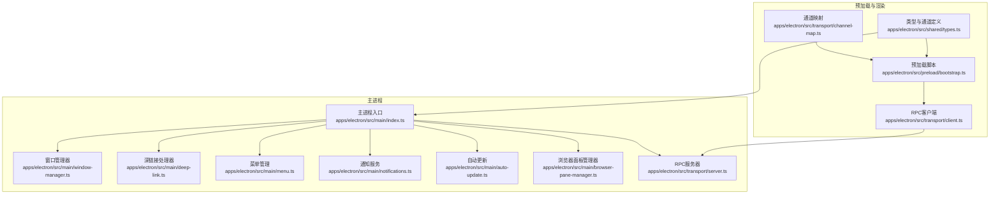

**图表来源**

- [apps/electron/src/main/index.ts](file://apps/electron/src/main/index.ts#L1-L831)
- [apps/electron/src/preload/bootstrap.ts](file://apps/electron/src/preload/bootstrap.ts#L1-L314)
- [apps/electron/src/main/window-manager.ts](file://apps/electron/src/main/window-manager.ts#L1-L647)
- [apps/electron/src/main/deep-link.ts](file://apps/electron/src/main/deep-link.ts#L1-L343)
- [apps/electron/src/main/menu.ts](file://apps/electron/src/main/menu.ts#L1-L293)
- [apps/electron/src/main/notifications.ts](file://apps/electron/src/main/notifications.ts#L1-L296)
- [apps/electron/src/main/auto-update.ts](file://apps/electron/src/main/auto-update.ts#L1-L438)
- [apps/electron/src/main/browser-pane-manager.ts](file://apps/electron/src/main/browser-pane-manager.ts#L1-L800)
- [apps/electron/src/transport/server.ts](file://apps/electron/src/transport/server.ts#L1-L2)
- [apps/electron/src/transport/client.ts](file://apps/electron/src/transport/client.ts#L1-L728)
- [apps/electron/src/transport/channel-map.ts](file://apps/electron/src/transport/channel-map.ts#L1-L335)
- [apps/electron/src/shared/types.ts](file://apps/electron/src/shared/types.ts#L1-L808)

**章节来源**

- [apps/electron/src/main/index.ts](file://apps/electron/src/main/index.ts#L1-L831)
- [apps/electron/package.json](file://apps/electron/package.json#L1-L80)
- [apps/electron/tsconfig.json](file://apps/electron/tsconfig.json#L1-L33)

## 核心组件

- 主进程入口：负责应用初始化、资源准备、服务注册、事件监听与生命周期管理。
- 窗口管理器：负责创建、定位、关闭窗口，持久化窗口状态，处理关闭拦截与回退策略。
- 预加载脚本：建立 RPC 客户端，注入安全的 ElectronAPI，处理能力调用与传输状态上报。
- 深链接处理器：解析 craftagents:// 协议，路由到指定视图或动作，支持新窗口模式与侧栏参数。
- 菜单管理：构建原生菜单并广播菜单事件到渲染进程。
- 通知服务：跨平台显示系统通知与徽章计数更新。
- 自动更新：基于 electron-updater 的检查、下载与安装流程。
- 浏览器面板管理器：管理独立浏览器窗口，支持 CDP、主题色提取、截图与网络日志。
- RPC 传输层：基于 WebSocket 的 RPC 服务器与客户端，提供握手、请求响应、事件订阅与自动重连。

**章节来源**

- [apps/electron/src/main/index.ts](file://apps/electron/src/main/index.ts#L295-L738)
- [apps/electron/src/main/window-manager.ts](file://apps/electron/src/main/window-manager.ts#L53-L647)
- [apps/electron/src/preload/bootstrap.ts](file://apps/electron/src/preload/bootstrap.ts#L1-L314)
- [apps/electron/src/main/deep-link.ts](file://apps/electron/src/main/deep-link.ts#L35-L343)
- [apps/electron/src/main/menu.ts](file://apps/electron/src/main/menu.ts#L22-L293)
- [apps/electron/src/main/notifications.ts](file://apps/electron/src/main/notifications.ts#L31-L296)
- [apps/electron/src/main/auto-update.ts](file://apps/electron/src/main/auto-update.ts#L1-L438)
- [apps/electron/src/main/browser-pane-manager.ts](file://apps/electron/src/main/browser-pane-manager.ts#L311-L800)
- [apps/electron/src/transport/server.ts](file://apps/electron/src/transport/server.ts#L1-L2)
- [apps/electron/src/transport/client.ts](file://apps/electron/src/transport/client.ts#L101-L728)
- [apps/electron/src/transport/channel-map.ts](file://apps/electron/src/transport/channel-map.ts#L19-L335)
- [apps/electron/src/shared/types.ts](file://apps/electron/src/shared/types.ts#L1-L808)

## 架构总览

下图展示了主进程、预加载与渲染进程之间的交互关系，以及 RPC 传输层在其中的角色。

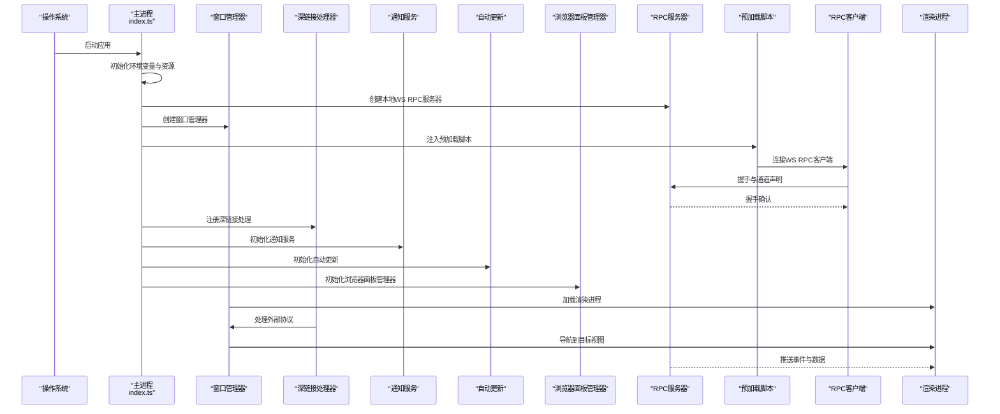

**图表来源**

- [apps/electron/src/main/index.ts](file://apps/electron/src/main/index.ts#L295-L738)
- [apps/electron/src/preload/bootstrap.ts](file://apps/electron/src/preload/bootstrap.ts#L66-L100)
- [apps/electron/src/transport/client.ts](file://apps/electron/src/transport/client.ts#L263-L334)
- [apps/electron/src/transport/server.ts](file://apps/electron/src/transport/server.ts#L1-L2)
- [apps/electron/src/main/window-manager.ts](file://apps/electron/src/main/window-manager.ts#L104-L408)
- [apps/electron/src/main/deep-link.ts](file://apps/electron/src/main/deep-link.ts#L235-L343)
- [apps/electron/src/main/notifications.ts](file://apps/electron/src/main/notifications.ts#L31-L125)
- [apps/electron/src/main/auto-update.ts](file://apps/electron/src/main/auto-update.ts#L81-L221)

## 详细组件分析

### 主进程初始化流程

主进程在应用就绪后执行以下关键步骤：

- 设置打包状态、资源根目录与后端运行时路径。
- 初始化内置文档、发布说明、默认权限、工具图标与主题种子。
- 注册缩略图协议与应用菜单。
- 在非“仅客户端”模式下初始化会话管理器、模型刷新服务、平台注入与事件推送。
- 注册 RPC 通道与事件源，设置电源管理与自动更新。
- 创建初始窗口并处理冷启动深链接。

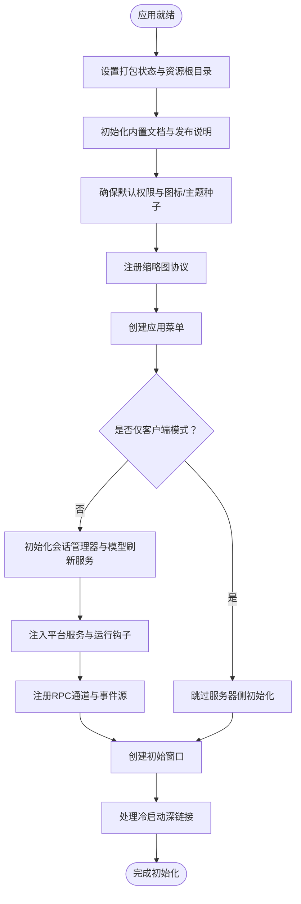

**图表来源**

- [apps/electron/src/main/index.ts](file://apps/electron/src/main/index.ts#L295-L738)

**章节来源**

- [apps/electron/src/main/index.ts](file://apps/electron/src/main/index.ts#L295-L738)

### 窗口管理系统

窗口管理器负责：

- 窗口创建与布局（含透明效果与平台差异）。
- 导航拦截与外部链接处理。
- 关闭拦截与回退超时，区分键盘快捷键与按钮触发。
- 主题变化广播与焦点状态同步。
- 窗口状态持久化与恢复。
- 新建窗口模式（聚焦/全屏）与工作区切换。

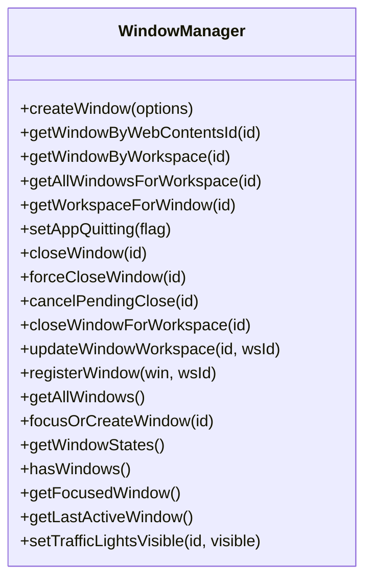

**图表来源**

- [apps/electron/src/main/window-manager.ts](file://apps/electron/src/main/window-manager.ts#L53-L647)

**章节来源**

- [apps/electron/src/main/window-manager.ts](file://apps/electron/src/main/window-manager.ts#L104-L408)

### 预加载脚本与安全通信

预加载脚本负责：

- 从主进程获取 WS 端口与令牌，建立 WsRpcClient 并连接。
- 注册能力调用（如打开外部链接、文件对话框），这些调用由主进程处理。
- 将 RPC 通道映射为 ElectronAPI，供渲染进程以 Promise 方式调用。
- 上报传输状态到主进程，便于日志与诊断。
- 提供 OAuth 流程的多步编排（回调服务器、授权码交换、清理）。

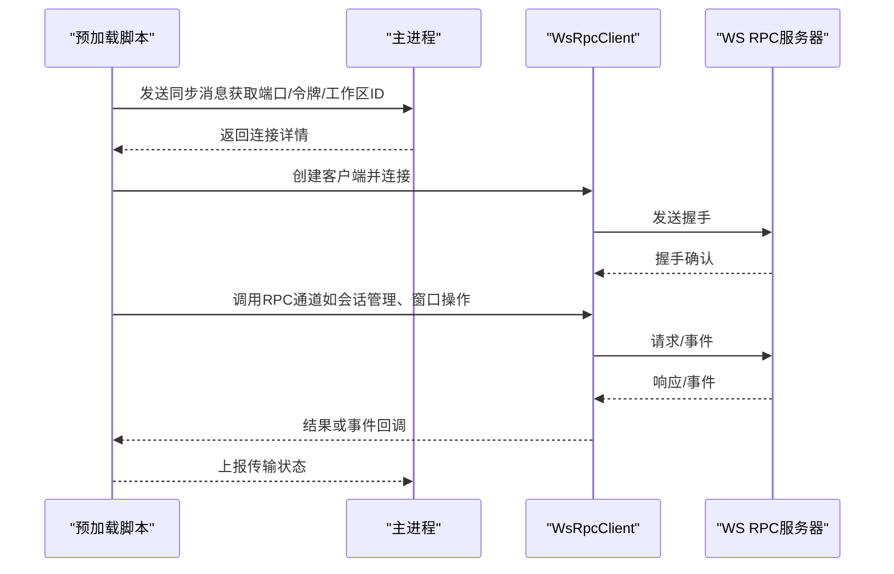

**图表来源**

- [apps/electron/src/preload/bootstrap.ts](file://apps/electron/src/preload/bootstrap.ts#L32-L100)
- [apps/electron/src/transport/client.ts](file://apps/electron/src/transport/client.ts#L157-L183)
- [apps/electron/src/transport/server.ts](file://apps/electron/src/transport/server.ts#L1-L2)

**章节来源**

- [apps/electron/src/preload/bootstrap.ts](file://apps/electron/src/preload/bootstrap.ts#L1-L314)
- [apps/electron/src/transport/client.ts](file://apps/electron/src/transport/client.ts#L101-L728)
- [apps/electron/src/transport/channel-map.ts](file://apps/electron/src/transport/channel-map.ts#L19-L335)
- [apps/electron/src/shared/types.ts](file://apps/electron/src/shared/types.ts#L205-L559)

### 深链接处理

深链接处理器支持：

- 协议解析与目标识别（视图、动作、工作区）。
- 新窗口模式（聚焦/全屏）与侧栏参数。
- 冷启动场景下的待处理深链接队列。
- 与窗口管理器协作进行导航与窗口聚焦。

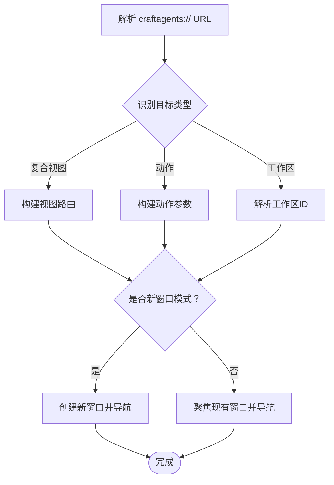

**图表来源**

- [apps/electron/src/main/deep-link.ts](file://apps/electron/src/main/deep-link.ts#L95-L200)
- [apps/electron/src/main/deep-link.ts](file://apps/electron/src/main/deep-link.ts#L235-L343)

**章节来源**

- [apps/electron/src/main/deep-link.ts](file://apps/electron/src/main/deep-link.ts#L1-L343)

### 菜单与系统集成

- 应用菜单在 macOS 上保持原生结构，在 Windows/Linux 上隐藏原生菜单并通过应用内菜单替代。
- 菜单项通过 RPC 通道广播到渲染进程，实现统一的快捷键与行为控制。
- 系统托盘徽章、通知与自动更新集成。

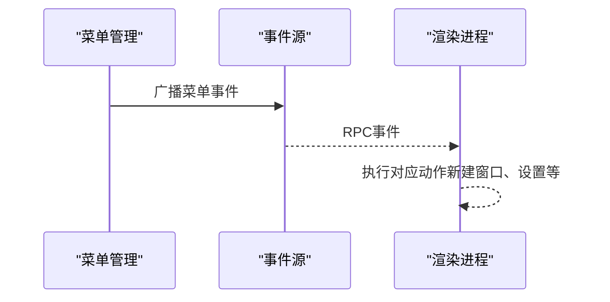

**图表来源**

- [apps/electron/src/main/menu.ts](file://apps/electron/src/main/menu.ts#L22-L293)

**章节来源**

- [apps/electron/src/main/menu.ts](file://apps/electron/src/main/menu.ts#L1-L293)

### 通知与徽章

- 跨平台通知：点击后聚焦窗口并导航到会话。
- 徽章计数：macOS 使用画布叠加，Windows 使用任务栏覆盖图标，Linux 使用 setBadgeCount。
- 支持实例徽章（开发多实例）。

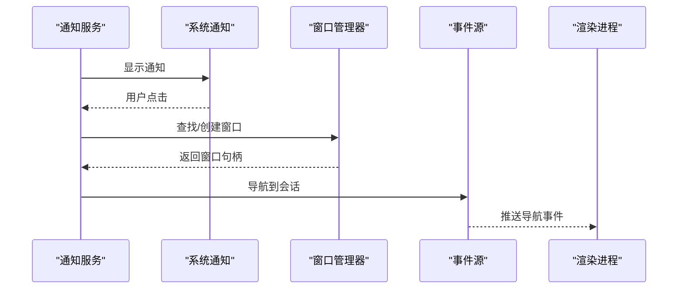

**图表来源**

- [apps/electron/src/main/notifications.ts](file://apps/electron/src/main/notifications.ts#L54-L125)

**章节来源**

- [apps/electron/src/main/notifications.ts](file://apps/electron/src/main/notifications.ts#L1-L296)

### 自动更新

- 基于 electron-updater，支持 macOS、Windows、Linux。
- 下载进度与就绪状态广播到渲染进程。
- 支持启动时检查与忽略已忽略版本。

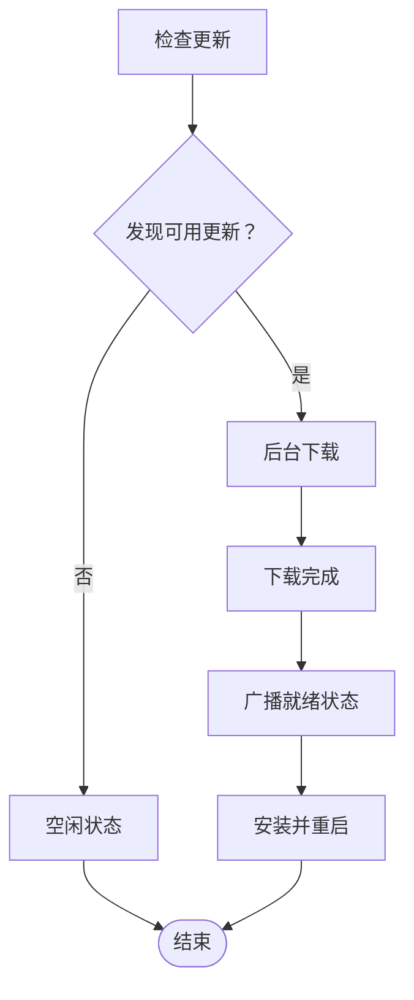

**图表来源**

- [apps/electron/src/main/auto-update.ts](file://apps/electron/src/main/auto-update.ts#L130-L221)
- [apps/electron/src/main/auto-update.ts](file://apps/electron/src/main/auto-update.ts#L316-L361)

**章节来源**

- [apps/electron/src/main/auto-update.ts](file://apps/electron/src/main/auto-update.ts#L1-L438)

### 浏览器面板管理器

- 独立浏览器窗口，共享 Cookie 分区与 CDP 能力。
- 支持主题色提取、截图、网络日志、下载追踪与无障碍快照。
- 与深链接集成，支持从空状态页触发导航。

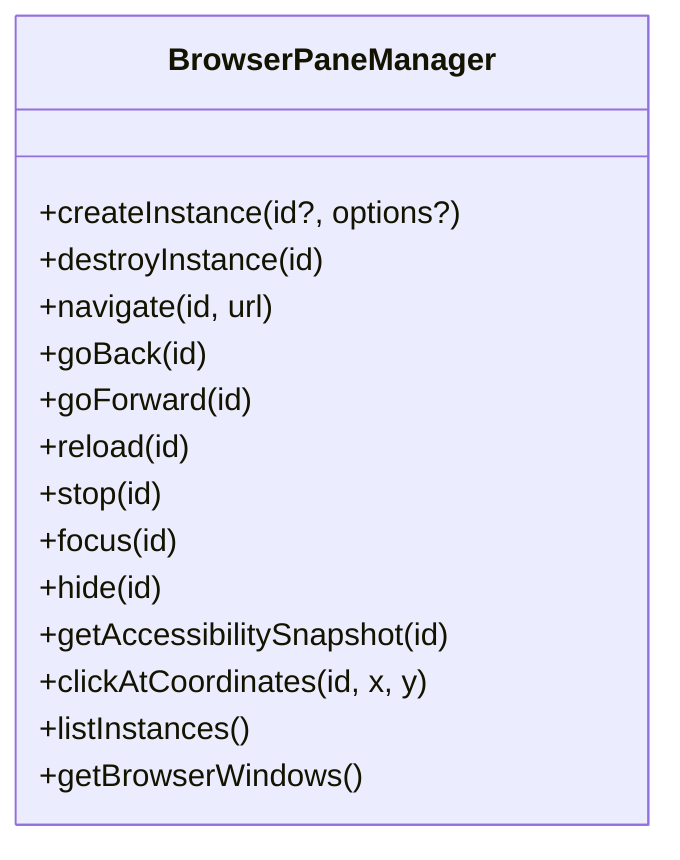

**图表来源**

- [apps/electron/src/main/browser-pane-manager.ts](file://apps/electron/src/main/browser-pane-manager.ts#L311-L800)

**章节来源**

- [apps/electron/src/main/browser-pane-manager.ts](file://apps/electron/src/main/browser-pane-manager.ts#L1-L800)

### RPC 传输层

- WsRpcClient：握手、请求/响应关联、事件订阅、能力调用、自动重连与状态上报。
- WsRpcServer：本地 WebSocket 服务器，绑定认证令牌，维护客户端映射。
- 通道映射：将 ElectronAPI 方法名映射到 RPC 通道，统一调用与监听。

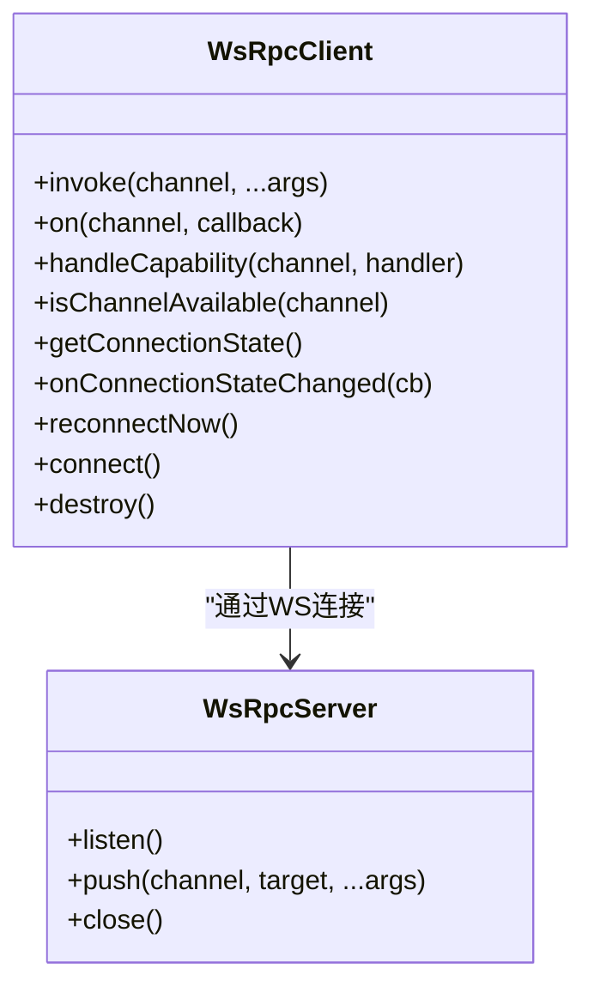

**图表来源**

- [apps/electron/src/transport/client.ts](file://apps/electron/src/transport/client.ts#L101-L728)
- [apps/electron/src/transport/server.ts](file://apps/electron/src/transport/server.ts#L1-L2)
- [apps/electron/src/transport/channel-map.ts](file://apps/electron/src/transport/channel-map.ts#L19-L335)

**章节来源**

- [apps/electron/src/transport/client.ts](file://apps/electron/src/transport/client.ts#L1-L728)
- [apps/electron/src/transport/server.ts](file://apps/electron/src/transport/server.ts#L1-L2)
- [apps/electron/src/transport/channel-map.ts](file://apps/electron/src/transport/channel-map.ts#L1-L335)
- [apps/electron/src/shared/types.ts](file://apps/electron/src/shared/types.ts#L1-L808)

## 依赖关系分析

- 主进程依赖：窗口管理器、深链接处理器、菜单管理、通知服务、自动更新、浏览器面板管理器、RPC 服务器。
- 预加载依赖：RPC 客户端、通道映射、类型定义。
- 渲染进程依赖：预加载暴露的 ElectronAPI，通过 RPC 通道访问主进程能力。

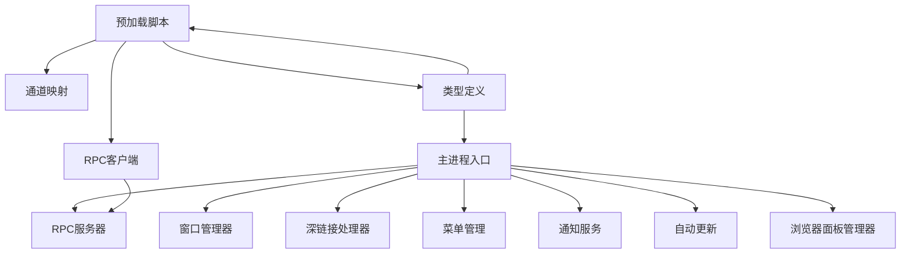

**图表来源**

- [apps/electron/src/main/index.ts](file://apps/electron/src/main/index.ts#L68-L100)
- [apps/electron/src/preload/bootstrap.ts](file://apps/electron/src/preload/bootstrap.ts#L15-L31)
- [apps/electron/src/transport/channel-map.ts](file://apps/electron/src/transport/channel-map.ts#L8-L9)
- [apps/electron/src/shared/types.ts](file://apps/electron/src/shared/types.ts#L4-L4)

**章节来源**

- [apps/electron/src/main/index.ts](file://apps/electron/src/main/index.ts#L68-L100)
- [apps/electron/src/preload/bootstrap.ts](file://apps/electron/src/preload/bootstrap.ts#L15-L31)
- [apps/electron/src/transport/channel-map.ts](file://apps/electron/src/transport/channel-map.ts#L8-L9)
- [apps/electron/src/shared/types.ts](file://apps/electron/src/shared/types.ts#L4-L4)

## 性能考虑

- 传输层：使用 WebSocket 与握手确认，避免不必要的请求；自动重连采用指数退避，限制最大延迟。
- 窗口管理：延迟显示窗口（ready-to-show）提升感知性能；导航失败时提供回退策略。
- 深链接：解析与导航分离，支持新窗口模式减少对现有窗口的影响。
- 通知与更新：下载进度与就绪状态异步广播，避免阻塞主线程。
- 浏览器面板：独立窗口与视图，避免与主窗口竞争资源；截图与网络日志有上限与去重策略。

## 故障排除指南

- 传输连接失败：检查令牌与主机绑定，查看传输状态上报信息，确认自动重连尝试次数。
- 窗口关闭拦截：确认键盘快捷键与按钮触发的区别，检查回退超时是否被清除。
- 深链接无效：确认协议注册与命令行参数解析，检查工作区存在性与窗口聚焦状态。
- 通知不显示：检查平台支持与权限，确认点击事件是否正确路由到窗口与会话。
- 自动更新问题：检查缓存目录与下载文件存在性，关注 electron-updater 内部状态。

**章节来源**

- [apps/electron/src/transport/client.ts](file://apps/electron/src/transport/client.ts#L511-L589)
- [apps/electron/src/main/window-manager.ts](file://apps/electron/src/main/window-manager.ts#L343-L381)
- [apps/electron/src/main/deep-link.ts](file://apps/electron/src/main/deep-link.ts#L235-L343)
- [apps/electron/src/main/notifications.ts](file://apps/electron/src/main/notifications.ts#L54-L125)
- [apps/electron/src/main/auto-update.ts](file://apps/electron/src/main/auto-update.ts#L229-L308)

## 结论

Craft Agents 桌面应用通过清晰的主进程-预加载-RPC 三层架构实现了安全、可扩展且高性能的桌面体验。主进程负责系统级集成与服务编排，预加载脚本提供受限但强大的 API 访问，RPC 传输层保证了可靠的跨进程通信。窗口管理、深链接、通知、自动更新与浏览器面板等子系统协同工作，满足复杂场景下的用户体验需求。
