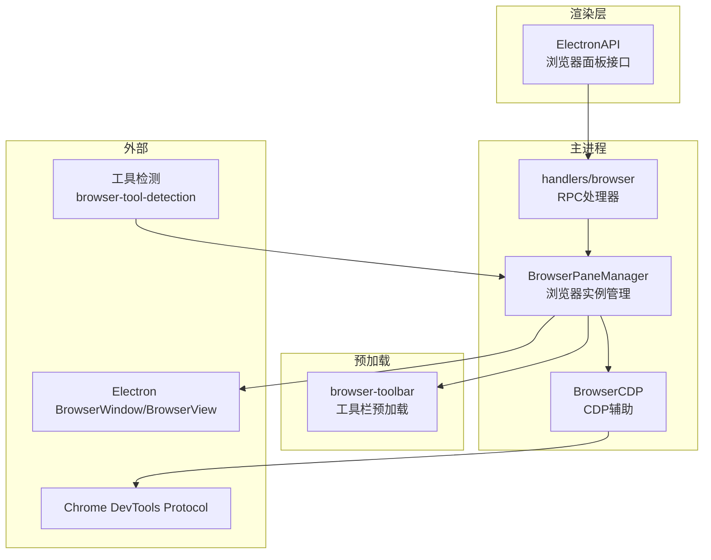
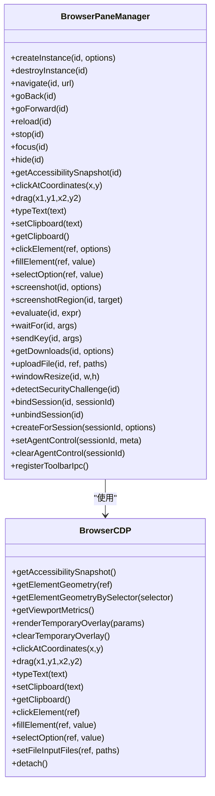
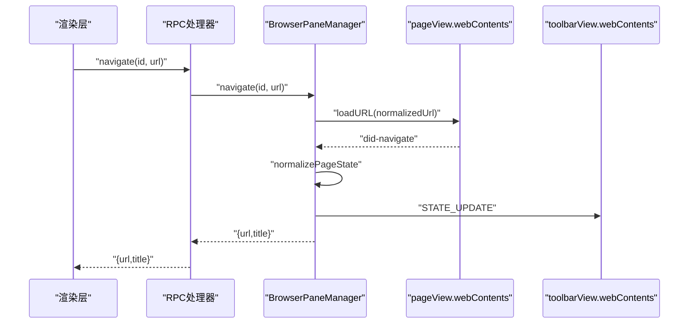
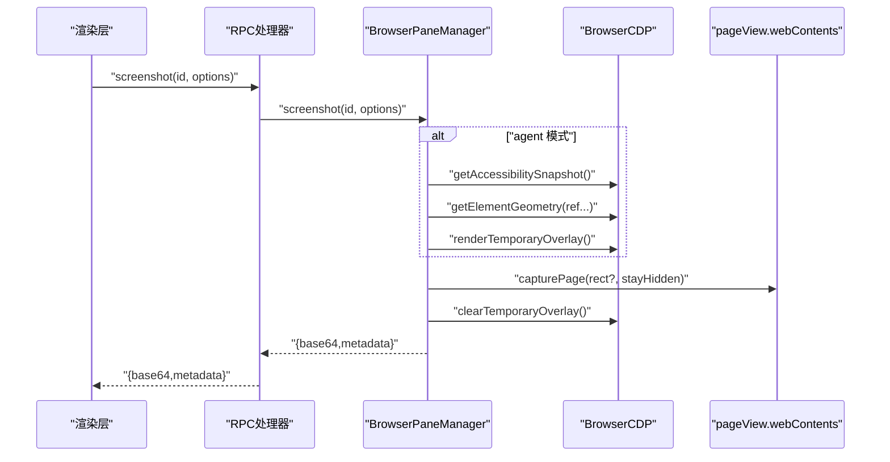
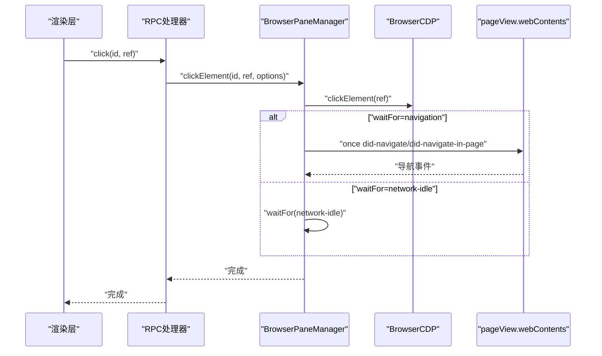
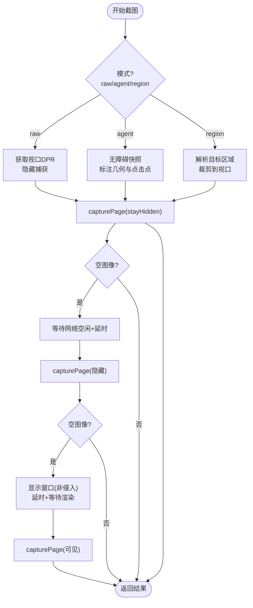
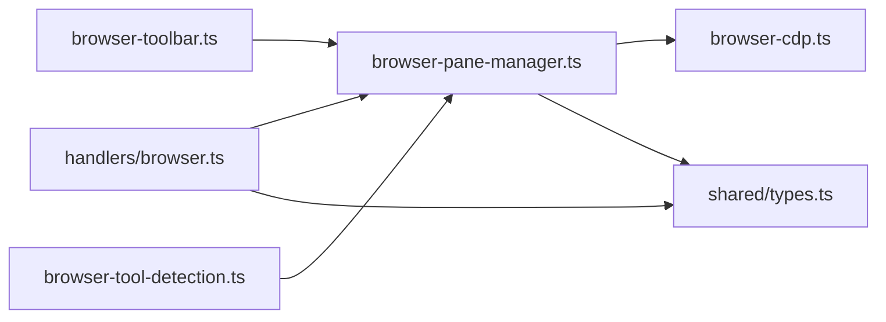

# 浏览器集成

<cite>
**本文档引用的文件**
- [apps/electron/src/main/browser-pane-manager.ts](file://apps/electron/src/main/browser-pane-manager.ts)
- [apps/electron/src/main/browser-cdp.ts](file://apps/electron/src/main/browser-cdp.ts)
- [apps/electron/src/preload/browser-toolbar.ts](file://apps/electron/src/preload/browser-toolbar.ts)
- [apps/electron/src/main/handlers/browser.ts](file://apps/electron/src/main/handlers/browser.ts)
- [packages/server-core/src/domain/browser-tool-detection.ts](file://packages/server-core/src/domain/browser-tool-detection.ts)
- [apps/electron/src/shared/types.ts](file://apps/electron/src/shared/types.ts)
- [apps/electron/src/main/__tests__/browser-pane-manager.test.ts](file://apps/electron/src/main/__tests__/browser-pane-manager.test.ts)
- [apps/electron/src/main/__tests__/browser-cdp.test.ts](file://apps/electron/src/main/__tests__/browser-cdp.test.ts)
- [apps/electron/src/main/__tests__/browser-tool-detection.test.ts](file://apps/electron/src/main/__tests__/browser-tool-detection.test.ts)
</cite>

## 目录

1. [简介](#简介)
2. [项目结构](#项目结构)
3. [核心组件](#核心组件)
4. [架构总览](#架构总览)
5. [组件详细分析](#组件详细分析)
6. [依赖关系分析](#依赖关系分析)
7. [性能考量](#性能考量)
8. [故障排除指南](#故障排除指南)
9. [结论](#结论)
10. [附录](#附录)

## 简介

本文件面向 Craft Agents 浏览器集成系统，重点解析 BrowserPaneManager 的设计与实现，涵盖浏览器面板创建与管理、服务协调、Chrome DevTools Protocol（CDP）集成、浏览器工具检测机制、会话绑定与标签页控制、工具栏集成、配置选项、性能优化与兼容性考虑，并提供故障排除与调试建议。

## 项目结构

浏览器集成系统主要由以下模块构成：

- 主进程管理：BrowserPaneManager 负责浏览器实例生命周期、窗口布局、状态同步与事件处理
- CDP 辅助：BrowserCDP 提供无障碍快照、元素交互、截图标注等能力
- 工具栏预加载：browser-toolbar 预加载脚本暴露最小 API 给渲染层进行导航与状态更新
- RPC 处理器：handlers/browser 将主进程能力通过 RPC 暴露给渲染层
- 工具检测：browser-tool-detection 规范化工具名并决定是否激活浏览器覆盖层
- 类型定义：shared/types 定义了 RPC 通道、浏览器实例信息等类型

图表来源

- [apps/electron/src/main/browser-pane-manager.ts](file://apps/electron/src/main/browser-pane-manager.ts#L311-L3154)
- [apps/electron/src/main/browser-cdp.ts](file://apps/electron/src/main/browser-cdp.ts#L93-L1062)
- [apps/electron/src/preload/browser-toolbar.ts](file://apps/electron/src/preload/browser-toolbar.ts#L1-L54)
- [apps/electron/src/main/handlers/browser.ts](file://apps/electron/src/main/handlers/browser.ts#L26-L185)
- [packages/server-core/src/domain/browser-tool-detection.ts](file://packages/server-core/src/domain/browser-tool-detection.ts#L1-L44)

章节来源

- [apps/electron/src/main/browser-pane-manager.ts](file://apps/electron/src/main/browser-pane-manager.ts#L1-L120)
- [apps/electron/src/main/browser-cdp.ts](file://apps/electron/src/main/browser-cdp.ts#L1-L100)
- [apps/electron/src/preload/browser-toolbar.ts](file://apps/electron/src/preload/browser-toolbar.ts#L1-L54)
- [apps/electron/src/main/handlers/browser.ts](file://apps/electron/src/main/handlers/browser.ts#L1-L185)
- [packages/server-core/src/domain/browser-tool-detection.ts](file://packages/server-core/src/domain/browser-tool-detection.ts#L1-L44)
- [apps/electron/src/shared/types.ts](file://apps/electron/src/shared/types.ts#L70-L86)

## 核心组件

- BrowserPaneManager：负责创建/销毁浏览器实例、窗口布局、状态同步、会话绑定、代理网络请求与下载、主题色提取与观察、截图捕获与标注、安全挑战检测、键盘与鼠标输入、弹窗管理等
- BrowserCDP：基于 Electron 的 webContents.debugger 实现无障碍快照、元素几何查询、临时覆盖层渲染、坐标点击/拖拽、文本输入、剪贴板读写、文件选择等
- browser-toolbar 预加载：向渲染层暴露最小 API，支持导航、前进后退、重载、停止、菜单几何、隐藏/销毁、状态与主题色推送
- handlers/browser：注册 RPC 通道，将 BrowserPaneManager 的能力暴露给渲染层
- browser-tool-detection：规范化工具名、提取命令动词、判断是否应激活浏览器覆盖层

章节来源

- [apps/electron/src/main/browser-pane-manager.ts](file://apps/electron/src/main/browser-pane-manager.ts#L311-L3154)
- [apps/electron/src/main/browser-cdp.ts](file://apps/electron/src/main/browser-cdp.ts#L93-L1062)
- [apps/electron/src/preload/browser-toolbar.ts](file://apps/electron/src/preload/browser-toolbar.ts#L25-L53)
- [apps/electron/src/main/handlers/browser.ts](file://apps/electron/src/main/handlers/browser.ts#L26-L185)
- [packages/server-core/src/domain/browser-tool-detection.ts](file://packages/server-core/src/domain/browser-tool-detection.ts#L21-L42)

## 架构总览

BrowserPaneManager 采用“多 BrowserView 叠加”的无框窗口设计，将页面视图、工具栏视图与原生覆盖视图分别管理，配合 Electron 的 webContents 与 debugger API 实现稳定可控的浏览器自动化体验。

图表来源

- [apps/electron/src/main/browser-pane-manager.ts](file://apps/electron/src/main/browser-pane-manager.ts#L311-L1200)
- [apps/electron/src/main/browser-cdp.ts](file://apps/electron/src/main/browser-cdp.ts#L93-L1062)

## 组件详细分析

### BrowserPaneManager 设计与实现

- 实例模型与生命周期
  - 使用 Map 存储实例，支持按 ID 查找、销毁、状态回调
  - 支持会话绑定（ownerType/sessionId），自动复用未绑定实例
  - 窗口关闭策略：可拦截为隐藏，保持实例存活以便复用
- 多视图叠加与布局
  - pageView 承载网页内容；toolbarView 嵌入工具栏；nativeOverlayView 提供原生覆盖层
  - 通过 setTopBrowserView 确保工具栏始终在最上层
  - 根据窗口尺寸动态调整各视图大小
- 状态同步与事件
  - 监听 did-navigate、did-navigate-in-page、page-title-updated、page-favicon-updated、console-message 等事件
  - 通过 pushToolbarState 向工具栏推送当前状态（URL、标题、加载状态、可前进后退、主题色）
  - 通过 RPC 广播实例状态变更与移除事件
- 会话绑定与复用
  - createForSession 优先复用未绑定实例，避免窗口碎片化
  - unbindAllForSession 在会话结束时释放绑定但保留窗口
- 主题色提取与观察
  - 初次导航后延迟提取主题色，后续通过 MutationObserver 与滚动/尺寸变化事件持续观察
  - 通过 console 信号与 did-change-theme-color 事件更新主题色
- 截图与标注
  - 支持 raw/agent 模式，agent 模式从无障碍快照生成 ref 并标注几何框与点击点
  - 截图前自动隐藏原生覆盖层，完成后恢复
  - 对不可见窗口采用“非侵入性唤醒”策略进行救援捕获
- 安全挑战检测
  - 基于标题、URL、DOM 文本与无障碍树统计进行检测
- 弹窗管理
  - 记录父实例与子窗口映射，销毁父实例时一并清理子窗口
- 权限与网络观测
  - 为共享会话设置权限白名单
  - 通过 webRequest/onBeforeRequest/onCompleted/onErrorOccurred 统计网络活动
- 工具栏 IPC
  - 注册工具栏导航、前进后退、重载、停止、菜单几何、隐藏/销毁等 IPC 处理函数

章节来源

- [apps/electron/src/main/browser-pane-manager.ts](file://apps/electron/src/main/browser-pane-manager.ts#L346-L502)
- [apps/electron/src/main/browser-pane-manager.ts](file://apps/electron/src/main/browser-pane-manager.ts#L504-L552)
- [apps/electron/src/main/browser-pane-manager.ts](file://apps/electron/src/main/browser-pane-manager.ts#L655-L717)
- [apps/electron/src/main/browser-pane-manager.ts](file://apps/electron/src/main/browser-pane-manager.ts#L764-L809)
- [apps/electron/src/main/browser-pane-manager.ts](file://apps/electron/src/main/browser-pane-manager.ts#L966-L1106)
- [apps/electron/src/main/browser-pane-manager.ts](file://apps/electron/src/main/browser-pane-manager.ts#L1606-L1610)
- [apps/electron/src/main/browser-pane-manager.ts](file://apps/electron/src/main/browser-pane-manager.ts#L1612-L1681)
- [apps/electron/src/main/browser-pane-manager.ts](file://apps/electron/src/main/browser-pane-manager.ts#L2079-L2100)
- [apps/electron/src/main/browser-pane-manager.ts](file://apps/electron/src/main/browser-pane-manager.ts#L2230-L2297)
- [apps/electron/src/main/browser-pane-manager.ts](file://apps/electron/src/main/browser-pane-manager.ts#L2682-L2834)

### BrowserCDP：CDP 集成与元素交互

- CDP 生命周期
  - 自动 attach，首次调用后缓存 attached 状态；注册一次 detach 监听
  - 空闲定时器在最后一次调用后自动 detach，避免资源泄漏
- 无障碍快照与 ref 映射
  - 解析 Accessibility.getFullAXTree，过滤非交互/非内容节点，分配 @eN 引用
  - 通过 backendDOMNodeId 稳定 ref，跨快照保持一致
- 元素几何与覆盖层
  - getElementGeometry 获取盒模型，计算中心点击点
  - renderTemporaryOverlay/clearTemporaryOverlay 在页面注入覆盖层用于标注
- 输入与交互
  - clickAtCoordinates：先生成轨迹，再使用原生 sendInputEvent，失败回退到 CDP Input.dispatchMouseEvent
  - drag：生成轨迹序列，确保按下/移动/释放按钮状态正确
  - typeText：逐字符派发 keyDown/keyUp
  - setClipboard/getClipboard：通过 Runtime.evaluate 使用 navigator.clipboard
- 表单操作
  - fillElement：聚焦、清空、逐字符输入、触发 change
  - selectOption：支持原生 select 与 ARIA combobox/listbox，验证选中值一致性
  - setFileInputFiles：设置文件输入路径列表

章节来源

- [apps/electron/src/main/browser-cdp.ts](file://apps/electron/src/main/browser-cdp.ts#L110-L165)
- [apps/electron/src/main/browser-cdp.ts](file://apps/electron/src/main/browser-cdp.ts#L189-L351)
- [apps/electron/src/main/browser-cdp.ts](file://apps/electron/src/main/browser-cdp.ts#L357-L451)
- [apps/electron/src/main/browser-cdp.ts](file://apps/electron/src/main/browser-cdp.ts#L475-L571)
- [apps/electron/src/main/browser-cdp.ts](file://apps/electron/src/main/browser-cdp.ts#L688-L751)
- [apps/electron/src/main/browser-cdp.ts](file://apps/electron/src/main/browser-cdp.ts#L777-L806)
- [apps/electron/src/main/browser-cdp.ts](file://apps/electron/src/main/browser-cdp.ts#L808-L853)
- [apps/electron/src/main/browser-cdp.ts](file://apps/electron/src/main/browser-cdp.ts#L855-L1041)
- [apps/electron/src/main/browser-cdp.ts](file://apps/electron/src/main/browser-cdp.ts#L1043-L1060)

### 工具栏集成与 IPC

- 预加载脚本暴露 browserToolbar API，包含导航、前进后退、重载、停止、菜单几何、隐藏/销毁、状态与主题色监听
- 主进程注册 IPC 处理函数，将工具栏动作转发至 BrowserPaneManager
- 工具栏状态通过 STATE_UPDATE 主动推送，主题色通过 THEME_COLOR 推送

章节来源

- [apps/electron/src/preload/browser-toolbar.ts](file://apps/electron/src/preload/browser-toolbar.ts#L25-L53)
- [apps/electron/src/main/browser-pane-manager.ts](file://apps/electron/src/main/browser-pane-manager.ts#L2230-L2297)
- [apps/electron/src/shared/types.ts](file://apps/electron/src/shared/types.ts#L74-L85)

### RPC 通道与渲染层对接

- handlers/browser 注册浏览器面板相关 RPC 通道（CREATE/DESTROY/LIST/NAVIGATE/GO_BACK/GO_FORWARD/RELOAD/STOP/FOCUS/CLICK/FILL/SELECT/SCREENSHOT/EVALUATE/SCROLL 等）
- 通过 pushTyped 广播 STATE_CHANGED/REMOVED/INTERACTED 事件
- 渲染层通过 ElectronAPI.browserPane 调用主进程能力

章节来源

- [apps/electron/src/main/handlers/browser.ts](file://apps/electron/src/main/handlers/browser.ts#L26-L185)
- [apps/electron/src/shared/types.ts](file://apps/electron/src/shared/types.ts#L519-L534)

### 浏览器工具检测机制

- normalizeBrowserToolName：规范化工具名，仅对 browser_tool 返回标准化名称
- getBrowserToolCommandVerb：提取命令动词（首词）
- shouldActivateBrowserOverlay：排除 help/open/release/close/hide 等命令，仅对可执行动作激活覆盖层

章节来源

- [packages/server-core/src/domain/browser-tool-detection.ts](file://packages/server-core/src/domain/browser-tool-detection.ts#L21-L42)

### 关键流程时序图

#### 导航与状态同步

图表来源

- [apps/electron/src/main/handlers/browser.ts](file://apps/electron/src/main/handlers/browser.ts#L50-L57)
- [apps/electron/src/main/browser-pane-manager.ts](file://apps/electron/src/main/browser-pane-manager.ts#L655-L688)
- [apps/electron/src/main/browser-pane-manager.ts](file://apps/electron/src/main/browser-pane-manager.ts#L2216-L2227)

#### 截图与标注

图表来源

- [apps/electron/src/main/handlers/browser.ts](file://apps/electron/src/main/handlers/browser.ts#L134-L146)
- [apps/electron/src/main/browser-pane-manager.ts](file://apps/electron/src/main/browser-pane-manager.ts#L966-L1106)
- [apps/electron/src/main/browser-cdp.ts](file://apps/electron/src/main/browser-cdp.ts#L475-L571)

#### 元素点击与等待导航

图表来源

- [apps/electron/src/main/handlers/browser.ts](file://apps/electron/src/main/handlers/browser.ts#L107-L114)
- [apps/electron/src/main/browser-pane-manager.ts](file://apps/electron/src/main/browser-pane-manager.ts#L845-L901)
- [apps/electron/src/main/browser-pane-manager.ts](file://apps/electron/src/main/browser-pane-manager.ts#L1419-L1483)

### 复杂逻辑流程图：截图捕获与救援

图表来源

- [apps/electron/src/main/browser-pane-manager.ts](file://apps/electron/src/main/browser-pane-manager.ts#L1200-L1313)
- [apps/electron/src/main/browser-pane-manager.ts](file://apps/electron/src/main/browser-pane-manager.ts#L1366-L1378)

## 依赖关系分析

- 模块耦合
  - BrowserPaneManager 与 BrowserCDP 强耦合（前者持有后者实例）
  - BrowserPaneManager 与 Electron BrowserWindow/BrowserView/WebContents 紧密耦合
  - 预加载脚本与主进程通过 IPC 协作
- 外部依赖
  - Electron 的 webContents.debugger（CDP）、webRequest、setWindowOpenHandler
  - 渲染层通过 RPC 通道访问主进程能力
- 循环依赖
  - 未发现循环依赖；各模块职责清晰，接口边界明确

图表来源

- [apps/electron/src/preload/browser-toolbar.ts](file://apps/electron/src/preload/browser-toolbar.ts#L1-L54)
- [apps/electron/src/main/browser-pane-manager.ts](file://apps/electron/src/main/browser-pane-manager.ts#L1-L120)
- [apps/electron/src/main/browser-cdp.ts](file://apps/electron/src/main/browser-cdp.ts#L1-L100)
- [apps/electron/src/main/handlers/browser.ts](file://apps/electron/src/main/handlers/browser.ts#L1-L25)
- [apps/electron/src/shared/types.ts](file://apps/electron/src/shared/types.ts#L70-L86)
- [packages/server-core/src/domain/browser-tool-detection.ts](file://packages/server-core/src/domain/browser-tool-detection.ts#L1-L44)

章节来源

- [apps/electron/src/main/browser-pane-manager.ts](file://apps/electron/src/main/browser-pane-manager.ts#L1-L120)
- [apps/electron/src/main/browser-cdp.ts](file://apps/electron/src/main/browser-cdp.ts#L1-L100)
- [apps/electron/src/main/handlers/browser.ts](file://apps/electron/src/main/handlers/browser.ts#L1-L25)
- [apps/electron/src/shared/types.ts](file://apps/electron/src/shared/types.ts#L70-L86)
- [packages/server-core/src/domain/browser-tool-detection.ts](file://packages/server-core/src/domain/browser-tool-detection.ts#L1-L44)

## 性能考量

- CDP 自动附加与空闲分离
  - 首次调用时 attach，注册一次 detach 监听；每次调用后重置空闲定时器，避免频繁 attach/detach
- 截图优化
  - 优先隐藏捕获（stayHidden），减少绘制开销
  - 设备像素比降采样到 CSS 像素，保证坐标一致性
  - 救援策略：不可见窗口时短暂显示并延时，随后立即隐藏
- 网络观测与日志截断
  - 限制控制台/网络/下载日志数量，避免内存膨胀
- 无障碍快照裁剪
  - 最大节点数限制与主过滤规则，避免超大数据集
- 输入事件真实性
  - 鼠标轨迹生成轻微曲线与抖动，提升可信度

[本节为通用指导，无需特定文件引用]

## 故障排除指南

- 工具栏无法加载或闪烁
  - 主进程会重试多次加载，若仍失败则加载回退页；检查 VITE_DEV_SERVER_URL 与资源路径
  - 参考：工具栏加载与回退逻辑
- 截图为空或失败
  - 若提示“当前显示表面不可用”，先聚焦浏览器窗口再重试
  - 检查是否处于不可见窗口且未触发救援显示
  - 参考：截图捕获与救援流程
- 元素点击/拖拽失败
  - CDP 回退路径已内置；检查 ref 是否存在、元素是否可见
  - 参考：CDP 元素交互与回退
- 主题色不更新
  - 确认 did-change-theme-color 与观察者信号是否到达；检查 URL 变更导致的过期保护
  - 参考：主题色提取与观察
- 弹窗未关闭
  - 销毁父实例时会清理所有子窗口；确认父子映射是否正确建立
  - 参考：弹窗注册与清理
- 权限被拒绝
  - 仅允许白名单权限；非阻塞噪声会记录为 info 日志
  - 参考：权限设置与日志

章节来源

- [apps/electron/src/main/browser-pane-manager.ts](file://apps/electron/src/main/browser-pane-manager.ts#L2140-L2210)
- [apps/electron/src/main/browser-pane-manager.ts](file://apps/electron/src/main/browser-pane-manager.ts#L1200-L1313)
- [apps/electron/src/main/browser-cdp.ts](file://apps/electron/src/main/browser-cdp.ts#L688-L751)
- [apps/electron/src/main/browser-pane-manager.ts](file://apps/electron/src/main/browser-pane-manager.ts#L2400-L2546)
- [apps/electron/src/main/browser-pane-manager.ts](file://apps/electron/src/main/browser-pane-manager.ts#L2563-L2642)
- [apps/electron/src/main/browser-pane-manager.ts](file://apps/electron/src/main/browser-pane-manager.ts#L2797-L2834)

## 结论

BrowserPaneManager 通过“多视图叠加 + CDP + IPC”的架构，实现了稳定、可扩展的浏览器集成能力。其在会话绑定、主题色观察、截图标注、弹窗管理与权限控制等方面具备完善的工程化实践。结合工具检测机制与 RPC 通道，系统能够与渲染层无缝协作，满足复杂场景下的自动化需求。

[本节为总结，无需特定文件引用]

## 附录

### 配置选项与兼容性

- 会话绑定
  - createForSession/rebind/unbind：按会话复用窗口，避免碎片化
- 窗口行为
  - keepAliveOnWindowClose：拦截关闭改为隐藏，窗口可复用
- 截图参数
  - format/jpegQuality、annotate、refs、includeMetadata、includeLastAction
- 等待策略
  - waitFor 支持 selector/text/url/network-idle，可自定义超时与轮询间隔
- 权限白名单
  - 允许 fullscreen、pointerLock、window-management、notifications、geolocation、media、clipboard-read、clipboard-sanitized-write、idle-detection
- 兼容性
  - 通过 setWindowOpenHandler 限制弹窗协议与尺寸，确保安全性与一致性

章节来源

- [apps/electron/src/main/browser-pane-manager.ts](file://apps/electron/src/main/browser-pane-manager.ts#L1744-L1770)
- [apps/electron/src/main/browser-pane-manager.ts](file://apps/electron/src/main/browser-pane-manager.ts#L1832-L1894)
- [apps/electron/src/main/browser-pane-manager.ts](file://apps/electron/src/main/browser-pane-manager.ts#L966-L1106)
- [apps/electron/src/main/browser-pane-manager.ts](file://apps/electron/src/main/browser-pane-manager.ts#L1419-L1483)
- [apps/electron/src/main/browser-pane-manager.ts](file://apps/electron/src/main/browser-pane-manager.ts#L2797-L2834)
- [apps/electron/src/main/browser-pane-manager.ts](file://apps/electron/src/main/browser-pane-manager.ts#L3054-L3097)

### 测试要点

- 生命周期与会话绑定：实例创建/销毁、复用、绑定/解绑
- 导航与状态：URL 正常化、SPA 路由变化、主题色回放
- 截图与标注：空图像处理、救援显示、元数据输出
- CDP 交互：无障碍快照、元素几何、输入事件、表单操作
- 工具检测：工具名规范化、命令动词提取、覆盖层激活条件

章节来源

- [apps/electron/src/main/**tests**/browser-pane-manager.test.ts](file://apps/electron/src/main/__tests__/browser-pane-manager.test.ts#L248-L800)
- [apps/electron/src/main/**tests**/browser-cdp.test.ts](file://apps/electron/src/main/__tests__/browser-cdp.test.ts#L56-L488)
- [apps/electron/src/main/**tests**/browser-tool-detection.test.ts](file://apps/electron/src/main/__tests__/browser-tool-detection.test.ts#L9-L70)
