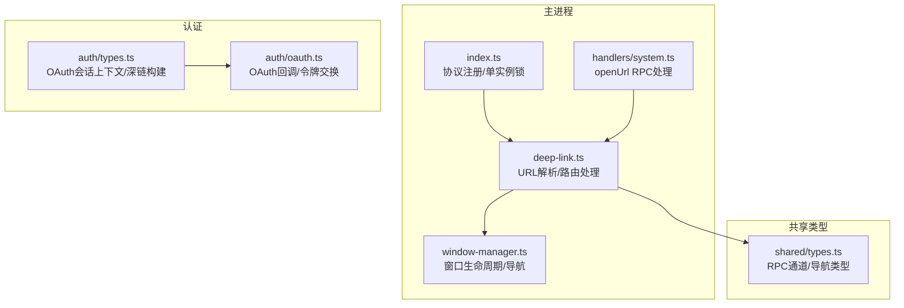
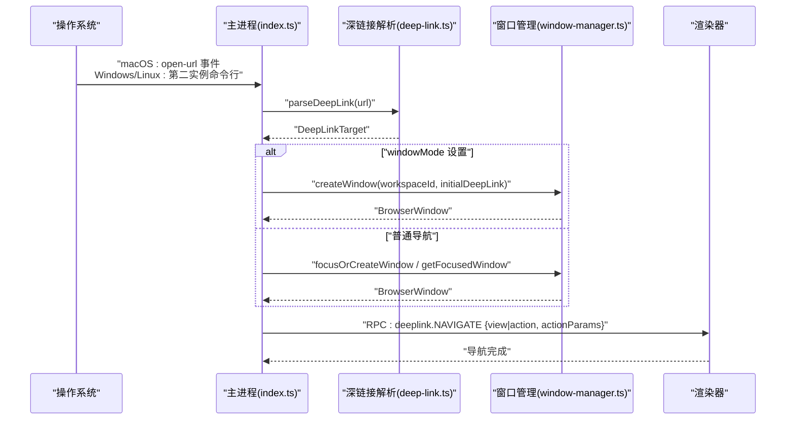
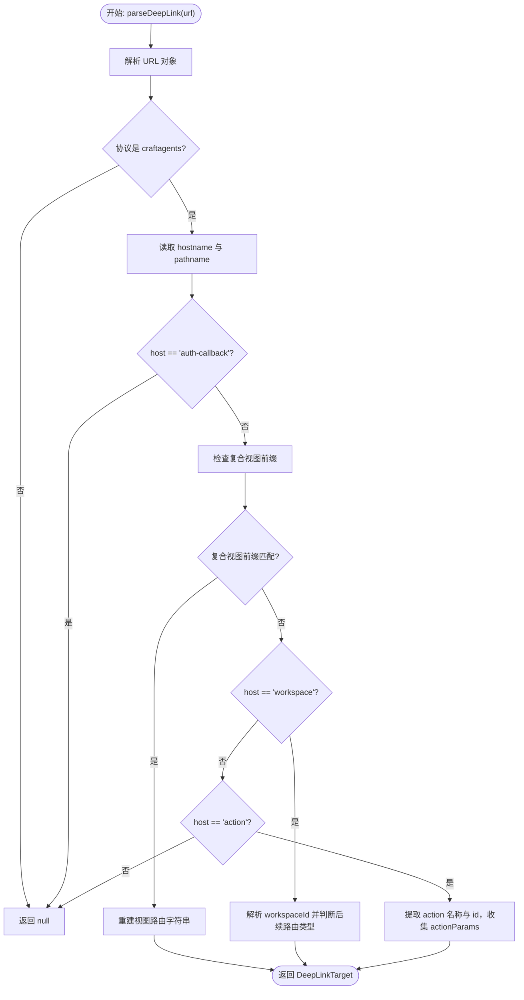
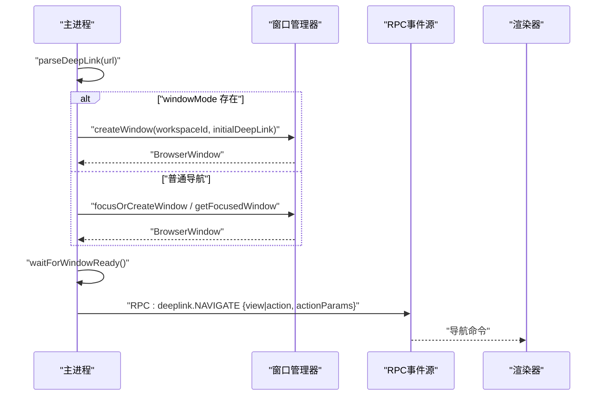
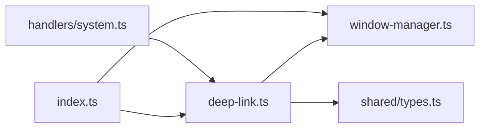

# 深链接系统

<cite>
**本文档引用的文件**
- [apps/electron/src/main/deep-link.ts](file://apps/electron/src/main/deep-link.ts)
- [apps/electron/src/main/index.ts](file://apps/electron/src/main/index.ts)
- [apps/electron/src/main/window-manager.ts](file://apps/electron/src/main/window-manager.ts)
- [apps/electron/src/main/handlers/system.ts](file://apps/electron/src/main/handlers/system.ts)
- [apps/electron/src/shared/types.ts](file://apps/electron/src/shared/types.ts)
- [packages/shared/src/auth/types.ts](file://packages/shared/src/auth/types.ts)
- [packages/shared/src/auth/oauth.ts](file://packages/shared/src/auth/oauth.ts)
- [apps/electron/src/main/__tests__/deep-link-routing.test.ts](file://apps/electron/src/main/__tests__/deep-link-routing.test.ts)
</cite>

## 目录

1. [简介](#简介)
2. [项目结构](#项目结构)
3. [核心组件](#核心组件)
4. [架构总览](#架构总览)
5. [详细组件分析](#详细组件分析)
6. [依赖关系分析](#依赖关系分析)
7. [性能考量](#性能考量)
8. [故障排除指南](#故障排除指南)
9. [结论](#结论)
10. [附录](#附录)

## 简介

本文件系统性阐述 Craft Agents 的深链接（Deep Link）系统，重点覆盖 craftagents:// 协议在 Electron 应用中的实现与集成。内容涵盖：

- 协议注册与跨平台差异（macOS open-url 事件、Windows/Linux 单实例锁）
- URL 解析与路由处理（复合视图、动作路由、工作区目标）
- 参数解析与数据传递（windowMode、sidebar、actionParams）
- 安全性与错误处理策略
- 配置选项与自定义处理器
- 常见场景与故障排除

## 项目结构

深链接系统主要由以下模块组成：

- 主进程深链接解析与处理：apps/electron/src/main/deep-link.ts
- 主进程入口与协议注册：apps/electron/src/main/index.ts
- 窗口管理器：apps/electron/src/main/window-manager.ts
- RPC 通道与导航类型：apps/electron/src/shared/types.ts
- OAuth 回调与深链构建：packages/shared/src/auth/types.ts、packages/shared/src/auth/oauth.ts
- 测试用例：apps/electron/src/main/**tests**/deep-link-routing.test.ts

图表来源

- [apps/electron/src/main/index.ts](file://apps/electron/src/main/index.ts#L167-L240)
- [apps/electron/src/main/deep-link.ts](file://apps/electron/src/main/deep-link.ts#L95-L200)
- [apps/electron/src/main/window-manager.ts](file://apps/electron/src/main/window-manager.ts#L104-L408)
- [apps/electron/src/main/handlers/system.ts](file://apps/electron/src/main/handlers/system.ts#L210-L235)
- [apps/electron/src/shared/types.ts](file://apps/electron/src/shared/types.ts#L199-L203)
- [packages/shared/src/auth/types.ts](file://packages/shared/src/auth/types.ts#L60-L75)
- [packages/shared/src/auth/oauth.ts](file://packages/shared/src/auth/oauth.ts#L316-L432)

章节来源

- [apps/electron/src/main/deep-link.ts](file://apps/electron/src/main/deep-link.ts#L1-L343)
- [apps/electron/src/main/index.ts](file://apps/electron/src/main/index.ts#L167-L240)
- [apps/electron/src/main/window-manager.ts](file://apps/electron/src/main/window-manager.ts#L104-L408)
- [apps/electron/src/shared/types.ts](file://apps/electron/src/shared/types.ts#L199-L203)
- [packages/shared/src/auth/types.ts](file://packages/shared/src/auth/types.ts#L60-L75)
- [packages/shared/src/auth/oauth.ts](file://packages/shared/src/auth/oauth.ts#L316-L432)

## 核心组件

- 深链接解析器：负责将 craftagents:// URL 解析为结构化目标（视图、动作、参数等），并处理 windowMode/sidebar 等查询参数。
- 深链接处理器：根据目标选择窗口或新建窗口，等待渲染器就绪后通过 RPC 发送导航命令。
- 协议注册与事件处理：在 macOS 上监听 open-url 事件，在 Windows/Linux 上通过单实例锁获取命令行中的深链。
- 窗口管理器：负责聚焦/创建窗口、保存状态、与渲染器通信。
- RPC 通道与导航类型：定义 deeplink.NAVIGATE 通道及导航载荷结构。
- OAuth 集成：OAuth 回调页生成深链，返回到会话或工作区。

章节来源

- [apps/electron/src/main/deep-link.ts](file://apps/electron/src/main/deep-link.ts#L95-L200)
- [apps/electron/src/main/deep-link.ts](file://apps/electron/src/main/deep-link.ts#L235-L342)
- [apps/electron/src/main/index.ts](file://apps/electron/src/main/index.ts#L185-L240)
- [apps/electron/src/main/window-manager.ts](file://apps/electron/src/main/window-manager.ts#L104-L408)
- [apps/electron/src/shared/types.ts](file://apps/electron/src/shared/types.ts#L199-L203)
- [packages/shared/src/auth/types.ts](file://packages/shared/src/auth/types.ts#L60-L75)

## 架构总览

深链接从系统层进入应用，经过主进程解析与路由，最终由渲染器执行导航。关键流程如下：

图表来源

- [apps/electron/src/main/index.ts](file://apps/electron/src/main/index.ts#L201-L240)
- [apps/electron/src/main/deep-link.ts](file://apps/electron/src/main/deep-link.ts#L95-L200)
- [apps/electron/src/main/deep-link.ts](file://apps/electron/src/main/deep-link.ts#L235-L342)
- [apps/electron/src/main/window-manager.ts](file://apps/electron/src/main/window-manager.ts#L104-L408)
- [apps/electron/src/shared/types.ts](file://apps/electron/src/shared/types.ts#L199-L203)

## 详细组件分析

### 深链接协议与 URL 结构

- 协议名：craftagents（可通过环境变量 CRAFT_DEEPLINK_SCHEME 自定义，支持多实例）
- 复合视图格式：
  - craftagents://allSessions[/session/{sessionId}]
  - craftagents://flagged[/session/{sessionId}]
  - craftagents://state/{stateId}[/session/{sessionId}]
  - craftagents://sources[/source/{sourceSlug}]
  - craftagents://settings[/{subpage}]
- 动作格式：
  - craftagents://action/{actionName}[/{id}][?params]
  - craftagents://workspace/{workspaceId}/action/{actionName}[?params]
- 特殊参数：
  - window=focused|full：控制是否新建窗口
  - sidebar=path：打开右侧边栏面板
- OAuth 回调：craftagents://auth-callback?... 交由现有处理器处理

章节来源

- [apps/electron/src/main/deep-link.ts](file://apps/electron/src/main/deep-link.ts#L6-L35)
- [apps/electron/src/main/deep-link.ts](file://apps/electron/src/main/deep-link.ts#L95-L200)

### URL 解析与路由逻辑

解析器将 URL 转换为 DeepLinkTarget，支持：

- 复合视图前缀匹配（allSessions、flagged、state、sources、settings、skills）
- 工作区目标（workspace/{workspaceId}）
- 动作路由（action/{actionName}，可带路径参数 id）
- 查询参数处理（window、sidebar 作为独立字段，其余参数合并为 actionParams）

图表来源

- [apps/electron/src/main/deep-link.ts](file://apps/electron/src/main/deep-link.ts#L95-L200)

章节来源

- [apps/electron/src/main/deep-link.ts](file://apps/electron/src/main/deep-link.ts#L95-L200)

### 跨平台深链接处理差异

- macOS：通过 app.on('open-url') 接收深链事件，立即调用 handleDeepLink。
- Windows/Linux：通过单实例锁（requestSingleInstanceLock）检测第二实例；在 second-instance 事件中从 commandLine 中提取 craftagents:// URL，再调用 handleDeepLink。
- 协议注册：在 app.whenReady() 之前注册默认协议客户端，确保系统能正确转发 URL 到应用。

章节来源

- [apps/electron/src/main/index.ts](file://apps/electron/src/main/index.ts#L185-L240)

### 深链接处理流程与窗口选择

- windowMode 处理：当 URL 包含 window=focused 或 window=full 时，解析器返回 windowMode；处理器据此创建新窗口并传入 initialDeepLink（已移除 window 参数）。
- 窗口选择：若未设置 windowMode，则优先使用当前焦点窗口，否则使用最近活跃窗口；若无窗口则返回错误。
- 渲染器就绪：等待 did-finish-load 后延时 100ms，确保 React 注册 IPC 监听后再发送导航命令。
- 导航命令：通过 RPC 发送 deeplink.NAVIGATE，目标可以是特定客户端或工作区广播。

图表来源

- [apps/electron/src/main/deep-link.ts](file://apps/electron/src/main/deep-link.ts#L235-L342)
- [apps/electron/src/main/window-manager.ts](file://apps/electron/src/main/window-manager.ts#L104-L408)
- [apps/electron/src/shared/types.ts](file://apps/electron/src/shared/types.ts#L199-L203)

章节来源

- [apps/electron/src/main/deep-link.ts](file://apps/electron/src/main/deep-link.ts#L235-L342)
- [apps/electron/src/main/window-manager.ts](file://apps/electron/src/main/window-manager.ts#L104-L408)

### 数据传递与导航类型

- DeepLinkNavigation：包含 view、action、actionParams 字段，用于渲染器侧导航。
- RPC 通道：RPC_CHANNELS.deeplink.NAVIGATE，支持按客户端或工作区广播。
- 客户端解析优先级：优先使用 resolveClientId 解析到目标客户端；若不存在则回退到 preferredClientId；若仍不可用则按工作区广播。

章节来源

- [apps/electron/src/main/deep-link.ts](file://apps/electron/src/main/deep-link.ts#L66-L72)
- [apps/electron/src/shared/types.ts](file://apps/electron/src/shared/types.ts#L199-L203)
- [apps/electron/src/main/**tests**/deep-link-routing.test.ts](file://apps/electron/src/main/__tests__/deep-link-routing.test.ts#L23-L103)

### OAuth 回调与深链集成

- OAuth 回调服务器在本地端口范围启动，收到授权码后生成回调页面，页面内嵌入深链 URL，引导用户回到应用。
- buildOAuthDeeplinkUrl 使用 OAuthSessionContext 构建深链，返回到会话列表或指定会话。
- 系统 openUrl RPC 处理器对 craftagents:// URL 进行内部处理，避免外部浏览器打开。

章节来源

- [packages/shared/src/auth/oauth.ts](file://packages/shared/src/auth/oauth.ts#L316-L432)
- [packages/shared/src/auth/types.ts](file://packages/shared/src/auth/types.ts#L60-L75)
- [apps/electron/src/main/handlers/system.ts](file://apps/electron/src/main/handlers/system.ts#L210-L235)

## 依赖关系分析

- deep-link.ts 依赖：
  - window-manager.ts：窗口聚焦/创建、工作区映射
  - shared/types.ts：RPC_CHANNELS.deeplink.NAVIGATE
  - logger：日志记录
- index.ts 依赖：
  - deep-link.ts：处理系统深链
  - window-manager.ts：窗口管理
  - 其他：协议注册、单实例锁、通知、自动更新等
- handlers/system.ts 依赖：
  - deep-link.ts：内部深链处理
  - openUrl 客户端能力校验

图表来源

- [apps/electron/src/main/deep-link.ts](file://apps/electron/src/main/deep-link.ts#L37-L41)
- [apps/electron/src/main/index.ts](file://apps/electron/src/main/index.ts#L89-L90)
- [apps/electron/src/main/handlers/system.ts](file://apps/electron/src/main/handlers/system.ts#L210-L216)

章节来源

- [apps/electron/src/main/deep-link.ts](file://apps/electron/src/main/deep-link.ts#L37-L41)
- [apps/electron/src/main/index.ts](file://apps/electron/src/main/index.ts#L89-L90)
- [apps/electron/src/main/handlers/system.ts](file://apps/electron/src/main/handlers/system.ts#L210-L216)

## 性能考量

- 渲染器就绪延迟：在 did-finish-load 后延时 100ms，确保 React 生命周期完成，避免 IPC 监听缺失导致的导航失败。
- 新窗口创建：windowMode 下创建新窗口，避免与现有窗口导航竞争，提升用户体验。
- RPC 广播：优先按客户端推送，减少不必要的广播开销；仅在无法解析客户端时回退到工作区广播。

[本节不直接分析具体文件，无需章节来源]

## 故障排除指南

- 无效深链 URL
  - 现象：返回 {success: false, error: 'Invalid deep link URL'}
  - 排查：确认协议为 craftagents:，且非 auth-callback；检查复合视图前缀或 action 路径是否正确。
- 无可用窗口进行导航
  - 现象：返回 {success: false, error: 'No active window to navigate'}
  - 排查：确保至少存在一个已创建的窗口；或使用 windowMode=focused/full 创建新窗口。
- 无工作区可用创建新窗口
  - 现象：返回 {success: false, error: 'No workspace available for new window'}
  - 排查：确保至少有一个工作区存在；或在有焦点窗口时自动推断工作区。
- OAuth 回调失败
  - 现象：回调页面显示错误或无授权码
  - 排查：检查本地回调端口范围是否被占用；确认 state 是否匹配；查看回调页面错误信息。
- 多实例深链冲突
  - 现象：第二实例未收到深链
  - 排查：确认 Windows/Linux 单实例锁逻辑；检查 commandLine 中是否存在 craftagents:// URL；确认 CRAFT_DEEPLINK_SCHEME 与系统注册一致。

章节来源

- [apps/electron/src/main/deep-link.ts](file://apps/electron/src/main/deep-link.ts#L244-L250)
- [apps/electron/src/main/deep-link.ts](file://apps/electron/src/main/deep-link.ts#L276-L279)
- [packages/shared/src/auth/oauth.ts](file://packages/shared/src/auth/oauth.ts#L332-L432)
- [apps/electron/src/main/index.ts](file://apps/electron/src/main/index.ts#L216-L240)

## 结论

Craft Agents 的深链接系统以 craftagents:// 为核心，结合主进程解析、窗口管理和 RPC 导航，实现了跨平台的一致体验。通过复合视图、动作路由、工作区目标与查询参数，系统能够灵活地将外部触发转化为精确的界面导航。同时，OAuth 集成与多实例支持进一步增强了系统的实用性和扩展性。建议在生产环境中配合严格的 URL 校验与错误处理，确保安全性与稳定性。

[本节不直接分析具体文件，无需章节来源]

## 附录

### 常见深链接场景

- 打开所有会话视图：craftagents://allSessions
- 打开特定会话详情：craftagents://allSessions/session/{sessionId}
- 打开标记过滤视图：craftagents://flagged
- 按状态过滤：craftagents://state/{stateId}
- 打开资源列表：craftagents://sources
- 打开设置页：craftagents://settings[/shortcuts|preferences]
- 新建聊天并自动发送消息：craftagents://action/new-chat?input=...&name=...&send=true
- 删除会话：craftagents://action/delete-session/{sessionId}
- 在新窗口打开：craftagents://allSessions?window=focused
- 打开右侧边栏：craftagents://allSessions?sidebar=files/path/to/file

章节来源

- [apps/electron/src/main/deep-link.ts](file://apps/electron/src/main/deep-link.ts#L6-L35)

### 配置选项与自定义

- 协议方案自定义：CRAFT_DEEPLINK_SCHEME（支持多实例，如 craftagents1、craftagents2）
- 应用名称自定义：CRAFT_APP_NAME（用于菜单栏标题）
- 开发模式多实例检测：脚本自动设置 CRAFT_VITE_PORT、CRAFT_APP_NAME、CRAFT_DEEPLINK_SCHEME

章节来源

- [apps/electron/src/main/index.ts](file://apps/electron/src/main/index.ts#L167-L183)
- [scripts/electron-dev.ts](file://scripts/electron-dev.ts#L66-L84)

### 集成指南

- 在系统中注册 craftagents:// 协议（主进程已自动注册）
- 在渲染器侧监听 onDeepLinkNavigate，接收导航载荷并更新路由
- 使用 RPC 通道 deeplink.NAVIGATE 接收导航命令
- 对于 OAuth 回调，使用 buildOAuthDeeplinkUrl 返回到会话或工作区

章节来源

- [apps/electron/src/main/index.ts](file://apps/electron/src/main/index.ts#L185-L195)
- [apps/electron/src/shared/types.ts](file://apps/electron/src/shared/types.ts#L310-L311)
- [packages/shared/src/auth/types.ts](file://packages/shared/src/auth/types.ts#L71-L75)
