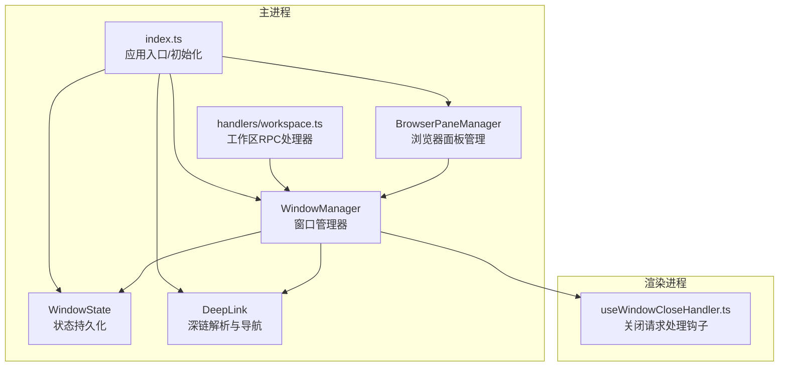
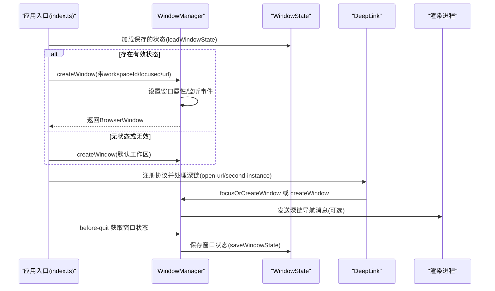
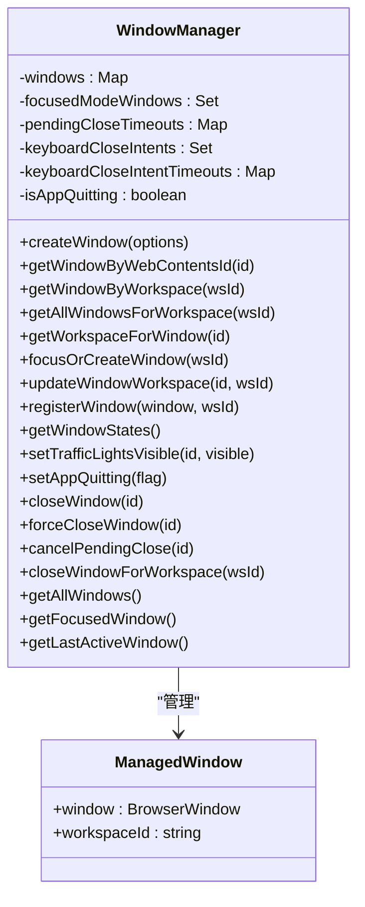
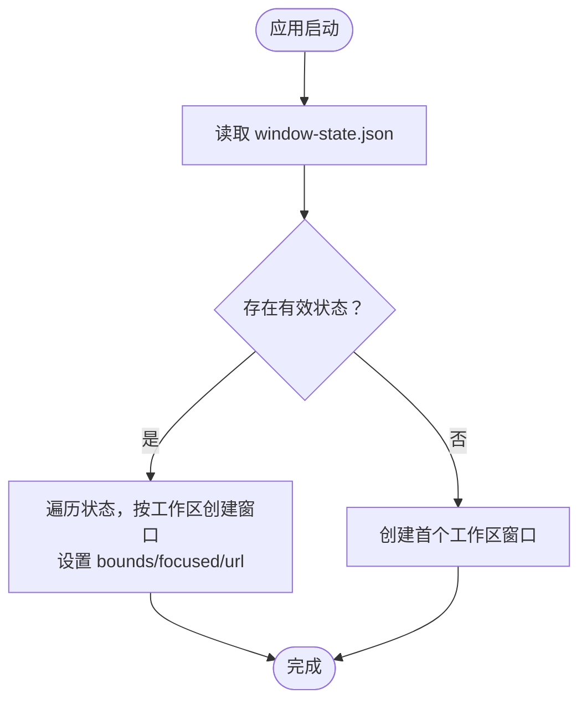
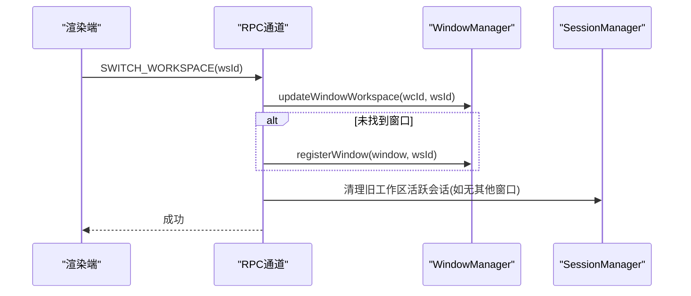
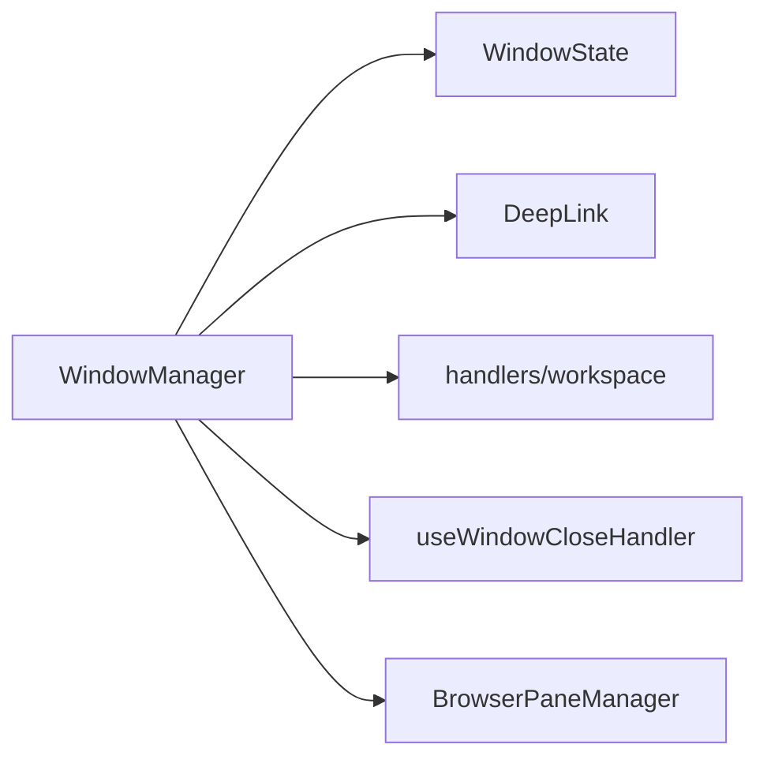

# 窗口管理系统

<cite>
**本文引用的文件列表**
- [apps/electron/src/main/window-manager.ts](file://apps/electron/src/main/window-manager.ts)
- [apps/electron/src/main/window-state.ts](file://apps/electron/src/main/window-state.ts)
- [apps/electron/src/main/index.ts](file://apps/electron/src/main/index.ts)
- [apps/electron/src/main/deep-link.ts](file://apps/electron/src/main/deep-link.ts)
- [apps/electron/src/main/browser-pane-manager.ts](file://apps/electron/src/main/browser-pane-manager.ts)
- [apps/electron/src/main/handlers/workspace.ts](file://apps/electron/src/main/handlers/workspace.ts)
- [packages/server-core/src/handlers/window-manager-interface.ts](file://packages/server-core/src/handlers/window-manager-interface.ts)
- [apps/electron/src/renderer/hooks/useWindowCloseHandler.ts](file://apps/electron/src/renderer/hooks/useWindowCloseHandler.ts)
- [apps/electron/src/main/notifications.ts](file://apps/electron/src/main/notifications.ts)
- [apps/electron/src/main/logger.ts](file://apps/electron/src/main/logger.ts)
</cite>

## 目录

1. [简介](#简介)
2. [项目结构](#项目结构)
3. [核心组件](#核心组件)
4. [架构总览](#架构总览)
5. [详细组件分析](#详细组件分析)
6. [依赖关系分析](#依赖关系分析)
7. [性能考量](#性能考量)
8. [故障排除指南](#故障排除指南)
9. [结论](#结论)
10. [附录](#附录)

## 简介

本文件系统性阐述 Craft Agents 的窗口管理系统，重点围绕 WindowManager 类的设计与实现，覆盖窗口创建、状态管理、多窗口协调、窗口状态持久化（窗口边界、焦点模式、URL 恢复）、工作空间与窗口的关联关系、窗口生命周期与最小化/还原行为、macOS 激活事件处理、平台特定功能、窗口配置选项与自定义行为，以及故障排除建议。文档同时提供可视化图示帮助理解代码结构与数据流。

## 项目结构

窗口管理相关的核心代码集中在 Electron 主进程的 main 目录中：

- 窗口管理器：window-manager.ts
- 窗口状态持久化：window-state.ts
- 应用入口与初始化：index.ts
- 深链路由：deep-link.ts
- 浏览器面板管理（与主窗口协同）：browser-pane-manager.ts
- 工作区相关 RPC 处理：handlers/workspace.ts
- 服务端接口契约：packages/server-core/src/handlers/window-manager-interface.ts
- 渲染侧关闭处理钩子：renderer/hooks/useWindowCloseHandler.ts
- 通知与 Dock 徽章：notifications.ts
- 日志系统：logger.ts

图表来源

- [apps/electron/src/main/window-manager.ts](file://apps/electron/src/main/window-manager.ts#L53-L646)
- [apps/electron/src/main/window-state.ts](file://apps/electron/src/main/window-state.ts#L1-L91)
- [apps/electron/src/main/index.ts](file://apps/electron/src/main/index.ts#L295-L738)
- [apps/electron/src/main/deep-link.ts](file://apps/electron/src/main/deep-link.ts#L1-L343)
- [apps/electron/src/main/browser-pane-manager.ts](file://apps/electron/src/main/browser-pane-manager.ts#L1-L3154)
- [apps/electron/src/main/handlers/workspace.ts](file://apps/electron/src/main/handlers/workspace.ts#L68-L136)
- [apps/electron/src/renderer/hooks/useWindowCloseHandler.ts](file://apps/electron/src/renderer/hooks/useWindowCloseHandler.ts#L1-L40)

章节来源

- [apps/electron/src/main/window-manager.ts](file://apps/electron/src/main/window-manager.ts#L1-L647)
- [apps/electron/src/main/window-state.ts](file://apps/electron/src/main/window-state.ts#L1-L91)
- [apps/electron/src/main/index.ts](file://apps/electron/src/main/index.ts#L295-L738)

## 核心组件

- WindowManager：负责创建、跟踪、关闭、聚焦、广播事件到窗口；支持窗口状态持久化导出；处理键盘关闭意图与层叠关闭流程；维护工作空间映射。
- WindowState：负责读取/写入用户目录下的 window-state.json，保存窗口边界、焦点模式、URL 等信息。
- DeepLink：解析 craftagents:// 协议 URL，决定是新建窗口还是在现有窗口内导航，并将目标传递给渲染端。
- BrowserPaneManager：管理独立的 BrowserWindow 实例（用于浏览器工具），与 WindowManager 协同，支持空状态页、代理导航、主题色提取等。
- handlers/workspace：提供工作区切换、窗口模式查询、关闭请求取消、交通灯可见性控制等 RPC 接口。
- index.ts：应用启动时加载工作区、恢复窗口状态、注册协议、初始化通知与 RPC 服务器，并在退出前保存窗口状态。

章节来源

- [apps/electron/src/main/window-manager.ts](file://apps/electron/src/main/window-manager.ts#L53-L646)
- [apps/electron/src/main/window-state.ts](file://apps/electron/src/main/window-state.ts#L14-L30)
- [apps/electron/src/main/deep-link.ts](file://apps/electron/src/main/deep-link.ts#L95-L200)
- [apps/electron/src/main/browser-pane-manager.ts](file://apps/electron/src/main/browser-pane-manager.ts#L311-L502)
- [apps/electron/src/main/handlers/workspace.ts](file://apps/electron/src/main/handlers/workspace.ts#L68-L136)
- [apps/electron/src/main/index.ts](file://apps/electron/src/main/index.ts#L243-L293)

## 架构总览

下图展示从应用启动到窗口创建、深链处理、窗口状态持久化的整体流程：

图表来源

- [apps/electron/src/main/index.ts](file://apps/electron/src/main/index.ts#L243-L293)
- [apps/electron/src/main/index.ts](file://apps/electron/src/main/index.ts#L752-L775)
- [apps/electron/src/main/deep-link.ts](file://apps/electron/src/main/deep-link.ts#L235-L342)
- [apps/electron/src/main/window-manager.ts](file://apps/electron/src/main/window-manager.ts#L104-L408)
- [apps/electron/src/main/window-state.ts](file://apps/electron/src/main/window-state.ts#L38-L76)

## 详细组件分析

### WindowManager 设计与实现

- 职责
  - 创建/销毁 BrowserWindow，设置平台特定属性（macOS 隐藏标题栏、Windows 透明材质、Linux 原生框架）
  - 维护 webContentsId → 窗口 → 工作空间 映射
  - 窗口关闭拦截与层叠关闭（模态/面板优先关闭，否则允许关闭）
  - 广播焦点状态、系统主题变化、深链导航
  - 导出窗口状态供持久化（边界、焦点模式、URL）
  - 支持工作区切换（更新映射/重新注册）、查找最近活动窗口、显示/隐藏交通灯按钮
- 关键数据结构
  - Map<number, ManagedWindow>：按 webContentsId 管理窗口
  - Set<number>：记录处于“专注模式”的窗口
  - Map<number, Timeout>：待决关闭超时，防止阻塞
  - Map<number, Timeout>：键盘关闭意图超时，避免误判
- 关键方法
  - createWindow(options)：根据 workspaceId、focused、initialDeepLink、restoreUrl 构建窗口并加载页面
  - focusOrCreateWindow(workspaceId)：聚焦已有窗口或新建
  - updateWindowWorkspace/webContentsId, workspaceId)：在窗口内切换工作区
  - getAllWindowsForWorkspace(workspaceId)：广播事件到同一工作区的所有窗口
  - getWindowStates()：导出窗口状态（bounds、focused、url）
  - setTrafficLightsVisible(...)：macOS 下控制交通灯按钮可见性
  - setAppQuitting(true)：在应用退出时绕过层叠关闭拦截
- 生命周期与事件
  - ready-to-show：首次绘制后显示窗口
  - will-navigate：限制外部导航
  - context-menu：开发环境启用右键菜单
  - did-fail-load：失败重试/回退到本地页面
  - focus/blur：广播焦点状态
  - before-input-event：捕获 Cmd/Ctrl+W，标记键盘关闭意图
  - close：层叠关闭拦截，发送 CLOSE_REQUESTED 到渲染端；设置 3 秒超时强制销毁
  - closed：清理定时器、键盘意图、主题监听器、映射表

图表来源

- [apps/electron/src/main/window-manager.ts](file://apps/electron/src/main/window-manager.ts#L37-L646)

章节来源

- [apps/electron/src/main/window-manager.ts](file://apps/electron/src/main/window-manager.ts#L53-L646)

### 窗口状态持久化机制

- 存储位置
  - 用户主目录下的 .craft-agent/window-state.json
- 保存时机
  - before-quit 时收集所有窗口状态（bounds、类型、是否聚焦、URL），并记录最后聚焦的工作区 ID
- 加载时机
  - 应用启动时读取 window-state.json，若存在则按工作区恢复窗口；否则打开第一个工作区
- 数据结构
  - SavedWindow：包含 type、workspaceId、bounds、focused（可选）、url（可选）
  - WindowState：windows 数组 + lastFocusedWorkspaceId（可选）

图表来源

- [apps/electron/src/main/index.ts](file://apps/electron/src/main/index.ts#L243-L293)
- [apps/electron/src/main/window-state.ts](file://apps/electron/src/main/window-state.ts#L14-L30)
- [apps/electron/src/main/window-state.ts](file://apps/electron/src/main/window-state.ts#L38-L76)

章节来源

- [apps/electron/src/main/window-state.ts](file://apps/electron/src/main/window-state.ts#L1-L91)
- [apps/electron/src/main/index.ts](file://apps/electron/src/main/index.ts#L243-L293)

### 工作空间与窗口的关联关系

- 映射
  - WindowManager 维护 webContentsId → 窗口 → workspaceId 的映射
- 查询与更新
  - getWorkspaceForWindow(webContentsId)：查询窗口所属工作区
  - updateWindowWorkspace(webContentsId, workspaceId)：在窗口内切换工作区
  - registerWindow(window, workspaceId)：当窗口刷新/重建后重新注册
  - getAllWindowsForWorkspace(workspaceId)：广播事件到该工作区所有窗口
- RPC 接口
  - 通过 handlers/workspace.ts 提供 SWITCH_WORKSPACE、GET_WORKSPACE、GET_MODE 等 RPC，确保推送路由与窗口映射一致

图表来源

- [apps/electron/src/main/handlers/workspace.ts](file://apps/electron/src/main/handlers/workspace.ts#L94-L136)
- [apps/electron/src/main/window-manager.ts](file://apps/electron/src/main/window-manager.ts#L523-L546)

章节来源

- [apps/electron/src/main/handlers/workspace.ts](file://apps/electron/src/main/handlers/workspace.ts#L68-L136)
- [apps/electron/src/main/window-manager.ts](file://apps/electron/src/main/window-manager.ts#L418-L546)

### 窗口生命周期管理与最小化/还原行为

- 生命周期
  - 创建：setAppQuitting(false)，注册事件监听，存储映射
  - 关闭拦截：close 事件中发送 CLOSE_REQUESTED；渲染端可选择关闭模态/面板或确认关闭
  - 强制关闭：forceCloseWindow 直接销毁窗口
  - 取消关闭：cancelPendingClose 清除待决超时，窗口保持
  - 键盘关闭意图：before-input-event 捕获 Cmd/Ctrl+W，短时标记，区分关闭来源
- 最小化/还原
  - focusOrCreateWindow：若窗口最小化则先 restore 再 focus
  - activate 事件：macOS 点击 Dock 时，若无窗口则按上次聚焦工作区或首个工作区创建新窗口
- 退出流程
  - before-quit：setAppQuitting(true) 绕过层叠关闭；保存窗口状态；flush 会话并清理资源

章节来源

- [apps/electron/src/main/window-manager.ts](file://apps/electron/src/main/window-manager.ts#L319-L408)
- [apps/electron/src/main/window-manager.ts](file://apps/electron/src/main/window-manager.ts#L558-L625)
- [apps/electron/src/main/index.ts](file://apps/electron/src/main/index.ts#L721-L737)
- [apps/electron/src/main/index.ts](file://apps/electron/src/main/index.ts#L752-L775)

### macOS 激活事件处理与平台特定功能

- 激活事件
  - activate：当 Dock 图标被点击且无窗口时，按上次聚焦工作区或首个工作区创建窗口
- 交通灯按钮
  - setTrafficLightsVisible：在全屏覆盖场景隐藏交通灯以避免误触；显示时恢复自定义位置
- 系统主题
  - 监听 nativeTheme.updated，向窗口广播系统主题变化
- Dock 徽章
  - initInstanceBadge：多实例开发时在 Dock 上显示实例号徽章
  - clearBadgeCount：清空徽章

章节来源

- [apps/electron/src/main/index.ts](file://apps/electron/src/main/index.ts#L721-L737)
- [apps/electron/src/main/window-manager.ts](file://apps/electron/src/main/window-manager.ts#L632-L645)
- [apps/electron/src/main/notifications.ts](file://apps/electron/src/main/notifications.ts#L279-L295)

### 窗口配置选项与自定义行为

- 窗口尺寸与布局
  - focused 模式：窗口更小（适合单会话视图）
  - 最小宽高约束：800×600
- 平台特定外观
  - macOS：隐藏标题栏、内嵌交通灯、vibrancy 效果
  - Windows：原生框架 + Mica/Acrylic 材质（根据系统版本）
  - Linux：原生框架
- 预加载与安全
  - 预加载脚本、上下文隔离、禁用 webviewTag、沙箱开关
- 外部链接与导航
  - will-navigate 仅允许内部 URL（file:// 或开发服务器）
  - setWindowOpenHandler 拦截外部打开，使用默认浏览器
- 深链处理
  - initialDeepLink：窗口就绪后发送深链导航消息
  - windowMode：focused/full 新建窗口模式
- RPC 事件推送
  - 在 RPC 服务器建立后，使用事件源推送消息，兼容直接 webContents.send 回退

章节来源

- [apps/electron/src/main/window-manager.ts](file://apps/electron/src/main/window-manager.ts#L127-L172)
- [apps/electron/src/main/window-manager.ts](file://apps/electron/src/main/window-manager.ts#L185-L195)
- [apps/electron/src/main/window-manager.ts](file://apps/electron/src/main/window-manager.ts#L285-L303)
- [apps/electron/src/main/index.ts](file://apps/electron/src/main/index.ts#L631-L637)

### 深链导航与窗口联动

- 解析规则
  - 支持复合视图（allSessions、flagged、state、sources、settings、skills）
  - 支持动作（action/new-chat、delete-session 等）
  - 支持 workspace/{wsId}/... 定位工作区
- 行为
  - windowMode=focused/full：新建窗口并传入初始深链
  - 否则：定位目标窗口（指定工作区或当前聚焦窗口），等待渲染就绪后发送导航命令
- 传输
  - 使用 RPC 通道或工作区广播，确保消息可靠送达

章节来源

- [apps/electron/src/main/deep-link.ts](file://apps/electron/src/main/deep-link.ts#L95-L200)
- [apps/electron/src/main/deep-link.ts](file://apps/electron/src/main/deep-link.ts#L235-L342)

## 依赖关系分析

- WindowManager 与 WindowState
  - WindowManager 导出窗口状态，WindowState 负责读写磁盘
- WindowManager 与 DeepLink
  - DeepLink 解析 URL 后调用 WindowManager 打开/聚焦窗口并导航
- WindowManager 与 handlers/workspace
  - RPC 接口驱动工作区切换与窗口映射同步
- WindowManager 与 BrowserPaneManager
  - BrowserPaneManager 管理独立 BrowserWindow 实例，与 WindowManager 协同（例如空状态页、主题色）
- WindowManager 与渲染端
  - 通过 RPC 通道或 webContents.send 推送事件（深链、主题、焦点、关闭请求）

图表来源

- [apps/electron/src/main/window-manager.ts](file://apps/electron/src/main/window-manager.ts#L53-L646)
- [apps/electron/src/main/window-state.ts](file://apps/electron/src/main/window-state.ts#L1-L91)
- [apps/electron/src/main/deep-link.ts](file://apps/electron/src/main/deep-link.ts#L1-L343)
- [apps/electron/src/main/browser-pane-manager.ts](file://apps/electron/src/main/browser-pane-manager.ts#L311-L502)
- [apps/electron/src/main/handlers/workspace.ts](file://apps/electron/src/main/handlers/workspace.ts#L68-L136)
- [apps/electron/src/renderer/hooks/useWindowCloseHandler.ts](file://apps/electron/src/renderer/hooks/useWindowCloseHandler.ts#L1-L40)

章节来源

- [packages/server-core/src/handlers/window-manager-interface.ts](file://packages/server-core/src/handlers/window-manager-interface.ts#L1-L23)

## 性能考量

- 启动体验
  - ready-to-show 延迟显示，减少白屏感知时间
  - did-fail-load 自动重试（开发模式）与回退策略（生产模式）
- 关闭拦截
  - 3 秒超时作为回退保障，避免 IPC 失败导致窗口卡死
- 状态持久化
  - 仅保存必要字段（bounds、focused、url），避免冗余数据
- 平台差异
  - Windows 透明材质按系统版本动态选择，避免不支持的 API
  - macOS 隐藏标题栏与交通灯，提升视觉一致性

[本节为通用指导，无需特定文件引用]

## 故障排除指南

- 窗口无法关闭
  - 检查是否触发了层叠关闭拦截：渲染端需正确响应 CLOSE_REQUESTED 并调用 cancelCloseWindow 或 confirmCloseWindow
  - 若 IPC 失败，等待 3 秒超时自动销毁
- 窗口状态未恢复
  - 确认 ~/.craft-agent/window-state.json 是否存在且格式正确
  - 检查工作区 ID 是否仍有效（已删除的工作区不会恢复）
- 深链无效
  - 确认协议已注册（open-url/second-instance）
  - 检查 URL 格式与 windowMode 参数
- macOS Dock 徽章异常
  - 确认 initInstanceBadge 调用与实例号参数
- 日志定位
  - 使用 mainLog、windowLog 等作用域日志输出关键事件（创建、关闭、状态变更）

章节来源

- [apps/electron/src/main/window-manager.ts](file://apps/electron/src/main/window-manager.ts#L343-L381)
- [apps/electron/src/main/window-manager.ts](file://apps/electron/src/main/window-manager.ts#L499-L505)
- [apps/electron/src/main/index.ts](file://apps/electron/src/main/index.ts#L201-L240)
- [apps/electron/src/main/notifications.ts](file://apps/electron/src/main/notifications.ts#L279-L295)
- [apps/electron/src/main/logger.ts](file://apps/electron/src/main/logger.ts#L62-L69)

## 结论

WindowManager 将窗口生命周期、工作区映射、深链导航、状态持久化与平台特性有机整合，提供了稳定可靠的多窗口管理能力。通过清晰的事件流与回退机制，系统在复杂场景（如 Wayland 环境、IPC 失败、多实例）下仍能保持可用性。配合 WindowState 的轻量持久化与 handlers/workspace 的 RPC 同步，实现了跨会话、跨工作区的一致体验。

[本节为总结，无需特定文件引用]

## 附录

- 关键接口与类型
  - CreateWindowOptions：workspaceId、focused、initialDeepLink、restoreUrl
  - SavedWindow：type、workspaceId、bounds、focused、url
  - WindowState：windows[]、lastFocusedWorkspaceId
- 常见问题速查
  - 窗口状态恢复失败：检查 window-state.json 与工作区有效性
  - 深链无响应：确认协议注册与 URL 格式
  - 关闭卡住：确认渲染端是否调用 confirmCloseWindow

[本节为补充信息，无需特定文件引用]
