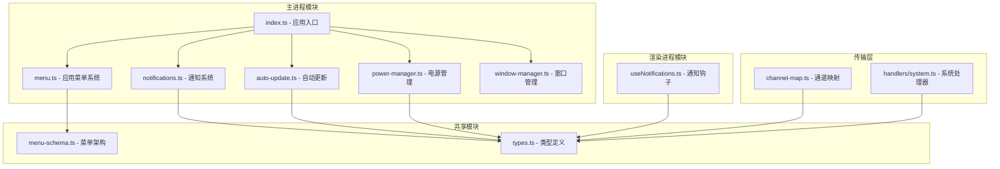
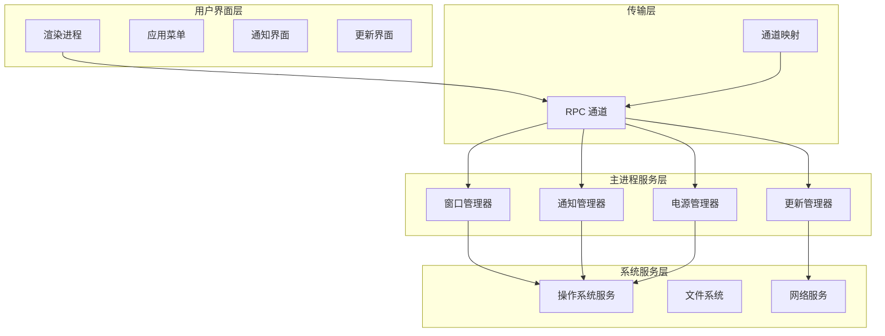
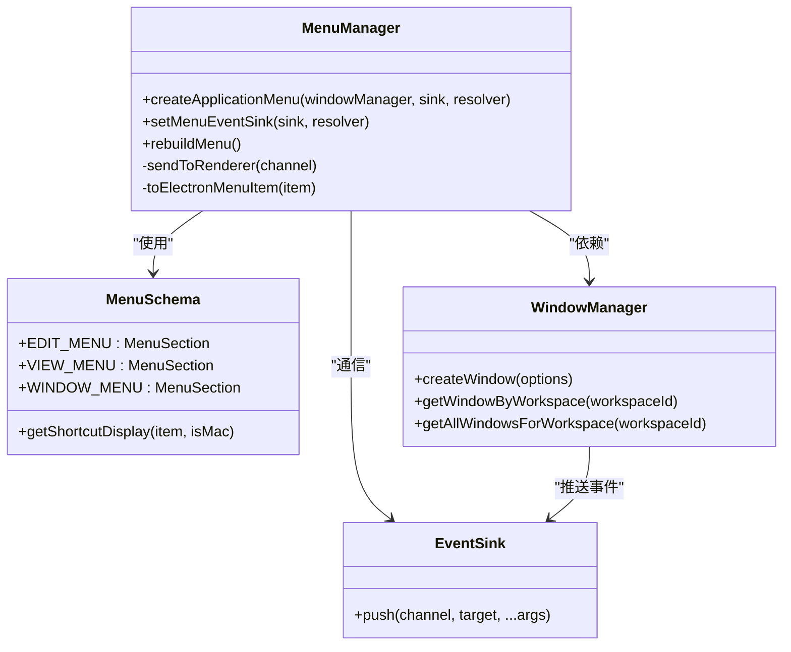
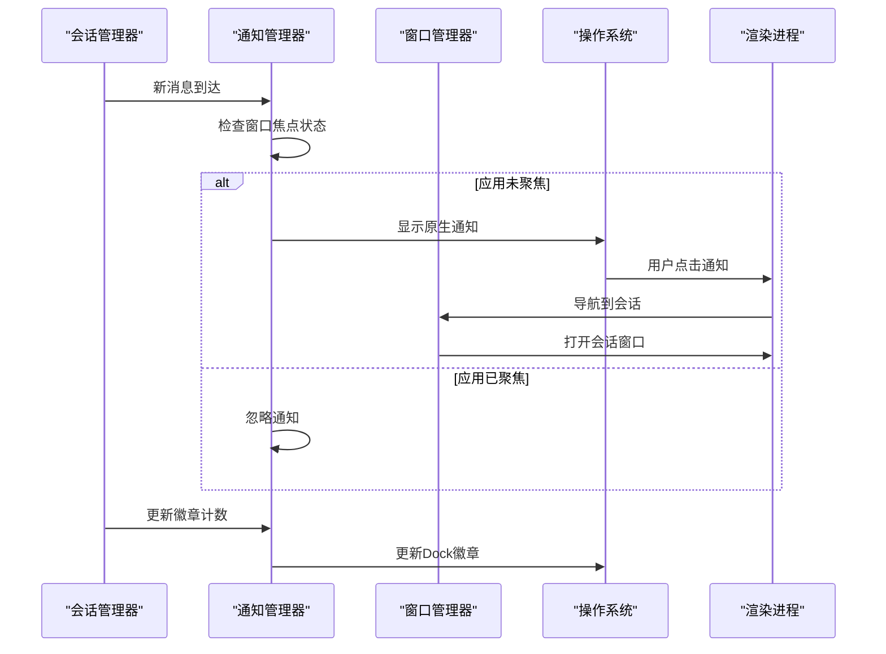
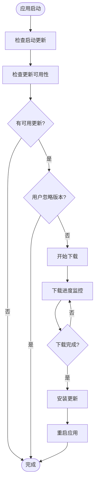
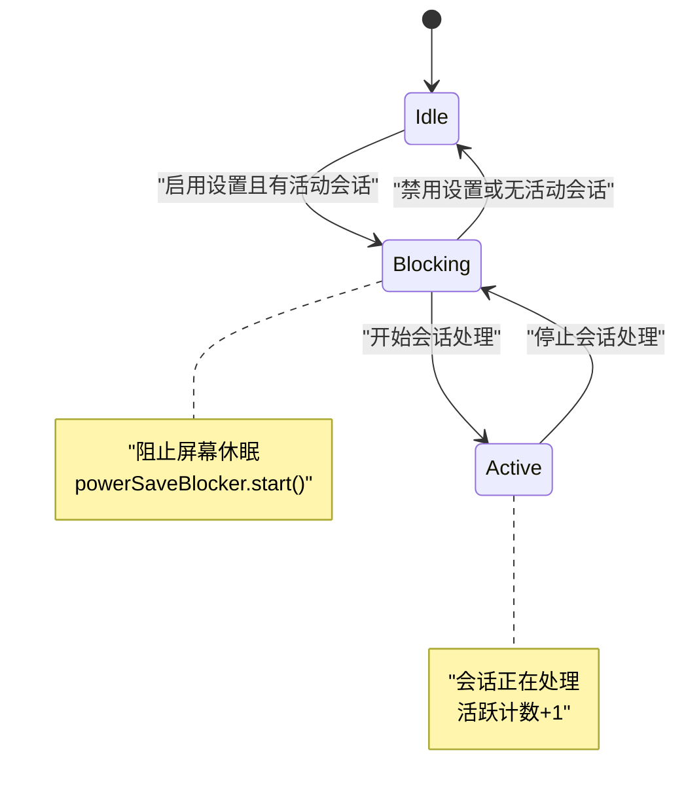
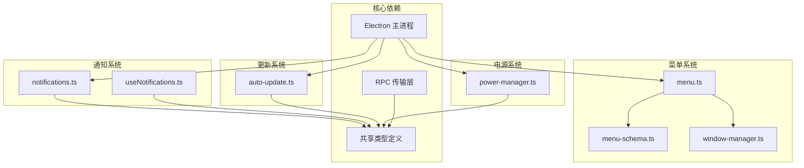

# 系统集成功能

<cite>
**本文档引用的文件**
- [apps/electron/src/main/menu.ts](file://apps/electron/src/main/menu.ts)
- [apps/electron/src/shared/menu-schema.ts](file://apps/electron/src/shared/menu-schema.ts)
- [apps/electron/src/shared/types.ts](file://apps/electron/src/shared/types.ts)
- [apps/electron/src/main/notifications.ts](file://apps/electron/src/main/notifications.ts)
- [apps/electron/src/renderer/hooks/useNotifications.ts](file://apps/electron/src/renderer/hooks/useNotifications.ts)
- [apps/electron/src/main/auto-update.ts](file://apps/electron/src/main/auto-update.ts)
- [apps/electron/src/main/power-manager.ts](file://apps/electron/src/main/power-manager.ts)
- [apps/electron/src/main/window-manager.ts](file://apps/electron/src/main/window-manager.ts)
- [apps/electron/src/main/index.ts](file://apps/electron/src/main/index.ts)
- [apps/electron/src/main/handlers/system.ts](file://apps/electron/src/main/handlers/system.ts)
- [apps/electron/src/transport/channel-map.ts](file://apps/electron/src/transport/channel-map.ts)
</cite>

## 目录

1. [简介](#简介)
2. [项目结构](#项目结构)
3. [核心组件](#核心组件)
4. [架构概览](#架构概览)
5. [详细组件分析](#详细组件分析)
6. [依赖关系分析](#依赖关系分析)
7. [性能考虑](#性能考虑)
8. [故障排除指南](#故障排除指南)
9. [结论](#结论)

## 简介

Craft Agents 系统集成功能是一个完整的桌面应用程序集成解决方案，专注于提供跨平台的系统级功能集成。该系统集成了四大核心功能模块：动态应用菜单系统、通知系统、自动更新机制和电源管理系统。

本系统采用 Electron 架构，通过主进程和渲染进程的分离设计，实现了高度模块化的系统集成。每个功能模块都遵循单一职责原则，通过清晰的接口和事件驱动的方式进行通信，确保了系统的可维护性和扩展性。

## 项目结构

Craft Agents 的系统集成功能主要分布在以下目录结构中：

**图表来源**

- [apps/electron/src/main/menu.ts](file://apps/electron/src/main/menu.ts#L1-L293)
- [apps/electron/src/main/notifications.ts](file://apps/electron/src/main/notifications.ts#L1-L296)
- [apps/electron/src/main/auto-update.ts](file://apps/electron/src/main/auto-update.ts#L1-L438)
- [apps/electron/src/main/power-manager.ts](file://apps/electron/src/main/power-manager.ts#L1-L109)

**章节来源**

- [apps/electron/src/main/menu.ts](file://apps/electron/src/main/menu.ts#L1-L293)
- [apps/electron/src/shared/menu-schema.ts](file://apps/electron/src/shared/menu-schema.ts#L1-L261)
- [apps/electron/src/main/notifications.ts](file://apps/electron/src/main/notifications.ts#L1-L296)

## 核心组件

### 动态应用菜单系统

动态应用菜单系统是 Craft Agents 的核心界面集成组件，支持跨平台的菜单动态生成和状态管理。

**主要特性：**

- 基于共享架构的菜单定义
- 平台特定的菜单行为
- 实时状态更新和重新构建
- 快捷键绑定和加速器管理

**章节来源**

- [apps/electron/src/main/menu.ts](file://apps/electron/src/main/menu.ts#L16-L293)
- [apps/electron/src/shared/menu-schema.ts](file://apps/electron/src/shared/menu-schema.ts#L1-L261)

### 通知系统

通知系统提供了完整的跨平台通知和徽章管理功能，包括原生系统通知、Dock 徽章显示和通知事件处理。

**主要特性：**

- 原生操作系统通知支持
- 跨平台徽章计数管理
- 通知点击事件导航
- 窗口焦点状态跟踪

**章节来源**

- [apps/electron/src/main/notifications.ts](file://apps/electron/src/main/notifications.ts#L1-L296)
- [apps/electron/src/renderer/hooks/useNotifications.ts](file://apps/electron/src/renderer/hooks/useNotifications.ts#L1-L203)

### 自动更新机制

自动更新机制使用 electron-updater 库实现了完整的更新检查、下载和安装流程。

**主要特性：**

- 智能更新检查和下载
- 平台特定的安装策略
- 更新进度广播
- 错误处理和回退机制

**章节来源**

- [apps/electron/src/main/auto-update.ts](file://apps/electron/src/main/auto-update.ts#L1-L438)

### 电源管理系统

电源管理系统通过 Electron 的 powerSaveBlocker API 阻止屏幕休眠，确保会话处理期间的系统稳定性。

**主要特性：**

- 屏幕休眠阻止功能
- 会话状态跟踪
- 设置变更响应
- 资源清理和释放

**章节来源**

- [apps/electron/src/main/power-manager.ts](file://apps/electron/src/main/power-manager.ts#L1-L109)

## 架构概览

Craft Agents 的系统集成功能采用分层架构设计，实现了清晰的关注点分离和模块化组织。

**图表来源**

- [apps/electron/src/main/index.ts](file://apps/electron/src/main/index.ts#L1-L831)
- [apps/electron/src/transport/channel-map.ts](file://apps/electron/src/transport/channel-map.ts#L76-L102)

## 详细组件分析

### 应用菜单系统分析

应用菜单系统实现了动态菜单生成和状态管理的核心功能。

**图表来源**

- [apps/electron/src/main/menu.ts](file://apps/electron/src/main/menu.ts#L22-L293)
- [apps/electron/src/shared/menu-schema.ts](file://apps/electron/src/shared/menu-schema.ts#L58-L205)
- [apps/electron/src/main/window-manager.ts](file://apps/electron/src/main/window-manager.ts#L53-L647)

**章节来源**

- [apps/electron/src/main/menu.ts](file://apps/electron/src/main/menu.ts#L45-L249)
- [apps/electron/src/shared/menu-schema.ts](file://apps/electron/src/shared/menu-schema.ts#L17-L52)

### 通知系统工作流程

通知系统的工作流程展示了从消息到达到底层系统通知的完整过程。

**图表来源**

- [apps/electron/src/main/notifications.ts](file://apps/electron/src/main/notifications.ts#L54-L125)
- [apps/electron/src/main/window-manager.ts](file://apps/electron/src/main/window-manager.ts#L421-L447)

**章节来源**

- [apps/electron/src/main/notifications.ts](file://apps/electron/src/main/notifications.ts#L46-L167)
- [apps/electron/src/renderer/hooks/useNotifications.ts](file://apps/electron/src/renderer/hooks/useNotifications.ts#L170-L203)

### 自动更新检查流程

自动更新机制实现了智能的更新检查和下载管理。

**图表来源**

- [apps/electron/src/main/auto-update.ts](file://apps/electron/src/main/auto-update.ts#L415-L437)
- [apps/electron/src/main/auto-update.ts](file://apps/electron/src/main/auto-update.ts#L316-L361)

**章节来源**

- [apps/electron/src/main/auto-update.ts](file://apps/electron/src/main/auto-update.ts#L130-L221)
- [apps/electron/src/main/auto-update.ts](file://apps/electron/src/main/auto-update.ts#L229-L308)

### 电源管理状态转换

电源管理系统通过状态转换图展示了屏幕休眠阻止的逻辑控制。

**图表来源**

- [apps/electron/src/main/power-manager.ts](file://apps/electron/src/main/power-manager.ts#L37-L70)

**章节来源**

- [apps/electron/src/main/power-manager.ts](file://apps/electron/src/main/power-manager.ts#L25-L87)

## 依赖关系分析

系统集成功能的依赖关系展现了各组件间的耦合度和交互模式。

**图表来源**

- [apps/electron/src/main/index.ts](file://apps/electron/src/main/index.ts#L69-L643)
- [apps/electron/src/transport/channel-map.ts](file://apps/electron/src/transport/channel-map.ts#L76-L102)

**章节来源**

- [apps/electron/src/main/index.ts](file://apps/electron/src/main/index.ts#L69-L643)
- [apps/electron/src/transport/channel-map.ts](file://apps/electron/src/transport/channel-map.ts#L76-L102)

## 性能考虑

系统集成功能在设计时充分考虑了性能优化和资源管理：

### 内存管理

- 使用弱引用避免循环依赖
- 及时清理事件监听器和定时器
- 按需加载模块减少初始内存占用

### 网络优化

- 智能更新检查避免频繁网络请求
- 下载进度监控和断点续传支持
- 缓存策略优化更新文件访问

### 系统资源

- 电源管理器避免不必要的系统调用
- 通知系统延迟初始化减少系统开销
- 窗口管理器优化窗口生命周期

## 故障排除指南

### 常见问题诊断

**菜单系统问题**

- 检查菜单架构定义是否正确
- 验证事件通道映射配置
- 确认窗口管理器状态同步

**通知系统问题**

- 验证操作系统通知权限
- 检查徽章图标初始化
- 确认渲染进程 Canvas API 可用性

**更新系统问题**

- 检查网络连接和代理设置
- 验证签名证书有效性
- 确认磁盘空间充足

**电源管理问题**

- 检查系统电源设置
- 验证权限要求
- 确认会话状态跟踪准确性

### 调试工具

系统提供了多种调试工具和日志记录机制：

- 详细的主进程日志输出
- 渲染进程调试模式支持
- RPC 通道监控和诊断
- 系统资源使用情况监控

**章节来源**

- [apps/electron/src/main/index.ts](file://apps/electron/src/main/index.ts#L106-L110)
- [apps/electron/src/main/logger.ts](file://apps/electron/src/main/logger.ts)

## 结论

Craft Agents 系统集成功能通过精心设计的架构和实现，为桌面应用程序提供了完整的系统级集成解决方案。四大核心功能模块——动态应用菜单系统、通知系统、自动更新机制和电源管理系统——协同工作，实现了跨平台的一致用户体验。

该系统的主要优势包括：

1. **模块化设计** - 每个功能模块独立实现，便于维护和扩展
2. **跨平台兼容** - 统一的接口设计支持 macOS、Windows 和 Linux
3. **事件驱动架构** - 基于 RPC 通道的松耦合通信
4. **资源优化** - 智能的资源管理和性能优化策略
5. **错误处理** - 完善的异常处理和故障恢复机制

通过持续的代码审查和测试，该系统集成功能为 Craft Agents 提供了稳定可靠的基础架构，为用户提供了流畅一致的应用体验。
