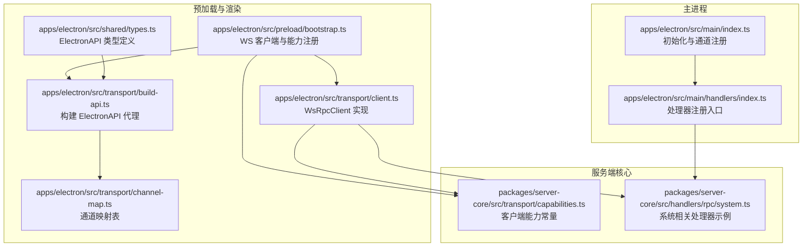
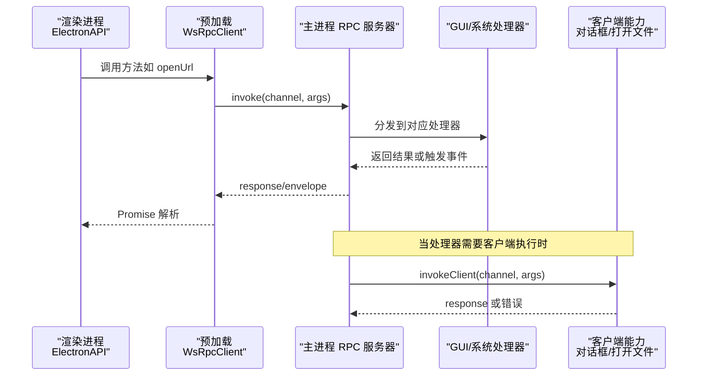
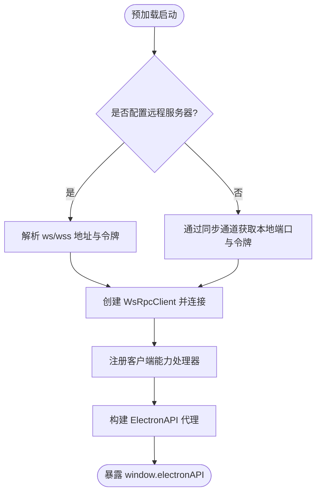
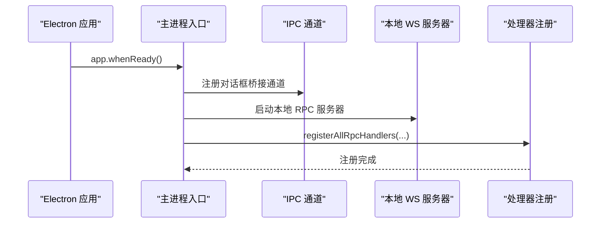
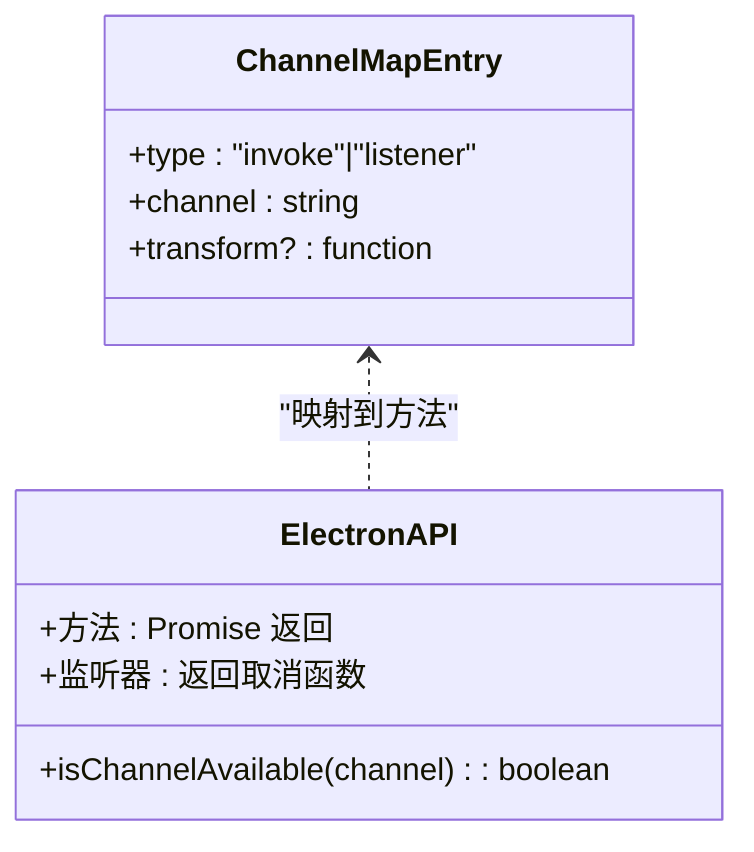
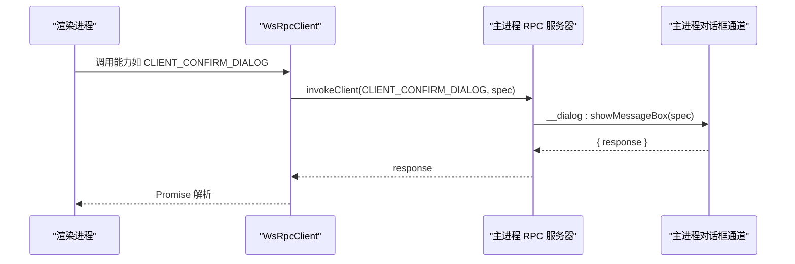
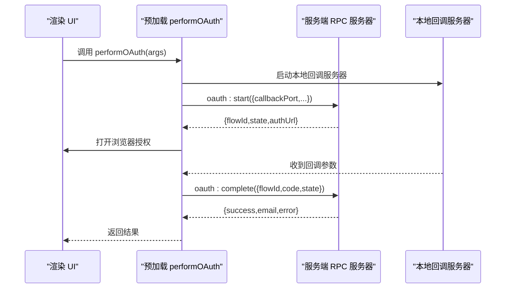
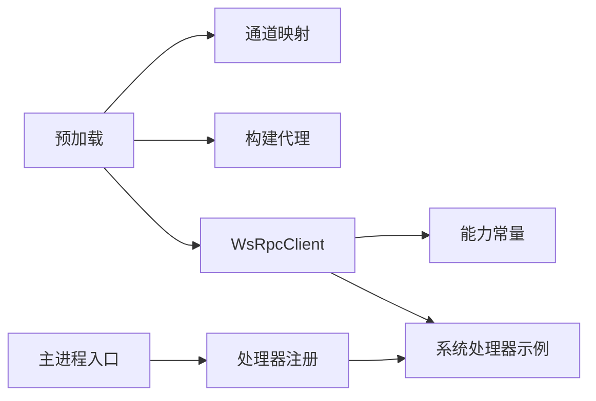

# 进程间通信(IPC)

<cite>
**本文引用的文件**
- [apps/electron/src/main/index.ts](file://apps/electron/src/main/index.ts)
- [apps/electron/src/preload/bootstrap.ts](file://apps/electron/src/preload/bootstrap.ts)
- [apps/electron/src/transport/build-api.ts](file://apps/electron/src/transport/build-api.ts)
- [apps/electron/src/transport/channel-map.ts](file://apps/electron/src/transport/channel-map.ts)
- [apps/electron/src/transport/client.ts](file://apps/electron/src/transport/client.ts)
- [apps/electron/src/shared/types.ts](file://apps/electron/src/shared/types.ts)
- [apps/electron/src/main/handlers/index.ts](file://apps/electron/src/main/handlers/index.ts)
- [packages/server-core/src/transport/capabilities.ts](file://packages/server-core/src/transport/capabilities.ts)
- [packages/server-core/src/handlers/rpc/system.ts](file://packages/server-core/src/handlers/rpc/system.ts)
</cite>

## 目录

1. [引言](#引言)
2. [项目结构](#项目结构)
3. [核心组件](#核心组件)
4. [架构总览](#架构总览)
5. [详细组件分析](#详细组件分析)
6. [依赖关系分析](#依赖关系分析)
7. [性能考量](#性能考量)
8. [故障排查指南](#故障排查指南)
9. [结论](#结论)
10. [附录](#附录)

## 引言

本文件系统性阐述 Craft Agents 在 Electron 环境下的进程间通信（IPC）机制，重点覆盖主进程与渲染进程之间的安全通信架构、预加载脚本的角色与职责、通道映射与代理构建、能力检测与对话框桥接、传输状态上报、以及同步与异步通信的使用场景与最佳实践。文档旨在帮助开发者在不直接阅读源码的情况下理解整体设计，并提供可操作的安全与性能建议。

## 项目结构

本项目的 IPC 体系由“主进程引导与通道注册”“预加载脚本与客户端代理”“通道映射与类型约束”三部分组成，配合服务端核心包提供的能力与处理器，形成从渲染层到主进程的完整调用链路。

**图表来源**

- [apps/electron/src/main/index.ts](file://apps/electron/src/main/index.ts#L295-L738)
- [apps/electron/src/preload/bootstrap.ts](file://apps/electron/src/preload/bootstrap.ts#L1-L314)
- [apps/electron/src/transport/build-api.ts](file://apps/electron/src/transport/build-api.ts#L1-L66)
- [apps/electron/src/transport/channel-map.ts](file://apps/electron/src/transport/channel-map.ts#L1-L335)
- [apps/electron/src/transport/client.ts](file://apps/electron/src/transport/client.ts#L1-L728)
- [apps/electron/src/shared/types.ts](file://apps/electron/src/shared/types.ts#L164-L559)
- [apps/electron/src/main/handlers/index.ts](file://apps/electron/src/main/handlers/index.ts#L1-L25)
- [packages/server-core/src/transport/capabilities.ts](file://packages/server-core/src/transport/capabilities.ts#L1-L75)
- [packages/server-core/src/handlers/rpc/system.ts](file://packages/server-core/src/handlers/rpc/system.ts#L187-L223)

**章节来源**

- [apps/electron/src/main/index.ts](file://apps/electron/src/main/index.ts#L295-L738)
- [apps/electron/src/preload/bootstrap.ts](file://apps/electron/src/preload/bootstrap.ts#L1-L314)
- [apps/electron/src/transport/build-api.ts](file://apps/electron/src/transport/build-api.ts#L1-L66)
- [apps/electron/src/transport/channel-map.ts](file://apps/electron/src/transport/channel-map.ts#L1-L335)
- [apps/electron/src/transport/client.ts](file://apps/electron/src/transport/client.ts#L1-L728)
- [apps/electron/src/shared/types.ts](file://apps/electron/src/shared/types.ts#L164-L559)
- [apps/electron/src/main/handlers/index.ts](file://apps/electron/src/main/handlers/index.ts#L1-L25)
- [packages/server-core/src/transport/capabilities.ts](file://packages/server-core/src/transport/capabilities.ts#L1-L75)
- [packages/server-core/src/handlers/rpc/system.ts](file://packages/server-core/src/handlers/rpc/system.ts#L187-L223)

## 核心组件

- 主进程引导与通道注册：负责初始化窗口管理、会话管理、通知、自动更新等子系统，并在启动时注册各类 RPC 处理器与对话框桥接通道，同时暴露本地 WebSocket 服务器供预加载连接。
- 预加载脚本与客户端代理：在渲染上下文内创建 WebSocket 客户端，建立与主进程的 RPC 通道；通过能力注册桥接仅主进程可用的能力（如对话框）；构建 ElectronAPI 代理以统一方法名与返回值形态。
- 通道映射与类型约束：以通道映射表将方法名映射到 RPC 通道，结合类型定义确保编译期安全；支持监听器与调用两种模式。
- 服务端核心能力与处理器：定义客户端能力常量，提供系统级处理器示例（如打开外部链接、打开文件、显示目录），并以统一的 invokeClient 能力请求方式在服务端驱动客户端执行。

**章节来源**

- [apps/electron/src/main/index.ts](file://apps/electron/src/main/index.ts#L498-L643)
- [apps/electron/src/preload/bootstrap.ts](file://apps/electron/src/preload/bootstrap.ts#L66-L100)
- [apps/electron/src/transport/build-api.ts](file://apps/electron/src/transport/build-api.ts#L25-L65)
- [apps/electron/src/transport/channel-map.ts](file://apps/electron/src/transport/channel-map.ts#L19-L334)
- [apps/electron/src/transport/client.ts](file://apps/electron/src/transport/client.ts#L101-L257)
- [apps/electron/src/shared/types.ts](file://apps/electron/src/shared/types.ts#L164-L559)
- [packages/server-core/src/transport/capabilities.ts](file://packages/server-core/src/transport/capabilities.ts#L9-L31)
- [packages/server-core/src/handlers/rpc/system.ts](file://packages/server-core/src/handlers/rpc/system.ts#L187-L223)

## 架构总览

下图展示了从渲染层发起调用到主进程处理的完整流程，以及主进程通过能力请求反向驱动客户端执行的路径。

**图表来源**

- [apps/electron/src/preload/bootstrap.ts](file://apps/electron/src/preload/bootstrap.ts#L167-L229)
- [apps/electron/src/transport/client.ts](file://apps/electron/src/transport/client.ts#L157-L203)
- [apps/electron/src/main/handlers/index.ts](file://apps/electron/src/main/handlers/index.ts#L21-L24)
- [packages/server-core/src/handlers/rpc/system.ts](file://packages/server-core/src/handlers/rpc/system.ts#L187-L223)
- [packages/server-core/src/transport/capabilities.ts](file://packages/server-core/src/transport/capabilities.ts#L44-L75)

## 详细组件分析

### 预加载脚本与 WsRpcClient

- 连接建立：预加载脚本在上下文中创建 WsRpcClient 并立即连接，根据是否配置远程服务器环境变量决定连接模式与认证方式。
- 能力注册：注册客户端能力处理器，将仅主进程可用的能力（如消息确认对话框、文件选择对话框）通过 ipcRenderer.invoke 桥接到主进程。
- 传输状态上报：在远程模式下，将连接状态变化上报给主进程，便于日志与诊断。
- 代理构建：基于通道映射表构建 ElectronAPI 代理，统一方法名与返回值形态，支持监听器与调用两种模式。

**图表来源**

- [apps/electron/src/preload/bootstrap.ts](file://apps/electron/src/preload/bootstrap.ts#L32-L100)
- [apps/electron/src/transport/build-api.ts](file://apps/electron/src/transport/build-api.ts#L25-L65)
- [apps/electron/src/transport/client.ts](file://apps/electron/src/transport/client.ts#L132-L151)

**章节来源**

- [apps/electron/src/preload/bootstrap.ts](file://apps/electron/src/preload/bootstrap.ts#L1-L314)
- [apps/electron/src/transport/client.ts](file://apps/electron/src/transport/client.ts#L101-L257)
- [apps/electron/src/transport/build-api.ts](file://apps/electron/src/transport/build-api.ts#L25-L65)

### 主进程引导与通道注册

- 初始化阶段：设置应用名称、协议注册、缩略图协议、深链处理、通知服务、浏览器窗格管理等。
- 对话框桥接：注册主进程专用通道，将渲染侧的对话框请求转发至系统对话框。
- 本地 WebSocket 服务器：在非薄客户端模式下启动本地 RPC 服务器，暴露端口与令牌供预加载连接。
- 处理器注册：集中注册核心与 GUI 专属处理器，确保通道覆盖无遗漏。

**图表来源**

- [apps/electron/src/main/index.ts](file://apps/electron/src/main/index.ts#L295-L738)
- [apps/electron/src/main/handlers/index.ts](file://apps/electron/src/main/handlers/index.ts#L21-L24)

**章节来源**

- [apps/electron/src/main/index.ts](file://apps/electron/src/main/index.ts#L498-L643)
- [apps/electron/src/main/handlers/index.ts](file://apps/electron/src/main/handlers/index.ts#L1-L25)

### 通道映射与类型约束

- 通道映射：以 CHANNEL_MAP 将方法名映射到 RPC 通道，支持监听器与调用两类条目，部分条目可带转换函数。
- 类型安全：ElectronAPI 接口定义了所有可用方法与事件回调签名，确保编译期类型检查。
- 代理构建：buildClientApi 基于映射表生成代理对象，支持嵌套命名空间与通道可用性检查。

**图表来源**

- [apps/electron/src/transport/channel-map.ts](file://apps/electron/src/transport/channel-map.ts#L15-L19)
- [apps/electron/src/transport/build-api.ts](file://apps/electron/src/transport/build-api.ts#L25-L65)
- [apps/electron/src/shared/types.ts](file://apps/electron/src/shared/types.ts#L205-L559)

**章节来源**

- [apps/electron/src/transport/channel-map.ts](file://apps/electron/src/transport/channel-map.ts#L1-L335)
- [apps/electron/src/transport/build-api.ts](file://apps/electron/src/transport/build-api.ts#L1-L66)
- [apps/electron/src/shared/types.ts](file://apps/electron/src/shared/types.ts#L164-L559)

### 能力检测与对话框桥接

- 能力检测：客户端在握手时声明自身能力，服务端通过 isChannelAvailable 判断通道可用性，避免调用不存在的处理器。
- 对话框桥接：渲染侧通过能力请求主进程对话框 API，主进程在收到请求后定位当前窗口并执行系统对话框，再将结果回传。

**图表来源**

- [apps/electron/src/preload/bootstrap.ts](file://apps/electron/src/preload/bootstrap.ts#L90-L98)
- [apps/electron/src/main/index.ts](file://apps/electron/src/main/index.ts#L541-L556)
- [packages/server-core/src/transport/capabilities.ts](file://packages/server-core/src/transport/capabilities.ts#L9-L31)

**章节来源**

- [apps/electron/src/preload/bootstrap.ts](file://apps/electron/src/preload/bootstrap.ts#L76-L100)
- [apps/electron/src/main/index.ts](file://apps/electron/src/main/index.ts#L541-L556)
- [packages/server-core/src/transport/capabilities.ts](file://packages/server-core/src/transport/capabilities.ts#L1-L75)

### OAuth 流程（多步骤编排）

- 预加载侧启动本地回调服务器，向服务端发起 OAuth 流程准备，随后在本地打开浏览器进行用户授权，等待回调后完成令牌交换与存储。
- Claude 与 ChatGPT 的 OAuth 具备特定差异（如 Claude 两步法与 ChatGPT 固定端口回调），预加载脚本提供对应的覆盖实现。

**图表来源**

- [apps/electron/src/preload/bootstrap.ts](file://apps/electron/src/preload/bootstrap.ts#L167-L229)
- [apps/electron/src/preload/bootstrap.ts](file://apps/electron/src/preload/bootstrap.ts#L231-L252)
- [apps/electron/src/preload/bootstrap.ts](file://apps/electron/src/preload/bootstrap.ts#L254-L311)

**章节来源**

- [apps/electron/src/preload/bootstrap.ts](file://apps/electron/src/preload/bootstrap.ts#L167-L311)

## 依赖关系分析

- 预加载依赖通道映射与客户端代理构建模块，以统一方法名与返回值形态。
- 主进程通过处理器注册入口集中注册核心与 GUI 专属处理器，确保通道覆盖无遗漏。
- 服务端核心包提供能力常量与处理器示例，驱动客户端执行系统级动作。

**图表来源**

- [apps/electron/src/preload/bootstrap.ts](file://apps/electron/src/preload/bootstrap.ts#L104-L105)
- [apps/electron/src/transport/channel-map.ts](file://apps/electron/src/transport/channel-map.ts#L19-L334)
- [apps/electron/src/transport/build-api.ts](file://apps/electron/src/transport/build-api.ts#L25-L65)
- [apps/electron/src/transport/client.ts](file://apps/electron/src/transport/client.ts#L101-L203)
- [apps/electron/src/main/index.ts](file://apps/electron/src/main/index.ts#L616-L625)
- [apps/electron/src/main/handlers/index.ts](file://apps/electron/src/main/handlers/index.ts#L21-L24)
- [packages/server-core/src/transport/capabilities.ts](file://packages/server-core/src/transport/capabilities.ts#L9-L31)
- [packages/server-core/src/handlers/rpc/system.ts](file://packages/server-core/src/handlers/rpc/system.ts#L187-L223)

**章节来源**

- [apps/electron/src/preload/bootstrap.ts](file://apps/electron/src/preload/bootstrap.ts#L104-L105)
- [apps/electron/src/transport/channel-map.ts](file://apps/electron/src/transport/channel-map.ts#L19-L334)
- [apps/electron/src/transport/build-api.ts](file://apps/electron/src/transport/build-api.ts#L25-L65)
- [apps/electron/src/transport/client.ts](file://apps/electron/src/transport/client.ts#L101-L203)
- [apps/electron/src/main/index.ts](file://apps/electron/src/main/index.ts#L616-L625)
- [apps/electron/src/main/handlers/index.ts](file://apps/electron/src/main/handlers/index.ts#L21-L24)
- [packages/server-core/src/transport/capabilities.ts](file://packages/server-core/src/transport/capabilities.ts#L1-L75)
- [packages/server-core/src/handlers/rpc/system.ts](file://packages/server-core/src/handlers/rpc/system.ts#L187-L223)

## 性能考量

- 连接复用与自动重连：客户端采用指数退避重连策略，减少网络波动对用户体验的影响；握手超时与请求超时参数可按需调整。
- 请求去抖与批处理：对于高频事件（如主题切换、窗口焦点变化），可在渲染侧进行去抖或合并，降低通道压力。
- 通道可用性检查：通过 isChannelAvailable 提前判断通道可用性，避免无效调用导致的错误与资源浪费。
- 传输状态监控：预加载侧将连接状态上报主进程，便于在日志中快速定位问题。

[本节为通用指导，无需列出章节来源]

## 故障排查指南

- 远程连接安全：当使用非本地明文 ws 协议时，预加载脚本会拒绝连接，必须使用 wss 并在服务端启用 TLS；若出现连接失败，优先检查证书与主机名。
- 握手失败与超时：客户端会在握手超时后进入失败状态，可通过 onConnectionStateChanged 获取详细错误信息；关注错误类别（认证、协议、超时、网络、服务器、未知）。
- 对话框无响应：确认主进程已注册对话框桥接通道，且渲染侧调用的是能力请求而非直接调用主进程方法。
- OAuth 回调异常：检查本地回调服务器端口占用与防火墙设置，确保回调路径正确；若中途取消，服务端会清理流程状态。

**章节来源**

- [apps/electron/src/preload/bootstrap.ts](file://apps/electron/src/preload/bootstrap.ts#L45-L54)
- [apps/electron/src/transport/client.ts](file://apps/electron/src/transport/client.ts#L283-L295)
- [apps/electron/src/main/index.ts](file://apps/electron/src/main/index.ts#L541-L556)
- [apps/electron/src/preload/bootstrap.ts](file://apps/electron/src/preload/bootstrap.ts#L167-L229)

## 结论

Craft Agents 的 IPC 体系以 WebSocket 为基础，结合预加载脚本与通道映射，实现了类型安全、能力可检测、可桥接系统能力的通信架构。主进程集中注册处理器，渲染侧通过代理统一调用，既保证了安全性，也提升了开发效率。遵循本文的最佳实践与安全建议，可进一步提升稳定性与性能。

[本节为总结性内容，无需列出章节来源]

## 附录

### 同步与异步通信模式

- 同步通道（sendSync）：用于在预加载阶段获取一次性上下文信息（如窗口 WebContents ID、工作区 ID、本地 WS 端口与令牌）。该模式阻塞渲染线程，应谨慎使用，仅在启动阶段获取必要信息。
- 异步通道（invoke）：用于常规 RPC 调用，返回 Promise；适用于大多数业务场景。
- 事件监听：通过 on(channel, callback) 订阅事件，返回取消函数；适合长连接事件流。

**章节来源**

- [apps/electron/src/preload/bootstrap.ts](file://apps/electron/src/preload/bootstrap.ts#L55-L64)
- [apps/electron/src/transport/client.ts](file://apps/electron/src/transport/client.ts#L185-L199)

### 常见通信模式与错误处理策略

- 统一错误包装：服务端处理器对客户端能力调用失败进行包装，返回可读的错误信息与可选的替代方案（如提示用户手动打开链接）。
- 优雅降级：当通道不可用或能力未就绪时，优先提示用户或提供替代路径。
- 日志与诊断：通过传输状态上报与主进程日志，快速定位连接问题与通道缺失。

**章节来源**

- [packages/server-core/src/transport/capabilities.ts](file://packages/server-core/src/transport/capabilities.ts#L44-L75)
- [apps/electron/src/preload/bootstrap.ts](file://apps/electron/src/preload/bootstrap.ts#L121-L157)
- [apps/electron/src/main/index.ts](file://apps/electron/src/main/index.ts#L506-L539)
