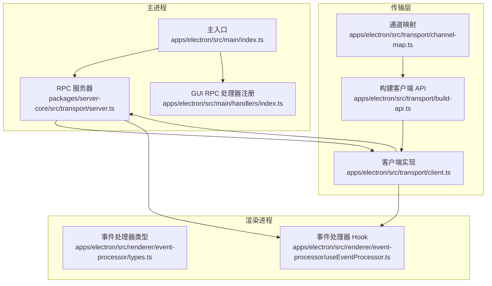
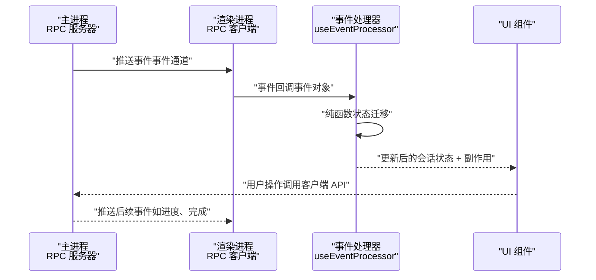
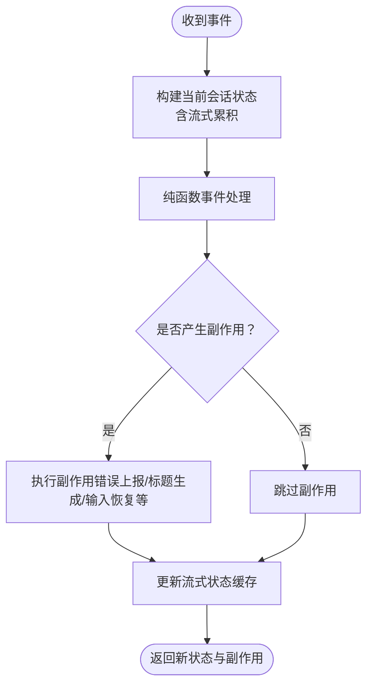
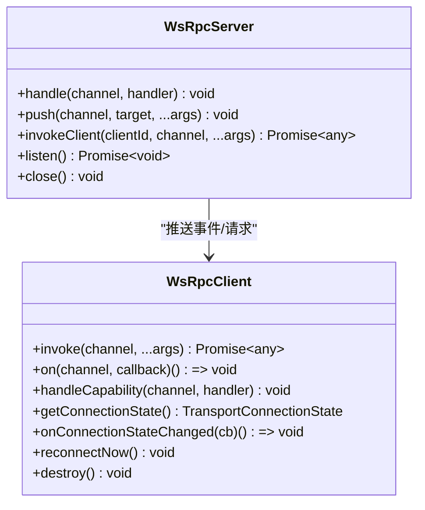
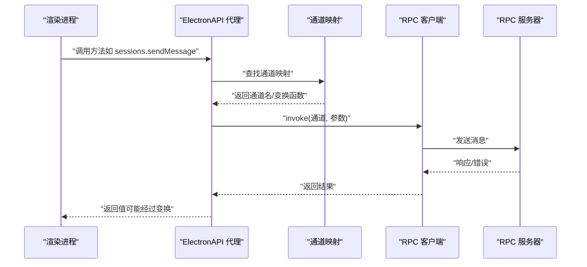
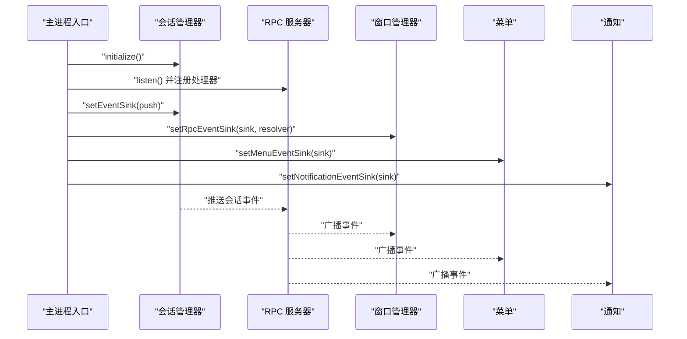
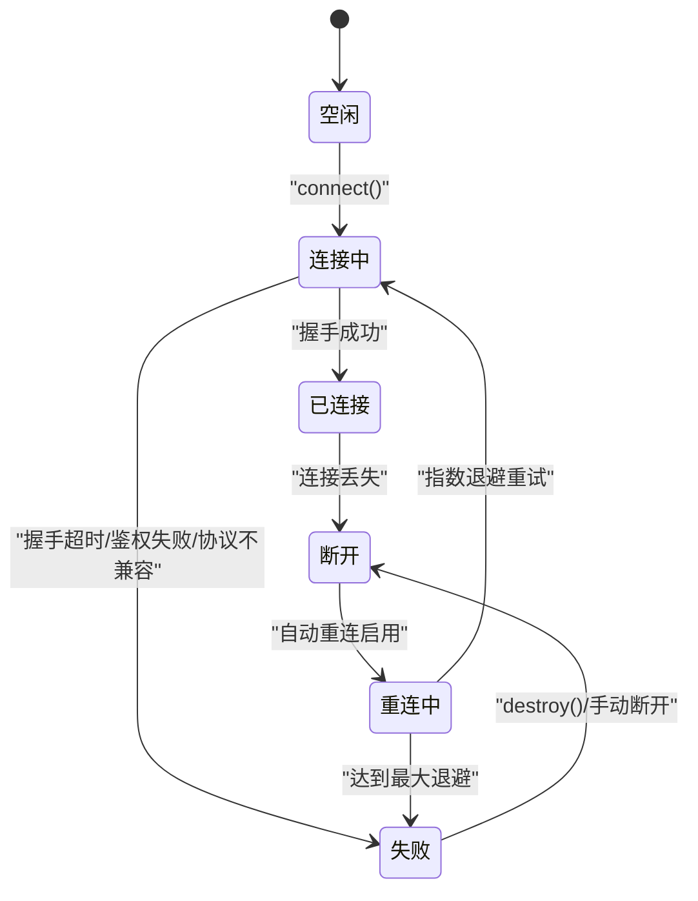
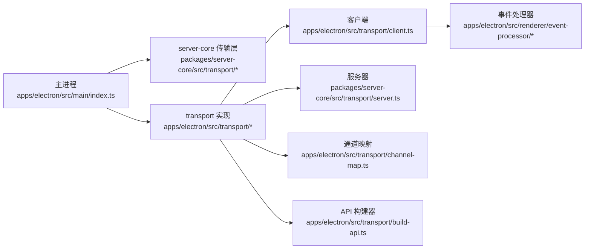

# 组件交互模式

<cite>
**本文引用的文件**
- [apps/electron/src/main/index.ts](file://apps/electron/src/main/index.ts)
- [apps/electron/src/main/handlers/index.ts](file://apps/electron/src/main/handlers/index.ts)
- [apps/electron/src/transport/index.ts](file://apps/electron/src/transport/index.ts)
- [apps/electron/src/transport/server.ts](file://apps/electron/src/transport/server.ts)
- [apps/electron/src/transport/client.ts](file://apps/electron/src/transport/client.ts)
- [apps/electron/src/transport/channel-map.ts](file://apps/electron/src/transport/channel-map.ts)
- [apps/electron/src/transport/build-api.ts](file://apps/electron/src/transport/build-api.ts)
- [packages/server-core/src/transport/index.ts](file://packages/server-core/src/transport/index.ts)
- [packages/server-core/src/transport/server.ts](file://packages/server-core/src/transport/server.ts)
- [apps/electron/src/renderer/event-processor/types.ts](file://apps/electron/src/renderer/event-processor/types.ts)
- [apps/electron/src/renderer/event-processor/useEventProcessor.ts](file://apps/electron/src/renderer/event-processor/useEventProcessor.ts)
</cite>

## 目录

1. [引言](#引言)
2. [项目结构](#项目结构)
3. [核心组件](#核心组件)
4. [架构总览](#架构总览)
5. [详细组件分析](#详细组件分析)
6. [依赖关系分析](#依赖关系分析)
7. [性能考量](#性能考量)
8. [故障排查指南](#故障排查指南)
9. [结论](#结论)
10. [附录](#附录)

## 引言

本文件聚焦于 Craft Agents 的组件交互模式，系统性阐述事件驱动架构、观察者模式与发布订阅机制在应用中的落地方式；详细说明组件间依赖关系、数据流与异步通信处理；解释事件处理器的注册与执行机制、错误传播与恢复策略；涵盖组件生命周期管理、资源清理与解耦设计原则；并通过交互序列图与状态转换图帮助理解复杂协作关系。

## 项目结构

该工程采用多包（monorepo）与多应用（Electron 主进程、渲染进程、CLI、Viewer）并存的组织方式。与组件交互密切相关的模块集中在以下位置：

- Electron 主进程：负责会话管理、RPC 服务器、窗口与通知、深链处理等
- Electron 渲染进程：事件处理器（纯函数 + React Hook）、事件类型定义
- 传输层：基于 WebSocket 的 RPC 客户端/服务器、通道映射与客户端 API 构建器
- 服务端核心（server-core）：RPC 类型、编码/解码、推送路由等

图表来源

- [apps/electron/src/main/index.ts](file://apps/electron/src/main/index.ts#L295-L720)
- [packages/server-core/src/transport/server.ts](file://packages/server-core/src/transport/server.ts#L83-L270)
- [apps/electron/src/transport/client.ts](file://apps/electron/src/transport/client.ts#L101-L151)
- [apps/electron/src/transport/channel-map.ts](file://apps/electron/src/transport/channel-map.ts#L19-L335)
- [apps/electron/src/transport/build-api.ts](file://apps/electron/src/transport/build-api.ts#L25-L66)
- [apps/electron/src/renderer/event-processor/types.ts](file://apps/electron/src/renderer/event-processor/types.ts#L1-L501)
- [apps/electron/src/renderer/event-processor/useEventProcessor.ts](file://apps/electron/src/renderer/event-processor/useEventProcessor.ts#L78-L131)

章节来源

- [apps/electron/src/main/index.ts](file://apps/electron/src/main/index.ts#L295-L720)
- [packages/server-core/src/transport/server.ts](file://packages/server-core/src/transport/server.ts#L83-L270)
- [apps/electron/src/transport/client.ts](file://apps/electron/src/transport/client.ts#L101-L151)
- [apps/electron/src/transport/channel-map.ts](file://apps/electron/src/transport/channel-map.ts#L19-L335)
- [apps/electron/src/transport/build-api.ts](file://apps/electron/src/transport/build-api.ts#L25-L66)
- [apps/electron/src/renderer/event-processor/types.ts](file://apps/electron/src/renderer/event-processor/types.ts#L1-L501)
- [apps/electron/src/renderer/event-processor/useEventProcessor.ts](file://apps/electron/src/renderer/event-processor/useEventProcessor.ts#L78-L131)

## 核心组件

- 事件处理器（纯函数 + Hook）
  - 事件类型定义集中于渲染进程，覆盖文本增量、工具执行、权限请求、认证请求、状态变更等丰富语义
  - Hook 负责维护每个会话的流式状态，调用纯函数进行状态迁移，并在副作用中上报错误到 Sentry
- RPC 传输层
  - 客户端：封装握手、请求/响应关联、事件监听、自动重连与连接状态回调
  - 服务器：统一处理握手、鉴权、心跳、请求分发、推送路由与断开清理
  - 通道映射与 API 构建：将方法名映射到通道，生成可调用的 ElectronAPI 代理
- 主进程集成
  - 初始化平台服务、注入运行时钩子、注册 RPC 处理器、设置事件 Sink、启动 RPC 服务器、处理深链与通知

章节来源

- [apps/electron/src/renderer/event-processor/types.ts](file://apps/electron/src/renderer/event-processor/types.ts#L1-L501)
- [apps/electron/src/renderer/event-processor/useEventProcessor.ts](file://apps/electron/src/renderer/event-processor/useEventProcessor.ts#L78-L131)
- [apps/electron/src/transport/client.ts](file://apps/electron/src/transport/client.ts#L101-L151)
- [packages/server-core/src/transport/server.ts](file://packages/server-core/src/transport/server.ts#L83-L270)
- [apps/electron/src/transport/channel-map.ts](file://apps/electron/src/transport/channel-map.ts#L19-L335)
- [apps/electron/src/transport/build-api.ts](file://apps/electron/src/transport/build-api.ts#L25-L66)
- [apps/electron/src/main/index.ts](file://apps/electron/src/main/index.ts#L364-L720)

## 架构总览

系统采用“事件驱动 + 发布订阅”的架构：

- 主进程通过 RPC 服务器向渲染进程推送事件（如会话状态变化、工具执行结果、权限请求等）
- 渲染进程使用纯函数事件处理器对事件进行状态迁移，同时触发副作用（如错误上报、标题生成、输入恢复等）
- 传输层以 WebSocket 为基础，提供可靠的消息编解码、握手与心跳、能力协商与自动重连

图表来源

- [packages/server-core/src/transport/server.ts](file://packages/server-core/src/transport/server.ts#L134-L149)
- [apps/electron/src/transport/client.ts](file://apps/electron/src/transport/client.ts#L185-L229)
- [apps/electron/src/renderer/event-processor/useEventProcessor.ts](file://apps/electron/src/renderer/event-processor/useEventProcessor.ts#L82-L115)

章节来源

- [packages/server-core/src/transport/server.ts](file://packages/server-core/src/transport/server.ts#L134-L149)
- [apps/electron/src/transport/client.ts](file://apps/electron/src/transport/client.ts#L185-L229)
- [apps/electron/src/renderer/event-processor/useEventProcessor.ts](file://apps/electron/src/renderer/event-processor/useEventProcessor.ts#L82-L115)

## 详细组件分析

### 事件处理器与状态机

- 事件类型覆盖文本增量/完成、工具开始/结果、权限/凭据请求、标签/源变更、状态/标志/归档、模型/连接变更、后台任务/外壳、认证请求/完成、使用量更新等
- 纯函数处理器接收当前会话状态与事件，返回新的会话状态与副作用列表
- Hook 维护每个会话的流式累积状态，避免将临时状态放入 React 状态树，降低重渲染成本

图表来源

- [apps/electron/src/renderer/event-processor/types.ts](file://apps/electron/src/renderer/event-processor/types.ts#L442-L501)
- [apps/electron/src/renderer/event-processor/useEventProcessor.ts](file://apps/electron/src/renderer/event-processor/useEventProcessor.ts#L82-L115)

章节来源

- [apps/electron/src/renderer/event-processor/types.ts](file://apps/electron/src/renderer/event-processor/types.ts#L1-L501)
- [apps/electron/src/renderer/event-processor/useEventProcessor.ts](file://apps/electron/src/renderer/event-processor/useEventProcessor.ts#L78-L131)

### RPC 客户端与服务器

- 客户端
  - 握手阶段携带工作区 ID、Electron webContentsId、令牌与能力集合
  - 请求/响应通过唯一 ID 关联，支持超时与失败重试
  - 支持事件监听、能力调用（capability），并提供连接状态变更回调
  - 断线后指数退避自动重连，失败原因分类（鉴权、协议、网络、超时、服务器）
- 服务器
  - 统一处理握手、鉴权（可选）、心跳（ping/pong）、请求分发、错误响应
  - 推送支持目标路由（全部/按工作区/按客户端），并清理断开连接的挂起请求
  - 提供 invokeClient 能力用于主动调用特定客户端能力

图表来源

- [apps/electron/src/transport/client.ts](file://apps/electron/src/transport/client.ts#L101-L151)
- [packages/server-core/src/transport/server.ts](file://packages/server-core/src/transport/server.ts#L83-L133)

章节来源

- [apps/electron/src/transport/client.ts](file://apps/electron/src/transport/client.ts#L101-L151)
- [packages/server-core/src/transport/server.ts](file://packages/server-core/src/transport/server.ts#L83-L133)

### 通道映射与客户端 API 构建

- 通道映射将高层方法名（如 sessions.sendMessage、browserPane.create）映射到底层通道常量
- 构建器根据映射生成 ElectronAPI 代理，支持嵌套命名空间（如 browserPane.create），并暴露通道可用性检查
- 渲染进程通过该代理调用主进程能力，形成“方法即通道”的统一接口

图表来源

- [apps/electron/src/transport/channel-map.ts](file://apps/electron/src/transport/channel-map.ts#L19-L335)
- [apps/electron/src/transport/build-api.ts](file://apps/electron/src/transport/build-api.ts#L25-L66)
- [apps/electron/src/transport/client.ts](file://apps/electron/src/transport/client.ts#L157-L183)

章节来源

- [apps/electron/src/transport/channel-map.ts](file://apps/electron/src/transport/channel-map.ts#L19-L335)
- [apps/electron/src/transport/build-api.ts](file://apps/electron/src/transport/build-api.ts#L25-L66)
- [apps/electron/src/transport/client.ts](file://apps/electron/src/transport/client.ts#L157-L183)

### 主进程初始化与事件 Sink

- 主进程在 app.whenReady 后初始化平台服务、会话管理器、RPC 服务器与事件 Sink
- 将会话事件通过 EventSink 推送到 RPC 服务器，再由服务器广播至所有或指定客户端
- 注册 GUI 专属 RPC 处理器，并在窗口管理器、菜单、通知等模块上设置事件 Sink，实现跨模块事件联动

图表来源

- [apps/electron/src/main/index.ts](file://apps/electron/src/main/index.ts#L364-L643)
- [apps/electron/src/main/handlers/index.ts](file://apps/electron/src/main/handlers/index.ts#L21-L24)
- [packages/server-core/src/transport/server.ts](file://packages/server-core/src/transport/server.ts#L134-L149)

章节来源

- [apps/electron/src/main/index.ts](file://apps/electron/src/main/index.ts#L364-L643)
- [apps/electron/src/main/handlers/index.ts](file://apps/electron/src/main/handlers/index.ts#L21-L24)
- [packages/server-core/src/transport/server.ts](file://packages/server-core/src/transport/server.ts#L134-L149)

### 连接状态与错误传播

- 客户端连接状态包含空闲、连接中、已连接、重连中、断开、失败等状态，支持错误分类与关闭信息记录
- 服务器心跳检测不活跃客户端并终止，防止僵尸连接
- 错误通过响应体的 error 字段传递，客户端据此分类并触发自动重连或失败回调

图表来源

- [apps/electron/src/transport/client.ts](file://apps/electron/src/transport/client.ts#L144-L151)
- [apps/electron/src/transport/client.ts](file://apps/electron/src/transport/client.ts#L571-L589)
- [packages/server-core/src/transport/server.ts](file://packages/server-core/src/transport/server.ts#L449-L465)

章节来源

- [apps/electron/src/transport/client.ts](file://apps/electron/src/transport/client.ts#L144-L151)
- [apps/electron/src/transport/client.ts](file://apps/electron/src/transport/client.ts#L571-L589)
- [packages/server-core/src/transport/server.ts](file://packages/server-core/src/transport/server.ts#L449-L465)

## 依赖关系分析

- 主进程依赖 server-core 的 RPC 类型与服务器实现，同时通过 transport 包导出的类型与客户端实现对接
- 渲染进程依赖事件处理器类型与 Hook，通过 transport 的客户端 API 代理与主进程通信
- 通道映射与构建器位于 transport 层，确保方法名与通道的一致性与可维护性

图表来源

- [apps/electron/src/main/index.ts](file://apps/electron/src/main/index.ts#L68-L98)
- [packages/server-core/src/transport/index.ts](file://packages/server-core/src/transport/index.ts#L1-L6)
- [apps/electron/src/transport/index.ts](file://apps/electron/src/transport/index.ts#L1-L6)

章节来源

- [apps/electron/src/main/index.ts](file://apps/electron/src/main/index.ts#L68-L98)
- [packages/server-core/src/transport/index.ts](file://packages/server-core/src/transport/index.ts#L1-L6)
- [apps/electron/src/transport/index.ts](file://apps/electron/src/transport/index.ts#L1-L6)

## 性能考量

- 事件处理器采用纯函数与局部流式状态缓存，减少不必要的 React 状态更新
- 传输层使用 WebSocket 长连接与心跳保活，避免频繁握手开销
- 自动重连采用指数退避，平衡快速恢复与网络压力
- 服务器端对挂起请求与断开连接进行清理，防止内存泄漏

## 故障排查指南

- 连接失败
  - 检查握手超时、协议版本不兼容、鉴权失败等错误码
  - 查看客户端连接状态回调与日志，确认网络与证书配置
- 事件未到达
  - 确认通道映射正确、服务器已注册对应处理器
  - 检查推送目标（全部/工作区/客户端）与客户端能力集合
- 重连异常
  - 观察重连次数与退避时间，确认网络波动或服务端主动断开
  - 若持续失败，检查服务器心跳阈值与客户端 ping/pong 行为

章节来源

- [apps/electron/src/transport/client.ts](file://apps/electron/src/transport/client.ts#L697-L727)
- [packages/server-core/src/transport/server.ts](file://packages/server-core/src/transport/server.ts#L449-L465)
- [apps/electron/src/transport/channel-map.ts](file://apps/electron/src/transport/channel-map.ts#L19-L335)

## 结论

本系统通过“事件驱动 + 发布订阅 + RPC 传输”的组合，实现了主进程与渲染进程之间的高内聚、低耦合协作。事件处理器将复杂的状态变迁抽象为纯函数，配合通道映射与客户端 API 代理，使 UI 与业务逻辑清晰分离。传输层提供稳健的连接管理与错误传播机制，保障了异步通信的可靠性与可观测性。

## 附录

- 事件类型清单（节选）
  - 文本增量/完成、工具开始/结果、权限/凭据请求、标签/源变更、状态/标志/归档、模型/连接变更、后台任务/外壳、认证请求/完成、使用量更新等
- 关键流程参考
  - 事件从主进程推送至渲染进程并经事件处理器处理的完整路径
  - 客户端握手、鉴权、心跳与自动重连的生命周期
