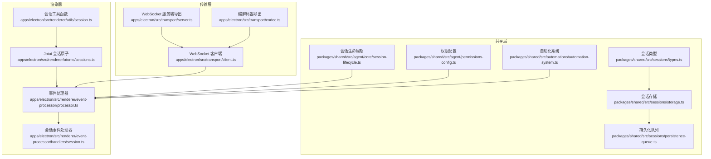
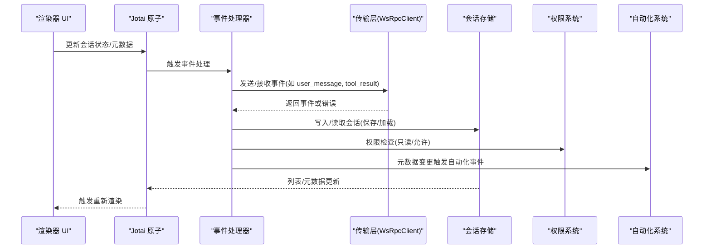
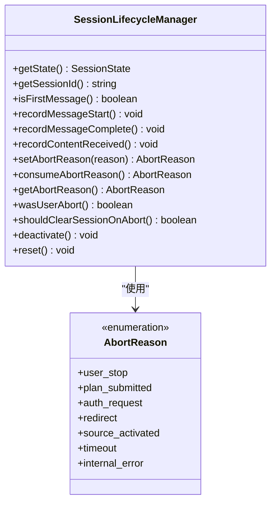
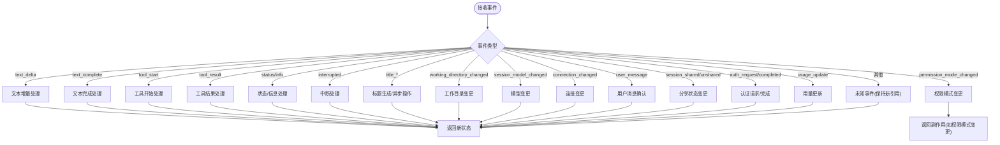
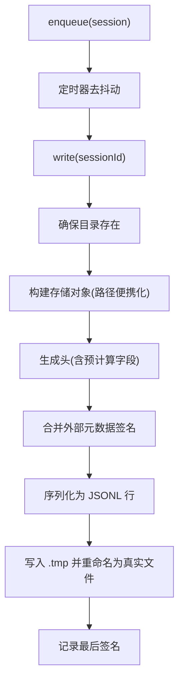
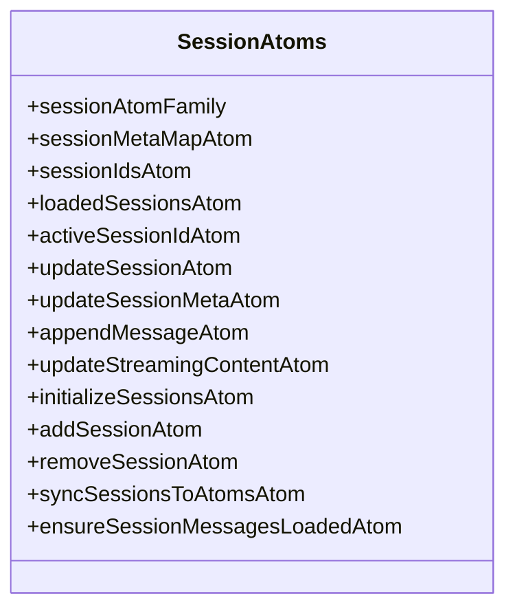
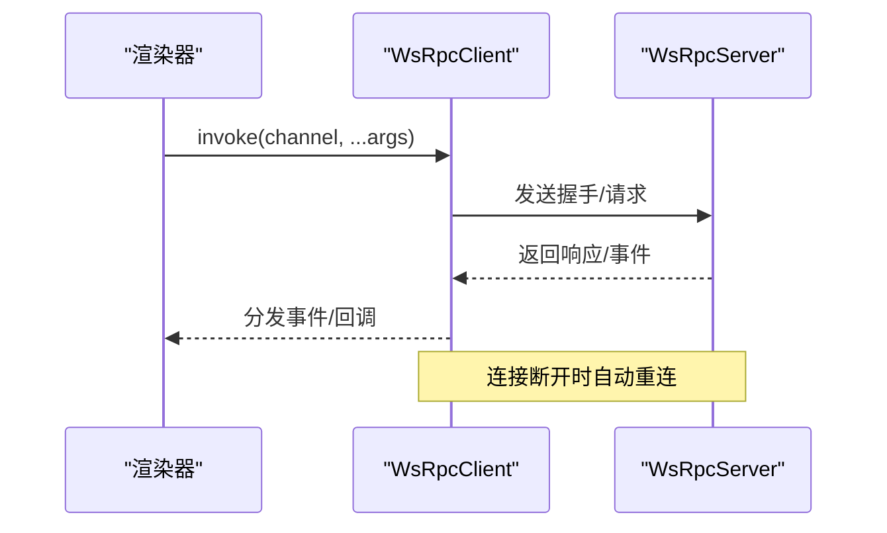
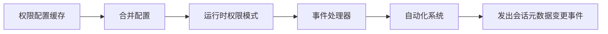
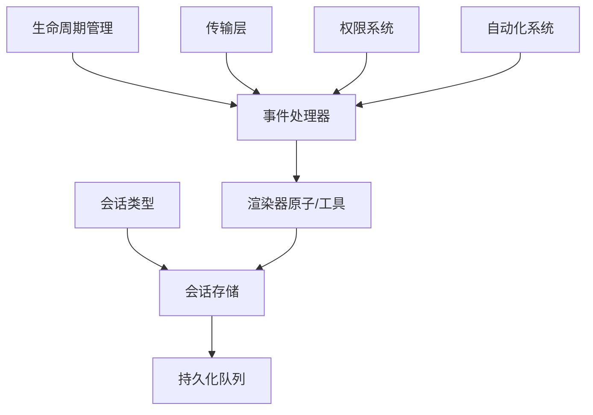

# 会话管理系统

<cite>
**本文引用的文件**
- [packages/shared/src/sessions/persistence-queue.ts](file://packages/shared/src/sessions/persistence-queue.ts)
- [packages/shared/src/sessions/storage.ts](file://packages/shared/src/sessions/storage.ts)
- [packages/shared/src/sessions/types.ts](file://packages/shared/src/sessions/types.ts)
- [packages/shared/src/agent/core/session-lifecycle.ts](file://packages/shared/src/agent/core/session-lifecycle.ts)
- [apps/electron/src/renderer/atoms/sessions.ts](file://apps/electron/src/renderer/atoms/sessions.ts)
- [apps/electron/src/renderer/utils/session.ts](file://apps/electron/src/renderer/utils/session.ts)
- [apps/electron/src/renderer/event-processor/processor.ts](file://apps/electron/src/renderer/event-processor/processor.ts)
- [apps/electron/src/renderer/event-processor/handlers/session.ts](file://apps/electron/src/renderer/event-processor/handlers/session.ts)
- [apps/electron/src/transport/client.ts](file://apps/electron/src/transport/client.ts)
- [apps/electron/src/transport/server.ts](file://apps/electron/src/transport/server.ts)
- [packages/shared/src/automations/automation-system.ts](file://packages/shared/src/automations/automation-system.ts)
- [packages/shared/src/agent/permissions-config.ts](file://packages/shared/src/agent/permissions-config.ts)
- [apps/electron/src/transport/codec.ts](file://apps/electron/src/transport/codec.ts)
</cite>

## 目录

1. [简介](#简介)
2. [项目结构](#项目结构)
3. [核心组件](#核心组件)
4. [架构总览](#架构总览)
5. [详细组件分析](#详细组件分析)
6. [依赖关系分析](#依赖关系分析)
7. [性能考量](#性能考量)
8. [故障排查指南](#故障排查指南)
9. [结论](#结论)
10. [附录](#附录)

## 简介

本技术文档围绕 Craft Agents 的会话管理系统，系统性阐述会话生命周期管理、事件处理机制与持久化存储策略，并结合实际代码路径说明会话创建、更新、删除、恢复等操作的实现细节。文档还解释了与传输层通信、权限管理、自动化系统的集成关系，并针对会话同步、并发访问、状态一致性等常见问题提供解决方案与最佳实践。

## 项目结构

会话管理涉及共享层（共享类型与存储）、渲染器（状态原子、事件处理器）、传输层（WebSocket 客户端/服务端）以及权限与自动化系统。下图展示与会话管理直接相关的模块关系：

**图表来源**

- [packages/shared/src/sessions/types.ts](file://packages/shared/src/sessions/types.ts#L1-L330)
- [packages/shared/src/sessions/storage.ts](file://packages/shared/src/sessions/storage.ts#L1-L1058)
- [packages/shared/src/sessions/persistence-queue.ts](file://packages/shared/src/sessions/persistence-queue.ts#L1-L230)
- [packages/shared/src/agent/core/session-lifecycle.ts](file://packages/shared/src/agent/core/session-lifecycle.ts#L1-L254)
- [apps/electron/src/renderer/atoms/sessions.ts](file://apps/electron/src/renderer/atoms/sessions.ts#L1-L559)
- [apps/electron/src/renderer/utils/session.ts](file://apps/electron/src/renderer/utils/session.ts#L1-L170)
- [apps/electron/src/renderer/event-processor/processor.ts](file://apps/electron/src/renderer/event-processor/processor.ts#L1-L214)
- [apps/electron/src/renderer/event-processor/handlers/session.ts](file://apps/electron/src/renderer/event-processor/handlers/session.ts#L1-L874)
- [apps/electron/src/transport/client.ts](file://apps/electron/src/transport/client.ts#L1-L728)
- [apps/electron/src/transport/server.ts](file://apps/electron/src/transport/server.ts#L1-L2)
- [apps/electron/src/transport/codec.ts](file://apps/electron/src/transport/codec.ts#L1-L5)

**章节来源**

- [packages/shared/src/sessions/types.ts](file://packages/shared/src/sessions/types.ts#L1-L330)
- [packages/shared/src/sessions/storage.ts](file://packages/shared/src/sessions/storage.ts#L1-L1058)
- [packages/shared/src/sessions/persistence-queue.ts](file://packages/shared/src/sessions/persistence-queue.ts#L1-L230)
- [packages/shared/src/agent/core/session-lifecycle.ts](file://packages/shared/src/agent/core/session-lifecycle.ts#L1-L254)
- [apps/electron/src/renderer/atoms/sessions.ts](file://apps/electron/src/renderer/atoms/sessions.ts#L1-L559)
- [apps/electron/src/renderer/utils/session.ts](file://apps/electron/src/renderer/utils/session.ts#L1-L170)
- [apps/electron/src/renderer/event-processor/processor.ts](file://apps/electron/src/renderer/event-processor/processor.ts#L1-L214)
- [apps/electron/src/renderer/event-processor/handlers/session.ts](file://apps/electron/src/renderer/event-processor/handlers/session.ts#L1-L874)
- [apps/electron/src/transport/client.ts](file://apps/electron/src/transport/client.ts#L1-L728)
- [apps/electron/src/transport/server.ts](file://apps/electron/src/transport/server.ts#L1-L2)
- [apps/electron/src/transport/codec.ts](file://apps/electron/src/transport/codec.ts#L1-L5)

## 核心组件

- 会话类型与元数据：定义会话持久化字段、头信息、元数据结构，支撑列表视图与快速加载。
- 会话存储与目录结构：提供创建、读取、列表、删除、清理消息等操作；确保目录与子目录存在。
- 持久化队列：去抖动、串行化写入，避免竞态与阻塞主线程；支持取消与刷新。
- 会话生命周期管理：跟踪会话状态、消息计数、活动时间、中止原因与清理逻辑。
- 渲染器状态原子：使用 Jotai 原子家族隔离每个会话的状态，优化渲染性能并避免跨会话重渲染。
- 事件处理器：统一处理文本增量、工具调用、错误、中断、权限变更、模型/连接变更等事件。
- 传输层：基于 WebSocket 的 RPC 客户端/服务端，握手、请求/响应关联、事件订阅与自动重连。
- 权限系统：合并默认/工作区/源级权限配置，支持只读 Bash/MCP 模式与 API 细粒度控制。
- 自动化系统：在会话元数据变化时发出事件，驱动自动化执行。

**章节来源**

- [packages/shared/src/sessions/types.ts](file://packages/shared/src/sessions/types.ts#L1-L330)
- [packages/shared/src/sessions/storage.ts](file://packages/shared/src/sessions/storage.ts#L1-L1058)
- [packages/shared/src/sessions/persistence-queue.ts](file://packages/shared/src/sessions/persistence-queue.ts#L1-L230)
- [packages/shared/src/agent/core/session-lifecycle.ts](file://packages/shared/src/agent/core/session-lifecycle.ts#L1-L254)
- [apps/electron/src/renderer/atoms/sessions.ts](file://apps/electron/src/renderer/atoms/sessions.ts#L1-L559)
- [apps/electron/src/renderer/event-processor/processor.ts](file://apps/electron/src/renderer/event-processor/processor.ts#L1-L214)
- [apps/electron/src/transport/client.ts](file://apps/electron/src/transport/client.ts#L1-L728)
- [packages/shared/src/agent/permissions-config.ts](file://packages/shared/src/agent/permissions-config.ts#L1-L778)
- [packages/shared/src/automations/automation-system.ts](file://packages/shared/src/automations/automation-system.ts#L1-L543)

## 架构总览

会话管理采用“共享层 + 渲染器 + 传输层”的分层设计：

- 共享层负责会话数据模型、存储与持久化策略；
- 渲染器通过原子与事件处理器维护 UI 状态与交互；
- 传输层负责与后端建立连接、发送/接收事件；
- 权限与自动化系统在共享层内协作，影响会话行为与事件流。

**图表来源**

- [apps/electron/src/renderer/atoms/sessions.ts](file://apps/electron/src/renderer/atoms/sessions.ts#L1-L559)
- [apps/electron/src/renderer/event-processor/processor.ts](file://apps/electron/src/renderer/event-processor/processor.ts#L1-L214)
- [apps/electron/src/transport/client.ts](file://apps/electron/src/transport/client.ts#L1-L728)
- [packages/shared/src/sessions/storage.ts](file://packages/shared/src/sessions/storage.ts#L1-L1058)
- [packages/shared/src/agent/permissions-config.ts](file://packages/shared/src/agent/permissions-config.ts#L1-L778)
- [packages/shared/src/automations/automation-system.ts](file://packages/shared/src/automations/automation-system.ts#L1-L543)

## 详细组件分析

### 会话生命周期管理

- 会话状态包括：会话 ID、是否活跃、消息计数、开始/最后活动时间、是否已收到内容。
- 提供消息开始/完成记录、首次消息检测、内容接收标记、中止原因设置与消费、用户中止判断、异常中断后的清理策略。
- 生命周期结束时可去激活并清空中止原因；重置会话状态用于新对话。

**图表来源**

- [packages/shared/src/agent/core/session-lifecycle.ts](file://packages/shared/src/agent/core/session-lifecycle.ts#L1-L254)

**章节来源**

- [packages/shared/src/agent/core/session-lifecycle.ts](file://packages/shared/src/agent/core/session-lifecycle.ts#L1-L254)

### 事件处理机制

- 事件处理器集中于处理器文件，按事件类型进行纯函数处理，返回新的会话状态与副作用。
- 支持文本增量/完成、工具调用开始/结果、状态/信息、中断、标题生成/异步操作、工作目录变更、权限模式变更、模型/连接变更、用户消息确认、分享状态、认证请求/完成、用量更新等。
- 事件处理器保证返回全新引用，避免引用相等导致的同步问题；部分事件触发父组件副作用（如权限模式变更、自动重试）。

**图表来源**

- [apps/electron/src/renderer/event-processor/processor.ts](file://apps/electron/src/renderer/event-processor/processor.ts#L1-L214)
- [apps/electron/src/renderer/event-processor/handlers/session.ts](file://apps/electron/src/renderer/event-processor/handlers/session.ts#L1-L874)

**章节来源**

- [apps/electron/src/renderer/event-processor/processor.ts](file://apps/electron/src/renderer/event-processor/processor.ts#L1-L214)
- [apps/electron/src/renderer/event-processor/handlers/session.ts](file://apps/electron/src/renderer/event-processor/handlers/session.ts#L1-L874)

### 持久化存储策略

- 存储格式：每个会话以 JSONL 文件存储，首行为头（包含预计算的列表显示字段），后续每行一条消息。
- 目录结构：工作区根目录下 sessions/{id}/，包含 session.jsonl、attachments、plans、data、long_responses、downloads 等子目录。
- 创建/读取/列表/删除/清理消息等操作由存储模块提供；列表使用头信息快速加载，避免解析全部消息。
- 写入策略：通过持久化队列进行去抖动与串行化写入，使用临时文件 + 原子重命名避免崩溃损坏；支持取消与刷新；写入前合并外部元数据变更，防止覆盖。

**图表来源**

- [packages/shared/src/sessions/persistence-queue.ts](file://packages/shared/src/sessions/persistence-queue.ts#L1-L230)
- [packages/shared/src/sessions/storage.ts](file://packages/shared/src/sessions/storage.ts#L1-L1058)

**章节来源**

- [packages/shared/src/sessions/persistence-queue.ts](file://packages/shared/src/sessions/persistence-queue.ts#L1-L230)
- [packages/shared/src/sessions/storage.ts](file://packages/shared/src/sessions/storage.ts#L1-L1058)

### 渲染器状态与同步

- 使用 Jotai 原子家族为每个会话创建独立原子，避免跨会话重渲染。
- 提供会话元数据映射、会话 ID 列表、已加载会话集合、新增/删除/更新会话动作、追加消息/更新流式内容、从主进程加载消息并合并 UI 状态等。
- 同步策略：在流式过程中以原子为源，避免覆盖正在更新的消息；当 React 状态拥有更多消息时才允许覆盖，防止丢失数据。

**图表来源**

- [apps/electron/src/renderer/atoms/sessions.ts](file://apps/electron/src/renderer/atoms/sessions.ts#L1-L559)

**章节来源**

- [apps/electron/src/renderer/atoms/sessions.ts](file://apps/electron/src/renderer/atoms/sessions.ts#L1-L559)

### 传输层通信

- WsRpcClient：支持本地/远程模式、握手、请求超时、事件订阅、能力通道、自动重连与指数退避、连接状态监听。
- 编解码器：导出通用编解码函数，确保消息封套的序列化/反序列化与形状校验。
- 服务端导出：服务端接口通过 transport 层暴露。

**图表来源**

- [apps/electron/src/transport/client.ts](file://apps/electron/src/transport/client.ts#L1-L728)
- [apps/electron/src/transport/server.ts](file://apps/electron/src/transport/server.ts#L1-L2)
- [apps/electron/src/transport/codec.ts](file://apps/electron/src/transport/codec.ts#L1-L5)

**章节来源**

- [apps/electron/src/transport/client.ts](file://apps/electron/src/transport/client.ts#L1-L728)
- [apps/electron/src/transport/server.ts](file://apps/electron/src/transport/server.ts#L1-L2)
- [apps/electron/src/transport/codec.ts](file://apps/electron/src/transport/codec.ts#L1-L5)

### 权限管理与自动化集成

- 权限系统：合并默认/工作区/源级配置，支持只读 Bash/MCP 模式与 API 细粒度规则；提供缓存与失效机制。
- 自动化系统：在会话元数据变化时发出事件（如标签增删、标志位变化、状态变更、权限模式变更），驱动自动化执行。

**图表来源**

- [packages/shared/src/agent/permissions-config.ts](file://packages/shared/src/agent/permissions-config.ts#L1-L778)
- [packages/shared/src/automations/automation-system.ts](file://packages/shared/src/automations/automation-system.ts#L1-L543)
- [apps/electron/src/renderer/event-processor/handlers/session.ts](file://apps/electron/src/renderer/event-processor/handlers/session.ts#L1-L874)

**章节来源**

- [packages/shared/src/agent/permissions-config.ts](file://packages/shared/src/agent/permissions-config.ts#L1-L778)
- [packages/shared/src/automations/automation-system.ts](file://packages/shared/src/automations/automation-system.ts#L1-L543)

## 依赖关系分析

- 类型与存储：会话类型与头信息定义了 JSONL 结构；存储模块负责读写与目录管理。
- 生命周期与事件：生命周期管理器为事件处理器提供状态基础；事件处理器更新状态并触发副作用。
- 渲染器与存储：原子与工具函数负责 UI 状态与标题/未读计算；存储模块提供列表与加载能力。
- 传输层：客户端负责与服务端通信，事件处理器通过传输层接收/发送事件。
- 权限与自动化：权限系统影响事件处理与 UI 行为；自动化系统在元数据变化时被触发。

**图表来源**

- [packages/shared/src/sessions/types.ts](file://packages/shared/src/sessions/types.ts#L1-L330)
- [packages/shared/src/sessions/storage.ts](file://packages/shared/src/sessions/storage.ts#L1-L1058)
- [packages/shared/src/sessions/persistence-queue.ts](file://packages/shared/src/sessions/persistence-queue.ts#L1-L230)
- [packages/shared/src/agent/core/session-lifecycle.ts](file://packages/shared/src/agent/core/session-lifecycle.ts#L1-L254)
- [apps/electron/src/renderer/event-processor/handlers/session.ts](file://apps/electron/src/renderer/event-processor/handlers/session.ts#L1-L874)
- [apps/electron/src/renderer/atoms/sessions.ts](file://apps/electron/src/renderer/atoms/sessions.ts#L1-L559)
- [apps/electron/src/transport/client.ts](file://apps/electron/src/transport/client.ts#L1-L728)
- [packages/shared/src/agent/permissions-config.ts](file://packages/shared/src/agent/permissions-config.ts#L1-L778)
- [packages/shared/src/automations/automation-system.ts](file://packages/shared/src/automations/automation-system.ts#L1-L543)

**章节来源**

- [packages/shared/src/sessions/types.ts](file://packages/shared/src/sessions/types.ts#L1-L330)
- [packages/shared/src/sessions/storage.ts](file://packages/shared/src/sessions/storage.ts#L1-L1058)
- [packages/shared/src/sessions/persistence-queue.ts](file://packages/shared/src/sessions/persistence-queue.ts#L1-L230)
- [packages/shared/src/agent/core/session-lifecycle.ts](file://packages/shared/src/agent/core/session-lifecycle.ts#L1-L254)
- [apps/electron/src/renderer/event-processor/handlers/session.ts](file://apps/electron/src/renderer/event-processor/handlers/session.ts#L1-L874)
- [apps/electron/src/renderer/atoms/sessions.ts](file://apps/electron/src/renderer/atoms/sessions.ts#L1-L559)
- [apps/electron/src/transport/client.ts](file://apps/electron/src/transport/client.ts#L1-L728)
- [packages/shared/src/agent/permissions-config.ts](file://packages/shared/src/agent/permissions-config.ts#L1-L778)
- [packages/shared/src/automations/automation-system.ts](file://packages/shared/src/automations/automation-system.ts#L1-L543)

## 性能考量

- 去抖动与串行化写入：持久化队列通过定时器去抖动与按会话串行写入，避免频繁 IO 与竞态。
- 路径便携化：写入前将绝对路径转换为可移植路径，提升跨机器兼容性。
- 列表快速加载：仅读取 JSONL 首行头信息，预计算字段用于列表视图，减少消息解析成本。
- 渲染性能隔离：Jotai 原子家族按会话隔离状态，避免跨会话重渲染；流式更新时以原子为源，防止覆盖。
- 连接稳定性：传输层自动重连与超时控制，降低网络波动对会话的影响。

[本节为通用指导，不直接分析具体文件]

## 故障排查指南

- 会话无法保存/损坏
  - 现象：保存失败或文件损坏。
  - 排查：检查持久化队列写入流程与临时文件清理；确认磁盘空间与权限。
  - 参考路径：[持久化队列](file://packages/shared/src/sessions/persistence-queue.ts#L1-L230)，[会话存储](file://packages/shared/src/sessions/storage.ts#L1-L1058)
- 会话列表空白或排序异常
  - 现象：列表为空或顺序异常。
  - 排查：确认 JSONL 头部读取与验证；检查 lastUsedAt 排序逻辑。
  - 参考路径：[会话存储](file://packages/shared/src/sessions/storage.ts#L343-L384)
- 流式更新丢失或 UI 不一致
  - 现象：流式文本/工具结果丢失或 UI 不更新。
  - 排查：检查同步策略，确保在流式期间以原子为源；避免覆盖已有消息。
  - 参考路径：[会话原子](file://apps/electron/src/renderer/atoms/sessions.ts#L372-L427)
- 事件处理异常或状态不一致
  - 现象：事件处理后状态未更新或出现竞态。
  - 排查：确认事件处理器返回全新引用；检查副作用处理与父组件协调。
  - 参考路径：[事件处理器](file://apps/electron/src/renderer/event-processor/processor.ts#L1-L214)，[会话事件处理器](file://apps/electron/src/renderer/event-processor/handlers/session.ts#L1-L874)
- 权限导致功能受限
  - 现象：工具/API 调用被阻止。
  - 排查：核对权限配置合并逻辑与缓存失效；检查只读模式与 API 规则。
  - 参考路径：[权限配置](file://packages/shared/src/agent/permissions-config.ts#L1-L778)
- 传输层连接失败
  - 现象：无法建立或维持连接。
  - 排查：检查握手参数、协议版本、重连策略与错误分类。
  - 参考路径：[传输客户端](file://apps/electron/src/transport/client.ts#L1-L728)

**章节来源**

- [packages/shared/src/sessions/persistence-queue.ts](file://packages/shared/src/sessions/persistence-queue.ts#L1-L230)
- [packages/shared/src/sessions/storage.ts](file://packages/shared/src/sessions/storage.ts#L1-L1058)
- [apps/electron/src/renderer/atoms/sessions.ts](file://apps/electron/src/renderer/atoms/sessions.ts#L1-L559)
- [apps/electron/src/renderer/event-processor/processor.ts](file://apps/electron/src/renderer/event-processor/processor.ts#L1-L214)
- [apps/electron/src/renderer/event-processor/handlers/session.ts](file://apps/electron/src/renderer/event-processor/handlers/session.ts#L1-L874)
- [packages/shared/src/agent/permissions-config.ts](file://packages/shared/src/agent/permissions-config.ts#L1-L778)
- [apps/electron/src/transport/client.ts](file://apps/electron/src/transport/client.ts#L1-L728)

## 结论

Craft Agents 的会话管理系统通过清晰的分层设计与严格的职责划分，实现了可靠的会话生命周期管理、稳健的事件处理与高性能的持久化存储。借助 Jotai 的原子化状态管理、传输层的稳定连接与权限/自动化系统的协同，系统在复杂场景下仍能保持良好的一致性与用户体验。建议在扩展新功能时遵循现有模式：共享层定义契约、渲染器专注 UI、传输层保障通信、权限与自动化作为横切关注点融入。

[本节为总结性内容，不直接分析具体文件]

## 附录

- 会话创建：生成唯一 ID、创建目录与子目录、初始化空会话并立即保存。
  - 参考路径：[创建会话](file://packages/shared/src/sessions/storage.ts#L177-L238)
- 会话更新：通过持久化队列排队写入，合并外部元数据变更，避免覆盖。
  - 参考路径：[保存会话](file://packages/shared/src/sessions/storage.ts#L305-L308)，[持久化队列](file://packages/shared/src/sessions/persistence-queue.ts#L1-L230)
- 会话删除：删除会话目录及所有关联文件。
  - 参考路径：[删除会话](file://packages/shared/src/sessions/storage.ts#L429-L441)
- 会话恢复：从主进程加载消息，合并 UI 状态，保留流式过程中的中间结果。
  - 参考路径：[加载消息](file://apps/electron/src/renderer/atoms/sessions.ts#L443-L524)

**章节来源**

- [packages/shared/src/sessions/storage.ts](file://packages/shared/src/sessions/storage.ts#L177-L238)
- [packages/shared/src/sessions/storage.ts](file://packages/shared/src/sessions/storage.ts#L305-L308)
- [packages/shared/src/sessions/persistence-queue.ts](file://packages/shared/src/sessions/persistence-queue.ts#L1-L230)
- [packages/shared/src/sessions/storage.ts](file://packages/shared/src/sessions/storage.ts#L429-L441)
- [apps/electron/src/renderer/atoms/sessions.ts](file://apps/electron/src/renderer/atoms/sessions.ts#L443-L524)
