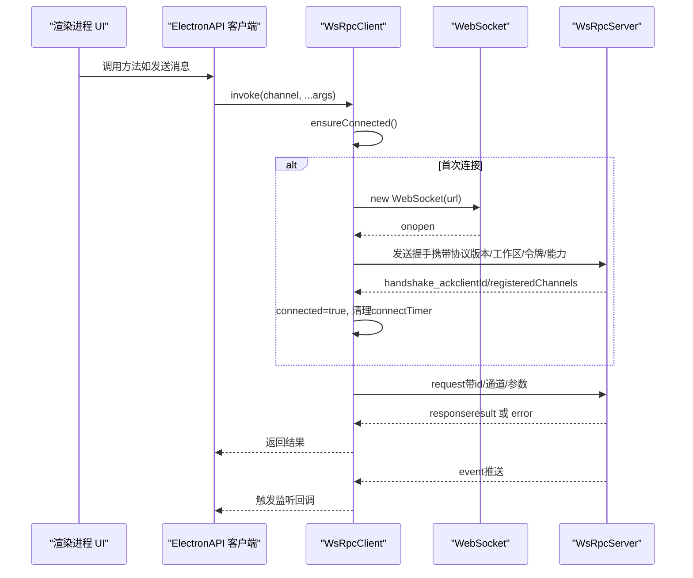
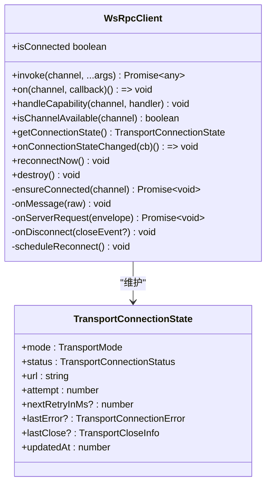
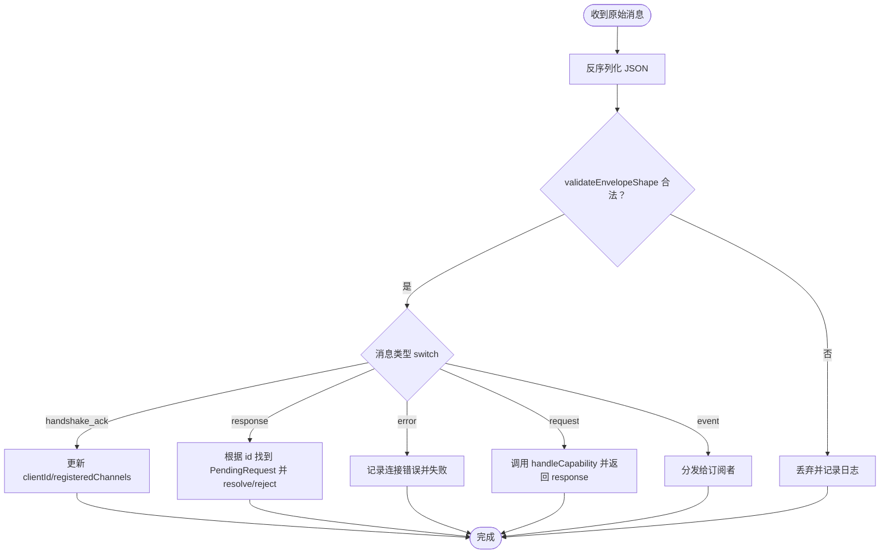
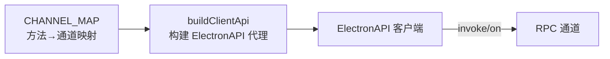
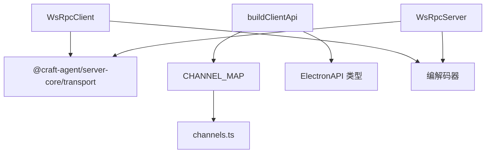

# 传输层通信

<cite>
**本文引用的文件**
- [apps/electron/src/transport/index.ts](file://apps/electron/src/transport/index.ts)
- [apps/electron/src/transport/client.ts](file://apps/electron/src/transport/client.ts)
- [apps/electron/src/transport/server.ts](file://apps/electron/src/transport/server.ts)
- [apps/electron/src/transport/codec.ts](file://apps/electron/src/transport/codec.ts)
- [apps/electron/src/transport/channel-map.ts](file://apps/electron/src/transport/channel-map.ts)
- [apps/electron/src/transport/build-api.ts](file://apps/electron/src/transport/build-api.ts)
- [apps/electron/src/transport/__tests__/codec.test.ts](file://apps/electron/src/transport/__tests__/codec.test.ts)
- [apps/electron/src/transport/__tests__/channel-map-parity.test.ts](file://apps/electron/src/transport/__tests__/channel-map-parity.test.ts)
- [apps/electron/src/__tests__/transport.test.ts](file://apps/electron/src/__tests__/transport.test.ts)
- [apps/electron/src/shared/types.ts](file://apps/electron/src/shared/types.ts)
- [packages/shared/src/protocol/channels.ts](file://packages/shared/src/protocol/channels.ts)
- [packages/shared/src/protocol/dto.ts](file://packages/shared/src/protocol/dto.ts)
- [packages/shared/src/protocol/events.ts](file://packages/shared/src/protocol/events.ts)
- [packages/shared/src/protocol/index.ts](file://packages/shared/src/protocol/index.ts)
- [packages/server-core/src/transport/types.ts](file://packages/server-core/src/transport/types.ts)
</cite>

## 目录

1. [简介](#简介)
2. [项目结构](#项目结构)
3. [核心组件](#核心组件)
4. [架构总览](#架构总览)
5. [详细组件分析](#详细组件分析)
6. [依赖分析](#依赖分析)
7. [性能考虑](#性能考虑)
8. [故障排查指南](#故障排查指南)
9. [结论](#结论)
10. [附录](#附录)

## 简介

本文件面向 Craft Agents 的传输层通信，系统性阐述基于 WebSocket 的 RPC 服务器与客户端实现、消息编解码机制、连接管理策略，并结合仓库中的真实代码示例，说明与会话管理、权限系统、自动化事件的通信关系。文档同时覆盖性能优化、错误处理与重连机制，帮助初学者快速上手，也为有经验的开发者提供足够的技术深度。

## 项目结构

传输层位于 Electron 应用的渲染进程与主进程之间，通过 WebSocket 建立双向 RPC 通道。核心文件包括：

- 客户端：负责握手、请求/响应关联、事件订阅、自动重连与状态上报
- 服务器：在 server-core 包中实现，负责路由、鉴权、推送与客户端能力调用
- 编解码：统一的消息封包与校验
- 通道映射：将 ElectronAPI 方法映射到 RPC 通道，构建类型安全的客户端代理
- 协议与类型：统一的通道名、DTO、事件与传输类型

```mermaid
graph TB
subgraph "Electron 应用"
R["渲染进程<br/>ElectronAPI 客户端"]
P["预加载/主进程桥接"]
end
subgraph "传输层"
C["WsRpcClient<br/>握手/重连/编解码"]
S["WsRpcServer<br/>路由/鉴权/推送"]
M["通道映射<br/>buildClientApi"]
E["编解码器<br/>validate/serialize/deserialize"]
end
subgraph "协议与类型"
CH["通道常量 channels.ts"]
DT["数据传输对象 dto.ts"]
EV["事件 events.ts"]
TY["传输类型 transport/types.ts"]
end
R --> M
M --> C
C <- --> E
C --> S
S --> E
R -.-> CH
R -.-> DT
R -.-> EV
R -.-> TY
```

图表来源

- [apps/electron/src/transport/client.ts](file://apps/electron/src/transport/client.ts#L101-L728)
- [apps/electron/src/transport/server.ts](file://apps/electron/src/transport/server.ts#L1-L2)
- [apps/electron/src/transport/build-api.ts](file://apps/electron/src/transport/build-api.ts#L25-L66)
- [apps/electron/src/transport/codec.ts](file://apps/electron/src/transport/codec.ts#L1-L6)
- [apps/electron/src/transport/channel-map.ts](file://apps/electron/src/transport/channel-map.ts#L1-L335)
- [packages/shared/src/protocol/channels.ts](file://packages/shared/src/protocol/channels.ts)
- [packages/shared/src/protocol/dto.ts](file://packages/shared/src/protocol/dto.ts)
- [packages/shared/src/protocol/events.ts](file://packages/shared/src/protocol/events.ts)
- [packages/server-core/src/transport/types.ts](file://packages/server-core/src/transport/types.ts)

章节来源

- [apps/electron/src/transport/index.ts](file://apps/electron/src/transport/index.ts#L1-L6)
- [apps/electron/src/transport/client.ts](file://apps/electron/src/transport/client.ts#L1-L728)
- [apps/electron/src/transport/server.ts](file://apps/electron/src/transport/server.ts#L1-L2)
- [apps/electron/src/transport/codec.ts](file://apps/electron/src/transport/codec.ts#L1-L6)
- [apps/electron/src/transport/channel-map.ts](file://apps/electron/src/transport/channel-map.ts#L1-L335)
- [apps/electron/src/transport/build-api.ts](file://apps/electron/src/transport/build-api.ts#L1-L66)

## 核心组件

- WsRpcClient：在渲染进程或 Node.js 环境中运行，负责握手、请求/响应相关性、事件订阅、服务端能力调用（双向 RPC）、自动重连与连接状态上报。
- WsRpcServer：在主进程中运行，负责注册处理器、鉴权、推送事件、向客户端发起能力调用。
- 编解码器：统一的消息封包与校验，确保消息形状合法、序列化/反序列化稳定。
- 通道映射与客户端代理：将 ElectronAPI 方法映射到 RPC 通道，支持嵌套命名空间与结果转换。
- 连接状态模型：抽象本地/远程模式、连接状态、错误分类与关闭信息，便于 UI 展示与调试。

章节来源

- [apps/electron/src/transport/client.ts](file://apps/electron/src/transport/client.ts#L101-L728)
- [apps/electron/src/transport/server.ts](file://apps/electron/src/transport/server.ts#L1-L2)
- [apps/electron/src/transport/codec.ts](file://apps/electron/src/transport/codec.ts#L1-L6)
- [apps/electron/src/transport/build-api.ts](file://apps/electron/src/transport/build-api.ts#L25-L66)
- [apps/electron/src/transport/channel-map.ts](file://apps/electron/src/transport/channel-map.ts#L1-L335)
- [apps/electron/src/shared/types.ts](file://apps/electron/src/shared/types.ts#L122-L161)

## 架构总览

传输层采用“客户端-服务器”对称架构，通过 WebSocket 建立长连接，使用统一的消息封包进行请求/响应与事件推送。客户端负责自动重连与状态上报；服务器负责鉴权、路由与推送。通道映射将高层 API 调用映射为底层 RPC 通道，保证类型安全与可维护性。



图表来源

- [apps/electron/src/transport/client.ts](file://apps/electron/src/transport/client.ts#L263-L471)
- [apps/electron/src/**tests**/transport.test.ts](file://apps/electron/src/__tests__/transport.test.ts#L51-L81)

## 详细组件分析

### 客户端：WsRpcClient

- 连接生命周期
  - 支持本地（127.0.0.1/localhost）与远程模式推断
  - 握手阶段发送协议版本、工作区ID、webContentsId、令牌与客户端能力
  - 成功握手后进入已连接状态，清理连接超时定时器
- 请求/响应与事件
  - 每个请求生成唯一 id，等待对应响应；超时触发请求级错误
  - 事件通过 on(channel, cb) 订阅，支持取消订阅
  - 服务端可向客户端发起能力调用（双向 RPC），客户端需预先 handleCapability 注册处理器
- 自动重连与状态
  - 断线后按指数退避重连，最大延迟可配置
  - 连接状态与错误分类（认证/协议/超时/网络/服务器/未知）用于 UI 与诊断
  - 提供 getConnectionState/onConnectionStateChanged 以供 UI 实时展示
- 销毁与清理
  - destroy 会拒绝所有待处理请求，关闭 WebSocket 并清空内部状态



图表来源

- [apps/electron/src/transport/client.ts](file://apps/electron/src/transport/client.ts#L101-L728)
- [apps/electron/src/shared/types.ts](file://apps/electron/src/shared/types.ts#L122-L161)

章节来源

- [apps/electron/src/transport/client.ts](file://apps/electron/src/transport/client.ts#L101-L728)
- [apps/electron/src/shared/types.ts](file://apps/electron/src/shared/types.ts#L122-L161)

### 服务器：WsRpcServer

- 服务器在 server-core 包中实现，传输层导出其类型与选项，供 Electron 主进程使用
- 典型职责：注册处理器 handle、推送事件 push、向客户端发起能力调用 invokeClient、鉴权与协议版本检查
- 测试覆盖握手、RPC、事件推送、鉴权、连接状态与边缘情况，验证二向 RPC 与能力调用

章节来源

- [apps/electron/src/transport/server.ts](file://apps/electron/src/transport/server.ts#L1-L2)
- [packages/server-core/src/transport/types.ts](file://packages/server-core/src/transport/types.ts)
- [apps/electron/src/**tests**/transport.test.ts](file://apps/electron/src/__tests__/transport.test.ts#L87-L121)

### 编解码与消息封包

- 统一的封包结构（envelope）包含 id、type、channel、args/result/error 等字段
- validateEnvelopeShape 校验封包形状，防止非法消息导致异常
- serializeEnvelope/deserializeEnvelope 负责 JSON 序列化与反序列化
- 测试覆盖各种边界：缺失字段、错误类型、错误码类型、二进制数据往返



图表来源

- [apps/electron/src/transport/client.ts](file://apps/electron/src/transport/client.ts#L379-L471)
- [apps/electron/src/transport/**tests**/codec.test.ts](file://apps/electron/src/transport/__tests__/codec.test.ts#L8-L96)

章节来源

- [apps/electron/src/transport/codec.ts](file://apps/electron/src/transport/codec.ts#L1-L6)
- [apps/electron/src/transport/**tests**/codec.test.ts](file://apps/electron/src/transport/__tests__/codec.test.ts#L1-L116)

### 通道映射与客户端 API 构建

- CHANNEL_MAP 将 ElectronAPI 方法映射到 RPC 通道，支持 listener/invoke 两类条目
- buildClientApi 基于通道映射构建类型安全的客户端代理，支持嵌套命名空间（如 browserPane.create）
- 通道映射一致性测试确保方法签名与通道表保持同步



图表来源

- [apps/electron/src/transport/channel-map.ts](file://apps/electron/src/transport/channel-map.ts#L19-L335)
- [apps/electron/src/transport/build-api.ts](file://apps/electron/src/transport/build-api.ts#L25-L66)
- [apps/electron/src/transport/**tests**/channel-map-parity.test.ts](file://apps/electron/src/transport/__tests__/channel-map-parity.test.ts#L28-L47)

章节来源

- [apps/electron/src/transport/channel-map.ts](file://apps/electron/src/transport/channel-map.ts#L1-L335)
- [apps/electron/src/transport/build-api.ts](file://apps/electron/src/transport/build-api.ts#L1-L66)
- [apps/electron/src/transport/**tests**/channel-map-parity.test.ts](file://apps/electron/src/transport/__tests__/channel-map-parity.test.ts#L1-L48)

### 与会话管理、权限系统、自动化事件的关系

- 会话管理：通过通道映射暴露 getSessions、getSessionMessages、sendMessage、cancelProcessing、respondToPermission 等 RPC，客户端代理直接调用
- 权限系统：respondToPermission、getSessionPermissionModeState 等通道用于权限决策与模式状态查询
- 自动化事件：onAutomationsChanged、onSessionEvent 等监听通道，配合事件处理器实现自动化触发与会话事件推送
- 通道常量与事件定义来自协议层，确保跨模块一致

章节来源

- [apps/electron/src/transport/channel-map.ts](file://apps/electron/src/transport/channel-map.ts#L19-L214)
- [apps/electron/src/transport/channel-map.ts](file://apps/electron/src/transport/channel-map.ts#L326-L334)
- [packages/shared/src/protocol/channels.ts](file://packages/shared/src/protocol/channels.ts)
- [packages/shared/src/protocol/events.ts](file://packages/shared/src/protocol/events.ts)

## 依赖分析

- 客户端依赖 server-core 的传输类型接口，确保与服务器实现一致
- 通道映射依赖协议层的通道常量，保证方法与通道一一对应
- 编解码器依赖协议层的传输类型，确保消息封包结构稳定
- ElectronAPI 类型定义集中于 shared/types，作为 GUI 与传输层的契约



图表来源

- [apps/electron/src/transport/client.ts](file://apps/electron/src/transport/client.ts#L9-L15)
- [apps/electron/src/transport/server.ts](file://apps/electron/src/transport/server.ts#L1-L2)
- [apps/electron/src/transport/build-api.ts](file://apps/electron/src/transport/build-api.ts#L8-L9)
- [apps/electron/src/transport/channel-map.ts](file://apps/electron/src/transport/channel-map.ts#L8-L9)
- [apps/electron/src/shared/types.ts](file://apps/electron/src/shared/types.ts#L168-L203)

章节来源

- [apps/electron/src/transport/index.ts](file://apps/electron/src/transport/index.ts#L1-L6)
- [apps/electron/src/transport/client.ts](file://apps/electron/src/transport/client.ts#L9-L15)
- [apps/electron/src/transport/server.ts](file://apps/electron/src/transport/server.ts#L1-L2)
- [apps/electron/src/transport/build-api.ts](file://apps/electron/src/transport/build-api.ts#L8-L9)
- [apps/electron/src/transport/channel-map.ts](file://apps/electron/src/transport/channel-map.ts#L8-L9)
- [apps/electron/src/shared/types.ts](file://apps/electron/src/shared/types.ts#L168-L203)

## 性能考虑

- 请求超时与并发：客户端为每个请求设置独立超时，避免阻塞；并发请求互不干扰
- 二进制数据：支持 Uint8Array 在请求参数与响应中的完整往返，减少额外编码开销
- 事件批量：推送事件时建议合并与节流，避免 UI 抖动
- 重连退避：默认指数退避上限可配置，避免雪崩式重试
- 握手与能力：握手阶段一次性告知服务端可用通道与能力，降低后续协商成本

章节来源

- [apps/electron/src/transport/client.ts](file://apps/electron/src/transport/client.ts#L138-L142)
- [apps/electron/src/**tests**/transport.test.ts](file://apps/electron/src/__tests__/transport.test.ts#L224-L250)
- [apps/electron/src/**tests**/transport.test.ts](file://apps/electron/src/__tests__/transport.test.ts#L446-L455)

## 故障排查指南

- 连接超时
  - 现象：握手超时或连接超时，状态变为 failed
  - 排查：检查 connectTimeout 设置、网络连通性、服务器是否启用 requireAuth 且令牌有效
  - 参考：握手超时测试与连接状态测试
- 认证失败
  - 现象：状态 lastError.kind 为 auth，关闭码 4005
  - 排查：确认 token 是否正确、validateToken 是否返回 true
- 协议不兼容
  - 现象：握手被拒，关闭码 4004
  - 排查：确认客户端 PROTOCOL_VERSION 与服务器一致
- 网络中断
  - 现象：浏览器端 1006/1001 导致网络错误分类
  - 处理：启用 autoReconnect，观察 reconnecting 状态
- 消息丢失/序列化错误
  - 现象：validateEnvelopeShape 失败或反序列化抛错
  - 处理：检查封包字段完整性、错误码类型（字符串/数字均可）、确保 JSON 可解析
- 通道不可用
  - 现象：invoke 返回 CHANNEL_NOT_FOUND
  - 处理：使用 isChannelAvailable 判断，或在握手 ack 中检查 registeredChannels
- 双向 RPC 失败
  - 现象：invokeClient 返回 CAPABILITY_UNAVAILABLE 或 CLIENT_DISCONNECTED
  - 处理：确认客户端已 handleCapability 注册处理器，且客户端未销毁

章节来源

- [apps/electron/src/**tests**/transport.test.ts](file://apps/electron/src/__tests__/transport.test.ts#L99-L121)
- [apps/electron/src/**tests**/transport.test.ts](file://apps/electron/src/__tests__/transport.test.ts#L352-L409)
- [apps/electron/src/**tests**/transport.test.ts](file://apps/electron/src/__tests__/transport.test.ts#L415-L476)
- [apps/electron/src/transport/**tests**/codec.test.ts](file://apps/electron/src/transport/__tests__/codec.test.ts#L8-L96)
- [apps/electron/src/transport/client.ts](file://apps/electron/src/transport/client.ts#L430-L445)
- [apps/electron/src/transport/client.ts](file://apps/electron/src/transport/client.ts#L571-L589)

## 结论

Craft Agents 的传输层以 WebSocket 为基础，通过统一的封包结构与通道映射，实现了类型安全、可扩展且健壮的 RPC 通信。客户端具备完善的握手、重连、错误分类与状态上报能力；服务器提供鉴权、路由与推送；通道映射与协议层确保跨模块一致性。结合测试覆盖与性能优化建议，可在复杂场景下保持稳定与高效。

## 附录

- 关键通道与事件
  - 会话管理：GET/GET_MESSAGES/SEND_MESSAGE/CANCEL/KILL_SHELL 等
  - 权限与凭据：RESPOND_TO_PERMISSION/RESPOND_TO_CREDENTIAL
  - 自动化事件：CHANGED/AVAILABLE/DOWNLOAD_PROGRESS 等
- 常用配置项
  - requestTimeout、maxReconnectDelay、connectTimeout、autoReconnect、clientCapabilities、mode
- 相关类型
  - TransportConnectionState、TransportConnectionError、TransportConnectionErrorKind、ElectronAPI

章节来源

- [apps/electron/src/transport/channel-map.ts](file://apps/electron/src/transport/channel-map.ts#L19-L334)
- [apps/electron/src/shared/types.ts](file://apps/electron/src/shared/types.ts#L205-L559)
- [packages/shared/src/protocol/channels.ts](file://packages/shared/src/protocol/channels.ts)
- [packages/shared/src/protocol/events.ts](file://packages/shared/src/protocol/events.ts)
- [packages/shared/src/protocol/dto.ts](file://packages/shared/src/protocol/dto.ts)
- [packages/server-core/src/transport/types.ts](file://packages/server-core/src/transport/types.ts)
