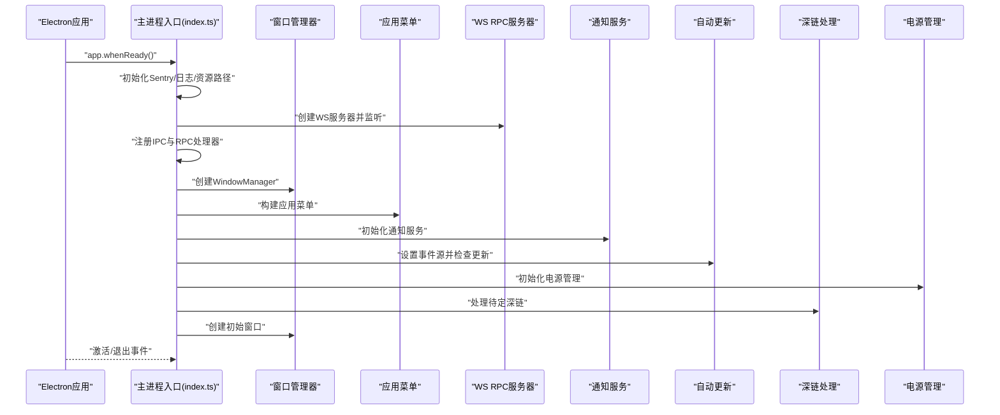
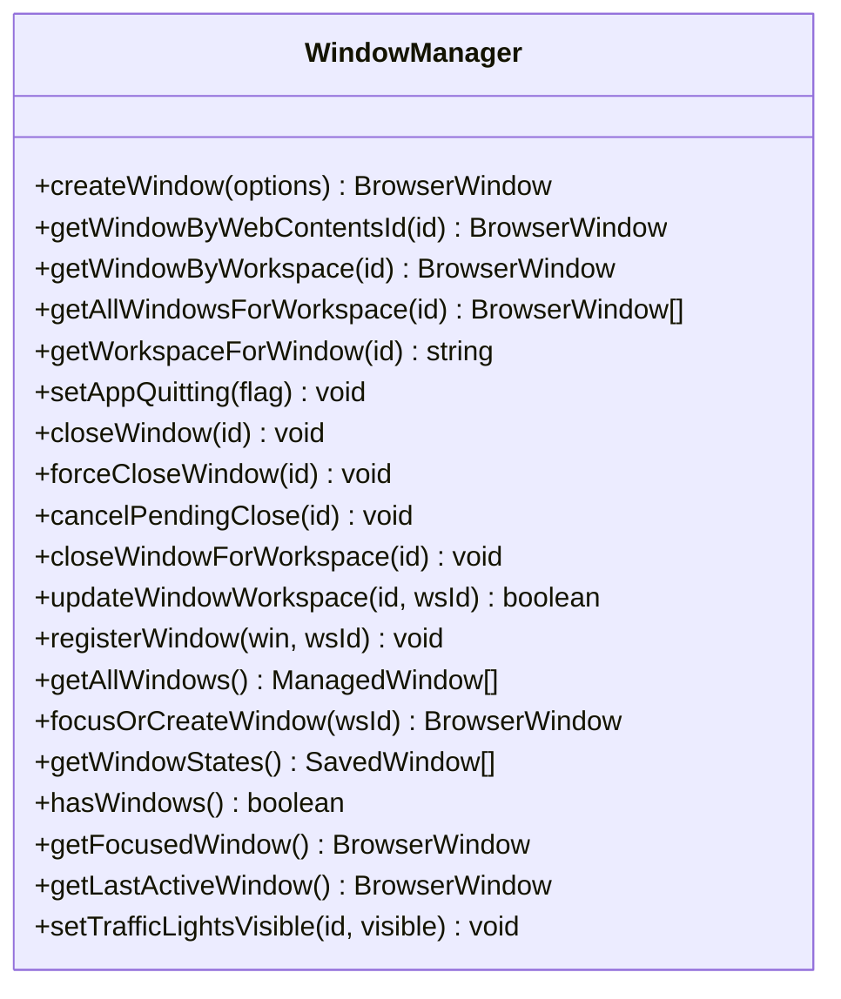
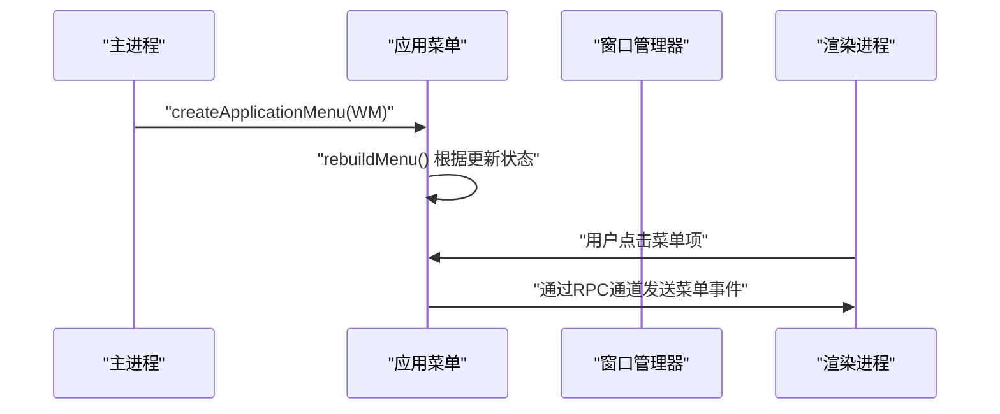
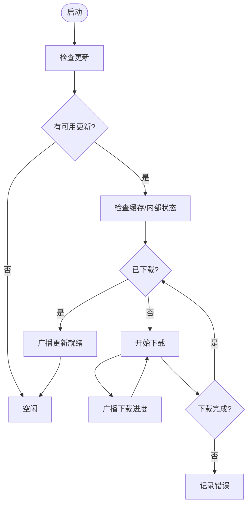
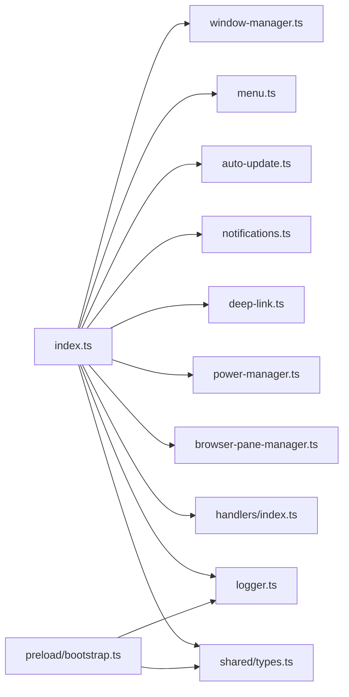

# 应用程序初始化

<cite>
**本文引用的文件**
- [apps/electron/src/main/index.ts](file://apps/electron/src/main/index.ts)
- [apps/electron/src/main/window-manager.ts](file://apps/electron/src/main/window-manager.ts)
- [apps/electron/src/main/menu.ts](file://apps/electron/src/main/menu.ts)
- [apps/electron/src/main/logger.ts](file://apps/electron/src/main/logger.ts)
- [apps/electron/src/main/auto-update.ts](file://apps/electron/src/main/auto-update.ts)
- [apps/electron/src/main/notifications.ts](file://apps/electron/src/main/notifications.ts)
- [apps/electron/src/main/deep-link.ts](file://apps/electron/src/main/deep-link.ts)
- [apps/electron/src/main/window-state.ts](file://apps/electron/src/main/window-state.ts)
- [apps/electron/src/main/power-manager.ts](file://apps/electron/src/main/power-manager.ts)
- [apps/electron/src/main/browser-pane-manager.ts](file://apps/electron/src/main/browser-pane-manager.ts)
- [apps/electron/src/main/handlers/index.ts](file://apps/electron/src/main/handlers/index.ts)
- [apps/electron/src/preload/bootstrap.ts](file://apps/electron/src/preload/bootstrap.ts)
- [apps/electron/src/shared/types.ts](file://apps/electron/src/shared/types.ts)
- [apps/electron/package.json](file://apps/electron/package.json)
</cite>

## 目录

1. [简介](#简介)
2. [项目结构](#项目结构)
3. [核心组件](#核心组件)
4. [架构总览](#架构总览)
5. [详细组件分析](#详细组件分析)
6. [依赖关系分析](#依赖关系分析)
7. [性能考量](#性能考量)
8. [故障排查指南](#故障排查指南)
9. [结论](#结论)
10. [附录](#附录)

## 简介

本文件面向 Craft Agents 桌面应用（Electron）的初始化流程，系统性阐述从应用启动到窗口创建、菜单构建、RPC 传输、通知与自动更新、深链处理、电源管理、浏览器面板管理以及错误监控与日志系统的完整初始化序列。文档既提供面向初学者的循序讲解，也包含面向资深开发者的实现细节与优化建议。

## 项目结构

Electron 主进程入口位于 apps/electron/src/main/index.ts，负责：

- 初始化 Sentry 错误监控与日志系统
- 注册协议与深链处理
- 构建并注入平台服务（图像处理、日志、系统能力）
- 启动本地 WebSocket RPC 服务器
- 注册全局 RPC 处理器
- 创建窗口管理器与应用菜单
- 初始化通知、自动更新、电源管理、浏览器面板管理
- 恢复或创建初始窗口

```mermaid
graph TB
A["主进程入口<br/>apps/electron/src/main/index.ts"] --> B["日志与Sentry初始化<br/>apps/electron/src/main/logger.ts"]
A --> C["窗口管理器<br/>apps/electron/src/main/window-manager.ts"]
A --> D["应用菜单<br/>apps/electron/src/main/menu.ts"]
A --> E["自动更新<br/>apps/electron/src/main/auto-update.ts"]
A --> F["通知服务<br/>apps/electron/src/main/notifications.ts"]
A --> G["深链处理<br/>apps/electron/src/main/deep-link.ts"]
A --> H["电源管理<br/>apps/electron/src/main/power-manager.ts"]
A --> I["浏览器面板管理<br/>apps/electron/src/main/browser-pane-manager.ts"]
A --> J["RPC处理器注册<br/>apps/electron/src/main/handlers/index.ts"]
A --> K["预加载桥接WS模式<br/>apps/electron/src/preload/bootstrap.ts"]
A --> L["共享类型定义<br/>apps/electron/src/shared/types.ts"]
```

图表来源

- [apps/electron/src/main/index.ts](file://apps/electron/src/main/index.ts#L1-L831)
- [apps/electron/src/main/window-manager.ts](file://apps/electron/src/main/window-manager.ts#L1-L647)
- [apps/electron/src/main/menu.ts](file://apps/electron/src/main/menu.ts#L1-L293)
- [apps/electron/src/main/logger.ts](file://apps/electron/src/main/logger.ts#L1-L80)
- [apps/electron/src/main/auto-update.ts](file://apps/electron/src/main/auto-update.ts#L1-L438)
- [apps/electron/src/main/notifications.ts](file://apps/electron/src/main/notifications.ts#L1-L296)
- [apps/electron/src/main/deep-link.ts](file://apps/electron/src/main/deep-link.ts#L1-L343)
- [apps/electron/src/main/power-manager.ts](file://apps/electron/src/main/power-manager.ts#L1-L109)
- [apps/electron/src/main/browser-pane-manager.ts](file://apps/electron/src/main/browser-pane-manager.ts#L1-L800)
- [apps/electron/src/main/handlers/index.ts](file://apps/electron/src/main/handlers/index.ts#L1-L25)
- [apps/electron/src/preload/bootstrap.ts](file://apps/electron/src/preload/bootstrap.ts#L1-L314)
- [apps/electron/src/shared/types.ts](file://apps/electron/src/shared/types.ts#L1-L808)

章节来源

- [apps/electron/src/main/index.ts](file://apps/electron/src/main/index.ts#L1-L831)

## 核心组件

- 主进程入口：集中初始化、事件监听、模块装配与生命周期控制
- 窗口管理器：创建/关闭/聚焦窗口，持久化窗口状态，广播主题与焦点变化
- 应用菜单：跨平台菜单构建，支持更新菜单项与快捷键
- 日志与 Sentry：统一日志格式与错误上报，敏感信息脱敏
- 自动更新：基于 electron-updater 的检查、下载、安装与进度广播
- 通知服务：原生通知与徽章计数，跨平台实现
- 深链处理：解析 craftagents:// 协议，路由到会话/设置/动作
- 电源管理：根据会话运行状态阻止屏幕休眠
- 浏览器面板管理：独立浏览器窗口，共享会话分区，CDP 支持
- 预加载桥接：WS 模式下建立本地 RPC 客户端，暴露安全 API 给渲染进程

章节来源

- [apps/electron/src/main/window-manager.ts](file://apps/electron/src/main/window-manager.ts#L53-L647)
- [apps/electron/src/main/menu.ts](file://apps/electron/src/main/menu.ts#L22-L293)
- [apps/electron/src/main/logger.ts](file://apps/electron/src/main/logger.ts#L12-L80)
- [apps/electron/src/main/auto-update.ts](file://apps/electron/src/main/auto-update.ts#L17-L438)
- [apps/electron/src/main/notifications.ts](file://apps/electron/src/main/notifications.ts#L31-L296)
- [apps/electron/src/main/deep-link.ts](file://apps/electron/src/main/deep-link.ts#L95-L343)
- [apps/electron/src/main/power-manager.ts](file://apps/electron/src/main/power-manager.ts#L25-L109)
- [apps/electron/src/main/browser-pane-manager.ts](file://apps/electron/src/main/browser-pane-manager.ts#L311-L800)
- [apps/electron/src/preload/bootstrap.ts](file://apps/electron/src/preload/bootstrap.ts#L32-L314)

## 架构总览

应用初始化遵循“先内核后界面”的顺序：先完成平台服务注入、RPC 服务器与处理器注册，再创建窗口与菜单；深链在 app.whenReady 前注册，确保冷启动也能正确处理；自动更新在打包环境下启用，开发环境跳过；Sentry 在导入后尽早初始化，日志系统在主进程与预加载中分别配置。

图表来源

- [apps/electron/src/main/index.ts](file://apps/electron/src/main/index.ts#L295-L738)
- [apps/electron/src/main/window-manager.ts](file://apps/electron/src/main/window-manager.ts#L104-L408)
- [apps/electron/src/main/menu.ts](file://apps/electron/src/main/menu.ts#L22-L249)
- [apps/electron/src/main/auto-update.ts](file://apps/electron/src/main/auto-update.ts#L81-L127)
- [apps/electron/src/main/notifications.ts](file://apps/electron/src/main/notifications.ts#L31-L44)
- [apps/electron/src/main/deep-link.ts](file://apps/electron/src/main/deep-link.ts#L235-L342)
- [apps/electron/src/main/power-manager.ts](file://apps/electron/src/main/power-manager.ts#L25-L29)

## 详细组件分析

### 主进程初始化与生命周期

- 导入与环境准备：优先加载 shell 环境，随后导入 Electron 与 Sentry，并在导入后立即初始化 Sentry（生产环境启用，开发环境禁用），设置匿名机器 ID，脱敏请求头与面包屑数据。
- 资源与工具链：根据打包状态定位资源目录，注入 CRAFT\_\* 环境变量，预置 CLI 工具路径与脚本目录，确保 uv/bun 可用。
- 平台服务注入：构建 PlatformServices 对象，注入打开外部链接、文件系统操作、图像处理、日志、调试开关、错误捕获等能力。
- RPC 服务器：在非薄客户端模式下创建本地 WebSocket 服务器，生成随机令牌，建立客户端映射，向预加载暴露端口与令牌。
- 全局事件源：设置 RPC 事件源给窗口管理器、菜单与通知服务，确保事件广播一致。
- 初始化与健康检查：初始化会话管理器、模型刷新服务、认证、权限与默认配置、图标与主题种子、通知服务、浏览器面板管理器、电源管理；执行凭据健康检查。
- 深链处理：在 app.whenReady 前注册协议与事件，冷启动时保存待处理深链，启动后统一处理。
- 窗口恢复与创建：加载窗口状态，若无工作区则创建默认工作区；否则按状态恢复或创建首个工作区窗口。
- 自动更新：仅在打包环境下检查更新，开发环境跳过；通过事件源广播更新状态与进度。
- 退出流程：保存窗口状态，刷新所有会话写入，清理资源与 OAuth 流程。

章节来源

- [apps/electron/src/main/index.ts](file://apps/electron/src/main/index.ts#L1-L831)

### 窗口管理器

职责与特性：

- 窗口创建：根据平台选择透明效果（Windows Mica/Acrylic）、隐藏标题栏（macOS）、最小尺寸限制、预加载脚本、上下文隔离与沙箱。
- URL 加载策略：开发模式使用 Vite 开发服务器，生产模式从本地文件加载；失败时回退到默认页面。
- 深链导航：支持 initialDeepLink 参数，等待渲染就绪后通过 RPC 发送导航事件。
- 关闭拦截与回退：区分键盘快捷键与窗口按钮关闭，提供 3 秒回退销毁；支持取消待定关闭。
- 状态持久化：保存窗口边界、聚焦模式与完整 URL，用于下次启动恢复。
- 主题与焦点广播：监听系统主题变化与窗口焦点变化，向渲染进程推送事件。
- 多实例行为：macOS 通过 dock 图标与多实例徽章区分实例。

图表来源

- [apps/electron/src/main/window-manager.ts](file://apps/electron/src/main/window-manager.ts#L53-L647)

章节来源

- [apps/electron/src/main/window-manager.ts](file://apps/electron/src/main/window-manager.ts#L104-L408)
- [apps/electron/src/main/window-state.ts](file://apps/electron/src/main/window-state.ts#L38-L76)

### 应用菜单

- 条件构建：macOS 显示原生菜单，Windows/Linux 隐藏原生菜单，使用应用内菜单。
- 更新菜单项：根据更新状态显示“检查更新”或“安装更新”，点击触发安装。
- 行为绑定：菜单项通过 RPC 通道发送到渲染进程，由动作注册器统一处理快捷键与事件。
- 动态重建：当更新状态变化时可重建菜单。

图表来源

- [apps/electron/src/main/menu.ts](file://apps/electron/src/main/menu.ts#L22-L249)

章节来源

- [apps/electron/src/main/menu.ts](file://apps/electron/src/main/menu.ts#L45-L249)

### 日志与 Sentry

- 调试模式判定：综合命令行参数、打包状态与 Electron 运行时判断是否开启调试输出。
- 日志格式：开发模式输出可读格式与 JSON 文件，生产模式关闭控制台与文件输出。
- Sentry 初始化：按环境设置 release 与过滤器，设置匿名机器 ID；在会话运行钩子中补充标签（认证类型、提供商类型、工作区数量等）。
- 预加载集成：预加载脚本同样接入 Sentry 预加载模块，保证渲染进程异常也能上报。

章节来源

- [apps/electron/src/main/logger.ts](file://apps/electron/src/main/logger.ts#L12-L80)
- [apps/electron/src/main/index.ts](file://apps/electron/src/main/index.ts#L20-L59)
- [apps/electron/src/preload/bootstrap.ts](file://apps/electron/src/preload/bootstrap.ts#L15-L157)

### 自动更新

- 配置：启用自动下载与退出时安装；使用内部日志器记录更新器日志。
- 状态机：检查中、可用、下载中、已准备好、错误、安装中等状态；通过事件源广播到渲染进程。
- 缓存检测：优先检查 electron-updater 内部状态，其次扫描缓存目录中的更新文件。
- 用户交互：提供手动检查、安装与版本忽略接口；在启动时根据忽略版本决定是否提示。

图表来源

- [apps/electron/src/main/auto-update.ts](file://apps/electron/src/main/auto-update.ts#L130-L221)
- [apps/electron/src/main/auto-update.ts](file://apps/electron/src/main/auto-update.ts#L316-L361)

章节来源

- [apps/electron/src/main/auto-update.ts](file://apps/electron/src/main/auto-update.ts#L17-L438)

### 通知服务

- 原生通知：在支持平台上显示通知，点击后聚焦窗口并导航到对应会话。
- 徽章计数：跨平台绘制徽章（macOS Canvas、Windows 任务栏覆盖、Linux setBadgeCount）。
- 实例徽章：macOS 多实例开发时显示数字徽章。
- 事件广播：通过 RPC 通道将导航事件发送到目标窗口或工作区。

章节来源

- [apps/electron/src/main/notifications.ts](file://apps/electron/src/main/notifications.ts#L31-L296)

### 深链处理

- URL 解析：支持复合视图与动作两类 URL，解析工作区、视图、动作与参数。
- 新窗口模式：支持 window=focused/full 参数，强制在新窗口打开。
- 导航策略：优先使用现有窗口，否则创建新窗口；等待渲染就绪后再发送导航事件。
- 回调处理：OAuth 回调等特殊 URL 交由其他处理器处理。

章节来源

- [apps/electron/src/main/deep-link.ts](file://apps/electron/src/main/deep-link.ts#L95-L343)

### 电源管理

- 设置读取：启动时读取“保持唤醒”设置。
- 状态切换：当存在活动会话且设置启用时启动 powerSaveBlocker，停止时释放。
- 清理：应用退出时显式停止 blocker。

章节来源

- [apps/electron/src/main/power-manager.ts](file://apps/electron/src/main/power-manager.ts#L25-L109)

### 浏览器面板管理

- 独立窗口：每个浏览器实例为独立 BrowserWindow，共享会话分区与 CDP 支持。
- 视图布局：toolbarView、pageView、nativeOverlayView 三层叠加，背景匹配系统主题。
- 生命周期：创建、导航、前进/后退、重载、停止、聚焦、隐藏、销毁。
- 空白页引导：空状态页触发深链导航，自动补全工作区与查询参数。
- 事件回调：状态变更、移除、交互事件回调。

章节来源

- [apps/electron/src/main/browser-pane-manager.ts](file://apps/electron/src/main/browser-pane-manager.ts#L311-L800)

### 预加载桥接（WS 模式）

- 连接建立：从主进程同步获取端口、令牌、webContentsId、workspaceId，创建 WsRpcClient 并连接。
- 能力注册：注册客户端能力（打开外部链接、打开路径、显示文件夹、确认对话框、文件对话框）。
- 传输状态：在远程模式下将连接状态与错误上报到主进程日志。
- OAuth 流程：本地回调服务器配合服务端完成 OAuth 授权与令牌交换。

章节来源

- [apps/electron/src/preload/bootstrap.ts](file://apps/electron/src/preload/bootstrap.ts#L32-L314)

### 共享类型与通道

- RPC 通道：集中定义菜单、深链、更新、通知、徽章、窗口等通道常量。
- ElectronAPI：为渲染进程暴露类型安全的 API，涵盖会话、工作区、窗口、文件、主题、自动更新、通知、浏览器面板、LLM 连接、技能、标签、状态、自动化等。

章节来源

- [apps/electron/src/shared/types.ts](file://apps/electron/src/shared/types.ts#L74-L559)

## 依赖关系分析

- 主进程入口依赖：窗口管理器、应用菜单、自动更新、通知服务、深链处理、电源管理、浏览器面板管理、RPC 处理器注册、日志与 Sentry、资源路径与 CLI 工具链。
- 预加载依赖：WS RPC 客户端、通道映射、能力注册、OAuth 辅助工具。
- 共享类型：统一 RPC 通道与 API 类型，避免主/预加载重复定义。

图表来源

- [apps/electron/src/main/index.ts](file://apps/electron/src/main/index.ts#L68-L100)
- [apps/electron/src/preload/bootstrap.ts](file://apps/electron/src/preload/bootstrap.ts#L17-L31)

章节来源

- [apps/electron/src/main/index.ts](file://apps/electron/src/main/index.ts#L68-L100)
- [apps/electron/src/preload/bootstrap.ts](file://apps/electron/src/preload/bootstrap.ts#L17-L31)

## 性能考量

- 启动速度：窗口使用 ready-to-show 延迟显示，减少白屏时间；开发模式下失败重试与回退策略提升稳定性。
- RPC 连接：预加载阶段即建立 WS 连接，React 初始化完成后方法调用几乎无延迟。
- 资源路径：打包与开发模式下资源路径差异化处理，避免磁盘路径失效导致的加载失败。
- 日志与 Sentry：生产模式关闭控制台与文件输出，降低 I/O 开销；调试模式采用紧凑 JSON 输出便于解析。

## 故障排查指南

- Sentry 未上报或报错
  - 确认生产环境才启用 Sentry，开发环境禁用；检查 DSN 环境变量是否正确。
  - 查看主进程日志文件路径与权限，确保文件可写。
  - 章节来源
    - [apps/electron/src/main/logger.ts](file://apps/electron/src/main/logger.ts#L74-L77)
    - [apps/electron/src/main/index.ts](file://apps/electron/src/main/index.ts#L20-L59)

- 窗口无法恢复或空白页
  - 检查 window-state.json 是否存在与格式正确；开发模式下 URL 解析失败会回退到默认页面。
  - 章节来源
    - [apps/electron/src/main/window-state.ts](file://apps/electron/src/main/window-state.ts#L55-L76)
    - [apps/electron/src/main/window-manager.ts](file://apps/electron/src/main/window-manager.ts#L220-L283)

- 深链无效或未响应
  - 确认协议已注册（macOS 在 app.whenReady 前注册），检查 URL 格式与参数；OAuth 回调类 URL 由其他处理器处理。
  - 章节来源
    - [apps/electron/src/main/deep-link.ts](file://apps/electron/src/main/deep-link.ts#L95-L200)
    - [apps/electron/src/main/index.ts](file://apps/electron/src/main/index.ts#L185-L240)

- 自动更新不生效
  - 打包环境才检查更新；忽略版本后不会提示；检查缓存目录与网络可达性。
  - 章节来源
    - [apps/electron/src/main/auto-update.ts](file://apps/electron/src/main/auto-update.ts#L415-L437)

- 通知不显示或徽章异常
  - 平台支持情况不同；macOS 使用 Canvas 绘制徽章，Windows 使用任务栏覆盖，Linux 使用 setBadgeCount。
  - 章节来源
    - [apps/electron/src/main/notifications.ts](file://apps/electron/src/main/notifications.ts#L152-L228)

- 电源管理未生效
  - 确认“保持唤醒”设置启用且存在活动会话；查看 powerSaveBlocker 状态。
  - 章节来源
    - [apps/electron/src/main/power-manager.ts](file://apps/electron/src/main/power-manager.ts#L37-L70)

- 浏览器面板无法导航或空白
  - 检查会话分区与 UA 设置；确认 toolbarView 加载成功；必要时重试加载。
  - 章节来源
    - [apps/electron/src/main/browser-pane-manager.ts](file://apps/electron/src/main/browser-pane-manager.ts#L364-L502)

## 结论

Craft Agents 的 Electron 初始化流程以模块化与事件驱动为核心，通过严格的初始化顺序与完善的错误监控、日志与自动更新机制，确保在多平台、多工作区场景下的稳定运行。窗口管理器、RPC 通道、深链与通知体系共同构成桌面应用的核心体验层，预加载桥接进一步保障了渲染进程的安全访问与高效通信。

## 附录

- 包配置要点
  - 生产构建：esbuild 定义 OAuth 客户端密钥，打包主进程为 CJS。
  - 开发模式：Vite 提供热更新，Electron 启动。
  - 章节来源
    - [apps/electron/package.json](file://apps/electron/package.json#L17-L37)
