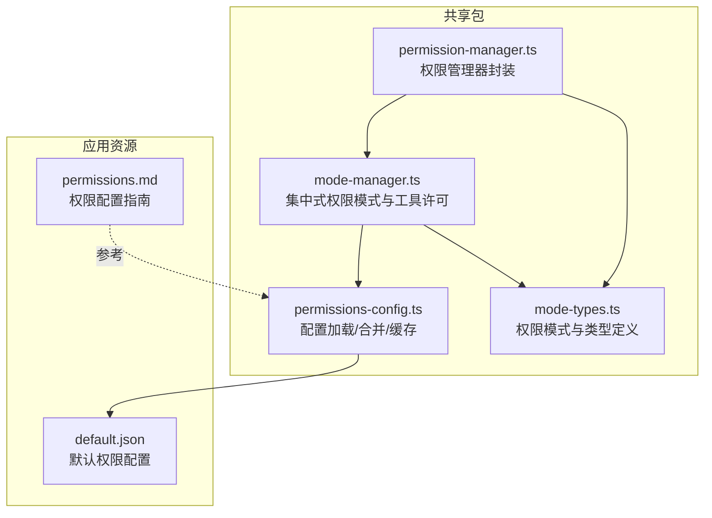
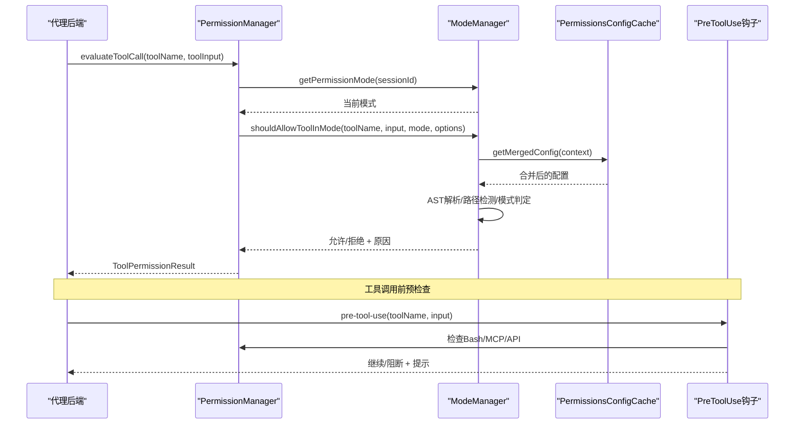
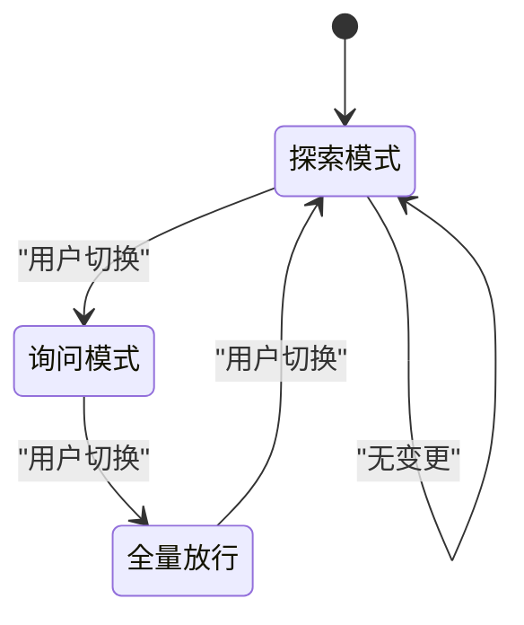
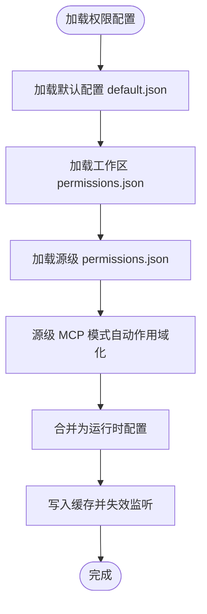
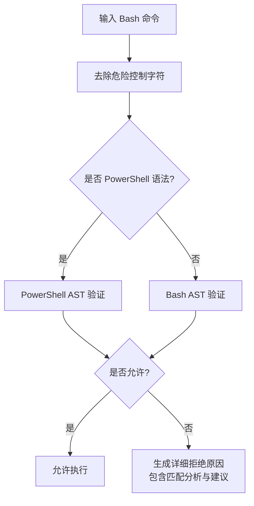
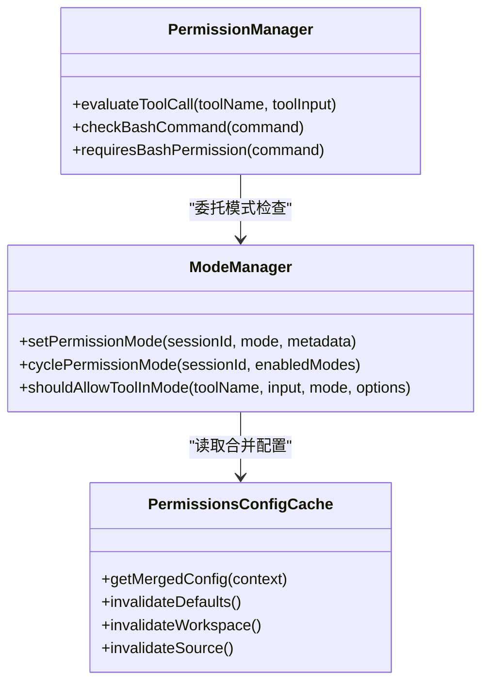
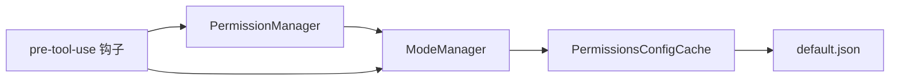

# 权限管理模式

<cite>
**本文档引用的文件**
- [packages/shared/src/agent/core/permission-manager.ts](file://packages/shared/src/agent/core/permission-manager.ts)
- [packages/shared/src/agent/mode-manager.ts](file://packages/shared/src/agent/mode-manager.ts)
- [packages/shared/src/agent/permissions-config.ts](file://packages/shared/src/agent/permissions-config.ts)
- [apps/electron/resources/permissions/default.json](file://apps/electron/resources/permissions/default.json)
- [apps/electron/resources/docs/permissions.md](file://apps/electron/resources/docs/permissions.md)
- [packages/shared/src/agent/core/pre-tool-use.ts](file://packages/shared/src/agent/core/pre-tool-use.ts)
- [packages/shared/src/agent/mode-types.ts](file://packages/shared/src/agent/mode-types.ts)
</cite>

## 目录

1. [简介](#简介)
2. [项目结构](#项目结构)
3. [核心组件](#核心组件)
4. [架构总览](#架构总览)
5. [详细组件分析](#详细组件分析)
6. [依赖关系分析](#依赖关系分析)
7. [性能考虑](#性能考虑)
8. [故障排除指南](#故障排除指南)
9. [结论](#结论)

## 简介

本文件系统性阐述 Craft Agents 的权限管理模式，覆盖三种权限级别（探索模式、询问模式、全量放行）的实现原理、规则配置、安全控制机制与动态调整策略。文档结合实际代码库中的实现与配置文件，解释权限检查流程、动态权限调整、权限继承关系，并说明与代理执行、工具调用、文件访问的安全集成方式，最后提供权限冲突、安全漏洞与权限绕过等常见问题的诊断与修复建议。

## 项目结构

权限管理相关代码主要位于共享包的 agent 子模块中，配合应用层默认权限配置与用户文档：

- 核心权限逻辑：`packages/shared/src/agent/mode-manager.ts`（集中式权限模式管理与工具许可判定）
- 权限管理器封装：`packages/shared/src/agent/core/permission-manager.ts`（面向后端的统一权限检查接口）
- 权限配置加载与合并：`packages/shared/src/agent/permissions-config.ts`（工作区/源级配置合并、缓存与迁移）
- 默认权限配置：`apps/electron/resources/permissions/default.json`（内置允许的 Bash/MCP 模式与 API 规则）
- 用户文档：`apps/electron/resources/docs/permissions.md`（权限配置指南、规则类型、最佳实践）

**图表来源**

- [packages/shared/src/agent/mode-manager.ts](file://packages/shared/src/agent/mode-manager.ts#L1-L120)
- [packages/shared/src/agent/core/permission-manager.ts](file://packages/shared/src/agent/core/permission-manager.ts#L1-L120)
- [packages/shared/src/agent/permissions-config.ts](file://packages/shared/src/agent/permissions-config.ts#L1-L120)
- [apps/electron/resources/permissions/default.json](file://apps/electron/resources/permissions/default.json#L1-L60)
- [apps/electron/resources/docs/permissions.md](file://apps/electron/resources/docs/permissions.md#L1-L60)

**章节来源**

- [packages/shared/src/agent/mode-manager.ts](file://packages/shared/src/agent/mode-manager.ts#L1-L120)
- [packages/shared/src/agent/core/permission-manager.ts](file://packages/shared/src/agent/core/permission-manager.ts#L1-L120)
- [packages/shared/src/agent/permissions-config.ts](file://packages/shared/src/agent/permissions-config.ts#L1-L120)
- [apps/electron/resources/permissions/default.json](file://apps/electron/resources/permissions/default.json#L1-L60)
- [apps/electron/resources/docs/permissions.md](file://apps/electron/resources/docs/permissions.md#L1-L60)

## 核心组件

- 集中式权限模式管理器（ModeManager）：维护每个会话的权限模式状态，支持模式切换与订阅通知，确保无全局状态污染。
- 权限管理器（PermissionManager）：面向后端的统一接口，委托 ModeManager 实现一致的行为；负责 Bash 命令、API 端点、MCP 工具与文件写入的许可判定。
- 权限配置缓存（PermissionsConfigCache）：按工作区与源级加载自定义配置，与默认配置进行加法合并，支持增量迁移与失效重算。
- 默认权限配置（default.json）：内置允许的 Bash/MCP 模式与 API 规则，作为 Explore 模式的基线。
- 权限检查钩子（pre-tool-use）：在工具调用前进行预检查，区分 Bash 写操作、MCP 变更与 API 变更，必要时触发用户确认或自动放行。

**章节来源**

- [packages/shared/src/agent/mode-manager.ts](file://packages/shared/src/agent/mode-manager.ts#L215-L345)
- [packages/shared/src/agent/core/permission-manager.ts](file://packages/shared/src/agent/core/permission-manager.ts#L68-L120)
- [packages/shared/src/agent/permissions-config.ts](file://packages/shared/src/agent/permissions-config.ts#L457-L560)
- [apps/electron/resources/permissions/default.json](file://apps/electron/resources/permissions/default.json#L1-L60)
- [packages/shared/src/agent/core/pre-tool-use.ts](file://packages/shared/src/agent/core/pre-tool-use.ts#L853-L895)

## 架构总览

权限管理模式采用“模式驱动 + 配置合并 + AST 验证”的分层设计：

- 模式层：Explore（只读）、Ask（询问危险操作）、Allow-All（跳过检查）
- 配置层：默认配置（default.json）+ 工作区配置 + 源级配置（自动作用域 MCP 模式）
- 验证层：AST 解析 Bash/PowerShell 命令，识别危险操作（重定向、命令替换、后台执行等），并生成可操作的错误提示
- 执行层：在工具调用前通过 pre-tool-use 钩子进行许可判定，必要时弹出用户确认

**图表来源**

- [packages/shared/src/agent/core/permission-manager.ts](file://packages/shared/src/agent/core/permission-manager.ts#L128-L176)
- [packages/shared/src/agent/mode-manager.ts](file://packages/shared/src/agent/mode-manager.ts#L1709-L1738)
- [packages/shared/src/agent/permissions-config.ts](file://packages/shared/src/agent/permissions-config.ts#L551-L560)
- [packages/shared/src/agent/core/pre-tool-use.ts](file://packages/shared/src/agent/core/pre-tool-use.ts#L853-L895)

**章节来源**

- [packages/shared/src/agent/core/permission-manager.ts](file://packages/shared/src/agent/core/permission-manager.ts#L128-L176)
- [packages/shared/src/agent/mode-manager.ts](file://packages/shared/src/agent/mode-manager.ts#L1709-L1738)
- [packages/shared/src/agent/permissions-config.ts](file://packages/shared/src/agent/permissions-config.ts#L551-L560)
- [packages/shared/src/agent/core/pre-tool-use.ts](file://packages/shared/src/agent/core/pre-tool-use.ts#L853-L895)

## 详细组件分析

### 权限模式与动态调整

- 模式定义：Explore（只读，不提示）、Ask（询问危险操作）、Allow-All（跳过检查）
- 切换机制：支持按顺序循环切换，记录模式变更来源与时间戳，支持订阅外部状态变化
- 会话隔离：每个 sessionId 维护独立状态，避免全局状态耦合

**图表来源**

- [packages/shared/src/agent/mode-manager.ts](file://packages/shared/src/agent/mode-manager.ts#L376-L397)

**章节来源**

- [packages/shared/src/agent/mode-manager.ts](file://packages/shared/src/agent/mode-manager.ts#L77-L92)
- [packages/shared/src/agent/mode-manager.ts](file://packages/shared/src/agent/mode-manager.ts#L264-L302)
- [packages/shared/src/agent/mode-manager.ts](file://packages/shared/src/agent/mode-manager.ts#L376-L397)

### 权限规则配置与继承

- 配置来源与优先级：
  - 应用默认配置（~/.craft-agent/permissions/default.json）
  - 工作区配置（工作区根目录下的 permissions.json）
  - 源级配置（工作区/slug/sources/sourceSlug/permissions.json）
- 继承规则：加法扩展（更宽松），非覆盖；MCP 模式在源级自动作用域化，避免跨源泄漏
- 迁移与同步：启动时将默认配置同步到用户目录，若版本更新则合并新增模式，保留用户定制

**图表来源**

- [packages/shared/src/agent/permissions-config.ts](file://packages/shared/src/agent/permissions-config.ts#L551-L609)
- [packages/shared/src/agent/permissions-config.ts](file://packages/shared/src/agent/permissions-config.ts#L708-L758)

**章节来源**

- [packages/shared/src/agent/permissions-config.ts](file://packages/shared/src/agent/permissions-config.ts#L551-L609)
- [packages/shared/src/agent/permissions-config.ts](file://packages/shared/src/agent/permissions-config.ts#L708-L758)
- [apps/electron/resources/permissions/default.json](file://apps/electron/resources/permissions/default.json#L1-L60)

### Bash 命令安全检查与错误提示

- AST 解析：使用 bash/PowerShell AST 验证复合命令（&&、||、|），仅当所有子命令均安全才允许
- 危险操作识别：重定向（>, >>）、命令替换（$()、反引号）、进程替换（<()、>()）、变量展开（${}、$VAR）、环境赋值、后台执行（&）、管道（|）
- 错误消息：提供“已匹配前缀/失败位置/建议”等诊断信息，帮助用户调整命令格式
- 路径提取：从 Bash/PowerShell 写操作中提取目标路径，用于 Explore 模式下的路径白名单判断

**图表来源**

- [packages/shared/src/agent/mode-manager.ts](file://packages/shared/src/agent/mode-manager.ts#L1013-L1160)
- [packages/shared/src/agent/mode-manager.ts](file://packages/shared/src/agent/mode-manager.ts#L1309-L1446)

**章节来源**

- [packages/shared/src/agent/mode-manager.ts](file://packages/shared/src/agent/mode-manager.ts#L1013-L1160)
- [packages/shared/src/agent/mode-manager.ts](file://packages/shared/src/agent/mode-manager.ts#L1309-L1446)
- [packages/shared/src/agent/mode-manager.ts](file://packages/shared/src/agent/mode-manager.ts#L1509-L1573)

### MCP 工具与 API 安全检查

- MCP 工具：基于模式匹配允许只读工具；写操作一律阻止；API 类 MCP（mcp**<source>**api\_<name>）按方法+路径规则放行
- API 调用：GET 始终允许；其他方法需满足细粒度路径规则；未命中规则则阻止
- 会话工具：mcp**session** 前缀的工具遵循会话安全清单，写/认证/管理类工具在 Explore 模式下阻止

**图表来源**

- [packages/shared/src/agent/core/permission-manager.ts](file://packages/shared/src/agent/core/permission-manager.ts#L128-L176)
- [packages/shared/src/agent/mode-manager.ts](file://packages/shared/src/agent/mode-manager.ts#L1709-L1738)
- [packages/shared/src/agent/permissions-config.ts](file://packages/shared/src/agent/permissions-config.ts#L551-L560)

**章节来源**

- [packages/shared/src/agent/mode-manager.ts](file://packages/shared/src/agent/mode-manager.ts#L1911-L1972)
- [packages/shared/src/agent/mode-manager.ts](file://packages/shared/src/agent/mode-manager.ts#L1624-L1649)

### 文件访问与路径白名单

- Explore 模式限制写入：仅允许写入计划目录（plans）与数据目录（data），以及 permissions.json 中声明的允许写入路径
- 路径校验：使用稳健的包含关系判断，防止同父前缀绕过与符号链接逃逸
- 提示与引导：当目标路径不在允许范围内时，给出明确的提示与正确的写入路径建议

**章节来源**

- [packages/shared/src/agent/mode-manager.ts](file://packages/shared/src/agent/mode-manager.ts#L1772-L1824)
- [packages/shared/src/agent/mode-manager.ts](file://packages/shared/src/agent/mode-manager.ts#L1840-L1901)
- [packages/shared/src/agent/mode-manager.ts](file://packages/shared/src/agent/mode-manager.ts#L1591-L1620)

### 与代理执行、工具调用、文件访问的安全集成

- 预检查钩子：在工具调用前进行许可判定，区分 Bash 写操作、MCP 变更与 API 变更，必要时触发用户确认或自动放行
- 会话状态注入：将当前模式与路径信息注入用户消息，辅助代理决策
- 白名单与临时豁免：支持会话级“总是允许”命令与域名白名单，提升交互效率

**章节来源**

- [packages/shared/src/agent/core/pre-tool-use.ts](file://packages/shared/src/agent/core/pre-tool-use.ts#L853-L895)
- [packages/shared/src/agent/mode-manager.ts](file://packages/shared/src/agent/mode-manager.ts#L2036-L2065)
- [packages/shared/src/agent/core/permission-manager.ts](file://packages/shared/src/agent/core/permission-manager.ts#L341-L390)

## 依赖关系分析

- PermissionManager 依赖 ModeManager 获取模式状态与工具许可判定
- ModeManager 依赖 PermissionsConfigCache 加载与合并配置
- PermissionsConfigCache 依赖默认配置文件与工作区/源级配置文件
- 预检查钩子依赖 PermissionManager 与 ModeManager 的许可结果

**图表来源**

- [packages/shared/src/agent/core/permission-manager.ts](file://packages/shared/src/agent/core/permission-manager.ts#L15-L29)
- [packages/shared/src/agent/mode-manager.ts](file://packages/shared/src/agent/mode-manager.ts#L1722-L1728)
- [packages/shared/src/agent/permissions-config.ts](file://packages/shared/src/agent/permissions-config.ts#L551-L560)

**章节来源**

- [packages/shared/src/agent/core/permission-manager.ts](file://packages/shared/src/agent/core/permission-manager.ts#L15-L29)
- [packages/shared/src/agent/mode-manager.ts](file://packages/shared/src/agent/mode-manager.ts#L1722-L1728)
- [packages/shared/src/agent/permissions-config.ts](file://packages/shared/src/agent/permissions-config.ts#L551-L560)

## 性能考虑

- 配置缓存：PermissionsConfigCache 使用内存缓存，按工作区与源级键值缓存合并结果，减少重复解析与合并开销
- 模式切换：ModeManager 仅在模式变更时触发回调与订阅通知，避免冗余事件
- AST 验证：仅在 Explore 模式下对 Bash/PowerShell 命令进行 AST 解析，其他模式跳过昂贵验证
- 路径匹配：使用正则与通配符组合，先标准化路径再比较，降低跨平台差异带来的性能损耗

[本节为通用指导，无需特定文件引用]

## 故障排除指南

- 命令被 Explore 模式拒绝：
  - 检查命令是否包含危险操作（重定向、命令替换、后台执行、管道等）
  - 使用错误消息中的“匹配分析/建议”调整命令格式
  - 将所需模式加入工作区/源级 permissions.json
- API 调用被阻止：
  - 确认方法为 GET 或已在 permissions.json 中配置允许的方法+路径规则
- 写入被阻止：
  - 确认目标路径位于 plans 或 data 目录，或在 permissions.json 中配置允许写入路径
- 模式切换无效：
  - 检查是否正确调用 cyclePermissionMode 或 setPermissionMode
  - 查看模式变更来源与时间戳，确认是否被系统或恢复流程覆盖
- 权限绕过与冲突：
  - 确保未在源级配置中使用过于宽泛的 MCP 模式导致跨源影响
  - 使用最小权限原则，仅添加必要的模式与路径

**章节来源**

- [packages/shared/src/agent/mode-manager.ts](file://packages/shared/src/agent/mode-manager.ts#L1309-L1446)
- [packages/shared/src/agent/mode-manager.ts](file://packages/shared/src/agent/mode-manager.ts#L1772-L1824)
- [packages/shared/src/agent/mode-manager.ts](file://packages/shared/src/agent/mode-manager.ts#L1911-L1972)
- [apps/electron/resources/docs/permissions.md](file://apps/electron/resources/docs/permissions.md#L195-L283)

## 结论

Craft Agents 的权限管理模式通过“模式驱动 + 配置合并 + AST 验证”的分层设计，在保证安全性的同时提供了灵活的可配置性与良好的用户体验。Explore 模式确保只读安全，Ask 模式在必要时请求确认，Allow-All 模式满足开发调试需求。通过工作区与源级权限配置的加法扩展、MCP 模式的自动作用域化与稳健的路径白名单机制，系统实现了细粒度且可审计的安全控制。结合详细的错误提示与会话状态注入，代理能够在不同模式间平滑协作，既满足初学者的易用性，也为高级用户提供足够的技术深度。
