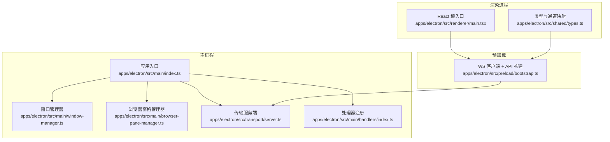
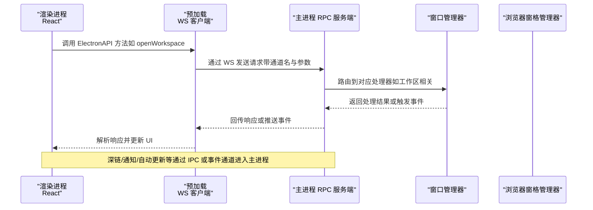
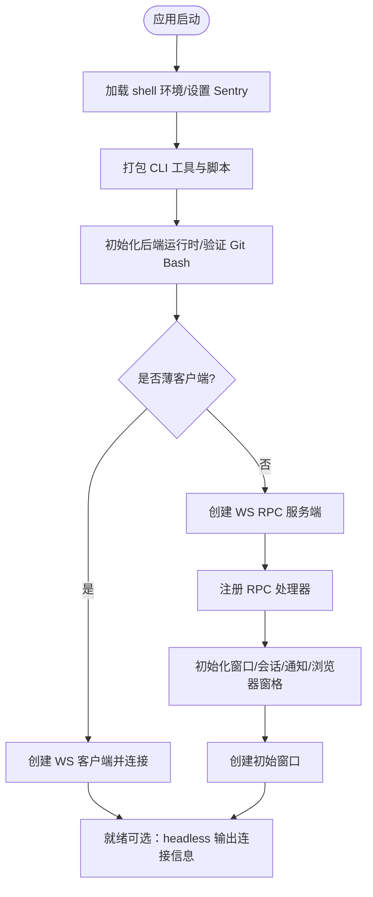
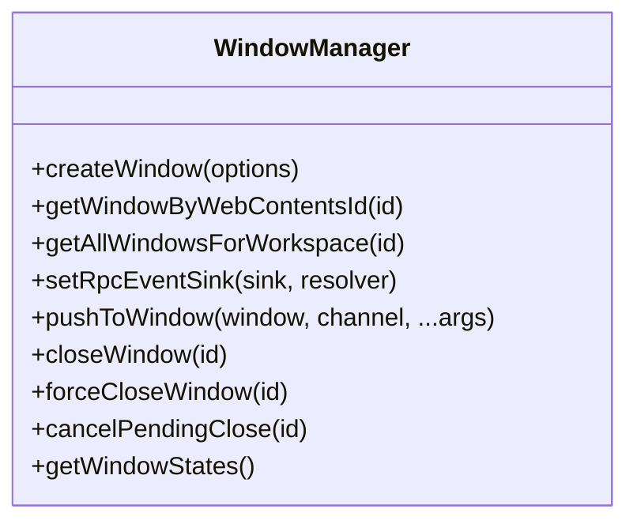
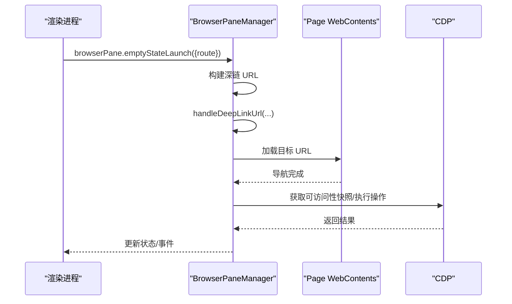
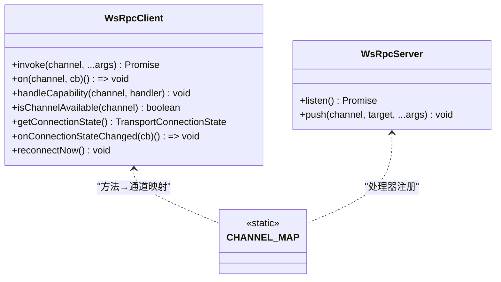
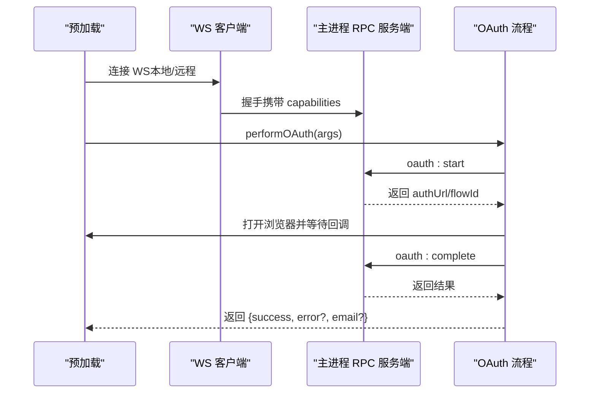
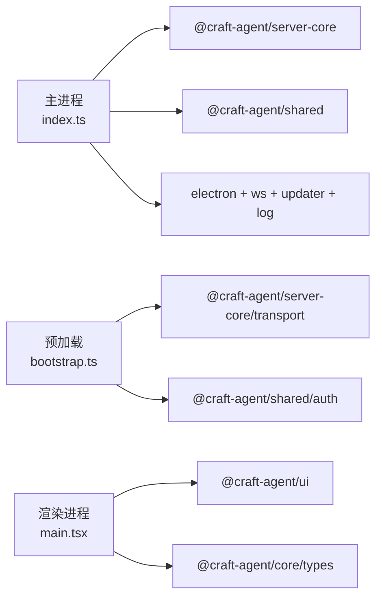

# 桌面应用（Electron）

<cite>
**本文引用的文件**
- [apps/electron/package.json](file://apps/electron/package.json)
- [apps/electron/src/main/index.ts](file://apps/electron/src/main/index.ts)
- [apps/electron/src/preload/bootstrap.ts](file://apps/electron/src/preload/bootstrap.ts)
- [apps/electron/src/renderer/main.tsx](file://apps/electron/src/renderer/main.tsx)
- [apps/electron/src/transport/index.ts](file://apps/electron/src/transport/index.ts)
- [apps/electron/src/transport/client.ts](file://apps/electron/src/transport/client.ts)
- [apps/electron/src/transport/server.ts](file://apps/electron/src/transport/server.ts)
- [apps/electron/src/transport/channel-map.ts](file://apps/electron/src/transport/channel-map.ts)
- [apps/electron/src/main/window-manager.ts](file://apps/electron/src/main/window-manager.ts)
- [apps/electron/src/main/window-state.ts](file://apps/electron/src/main/window-state.ts)
- [apps/electron/src/main/browser-pane-manager.ts](file://apps/electron/src/main/browser-pane-manager.ts)
- [apps/electron/src/main/handlers/index.ts](file://apps/electron/src/main/handlers/index.ts)
- [apps/electron/src/runtime/platform.ts](file://apps/electron/src/runtime/platform.ts)
- [apps/electron/src/shared/types.ts](file://apps/electron/src/shared/types.ts)
</cite>

## 目录

1. [简介](#简介)
2. [项目结构](#项目结构)
3. [核心组件](#核心组件)
4. [架构总览](#架构总览)
5. [详细组件分析](#详细组件分析)
6. [依赖分析](#依赖分析)
7. [性能考虑](#性能考虑)
8. [故障排查指南](#故障排查指南)
9. [结论](#结论)
10. [附录](#附录)

## 简介

本文件面向 Craft Agents 桌面应用（基于 Electron）的技术文档，聚焦于应用初始化流程、窗口与浏览器面板管理、会话与传输层通信、OAuth 认证编排、以及错误追踪与自动更新等核心能力。文档以“从主进程到渲染进程”的视角梳理代码结构与调用关系，并通过图示帮助读者快速建立整体认知。

## 项目结构

Electron 应用位于 apps/electron 目录，采用“主进程 + 预加载 + 渲染进程 + 传输层”分层设计：

- 主进程负责应用生命周期、窗口管理、会话管理、RPC 服务端、系统集成（菜单、通知、自动更新）、深链处理等。
- 预加载脚本负责在渲染上下文外桥接主进程能力，构建安全的 ElectronAPI，并建立本地或远程 WebSocket 传输通道。
- 渲染进程承载 React UI，通过 ElectronAPI 调用主进程能力，订阅事件并驱动视图交互。
- 传输层提供统一的 RPC 协议与客户端/服务端实现，支持本地嵌入与远程薄客户端两种模式。

图表来源

- [apps/electron/src/main/index.ts](file://apps/electron/src/main/index.ts#L295-L738)
- [apps/electron/src/main/window-manager.ts](file://apps/electron/src/main/window-manager.ts#L104-L408)
- [apps/electron/src/main/browser-pane-manager.ts](file://apps/electron/src/main/browser-pane-manager.ts#L346-L502)
- [apps/electron/src/transport/server.ts](file://apps/electron/src/transport/server.ts#L1-L2)
- [apps/electron/src/preload/bootstrap.ts](file://apps/electron/src/preload/bootstrap.ts#L39-L100)
- [apps/electron/src/renderer/main.tsx](file://apps/electron/src/renderer/main.tsx#L104-L112)
- [apps/electron/src/shared/types.ts](file://apps/electron/src/shared/types.ts#L1-L10)

章节来源

- [apps/electron/package.json](file://apps/electron/package.json#L1-L80)
- [apps/electron/src/main/index.ts](file://apps/electron/src/main/index.ts#L295-L738)

## 核心组件

- 应用入口与初始化：负责环境准备、资源打包、平台注入、RPC 服务器启动、窗口与会话初始化、深链与通知、自动更新等。
- 窗口管理器：负责创建/关闭/聚焦窗口、持久化窗口状态、广播主题与焦点事件、拦截关闭行为并区分来源。
- 浏览器窗格管理器：以原生 BrowserWindow 托管独立浏览器实例，共享 Cookie 分区与 CDP 能力，支持工具栏、空状态页、导航与截图。
- 传输层：基于 WebSocket 的 RPC 客户端/服务端，支持握手、鉴权、请求超时、自动重连、事件订阅与能力回调。
- 预加载与 ElectronAPI：在渲染进程外暴露受控 API，桥接主进程能力（对话框、外部打开、能力回调），并建立 WS 连接。
- 渲染根入口：初始化 Sentry、主题提供者与全局 UI，承载 React 应用。

章节来源

- [apps/electron/src/main/index.ts](file://apps/electron/src/main/index.ts#L364-L720)
- [apps/electron/src/main/window-manager.ts](file://apps/electron/src/main/window-manager.ts#L53-L647)
- [apps/electron/src/main/browser-pane-manager.ts](file://apps/electron/src/main/browser-pane-manager.ts#L311-L800)
- [apps/electron/src/transport/client.ts](file://apps/electron/src/transport/client.ts#L101-L728)
- [apps/electron/src/preload/bootstrap.ts](file://apps/electron/src/preload/bootstrap.ts#L1-L314)
- [apps/electron/src/renderer/main.tsx](file://apps/electron/src/renderer/main.tsx#L1-L113)

## 架构总览

下图展示从渲染进程发起调用到主进程处理与回传的关键路径，以及深链、通知、自动更新等横切关注点：

图表来源

- [apps/electron/src/preload/bootstrap.ts](file://apps/electron/src/preload/bootstrap.ts#L103-L165)
- [apps/electron/src/transport/client.ts](file://apps/electron/src/transport/client.ts#L157-L183)
- [apps/electron/src/main/handlers/index.ts](file://apps/electron/src/main/handlers/index.ts#L21-L24)
- [apps/electron/src/main/window-manager.ts](file://apps/electron/src/main/window-manager.ts#L85-L98)

## 详细组件分析

### 应用入口与初始化（主进程）

- 环境与资源：加载用户 shell 环境、设置 Sentry、注入机器标识；打包 CLI 工具与脚本路径；注册 Pi 模型解析器；设置深链协议与缩略图协议。
- 应用生命周期：注册单实例锁、深链处理、激活事件（macOS）与退出前清理；保存窗口状态、刷新会话写入、销毁资源。
- 服务器与平台：根据环境变量决定薄客户端模式；在非薄客户端模式下初始化 SessionManager、模型刷新服务、平台注入（图像处理、日志、错误上报）。
- RPC 服务端：创建本地 WebSocket 服务器，暴露连接信息给预加载；注册所有 RPC 处理器；设置事件源与通知服务；初始化认证与权限健康检查。
- 窗口与会话：创建初始窗口（恢复或默认），在无头模式下跳过 UI；初始化通知、浏览器窗格管理器并绑定事件。

图表来源

- [apps/electron/src/main/index.ts](file://apps/electron/src/main/index.ts#L112-L159)
- [apps/electron/src/main/index.ts](file://apps/electron/src/main/index.ts#L364-L720)

章节来源

- [apps/electron/src/main/index.ts](file://apps/electron/src/main/index.ts#L1-L831)

### 窗口管理器（WindowManager）

- 职责：创建/关闭/聚焦窗口；持久化窗口边界与 URL；拦截关闭事件并区分来源（交通灯按钮、快捷键、IPC）；向 RPC 通道广播主题与焦点变化。
- URL 与深链：支持开发/生产两种加载策略；支持初始深链导航；失败时回退到默认页面。
- 关闭拦截：通过 IPC 与超时机制保证在某些窗口管理器（如 Wayland）下的健壮性。

图表来源

- [apps/electron/src/main/window-manager.ts](file://apps/electron/src/main/window-manager.ts#L53-L647)

章节来源

- [apps/electron/src/main/window-manager.ts](file://apps/electron/src/main/window-manager.ts#L1-L647)
- [apps/electron/src/main/window-state.ts](file://apps/electron/src/main/window-state.ts#L1-L91)

### 浏览器窗格管理器（BrowserPaneManager）

- 职责：以原生 BrowserWindow 托管浏览器实例，共享 Cookie 分区与 CDP；维护工具栏、空状态页、主题色提取、网络/控制台日志、下载跟踪；提供导航、前进/后退、截图、可访问性快照等能力。
- 生命周期：创建实例、加载工具栏与空状态页、布局 BrowserView、监听事件、销毁清理。
- 深链与路由：从空状态页触发深链，构建 craftagents:// URL 并交由深链处理逻辑。

图表来源

- [apps/electron/src/main/browser-pane-manager.ts](file://apps/electron/src/main/browser-pane-manager.ts#L558-L639)
- [apps/electron/src/main/browser-pane-manager.ts](file://apps/electron/src/main/browser-pane-manager.ts#L655-L688)
- [apps/electron/src/main/browser-pane-manager.ts](file://apps/electron/src/main/browser-pane-manager.ts#L764-L789)

章节来源

- [apps/electron/src/main/browser-pane-manager.ts](file://apps/electron/src/main/browser-pane-manager.ts#L1-L3154)

### 传输层（WsRpcClient/WsRpcServer）

- 客户端（预加载）：建立 WS 连接、发送握手、注册能力回调（对话框、外部打开等）、请求超时、自动重连、连接状态事件。
- 服务端（主进程）：继承自 server-core 的 WsRpcServer，作为 RPC 服务端接收请求并分发至处理器。
- 通道映射：将 ElectronAPI 方法映射到 RPC 通道，统一调用与事件订阅。

图表来源

- [apps/electron/src/transport/client.ts](file://apps/electron/src/transport/client.ts#L101-L728)
- [apps/electron/src/transport/server.ts](file://apps/electron/src/transport/server.ts#L1-L2)
- [apps/electron/src/transport/channel-map.ts](file://apps/electron/src/transport/channel-map.ts#L1-L335)

章节来源

- [apps/electron/src/transport/client.ts](file://apps/electron/src/transport/client.ts#L1-L728)
- [apps/electron/src/transport/server.ts](file://apps/electron/src/transport/server.ts#L1-L2)
- [apps/electron/src/transport/channel-map.ts](file://apps/electron/src/transport/channel-map.ts#L1-L335)
- [apps/electron/src/transport/index.ts](file://apps/electron/src/transport/index.ts#L1-L6)

### 预加载与 ElectronAPI

- 连接建立：在本地模式从主进程同步端口与令牌，在远程模式从环境变量读取；校验非本地明文 ws://。
- 能力回调：注册对话框、外部打开、文件打开等主进程能力；在远程模式下将连接状态上报主进程。
- OAuth 编排：在渲染侧启动本地回调服务器，与服务端协作完成 OAuth 流程（支持 Claude 与 ChatGPT）。

图表来源

- [apps/electron/src/preload/bootstrap.ts](file://apps/electron/src/preload/bootstrap.ts#L39-L100)
- [apps/electron/src/preload/bootstrap.ts](file://apps/electron/src/preload/bootstrap.ts#L171-L229)
- [apps/electron/src/preload/bootstrap.ts](file://apps/electron/src/preload/bootstrap.ts#L258-L311)

章节来源

- [apps/electron/src/preload/bootstrap.ts](file://apps/electron/src/preload/bootstrap.ts#L1-L314)
- [apps/electron/src/shared/types.ts](file://apps/electron/src/shared/types.ts#L205-L559)

### 渲染根入口（Sentry 初始化与主题）

- 在渲染进程初始化 Sentry（双通道：IPC 与 React 集成），过滤已知噪声；提供崩溃兜底 UI。
- 通过 ThemeProvider 将工作区主题传递给组件树。

章节来源

- [apps/electron/src/renderer/main.tsx](file://apps/electron/src/renderer/main.tsx#L1-L113)

## 依赖分析

- 主进程依赖：@craft-agent/server-core（会话、传输、处理器）、@craft-agent/shared（配置、文档、权限、工具图标、主题、协议）、electron、ws、electron-log、electron-updater、Sentry。
- 预加载依赖：@craft-agent/server-core/transport（能力通道常量）、@craft-agent/shared/auth（回调服务器、OAuth 配置）、electron、ws。
- 渲染进程依赖：@craft-agent/server-core/transport（通道常量）、@craft-agent/shared/protocol（类型）、@craft-agent/ui、@craft-agent/core/types 等。

图表来源

- [apps/electron/package.json](file://apps/electron/package.json#L39-L78)
- [apps/electron/src/main/index.ts](file://apps/electron/src/main/index.ts#L68-L98)
- [apps/electron/src/preload/bootstrap.ts](file://apps/electron/src/preload/bootstrap.ts#L15-L31)
- [apps/electron/src/renderer/main.tsx](file://apps/electron/src/renderer/main.tsx#L1-L11)

章节来源

- [apps/electron/package.json](file://apps/electron/package.json#L1-L80)

## 性能考虑

- 启动优化：延迟窗口显示至 ready-to-show，避免白屏；在开发模式下重试 Vite 服务；在生产模式避免直接加载过时的 file:// 路径。
- 传输层：请求超时、指数退避重连、连接状态事件用于诊断；在远程模式下强制 TLS 以避免明文传输。
- 图像处理：原生图像处理（resize/format）在主进程执行，避免渲染进程阻塞。
- 资源打包：CLI 工具与脚本在打包时注入 PATH，减少运行时查找成本。

## 故障排查指南

- 连接失败与重连
  - 现象：连接失败、断线重连、握手超时。
  - 排查：查看主进程日志中的连接状态上报；确认令牌与主机绑定；检查防火墙与证书配置（远程模式）。
- OAuth 失败
  - 现象：无法完成授权或回调异常。
  - 排查：确认本地回调服务器端口可用；检查服务端 oauth:start/oauth:complete 是否成功；核对回调 URL 与 PKCE state。
- 窗口关闭拦截无效
  - 现象：在某些窗口管理器上关闭被忽略。
  - 排查：确认 IPC 成功下发；检查超时是否提前触发；必要时使用 forceCloseWindow。
- 深链未生效
  - 现象：应用启动后未导航到指定页面。
  - 排查：确认深链协议注册与命令行参数；检查窗口 ready-to-show 后的导航时机。
- 自动更新
  - 现象：更新检查失败或安装中断。
  - 排查：确认打包环境与更新通道；检查日志中的错误码与原因。

章节来源

- [apps/electron/src/transport/client.ts](file://apps/electron/src/transport/client.ts#L263-L334)
- [apps/electron/src/preload/bootstrap.ts](file://apps/electron/src/preload/bootstrap.ts#L121-L157)
- [apps/electron/src/main/window-manager.ts](file://apps/electron/src/main/window-manager.ts#L343-L381)
- [apps/electron/src/main/index.ts](file://apps/electron/src/main/index.ts#L201-L240)

## 结论

该 Electron 应用通过清晰的分层设计实现了稳定的桌面体验：主进程负责核心业务与系统集成，预加载提供安全可控的 API 桥接，渲染进程专注 UI 与交互，传输层统一了请求与事件模型。借助深链、通知、自动更新与完善的错误追踪，应用在复杂场景下仍保持可维护性与可观测性。

## 附录

### 关键配置与环境变量

- CRAFT_SERVER_URL / CRAFT_SERVER_TOKEN：远程薄客户端模式的服务器地址与令牌。
- CRAFT_RPC_HOST / CRAFT_RPC_PORT：本地 RPC 服务器绑定地址与端口。
- CRAFT_IS_PACKAGED / CRAFT_RESOURCES_BASE / CRAFT_APP_ROOT：打包与资源路径注入。
- CRAFT_DEEPLINK_SCHEME / CRAFT_APP_NAME：深链方案与应用名称（多实例开发）。
- CRAFT_HEADLESS：无头模式（仅服务端，无 UI）。
- CRAFT_INSTANCE_NUMBER：多实例开发时的实例号徽章。
- GOOGLE*OAUTH*_ / SLACK*OAUTH*_ / MICROSOFT*OAUTH*\*：OAuth 凭据（构建时注入）。

章节来源

- [apps/electron/src/main/index.ts](file://apps/electron/src/main/index.ts#L14-L26)
- [apps/electron/src/main/index.ts](file://apps/electron/src/main/index.ts#L167-L195)
- [apps/electron/src/preload/bootstrap.ts](file://apps/electron/src/preload/bootstrap.ts#L39-L64)
- [apps/electron/package.json](file://apps/electron/package.json#L17-L37)
