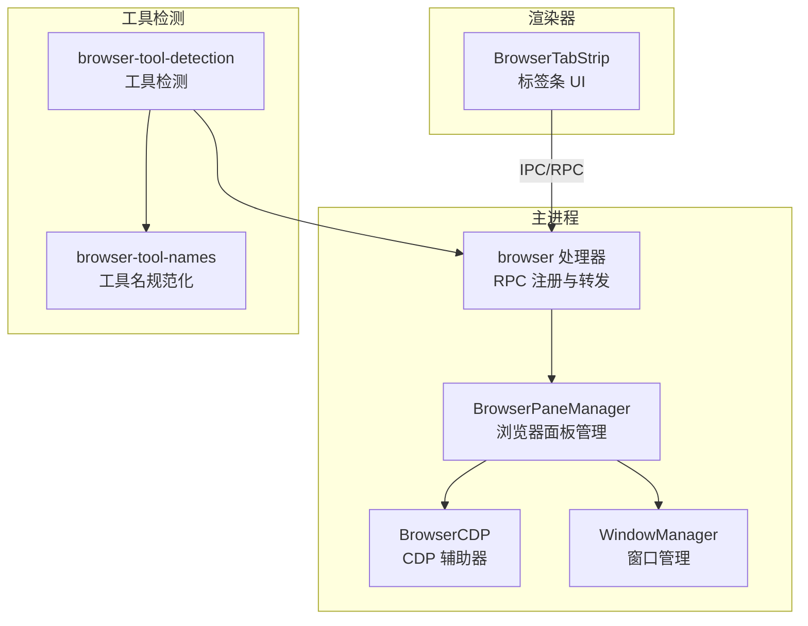
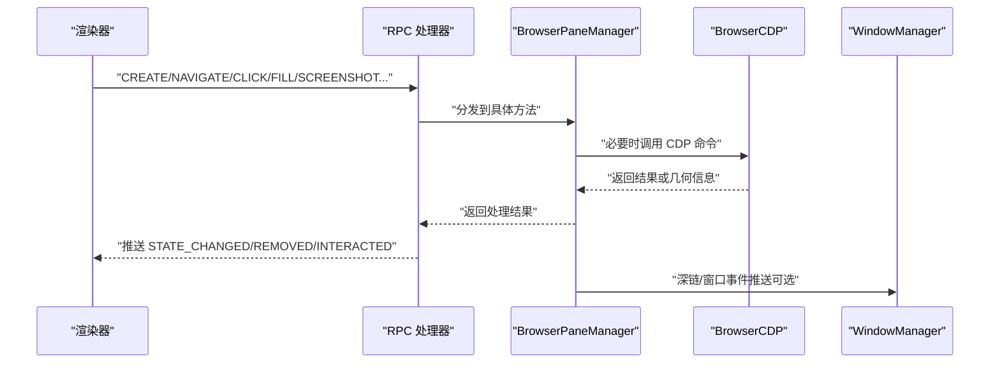
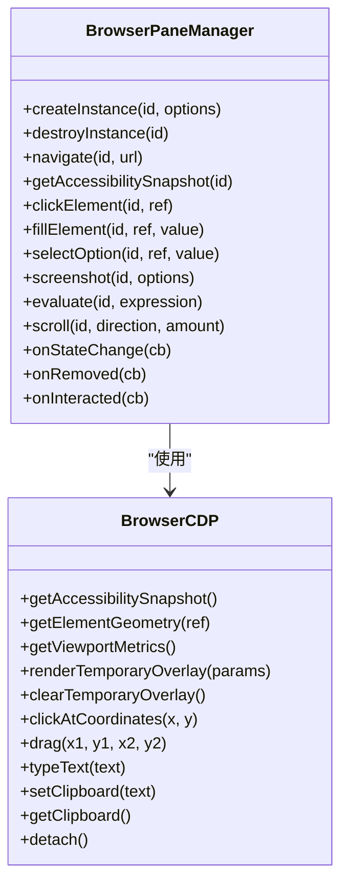
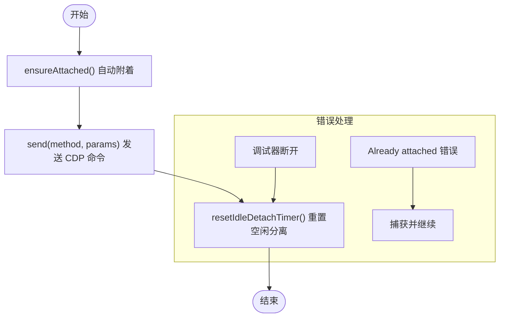
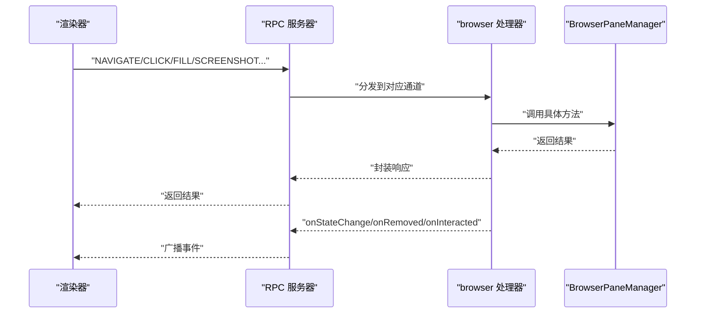
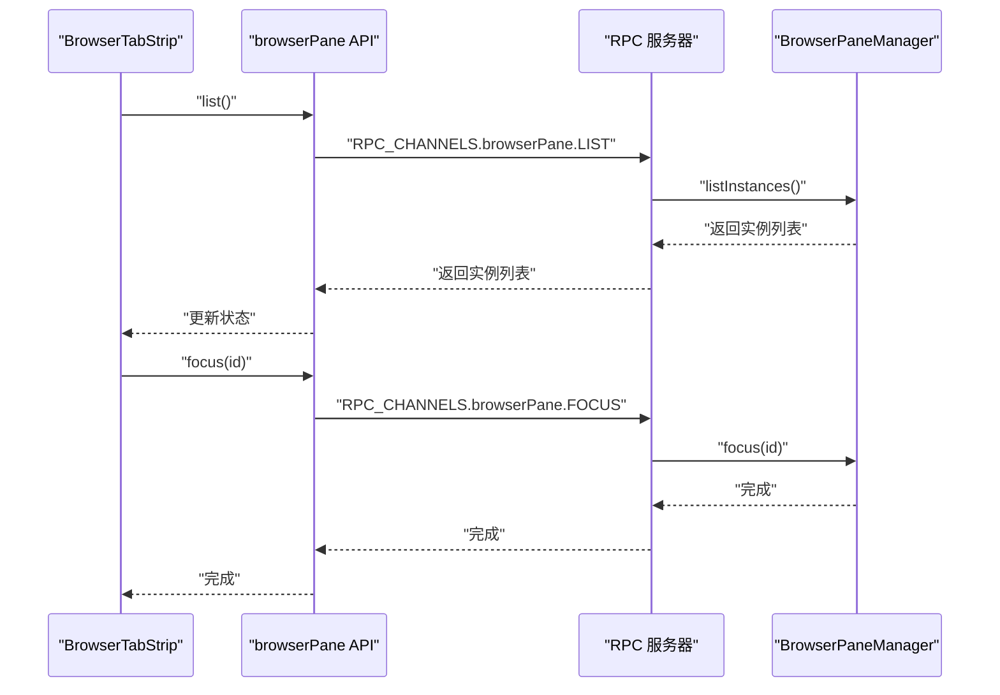
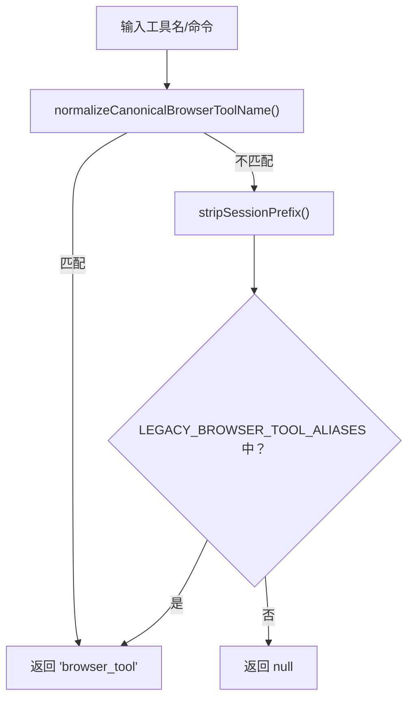
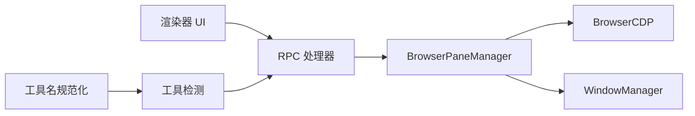

# 浏览器集成

<cite>
**本文引用的文件**
- [apps/electron/src/main/browser-pane-manager.ts](file://apps/electron/src/main/browser-pane-manager.ts)
- [apps/electron/src/main/browser-cdp.ts](file://apps/electron/src/main/browser-cdp.ts)
- [apps/electron/src/main/handlers/browser.ts](file://apps/electron/src/main/handlers/browser.ts)
- [apps/electron/src/renderer/components/browser/BrowserTabStrip.tsx](file://apps/electron/src/renderer/components/browser/BrowserTabStrip.tsx)
- [apps/electron/src/main/window-manager.ts](file://apps/electron/src/main/window-manager.ts)
- [packages/server-core/src/domain/browser-tool-detection.ts](file://packages/server-core/src/domain/browser-tool-detection.ts)
- [packages/shared/src/agent/browser-tool-names.ts](file://packages/shared/src/agent/browser-tool-names.ts)
- [apps/electron/src/shared/types.ts](file://apps/electron/src/shared/types.ts)
- [apps/electron/src/main/__tests__/browser-pane-manager.test.ts](file://apps/electron/src/main/__tests__/browser-pane-manager.test.ts)
- [apps/electron/src/main/__tests__/browser-cdp.test.ts](file://apps/electron/src/main/__tests__/browser-cdp.test.ts)
</cite>

## 目录

1. [简介](#简介)
2. [项目结构](#项目结构)
3. [核心组件](#核心组件)
4. [架构总览](#架构总览)
5. [组件详解](#组件详解)
6. [依赖关系分析](#依赖关系分析)
7. [性能考量](#性能考量)
8. [故障排查指南](#故障排查指南)
9. [结论](#结论)
10. [附录](#附录)

## 简介

本文件系统化阐述 Craft Agents 的浏览器集成功能，覆盖浏览器面板管理、工具检测机制、CDP（Chrome DevTools Protocol）集成，以及与会话管理、文件处理、外部工具调用的协同关系。文档以代码为依据，提供从架构到实现细节的全景式说明，并通过图示帮助读者快速建立整体认知。

## 项目结构

浏览器集成主要分布在 Electron 主进程与渲染器侧：

- 主进程：负责浏览器实例生命周期、窗口布局、CDP 交互、RPC 通道注册与事件广播。
- 渲染器：提供浏览器标签条 UI、状态订阅与用户交互入口。
- 工具检测：统一浏览器工具名规范化与激活策略，确保“浏览器覆盖层”按需启用。

图表来源

- [apps/electron/src/main/browser-pane-manager.ts](file://apps/electron/src/main/browser-pane-manager.ts#L311-L502)
- [apps/electron/src/main/browser-cdp.ts](file://apps/electron/src/main/browser-cdp.ts#L93-L155)
- [apps/electron/src/main/handlers/browser.ts](file://apps/electron/src/main/handlers/browser.ts#L26-L184)
- [apps/electron/src/renderer/components/browser/BrowserTabStrip.tsx](file://apps/electron/src/renderer/components/browser/BrowserTabStrip.tsx#L42-L166)
- [packages/server-core/src/domain/browser-tool-detection.ts](file://packages/server-core/src/domain/browser-tool-detection.ts#L1-L44)
- [packages/shared/src/agent/browser-tool-names.ts](file://packages/shared/src/agent/browser-tool-names.ts#L1-L81)

章节来源

- [apps/electron/src/main/browser-pane-manager.ts](file://apps/electron/src/main/browser-pane-manager.ts#L311-L502)
- [apps/electron/src/main/handlers/browser.ts](file://apps/electron/src/main/handlers/browser.ts#L26-L184)
- [apps/electron/src/renderer/components/browser/BrowserTabStrip.tsx](file://apps/electron/src/renderer/components/browser/BrowserTabStrip.tsx#L42-L166)
- [packages/server-core/src/domain/browser-tool-detection.ts](file://packages/server-core/src/domain/browser-tool-detection.ts#L1-L44)
- [packages/shared/src/agent/browser-tool-names.ts](file://packages/shared/src/agent/browser-tool-names.ts#L1-L81)

## 核心组件

- BrowserPaneManager：负责创建/销毁浏览器实例、窗口布局、页面与工具栏视图管理、空状态页与深链处理、截图与可访问性快照、元素交互（点击、拖拽、输入）、网络与控制台日志收集、主题色提取与观察者、代理控制锁等。
- BrowserCDP：基于 Electron 的 webContents.debugger 实现 CDP 调用，提供可访问性树快照、元素几何信息、视口指标、临时覆盖层渲染、原生鼠标事件与 CDP 回退路径、文本输入与剪贴板操作等。
- RPC 处理器（browser）：将渲染器请求映射到 BrowserPaneManager 的具体方法，统一错误处理与事件广播（状态变更、移除、交互）。
- 渲染器标签条（BrowserTabStrip）：展示所有活动实例，支持聚焦、打开会话、终止窗口等动作；订阅主进程推送的状态变更与交互事件。
- 工具检测与命名：统一浏览器工具名规范化（含历史别名），判定是否应激活浏览器覆盖层。
- WindowManager：管理主应用窗口，为深链导航提供事件推送与客户端解析能力，间接影响浏览器空状态页与深链路由。

章节来源

- [apps/electron/src/main/browser-pane-manager.ts](file://apps/electron/src/main/browser-pane-manager.ts#L311-L502)
- [apps/electron/src/main/browser-cdp.ts](file://apps/electron/src/main/browser-cdp.ts#L93-L155)
- [apps/electron/src/main/handlers/browser.ts](file://apps/electron/src/main/handlers/browser.ts#L26-L184)
- [apps/electron/src/renderer/components/browser/BrowserTabStrip.tsx](file://apps/electron/src/renderer/components/browser/BrowserTabStrip.tsx#L42-L166)
- [packages/server-core/src/domain/browser-tool-detection.ts](file://packages/server-core/src/domain/browser-tool-detection.ts#L1-L44)
- [packages/shared/src/agent/browser-tool-names.ts](file://packages/shared/src/agent/browser-tool-names.ts#L1-L81)
- [apps/electron/src/main/window-manager.ts](file://apps/electron/src/main/window-manager.ts#L53-L408)

## 架构总览

浏览器集成采用“主进程实例管理 + 渲染器 UI 协作 + CDP 自动化”的分层设计。主进程通过 BrowserPaneManager 统一调度浏览器实例，BrowserCDP 提供稳定的自动化能力；RPC 层将渲染器指令转化为主进程动作并回传状态；工具检测模块确保覆盖层在合适场景被激活。

图表来源

- [apps/electron/src/main/handlers/browser.ts](file://apps/electron/src/main/handlers/browser.ts#L26-L184)
- [apps/electron/src/main/browser-pane-manager.ts](file://apps/electron/src/main/browser-pane-manager.ts#L311-L502)
- [apps/electron/src/main/browser-cdp.ts](file://apps/electron/src/main/browser-cdp.ts#L93-L155)
- [apps/electron/src/main/window-manager.ts](file://apps/electron/src/main/window-manager.ts#L53-L408)

## 组件详解

### 浏览器面板管理（BrowserPaneManager）

- 角色与职责
  - 实例生命周期：创建、销毁、批量销毁；窗口可见性切换；弹窗管理；代理控制锁；主题色观察与覆盖层更新。
  - 页面与工具栏：多视图布局（工具栏、页面、原生覆盖层），尺寸自适应与层级管理。
  - 导航与深链：URL 规范化、空状态页加载、深链解析与窗口管理器事件推送。
  - 截图与标注：支持区域截图、目标标注、元数据输出；网络空闲等待与重试策略。
  - 可访问性与元素交互：快照生成、几何查询、坐标点击、拖拽、文本输入、选择选项、评估表达式、滚动、剪贴板读写。
  - 日志与监控：控制台日志、网络日志、下载记录；网络活动跟踪与超时控制。
- 关键流程
  - 创建实例：初始化会话分区、设置权限与观察者、创建 BrowserWindow 与三个 BrowserView、注入 CDP、布局视图、加载空状态页与工具栏页。
  - 销毁实例：清理弹窗、释放代理控制锁、更新原生覆盖层、分离 CDP、删除实例并回调移除事件。
  - 深链处理：解析 scheme，委托 WindowManager 推送事件或回退到系统浏览器。
  - 工具栏加载：带重试与降级页，保证可用性。
- 数据结构与复杂度
  - 实例字典 Map 存储，查找/更新 O(1)；窗口列表过滤 O(n)。
  - 可访问性快照节点上限常数限制，避免大规模 DOM 解析开销。
- 性能与稳定性
  - CDP 连接空闲自动分离，减少资源占用。
  - 截图前等待网络空闲，提升一致性。
  - 工具栏加载失败降级提示，避免阻塞主流程。

图表来源

- [apps/electron/src/main/browser-pane-manager.ts](file://apps/electron/src/main/browser-pane-manager.ts#L311-L502)
- [apps/electron/src/main/browser-cdp.ts](file://apps/electron/src/main/browser-cdp.ts#L93-L155)

章节来源

- [apps/electron/src/main/browser-pane-manager.ts](file://apps/electron/src/main/browser-pane-manager.ts#L311-L502)
- [apps/electron/src/main/browser-pane-manager.ts](file://apps/electron/src/main/browser-pane-manager.ts#L2007-L2026)
- [apps/electron/src/main/browser-pane-manager.ts](file://apps/electron/src/main/browser-pane-manager.ts#L2079-L2138)
- [apps/electron/src/main/browser-pane-manager.ts](file://apps/electron/src/main/browser-pane-manager.ts#L2140-L2174)

### CDP（Chrome DevTools Protocol）集成（BrowserCDP）

- 角色与职责
  - 访问性树快照：过滤非交互/无内容节点，分配稳定 ref，支持回退策略。
  - 元素几何与视口：计算边界盒、点击点、视口指标，用于标注与截图。
  - 临时覆盖层：在页面上绘制几何框与元数据标签，支持点击点可视化。
  - 输入与交互：原生鼠标事件优先，失败回退至 CDP；文本输入逐字符派发；剪贴板读写。
- 设计要点
  - 首次调用自动 attach，重复调用复用连接；断开监听仅注册一次。
  - 空闲定时器在命令完成后重置，避免中途分离。
  - 几何计算基于 DOM BoxModel，点击点取四角平均值，增强鲁棒性。
- 错误处理
  - 已附加上下文优雅忽略；调试器断开后自动恢复。

图表来源

- [apps/electron/src/main/browser-cdp.ts](file://apps/electron/src/main/browser-cdp.ts#L110-L165)

章节来源

- [apps/electron/src/main/browser-cdp.ts](file://apps/electron/src/main/browser-cdp.ts#L93-L155)
- [apps/electron/src/main/browser-cdp.ts](file://apps/electron/src/main/browser-cdp.ts#L189-L351)
- [apps/electron/src/main/browser-cdp.ts](file://apps/electron/src/main/browser-cdp.ts#L357-L473)
- [apps/electron/src/main/browser-cdp.ts](file://apps/electron/src/main/browser-cdp.ts#L475-L571)
- [apps/electron/src/main/browser-cdp.ts](file://apps/electron/src/main/browser-cdp.ts#L688-L751)
- [apps/electron/src/main/browser-cdp.ts](file://apps/electron/src/main/browser-cdp.ts#L777-L800)

### RPC 通道与处理器（browser）

- 角色与职责
  - 注册浏览器相关 RPC 通道（创建、销毁、导航、点击、填充、截图、评估、滚动等）。
  - 统一错误日志与异常抛出；将状态变更、移除、交互事件广播给所有窗口。
- 与主进程协作
  - 将渲染器请求委派给 BrowserPaneManager 对应方法。
  - 在发生异常时记录上下文错误，便于定位问题。

图表来源

- [apps/electron/src/main/handlers/browser.ts](file://apps/electron/src/main/handlers/browser.ts#L26-L184)

章节来源

- [apps/electron/src/main/handlers/browser.ts](file://apps/electron/src/main/handlers/browser.ts#L26-L184)

### 渲染器标签条（BrowserTabStrip）

- 角色与职责
  - 列出所有浏览器实例，支持排序（会话优先）、聚焦、打开会话、终止窗口。
  - 订阅主进程推送的状态变更、移除与交互事件，动态维护 UI。
- 交互与联动
  - 聚焦窗口：调用主进程 focus。
  - 打开会话：根据绑定会话 ID 导航到会话视图。
  - 终止窗口：调用主进程 destroy 并更新本地状态。

图表来源

- [apps/electron/src/renderer/components/browser/BrowserTabStrip.tsx](file://apps/electron/src/renderer/components/browser/BrowserTabStrip.tsx#L42-L166)
- [apps/electron/src/main/handlers/browser.ts](file://apps/electron/src/main/handlers/browser.ts#L46-L87)

章节来源

- [apps/electron/src/renderer/components/browser/BrowserTabStrip.tsx](file://apps/electron/src/renderer/components/browser/BrowserTabStrip.tsx#L42-L166)

### 工具检测与命名（browser-tool-detection / browser-tool-names）

- 角色与职责
  - 统一浏览器工具名规范化（支持历史别名映射到 `browser_tool`）。
  - 判定是否应激活浏览器覆盖层（排除 help/release/close/hide 等命令动词）。
- 与主流程关系
  - 由 server-core 与 shared 包共同提供，贯穿工具调用与 UI 激活逻辑。

图表来源

- [packages/server-core/src/domain/browser-tool-detection.ts](file://packages/server-core/src/domain/browser-tool-detection.ts#L21-L42)
- [packages/shared/src/agent/browser-tool-names.ts](file://packages/shared/src/agent/browser-tool-names.ts#L43-L80)

章节来源

- [packages/server-core/src/domain/browser-tool-detection.ts](file://packages/server-core/src/domain/browser-tool-detection.ts#L1-L44)
- [packages/shared/src/agent/browser-tool-names.ts](file://packages/shared/src/agent/browser-tool-names.ts#L1-L81)

### 窗口管理（WindowManager）

- 角色与职责
  - 应用窗口生命周期管理、深链导航推送、键盘快捷键关闭意图识别、窗口焦点广播、透明材质适配等。
- 与浏览器集成的关系
  - 为空状态页与深链处理提供事件推送与客户端解析，间接影响浏览器空状态页行为。

章节来源

- [apps/electron/src/main/window-manager.ts](file://apps/electron/src/main/window-manager.ts#L53-L408)

## 依赖关系分析

- 组件耦合
  - BrowserPaneManager 依赖 BrowserCDP 完成自动化；依赖 WindowManager 提供深链事件推送能力。
  - RPC 处理器集中转发渲染器请求到 BrowserPaneManager。
  - 渲染器 UI 通过 ElectronAPI 与 RPC 交互，订阅状态事件。
- 外部依赖
  - Electron BrowserWindow/BrowserView/webContents.debugger。
  - 会话存储与持久化（与会话管理相关，见会话存储工具函数）。
- 潜在循环依赖
  - 通过接口与类型导出避免直接循环导入；RPC 通道与处理器解耦。

图表来源

- [apps/electron/src/main/handlers/browser.ts](file://apps/electron/src/main/handlers/browser.ts#L26-L184)
- [apps/electron/src/main/browser-pane-manager.ts](file://apps/electron/src/main/browser-pane-manager.ts#L311-L502)
- [apps/electron/src/main/browser-cdp.ts](file://apps/electron/src/main/browser-cdp.ts#L93-L155)
- [apps/electron/src/main/window-manager.ts](file://apps/electron/src/main/window-manager.ts#L53-L408)
- [packages/server-core/src/domain/browser-tool-detection.ts](file://packages/server-core/src/domain/browser-tool-detection.ts#L1-L44)
- [packages/shared/src/agent/browser-tool-names.ts](file://packages/shared/src/agent/browser-tool-names.ts#L1-L81)

章节来源

- [apps/electron/src/main/handlers/browser.ts](file://apps/electron/src/main/handlers/browser.ts#L26-L184)
- [apps/electron/src/main/browser-pane-manager.ts](file://apps/electron/src/main/browser-pane-manager.ts#L311-L502)
- [apps/electron/src/main/browser-cdp.ts](file://apps/electron/src/main/browser-cdp.ts#L93-L155)
- [apps/electron/src/main/window-manager.ts](file://apps/electron/src/main/window-manager.ts#L53-L408)
- [packages/server-core/src/domain/browser-tool-detection.ts](file://packages/server-core/src/domain/browser-tool-detection.ts#L1-L44)
- [packages/shared/src/agent/browser-tool-names.ts](file://packages/shared/src/agent/browser-tool-names.ts#L1-L81)

## 性能考量

- CDP 连接管理
  - 空闲自动分离降低资源占用；命令完成后重置空闲计时器，避免中断。
- 截图与标注
  - 等待网络空闲再截图，减少白屏/未渲染风险；支持区域截图与目标标注，兼顾准确性与性能。
- 工具栏加载
  - 多次重试与降级页，提升可用性；失败原因安全转义，避免注入风险。
- 视图布局
  - 三视图叠加与层级管理，确保工具栏始终在顶部；尺寸变化时自动调整。

[本节为通用指导，无需列出具体文件来源]

## 故障排查指南

- 工具栏无法加载
  - 现象：工具栏页加载失败，出现降级页提示。
  - 排查：检查开发服务器状态、文件路径是否存在；查看日志中的重试次数与最终失败原因。
  - 参考
    - [apps/electron/src/main/browser-pane-manager.ts](file://apps/electron/src/main/browser-pane-manager.ts#L2140-L2174)
    - [apps/electron/src/main/browser-pane-manager.ts](file://apps/electron/src/main/browser-pane-manager.ts#L2176-L2199)
- 深链无法处理
  - 现象：深链无法导航或回退到系统浏览器。
  - 排查：确认 WindowManager 是否可用、事件推送是否成功；检查 URL scheme 与参数。
  - 参考
    - [apps/electron/src/main/browser-pane-manager.ts](file://apps/electron/src/main/browser-pane-manager.ts#L2079-L2100)
    - [apps/electron/src/main/window-manager.ts](file://apps/electron/src/main/window-manager.ts#L53-L408)
- CDP 调用失败
  - 现象：快照、元素几何、点击等 CDP 调用报错。
  - 排查：确认调试器已附着、未被断开；查看日志中“Already attached”或断开事件；必要时重试。
  - 参考
    - [apps/electron/src/main/browser-cdp.ts](file://apps/electron/src/main/browser-cdp.ts#L110-L165)
    - [apps/electron/src/main/browser-cdp.test.ts](file://apps/electron/src/main/__tests__/browser-cdp.test.ts#L56-L108)
- 实例销毁异常
  - 现象：窗口销毁后残留状态或资源未释放。
  - 排查：确认 finalizeDestroyedInstance 是否被调用、弹窗是否关闭、CDP 是否分离。
  - 参考
    - [apps/electron/src/main/browser-pane-manager.ts](file://apps/electron/src/main/browser-pane-manager.ts#L2013-L2026)
- 测试验证
  - 使用单元测试验证生命周期、导航、CDP 行为与错误处理。
  - 参考
    - [apps/electron/src/main/**tests**/browser-pane-manager.test.ts](file://apps/electron/src/main/__tests__/browser-pane-manager.test.ts#L1-L200)
    - [apps/electron/src/main/**tests**/browser-cdp.test.ts](file://apps/electron/src/main/__tests__/browser-cdp.test.ts#L1-L200)

章节来源

- [apps/electron/src/main/browser-pane-manager.ts](file://apps/electron/src/main/browser-pane-manager.ts#L2079-L2100)
- [apps/electron/src/main/browser-pane-manager.ts](file://apps/electron/src/main/browser-pane-manager.ts#L2140-L2174)
- [apps/electron/src/main/browser-pane-manager.ts](file://apps/electron/src/main/browser-pane-manager.ts#L2176-L2199)
- [apps/electron/src/main/browser-pane-manager.ts](file://apps/electron/src/main/browser-pane-manager.ts#L2013-L2026)
- [apps/electron/src/main/browser-cdp.ts](file://apps/electron/src/main/browser-cdp.ts#L110-L165)
- [apps/electron/src/main/**tests**/browser-pane-manager.test.ts](file://apps/electron/src/main/__tests__/browser-pane-manager.test.ts#L1-L200)
- [apps/electron/src/main/**tests**/browser-cdp.test.ts](file://apps/electron/src/main/__tests__/browser-cdp.test.ts#L1-L200)

## 结论

该浏览器集成功能以 BrowserPaneManager 为核心，结合 BrowserCDP 提供稳定可靠的自动化能力，通过 RPC 通道与渲染器 UI 协同工作。工具检测模块确保覆盖层在合适场景被激活，WindowManager 为深链与窗口管理提供支撑。整体设计注重稳定性与可用性（重试、降级、事件广播），并通过测试覆盖关键流程，适合在复杂会话与多窗口场景下可靠运行。

[本节为总结性内容，无需列出具体文件来源]

## 附录

- 类型与通道定义
  - RPC 通道与浏览器面板相关类型、浏览器实例信息、空状态启动载荷等。
  - 参考
    - [apps/electron/src/shared/types.ts](file://apps/electron/src/shared/types.ts#L74-L121)
    - [apps/electron/src/shared/types.ts](file://apps/electron/src/shared/types.ts#L198-L200)

章节来源

- [apps/electron/src/shared/types.ts](file://apps/electron/src/shared/types.ts#L74-L121)
- [apps/electron/src/shared/types.ts](file://apps/electron/src/shared/types.ts#L198-L200)
