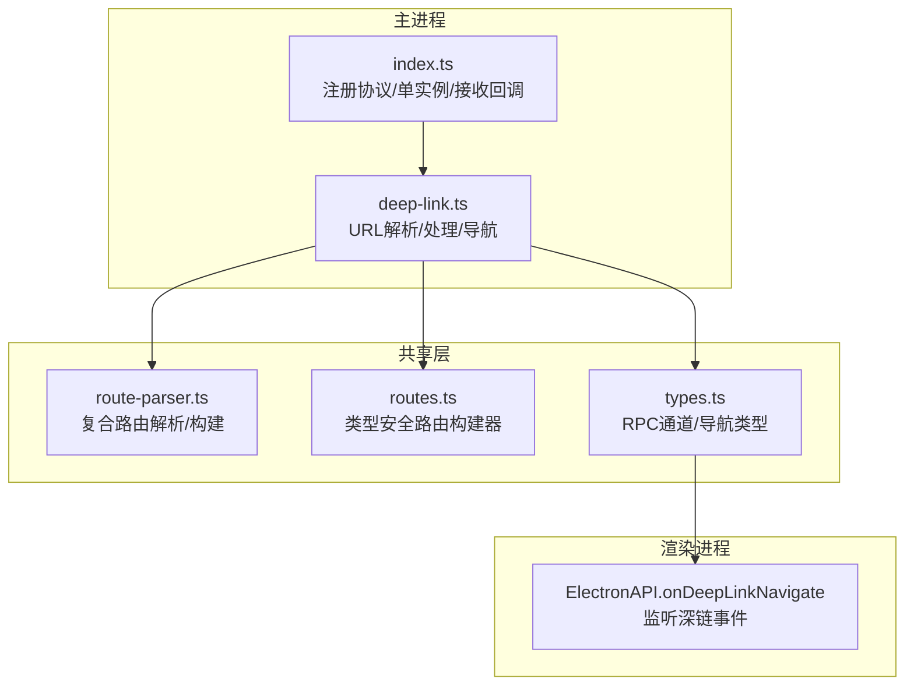
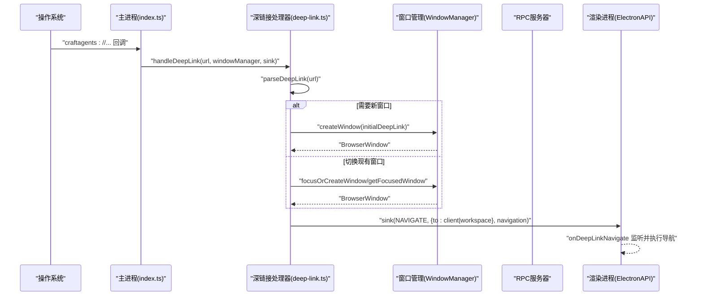
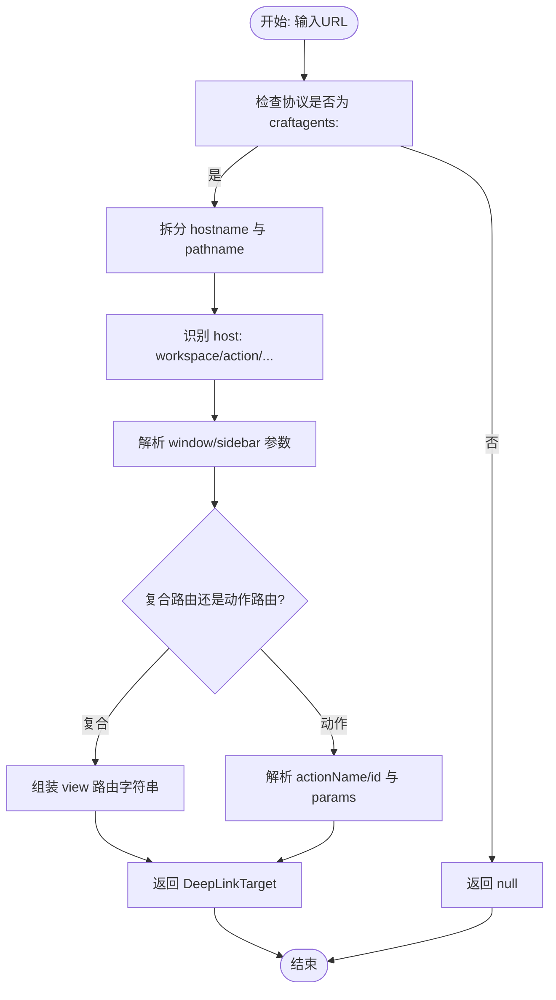
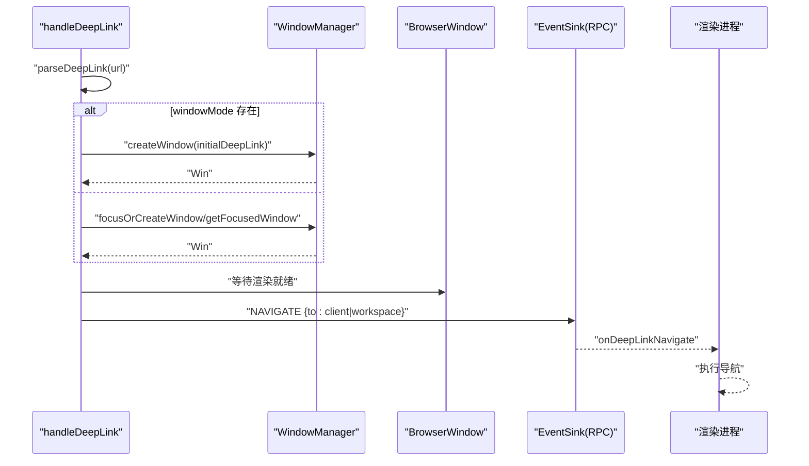
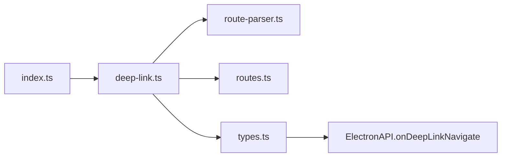

# 深链接系统

<cite>
**本文引用的文件**
- [apps/electron/src/main/deep-link.ts](file://apps/electron/src/main/deep-link.ts)
- [apps/electron/src/main/index.ts](file://apps/electron/src/main/index.ts)
- [apps/electron/src/shared/route-parser.ts](file://apps/electron/src/shared/route-parser.ts)
- [apps/electron/src/shared/routes.ts](file://apps/electron/src/shared/routes.ts)
- [apps/electron/src/shared/types.ts](file://apps/electron/src/shared/types.ts)
- [apps/electron/src/main/__tests__/deep-link-routing.test.ts](file://apps/electron/src/main/__tests__/deep-link-routing.test.ts)
</cite>

## 目录

1. [简介](#简介)
2. [项目结构](#项目结构)
3. [核心组件](#核心组件)
4. [架构总览](#架构总览)
5. [详细组件分析](#详细组件分析)
6. [依赖关系分析](#依赖关系分析)
7. [性能考量](#性能考量)
8. [故障排查指南](#故障排查指南)
9. [结论](#结论)
10. [附录](#附录)

## 简介

本文件系统性阐述 Craft Agents 的深链接（Deep Link）系统：包括 URL 协议定义、解析机制、路由处理流程、跨平台支持（macOS、Windows、Linux）、参数传递与状态恢复、与外部应用集成、单实例控制、URL 安全验证，以及常见问题的诊断与修复方案。文档面向初学者与有经验的开发者，既提供高层概览，也给出代码级细节与可视化图示。

## 项目结构

深链接系统主要由以下模块构成：

- 主进程入口负责注册自定义协议、接收系统回调、单实例锁与后续处理
- 深链接解析器负责将 craftagents:// URL 解析为内部目标对象
- 路由解析器与路由构建器负责复合视图路由与导航状态转换
- 类型系统统一了深链导航载荷与 RPC 通道
- 测试用例覆盖关键路由行为与客户端解析优先级

图表来源

- [apps/electron/src/main/index.ts](file://apps/electron/src/main/index.ts#L167-L240)
- [apps/electron/src/main/deep-link.ts](file://apps/electron/src/main/deep-link.ts#L95-L200)
- [apps/electron/src/shared/route-parser.ts](file://apps/electron/src/shared/route-parser.ts#L60-L252)
- [apps/electron/src/shared/routes.ts](file://apps/electron/src/shared/routes.ts#L34-L184)
- [apps/electron/src/shared/types.ts](file://apps/electron/src/shared/types.ts#L199-L311)

章节来源

- [apps/electron/src/main/index.ts](file://apps/electron/src/main/index.ts#L167-L240)
- [apps/electron/src/main/deep-link.ts](file://apps/electron/src/main/deep-link.ts#L95-L200)
- [apps/electron/src/shared/route-parser.ts](file://apps/electron/src/shared/route-parser.ts#L60-L252)
- [apps/electron/src/shared/routes.ts](file://apps/electron/src/shared/routes.ts#L34-L184)
- [apps/electron/src/shared/types.ts](file://apps/electron/src/shared/types.ts#L199-L311)

## 核心组件

- 自定义协议与单实例控制
  - 注册 craftagents:// 协议（开发/生产模式分别设置）
  - macOS 使用 open-url 接收深链；Windows/Linux 使用 second-instance 并从命令行提取
  - 冷启动时缓存深链，待初始化完成后处理
- 深链接解析器
  - 支持复合视图路由与动作路由
  - 支持工作区定向、窗口模式（新建窗口）、右侧侧栏参数
  - 返回结构化目标对象，供主进程调度
- 路由解析与构建
  - 复合路由解析：allSessions、flagged、state、label、view、sources、skills、automations、settings
  - 右侧侧栏参数解析与构建
  - 导航状态与复合路由互转
- RPC 通道与渲染进程交互
  - 通过 RPC 发送 NAVIGATE 事件到指定客户端或工作区
  - 渲染进程通过 ElectronAPI.onDeepLinkNavigate 监听并执行导航

章节来源

- [apps/electron/src/main/index.ts](file://apps/electron/src/main/index.ts#L167-L240)
- [apps/electron/src/main/deep-link.ts](file://apps/electron/src/main/deep-link.ts#L95-L200)
- [apps/electron/src/shared/route-parser.ts](file://apps/electron/src/shared/route-parser.ts#L60-L252)
- [apps/electron/src/shared/types.ts](file://apps/electron/src/shared/types.ts#L199-L311)

## 架构总览

深链接从操作系统进入主进程，经过解析与调度后，通过 RPC 将导航指令发送至渲染进程，最终在渲染进程中完成 UI 状态更新与页面跳转。

图表来源

- [apps/electron/src/main/index.ts](file://apps/electron/src/main/index.ts#L201-L240)
- [apps/electron/src/main/deep-link.ts](file://apps/electron/src/main/deep-link.ts#L235-L342)
- [apps/electron/src/shared/types.ts](file://apps/electron/src/shared/types.ts#L199-L311)

## 详细组件分析

### URL 协议与格式规范

- 协议名：craftagents（可通过环境变量动态配置）
- 支持两类路由：
  - 复合视图路由：如 allSessions、flagged、state/{stateId}、label/{labelId}、view/{viewId}、sources、skills、automations、settings
  - 动作路由：action/{actionName}[/{id}][?params]
- 工作区定向：workspace/{workspaceId}/... 或 craftagents://action/...（无工作区时使用当前活动窗口）
- 参数：
  - window=focused|full：强制在新窗口打开
  - sidebar=files|history|none：控制右侧侧栏
  - 其他查询参数作为 action 的 actionParams 透传

章节来源

- [apps/electron/src/main/deep-link.ts](file://apps/electron/src/main/deep-link.ts#L6-L35)
- [apps/electron/src/main/deep-link.ts](file://apps/electron/src/main/deep-link.ts#L95-L200)

### 深链接解析机制

- 解析步骤
  - 校验协议头 craftagents:
  - 提取 hostname 与 pathname，识别复合路由前缀或特殊主机名（workspace、action、auth-callback）
  - 解析 window 与 sidebar 查询参数
  - 组装 DeepLinkTarget 对象（workspaceId、view、action、actionParams、windowMode、rightSidebar）
- 错误处理
  - 非 craftagents 协议直接返回空
  - 解析异常记录日志并返回空
  - auth-callback 返回空以交由其他处理器处理

图表来源

- [apps/electron/src/main/deep-link.ts](file://apps/electron/src/main/deep-link.ts#L95-L200)

章节来源

- [apps/electron/src/main/deep-link.ts](file://apps/electron/src/main/deep-link.ts#L95-L200)

### 路由处理与导航

- 新窗口模式
  - 若携带 window=focused/full，则根据当前焦点或首个窗口推断工作区，创建新窗口并传入初始深链 URL
- 现有窗口模式
  - 若指定工作区，聚焦或创建对应工作区窗口；否则使用当前焦点或最近活跃窗口
  - 等待窗口渲染就绪（did-finish-load 后延时确保监听器已注册）
  - 通过 RPC 发送 NAVIGATE 事件，目标可为特定客户端或工作区
- 客户端解析优先级
  - 优先使用 resolveClientId 解析出的目标客户端
  - 若未提供解析器，则回退到 preferredClientId
  - 若解析失败则回退到按工作区广播

图表来源

- [apps/electron/src/main/deep-link.ts](file://apps/electron/src/main/deep-link.ts#L235-L342)

章节来源

- [apps/electron/src/main/deep-link.ts](file://apps/electron/src/main/deep-link.ts#L235-L342)
- [apps/electron/src/main/**tests**/deep-link-routing.test.ts](file://apps/electron/src/main/__tests__/deep-link-routing.test.ts#L22-L104)

### 跨平台深链接支持

- macOS
  - 通过 app.on('open-url') 接收深链回调
  - Dock 点击激活时重建窗口
- Windows/Linux
  - 通过 app.requestSingleInstanceLock() 实现单实例
  - 第二实例通过 app.on('second-instance') 从命令行参数提取深链
  - 若无深链则仅聚焦第一个窗口

章节来源

- [apps/electron/src/main/index.ts](file://apps/electron/src/main/index.ts#L201-L240)

### 参数传递与状态恢复

- 查询参数
  - window：控制是否在新窗口打开
  - sidebar：控制右侧侧栏（files/history/none）
  - 其他参数作为 actionParams 透传给渲染进程
- 状态恢复
  - 复合路由解析为 NavigationState，支持右侧侧栏参数
  - 路由构建器可将 NavigationState 还原为 URL 字符串

章节来源

- [apps/electron/src/main/deep-link.ts](file://apps/electron/src/main/deep-link.ts#L77-L90)
- [apps/electron/src/shared/route-parser.ts](file://apps/electron/src/shared/route-parser.ts#L454-L489)
- [apps/electron/src/shared/route-parser.ts](file://apps/electron/src/shared/route-parser.ts#L737-L739)

### 与外部应用集成与单实例控制

- 外部应用可通过 craftagents:// 打开应用并触发导航
- 单实例控制确保同一时间只有一个应用实例处理深链
- 冷启动深链缓存：若应用尚未初始化，先缓存深链，初始化后再处理

章节来源

- [apps/electron/src/main/index.ts](file://apps/electron/src/main/index.ts#L167-L240)
- [apps/electron/src/main/index.ts](file://apps/electron/src/main/index.ts#L705-L710)

### URL 安全验证

- 协议校验：仅处理 craftagents: 协议
- 异常捕获：解析异常记录日志并返回空，避免崩溃
- 认证回调：auth-callback 返回空交由认证流程处理

章节来源

- [apps/electron/src/main/deep-link.ts](file://apps/electron/src/main/deep-link.ts#L95-L200)

## 依赖关系分析

深链接系统的关键依赖关系如下：

图表来源

- [apps/electron/src/main/index.ts](file://apps/electron/src/main/index.ts#L89-L90)
- [apps/electron/src/main/deep-link.ts](file://apps/electron/src/main/deep-link.ts#L37-L41)
- [apps/electron/src/shared/route-parser.ts](file://apps/electron/src/shared/route-parser.ts#L12-L19)
- [apps/electron/src/shared/routes.ts](file://apps/electron/src/shared/routes.ts#L18-L26)
- [apps/electron/src/shared/types.ts](file://apps/electron/src/shared/types.ts#L199-L203)

章节来源

- [apps/electron/src/main/index.ts](file://apps/electron/src/main/index.ts#L89-L90)
- [apps/electron/src/main/deep-link.ts](file://apps/electron/src/main/deep-link.ts#L37-L41)
- [apps/electron/src/shared/route-parser.ts](file://apps/electron/src/shared/route-parser.ts#L12-L19)
- [apps/electron/src/shared/routes.ts](file://apps/electron/src/shared/routes.ts#L18-L26)
- [apps/electron/src/shared/types.ts](file://apps/electron/src/shared/types.ts#L199-L203)

## 性能考量

- 渲染就绪等待：在 did-finish-load 后延时约 100ms，确保 React 生命周期与 IPC 监听器已注册，避免首次深链导航失败
- 新窗口创建：在 windowMode 下，先移除 window 查询参数再传入新窗口，减少不必要的参数干扰
- 客户端解析优先级：优先解析目标客户端，避免广播到整个工作区造成不必要负载

章节来源

- [apps/electron/src/main/deep-link.ts](file://apps/electron/src/main/deep-link.ts#L205-L221)
- [apps/electron/src/main/deep-link.ts](file://apps/electron/src/main/deep-link.ts#L281-L289)
- [apps/electron/src/main/deep-link.ts](file://apps/electron/src/main/deep-link.ts#L327-L339)

## 故障排查指南

- 常见问题与解决方案
  - 链接无效或解析失败
    - 确认协议为 craftagents:
    - 检查 URL 是否包含合法复合路由或动作路由
    - 查看主进程日志中 "[DeepLink] Failed to parse URL" 条目
  - 无法导航到目标窗口
    - 确认存在可用工作区；若无工作区，将无法创建新窗口
    - 检查 windowMode 参数是否正确
  - 参数解析错误
    - window 仅支持 focused|full
    - sidebar 仅支持 files|history|none
    - 其他查询参数会透传为 actionParams，注意键值合法性
  - 路由冲突
    - 复合路由与动作路由不可混用
    - 确保路径段与查询参数符合规范
  - 单实例与冷启动
    - Windows/Linux：确认 second-instance 回调能从命令行提取到 URL
    - 冷启动：确认 pendingDeepLink 在初始化后被处理

章节来源

- [apps/electron/src/main/deep-link.ts](file://apps/electron/src/main/deep-link.ts#L195-L200)
- [apps/electron/src/main/deep-link.ts](file://apps/electron/src/main/deep-link.ts#L254-L279)
- [apps/electron/src/main/index.ts](file://apps/electron/src/main/index.ts#L216-L240)
- [apps/electron/src/main/index.ts](file://apps/electron/src/main/index.ts#L705-L710)

## 结论

Craft Agents 的深链接系统通过清晰的协议定义、稳健的解析与调度、完善的跨平台支持与参数传递机制，实现了从外部应用到应用内导航的完整闭环。其设计兼顾易用性与扩展性，既满足初学者快速上手，也为高级用户提供了灵活的定制空间。

## 附录

- 关键接口与类型
  - DeepLinkTarget/DeepLinkNavigation：深链目标与导航载荷
  - RPC_CHANNELS.deeplink.NAVIGATE：深链导航 RPC 通道
  - 右侧侧栏参数解析/构建：files/path、history、none
- 路由构建器
  - routes.action/routes.view：类型安全的路由构建器，便于在代码中生成标准 URL

章节来源

- [apps/electron/src/shared/types.ts](file://apps/electron/src/shared/types.ts#L199-L311)
- [apps/electron/src/shared/route-parser.ts](file://apps/electron/src/shared/route-parser.ts#L745-L787)
- [apps/electron/src/shared/routes.ts](file://apps/electron/src/shared/routes.ts#L34-L184)
