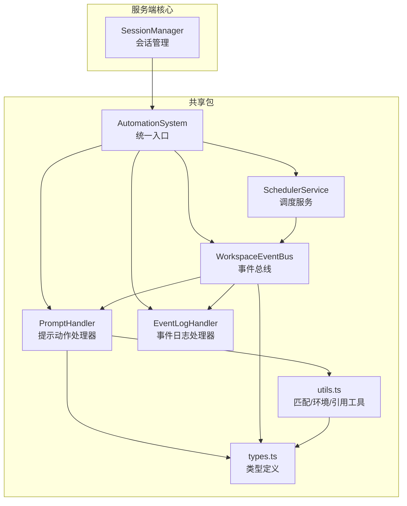
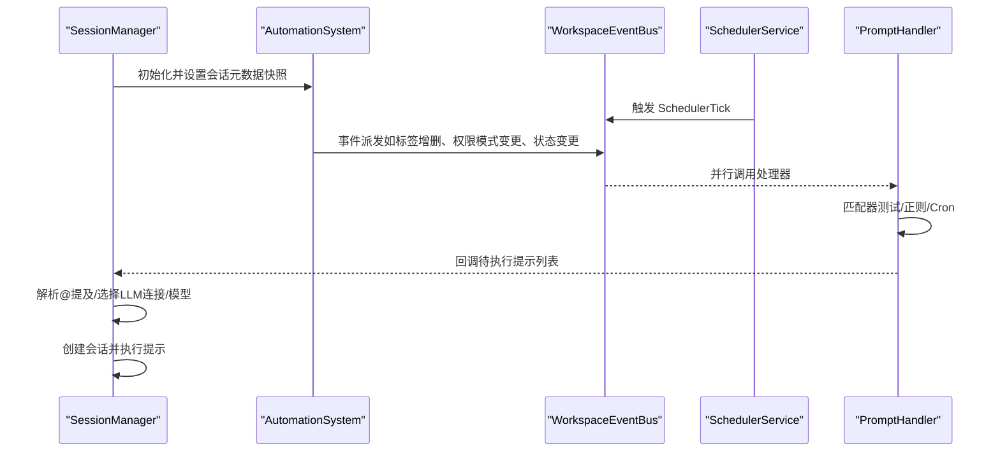
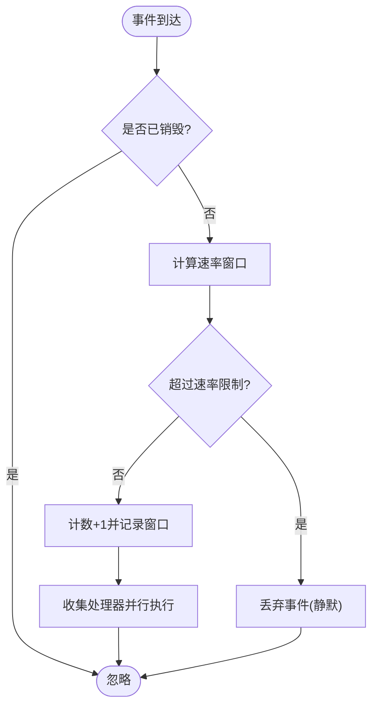
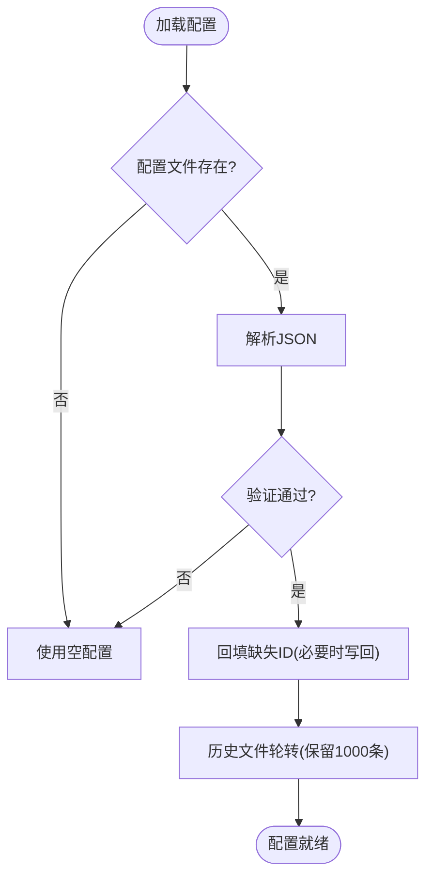
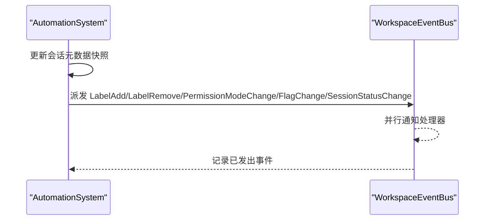
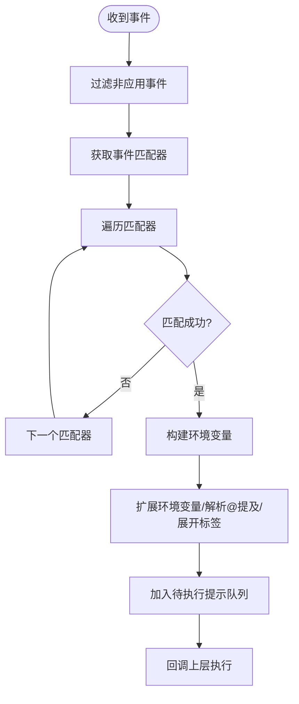
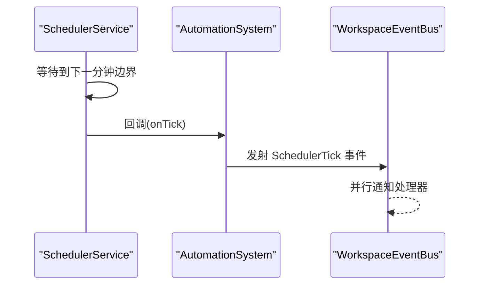
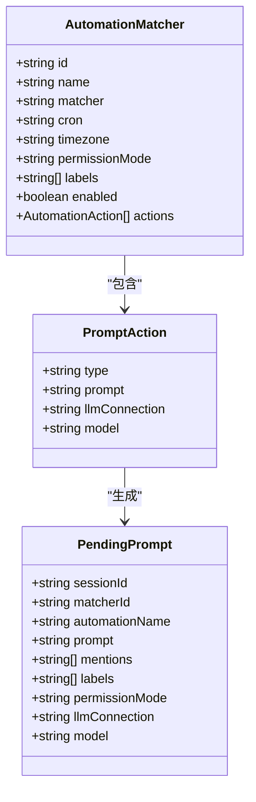
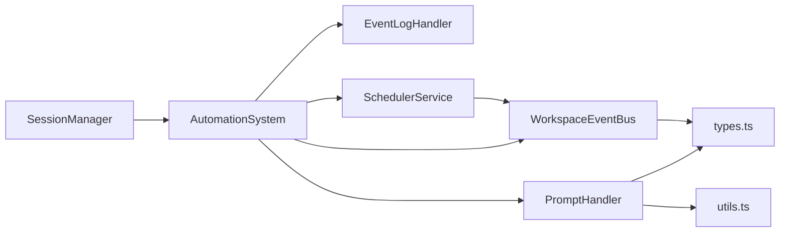

# 自动化系统

<cite>
**本文引用的文件**   
- [packages/shared/src/automations/automation-system.ts](file://packages/shared/src/automations/automation-system.ts)
- [packages/shared/src/automations/event-bus.ts](file://packages/shared/src/automations/event-bus.ts)
- [packages/shared/src/automations/handlers/prompt-handler.ts](file://packages/shared/src/automations/handlers/prompt-handler.ts)
- [packages/shared/src/automations/types.ts](file://packages/shared/src/automations/types.ts)
- [packages/shared/src/automations/utils.ts](file://packages/shared/src/automations/utils.ts)
- [packages/shared/src/scheduler/scheduler-service.ts](file://packages/shared/src/scheduler/scheduler-service.ts)
- [packages/shared/src/automations/handlers/event-log-handler.ts](file://packages/shared/src/automations/handlers/event-log-handler.ts)
- [packages/shared/src/automations/constants.ts](file://packages/shared/src/automations/constants.ts)
- [packages/shared/src/automations/validation.ts](file://packages/shared/src/automations/validation.ts)
- [packages/shared/src/automations/name-utils.ts](file://packages/shared/src/automations/name-utils.ts)
- [packages/shared/src/automations/security.ts](file://packages/shared/src/automations/security.ts)
- [packages/shared/src/automations/resolve-config-path.ts](file://packages/shared/src/automations/resolve-config-path.ts)
- [packages/server-core/src/sessions/SessionManager.ts](file://packages/server-core/src/sessions/SessionManager.ts)
- [apps/electron/resources/docs/automations.md](file://apps/electron/resources/docs/automations.md)
- [README.md](file://README.md)
</cite>

## 目录

1. [简介](#简介)
2. [项目结构](#项目结构)
3. [核心组件](#核心组件)
4. [架构总览](#架构总览)
5. [详细组件分析](#详细组件分析)
6. [依赖关系分析](#依赖关系分析)
7. [性能考量](#性能考量)
8. [故障排查指南](#故障排查指南)
9. [结论](#结论)
10. [附录](#附录)

## 简介

本文件面向 Craft Agents 的自动化系统，围绕事件驱动架构、自动化规则引擎与调度系统实现进行深入解析。内容涵盖自动化事件监听、条件判断、动作执行的完整流程，并解释与会话事件、定时任务、外部工具集成的关系。同时提供事件风暴、循环触发、性能瓶颈等常见问题的解决方案，帮助初学者快速上手，也为有经验的开发者提供足够的技术深度。

## 项目结构

自动化系统位于共享包中，采用“配置驱动 + 事件总线 + 处理器”的分层设计：

- 配置层：读取并校验工作区内的 automations.json
- 事件层：WorkspaceEventBus 提供类型安全的事件总线，支持速率限制与并行处理
- 处理层：处理器订阅事件并执行动作（当前以提示类动作为主）
- 调度层：SchedulerService 按分钟边界对齐产生 SchedulerTick 事件
- 工具层：匹配器、环境变量扩展、引用解析、安全清洗等通用工具

图表来源

- [packages/shared/src/automations/automation-system.ts](file://packages/shared/src/automations/automation-system.ts#L63-L92)
- [packages/shared/src/automations/event-bus.ts](file://packages/shared/src/automations/event-bus.ts#L161-L171)
- [packages/shared/src/automations/handlers/prompt-handler.ts](file://packages/shared/src/automations/handlers/prompt-handler.ts#L21-L40)
- [packages/shared/src/scheduler/scheduler-service.ts](file://packages/shared/src/scheduler/scheduler-service.ts#L23-L44)
- [packages/server-core/src/sessions/SessionManager.ts](file://packages/server-core/src/sessions/SessionManager.ts#L1422-L1431)

章节来源

- [packages/shared/src/automations/automation-system.ts](file://packages/shared/src/automations/automation-system.ts#L1-L92)
- [packages/shared/src/automations/event-bus.ts](file://packages/shared/src/automations/event-bus.ts#L1-L171)
- [packages/shared/src/automations/handlers/prompt-handler.ts](file://packages/shared/src/automations/handlers/prompt-handler.ts#L1-L40)
- [packages/shared/src/scheduler/scheduler-service.ts](file://packages/shared/src/scheduler/scheduler-service.ts#L1-L44)
- [packages/server-core/src/sessions/SessionManager.ts](file://packages/server-core/src/sessions/SessionManager.ts#L1412-L1431)

## 核心组件

- AutomationSystem：自动化系统统一入口，负责加载配置、创建处理器、启动调度器、维护会话元数据快照、派发事件
- WorkspaceEventBus：按事件类型分发，支持任意处理器订阅；内置速率限制，防止事件风暴
- PromptHandler：订阅应用事件，收集匹配的提示动作，构建待执行提示并回调上层执行
- EventLogHandler：记录自动化历史与事件丢失情况
- SchedulerService：每分钟对齐触发，向事件总线广播 SchedulerTick
- 类型与工具：定义事件、动作、匹配器等类型，以及匹配、环境变量扩展、引用解析、安全清洗等工具

章节来源

- [packages/shared/src/automations/automation-system.ts](file://packages/shared/src/automations/automation-system.ts#L63-L92)
- [packages/shared/src/automations/event-bus.ts](file://packages/shared/src/automations/event-bus.ts#L161-L171)
- [packages/shared/src/automations/handlers/prompt-handler.ts](file://packages/shared/src/automations/handlers/prompt-handler.ts#L21-L40)
- [packages/shared/src/automations/handlers/event-log-handler.ts](file://packages/shared/src/automations/handlers/event-log-handler.ts)
- [packages/shared/src/scheduler/scheduler-service.ts](file://packages/shared/src/scheduler/scheduler-service.ts#L23-L44)
- [packages/shared/src/automations/types.ts](file://packages/shared/src/automations/types.ts#L11-L48)

## 架构总览

自动化系统通过事件驱动实现解耦：配置变更由 AutomationSystem 加载并注册处理器；事件由调度器或会话状态变化产生；处理器根据匹配器规则筛选动作并生成待执行提示；最终由上层会话管理器创建新会话执行提示。

图表来源

- [packages/server-core/src/sessions/SessionManager.ts](file://packages/server-core/src/sessions/SessionManager.ts#L1422-L1431)
- [packages/shared/src/automations/automation-system.ts](file://packages/shared/src/automations/automation-system.ts#L283-L294)
- [packages/shared/src/automations/event-bus.ts](file://packages/shared/src/automations/event-bus.ts#L177-L228)
- [packages/shared/src/automations/handlers/prompt-handler.ts](file://packages/shared/src/automations/handlers/prompt-handler.ts#L45-L117)

## 详细组件分析

### 事件总线与速率限制

- 事件总线按事件类型分发，支持 onAny 全局监听，所有处理器并行执行，异常被捕获并记录
- 速率限制策略：
  - SchedulerTick：每分钟最多 60 次
  - 其他事件：每分钟最多 10 次
- 当超过阈值时，事件在该分钟窗口内被静默丢弃，避免事件风暴与循环触发

图表来源

- [packages/shared/src/automations/event-bus.ts](file://packages/shared/src/automations/event-bus.ts#L177-L228)
- [packages/shared/src/automations/event-bus.ts](file://packages/shared/src/automations/event-bus.ts#L120-L131)

章节来源

- [packages/shared/src/automations/event-bus.ts](file://packages/shared/src/automations/event-bus.ts#L120-L131)
- [packages/shared/src/automations/event-bus.ts](file://packages/shared/src/automations/event-bus.ts#L177-L228)

### 自动化系统与配置加载

- 从工作区路径解析 automations.json，读取并验证配置
- 若配置无效或缺失，系统回退为空配置，保证稳定性
- 启动时自动回填匹配器 ID，写回磁盘确保后续一致性
- 历史文件轮转，仅保留最近 1000 条记录

图表来源

- [packages/shared/src/automations/automation-system.ts](file://packages/shared/src/automations/automation-system.ts#L111-L139)
- [packages/shared/src/automations/automation-system.ts](file://packages/shared/src/automations/automation-system.ts#L176-L197)
- [packages/shared/src/automations/automation-system.ts](file://packages/shared/src/automations/automation-system.ts#L203-L217)

章节来源

- [packages/shared/src/automations/automation-system.ts](file://packages/shared/src/automations/automation-system.ts#L111-L139)
- [packages/shared/src/automations/automation-system.ts](file://packages/shared/src/automations/automation-system.ts#L176-L197)
- [packages/shared/src/automations/automation-system.ts](file://packages/shared/src/automations/automation-system.ts#L203-L217)

### 会话元数据差异与事件派发

- AutomationSystem 维护每个会话的元数据快照，当字段变化时派发相应事件
- 支持的事件包括：标签新增/移除、权限模式变更、标志位变更、会话状态变更
- 派发前会去重并记录发出的事件列表，便于调试与审计

图表来源

- [packages/shared/src/automations/automation-system.ts](file://packages/shared/src/automations/automation-system.ts#L321-L410)

章节来源

- [packages/shared/src/automations/automation-system.ts](file://packages/shared/src/automations/automation-system.ts#L321-L410)

### 提示动作处理器

- PromptHandler 订阅任意事件，仅处理应用事件（AppEvent）
- 对每个匹配的自动化匹配器，构建环境变量、扩展环境变量、解析 @提及、合并标签与权限模式
- 将待执行提示列表通过回调返回给上层，由会话管理器创建并执行新会话

图表来源

- [packages/shared/src/automations/handlers/prompt-handler.ts](file://packages/shared/src/automations/handlers/prompt-handler.ts#L45-L117)
- [packages/shared/src/automations/utils.ts](file://packages/shared/src/automations/utils.ts#L178-L214)

章节来源

- [packages/shared/src/automations/handlers/prompt-handler.ts](file://packages/shared/src/automations/handlers/prompt-handler.ts#L45-L117)
- [packages/shared/src/automations/utils.ts](file://packages/shared/src/automations/utils.ts#L178-L214)

### 调度系统

- SchedulerService 在每分钟边界对齐启动，随后每 60 秒触发一次
- 事件负载包含本地时间、UTC 时间、小时、分钟、星期几与星期名
- AutomationSystem 将调度事件转换为 WorkspaceEventBus 的 SchedulerTick 事件

图表来源

- [packages/shared/src/scheduler/scheduler-service.ts](file://packages/shared/src/scheduler/scheduler-service.ts#L32-L78)
- [packages/shared/src/automations/automation-system.ts](file://packages/shared/src/automations/automation-system.ts#L283-L294)

章节来源

- [packages/shared/src/scheduler/scheduler-service.ts](file://packages/shared/src/scheduler/scheduler-service.ts#L32-L78)
- [packages/shared/src/automations/automation-system.ts](file://packages/shared/src/automations/automation-system.ts#L283-L294)

### 类型与匹配逻辑

- 事件分为应用事件（AppEvent）与代理事件（AgentEvent），后者用于 Claude SDK 钩子
- 匹配器支持：
  - 正则匹配（LabelAdd/Remove/PermissionModeChange/FlagChange/SessionStatusChange）
  - Cron 表达式匹配（SchedulerTick）
- 环境变量构建与扩展：
  - 自动注入事件名、事件数据、会话元信息、本地时间等
  - 对用户可控值进行安全清洗，避免注入风险

图表来源

- [packages/shared/src/automations/types.ts](file://packages/shared/src/automations/types.ts#L66-L84)
- [packages/shared/src/automations/types.ts](file://packages/shared/src/automations/types.ts#L54-L62)
- [packages/shared/src/automations/types.ts](file://packages/shared/src/automations/types.ts#L117-L139)

章节来源

- [packages/shared/src/automations/types.ts](file://packages/shared/src/automations/types.ts#L11-L48)
- [packages/shared/src/automations/types.ts](file://packages/shared/src/automations/types.ts#L66-L84)
- [packages/shared/src/automations/utils.ts](file://packages/shared/src/automations/utils.ts#L139-L157)

### 与会话事件、定时任务、外部工具集成

- 会话事件：权限模式变更、标签增删、标志位变更、状态变更均由 AutomationSystem 维护快照并派发事件
- 定时任务：SchedulerService 产生 SchedulerTick，配合 Cron 匹配器实现周期性触发
- 外部工具集成：PromptHandler 生成的待执行提示可包含 @提及，由 SessionManager 解析为源或技能标识后执行

章节来源

- [packages/shared/src/automations/automation-system.ts](file://packages/shared/src/automations/automation-system.ts#L332-L400)
- [packages/shared/src/scheduler/scheduler-service.ts](file://packages/shared/src/scheduler/scheduler-service.ts#L57-L78)
- [packages/server-core/src/sessions/SessionManager.ts](file://packages/server-core/src/sessions/SessionManager.ts#L5792-L5809)

## 依赖关系分析

- AutomationSystem 依赖 WorkspaceEventBus、PromptHandler、EventLogHandler、SchedulerService
- PromptHandler 依赖类型定义与工具函数（匹配、环境变量、引用解析）
- WorkspaceEventBus 依赖类型定义与日志工具
- SchedulerService 与事件总线解耦，通过回调注入事件负载
- SessionManager 与 AutomationSystem 协作，初始化/清理会话元数据快照，并解析提示中的 @提及

图表来源

- [packages/shared/src/automations/automation-system.ts](file://packages/shared/src/automations/automation-system.ts#L63-L92)
- [packages/shared/src/automations/handlers/prompt-handler.ts](file://packages/shared/src/automations/handlers/prompt-handler.ts#L21-L40)
- [packages/shared/src/automations/event-bus.ts](file://packages/shared/src/automations/event-bus.ts#L161-L171)
- [packages/shared/src/scheduler/scheduler-service.ts](file://packages/shared/src/scheduler/scheduler-service.ts#L23-L44)
- [packages/server-core/src/sessions/SessionManager.ts](file://packages/server-core/src/sessions/SessionManager.ts#L1422-L1431)

章节来源

- [packages/shared/src/automations/automation-system.ts](file://packages/shared/src/automations/automation-system.ts#L63-L92)
- [packages/shared/src/automations/handlers/prompt-handler.ts](file://packages/shared/src/automations/handlers/prompt-handler.ts#L21-L40)
- [packages/shared/src/automations/event-bus.ts](file://packages/shared/src/automations/event-bus.ts#L161-L171)
- [packages/shared/src/scheduler/scheduler-service.ts](file://packages/shared/src/scheduler/scheduler-service.ts#L23-L44)
- [packages/server-core/src/sessions/SessionManager.ts](file://packages/server-core/src/sessions/SessionManager.ts#L1422-L1431)

## 性能考量

- 事件并行处理：事件总线对同一事件的所有处理器并行调用，提升吞吐
- 速率限制：每类事件每分钟上限，防止事件风暴导致资源耗尽
- 配置加载与历史轮转：同步执行，避免并发竞争；仅在启动时运行
- 环境变量与引用解析：在处理器内部完成，避免重复计算
- 调度对齐：每分钟边界启动，减少抖动与不一致

章节来源

- [packages/shared/src/automations/event-bus.ts](file://packages/shared/src/automations/event-bus.ts#L207-L225)
- [packages/shared/src/automations/event-bus.ts](file://packages/shared/src/automations/event-bus.ts#L120-L131)
- [packages/shared/src/automations/automation-system.ts](file://packages/shared/src/automations/automation-system.ts#L203-L217)
- [packages/shared/src/scheduler/scheduler-service.ts](file://packages/shared/src/scheduler/scheduler-service.ts#L35-L44)

## 故障排查指南

- 自动化未触发
  - 检查事件名称大小写与拼写（如 LabelAdd）
  - 检查正则或 Cron 是否正确，使用在线工具验证 Cron
  - 查看日志中 [automations] 或 [Scheduler] 关键字定位问题
- 提示未创建会话
  - 确认提示文本非空且 @提及指向有效源或技能
  - 检查 LLM 连接与模型配置是否可用
- 循环触发与事件风暴
  - 利用速率限制机制：SchedulerTick 默认 60/min，其他事件默认 10/min
  - 通过 onEventLost 回调与 EventLogHandler 记录事件丢失情况
- 配置错误
  - 使用 config_validate 或在编辑器中使用 JSON 校验
  - 常见错误：未知事件名、空动作数组、无效 Cron/正则、不安全正则

章节来源

- [apps/electron/resources/docs/automations.md](file://apps/electron/resources/docs/automations.md#L324-L336)
- [packages/shared/src/automations/handlers/event-log-handler.ts](file://packages/shared/src/automations/handlers/event-log-handler.ts)
- [packages/shared/src/automations/automation-system.ts](file://packages/shared/src/automations/automation-system.ts#L145-L169)

## 结论

Craft Agents 的自动化系统通过“配置 + 事件总线 + 处理器 + 调度”的清晰分层，实现了高内聚、低耦合的事件驱动自动化能力。其速率限制与历史轮转等机制有效缓解了事件风暴与性能瓶颈；PromptHandler 将复杂的匹配与环境变量扩展抽象为统一的待执行提示，便于上层统一调度与执行。结合会话元数据快照与调度 Tick，系统能够灵活地响应会话生命周期与周期性任务需求。

## 附录

- 配置参考与示例：参见工作区 automations.json 与官方文档
- 事件与动作类型：参见类型定义与工具函数
- 安全与合规：环境变量扩展与 Shell 清洗，避免注入风险

章节来源

- [README.md](file://README.md#L507-L549)
- [apps/electron/resources/docs/automations.md](file://apps/electron/resources/docs/automations.md#L20-L37)
- [packages/shared/src/automations/types.ts](file://packages/shared/src/automations/types.ts#L11-L48)
- [packages/shared/src/automations/utils.ts](file://packages/shared/src/automations/utils.ts#L178-L214)
