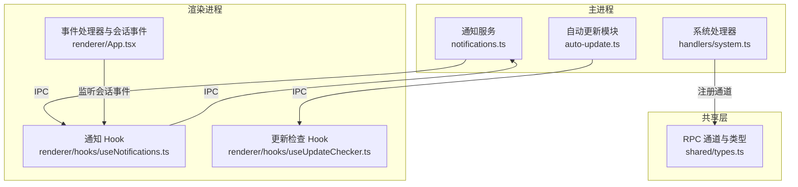
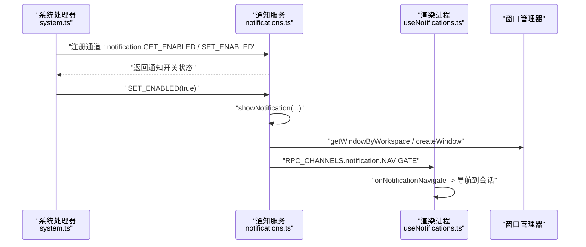
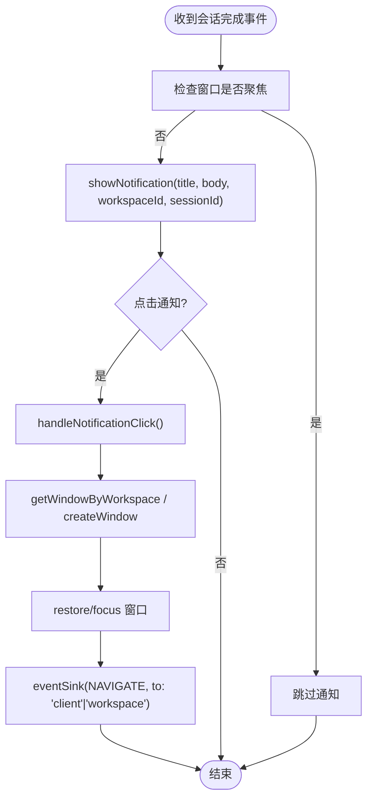
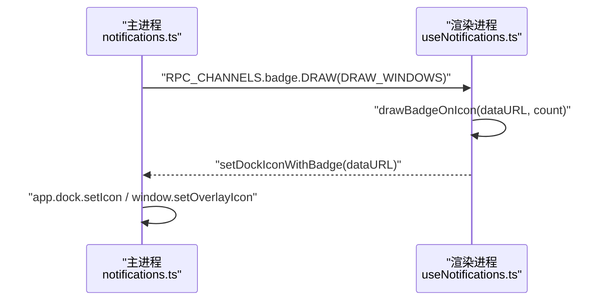
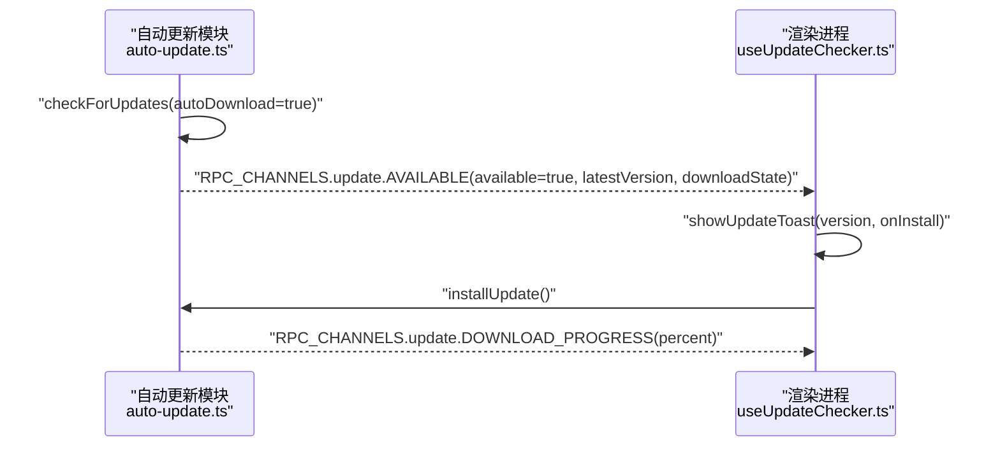
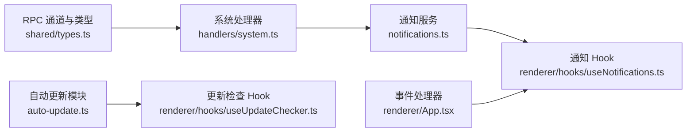

# 通知服务

<cite>
**本文引用的文件**
- [apps/electron/src/main/notifications.ts](file://apps/electron/src/main/notifications.ts)
- [apps/electron/src/main/auto-update.ts](file://apps/electron/src/main/auto-update.ts)
- [apps/electron/src/renderer/hooks/useNotifications.ts](file://apps/electron/src/renderer/hooks/useNotifications.ts)
- [apps/electron/src/renderer/hooks/useUpdateChecker.ts](file://apps/electron/src/renderer/hooks/useUpdateChecker.ts)
- [apps/electron/src/main/handlers/system.ts](file://apps/electron/src/main/handlers/system.ts)
- [apps/electron/src/shared/types.ts](file://apps/electron/src/shared/types.ts)
- [apps/electron/src/renderer/App.tsx](file://apps/electron/src/renderer/App.tsx)
- [apps/electron/src/main/__tests__/notifications-routing.test.ts](file://apps/electron/src/main/__tests__/notifications-routing.test.ts)
</cite>

## 目录

1. [简介](#简介)
2. [项目结构](#项目结构)
3. [核心组件](#核心组件)
4. [架构总览](#架构总览)
5. [组件详解](#组件详解)
6. [依赖关系分析](#依赖关系分析)
7. [性能考量](#性能考量)
8. [故障排查指南](#故障排查指南)
9. [结论](#结论)
10. [附录](#附录)

## 简介

本文件为 Craft Agents 通知服务的技术文档，覆盖以下方面：

- 系统通知：当应用未聚焦且会话完成时，向操作系统发送原生通知，并在点击后导航到对应会话。
- 应用内通知：通过渲染进程的 Hook 在窗口未聚焦时展示轻量提示（如更新就绪的 Toast），并支持用户交互（重启、忽略）。
- 自动更新通知：基于 electron-updater 的后台下载与安装流程，结合 IPC 广播状态变化，最终以 Toast 提示用户“可重启安装”。

文档同时解释通知类型分类、显示策略、用户交互处理，以及与会话事件、系统状态、用户偏好的集成关系；并给出通知堆积、权限问题、性能影响等常见问题的解决方案。

## 项目结构

通知服务涉及主进程、渲染进程与共享协议三部分：

- 主进程负责系统级通知与徽章计数（macOS Dock 覆盖图、Windows 任务栏覆盖图、Linux 计数）。
- 渲染进程负责窗口焦点状态跟踪、徽章绘制（Canvas）、应用内通知（Toast）。
- 共享协议定义了 RPC 通道，用于主/渲染双向通信。

图表来源

- [apps/electron/src/main/notifications.ts](file://apps/electron/src/main/notifications.ts#L1-L296)
- [apps/electron/src/main/auto-update.ts](file://apps/electron/src/main/auto-update.ts#L1-L438)
- [apps/electron/src/renderer/hooks/useNotifications.ts](file://apps/electron/src/renderer/hooks/useNotifications.ts#L1-L203)
- [apps/electron/src/renderer/hooks/useUpdateChecker.ts](file://apps/electron/src/renderer/hooks/useUpdateChecker.ts#L1-L155)
- [apps/electron/src/main/handlers/system.ts](file://apps/electron/src/main/handlers/system.ts#L35-L74)
- [apps/electron/src/shared/types.ts](file://apps/electron/src/shared/types.ts#L200-L400)
- [apps/electron/src/renderer/App.tsx](file://apps/electron/src/renderer/App.tsx#L701-L731)

章节来源

- [apps/electron/src/main/notifications.ts](file://apps/electron/src/main/notifications.ts#L1-L296)
- [apps/electron/src/main/auto-update.ts](file://apps/electron/src/main/auto-update.ts#L1-L438)
- [apps/electron/src/renderer/hooks/useNotifications.ts](file://apps/electron/src/renderer/hooks/useNotifications.ts#L1-L203)
- [apps/electron/src/renderer/hooks/useUpdateChecker.ts](file://apps/electron/src/renderer/hooks/useUpdateChecker.ts#L1-L155)
- [apps/electron/src/main/handlers/system.ts](file://apps/electron/src/main/handlers/system.ts#L35-L74)
- [apps/electron/src/shared/types.ts](file://apps/electron/src/shared/types.ts#L200-L400)
- [apps/electron/src/renderer/App.tsx](file://apps/electron/src/renderer/App.tsx#L701-L731)

## 核心组件

- 通知服务（主进程）
  - 负责：原生系统通知、徽章计数、点击导航、跨平台图标设置。
  - 关键函数：初始化、显示通知、更新徽章、设置 Dock/任务栏图标、清空徽章、检测窗口聚焦。
- 通知 Hook（渲染进程）
  - 负责：窗口聚焦状态跟踪、Canvas 绘制徽章、接收主进程徽章绘制请求、订阅导航事件。
- 自动更新模块（主进程）
  - 负责：检查/下载/安装更新、广播进度与状态、启动菜单项更新。
- 更新检查 Hook（渲染进程）
  - 负责：接收更新状态、显示 Toast、处理安装与忽略。
- 系统处理器（主进程）
  - 负责：注册 GUI 相关 RPC 通道（含通知开关、徽章刷新、窗口聚焦查询）。
- 共享类型（共享层）
  - 负责：统一 RPC 通道常量与类型（如 UpdateInfo）。

章节来源

- [apps/electron/src/main/notifications.ts](file://apps/electron/src/main/notifications.ts#L28-L125)
- [apps/electron/src/renderer/hooks/useNotifications.ts](file://apps/electron/src/renderer/hooks/useNotifications.ts#L1-L203)
- [apps/electron/src/main/auto-update.ts](file://apps/electron/src/main/auto-update.ts#L88-L110)
- [apps/electron/src/renderer/hooks/useUpdateChecker.ts](file://apps/electron/src/renderer/hooks/useUpdateChecker.ts#L36-L155)
- [apps/electron/src/main/handlers/system.ts](file://apps/electron/src/main/handlers/system.ts#L396-L430)
- [apps/electron/src/shared/types.ts](file://apps/electron/src/shared/types.ts#L200-L400)

## 架构总览

通知服务采用“主进程驱动 + 渲染进程协作”的模式：

- 主进程维护全局状态（窗口管理器、事件广播器、徽章计数、基础图标）。
- 渲染进程负责 UI 层交互（Toast、徽章绘制、导航回调）。
- 共享协议定义通道，确保主/渲染间可靠通信。

图表来源

- [apps/electron/src/main/handlers/system.ts](file://apps/electron/src/main/handlers/system.ts#L396-L409)
- [apps/electron/src/main/notifications.ts](file://apps/electron/src/main/notifications.ts#L54-L125)
- [apps/electron/src/renderer/hooks/useNotifications.ts](file://apps/electron/src/renderer/hooks/useNotifications.ts#L170-L179)

章节来源

- [apps/electron/src/main/handlers/system.ts](file://apps/electron/src/main/handlers/system.ts#L396-L430)
- [apps/electron/src/main/notifications.ts](file://apps/electron/src/main/notifications.ts#L54-L125)
- [apps/electron/src/renderer/hooks/useNotifications.ts](file://apps/electron/src/renderer/hooks/useNotifications.ts#L170-L179)

## 组件详解

### 系统通知（主进程）

- 功能要点
  - 原生通知：仅在平台支持时显示；点击后根据工作区与会话 ID 定位窗口并导航。
  - 徽章计数：跨平台策略不同（macOS 使用 Canvas 覆盖 Dock 图标；Windows 使用任务栏覆盖图；Linux 使用计数）。
  - 窗口聚焦：提供查询接口，避免在已聚焦时打扰用户。
- 关键流程
  - 显示通知：构造原生通知对象，绑定点击事件，调用 show。
  - 点击处理：查找或创建目标工作区窗口，恢复/聚焦，再通过事件广播器定向导航至客户端或工作区。
  - 徽章更新：按平台分支，必要时请求渲染进程绘制徽章，再由主进程设置 Dock/任务栏图标。

图表来源

- [apps/electron/src/renderer/App.tsx](file://apps/electron/src/renderer/App.tsx#L716-L727)
- [apps/electron/src/main/notifications.ts](file://apps/electron/src/main/notifications.ts#L54-L125)

章节来源

- [apps/electron/src/main/notifications.ts](file://apps/electron/src/main/notifications.ts#L54-L125)
- [apps/electron/src/renderer/App.tsx](file://apps/electron/src/renderer/App.tsx#L716-L727)

### 应用内通知（渲染进程）

- 功能要点
  - 窗口聚焦状态：通过 IPC 查询并订阅变更，避免在聚焦时弹出干扰性通知。
  - 徽章绘制：接收主进程请求，使用 Canvas 将数字叠加到图标上，再回传给主进程设置 Dock/任务栏图标。
  - 导航回调：订阅通知导航事件，执行会话跳转。
- 关键流程
  - 初始化：请求当前聚焦状态，订阅聚焦变化与徽章绘制请求。
  - 徽章绘制：Image + Canvas 绘制，生成 data URL 后回传主进程设置图标。
  - 导航：收到导航事件后，调用外部导航回调。

图表来源

- [apps/electron/src/main/notifications.ts](file://apps/electron/src/main/notifications.ts#L172-L253)
- [apps/electron/src/renderer/hooks/useNotifications.ts](file://apps/electron/src/renderer/hooks/useNotifications.ts#L18-L199)

章节来源

- [apps/electron/src/renderer/hooks/useNotifications.ts](file://apps/electron/src/renderer/hooks/useNotifications.ts#L1-L203)
- [apps/electron/src/main/notifications.ts](file://apps/electron/src/main/notifications.ts#L172-L253)

### 自动更新通知（主/渲染协同）

- 功能要点
  - 主进程：使用 electron-updater 检查、下载、安装更新；广播可用性与进度；在准备就绪时重建菜单。
  - 渲染进程：接收更新状态，显示 Toast；支持“重启”与“忽略”；忽略版本持久化。
- 关键流程
  - 检查更新：立即检查，尊重用户忽略版本；若已存在缓存文件则直接置为 ready。
  - 下载进度：持续广播进度百分比。
  - 就绪通知：当 downloadState 为 ready 且未被忽略时，显示 Toast 并提供“重启”按钮。
  - 安装：调用 quitAndInstall，自动重启并应用更新。

图表来源

- [apps/electron/src/main/auto-update.ts](file://apps/electron/src/main/auto-update.ts#L134-L221)
- [apps/electron/src/renderer/hooks/useUpdateChecker.ts](file://apps/electron/src/renderer/hooks/useUpdateChecker.ts#L41-L118)

章节来源

- [apps/electron/src/main/auto-update.ts](file://apps/electron/src/main/auto-update.ts#L134-L221)
- [apps/electron/src/renderer/hooks/useUpdateChecker.ts](file://apps/electron/src/renderer/hooks/useUpdateChecker.ts#L41-L118)

### 通知类型分类与显示策略

- 系统通知
  - 条件触发：会话完成事件 + 窗口未聚焦 + 非隐藏会话。
  - 内容预览：从最后一条助手/计划消息提取纯文本摘要。
  - 导航行为：点击后定位窗口并打开对应会话。
- 应用内通知（Toast）
  - 触发条件：更新 ready 且未被忽略。
  - 用户交互：提供“重启”与“忽略”；忽略版本持久化。
- 自动更新通知
  - 状态广播：可用性、下载进度、就绪。
  - 显示策略：仅在就绪时提示，避免重复提示同一版本。

章节来源

- [apps/electron/src/renderer/App.tsx](file://apps/electron/src/renderer/App.tsx#L716-L727)
- [apps/electron/src/renderer/hooks/useUpdateChecker.ts](file://apps/electron/src/renderer/hooks/useUpdateChecker.ts#L41-L118)
- [apps/electron/src/main/auto-update.ts](file://apps/electron/src/main/auto-update.ts#L134-L221)

### 用户交互处理

- 系统通知点击：主进程根据工作区与会话 ID 打开/聚焦窗口，并通过事件广播器定向导航。
- 应用内通知点击：渲染进程订阅导航事件，执行会话跳转。
- 更新忽略：渲染进程在 Toast 关闭时持久化忽略版本，避免重复提示。

章节来源

- [apps/electron/src/main/notifications.ts](file://apps/electron/src/main/notifications.ts#L86-L125)
- [apps/electron/src/renderer/hooks/useNotifications.ts](file://apps/electron/src/renderer/hooks/useNotifications.ts#L170-L179)
- [apps/electron/src/renderer/hooks/useUpdateChecker.ts](file://apps/electron/src/renderer/hooks/useUpdateChecker.ts#L57-L61)

### 与会话事件、系统状态、用户偏好的集成

- 会话事件
  - 仅在会话完成事件且非隐藏会话时触发系统通知。
  - 通知内容从最后一条助手/计划消息中提取纯文本摘要。
- 系统状态
  - 窗口聚焦状态：渲染进程查询并订阅变化，避免在聚焦时打扰。
  - 徽章计数：主进程根据平台差异更新 Dock/任务栏图标或计数。
- 用户偏好
  - 通知开关：系统处理器提供 GET_ENABLED/SET_ENABLED 接口，主进程在启用时主动提示。
  - 更新忽略：用户忽略特定版本后，后续不再提示该版本。

章节来源

- [apps/electron/src/renderer/App.tsx](file://apps/electron/src/renderer/App.tsx#L716-L727)
- [apps/electron/src/main/handlers/system.ts](file://apps/electron/src/main/handlers/system.ts#L396-L409)
- [apps/electron/src/renderer/hooks/useUpdateChecker.ts](file://apps/electron/src/renderer/hooks/useUpdateChecker.ts#L57-L61)

## 依赖关系分析

- 主进程依赖
  - Electron 原生模块：Notification、app、BrowserWindow、nativeImage。
  - 窗口管理器：用于按工作区查找/创建窗口。
  - 事件广播器：用于向渲染进程定向发送导航与徽章绘制请求。
- 渲染进程依赖
  - Canvas API：绘制徽章覆盖图。
  - IPC 通道：与主进程通信，订阅导航与徽章绘制事件。
- 共享层
  - RPC 通道常量：统一通道命名，保证主/渲染一致性。

图表来源

- [apps/electron/src/shared/types.ts](file://apps/electron/src/shared/types.ts#L200-L400)
- [apps/electron/src/main/handlers/system.ts](file://apps/electron/src/main/handlers/system.ts#L35-L74)
- [apps/electron/src/main/notifications.ts](file://apps/electron/src/main/notifications.ts#L10-L16)
- [apps/electron/src/renderer/hooks/useNotifications.ts](file://apps/electron/src/renderer/hooks/useNotifications.ts#L10-L12)
- [apps/electron/src/main/auto-update.ts](file://apps/electron/src/main/auto-update.ts#L29-L30)
- [apps/electron/src/renderer/hooks/useUpdateChecker.ts](file://apps/electron/src/renderer/hooks/useUpdateChecker.ts#L12-L14)
- [apps/electron/src/renderer/App.tsx](file://apps/electron/src/renderer/App.tsx#L701-L731)

章节来源

- [apps/electron/src/shared/types.ts](file://apps/electron/src/shared/types.ts#L200-L400)
- [apps/electron/src/main/notifications.ts](file://apps/electron/src/main/notifications.ts#L10-L16)
- [apps/electron/src/main/auto-update.ts](file://apps/electron/src/main/auto-update.ts#L29-L30)
- [apps/electron/src/renderer/hooks/useNotifications.ts](file://apps/electron/src/renderer/hooks/useNotifications.ts#L10-L12)
- [apps/electron/src/renderer/hooks/useUpdateChecker.ts](file://apps/electron/src/renderer/hooks/useUpdateChecker.ts#L12-L14)
- [apps/electron/src/renderer/App.tsx](file://apps/electron/src/renderer/App.tsx#L701-L731)

## 性能考量

- 通知堆积
  - 策略：仅在会话完成且窗口未聚焦时触发系统通知；避免对隐藏会话触发通知。
  - 建议：在高并发会话场景下，合并同类事件或延迟批量处理，减少频繁弹窗。
- 徽章绘制
  - 策略：macOS/Windows 通过 Canvas 绘制覆盖图，Linux 使用计数。
  - 建议：限制绘制频率（如节流/防抖），避免在短时间内多次重绘。
- 更新下载
  - 策略：后台自动下载，下载进度持续广播；就绪后才提示。
  - 建议：在计量网络环境下，手动检查时关闭自动下载，降低带宽占用。
- 窗口聚焦检测
  - 策略：渲染进程订阅聚焦状态变化，避免在聚焦时打扰。
  - 建议：定期校验聚焦状态，防止状态不同步导致误判。

章节来源

- [apps/electron/src/renderer/App.tsx](file://apps/electron/src/renderer/App.tsx#L716-L727)
- [apps/electron/src/main/notifications.ts](file://apps/electron/src/main/notifications.ts#L172-L253)
- [apps/electron/src/main/auto-update.ts](file://apps/electron/src/main/auto-update.ts#L189-L193)

## 故障排查指南

- 通知未显示
  - 检查平台支持：Notification.isSupported 返回值。
  - 检查窗口聚焦：若窗口已聚焦，系统通知不会触发。
  - 检查会话状态：仅完成事件且非隐藏会话才会触发。
- 点击通知不导航
  - 检查事件广播器是否正确设置与路由。
  - 检查窗口管理器是否能按工作区找到/创建窗口。
- 徽章不更新
  - macOS/Windows：确认渲染进程已成功绘制并回传数据 URL。
  - Linux：确认 app.setBadgeCount 是否可用。
- 更新提示异常
  - 检查忽略版本是否生效，避免重复提示。
  - 检查下载状态是否为 ready，否则不会显示 Toast。
- 单元测试参考
  - 可参考通知点击路由测试，验证导航目标与客户端解析逻辑。

章节来源

- [apps/electron/src/main/notifications.ts](file://apps/electron/src/main/notifications.ts#L60-L81)
- [apps/electron/src/main/**tests**/notifications-routing.test.ts](file://apps/electron/src/main/__tests__/notifications-routing.test.ts#L44-L61)
- [apps/electron/src/renderer/hooks/useUpdateChecker.ts](file://apps/electron/src/renderer/hooks/useUpdateChecker.ts#L88-L96)

## 结论

Craft Agents 的通知体系通过主/渲染协同实现了：

- 系统级通知：精准、可导航、跨平台一致体验。
- 应用内通知：轻量、可控、用户可操作。
- 自动更新通知：静默下载、就绪提示、一键安装。

通过严格的通道约定、状态同步与平台适配，系统在复杂会话与多窗口场景下仍保持稳定与高效。

## 附录

- RPC 通道与类型
  - 通知与徽章相关通道在共享类型中定义，系统处理器集中注册 GUI 通道。
- 事件处理入口
  - 渲染进程在会话事件处理器中判断完成事件并触发系统通知。

章节来源

- [apps/electron/src/shared/types.ts](file://apps/electron/src/shared/types.ts#L200-L400)
- [apps/electron/src/main/handlers/system.ts](file://apps/electron/src/main/handlers/system.ts#L35-L74)
- [apps/electron/src/renderer/App.tsx](file://apps/electron/src/renderer/App.tsx#L701-L731)
