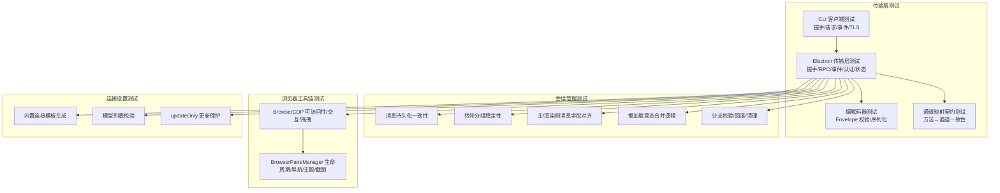
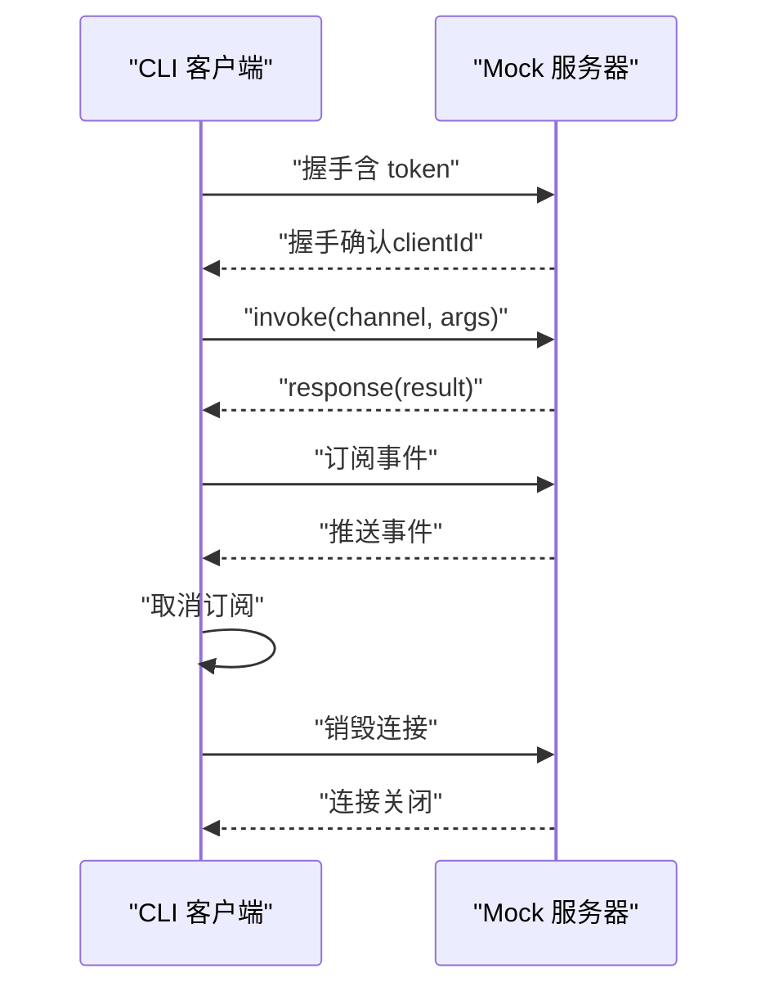
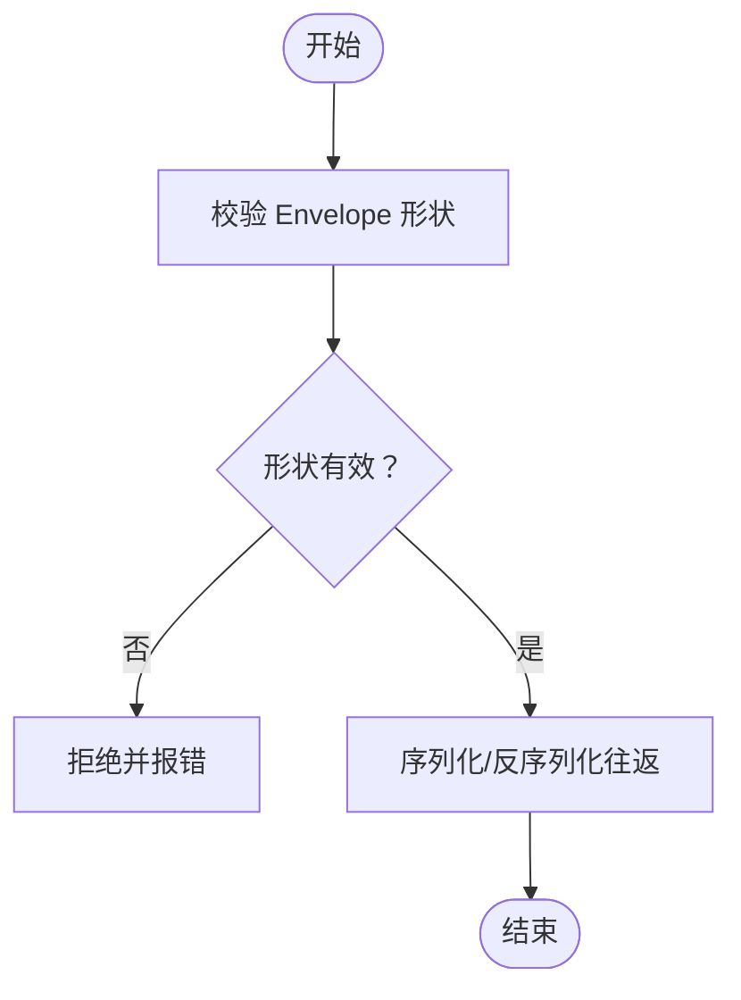
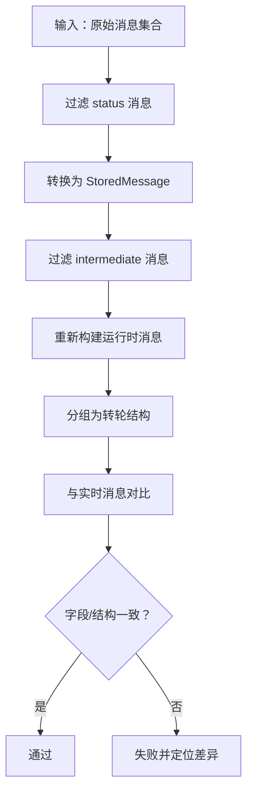
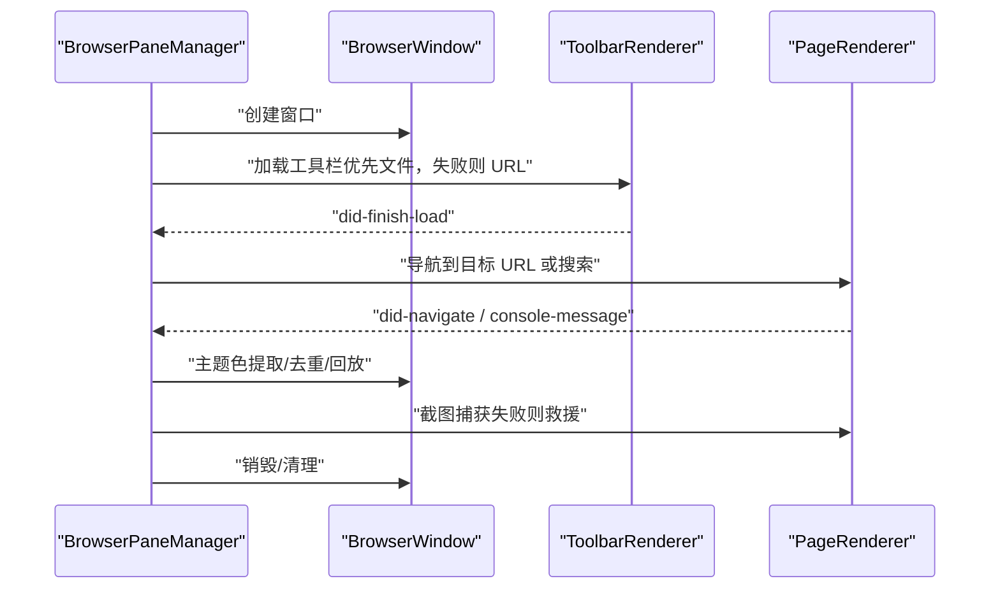
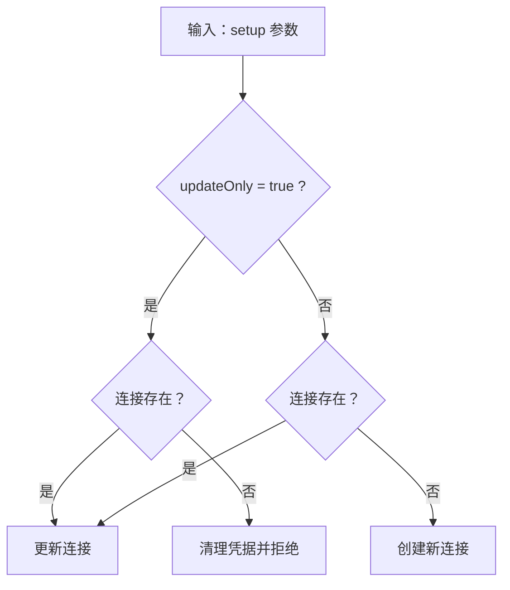
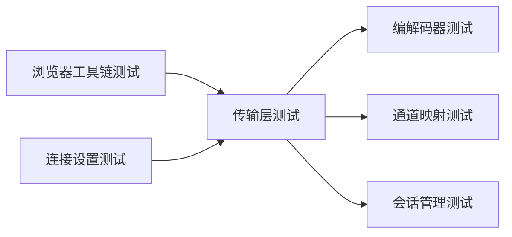

# 测试策略

<cite>
**本文引用的文件**
- [apps/cli/src/client.test.ts](file://apps/cli/src/client.test.ts)
- [apps/electron/src/__tests__/transport.test.ts](file://apps/electron/src/__tests__/transport.test.ts)
- [apps/electron/src/transport/__tests__/channel-map-parity.test.ts](file://apps/electron/src/transport/__tests__/channel-map-parity.test.ts)
- [apps/electron/src/transport/__tests__/codec.test.ts](file://apps/electron/src/transport/__tests__/codec.test.ts)
- [apps/electron/src/main/__tests__/browser-cdp.test.ts](file://apps/electron/src/main/__tests__/browser-cdp.test.ts)
- [apps/electron/src/main/__tests__/browser-pane-manager.test.ts](file://apps/electron/src/main/__tests__/browser-pane-manager.test.ts)
- [apps/electron/src/main/__tests__/connection-setup-logic.test.ts](file://apps/electron/src/main/__tests__/connection-setup-logic.test.ts)
- [apps/electron/src/main/__tests__/connection-setup-updateOnly.test.ts](file://apps/electron/src/main/__tests__/connection-setup-updateOnly.test.ts)
- [apps/electron/src/main/__tests__/session-persistence.test.ts](file://apps/electron/src/main/__tests__/session-persistence.test.ts)
- [apps/electron/src/main/__tests__/session-message-parity.test.ts](file://apps/electron/src/main/__tests__/session-message-parity.test.ts)
- [apps/electron/src/main/__tests__/session-turn-grouping-parity.test.ts](file://apps/electron/src/main/__tests__/session-turn-grouping-parity.test.ts)
- [apps/electron/src/main/__tests__/session-event-message-parity.test.ts](file://apps/electron/src/main/__tests__/session-event-message-parity.test.ts)
- [apps/electron/src/main/__tests__/session-lazy-load-race.test.ts](file://apps/electron/src/main/__tests__/session-lazy-load-race.test.ts)
- [apps/electron/src/main/__tests__/session-branch-cleanup.test.ts](file://apps/electron/src/main/__tests__/session-branch-cleanup.test.ts)
- [apps/electron/src/main/__tests__/session-branch-rollback.test.ts](file://apps/electron/src/main/__tests__/session-branch-rollback.test.ts)
- [apps/electron/src/main/__tests__/session-branching-validation.test.ts](file://apps/electron/src/main/__tests__/session-branching-validation.test.ts)
- [apps/electron/src/main/__tests__/sessions-browser-release.test.ts](file://apps/electron/src/main/__tests__/sessions-browser-release.test.ts)
</cite>

## 目录

1. [引言](#引言)
2. [项目结构](#项目结构)
3. [核心组件](#核心组件)
4. [架构总览](#架构总览)
5. [详细组件分析](#详细组件分析)
6. [依赖关系分析](#依赖关系分析)
7. [性能考量](#性能考量)
8. [故障排查指南](#故障排查指南)
9. [结论](#结论)
10. [附录](#附录)

## 引言

本文件系统化梳理 Craft Agents 的测试策略与实践，覆盖测试框架配置、测试覆盖率与最佳实践；聚焦传输层、会话管理、自动化测试等核心领域，并结合真实代码库中的测试用例进行说明。文档既面向初学者提供清晰的入门路径，也为有经验的开发者提供深入的技术细节与可操作建议。

## 项目结构

测试分布在多个应用与模块中：

- CLI 应用：客户端与传输层测试，验证握手、请求响应、事件推送、TLS 等行为。
- Electron 主进程与渲染进程：传输层、通道映射、编解码器、浏览器面板管理、会话持久化与消息一致性、分支与回滚、连接设置逻辑等。
- Viewer 应用：未见测试文件，后续可补充。

```mermaid
graph TB
subgraph "CLI 应用"
CLI_Client["apps/cli/src/client.test.ts"]
end
subgraph "Electron 应用"
Transport["apps/electron/src/__tests__/transport.test.ts"]
Codec["apps/electron/src/transport/__tests__/codec.test.ts"]
ChannelMap["apps/electron/src/transport/__tests__/channel-map-parity.test.ts"]
BrowserCDP["apps/electron/src/main/__tests__/browser-cdp.test.ts"]
BrowserPane["apps/electron/src/main/__tests__/browser-pane-manager.test.ts"]
ConnSetup["apps/electron/src/main/__tests__/connection-setup-logic.test.ts"]
ConnUpdateOnly["apps/electron/src/main/__tests__/connection-setup-updateOnly.test.ts"]
SessionPersist["apps/electron/src/main/__tests__/session-persistence.test.ts"]
MsgParity["apps/electron/src/main/__tests__/session-message-parity.test.ts"]
TurnParity["apps/electron/src/main/__tests__/session-turn-grouping-parity.test.ts"]
EventMsgParity["apps/electron/src/main/__tests__/session-event-message-parity.test.ts"]
LazyRace["apps/electron/src/main/__tests__/session-lazy-load-race.test.ts"]
BranchCleanup["apps/electron/src/main/__tests__/session-branch-cleanup.test.ts"]
BranchRollback["apps/electron/src/main/__tests__/session-branch-rollback.test.ts"]
BranchValidate["apps/electron/src/main/__tests__/session-branching-validation.test.ts"]
BrowserRelease["apps/electron/src/main/__tests__/sessions-browser-release.test.ts"]
end
CLI_Client --> Transport
BrowserPane --> BrowserCDP
Transport --> Codec
Transport --> ChannelMap
Transport --> ConnSetup
Transport --> ConnUpdateOnly
Transport --> SessionPersist
Transport --> MsgParity
Transport --> TurnParity
Transport --> EventMsgParity
Transport --> LazyRace
Transport --> BranchCleanup
Transport --> BranchRollback
Transport --> BranchValidate
Transport --> BrowserRelease
```

图表来源

- [apps/cli/src/client.test.ts](file://apps/cli/src/client.test.ts#L1-L410)
- [apps/electron/src/**tests**/transport.test.ts](file://apps/electron/src/__tests__/transport.test.ts#L1-L683)
- [apps/electron/src/transport/**tests**/codec.test.ts](file://apps/electron/src/transport/__tests__/codec.test.ts#L1-L116)
- [apps/electron/src/transport/**tests**/channel-map-parity.test.ts](file://apps/electron/src/transport/__tests__/channel-map-parity.test.ts#L1-L48)
- [apps/electron/src/main/**tests**/browser-cdp.test.ts](file://apps/electron/src/main/__tests__/browser-cdp.test.ts#L1-L488)
- [apps/electron/src/main/**tests**/browser-pane-manager.test.ts](file://apps/electron/src/main/__tests__/browser-pane-manager.test.ts#L1-L800)
- [apps/electron/src/main/**tests**/connection-setup-logic.test.ts](file://apps/electron/src/main/__tests__/connection-setup-logic.test.ts#L1-L236)
- [apps/electron/src/main/**tests**/connection-setup-updateOnly.test.ts](file://apps/electron/src/main/__tests__/connection-setup-updateOnly.test.ts#L1-L127)
- [apps/electron/src/main/**tests**/session-persistence.test.ts](file://apps/electron/src/main/__tests__/session-persistence.test.ts#L1-L145)
- [apps/electron/src/main/**tests**/session-message-parity.test.ts](file://apps/electron/src/main/__tests__/session-message-parity.test.ts#L1-L358)
- [apps/electron/src/main/**tests**/session-turn-grouping-parity.test.ts](file://apps/electron/src/main/__tests__/session-turn-grouping-parity.test.ts#L1-L301)
- [apps/electron/src/main/**tests**/session-event-message-parity.test.ts](file://apps/electron/src/main/__tests__/session-event-message-parity.test.ts#L1-L485)
- [apps/electron/src/main/**tests**/session-lazy-load-race.test.ts](file://apps/electron/src/main/__tests__/session-lazy-load-race.test.ts#L1-L193)
- [apps/electron/src/main/**tests**/session-branch-cleanup.test.ts](file://apps/electron/src/main/__tests__/session-branch-cleanup.test.ts#L1-L102)
- [apps/electron/src/main/**tests**/session-branch-rollback.test.ts](file://apps/electron/src/main/__tests__/session-branch-rollback.test.ts#L1-L317)
- [apps/electron/src/main/**tests**/session-branching-validation.test.ts](file://apps/electron/src/main/__tests__/session-branching-validation.test.ts#L1-L160)
- [apps/electron/src/main/**tests**/sessions-browser-release.test.ts](file://apps/electron/src/main/__tests__/sessions-browser-release.test.ts#L1-L27)

章节来源

- [apps/cli/src/client.test.ts](file://apps/cli/src/client.test.ts#L1-L410)
- [apps/electron/src/**tests**/transport.test.ts](file://apps/electron/src/__tests__/transport.test.ts#L1-L683)

## 核心组件

- 测试框架与运行时
  - 使用 Bun 测试运行器（bun:test），统一在各应用与包的测试文件中执行。
  - CLI 与 Electron 主/渲染侧均采用该运行器，确保跨平台一致的测试体验。
- 传输层（CLI/Electron）
  - 客户端/服务端握手、RPC 请求/响应、事件推送、错误处理、认证与协议版本校验。
  - 编解码器与通道映射的契约性测试，保证消息序列化/反序列化与通道定义的一致性。
- 会话管理
  - 消息持久化与 UI 呈现一致性、转轮分组稳定性、主/渲染侧消息字段对齐、懒加载竞态处理。
  - 分支创建的前置校验、失败回滚与清理流程。
- 浏览器工具链
  - CDP 辅助类的可访问性快照、元素交互、拖拽、调试器生命周期管理。
  - 浏览器面板管理器的窗口生命周期、导航、主题色提取、截图与重试机制。
- 连接设置
  - 内置连接模板生成、模型列表校验、更新仅更新保护（updateOnly）等。

章节来源

- [apps/cli/src/client.test.ts](file://apps/cli/src/client.test.ts#L1-L410)
- [apps/electron/src/**tests**/transport.test.ts](file://apps/electron/src/__tests__/transport.test.ts#L1-L683)
- [apps/electron/src/transport/**tests**/codec.test.ts](file://apps/electron/src/transport/__tests__/codec.test.ts#L1-L116)
- [apps/electron/src/transport/**tests**/channel-map-parity.test.ts](file://apps/electron/src/transport/__tests__/channel-map-parity.test.ts#L1-L48)
- [apps/electron/src/main/**tests**/browser-cdp.test.ts](file://apps/electron/src/main/__tests__/browser-cdp.test.ts#L1-L488)
- [apps/electron/src/main/**tests**/browser-pane-manager.test.ts](file://apps/electron/src/main/__tests__/browser-pane-manager.test.ts#L1-L800)
- [apps/electron/src/main/**tests**/connection-setup-logic.test.ts](file://apps/electron/src/main/__tests__/connection-setup-logic.test.ts#L1-L236)
- [apps/electron/src/main/**tests**/connection-setup-updateOnly.test.ts](file://apps/electron/src/main/__tests__/connection-setup-updateOnly.test.ts#L1-L127)
- [apps/electron/src/main/**tests**/session-persistence.test.ts](file://apps/electron/src/main/__tests__/session-persistence.test.ts#L1-L145)
- [apps/electron/src/main/**tests**/session-message-parity.test.ts](file://apps/electron/src/main/__tests__/session-message-parity.test.ts#L1-L358)
- [apps/electron/src/main/**tests**/session-turn-grouping-parity.test.ts](file://apps/electron/src/main/__tests__/session-turn-grouping-parity.test.ts#L1-L301)
- [apps/electron/src/main/**tests**/session-event-message-parity.test.ts](file://apps/electron/src/main/__tests__/session-event-message-parity.test.ts#L1-L485)
- [apps/electron/src/main/**tests**/session-lazy-load-race.test.ts](file://apps/electron/src/main/__tests__/session-lazy-load-race.test.ts#L1-L193)
- [apps/electron/src/main/**tests**/session-branch-cleanup.test.ts](file://apps/electron/src/main/__tests__/session-branch-cleanup.test.ts#L1-L102)
- [apps/electron/src/main/**tests**/session-branch-rollback.test.ts](file://apps/electron/src/main/__tests__/session-branch-rollback.test.ts#L1-L317)
- [apps/electron/src/main/**tests**/session-branching-validation.test.ts](file://apps/electron/src/main/__tests__/session-branching-validation.test.ts#L1-L160)
- [apps/electron/src/main/**tests**/sessions-browser-release.test.ts](file://apps/electron/src/main/__tests__/sessions-browser-release.test.ts#L1-L27)

## 架构总览

下图展示测试覆盖的关键路径：从传输层到会话管理，再到浏览器工具链与连接设置，形成端到端的测试闭环。

图表来源

- [apps/cli/src/client.test.ts](file://apps/cli/src/client.test.ts#L1-L410)
- [apps/electron/src/**tests**/transport.test.ts](file://apps/electron/src/__tests__/transport.test.ts#L1-L683)
- [apps/electron/src/transport/**tests**/codec.test.ts](file://apps/electron/src/transport/__tests__/codec.test.ts#L1-L116)
- [apps/electron/src/transport/**tests**/channel-map-parity.test.ts](file://apps/electron/src/transport/__tests__/channel-map-parity.test.ts#L1-L48)
- [apps/electron/src/main/**tests**/browser-cdp.test.ts](file://apps/electron/src/main/__tests__/browser-cdp.test.ts#L1-L488)
- [apps/electron/src/main/**tests**/browser-pane-manager.test.ts](file://apps/electron/src/main/__tests__/browser-pane-manager.test.ts#L1-L800)
- [apps/electron/src/main/**tests**/connection-setup-logic.test.ts](file://apps/electron/src/main/__tests__/connection-setup-logic.test.ts#L1-L236)
- [apps/electron/src/main/**tests**/connection-setup-updateOnly.test.ts](file://apps/electron/src/main/__tests__/connection-setup-updateOnly.test.ts#L1-L127)
- [apps/electron/src/main/**tests**/session-persistence.test.ts](file://apps/electron/src/main/__tests__/session-persistence.test.ts#L1-L145)
- [apps/electron/src/main/**tests**/session-message-parity.test.ts](file://apps/electron/src/main/__tests__/session-message-parity.test.ts#L1-L358)
- [apps/electron/src/main/**tests**/session-turn-grouping-parity.test.ts](file://apps/electron/src/main/__tests__/session-turn-grouping-parity.test.ts#L1-L301)
- [apps/electron/src/main/**tests**/session-event-message-parity.test.ts](file://apps/electron/src/main/__tests__/session-event-message-parity.test.ts#L1-L485)
- [apps/electron/src/main/**tests**/session-lazy-load-race.test.ts](file://apps/electron/src/main/__tests__/session-lazy-load-race.test.ts#L1-L193)
- [apps/electron/src/main/**tests**/session-branch-cleanup.test.ts](file://apps/electron/src/main/__tests__/session-branch-cleanup.test.ts#L1-L102)
- [apps/electron/src/main/**tests**/session-branch-rollback.test.ts](file://apps/electron/src/main/__tests__/session-branch-rollback.test.ts#L1-L317)
- [apps/electron/src/main/**tests**/session-branching-validation.test.ts](file://apps/electron/src/main/__tests__/session-branching-validation.test.ts#L1-L160)

## 详细组件分析

### 传输层测试（CLI 与 Electron）

- CLI 客户端
  - 握手、认证令牌传递、超时与错误处理、事件订阅与取消、TLS 支持等。
  - 关键断言包括：clientId 返回、握手参数、错误码、超时抛错、事件推送与取消订阅、销毁后拒绝待处理调用等。
- Electron 传输层
  - 握手、RPC 请求/响应、并发请求、二进制载荷、事件推送、工作区目标过滤、认证、连接状态机、双向 RPC（服务器调用客户端能力）、错误码与关闭原因解析等。
  - 关键断言包括：handler 参数透传、错误码一致性、二进制数组往返、事件目标过滤、capabilities 注册与调用、握手 capabilities 存储、异步 handler 等。

图表来源

- [apps/cli/src/client.test.ts](file://apps/cli/src/client.test.ts#L171-L384)

章节来源

- [apps/cli/src/client.test.ts](file://apps/cli/src/client.test.ts#L1-L410)
- [apps/electron/src/**tests**/transport.test.ts](file://apps/electron/src/__tests__/transport.test.ts#L1-L683)

### 编解码器与通道映射测试

- 编解码器
  - 验证消息包（Envelope）形状、字段完整性、错误码类型灵活性、序列化/反序列化往返等。
- 通道映射契约
  - 对比 ElectronAPI 方法与 CHANNEL_MAP 的映射关系，确保类型安全与运行时契约一致。

图表来源

- [apps/electron/src/transport/**tests**/codec.test.ts](file://apps/electron/src/transport/__tests__/codec.test.ts#L1-L116)

章节来源

- [apps/electron/src/transport/**tests**/codec.test.ts](file://apps/electron/src/transport/__tests__/codec.test.ts#L1-L116)
- [apps/electron/src/transport/**tests**/channel-map-parity.test.ts](file://apps/electron/src/transport/__tests__/channel-map-parity.test.ts#L1-L48)

### 会话管理测试

- 消息持久化与 UI 一致性
  - messageToStored/storedToMessage 往返覆盖、parentToolUseId 透传、持久化管线过滤（status 与 intermediate）。
- 转轮分组稳定性
  - 经过持久化管线的消息在重新加载后仍能保持转轮结构与关键字段（如 taskId、isBackground、planPath、错误字段、认证字段）。
- 主/渲染侧消息字段对齐
  - text_complete、tool_start、tool_result、typed_error、后台任务事件等，确保主进程与渲染侧生成的消息字段一致。
- 懒加载竞态合并
  - 合并逻辑避免在活跃流式会话中被 IPC 响应覆盖已有消息，同时保留非消息字段更新。
- 分支校验/回滚/清理
  - 分支请求的合法性校验（同工作区、同 provider/providerType/piAuthProvider、消息存在），失败时清理运行时与存储、销毁 agent/poolServer，或在预检失败时回滚新建子会话。

图表来源

- [apps/electron/src/main/**tests**/session-message-parity.test.ts](file://apps/electron/src/main/__tests__/session-message-parity.test.ts#L1-L358)
- [apps/electron/src/main/**tests**/session-turn-grouping-parity.test.ts](file://apps/electron/src/main/__tests__/session-turn-grouping-parity.test.ts#L1-L301)

章节来源

- [apps/electron/src/main/**tests**/session-persistence.test.ts](file://apps/electron/src/main/__tests__/session-persistence.test.ts#L1-L145)
- [apps/electron/src/main/**tests**/session-message-parity.test.ts](file://apps/electron/src/main/__tests__/session-message-parity.test.ts#L1-L358)
- [apps/electron/src/main/**tests**/session-turn-grouping-parity.test.ts](file://apps/electron/src/main/__tests__/session-turn-grouping-parity.test.ts#L1-L301)
- [apps/electron/src/main/**tests**/session-event-message-parity.test.ts](file://apps/electron/src/main/__tests__/session-event-message-parity.test.ts#L1-L485)
- [apps/electron/src/main/**tests**/session-lazy-load-race.test.ts](file://apps/electron/src/main/__tests__/session-lazy-load-race.test.ts#L1-L193)
- [apps/electron/src/main/**tests**/session-branch-cleanup.test.ts](file://apps/electron/src/main/__tests__/session-branch-cleanup.test.ts#L1-L102)
- [apps/electron/src/main/**tests**/session-branch-rollback.test.ts](file://apps/electron/src/main/__tests__/session-branch-rollback.test.ts#L1-L317)
- [apps/electron/src/main/**tests**/session-branching-validation.test.ts](file://apps/electron/src/main/__tests__/session-branching-validation.test.ts#L1-L160)

### 浏览器工具链测试

- BrowserCDP
  - 可访问性快照解析、节点引用稳定、交互（点击/填充/选择/拖拽）顺序与事件派发、调试器 attach/detach 与异常处理、滚动与几何查询。
- BrowserPaneManager
  - 实例创建/销毁、会话绑定/解绑、导航（URL 规范化/搜索）、焦点与显示/隐藏、弹窗拦截与深链转发、主题色提取与去重、截图捕获与救援、控制台日志采集与过滤、工具栏加载重试与回退页。

图表来源

- [apps/electron/src/main/**tests**/browser-pane-manager.test.ts](file://apps/electron/src/main/__tests__/browser-pane-manager.test.ts#L1-L800)
- [apps/electron/src/main/**tests**/browser-cdp.test.ts](file://apps/electron/src/main/__tests__/browser-cdp.test.ts#L1-L488)

章节来源

- [apps/electron/src/main/**tests**/browser-cdp.test.ts](file://apps/electron/src/main/__tests__/browser-cdp.test.ts#L1-L488)
- [apps/electron/src/main/**tests**/browser-pane-manager.test.ts](file://apps/electron/src/main/__tests__/browser-pane-manager.test.ts#L1-L800)

### 连接设置测试

- 内置连接模板生成与命名规则、OAuth 与 API Key 类型、pi 提供商特定行为、数字后缀命名兼容性。
- 模型列表校验：默认模型自动选择、字符串与对象列表兼容、回归用例覆盖。
- updateOnly 保护：当启用时，若连接不存在则拒绝并清理凭据，否则正常更新。

图表来源

- [apps/electron/src/main/**tests**/connection-setup-updateOnly.test.ts](file://apps/electron/src/main/__tests__/connection-setup-updateOnly.test.ts#L1-L127)

章节来源

- [apps/electron/src/main/**tests**/connection-setup-logic.test.ts](file://apps/electron/src/main/__tests__/connection-setup-logic.test.ts#L1-L236)
- [apps/electron/src/main/**tests**/connection-setup-updateOnly.test.ts](file://apps/electron/src/main/__tests__/connection-setup-updateOnly.test.ts#L1-L127)

## 依赖关系分析

- 测试耦合与内聚
  - 传输层测试与编解码器/通道映射强耦合，确保消息契约稳定。
  - 会话管理测试与 UI 工具函数（转轮分组）紧密配合，保证持久化前后一致性。
  - 浏览器工具链测试通过 mock Electron API 与 CDP，隔离外部依赖。
- 外部依赖与集成点
  - Electron 主进程模块、IPC 渠道、Sentry 日志、配置与工作区管理等通过 mock 注入，降低集成复杂度。
- 潜在循环依赖
  - 当前测试文件间无直接循环导入；通过 mock 与纯函数逻辑避免循环依赖风险。

图表来源

- [apps/electron/src/**tests**/transport.test.ts](file://apps/electron/src/__tests__/transport.test.ts#L1-L683)
- [apps/electron/src/transport/**tests**/codec.test.ts](file://apps/electron/src/transport/__tests__/codec.test.ts#L1-L116)
- [apps/electron/src/transport/**tests**/channel-map-parity.test.ts](file://apps/electron/src/transport/__tests__/channel-map-parity.test.ts#L1-L48)
- [apps/electron/src/main/**tests**/browser-pane-manager.test.ts](file://apps/electron/src/main/__tests__/browser-pane-manager.test.ts#L1-L800)
- [apps/electron/src/main/**tests**/connection-setup-logic.test.ts](file://apps/electron/src/main/__tests__/connection-setup-logic.test.ts#L1-L236)

章节来源

- [apps/electron/src/**tests**/transport.test.ts](file://apps/electron/src/__tests__/transport.test.ts#L1-L683)
- [apps/electron/src/transport/**tests**/codec.test.ts](file://apps/electron/src/transport/__tests__/codec.test.ts#L1-L116)
- [apps/electron/src/transport/**tests**/channel-map-parity.test.ts](file://apps/electron/src/transport/__tests__/channel-map-parity.test.ts#L1-L48)
- [apps/electron/src/main/**tests**/browser-pane-manager.test.ts](file://apps/electron/src/main/__tests__/browser-pane-manager.test.ts#L1-L800)
- [apps/electron/src/main/**tests**/connection-setup-logic.test.ts](file://apps/electron/src/main/__tests__/connection-setup-logic.test.ts#L1-L236)

## 性能考量

- 测试并发与资源占用
  - 传输层并发请求测试通过 Promise.all 并行触发，验证独立解析；建议在本地开发时合理设置超时与并发上限，避免资源争用。
- 序列化与二进制处理
  - 二进制数组往返测试覆盖大载荷场景，注意内存占用与序列化开销；在 CI 中可适当放宽超时阈值。
- 截图与页面捕获
  - 截图失败重试与“非侵入式”窗口显隐策略减少对用户交互的影响；建议在测试中模拟空图像以验证救援路径。
- 懒加载竞态
  - 合并逻辑避免重复写入已存在的消息，减少持久化压力；建议在高并发场景下配合队列或去重策略。

## 故障排查指南

- 握手/认证失败
  - 检查 token 是否正确传递、服务端是否开启 requireAuth、validateToken 返回值；参考握手与认证测试用例。
- 请求超时
  - 调整 connectTimeout/requestTimeout；确认服务端是否在握手后及时响应请求。
- 事件未到达或重复
  - 确认订阅时机与取消订阅调用；检查事件目标过滤（workspace/all）与二进制事件往返。
- 二进制载荷异常
  - 校验 Uint8Array 序列化/反序列化；确保 handler 参数类型匹配。
- 消息持久化不一致
  - 对照 messageToStored/storedToMessage 字段清单；确认 status 与 intermediate 过滤逻辑。
- 转轮分组异常
  - 检查 parentToolUseId 透传、后台任务字段（taskId、isBackground）与计划/错误/认证字段。
- 分支创建失败
  - 校验工作区归属、provider/providerType/piAuthProvider 一致性、消息存在性；失败时检查清理与回滚逻辑。
- 浏览器面板加载失败
  - 查看工具栏重试次数与回退页加载；确认主题色信号与控制台日志采集。
- updateOnly 场景
  - 若连接不存在且启用 updateOnly，应拒绝并清理凭据；检查清理逻辑是否执行。

章节来源

- [apps/cli/src/client.test.ts](file://apps/cli/src/client.test.ts#L192-L267)
- [apps/electron/src/**tests**/transport.test.ts](file://apps/electron/src/__tests__/transport.test.ts#L352-L476)
- [apps/electron/src/main/**tests**/session-message-parity.test.ts](file://apps/electron/src/main/__tests__/session-message-parity.test.ts#L290-L357)
- [apps/electron/src/main/**tests**/session-turn-grouping-parity.test.ts](file://apps/electron/src/main/__tests__/session-turn-grouping-parity.test.ts#L128-L300)
- [apps/electron/src/main/**tests**/session-branch-rollback.test.ts](file://apps/electron/src/main/__tests__/session-branch-rollback.test.ts#L282-L315)
- [apps/electron/src/main/**tests**/browser-pane-manager.test.ts](file://apps/electron/src/main/__tests__/browser-pane-manager.test.ts#L532-L705)
- [apps/electron/src/main/**tests**/connection-setup-updateOnly.test.ts](file://apps/electron/src/main/__tests__/connection-setup-updateOnly.test.ts#L59-L84)

## 结论

本测试策略以传输层为核心，贯穿会话管理、浏览器工具链与连接设置，形成从底层协议到上层 UI 的全链路保障。通过契约性测试（通道映射、编解码器）、消息一致性测试（持久化/转轮/事件）、竞态与回滚测试（懒加载/分支），以及浏览器面板的鲁棒性测试，显著提升了系统的可靠性与可维护性。建议持续扩展 Viewer 应用测试，并在 CI 中引入覆盖率报告与性能回归监控。

## 附录

- 测试覆盖率建议
  - 传输层：目标 90%+（握手、RPC、事件、认证、错误码）。
  - 会话管理：目标 95%+（消息往返、转轮分组、字段对齐、分支校验）。
  - 浏览器工具链：目标 90%+（CDP、面板生命周期、导航与截图）。
  - 连接设置：目标 95%+（模板生成、模型校验、updateOnly）。
- 最佳实践
  - 使用 mock 隔离外部依赖，确保测试可重复。
  - 将“契约性”测试前置（通道映射、编解码器），尽早发现接口漂移。
  - 对并发与边界条件（超时、空载荷、异常事件）进行专项测试。
  - 在 CI 中启用并行执行与超时控制，避免单点阻塞。
