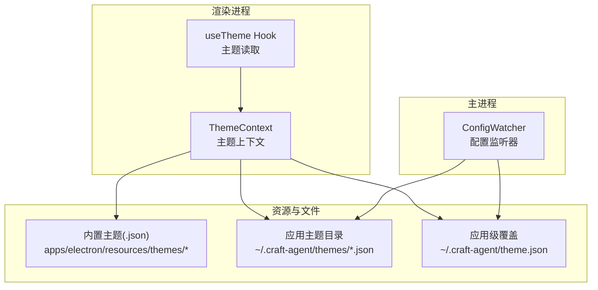
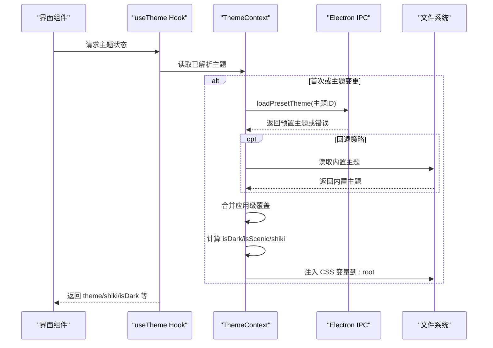
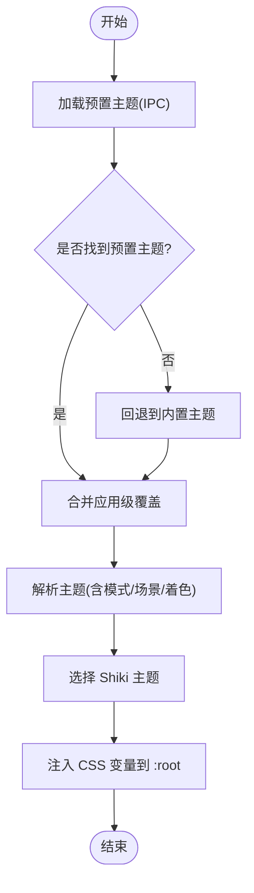
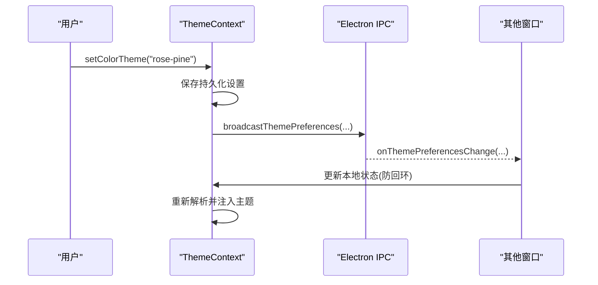
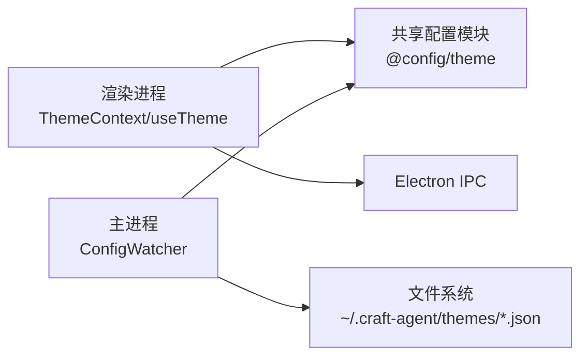

# 主题系统

<cite>
**本文引用的文件**
- [apps/electron/src/renderer/context/ThemeContext.tsx](file://apps/electron/src/renderer/context/ThemeContext.tsx)
- [apps/electron/src/renderer/hooks/useTheme.ts](file://apps/electron/src/renderer/hooks/useTheme.ts)
- [apps/electron/src/main/lib/config-watcher.ts](file://apps/electron/src/main/lib/config-watcher.ts)
- [packages/shared/src/config/index.ts](file://packages/shared/src/config/index.ts)
- [apps/electron/resources/themes/default.json](file://apps/electron/resources/themes/default.json)
- [apps/electron/resources/themes/dracula.json](file://apps/electron/resources/themes/dracula.json)
- [apps/electron/resources/themes/nord.json](file://apps/electron/resources/themes/nord.json)
</cite>

## 目录

1. [简介](#简介)
2. [项目结构](#项目结构)
3. [核心组件](#核心组件)
4. [架构总览](#架构总览)
5. [详细组件分析](#详细组件分析)
6. [依赖分析](#依赖分析)
7. [性能考虑](#性能考虑)
8. [故障排查指南](#故障排查指南)
9. [结论](#结论)
10. [附录](#附录)

## 简介

本文件系统性阐述 Craft Agents 的主题系统：从主题文件结构与颜色/字体/样式规则，到动态主题切换、主题继承与自定义主题创建机制；并覆盖主题兼容性、性能优化与跨窗口主题同步等关键问题。文档面向初学者与有经验开发者，既提供高层概览，也给出可追溯到源码的实现细节与流程图。

## 项目结构

主题系统由“预置主题（内置/用户目录）+ 应用级覆盖 + 工作区覆盖 + 运行时解析与注入”构成，核心分布在渲染进程的主题上下文、主进程的配置监听器以及共享配置模块中。

图表来源

- [apps/electron/src/renderer/context/ThemeContext.tsx](file://apps/electron/src/renderer/context/ThemeContext.tsx#L77-L88)
- [apps/electron/src/main/lib/config-watcher.ts](file://apps/electron/src/main/lib/config-watcher.ts#L934-L958)
- [apps/electron/resources/themes/default.json](file://apps/electron/resources/themes/default.json#L1-L26)

章节来源

- [apps/electron/src/renderer/context/ThemeContext.tsx](file://apps/electron/src/renderer/context/ThemeContext.tsx#L77-L88)
- [apps/electron/src/main/lib/config-watcher.ts](file://apps/electron/src/main/lib/config-watcher.ts#L934-L958)

## 核心组件

- 主题上下文（ThemeContext）
  - 负责主题偏好持久化、模式选择、工作区覆盖、预置主题加载与回退、Shiki 语法高亮主题选择、DOM 属性与 CSS 变量注入、跨窗口同步与系统主题监听。
- useTheme Hook
  - 在渲染层以只读方式访问已解析的主题状态，并支持应用级覆盖合并。
- 配置监听器（ConfigWatcher）
  - 监听应用级主题文件变化，触发回调以更新主题列表与单个主题内容。
- 共享配置入口
  - 暴露主题相关类型与加载函数，供渲染/主进程使用。

章节来源

- [apps/electron/src/renderer/context/ThemeContext.tsx](file://apps/electron/src/renderer/context/ThemeContext.tsx#L17-L65)
- [apps/electron/src/renderer/hooks/useTheme.ts](file://apps/electron/src/renderer/hooks/useTheme.ts#L11-L28)
- [apps/electron/src/main/lib/config-watcher.ts](file://apps/electron/src/main/lib/config-watcher.ts#L129-L136)
- [packages/shared/src/config/index.ts](file://packages/shared/src/config/index.ts#L8)

## 架构总览

主题系统采用“预置主题 + 应用级覆盖 + 工作区覆盖”的分层设计，运行时通过上下文统一解析并注入到 DOM，确保一致性与高性能。

图表来源

- [apps/electron/src/renderer/context/ThemeContext.tsx](file://apps/electron/src/renderer/context/ThemeContext.tsx#L185-L246)
- [apps/electron/src/renderer/context/ThemeContext.tsx](file://apps/electron/src/renderer/context/ThemeContext.tsx#L349-L380)
- [apps/electron/src/renderer/hooks/useTheme.ts](file://apps/electron/src/renderer/hooks/useTheme.ts#L49-L76)

## 详细组件分析

### 主题文件结构与字段说明

- 必填字段
  - name: 主题名称
  - description: 描述
  - author/license/source: 版权与来源信息（可选）
  - supportedModes: 支持的模式数组，如 ["light","dark"] 或 ["dark"]
  - shikiTheme: 语法高亮主题配置，键为 "light"/"dark"，值为主题名字符串
- 基础色板
  - background/foreground/accent/info/success/destructive
  - 支持在 dark 子对象中为深色模式单独定义
- 可选扩展
  - scenic 模式可通过背景图等扩展属性启用（由上下文逻辑判定）

示例参考

- 默认主题文件字段与结构
  - [apps/electron/resources/themes/default.json](file://apps/electron/resources/themes/default.json#L1-L26)
- 深色专属主题（仅支持 dark）
  - [apps/electron/resources/themes/dracula.json](file://apps/electron/resources/themes/dracula.json#L7-L26)
- 经典双模式主题
  - [apps/electron/resources/themes/nord.json](file://apps/electron/resources/themes/nord.json#L7-L26)

章节来源

- [apps/electron/resources/themes/default.json](file://apps/electron/resources/themes/default.json#L1-L26)
- [apps/electron/resources/themes/dracula.json](file://apps/electron/resources/themes/dracula.json#L7-L26)
- [apps/electron/resources/themes/nord.json](file://apps/electron/resources/themes/nord.json#L7-L26)

### 主题解析与 DOM 注入流程

- 预置主题加载
  - 通过 Electron IPC 请求预置主题；若失败则回退到内置主题集合。
- 应用级覆盖合并
  - 若存在应用级覆盖（~/.craft-agent/theme.json），与预置主题合并后解析。
- 模式与场景判定
  - scenic 模式需满足：主题声明 scenic 且提供背景图；深色专属主题强制深色。
- Shiki 主题选择
  - 根据当前 isDark 与主题 supportedModes 选择对应变体。
- DOM 注入
  - 设置根节点数据属性与 CSS 变量，避免闪烁与不一致。

图表来源

- [apps/electron/src/renderer/context/ThemeContext.tsx](file://apps/electron/src/renderer/context/ThemeContext.tsx#L185-L246)
- [apps/electron/src/renderer/context/ThemeContext.tsx](file://apps/electron/src/renderer/context/ThemeContext.tsx#L248-L282)
- [apps/electron/src/renderer/context/ThemeContext.tsx](file://apps/electron/src/renderer/context/ThemeContext.tsx#L349-L380)

章节来源

- [apps/electron/src/renderer/context/ThemeContext.tsx](file://apps/electron/src/renderer/context/ThemeContext.tsx#L185-L246)
- [apps/electron/src/renderer/context/ThemeContext.tsx](file://apps/electron/src/renderer/context/ThemeContext.tsx#L248-L282)
- [apps/electron/src/renderer/context/ThemeContext.tsx](file://apps/electron/src/renderer/context/ThemeContext.tsx#L349-L380)

### 动态主题切换与工作区覆盖

- 应用级切换
  - 通过设置 mode/colorTheme/font 并持久化，触发跨窗口广播与重新解析。
- 工作区覆盖
  - 为当前活动工作区设置独立的颜色主题覆盖，仅影响该工作区。
- 预览模式
  - 支持临时预览主题（hover），不影响持久化设置。

图表来源

- [apps/electron/src/renderer/context/ThemeContext.tsx](file://apps/electron/src/renderer/context/ThemeContext.tsx#L436-L464)
- [apps/electron/src/renderer/context/ThemeContext.tsx](file://apps/electron/src/renderer/context/ThemeContext.tsx#L412-L434)

章节来源

- [apps/electron/src/renderer/context/ThemeContext.tsx](file://apps/electron/src/renderer/context/ThemeContext.tsx#L436-L464)
- [apps/electron/src/renderer/context/ThemeContext.tsx](file://apps/electron/src/renderer/context/ThemeContext.tsx#L412-L434)

### 主题继承与自定义主题创建机制

- 继承与回退
  - 预置主题缺失时自动回退到内置主题；若仍无可用主题，则清空自定义 CSS 并记录错误。
- 自定义主题创建
  - 在应用主题目录创建 JSON 文件，遵循预置主题字段规范；支持按需覆盖基础色板与 Shiki 主题。
- 列表与排序
  - 监听目录变化，动态更新可用主题列表；当名称等元数据变化时触发重排。

章节来源

- [apps/electron/src/renderer/context/ThemeContext.tsx](file://apps/electron/src/renderer/context/ThemeContext.tsx#L189-L207)
- [apps/electron/src/main/lib/config-watcher.ts](file://apps/electron/src/main/lib/config-watcher.ts#L1005-L1024)
- [apps/electron/src/main/lib/config-watcher.ts](file://apps/electron/src/main/lib/config-watcher.ts#L1029-L1059)

### Shiki 语法高亮主题集成

- 配置来源
  - 预置主题中的 shikiTheme 字段决定不同模式下的主题名。
- 选择逻辑
  - 当前模式与主题支持模式不匹配时，优先使用主题支持的第一个模式作为 Shiki 主题。
- 使用方式
  - 渲染层通过 useTheme 获取当前 shikiTheme 与 shikiConfig，用于代码编辑/查看组件。

章节来源

- [apps/electron/src/renderer/context/ThemeContext.tsx](file://apps/electron/src/renderer/context/ThemeContext.tsx#L264-L282)
- [apps/electron/src/renderer/hooks/useTheme.ts](file://apps/electron/src/renderer/hooks/useTheme.ts#L19-L28)

### 类型与接口概览

- 主题模式
  - light/dark/system
- 字体族
  - inter/system
- 关键类型
  - ThemeOverrides/ThemeFile/ShikiThemeConfig 等由共享配置模块导出，供渲染/主进程共同使用。

章节来源

- [apps/electron/src/renderer/context/ThemeContext.tsx](file://apps/electron/src/renderer/context/ThemeContext.tsx#L14-L15)
- [packages/shared/src/config/index.ts](file://packages/shared/src/config/index.ts#L8)

## 依赖分析

- 渲染进程依赖
  - ThemeContext 提供主题状态与 setter；useTheme 仅读取。
  - 依赖 Electron IPC 加载预置主题、监听系统主题变化与跨窗口同步。
- 主进程依赖
  - ConfigWatcher 监听应用主题目录与应用级覆盖文件，触发回调以更新主题列表与单个主题。
- 共享模块
  - 导出主题相关类型与加载函数，保证两端一致性。

图表来源

- [apps/electron/src/renderer/context/ThemeContext.tsx](file://apps/electron/src/renderer/context/ThemeContext.tsx#L1-L12)
- [apps/electron/src/main/lib/config-watcher.ts](file://apps/electron/src/main/lib/config-watcher.ts#L49-L50)
- [packages/shared/src/config/index.ts](file://packages/shared/src/config/index.ts#L8)

章节来源

- [apps/electron/src/renderer/context/ThemeContext.tsx](file://apps/electron/src/renderer/context/ThemeContext.tsx#L1-L12)
- [apps/electron/src/main/lib/config-watcher.ts](file://apps/electron/src/main/lib/config-watcher.ts#L49-L50)
- [packages/shared/src/config/index.ts](file://packages/shared/src/config/index.ts#L8)

## 性能考虑

- 避免闪烁
  - 仅在预置主题加载完成后注入 CSS 变量，保持 DOM 稳定。
- 减少重绘
  - 将主题解析与 DOM 注入集中在 ThemeContext 单例中执行，避免多组件重复计算。
- 监听去抖
  - 文件变更采用去抖处理，降低频繁写入导致的抖动。
- 模式与场景判定
  - 通过数据属性与 CSS 变量控制，避免复杂 JS 计算。

章节来源

- [apps/electron/src/renderer/context/ThemeContext.tsx](file://apps/electron/src/renderer/context/ThemeContext.tsx#L366-L380)
- [apps/electron/src/main/lib/config-watcher.ts](file://apps/electron/src/main/lib/config-watcher.ts#L481-L493)

## 故障排查指南

- 预置主题未加载
  - 检查 Electron IPC 是否可用与返回值；若失败会回退到内置主题并记录原因。
- Shiki 主题不匹配
  - 当主题仅支持 dark 且当前为 light 模式时，会使用其支持的第一个模式作为 Shiki 主题。
- 跨窗口不同步
  - 确认广播与监听逻辑正常；注意外部更新时的回环防护标记。
- 主题列表未更新
  - 确认应用主题目录存在且文件为合法 JSON；监听器会扫描并更新已知主题集合。

章节来源

- [apps/electron/src/renderer/context/ThemeContext.tsx](file://apps/electron/src/renderer/context/ThemeContext.tsx#L218-L241)
- [apps/electron/src/renderer/context/ThemeContext.tsx](file://apps/electron/src/renderer/context/ThemeContext.tsx#L274-L282)
- [apps/electron/src/main/lib/config-watcher.ts](file://apps/electron/src/main/lib/config-watcher.ts#L934-L958)
- [apps/electron/src/main/lib/config-watcher.ts](file://apps/electron/src/main/lib/config-watcher.ts#L1005-L1024)

## 结论

Craft Agents 的主题系统通过“预置主题 + 应用级覆盖 + 工作区覆盖”的分层设计，结合渲染进程的集中解析与注入、主进程的文件监听与回退策略，实现了稳定、可扩展且高性能的主题体验。开发者可基于现有 JSON 结构快速创建自定义主题，并通过 Shiki 集成获得一致的代码高亮效果。

## 附录

- 主题文件字段速查
  - 必填：name/description/supportedModes/shikiTheme
  - 基础色板：background/foreground/accent/info/success/destructive
  - 可选：dark 子对象（深色覆盖）、scenic 扩展（由上下文判定）
- 推荐实践
  - 为深色专属主题明确声明 supportedModes 为 ["dark"]，避免模式不匹配导致的显示异常。
  - 在应用级覆盖中仅修改必要字段，减少合并成本。
  - 使用内置主题作为基线，逐步增量覆盖。
