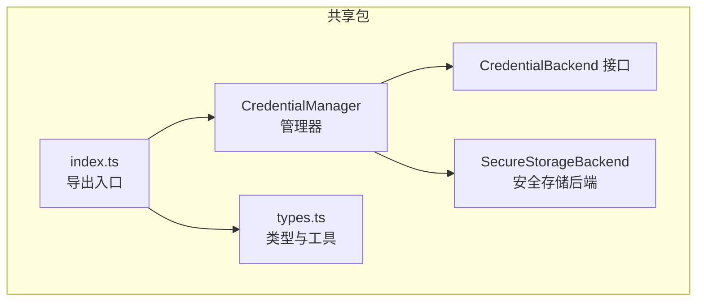
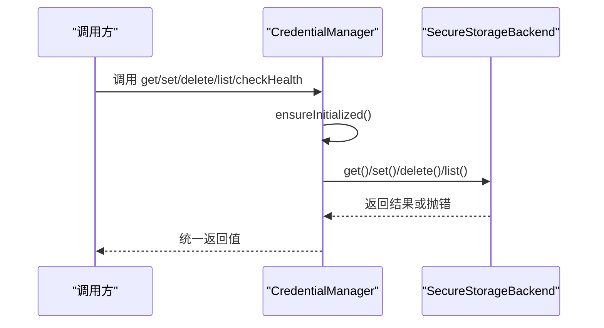
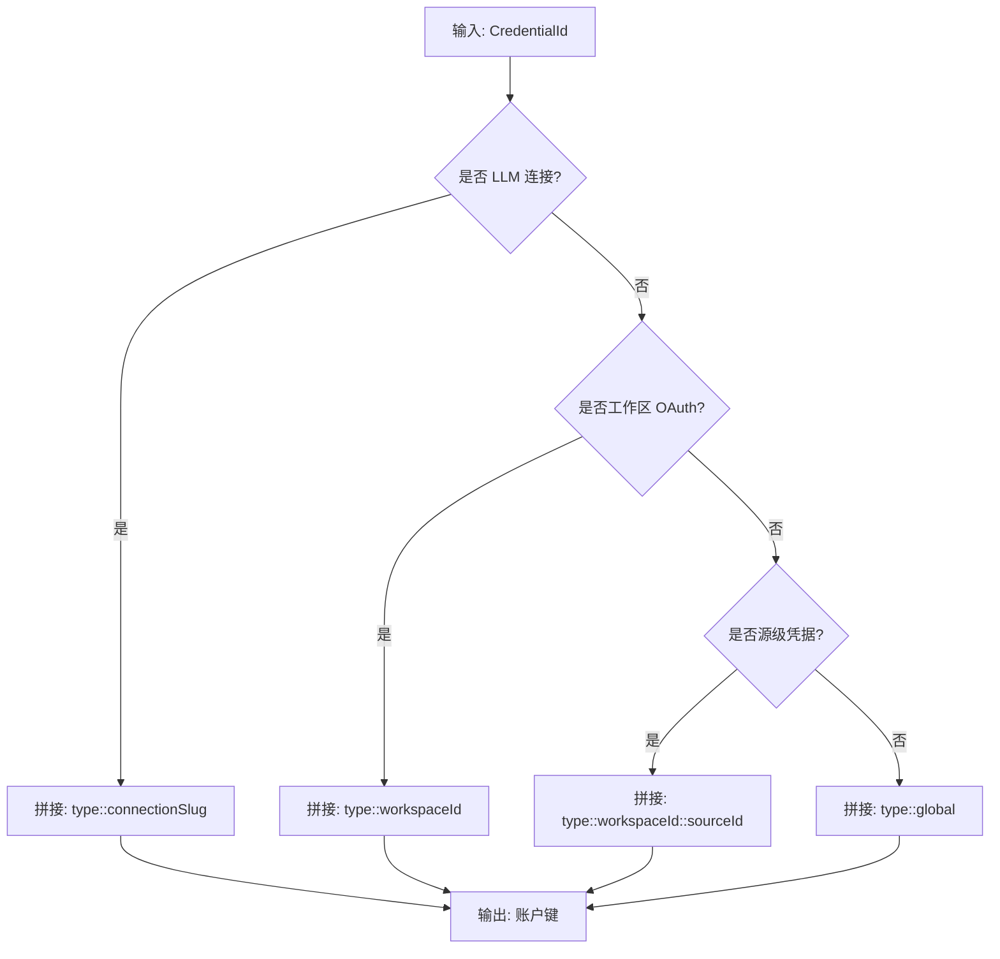
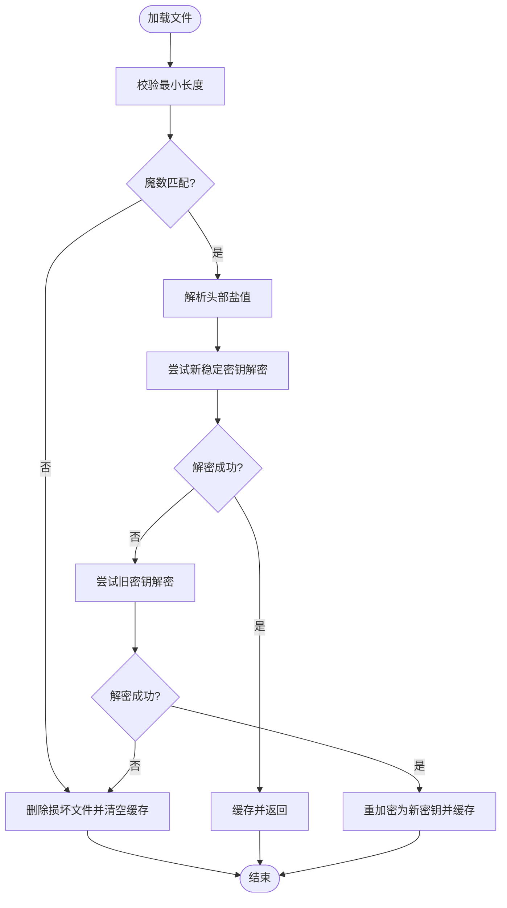
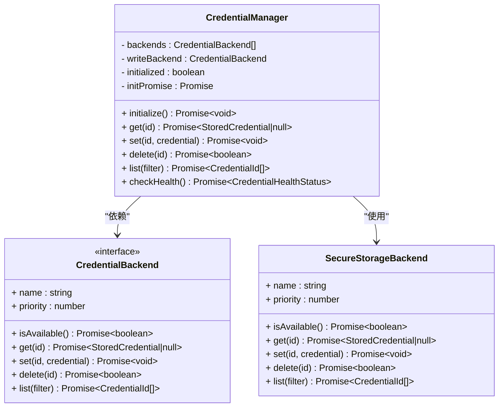
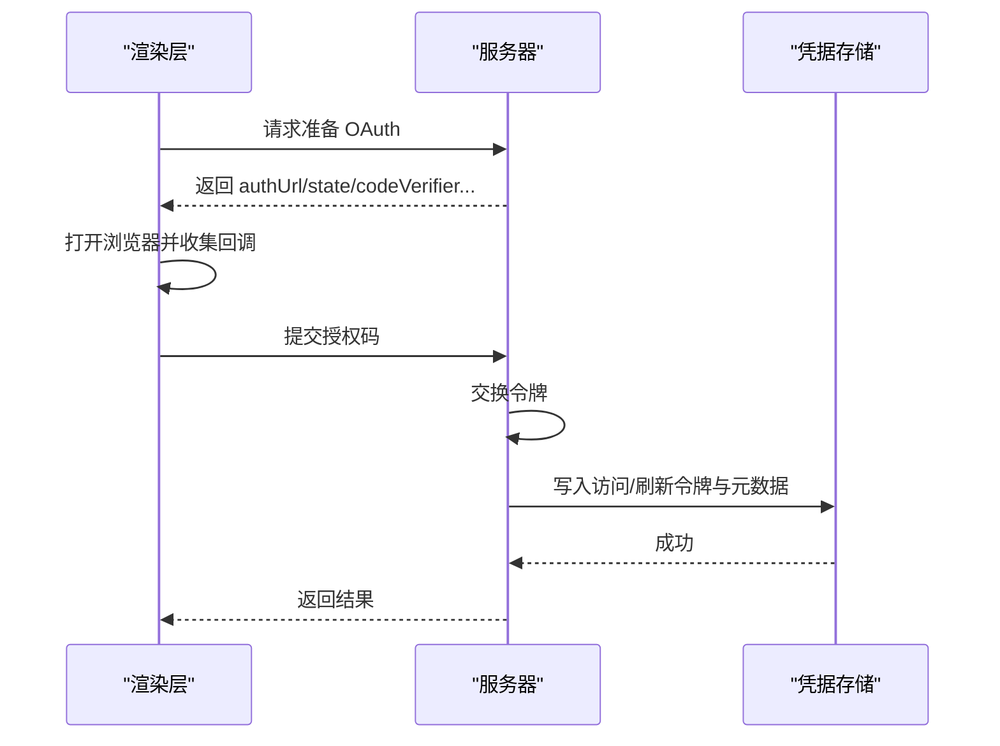
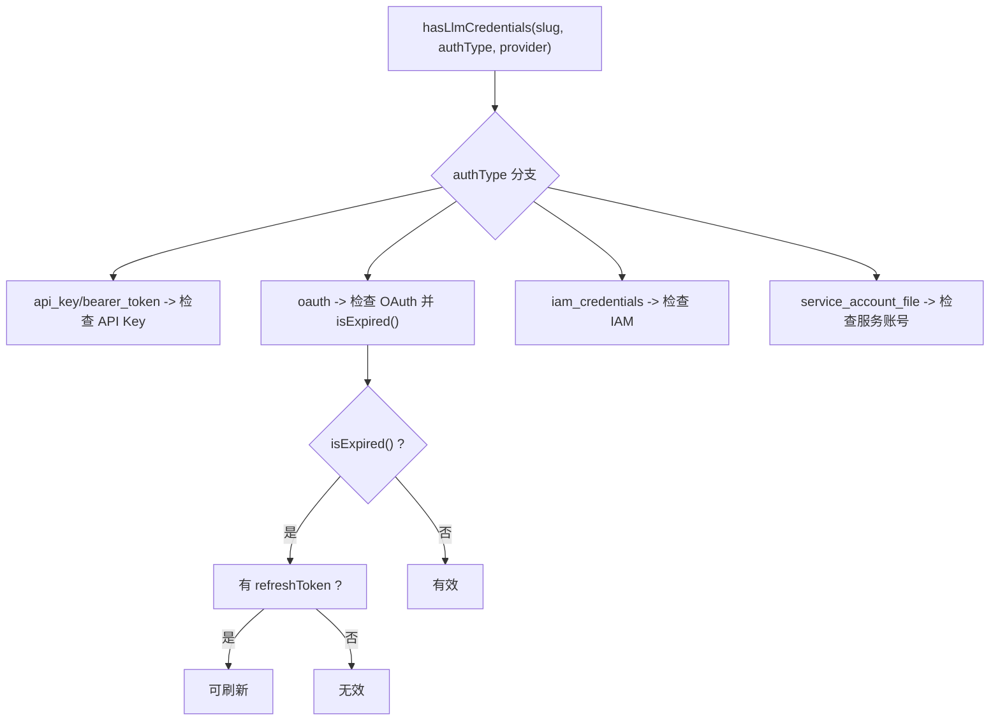
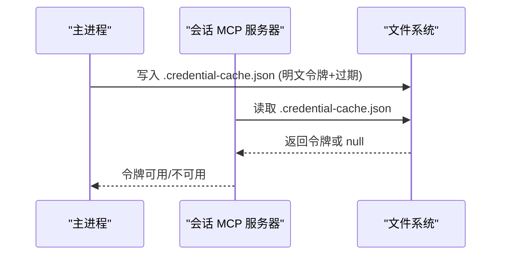
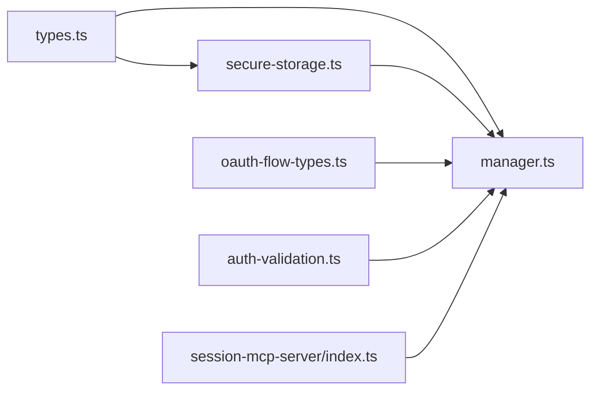

# 凭据管理

<cite>
**本文引用的文件**
- [packages/shared/src/credentials/index.ts](file://packages/shared/src/credentials/index.ts)
- [packages/shared/src/credentials/types.ts](file://packages/shared/src/credentials/types.ts)
- [packages/shared/src/credentials/backends/types.ts](file://packages/shared/src/credentials/backends/types.ts)
- [packages/shared/src/credentials/backends/secure-storage.ts](file://packages/shared/src/credentials/backends/secure-storage.ts)
- [packages/shared/src/credentials/manager.ts](file://packages/shared/src/credentials/manager.ts)
- [packages/shared/src/auth/oauth-flow-types.ts](file://packages/shared/src/auth/oauth-flow-types.ts)
- [apps/electron/src/renderer/utils/auth-validation.ts](file://apps/electron/src/renderer/utils/auth-validation.ts)
- [packages/session-mcp-server/src/index.ts](file://packages/session-mcp-server/src/index.ts)
- [packages/session-tools-core/src/context.ts](file://packages/session-tools-core/src/context.ts)
</cite>

## 目录

1. [简介](#简介)
2. [项目结构](#项目结构)
3. [核心组件](#核心组件)
4. [架构总览](#架构总览)
5. [组件详解](#组件详解)
6. [依赖关系分析](#依赖关系分析)
7. [性能与安全特性](#性能与安全特性)
8. [故障排查指南](#故障排查指南)
9. [结论](#结论)
10. [附录：凭据类型与使用示例](#附录凭据类型与使用示例)

## 简介

本文件系统性阐述 Craft Agents 的凭据管理系统，覆盖凭据存储的安全实现、加密机制、访问控制、凭据类型与格式、过期管理与健康检查、以及常见安全问题的应对策略。文档以代码为依据，结合可视化图示，帮助初学者快速上手，同时为有经验的开发者提供足够的技术深度。

## 项目结构

凭据管理模块位于共享包中，采用“管理器 + 后端接口 + 具体后端”的分层设计：

- 管理器负责初始化、路由读写、统一查询与健康检查
- 后端接口定义统一能力边界
- 安全存储后端负责文件式加密存储与密钥派生

图表来源

- [packages/shared/src/credentials/index.ts](file://packages/shared/src/credentials/index.ts#L1-L29)
- [packages/shared/src/credentials/manager.ts](file://packages/shared/src/credentials/manager.ts#L1-L120)
- [packages/shared/src/credentials/backends/types.ts](file://packages/shared/src/credentials/backends/types.ts#L1-L32)
- [packages/shared/src/credentials/backends/secure-storage.ts](file://packages/shared/src/credentials/backends/secure-storage.ts#L1-L120)
- [packages/shared/src/credentials/types.ts](file://packages/shared/src/credentials/types.ts#L1-L60)

章节来源

- [packages/shared/src/credentials/index.ts](file://packages/shared/src/credentials/index.ts#L1-L29)
- [packages/shared/src/credentials/manager.ts](file://packages/shared/src/credentials/manager.ts#L1-L120)
- [packages/shared/src/credentials/backends/types.ts](file://packages/shared/src/credentials/backends/types.ts#L1-L32)
- [packages/shared/src/credentials/backends/secure-storage.ts](file://packages/shared/src/credentials/backends/secure-storage.ts#L1-L120)
- [packages/shared/src/credentials/types.ts](file://packages/shared/src/credentials/types.ts#L1-L60)

## 核心组件

- 凭据类型与键空间
  - 支持全局与作用域化凭据（工作区、源、LLM 连接）
  - 使用稳定分隔符组织键名，避免路径冲突
- 存储后端
  - 文件式加密存储，AES-256-GCM，带认证标签
  - 基于硬件稳定标识的密钥派生，兼顾迁移与安全
- 管理器
  - 自动初始化、多后端回退、统一查询与健康检查
  - 提供便捷方法，覆盖常用凭据场景

章节来源

- [packages/shared/src/credentials/types.ts](file://packages/shared/src/credentials/types.ts#L18-L186)
- [packages/shared/src/credentials/backends/secure-storage.ts](file://packages/shared/src/credentials/backends/secure-storage.ts#L43-L120)
- [packages/shared/src/credentials/manager.ts](file://packages/shared/src/credentials/manager.ts#L14-L120)

## 架构总览

下图展示从调用方到后端的完整流程，包括初始化、读取、写入、删除与健康检查。

图表来源

- [packages/shared/src/credentials/manager.ts](file://packages/shared/src/credentials/manager.ts#L87-L168)
- [packages/shared/src/credentials/backends/secure-storage.ts](file://packages/shared/src/credentials/backends/secure-storage.ts#L124-L184)

章节来源

- [packages/shared/src/credentials/manager.ts](file://packages/shared/src/credentials/manager.ts#L83-L168)
- [packages/shared/src/credentials/backends/secure-storage.ts](file://packages/shared/src/credentials/backends/secure-storage.ts#L124-L184)

## 组件详解

### 类型与键空间

- 凭据类型
  - 全局类：如 Anthropic API Key、Claude OAuth
  - LLM 连接类：API Key/OAuth、IAM、服务账号
  - 工作区类：MCP 工作区 OAuth
  - 源类：OAuth/Bearer/API Key/Basic
- 键命名规则
  - 使用双冒号分隔，支持连接 slug、工作区 ID、源 ID、名称等
  - 通过工具函数在对象与字符串之间转换，保证一致性

图表来源

- [packages/shared/src/credentials/types.ts](file://packages/shared/src/credentials/types.ts#L157-L186)

章节来源

- [packages/shared/src/credentials/types.ts](file://packages/shared/src/credentials/types.ts#L18-L186)

### 安全存储后端（文件式加密）

- 文件位置与格式
  - 位置：用户主目录下的隐藏目录
  - 头部包含魔数、标志位、盐值；后续为随机 IV、认证标签与密文
- 加密与密钥派生
  - 算法：AES-256-GCM（带认证标签）
  - 密钥：基于稳定硬件标识经哈希与 PBKDF2 派生
  - 迭代次数：平衡安全与启动时间
- 兼容性与迁移
  - 支持旧版（主机名+用户名）派生密钥解密
  - 首次成功解密后自动重加密为新稳定密钥
- 容错处理
  - 文件损坏时删除并清空缓存，引导重新认证

图表来源

- [packages/shared/src/credentials/backends/secure-storage.ts](file://packages/shared/src/credentials/backends/secure-storage.ts#L190-L248)
- [packages/shared/src/credentials/backends/secure-storage.ts](file://packages/shared/src/credentials/backends/secure-storage.ts#L269-L305)

章节来源

- [packages/shared/src/credentials/backends/secure-storage.ts](file://packages/shared/src/credentials/backends/secure-storage.ts#L43-L120)
- [packages/shared/src/credentials/backends/secure-storage.ts](file://packages/shared/src/credentials/backends/secure-storage.ts#L190-L305)

### 凭据管理器（统一入口）

- 初始化与并发保护
  - 单例懒加载，内部确保初始化完成
  - 防止并发初始化，失败可重试
- 读写与删除
  - 读取按优先级遍历后端；写入使用最高优先级后端
  - 删除在所有后端执行，返回是否至少一次成功
- 列表与去重
  - 合并多个后端结果，去重后返回
- 健康检查
  - 尝试列出凭据触发解密；根据错误关键词识别“解密失败”“文件损坏”
  - 可选检查默认 LLM 连接是否有有效凭据

图表来源

- [packages/shared/src/credentials/manager.ts](file://packages/shared/src/credentials/manager.ts#L14-L168)
- [packages/shared/src/credentials/backends/types.ts](file://packages/shared/src/credentials/backends/types.ts#L10-L31)
- [packages/shared/src/credentials/backends/secure-storage.ts](file://packages/shared/src/credentials/backends/secure-storage.ts#L111-L184)

章节来源

- [packages/shared/src/credentials/manager.ts](file://packages/shared/src/credentials/manager.ts#L14-L168)
- [packages/shared/src/credentials/backends/types.ts](file://packages/shared/src/credentials/backends/types.ts#L10-L31)
- [packages/shared/src/credentials/backends/secure-storage.ts](file://packages/shared/src/credentials/backends/secure-storage.ts#L111-L184)

### OAuth 流程与凭据存储

- 服务器侧准备与交换
  - 准备阶段生成授权 URL、状态、PKCE、客户端信息与令牌端点
  - 交换阶段将授权码兑换为访问/刷新令牌，并持久化到凭据存储
- 客户端验证与提交
  - 渲染层提供基础认证参数校验与占位提示，确保提交安全

图表来源

- [packages/shared/src/auth/oauth-flow-types.ts](file://packages/shared/src/auth/oauth-flow-types.ts#L17-L57)
- [packages/shared/src/credentials/manager.ts](file://packages/shared/src/credentials/manager.ts#L331-L344)

章节来源

- [packages/shared/src/auth/oauth-flow-types.ts](file://packages/shared/src/auth/oauth-flow-types.ts#L1-L58)
- [packages/shared/src/credentials/manager.ts](file://packages/shared/src/credentials/manager.ts#L331-L344)
- [apps/electron/src/renderer/utils/auth-validation.ts](file://apps/electron/src/renderer/utils/auth-validation.ts#L14-L40)

### 过期管理与健康检查

- 过期判定
  - 以毫秒时间戳为准，预留缓冲窗口
  - OAuth 无过期时间但有刷新令牌时按需刷新
- 健康检查
  - 解密失败：通常表示跨机器迁移，提示重新认证
  - JSON 解析失败：文件损坏，提示重新认证
  - 默认连接缺失凭据：提示用户配置

图表来源

- [packages/shared/src/credentials/manager.ts](file://packages/shared/src/credentials/manager.ts#L458-L565)
- [packages/shared/src/credentials/manager.ts](file://packages/shared/src/credentials/manager.ts#L582-L652)

章节来源

- [packages/shared/src/credentials/manager.ts](file://packages/shared/src/credentials/manager.ts#L458-L565)
- [packages/shared/src/credentials/manager.ts](file://packages/shared/src/credentials/manager.ts#L582-L652)

### 子进程与缓存访问（会话 MCP 服务器）

- 主进程写缓存，子进程只读
  - 缓存文件位于工作区源目录下，包含明文访问令牌与过期时间
  - 子进程读取缓存进行鉴权，不直接访问系统钥匙串
- 访问控制
  - 仅限当前会话可用；过期即失效

图表来源

- [packages/session-mcp-server/src/index.ts](file://packages/session-mcp-server/src/index.ts#L86-L145)

章节来源

- [packages/session-mcp-server/src/index.ts](file://packages/session-mcp-server/src/index.ts#L86-L145)
- [packages/session-tools-core/src/context.ts](file://packages/session-tools-core/src/context.ts#L100-L115)

## 依赖关系分析

- 模块内聚与耦合
  - 管理器与后端通过接口解耦，便于扩展其他后端
  - 类型与工具集中于 types.ts，避免重复与不一致
- 外部依赖
  - Node.js crypto、fs、path、os
  - 平台命令（macOS/ioreg、Windows/reg、Linux/machine-id）

图表来源

- [packages/shared/src/credentials/types.ts](file://packages/shared/src/credentials/types.ts#L1-L60)
- [packages/shared/src/credentials/manager.ts](file://packages/shared/src/credentials/manager.ts#L1-L120)
- [packages/shared/src/credentials/backends/secure-storage.ts](file://packages/shared/src/credentials/backends/secure-storage.ts#L1-L120)
- [packages/shared/src/auth/oauth-flow-types.ts](file://packages/shared/src/auth/oauth-flow-types.ts#L1-L58)
- [apps/electron/src/renderer/utils/auth-validation.ts](file://apps/electron/src/renderer/utils/auth-validation.ts#L1-L71)
- [packages/session-mcp-server/src/index.ts](file://packages/session-mcp-server/src/index.ts#L86-L145)

章节来源

- [packages/shared/src/credentials/types.ts](file://packages/shared/src/credentials/types.ts#L1-L60)
- [packages/shared/src/credentials/manager.ts](file://packages/shared/src/credentials/manager.ts#L1-L120)
- [packages/shared/src/credentials/backends/secure-storage.ts](file://packages/shared/src/credentials/backends/secure-storage.ts#L1-L120)
- [packages/shared/src/auth/oauth-flow-types.ts](file://packages/shared/src/auth/oauth-flow-types.ts#L1-L58)
- [apps/electron/src/renderer/utils/auth-validation.ts](file://apps/electron/src/renderer/utils/auth-validation.ts#L1-L71)
- [packages/session-mcp-server/src/index.ts](file://packages/session-mcp-server/src/index.ts#L86-L145)

## 性能与安全特性

- 性能
  - 写入时每次生成新随机 IV，GCM 认证标签随密文附带，保证完整性
  - 启动时仅在首次访问时加载与解密，后续缓存命中
- 安全
  - AES-256-GCM 提供机密性与完整性
  - PBKDF2 迭代次数适中，兼顾安全与启动速度
  - 基于硬件稳定标识派生密钥，减少跨机器迁移风险
  - 文件权限严格（仅属主读写），降低本地泄露风险
  - 旧版密钥兼容与自动迁移，避免用户感知中断

章节来源

- [packages/shared/src/credentials/backends/secure-storage.ts](file://packages/shared/src/credentials/backends/secure-storage.ts#L269-L305)
- [packages/shared/src/credentials/backends/secure-storage.ts](file://packages/shared/src/credentials/backends/secure-storage.ts#L307-L336)

## 故障排查指南

- 解密失败（跨机器迁移）
  - 现象：健康检查报告“解密失败”
  - 处理：重新认证以生成新密钥与加密文件
- 文件损坏
  - 现象：健康检查报告“文件损坏”，或 JSON 解析异常
  - 处理：删除损坏文件后重新认证
- 默认连接缺凭据
  - 现象：健康检查提示默认连接缺少凭据
  - 处理：在设置中为默认连接配置相应凭据
- OAuth 无过期时间
  - 现象：OAuth 令牌未携带过期时间
  - 处理：系统按需视为过期并尝试刷新（若存在刷新令牌）

章节来源

- [packages/shared/src/credentials/manager.ts](file://packages/shared/src/credentials/manager.ts#L582-L652)
- [packages/shared/src/credentials/manager.ts](file://packages/shared/src/credentials/manager.ts#L549-L565)

## 结论

该凭据管理方案以“文件式加密 + 稳定密钥派生 + 统一管理器”为核心，兼顾跨平台兼容性与安全性。通过清晰的类型体系、严格的过期与健康检查机制，以及对迁移与损坏的容错处理，为用户提供可靠且易用的凭据管理体验。

## 附录：凭据类型与使用示例

- 全局类
  - Anthropic API Key、Claude OAuth
- LLM 连接类
  - API Key/OAuth、IAM、服务账号（按连接 slug 索引）
- 工作区类
  - 工作区 OAuth（按工作区 ID 索引）
- 源类
  - OAuth/Bearer/API Key/Basic（按工作区与源 ID 索引）
- 使用要点
  - 通过管理器提供的便捷方法读写常用凭据
  - 对于自定义场景，使用通用 get/set/delete/list 并构造 CredentialId
  - 在会话子进程中通过缓存文件读取明文令牌，避免直接访问钥匙串

章节来源

- [packages/shared/src/credentials/types.ts](file://packages/shared/src/credentials/types.ts#L18-L186)
- [packages/shared/src/credentials/manager.ts](file://packages/shared/src/credentials/manager.ts#L174-L443)
- [packages/session-mcp-server/src/index.ts](file://packages/session-mcp-server/src/index.ts#L129-L145)
