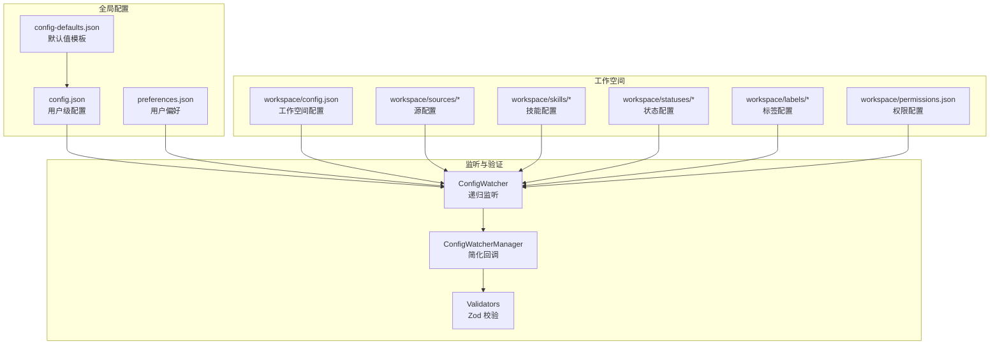
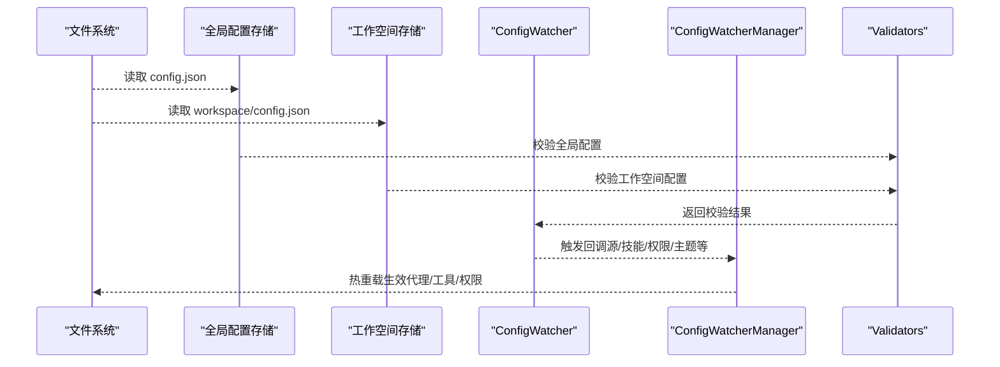
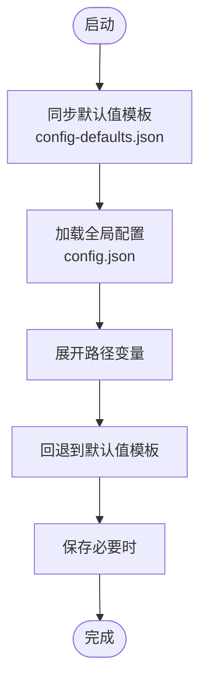
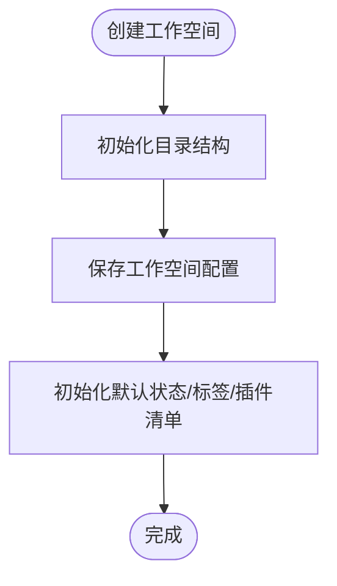
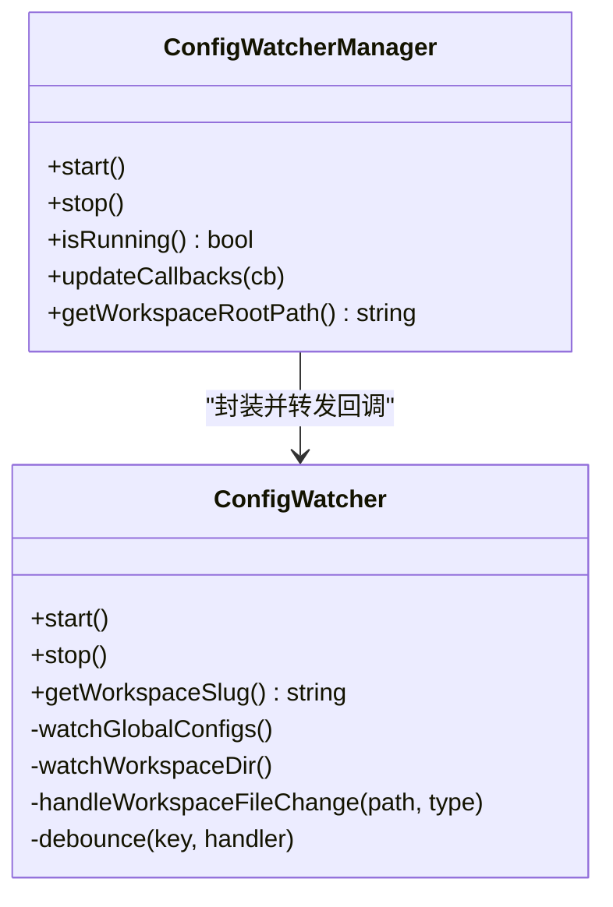
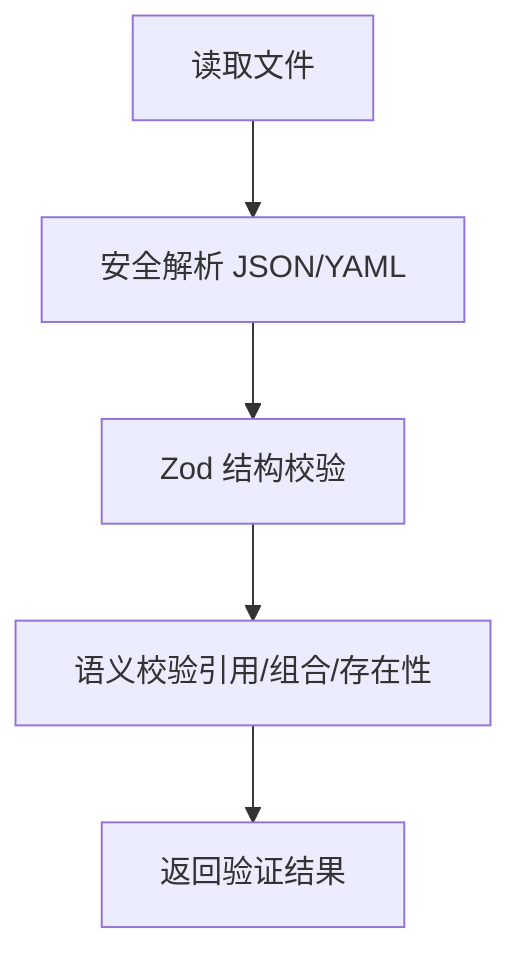
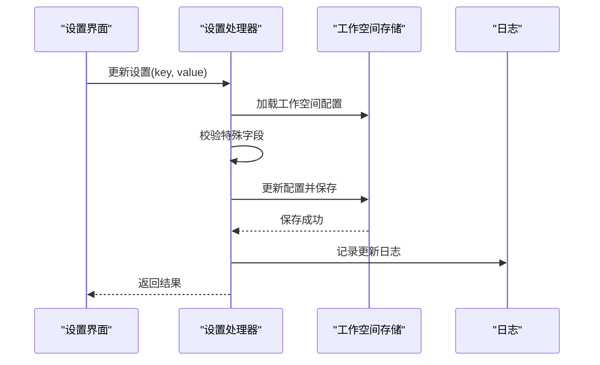
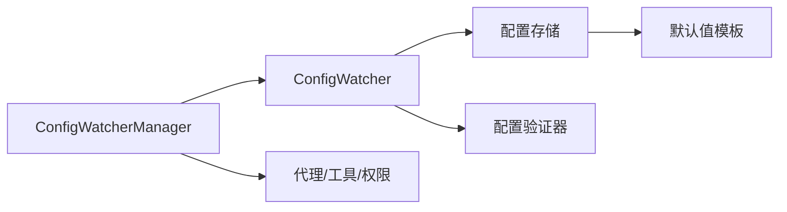

# 应用配置

<cite>
**本文引用的文件**
- [packages/shared/src/config/storage.ts](file://packages/shared/src/config/storage.ts)
- [packages/shared/src/workspaces/storage.ts](file://packages/shared/src/workspaces/storage.ts)
- [apps/electron/resources/config-defaults.json](file://apps/electron/resources/config-defaults.json)
- [packages/shared/src/config/watcher.ts](file://packages/shared/src/config/watcher.ts)
- [packages/shared/src/agent/core/config-watcher-manager.ts](file://packages/shared/src/agent/core/config-watcher-manager.ts)
- [packages/shared/src/config/validators.ts](file://packages/shared/src/config/validators.ts)
- [packages/shared/src/config/config-defaults-schema.ts](file://packages/shared/src/config/config-defaults-schema.ts)
- [apps/electron/src/main/handlers/settings.ts](file://apps/electron/src/main/handlers/settings.ts)
- [packages/server-core/src/handlers/rpc/settings.ts](file://packages/server-core/src/handlers/rpc/settings.ts)
</cite>

## 目录

1. [简介](#简介)
2. [项目结构](#项目结构)
3. [核心组件](#核心组件)
4. [架构总览](#架构总览)
5. [详细组件分析](#详细组件分析)
6. [依赖分析](#依赖分析)
7. [性能考虑](#性能考虑)
8. [故障排查指南](#故障排查指南)
9. [结论](#结论)
10. [附录](#附录)

## 简介

本文件系统性阐述 Craft Agents 的应用配置系统，覆盖全局配置与工作空间配置的实现细节、调用关系、接口与使用模式。内容包括：

- 配置存储策略（用户目录、跨机器兼容路径、原子写入）
- 默认值管理（从打包资源同步到本地、类型约束）
- 配置验证（Zod 模式校验、语义校验、错误与警告）
- 动态更新机制（文件监听、热重载、回调分发）
- 配置文件结构、配置项分类与优先级
- 冲突处理、迁移与备份建议
- 对初学者友好的解释与面向高级用户的深度分析

## 项目结构

配置系统主要由以下模块构成：

- 全局配置存储：负责用户级配置、偏好、主题、LLM 连接等
- 工作空间配置存储：负责每个工作空间的独立配置与默认值
- 配置默认值：从打包资源同步到本地的默认模板
- 配置监听器：递归监听配置变更并触发回调
- 配置验证器：基于 Zod 的强类型校验与语义校验
- 设置处理器：桌面端与服务端的设置读写入口

图表来源

- [packages/shared/src/config/storage.ts](file://packages/shared/src/config/storage.ts#L141-L201)
- [packages/shared/src/workspaces/storage.ts](file://packages/shared/src/workspaces/storage.ts#L97-L139)
- [packages/shared/src/config/watcher.ts](file://packages/shared/src/config/watcher.ts#L180-L275)
- [packages/shared/src/agent/core/config-watcher-manager.ts](file://packages/shared/src/agent/core/config-watcher-manager.ts#L124-L246)
- [packages/shared/src/config/validators.ts](file://packages/shared/src/config/validators.ts#L134-L242)

章节来源

- [packages/shared/src/config/storage.ts](file://packages/shared/src/config/storage.ts#L141-L201)
- [packages/shared/src/workspaces/storage.ts](file://packages/shared/src/workspaces/storage.ts#L97-L139)

## 核心组件

- 全局配置存储与默认值
  - 负责加载/保存全局配置、偏好、主题、LLM 连接等
  - 通过“默认值模板”确保新安装或升级后具备一致的初始值
- 工作空间配置存储
  - 每个工作空间拥有独立的 config.json，默认值可继承全局默认值
  - 支持工作空间级颜色主题、权限模式、MCP 服务器开关等
- 配置监听与热重载
  - 递归监听配置目录，按文件粒度去抖动处理，触发统一回调
  - 提供简化版回调封装，便于代理热重载
- 配置验证
  - 使用 Zod 对 JSON 结构进行强类型校验
  - 执行语义校验（如连接 slug 唯一性、默认连接存在性等）

章节来源

- [packages/shared/src/config/storage.ts](file://packages/shared/src/config/storage.ts#L112-L125)
- [packages/shared/src/workspaces/storage.ts](file://packages/shared/src/workspaces/storage.ts#L267-L322)
- [packages/shared/src/config/watcher.ts](file://packages/shared/src/config/watcher.ts#L180-L275)
- [packages/shared/src/agent/core/config-watcher-manager.ts](file://packages/shared/src/agent/core/config-watcher-manager.ts#L124-L246)
- [packages/shared/src/config/validators.ts](file://packages/shared/src/config/validators.ts#L134-L242)

## 架构总览

下图展示配置系统的数据流与交互：从磁盘文件到内存模型，再到监听与验证，最终驱动 UI 或代理热重载。

图表来源

- [packages/shared/src/config/storage.ts](file://packages/shared/src/config/storage.ts#L141-L201)
- [packages/shared/src/workspaces/storage.ts](file://packages/shared/src/workspaces/storage.ts#L97-L139)
- [packages/shared/src/config/watcher.ts](file://packages/shared/src/config/watcher.ts#L795-L800)
- [packages/shared/src/agent/core/config-watcher-manager.ts](file://packages/shared/src/agent/core/config-watcher-manager.ts#L153-L200)
- [packages/shared/src/config/validators.ts](file://packages/shared/src/config/validators.ts#L324-L353)

## 详细组件分析

### 全局配置存储与默认值

- 默认值来源与同步
  - 启动时从打包资源复制默认值模板到用户目录，保证版本一致性
  - 默认值模板定义了应用层默认项（如通知、主题、输入行为等）与工作空间默认项（如权限模式、MCP 开关等）
- 全局配置文件结构
  - 包含工作空间列表、活动工作空间、活动会话、LLM 连接、默认连接、用户偏好等
  - 路径变量在加载时展开，保存时转换为便携路径
- 默认值获取与回退
  - 若用户未显式设置某项，则回退到默认值模板中的对应字段
- 重要函数与职责
  - 加载/保存全局配置
  - 同步默认值模板
  - 获取/设置各类应用级配置项（通知、自动大写、发送键、拼写检查、保持唤醒、富工具描述、Git Bash 路径等）
  - 工作空间增删改查、活动工作空间切换、会话持久化等

图表来源

- [packages/shared/src/config/storage.ts](file://packages/shared/src/config/storage.ts#L85-L125)
- [packages/shared/src/config/storage.ts](file://packages/shared/src/config/storage.ts#L141-L182)
- [apps/electron/resources/config-defaults.json](file://apps/electron/resources/config-defaults.json#L1-L22)

章节来源

- [packages/shared/src/config/storage.ts](file://packages/shared/src/config/storage.ts#L85-L125)
- [packages/shared/src/config/storage.ts](file://packages/shared/src/config/storage.ts#L141-L182)
- [apps/electron/resources/config-defaults.json](file://apps/electron/resources/config-defaults.json#L1-L22)
- [packages/shared/src/config/config-defaults-schema.ts](file://packages/shared/src/config/config-defaults-schema.ts#L11-L31)

### 工作空间配置存储

- 工作空间配置文件
  - 每个工作空间根目录下的 config.json 定义该工作空间的默认值与元信息
  - 默认值可继承全局默认值模板，也可覆盖特定字段（如颜色主题、权限模式、MCP 开关、工作目录等）
- 路径与便携性
  - 读取时展开路径变量，保存时转换为便携路径（如 ~ 前缀），提升跨机器兼容性
- 初始化与迁移
  - 创建工作空间时自动生成目录结构、默认状态/标签配置、插件清单等
  - 发现默认位置的工作空间并合并到全局配置中
- 关键能力
  - 加载/保存工作空间配置
  - 获取/设置工作空间颜色主题
  - 判断本地 MCP 服务器启用状态（支持环境变量覆盖）

图表来源

- [packages/shared/src/workspaces/storage.ts](file://packages/shared/src/workspaces/storage.ts#L267-L322)
- [packages/shared/src/workspaces/storage.ts](file://packages/shared/src/workspaces/storage.ts#L97-L139)
- [packages/shared/src/workspaces/storage.ts](file://packages/shared/src/workspaces/storage.ts#L447-L469)

章节来源

- [packages/shared/src/workspaces/storage.ts](file://packages/shared/src/workspaces/storage.ts#L97-L139)
- [packages/shared/src/workspaces/storage.ts](file://packages/shared/src/workspaces/storage.ts#L267-L322)
- [packages/shared/src/workspaces/storage.ts](file://packages/shared/src/workspaces/storage.ts#L447-L469)

### 配置监听与热重载

- 监听范围
  - 全局：config.json、preferences.json、theme.json、preset themes 目录
  - 工作空间：sources、skills、statuses、labels、permissions、sessions 等
- 去抖动与事件分发
  - 对同一文件的频繁变更进行去抖动合并，降低回调风暴
  - 将复杂回调映射为代理关注的简化回调（源/技能/权限/主题等）
- 头模式支持
  - 在无 UI 的头模式下禁用监听以减少开销
- 错误与验证
  - 文件读取/解析错误与验证失败均通过回调上报

图表来源

- [packages/shared/src/config/watcher.ts](file://packages/shared/src/config/watcher.ts#L180-L275)
- [packages/shared/src/agent/core/config-watcher-manager.ts](file://packages/shared/src/agent/core/config-watcher-manager.ts#L124-L246)

章节来源

- [packages/shared/src/config/watcher.ts](file://packages/shared/src/config/watcher.ts#L180-L275)
- [packages/shared/src/agent/core/config-watcher-manager.ts](file://packages/shared/src/agent/core/config-watcher-manager.ts#L124-L246)

### 配置验证

- 全局配置校验
  - 结构校验：Zod 模式匹配
  - 语义校验：活动工作空间存在性、LLM 连接唯一性与组合有效性、默认连接引用存在性
- 工作空间配置校验
  - 源配置：类型与传输参数一致性、必需字段存在性、缺少 guide.md 警告
  - 技能配置：frontmatter 结构、正文非空、图标格式与存在性
- 统一输出
  - 返回统一的验证结果对象，包含错误与警告，支持格式化输出

图表来源

- [packages/shared/src/config/validators.ts](file://packages/shared/src/config/validators.ts#L134-L242)
- [packages/shared/src/config/validators.ts](file://packages/shared/src/config/validators.ts#L494-L557)
- [packages/shared/src/config/validators.ts](file://packages/shared/src/config/validators.ts#L651-L739)

章节来源

- [packages/shared/src/config/validators.ts](file://packages/shared/src/config/validators.ts#L134-L242)
- [packages/shared/src/config/validators.ts](file://packages/shared/src/config/validators.ts#L494-L557)
- [packages/shared/src/config/validators.ts](file://packages/shared/src/config/validators.ts#L651-L739)

### 设置读写接口（桌面端与服务端）

- 桌面端设置处理器
  - 校验关键字段（如默认 LLM 连接存在性）
  - 更新工作空间配置（name、localMcpEnabled、defaults 下的键值）
  - 保存并记录日志
- 服务端 RPC 设置处理器
  - 与桌面端类似，但通过 RPC 通道接收请求
  - 保存工作空间配置并记录日志

图表来源

- [apps/electron/src/main/handlers/settings.ts](file://apps/electron/src/main/handlers/settings.ts#L106-L136)
- [packages/server-core/src/handlers/rpc/settings.ts](file://packages/server-core/src/handlers/rpc/settings.ts#L112-L141)

章节来源

- [apps/electron/src/main/handlers/settings.ts](file://apps/electron/src/main/handlers/settings.ts#L106-L136)
- [packages/server-core/src/handlers/rpc/settings.ts](file://packages/server-core/src/handlers/rpc/settings.ts#L112-L141)

## 依赖分析

- 组件耦合
  - ConfigWatcherManager 依赖 ConfigWatcher，仅暴露代理关心的回调
  - ConfigWatcher 依赖存储与验证模块，负责文件系统事件与回调分发
  - 全局与工作空间存储共享默认值模板，形成“模板-实例”的继承关系
- 外部依赖
  - Zod：用于强类型与语义校验
  - 文件系统：递归监听、原子写入、路径展开/便携化
- 循环依赖
  - 未发现直接循环依赖；验证器与存储器通过接口解耦

图表来源

- [packages/shared/src/config/watcher.ts](file://packages/shared/src/config/watcher.ts#L180-L275)
- [packages/shared/src/agent/core/config-watcher-manager.ts](file://packages/shared/src/agent/core/config-watcher-manager.ts#L124-L246)
- [packages/shared/src/config/storage.ts](file://packages/shared/src/config/storage.ts#L112-L125)
- [packages/shared/src/config/validators.ts](file://packages/shared/src/config/validators.ts#L134-L242)

章节来源

- [packages/shared/src/config/watcher.ts](file://packages/shared/src/config/watcher.ts#L180-L275)
- [packages/shared/src/agent/core/config-watcher-manager.ts](file://packages/shared/src/agent/core/config-watcher-manager.ts#L124-L246)
- [packages/shared/src/config/storage.ts](file://packages/shared/src/config/storage.ts#L112-L125)
- [packages/shared/src/config/validators.ts](file://packages/shared/src/config/validators.ts#L134-L242)

## 性能考虑

- 去抖动与批量处理
  - 对同一文件的多次变更进行去抖动合并，避免回调风暴
- 递归监听与最小化扫描
  - 仅监听关键目录与文件，减少不必要的文件系统开销
- 原子写入与便携路径
  - 使用原子写入防止崩溃导致的数据损坏
  - 便携路径减少跨平台差异带来的 IO 成本
- 头模式优化
  - 在无 UI 的头模式下禁用监听，降低资源占用

## 故障排查指南

- 配置文件损坏
  - 现象：无法解析 config.json 或 workspace/config.json
  - 处理：删除或修复 JSON；若仍失败，可重新生成工作空间配置
- 默认值未生效
  - 现象：新安装或升级后某些默认值缺失
  - 处理：确认默认值模板已同步；重启应用以强制同步
- LLM 连接无效
  - 现象：默认连接不存在或认证组合不合法
  - 处理：检查连接列表与组合有效性；修正后重试
- 权限/源/技能配置错误
  - 现象：源/技能配置报错或缺少必要文件
  - 处理：根据验证器返回的错误与建议修复；确保 guide.md、SKILL.md、图标等文件齐全
- 热重载不生效
  - 现象：修改配置后未触发代理/工具/权限更新
  - 处理：检查监听是否运行；查看回调日志；确认文件路径正确且未被忽略

章节来源

- [packages/shared/src/config/validators.ts](file://packages/shared/src/config/validators.ts#L134-L242)
- [packages/shared/src/config/validators.ts](file://packages/shared/src/config/validators.ts#L494-L557)
- [packages/shared/src/config/validators.ts](file://packages/shared/src/config/validators.ts#L651-L739)
- [packages/shared/src/config/watcher.ts](file://packages/shared/src/config/watcher.ts#L291-L315)

## 结论

Craft Agents 的配置系统以“模板-实例”为核心，结合强类型验证、递归监听与热重载，实现了稳定、可扩展且对用户友好的配置体验。全局配置与工作空间配置分离清晰，优先级明确，配合默认值模板与便携路径策略，既保证了升级一致性，又提升了跨平台兼容性。通过统一的验证器与监听器，系统能够及时发现并反馈配置问题，保障运行稳定性。

## 附录

- 配置文件结构与优先级
  - 全局：config.json（活动工作空间、LLM 连接、应用偏好等）
  - 工作空间：workspace/config.json（继承全局默认值，可覆盖）
  - 默认值：config-defaults.json（打包资源同步至用户目录）
- 配置项分类
  - 应用层：通知、主题、输入行为、保持唤醒、富工具描述等
  - 工作空间层：权限模式、MCP 开关、工作目录、颜色主题等
- 配置迁移与备份建议
  - 迁移：创建工作空间时自动初始化默认配置；发现默认位置工作空间时自动合并
  - 备份：定期备份 ~/.craft-agent 目录；更新前保留 config.json 与 workspace/config.json
