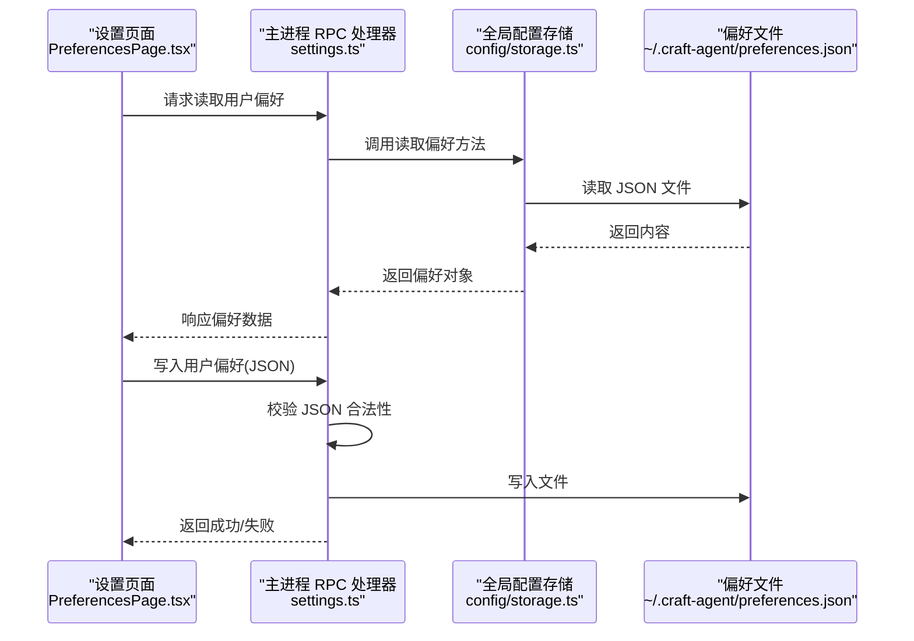
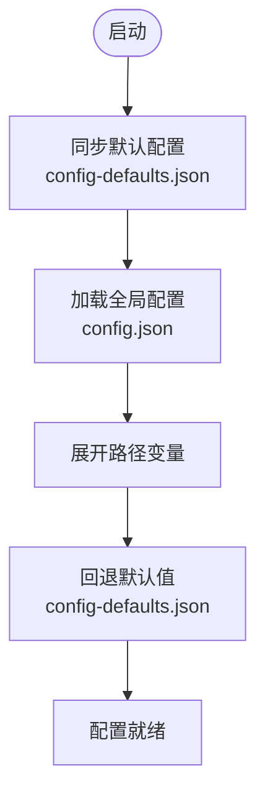
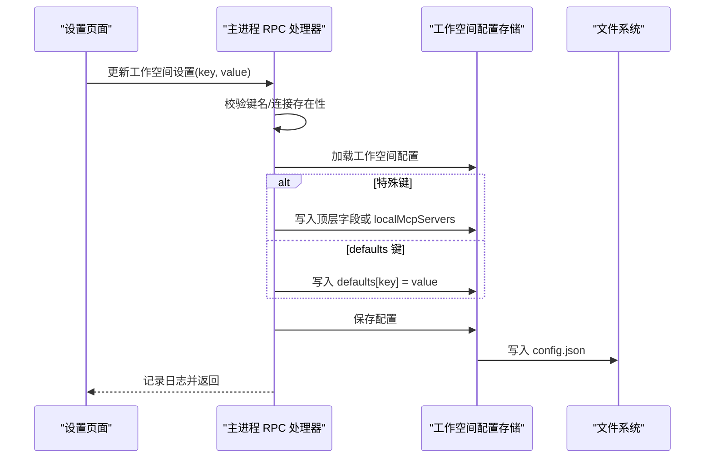
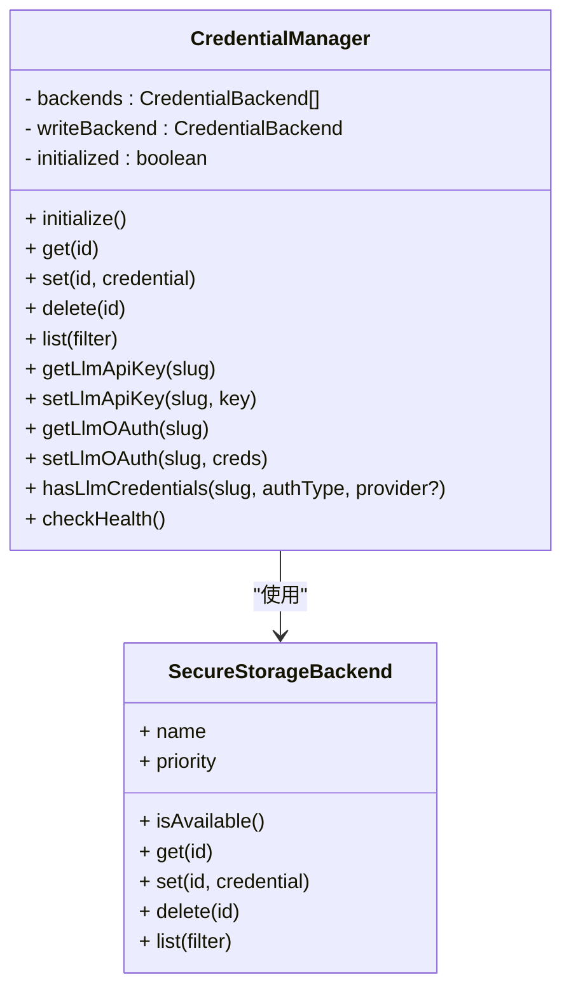
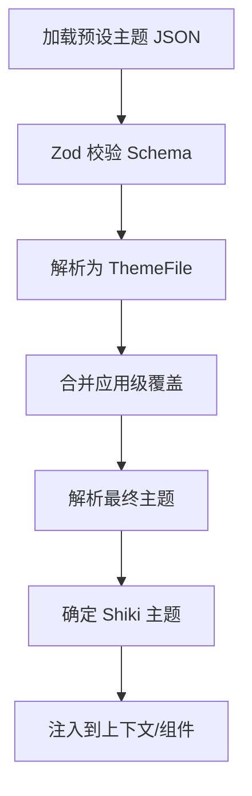
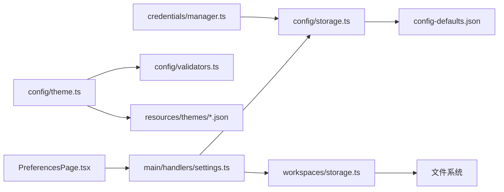

# 配置管理

<cite>
**本文引用的文件**
- [packages/shared/src/config/storage.ts](file://packages/shared/src/config/storage.ts)
- [apps/electron/resources/config-defaults.json](file://apps/electron/resources/config-defaults.json)
- [packages/shared/src/workspaces/storage.ts](file://packages/shared/src/workspaces/storage.ts)
- [apps/electron/src/main/handlers/settings.ts](file://apps/electron/src/main/handlers/settings.ts)
- [packages/shared/src/credentials/manager.ts](file://packages/shared/src/credentials/manager.ts)
- [packages/shared/src/sources/api-tools.ts](file://packages/shared/src/sources/api-tools.ts)
- [packages/shared/src/sources/credential-manager.ts](file://packages/shared/src/sources/credential-manager.ts)
- [packages/shared/src/config/preferences.ts](file://packages/shared/src/config/preferences.ts)
- [apps/electron/src/renderer/pages/settings/PreferencesPage.tsx](file://apps/electron/src/renderer/pages/settings/PreferencesPage.tsx)
- [apps/electron/src/renderer/pages/settings/AppearanceSettingsPage.tsx](file://apps/electron/src/renderer/pages/settings/AppearanceSettingsPage.tsx)
- [apps/electron/src/renderer/hooks/useTheme.ts](file://apps/electron/src/renderer/hooks/useTheme.ts)
- [packages/shared/src/config/theme.ts](file://packages/shared/src/config/theme.ts)
- [packages/shared/src/config/validators.ts](file://packages/shared/src/config/validators.ts)
- [apps/electron/resources/themes/default.json](file://apps/electron/resources/themes/default.json)
- [packages/server-core/src/handlers/rpc/settings.ts](file://packages/server-core/src/handlers/rpc/settings.ts)
</cite>

## 目录

1. [简介](#简介)
2. [项目结构](#项目结构)
3. [核心组件](#核心组件)
4. [架构总览](#架构总览)
5. [详细组件分析](#详细组件分析)
6. [依赖分析](#依赖分析)
7. [性能考量](#性能考量)
8. [故障排查指南](#故障排查指南)
9. [结论](#结论)
10. [附录](#附录)

## 简介

本文件系统性阐述 Craft Agents 的配置管理子系统，覆盖全局配置、工作空间配置、凭据管理与主题系统，并解释配置存储策略与安全考虑。文档以代码为依据，提供调用关系、接口与使用模式说明，并给出常见问题与解决方案，兼顾初学者与高级开发者的阅读需求。

## 项目结构

配置管理涉及以下关键模块：

- 全局配置：用户偏好、输入设置、外观设置、更新与会话草稿等
- 工作空间配置：每个工作空间独立的默认值（如模型、权限模式、本地 MCP、默认连接等）
- 凭据管理：统一的安全凭据存储与健康检查
- 主题系统：预设主题与应用级覆盖

```mermaid
graph TB
subgraph "全局配置"
A["全局配置存储<br/>packages/shared/src/config/storage.ts"]
B["配置默认值<br/>apps/electron/resources/config-defaults.json"]
C["用户偏好页面<br/>apps/electron/src/renderer/pages/settings/PreferencesPage.tsx"]
D["偏好读写 RPC<br/>apps/electron/src/main/handlers/settings.ts"]
end
subgraph "工作空间配置"
E["工作空间配置存储<br/>packages/shared/src/workspaces/storage.ts"]
F["工作空间设置 RPC<br/>apps/electron/src/main/handlers/settings.ts"]
G["服务端工作空间设置处理<br/>packages/server-core/src/handlers/rpc/settings.ts"]
end
subgraph "凭据管理"
H["凭据管理器<br/>packages/shared/src/credentials/manager.ts"]
I["API 工具与认证头构建<br/>packages/shared/src/sources/api-tools.ts"]
J["源级凭据类型定义<br/>packages/shared/src/sources/credential-manager.ts"]
end
subgraph "主题系统"
K["主题解析与默认值<br/>packages/shared/src/config/theme.ts"]
L["主题校验 Schema<br/>packages/shared/src/config/validators.ts"]
M["预设主题文件<br/>apps/electron/resources/themes/default.json"]
N["主题 Hook<br/>apps/electron/src/renderer/hooks/useTheme.ts"]
end
A --- B
C --- D
E --- F
F --- G
H --- I
H --- J
K --- L
K --- M
N --- K
```

图表来源

- [packages/shared/src/config/storage.ts](file://packages/shared/src/config/storage.ts#L141-L201)
- [apps/electron/resources/config-defaults.json](file://apps/electron/resources/config-defaults.json#L1-L22)
- [apps/electron/src/renderer/pages/settings/PreferencesPage.tsx](file://apps/electron/src/renderer/pages/settings/PreferencesPage.tsx#L88-L174)
- [apps/electron/src/main/handlers/settings.ts](file://apps/electron/src/main/handlers/settings.ts#L142-L162)
- [packages/shared/src/workspaces/storage.ts](file://packages/shared/src/workspaces/storage.ts#L97-L135)
- [apps/electron/src/main/handlers/settings.ts](file://apps/electron/src/main/handlers/settings.ts#L69-L136)
- [packages/server-core/src/handlers/rpc/settings.ts](file://packages/server-core/src/handlers/rpc/settings.ts#L112-L128)
- [packages/shared/src/credentials/manager.ts](file://packages/shared/src/credentials/manager.ts#L1-L664)
- [packages/shared/src/sources/api-tools.ts](file://packages/shared/src/sources/api-tools.ts#L17-L46)
- [packages/shared/src/sources/credential-manager.ts](file://packages/shared/src/sources/credential-manager.ts#L57-L93)
- [packages/shared/src/config/theme.ts](file://packages/shared/src/config/theme.ts#L237-L317)
- [packages/shared/src/config/validators.ts](file://packages/shared/src/config/validators.ts#L1498-L1538)
- [apps/electron/resources/themes/default.json](file://apps/electron/resources/themes/default.json#L1-L26)
- [apps/electron/src/renderer/hooks/useTheme.ts](file://apps/electron/src/renderer/hooks/useTheme.ts#L1-L77)

章节来源

- [packages/shared/src/config/storage.ts](file://packages/shared/src/config/storage.ts#L141-L201)
- [apps/electron/resources/config-defaults.json](file://apps/electron/resources/config-defaults.json#L1-L22)

## 核心组件

- 全局配置存储与默认值同步
  - 负责加载/保存全局配置、路径展开与便携化、默认值来源与回退逻辑
  - 默认值来自资源目录中的配置文件，启动时同步到用户目录
- 工作空间配置存储
  - 每个工作空间拥有独立的 config.json，默认值与工作目录等
  - 支持 per-workspace 的主题、权限模式、MCP 开关、默认连接等
- 凭据管理器
  - 统一加密存储与多后端支持；提供按连接/工作空间/类型检索与健康检查
- 主题系统
  - 预设主题文件与运行时解析；支持浅色/深色与可选背景图；提供 Shiki 语法高亮主题映射

章节来源

- [packages/shared/src/config/storage.ts](file://packages/shared/src/config/storage.ts#L112-L125)
- [packages/shared/src/workspaces/storage.ts](file://packages/shared/src/workspaces/storage.ts#L97-L135)
- [packages/shared/src/credentials/manager.ts](file://packages/shared/src/credentials/manager.ts#L14-L76)
- [packages/shared/src/config/theme.ts](file://packages/shared/src/config/theme.ts#L268-L317)

## 架构总览

全局配置与工作空间配置通过 JSON 文件持久化，RPC 处理器在主进程中协调读写，渲染层通过 Electron API 与主进程交互。凭据管理器采用加密文件存储，避免系统钥匙串提示。主题系统由预设主题与运行时解析组成。

图表来源

- [apps/electron/src/renderer/pages/settings/PreferencesPage.tsx](file://apps/electron/src/renderer/pages/settings/PreferencesPage.tsx#L102-L122)
- [apps/electron/src/main/handlers/settings.ts](file://apps/electron/src/main/handlers/settings.ts#L142-L162)
- [packages/shared/src/config/storage.ts](file://packages/shared/src/config/storage.ts#L141-L201)
- [packages/shared/src/config/preferences.ts](file://packages/shared/src/config/preferences.ts#L56-L76)

## 详细组件分析

### 全局配置存储与默认值

- 默认值来源与同步
  - 应用启动时从资源目录复制默认配置到用户目录，确保版本一致
  - 加载全局配置时对路径变量进行展开，保存时转换为便携路径
- 偏好设置项
  - 通知开关、自动首字母大写、发送消息键位、拼写检查、保持唤醒、富工具描述等
  - 未显式设置时回退至默认值文件中的对应字段
- 用户偏好文件
  - 渲染层提供表单编辑界面，支持自动保存与撤销
  - 主进程提供读写 RPC，写入前进行 JSON 校验

图表来源

- [packages/shared/src/config/storage.ts](file://packages/shared/src/config/storage.ts#L85-L125)
- [packages/shared/src/config/storage.ts](file://packages/shared/src/config/storage.ts#L141-L182)
- [apps/electron/resources/config-defaults.json](file://apps/electron/resources/config-defaults.json#L1-L22)

章节来源

- [packages/shared/src/config/storage.ts](file://packages/shared/src/config/storage.ts#L112-L125)
- [packages/shared/src/config/storage.ts](file://packages/shared/src/config/storage.ts#L215-L232)
- [packages/shared/src/config/preferences.ts](file://packages/shared/src/config/preferences.ts#L56-L76)
- [apps/electron/src/renderer/pages/settings/PreferencesPage.tsx](file://apps/electron/src/renderer/pages/settings/PreferencesPage.tsx#L102-L122)

### 工作空间配置

- 存储位置与格式
  - 每个工作空间根目录下存在 config.json，包含顶层字段与 defaults 对象
  - defaults 中存放 per-workspace 的默认行为（如模型、权限模式、思考层级、工作目录、MCP 开关、默认连接、启用的源等）
- 设置更新流程
  - 主进程 RPC 接收键值对，校验键名与默认连接存在性，特殊键做特殊处理（如 name、localMcpEnabled），其余写入 defaults
  - 保存后记录日志
- 主题继承
  - 工作空间可覆盖颜色主题；为空表示继承全局默认

图表来源

- [apps/electron/src/main/handlers/settings.ts](file://apps/electron/src/main/handlers/settings.ts#L95-L136)
- [packages/shared/src/workspaces/storage.ts](file://packages/shared/src/workspaces/storage.ts#L97-L135)
- [packages/shared/src/workspaces/storage.ts](file://packages/shared/src/workspaces/storage.ts#L416-L441)
- [packages/server-core/src/handlers/rpc/settings.ts](file://packages/server-core/src/handlers/rpc/settings.ts#L112-L128)

章节来源

- [packages/shared/src/workspaces/storage.ts](file://packages/shared/src/workspaces/storage.ts#L97-L135)
- [apps/electron/src/main/handlers/settings.ts](file://apps/electron/src/main/handlers/settings.ts#L95-L136)
- [packages/server-core/src/handlers/rpc/settings.ts](file://packages/server-core/src/handlers/rpc/settings.ts#L112-L128)

### 凭据管理

- 设计要点
  - 使用加密文件存储，跨平台兼容且无需系统钥匙串
  - 多后端可用性检测与优先级排序，写入统一由首选后端完成
  - 提供按类型/工作空间/连接的凭据查询、列表、删除与健康检查
- 认证头构建
  - 支持多种授权方案（Bearer、Token、Raw Token），用于 API 请求头生成
- 源级凭据类型
  - 字符串、基础认证对象、多头部键值对等，便于不同 API 的差异化认证

图表来源

- [packages/shared/src/credentials/manager.ts](file://packages/shared/src/credentials/manager.ts#L14-L76)
- [packages/shared/src/credentials/manager.ts](file://packages/shared/src/credentials/manager.ts#L109-L118)
- [packages/shared/src/sources/api-tools.ts](file://packages/shared/src/sources/api-tools.ts#L17-L46)
- [packages/shared/src/sources/credential-manager.ts](file://packages/shared/src/sources/credential-manager.ts#L57-L93)

章节来源

- [packages/shared/src/credentials/manager.ts](file://packages/shared/src/credentials/manager.ts#L14-L76)
- [packages/shared/src/credentials/manager.ts](file://packages/shared/src/credentials/manager.ts#L458-L492)
- [packages/shared/src/sources/api-tools.ts](file://packages/shared/src/sources/api-tools.ts#L17-L46)
- [packages/shared/src/sources/credential-manager.ts](file://packages/shared/src/sources/credential-manager.ts#L57-L93)

### 主题系统

- 预设主题
  - 以 JSON 文件形式提供，包含名称、描述、作者、许可证、支持模式、颜色属性与可选背景图
  - 校验 Schema 确保至少包含一个颜色属性
- 运行时解析
  - 解析当前选择的主题，合并应用级覆盖，计算 Shiki 语法高亮主题
  - 提供背景色常量与默认主题值
- 渲染层集成
  - Hook 将解析后的主题暴露给组件，支持浅色/深色与场景模式判断

图表来源

- [packages/shared/src/config/validators.ts](file://packages/shared/src/config/validators.ts#L1498-L1538)
- [packages/shared/src/config/theme.ts](file://packages/shared/src/config/theme.ts#L268-L317)
- [apps/electron/resources/themes/default.json](file://apps/electron/resources/themes/default.json#L1-L26)
- [apps/electron/src/renderer/hooks/useTheme.ts](file://apps/electron/src/renderer/hooks/useTheme.ts#L49-L76)

章节来源

- [packages/shared/src/config/theme.ts](file://packages/shared/src/config/theme.ts#L237-L317)
- [packages/shared/src/config/validators.ts](file://packages/shared/src/config/validators.ts#L1498-L1538)
- [apps/electron/resources/themes/default.json](file://apps/electron/resources/themes/default.json#L1-L26)
- [apps/electron/src/renderer/hooks/useTheme.ts](file://apps/electron/src/renderer/hooks/useTheme.ts#L1-L77)

## 依赖分析

- 模块耦合
  - 全局配置与工作空间配置均依赖文件系统与路径工具，前者还依赖默认值文件
  - 凭据管理器依赖后端实现与配置模块以进行健康检查
  - 主题系统依赖预设主题文件与校验 Schema
- 外部依赖
  - Electron RPC 通道用于渲染层与主进程通信
  - 资源目录中的 JSON 文件作为默认值与主题模板

图表来源

- [packages/shared/src/config/storage.ts](file://packages/shared/src/config/storage.ts#L112-L125)
- [packages/shared/src/workspaces/storage.ts](file://packages/shared/src/workspaces/storage.ts#L97-L135)
- [packages/shared/src/credentials/manager.ts](file://packages/shared/src/credentials/manager.ts#L622-L646)
- [packages/shared/src/config/theme.ts](file://packages/shared/src/config/theme.ts#L268-L317)
- [packages/shared/src/config/validators.ts](file://packages/shared/src/config/validators.ts#L1498-L1538)
- [apps/electron/src/renderer/pages/settings/PreferencesPage.tsx](file://apps/electron/src/renderer/pages/settings/PreferencesPage.tsx#L102-L122)
- [apps/electron/src/main/handlers/settings.ts](file://apps/electron/src/main/handlers/settings.ts#L142-L162)

章节来源

- [packages/shared/src/config/storage.ts](file://packages/shared/src/config/storage.ts#L112-L125)
- [packages/shared/src/workspaces/storage.ts](file://packages/shared/src/workspaces/storage.ts#L97-L135)
- [packages/shared/src/credentials/manager.ts](file://packages/shared/src/credentials/manager.ts#L622-L646)
- [packages/shared/src/config/theme.ts](file://packages/shared/src/config/theme.ts#L268-L317)

## 性能考量

- 路径便携化
  - 保存前将绝对路径转换为可移植形式（含波浪号），减少跨机器迁移带来的路径不一致
- 异步初始化
  - 凭据管理器惰性初始化，避免阻塞主线程
- 序列化容错
  - 会话对话与计划存储在写入时进行序列化错误兜底，保证稳定性

章节来源

- [packages/shared/src/config/storage.ts](file://packages/shared/src/config/storage.ts#L188-L201)
- [packages/shared/src/config/storage.ts](file://packages/shared/src/config/storage.ts#L684-L729)
- [packages/shared/src/credentials/manager.ts](file://packages/shared/src/credentials/manager.ts#L33-L48)

## 故障排查指南

- 偏好写入失败
  - 现象：写入返回失败
  - 排查：确认 JSON 结构合法；检查目标路径可写；查看主进程日志
  - 参考
    - [apps/electron/src/main/handlers/settings.ts](file://apps/electron/src/main/handlers/settings.ts#L152-L162)
    - [packages/shared/src/config/preferences.ts](file://packages/shared/src/config/preferences.ts#L56-L76)
- 工作空间设置无效
  - 现象：设置未生效或报错
  - 排查：确认键名是否受支持；若设置默认连接，需确保连接存在；查看主进程日志
  - 参考
    - [apps/electron/src/main/handlers/settings.ts](file://apps/electron/src/main/handlers/settings.ts#L100-L112)
    - [packages/server-core/src/handlers/rpc/settings.ts](file://packages/server-core/src/handlers/rpc/settings.ts#L112-L128)
- 凭据无法读取或解密失败
  - 现象：健康检查报告解密失败或文件损坏
  - 排查：重新认证；检查凭据文件完整性；必要时清理凭据文件后重试
  - 参考
    - [packages/shared/src/credentials/manager.ts](file://packages/shared/src/credentials/manager.ts#L582-L620)
- 主题 ID 不生效
  - 现象：工作空间主题未覆盖
  - 排查：确认主题 ID 符合命名规则；为空表示继承全局默认
  - 参考
    - [packages/shared/src/workspaces/storage.ts](file://packages/shared/src/workspaces/storage.ts#L420-L427)
    - [apps/electron/src/renderer/pages/settings/AppearanceSettingsPage.tsx](file://apps/electron/src/renderer/pages/settings/AppearanceSettingsPage.tsx#L286-L314)

章节来源

- [apps/electron/src/main/handlers/settings.ts](file://apps/electron/src/main/handlers/settings.ts#L152-L162)
- [packages/server-core/src/handlers/rpc/settings.ts](file://packages/server-core/src/handlers/rpc/settings.ts#L112-L128)
- [packages/shared/src/credentials/manager.ts](file://packages/shared/src/credentials/manager.ts#L582-L620)
- [packages/shared/src/workspaces/storage.ts](file://packages/shared/src/workspaces/storage.ts#L420-L427)
- [apps/electron/src/renderer/pages/settings/AppearanceSettingsPage.tsx](file://apps/electron/src/renderer/pages/settings/AppearanceSettingsPage.tsx#L286-L314)

## 结论

Craft Agents 的配置管理以“全局配置 + 工作空间配置”为核心，辅以统一的凭据与主题系统。通过默认值同步、路径便携化、加密存储与健康检查，系统在易用性与安全性之间取得平衡。建议在扩展新配置项时遵循既有模式：先完善默认值与校验，再提供 UI 与 RPC 处理器，并在需要时增加健康检查与回退逻辑。

## 附录

- 关键接口与路径
  - 全局配置读写与默认值同步
    - [packages/shared/src/config/storage.ts](file://packages/shared/src/config/storage.ts#L112-L125)
    - [packages/shared/src/config/storage.ts](file://packages/shared/src/config/storage.ts#L141-L201)
  - 工作空间配置读写
    - [packages/shared/src/workspaces/storage.ts](file://packages/shared/src/workspaces/storage.ts#L97-L135)
    - [apps/electron/src/main/handlers/settings.ts](file://apps/electron/src/main/handlers/settings.ts#L95-L136)
  - 凭据管理与健康检查
    - [packages/shared/src/credentials/manager.ts](file://packages/shared/src/credentials/manager.ts#L582-L620)
  - 主题解析与校验
    - [packages/shared/src/config/theme.ts](file://packages/shared/src/config/theme.ts#L268-L317)
    - [packages/shared/src/config/validators.ts](file://packages/shared/src/config/validators.ts#L1498-L1538)
  - 用户偏好读写
    - [apps/electron/src/main/handlers/settings.ts](file://apps/electron/src/main/handlers/settings.ts#L142-L162)
    - [packages/shared/src/config/preferences.ts](file://packages/shared/src/config/preferences.ts#L56-L76)
