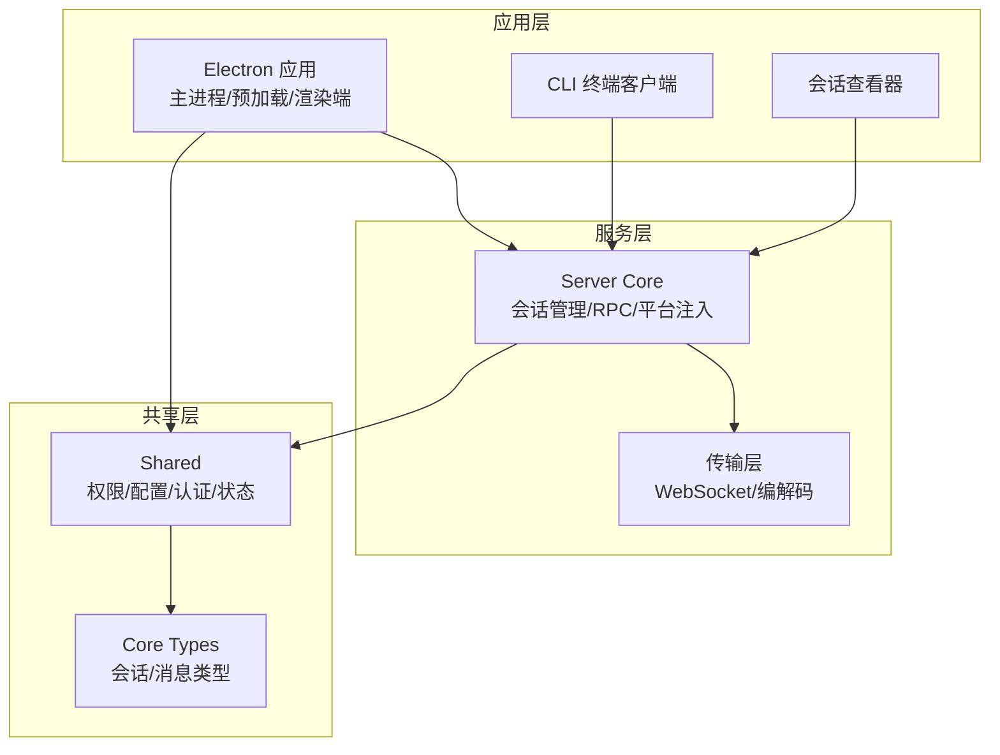
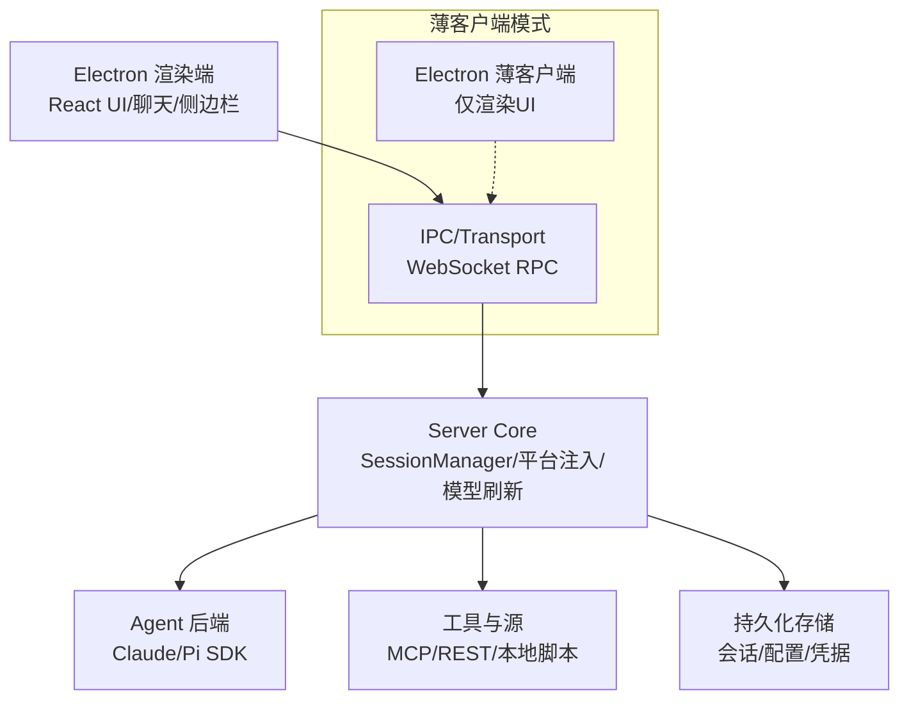
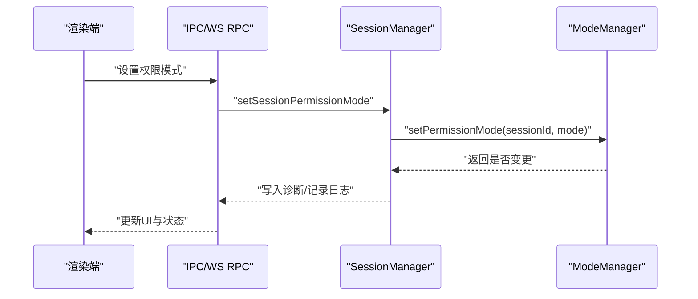
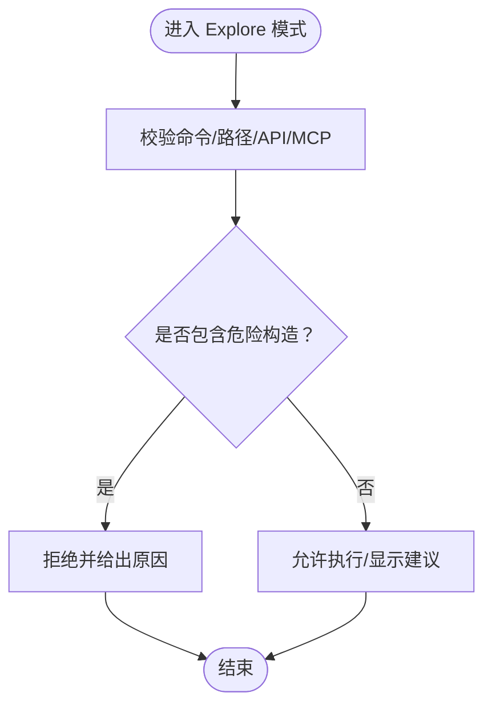
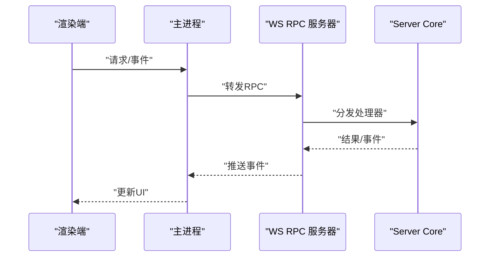
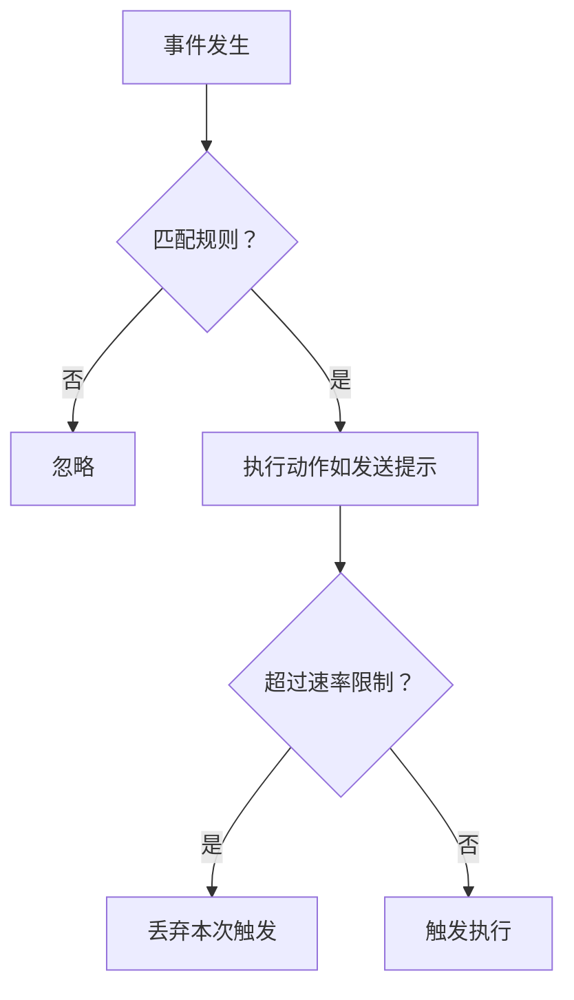
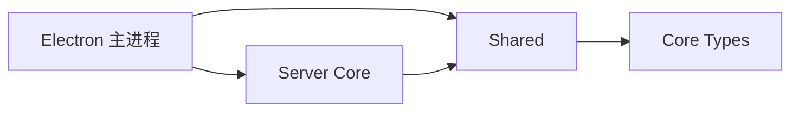

# 项目概述

<cite>
**本文档引用的文件**
- [README.md](file://README.md)
- [apps/electron/README.md](file://apps/electron/README.md)
- [package.json](file://package.json)
- [apps/electron/src/main/index.ts](file://apps/electron/src/main/index.ts)
- [packages/shared/src/agent/mode-manager.ts](file://packages/shared/src/agent/mode-manager.ts)
- [packages/shared/src/agent/mode-types.ts](file://packages/shared/src/agent/mode-types.ts)
- [packages/server-core/src/sessions/SessionManager.ts](file://packages/server-core/src/sessions/SessionManager.ts)
- [apps/electron/resources/docs/permissions.md](file://apps/electron/resources/docs/permissions.md)
- [apps/electron/resources/docs/automations.md](file://apps/electron/resources/docs/automations.md)
- [packages/core/src/types/session.ts](file://packages/core/src/types/session.ts)
</cite>

## 目录

1. [简介](#简介)
2. [项目结构](#项目结构)
3. [核心组件](#核心组件)
4. [架构总览](#架构总览)
5. [详细组件分析](#详细组件分析)
6. [依赖关系分析](#依赖关系分析)
7. [性能考量](#性能考量)
8. [故障排查指南](#故障排查指南)
9. [结论](#结论)
10. [附录](#附录)

## 简介

Craft Agents 是一款基于 Electron 的桌面应用，旨在以“文档为中心”的工作流中高效地与 AI 代理协作。它通过 Agent Native 软件原则构建，强调直观的多会话管理、无繁琐配置的外部服务连接（MCP、REST API、本地文件系统）、权限模式控制、自动化事件驱动以及跨平台体验。项目采用双后端架构：Claude Agent SDK 与 Pi SDK 并行运行，支持多提供商连接，并提供远程服务器模式（薄客户端）以在远端高性能机器上运行长会话与计算密集型任务。

项目价值主张：

- 文档优先：围绕 Craft 文档与工具构建，减少对代码编辑器的依赖，一切改动皆可由提示词驱动。
- 多会话与状态：提供收件箱/归档、标记、动态状态工作流与持久化对话历史。
- 权限安全：三档权限模式（探索、询问编辑、自动执行），保障在探索阶段的安全性。
- 自动化：事件驱动的自动化，支持定时触发、标签变更、工具使用、权限模式变化等。
- 可扩展：支持 MCP 服务器、REST API、本地脚本与浏览器工具，统一接入与可视化。

**章节来源**

- file://README.md#L14-L23
- file://README.md#L84-L100
- file://README.md#L343-L366

## 项目结构

仓库采用 Monorepo 结构，核心模块与应用分布如下：

- apps/electron：Electron 主进程、预加载脚本与渲染端 React UI，提供桌面应用主界面与会话管理。
- apps/cli：终端客户端，通过 WebSocket 连接服务器，适合脚本、CI/CD 与命令行偏好者。
- packages/server-core：会话管理、RPC 传输、模型刷新与平台注入等服务端能力。
- packages/shared：共享类型、权限模式、认证、配置、状态与工具图标等通用逻辑。
- packages/core：会话与消息等核心类型定义。
- apps/viewer：独立的会话查看器（用于展示会话内容）。
- scripts：构建、打包与资源复制脚本。

**图表来源**

- [package.json](file://package.json#L7-L11)
- [apps/electron/README.md](file://apps/electron/README.md#L13-L47)

**章节来源**

- file://package.json#L7-L11
- file://apps/electron/README.md#L13-L47

## 核心组件

- 会话管理（SessionManager）
  - 负责会话生命周期、消息持久化、标题生成、连接选择、计划提交与压缩完成标记等。
  - 支持权限模式设置与诊断，确保模式切换时的状态一致性与幂等。
- 权限模式管理（ModeManager）
  - 每个会话拥有独立的权限状态，支持三种模式：探索（只读）、询问编辑（交互式确认）、自动执行（无提示）。
  - 提供模式切换、订阅回调、诊断信息与路径/命令/API 规则匹配。
- 传输与 RPC
  - 基于 WebSocket 的本地 RPC 服务器，支持鉴权令牌、客户端映射与事件推送。
  - 编解码器保证消息信封格式正确，避免越界或错误载荷。
- 配置与文档种子
  - 默认权限、主题、工具图标与内置文档在首次运行时写入用户目录，确保开箱即用。
- 自动化引擎
  - 基于事件（标签增删、权限模式变化、调度器等）触发动作（如发送提示创建新会话），支持正则匹配与 Cron 定时。

**章节来源**

- file://packages/server-core/src/sessions/SessionManager.ts#L4900-L4987
- file://packages/shared/src/agent/mode-manager.ts#L220-L342
- file://apps/electron/src/main/index.ts#L558-L643
- file://apps/electron/resources/docs/automations.md#L1-L357

## 架构总览

Craft Agents 的整体架构遵循“桌面薄客户端 + 服务端核心”的设计。Electron 应用负责 UI 与窗口管理，服务端核心负责会话、工具执行、权限控制与模型刷新；两者通过本地 WebSocket RPC 通信。Thin-client 模式下，Electron 仅渲染 UI，所有逻辑在远端服务器执行，适合在高性能服务器上保持长会话与并行任务。

**图表来源**

- [apps/electron/README.md](file://apps/electron/README.md#L13-L47)
- [apps/electron/src/main/index.ts](file://apps/electron/src/main/index.ts#L371-L415)

**章节来源**

- file://apps/electron/README.md#L13-L47
- file://apps/electron/src/main/index.ts#L371-L415

## 详细组件分析

### 会话管理（SessionManager）

- 职责
  - 会话创建、消息持久化、标题刷新、连接选择、计划执行与压缩完成标记。
  - 权限模式设置与恢复，处理模式切换时的诊断与竞态修复。
- 关键流程
  - 设置权限模式：更新当前模式、记录版本与变更来源，并写入诊断信息。
  - 恢复与对齐：当模式管理器状态与会话元数据不一致时进行修复，确保重启后状态一致。
- 数据结构
  - 会话状态包含标识、工作区、名称、归档/标记、状态与最后阅读消息 ID 等字段。

**图表来源**

- [packages/server-core/src/sessions/SessionManager.ts](file://packages/server-core/src/sessions/SessionManager.ts#L4900-L4987)
- [packages/shared/src/agent/mode-manager.ts](file://packages/shared/src/agent/mode-manager.ts#L264-L302)

**章节来源**

- file://packages/server-core/src/sessions/SessionManager.ts#L4900-L4987
- file://packages/core/src/types/session.ts#L14-L40

### 权限模式管理（ModeManager）

- 模式与行为
  - 探索（安全）：只读，阻止写操作，不提示。
  - 询问编辑（默认）：危险操作前提示确认。
  - 自动执行：跳过检查，全部允许。
- 实现要点
  - 每会话独立状态，避免全局污染。
  - 支持 Bash 命令/路径/API 端点/MCP 工具的白名单匹配与拒绝原因分析。
  - 提供订阅接口与诊断信息（上次模式、版本号、变更来源）。
- 错误与安全
  - 阻止危险构造（后台执行、重定向、命令替换、控制字符等）。
  - 对复合命令逐段校验，任一不安全即整体拒绝。

**图表来源**

- [packages/shared/src/agent/mode-manager.ts](file://packages/shared/src/agent/mode-manager.ts#L485-L583)
- [packages/shared/src/agent/mode-types.ts](file://packages/shared/src/agent/mode-types.ts#L16-L27)

**章节来源**

- file://packages/shared/src/agent/mode-manager.ts#L220-L342
- file://packages/shared/src/agent/mode-types.ts#L16-L249
- file://apps/electron/resources/docs/permissions.md#L132-L194

### 传输与 RPC（WebSocket）

- 本地 RPC 服务器
  - 在本地绑定地址与端口，启用鉴权令牌，维护客户端映射与断线清理。
  - 将事件推送到渲染端，支持诊断桥接（将远端连接状态同步到主进程日志）。
- 编解码与校验
  - 严格校验消息信封形状，防止非法载荷进入后续处理链。
- 薄客户端
  - 当设置远端服务器 URL 与令牌时，Electron 仅作为 UI 客户端，所有逻辑在远端执行。

**图表来源**

- [apps/electron/src/main/index.ts](file://apps/electron/src/main/index.ts#L558-L643)
- [apps/electron/src/transport/codec.ts](file://apps/electron/src/transport/codec.ts#L1-L5)

**章节来源**

- file://apps/electron/src/main/index.ts#L558-L643

### 自动化（事件驱动）

- 事件类型
  - 应用事件：标签增删、权限模式变化、标志变化、会话状态变化、调度器分钟触发。
  - 代理事件：工具使用前后、通知、会话开始/结束、停止、子代理启动/停止等。
- 动作类型
  - 提示动作：创建新会话并发送提示，支持指定 LLM 连接与模型。
- 匹配与速率限制
  - 正则匹配或 Cron 表达式；每事件类型有速率限制，防止级联触发。

**图表来源**

- [apps/electron/resources/docs/automations.md](file://apps/electron/resources/docs/automations.md#L39-L72)
- [apps/electron/resources/docs/automations.md](file://apps/electron/resources/docs/automations.md#L324-L336)

**章节来源**

- file://apps/electron/resources/docs/automations.md#L1-L357

### 概念解释（面向初学者）

- Agent Native 软件原则
  - 让代理成为第一公民：描述需求，系统自动决定如何实现，从而更高效利用 token。
- 多会话管理
  - 每个会话对应一次 SDK 会话，具备独立状态、消息与权限模式。
- 权限模式
  - 三种模式覆盖从“只读探索”到“自动执行”的全谱系，满足不同安全与效率诉求。
- 自动化
  - 基于事件的动作编排，无需手动干预即可完成重复性任务。

**章节来源**

- file://README.md#L14-L23
- file://README.md#L84-L100

## 依赖关系分析

- 应用与服务端
  - Electron 主进程依赖 Server Core 的会话管理与平台注入，通过本地 WS RPC 通信。
- 共享层
  - Shared 层提供权限模式、配置、认证与状态等通用能力，被 Electron 与 Server Core 复用。
- 类型与契约
  - Core Types 定义会话与消息结构，确保前后端一致的数据契约。

**图表来源**

- [package.json](file://package.json#L7-L11)
- [apps/electron/README.md](file://apps/electron/README.md#L13-L47)

**章节来源**

- file://package.json#L7-L11
- file://apps/electron/README.md#L13-L47

## 性能考量

- 本地 RPC 与事件推送
  - 使用轻量的 WebSocket 传输，避免频繁磁盘 IO；事件推送集中处理，降低 UI 抖动。
- 模型刷新与凭据健康检查
  - 启动后异步刷新可用模型列表，早期发现凭据问题，减少运行期失败。
- 薄客户端模式
  - 将计算密集型任务迁移到远端服务器，本地仅渲染 UI，显著降低资源占用。
- 日志与调试
  - 开发模式开启调试与性能统计，生产环境通过 Sentry 采集错误上下文，便于定位瓶颈。

[本节为通用指导，无需特定文件引用]

## 故障排查指南

- 启动与初始化
  - 若出现 SDK 子进程路径解析错误，需显式设置 Claude Code 可执行路径。
  - OAuth 或 API Key 需在初始化前注入环境变量。
- 权限模式异常
  - 模式切换后 UI 未更新：检查模式管理器订阅与回调注册。
  - 模式恢复不一致：关注会话元数据与模式管理器状态的对齐逻辑。
- 传输与 RPC
  - 无法建立 WS 连接：检查绑定地址、端口与令牌；TLS 场景确认证书与密钥配置。
- 日志定位
  - 主进程日志输出至各平台用户目录下的日志文件，按模块前缀（如 SessionManager、IPC）过滤。

**章节来源**

- file://apps/electron/README.md#L49-L138
- file://apps/electron/src/main/index.ts#L371-L415

## 结论

Craft Agents 以“文档为中心”的 Agent Native 设计，结合多会话管理、权限模式与自动化，为个人与团队提供了安全、高效且可扩展的代理工作流。其薄客户端 + 服务端核心的架构既保证了本地流畅体验，又能在远端服务器上承载复杂任务。通过清晰的权限边界与事件驱动自动化，用户可以专注于目标而非过程细节，真正实现“任何定制只需一个提示”。

[本节为总结性内容，无需特定文件引用]

## 附录

### 快速开始与安装

- 一键安装脚本（macOS/Linux/Windows）
- 从源码构建：克隆仓库、安装依赖、启动 Electron 应用。

**章节来源**

- file://README.md#L61-L83

### 使用场景与工作流示例

- 多会话收件箱：在收件箱中组织与跟踪多个任务，按状态流转（待办→进行中→需要审阅→完成）。
- 权限模式切换：在探索模式下先审阅与规划，再通过“提交计划”进入执行模式。
- 自动化：每日定时提醒、标签变更通知、权限模式变化记录等。

**章节来源**

- file://README.md#L101-L108
- file://apps/electron/resources/docs/permissions.md#L241-L283
- file://apps/electron/resources/docs/automations.md#L208-L289
