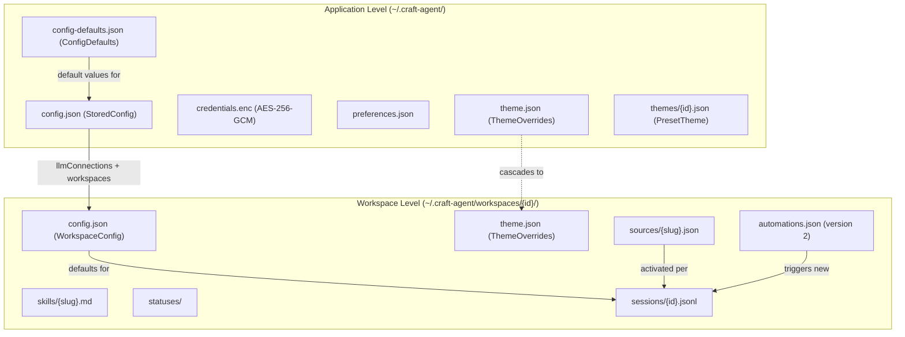
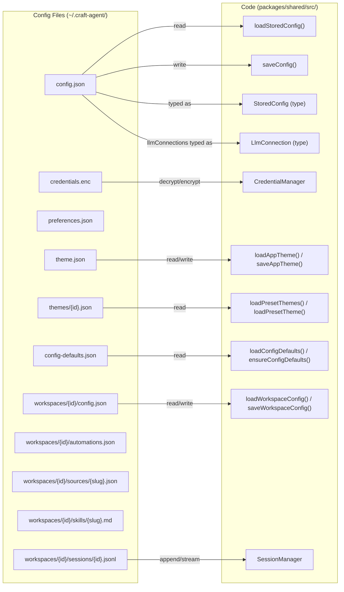

# Configuration Files

<details>
<summary>Relevant source files</summary>

The following files were used as context for generating this wiki page:

- [README.md](README.md)
- [packages/shared/src/agent/diagnostics.ts](packages/shared/src/agent/diagnostics.ts)
- [packages/shared/src/config/llm-connections.ts](packages/shared/src/config/llm-connections.ts)
- [packages/shared/src/config/storage.ts](packages/shared/src/config/storage.ts)
- [packages/shared/src/utils/summarize.ts](packages/shared/src/utils/summarize.ts)

</details>

This page provides a comprehensive reference for all configuration file formats used by Craft Agents. Configuration data is stored in `~/.craft-agent/` with a hierarchical structure spanning application-level, workspace-level, and session-level files.

For information about the storage system architecture and data persistence patterns, see [Storage & Configuration](#2.8). For workspace-specific settings and organization, see [Workspaces](#4.1).

---

## Configuration Hierarchy

Craft Agents uses a three-tier configuration system with clear inheritance and override patterns:



Sources: [README.md:293-311](), [packages/shared/src/config/storage.ts:46-72]()

---

## Application-Level Configuration

Application-level files control global settings, authentication, and user preferences. These files are read at application startup and modified through settings UI or OAuth flows.

### config.json (App Level)

Main application configuration. Defined by the `StoredConfig` interface. Read by `loadStoredConfig()` and written by `saveConfig()`.

**Location:** `~/.craft-agent/config.json`

**Format:**

```json
{
  "llmConnections": [
    {
      "slug": "anthropic-api",
      "name": "Anthropic (API Key)",
      "providerType": "anthropic",
      "authType": "api_key",
      "models": [{ "id": "claude-opus-4-6", "name": "Claude Opus 4" }],
      "defaultModel": "claude-opus-4-6",
      "createdAt": 1705320000000,
      "lastUsedAt": 1705320000000
    }
  ],
  "defaultLlmConnection": "anthropic-api",
  "workspaces": [
    {
      "id": "uuid-v4-string",
      "name": "My Workspace",
      "rootPath": "~/Documents/my-workspace",
      "createdAt": 1705320000000,
      "lastAccessedAt": 1705320000000
    }
  ],
  "activeWorkspaceId": "uuid-v4-string",
  "activeSessionId": "session-uuid",
  "notificationsEnabled": true,
  "colorTheme": "default",
  "dismissedUpdateVersion": "1.2.3",
  "autoCapitalisation": true,
  "sendMessageKey": "enter",
  "spellCheck": false,
  "keepAwakeWhileRunning": false,
  "richToolDescriptions": true,
  "gitBashPath": "C:\\Program Files\\Git\\bin\\bash.exe"
}
```

| Field                    | Type                     | Default     | Description                                         |
| ------------------------ | ------------------------ | ----------- | --------------------------------------------------- |
| `llmConnections`         | `LlmConnection[]`        | `[]`        | All configured LLM provider connections             |
| `defaultLlmConnection`   | `string`                 | —           | Slug of the global default connection               |
| `workspaces`             | `Workspace[]`            | —           | Registered workspace entries                        |
| `activeWorkspaceId`      | `string \| null`         | —           | Currently active workspace ID                       |
| `activeSessionId`        | `string \| null`         | —           | Currently active session ID                         |
| `notificationsEnabled`   | `boolean`                | `true`      | Desktop notifications for task completion           |
| `colorTheme`             | `string`                 | `"default"` | Preset theme ID (e.g. `"dracula"`, `"nord"`)        |
| `dismissedUpdateVersion` | `string`                 | —           | Version dismissed from auto-update prompts          |
| `autoCapitalisation`     | `boolean`                | `true`      | Auto-capitalize first letter in input               |
| `sendMessageKey`         | `"enter" \| "cmd-enter"` | `"enter"`   | Key combination to send messages                    |
| `spellCheck`             | `boolean`                | `false`     | Spell check in chat input                           |
| `keepAwakeWhileRunning`  | `boolean`                | `false`     | Prevent screen sleep during active sessions         |
| `richToolDescriptions`   | `boolean`                | `true`      | Inject `_intent` metadata into tool schemas         |
| `gitBashPath`            | `string`                 | —           | Windows only: path to `bash.exe` for SDK subprocess |

Workspace `rootPath` values are stored with `~` prefix via `toPortablePath()` for portability, then expanded on load via `expandPath()`.

Sources: [packages/shared/src/config/storage.ts:46-72](), [packages/shared/src/config/storage.ts:141-195]()

---

### LlmConnection

Each entry in `llmConnections` is an `LlmConnection` object. Credentials are stored separately in `credentials.enc` keyed by `llm::{slug}::{credentialType}`.

**`LlmProviderType` values:**

| Value              | Backend                                                  |
| ------------------ | -------------------------------------------------------- |
| `anthropic`        | Direct Anthropic API (`api.anthropic.com`)               |
| `anthropic_compat` | Anthropic-format endpoints (OpenRouter, Ollama, etc.)    |
| `bedrock`          | AWS Bedrock (Claude via AWS)                             |
| `vertex`           | Google Vertex AI (Claude via GCP)                        |
| `pi`               | Pi unified API (ChatGPT Plus, Copilot, Google AI Studio) |
| `pi_compat`        | Pi with custom endpoint                                  |

**`LlmAuthType` values:**

| Value                   | Description                                 |
| ----------------------- | ------------------------------------------- |
| `api_key`               | Single API key field                        |
| `api_key_with_endpoint` | API key + custom base URL                   |
| `oauth`                 | Browser OAuth flow                          |
| `iam_credentials`       | AWS Access Key + Secret Key + Region        |
| `bearer_token`          | Bearer token (distinct from API key header) |
| `service_account_file`  | GCP JSON service account file               |
| `environment`           | Auto-detect from environment variables      |
| `none`                  | No authentication (e.g. Ollama)             |

**`LlmConnection` fields:**

| Field            | Type                 | Description                                                  |
| ---------------- | -------------------- | ------------------------------------------------------------ |
| `slug`           | `string`             | URL-safe unique identifier (e.g. `"anthropic-api"`)          |
| `name`           | `string`             | Display name                                                 |
| `providerType`   | `LlmProviderType`    | Backend SDK to use                                           |
| `authType`       | `LlmAuthType`        | Authentication mechanism                                     |
| `baseUrl`        | `string?`            | Custom endpoint URL (`*_compat` providers)                   |
| `models`         | `ModelDefinition[]?` | Available models for this connection                         |
| `defaultModel`   | `string?`            | Default model ID for new sessions                            |
| `piAuthProvider` | `string?`            | Pi auth provider (e.g. `"openai-codex"`, `"github-copilot"`) |
| `awsRegion`      | `string?`            | AWS region (Bedrock)                                         |
| `gcpProjectId`   | `string?`            | GCP project (Vertex)                                         |
| `gcpRegion`      | `string?`            | GCP region (Vertex)                                          |
| `createdAt`      | `number`             | Unix timestamp (ms)                                          |
| `lastUsedAt`     | `number?`            | Unix timestamp (ms)                                          |

Connections are resolved through a fallback chain in `resolveEffectiveConnectionSlug()`: session-locked → workspace default → global default → first available.

Sources: [packages/shared/src/config/llm-connections.ts:51-57](), [packages/shared/src/config/llm-connections.ts:84-92](), [packages/shared/src/config/llm-connections.ts:98-151](), [packages/shared/src/config/llm-connections.ts:469-478]()

### credentials.enc

Encrypted credential storage using AES-256-GCM encryption. Contains all API keys, OAuth tokens, and sensitive authentication data.

**Location:** `~/.craft-agent/credentials.enc`

**Encryption Details:**

- Algorithm: AES-256-GCM
- Key derivation: System keychain (macOS Keychain, Windows Credential Manager) or machine-specific fallback
- Format: Binary encrypted blob (not human-readable)

Credentials are keyed by a structured key format. LLM connection credentials use the key `llm::{slug}::{credentialType}` where `credentialType` is `api_key` or `oauth_token`. Source OAuth credentials are stored per-source per-workspace.

For details on encryption implementation and security architecture, see page 7.2.

Sources: [packages/shared/src/config/llm-connections.ts:273-275]()

### preferences.json

User profile and preferences accessible to the agent for personalization.

**Location:** `~/.craft-agent/preferences.json`

**Format:**

```json
{
  "userName": "John Doe",
  "timezone": "America/Los_Angeles",
  "language": "en-US",
  "dateFormat": "MM/DD/YYYY",
  "timeFormat": "12h"
}
```

| Field        | Type             | Description                            |
| ------------ | ---------------- | -------------------------------------- |
| `userName`   | `string`         | User's preferred name for agent to use |
| `timezone`   | `string`         | IANA timezone identifier               |
| `language`   | `string`         | Locale code (BCP 47 format)            |
| `dateFormat` | `string`         | Preferred date formatting pattern      |
| `timeFormat` | `"12h" \| "24h"` | Time display preference                |

**Sources:** [README.md:210]()

### theme.json (App Level)

Application-level theme configuration using a 6-color system. Workspace themes can override this.

**Location:** `~/.craft-agent/theme.json`

**Format:**

```json
{
  "mode": "light" | "dark",
  "colors": {
    "primary": "#1a73e8",
    "secondary": "#ea4335",
    "accent": "#fbbc04",
    "success": "#34a853",
    "warning": "#ff9800",
    "error": "#d93025"
  },
  "customCss": "/* Optional custom CSS overrides */"
}
```

For complete theme system documentation, see [Theme System](#4.8).

**Sources:** [README.md:211]()

---

## Workspace-Level Configuration

Each workspace maintains isolated configuration in `~/.craft-agent/workspaces/{workspaceId}/`. These settings cascade to sessions created within the workspace.

### config.json (Workspace Level)

Per-workspace settings. Read and written by `loadWorkspaceConfig()` / `saveWorkspaceConfig()` in `packages/shared/src/workspaces/storage.ts`.

**Location:** `~/.craft-agent/workspaces/{id}/config.json`

Key fields from the workspace config schema include:

| Field                              | Type                             | Description                                                            |
| ---------------------------------- | -------------------------------- | ---------------------------------------------------------------------- |
| `id`                               | `string`                         | Workspace UUID                                                         |
| `name`                             | `string`                         | Display name                                                           |
| `createdAt`                        | `number`                         | Unix timestamp (ms)                                                    |
| `defaults.workingDirectory`        | `string`                         | Default working directory for sessions                                 |
| `defaults.permissionMode`          | `"safe" \| "ask" \| "allow-all"` | Default permission mode                                                |
| `defaults.cyclablePermissionModes` | `string[]`                       | Modes available via SHIFT+TAB cycle                                    |
| `defaults.llmConnection`           | `string`                         | Workspace-level default LLM connection slug (overrides global default) |

The workspace `config.json` is the single source of truth for the workspace name. The `Workspace` entry in the global `config.json` does not store a duplicate name field — `getWorkspaces()` reads names from workspace folder configs at runtime.

Sources: [packages/shared/src/config/storage.ts:379-382](), [packages/shared/src/config/storage.ts:434-463]()

### theme.json (Workspace Level)

Workspace-specific theme overrides, inheriting from app-level theme.

**Location:** `~/.craft-agent/workspaces/{id}/theme.json`

**Format:** Same as app-level `theme.json`. Only specified fields override app theme.

Sources: [README.md:215]()

---

### automations.json

Event-driven automation rules for a workspace. Must include `"version": 2`.

**Location:** `~/.craft-agent/workspaces/{id}/automations.json`

**Format:**

```json
{
  "version": 2,
  "automations": {
    "SchedulerTick": [
      {
        "cron": "0 9 * * 1-5",
        "timezone": "America/New_York",
        "labels": ["Scheduled"],
        "actions": [
          { "type": "prompt", "prompt": "Check @github for new issues" }
        ]
      }
    ],
    "LabelAdd": [
      {
        "matcher": "^urgent$",
        "actions": [
          {
            "type": "prompt",
            "prompt": "An urgent label was added. Triage the session."
          }
        ]
      }
    ]
  }
}
```

The top-level `automations` object is keyed by event type. Each event type holds an array of automation rules.

**Supported event types:**

| Event                  | Trigger                      |
| ---------------------- | ---------------------------- |
| `LabelAdd`             | Label applied to a session   |
| `LabelRemove`          | Label removed from a session |
| `PermissionModeChange` | Permission mode switched     |
| `FlagChange`           | Session flagged or unflagged |
| `SessionStatusChange`  | Session status changed       |
| `SchedulerTick`        | Cron schedule fires          |
| `PreToolUse`           | Before any tool execution    |
| `PostToolUse`          | After any tool execution     |
| `SessionStart`         | New session created          |
| `SessionEnd`           | Session ends                 |

**Rule fields by event type:**

| Field      | Applies to                | Description                        |
| ---------- | ------------------------- | ---------------------------------- |
| `cron`     | `SchedulerTick`           | Cron expression (5-field)          |
| `timezone` | `SchedulerTick`           | IANA timezone identifier           |
| `labels`   | `SchedulerTick`           | Labels applied to created sessions |
| `matcher`  | `LabelAdd`, `LabelRemove` | Regex matched against label name   |
| `actions`  | all                       | Array of action objects            |

**Prompt action** (`{ "type": "prompt", "prompt": "..." }`): creates a new agent session. Supports `@mentions` for sources and skills, and expands environment variables like `$CRAFT_LABEL` and `$CRAFT_SESSION_ID`.

Sources: [README.md:323-354]()

---

## Status and Workflow Configuration

### status-config.json

Customizable workflow states for session organization.

**Location:** `~/.craft-agent/workspaces/{id}/statuses/status-config.json`

**Format:**

```json
{
  "statuses": [
    {
      "id": "todo",
      "label": "Todo",
      "color": "#6b7280",
      "icon": "circle",
      "isInbox": true,
      "order": 0
    },
    {
      "id": "in-progress",
      "label": "In Progress",
      "color": "#3b82f6",
      "icon": "arrow-right",
      "isInbox": true,
      "order": 1
    },
    {
      "id": "needs-review",
      "label": "Needs Review",
      "color": "#f59e0b",
      "icon": "eye",
      "isInbox": true,
      "order": 2
    },
    {
      "id": "done",
      "label": "Done",
      "color": "#10b981",
      "icon": "check",
      "isInbox": false,
      "order": 3
    }
  ],
  "defaultStatus": "todo",
  "transitions": {
    "todo": ["in-progress"],
    "in-progress": ["needs-review", "done"],
    "needs-review": ["in-progress", "done"],
    "done": ["in-progress"]
  }
}
```

| Field                | Type                       | Description                     |
| -------------------- | -------------------------- | ------------------------------- |
| `statuses`           | `Status[]`                 | Array of status definitions     |
| `statuses[].id`      | `string`                   | Unique identifier (kebab-case)  |
| `statuses[].label`   | `string`                   | Display name                    |
| `statuses[].color`   | `string`                   | Hex color code                  |
| `statuses[].icon`    | `string`                   | Icon identifier                 |
| `statuses[].isInbox` | `boolean`                  | Appears in inbox (not archived) |
| `statuses[].order`   | `number`                   | Sort order in UI                |
| `defaultStatus`      | `string`                   | Status ID for new sessions      |
| `transitions`        | `Record<string, string[]>` | Valid status transition map     |

**Sources:** [README.md:219]()

---

## Source Configuration

### Source Definition Files

Each connected source (MCP server, API, or local resource) has a configuration file.

**Location:** `~/.craft-agent/workspaces/{id}/sources/{sourceSlug}.json`

**Format (MCP Server - stdio):**

```json
{
  "type": "mcp",
  "transport": "stdio",
  "slug": "github",
  "name": "GitHub",
  "description": "GitHub API integration",
  "command": "npx",
  "args": ["-y", "@modelcontextprotocol/server-github"],
  "env": {
    "GITHUB_TOKEN": "ghp_..."
  },
  "metadata": {
    "domain": "github.com",
    "version": "1.0.0",
    "tags": ["git", "code"]
  }
}
```

**Format (MCP Server - HTTP/SSE):**

```json
{
  "type": "mcp",
  "transport": "sse",
  "slug": "linear",
  "name": "Linear",
  "description": "Linear issue tracking",
  "url": "https://mcp.linear.app/sse",
  "metadata": {
    "domain": "linear.app",
    "requiresAuth": true
  }
}
```

**Format (REST API):**

```json
{
  "type": "api",
  "slug": "google",
  "name": "Google Services",
  "description": "Gmail, Calendar, Drive",
  "provider": "google",
  "scopes": [
    "https://www.googleapis.com/auth/gmail.readonly",
    "https://www.googleapis.com/auth/calendar.readonly"
  ],
  "metadata": {
    "domain": "google.com",
    "oauthProvider": "google"
  }
}
```

**Format (Local Resource):**

```json
{
  "type": "local",
  "slug": "obsidian",
  "name": "Obsidian Vault",
  "description": "Local markdown notes",
  "path": "/Users/john/Documents/ObsidianVault",
  "metadata": {
    "watchForChanges": true,
    "fileTypes": [".md", ".txt"]
  }
}
```

| Field         | Type                        | Description                            |
| ------------- | --------------------------- | -------------------------------------- |
| `type`        | `"mcp" \| "api" \| "local"` | Source integration type                |
| `transport`   | `"stdio" \| "sse"`          | MCP transport mechanism (MCP only)     |
| `slug`        | `string`                    | Unique identifier (kebab-case)         |
| `name`        | `string`                    | Display name                           |
| `description` | `string`                    | Human-readable description             |
| `command`     | `string`                    | Executable command (stdio MCP only)    |
| `args`        | `string[]`                  | Command arguments (stdio MCP only)     |
| `url`         | `string`                    | Endpoint URL (SSE MCP or API)          |
| `env`         | `Record<string, string>`    | Environment variables (stdio MCP only) |
| `provider`    | `string`                    | OAuth provider identifier (API only)   |
| `scopes`      | `string[]`                  | OAuth permission scopes (API only)     |
| `path`        | `string`                    | Filesystem path (local only)           |
| `metadata`    | `object`                    | Additional source-specific metadata    |

**Sources:** [README.md:217]()

---

## Skills Configuration

Skills are stored as Markdown files with frontmatter metadata.

**Location:** `~/.craft-agent/workspaces/{id}/skills/{skillSlug}.md`

**Format:**

```markdown
---
name: Code Review
slug: code-review
description: Perform thorough code reviews with security focus
tags: [code, security, review]
version: 1.0.0
---

# Code Review Instructions

When reviewing code, follow these steps:

1. **Security Analysis**
   - Check for SQL injection vulnerabilities
   - Verify input validation
   - Review authentication/authorization

2. **Code Quality**
   - Enforce style guide compliance
   - Check for code duplication
   - Verify test coverage

3. **Performance**
   - Identify N+1 queries
   - Check for memory leaks
   - Review algorithm complexity

Always provide specific line numbers and actionable suggestions.
```

| Field                      | Type       | Description                          |
| -------------------------- | ---------- | ------------------------------------ |
| Frontmatter: `name`        | `string`   | Display name                         |
| Frontmatter: `slug`        | `string`   | Unique identifier (matches filename) |
| Frontmatter: `description` | `string`   | Short description                    |
| Frontmatter: `tags`        | `string[]` | Categorization tags                  |
| Frontmatter: `version`     | `string`   | Semantic version                     |
| Body                       | Markdown   | Skill instructions and context       |

Skills are invoked using `@skillSlug` syntax in chat messages.

**Sources:** [README.md:218](), [packages/shared/src/docs/index.ts:92]()

---

## Session Data Files

Sessions are stored as JSONL (JSON Lines) files for efficient streaming reads and append-only writes.

**Location:** `~/.craft-agent/workspaces/{id}/sessions/{sessionId}.jsonl`

**Format:** Each line is a JSON object representing one agent event:

```jsonl
{"type":"session_start","timestamp":"2024-01-15T10:30:00.000Z","model":"claude-opus-4-20250514","permissionMode":"ask"}
{"type":"user_message","timestamp":"2024-01-15T10:30:05.000Z","content":"Create a new React component"}
{"type":"thinking","timestamp":"2024-01-15T10:30:06.000Z","content":"I'll create a functional React component..."}
{"type":"tool_use","timestamp":"2024-01-15T10:30:07.000Z","tool":"write_file","args":{"path":"src/components/MyComponent.tsx","content":"..."}}
{"type":"tool_result","timestamp":"2024-01-15T10:30:08.000Z","tool":"write_file","result":"File written successfully"}
{"type":"assistant_message","timestamp":"2024-01-15T10:30:09.000Z","content":"I've created the component..."}
```

**Event Types:**

- `session_start`: Session initialization with config
- `user_message`: User input
- `thinking`: Claude's thinking process (when enabled)
- `tool_use`: Tool execution request
- `tool_result`: Tool execution result
- `assistant_message`: Claude's response
- `error`: Error event
- `session_compact`: Session compaction marker

**Metadata Sidecar (Optional):**
Some sessions may have a companion `.json` file with metadata:

**Location:** `~/.craft-agent/workspaces/{id}/sessions/{sessionId}.json`

```json
{
  "sessionId": "uuid-v4-string",
  "name": "Build Login Component",
  "status": "in-progress",
  "flagged": true,
  "labels": ["frontend", "react"],
  "createdAt": "2024-01-15T10:30:00.000Z",
  "updatedAt": "2024-01-15T10:35:00.000Z",
  "lastActivity": "2024-01-15T10:35:00.000Z"
}
```

**Sources:** [README.md:216]()

---

## Configuration File Mapping

The following diagram maps configuration files to their primary code functions and types.

**Config file → code function/type mapping:**



Sources: [packages/shared/src/config/storage.ts:46-72](), [packages/shared/src/config/storage.ts:141-195](), [packages/shared/src/config/llm-connections.ts:98-151]()

---

## Configuration Directory Structure

Complete filesystem layout of the configuration directory:

```
~/.craft-agent/
├── config.json                           # App config (StoredConfig)
├── credentials.enc                       # Encrypted credentials (AES-256-GCM)
├── preferences.json                      # User preferences
├── theme.json                            # App-level theme (ThemeOverrides)
├── config-defaults.json                  # Default values (synced from bundled assets)
├── drafts.json                           # Per-session input drafts
├── themes/                               # Preset theme files (PresetTheme)
│   ├── default.json
│   ├── dracula.json
│   └── nord.json
├── docs/                                 # Bundled documentation (synced on launch)
│   ├── sources.md
│   ├── permissions.md
│   ├── skills.md
│   └── ...
└── workspaces/
    └── {workspace-id}/
        ├── config.json                   # Workspace config (WorkspaceConfig)
        ├── theme.json                    # Workspace theme override
        ├── automations.json              # Automations (version 2)
        ├── sessions/
        │   ├── {session-id}.jsonl        # Session conversation (JSONL)
        │   └── {session-id}.json         # Session metadata sidecar
        ├── sources/
        │   ├── github.json               # GitHub MCP source config
        │   └── linear.json               # Linear API source config
        ├── skills/
        │   ├── code-review.md            # Skill instruction file
        │   └── debugging.md
        └── statuses/                     # Status configuration
```

Sources: [README.md:293-311](), [packages/shared/src/config/storage.ts:649-657](), [packages/shared/src/config/storage.ts:804-832]()

---

## Documentation Directory

The `docs/` directory contains bundled documentation that the agent can reference during configuration tasks.

**Location:** `~/.craft-agent/docs/`

**Auto-Sync:** Documentation files are automatically synced from bundled assets on application launch:

```typescript
// From packages/shared/src/docs/index.ts:119-140
export function initializeDocs(): void {
  // Always write bundled docs to disk on launch
  for (const [filename, content] of Object.entries(BUNDLED_DOCS)) {
    const docPath = join(DOCS_DIR, filename)
    writeFileSync(docPath, content, 'utf-8')
  }
}
```

**Available Documentation:**

- `sources.md` - Source integration guide
- `permissions.md` - Permission pattern reference
- `skills.md` - Skill creation guide
- `themes.md` - Theme customization reference
- `statuses.md` - Status workflow configuration
- `labels.md` - Label system guide
- `tool-icons.md` - Tool icon mapping
- `mermaid.md` - Mermaid diagram syntax reference

These files are referenced in tool descriptions and error messages using constants from `DOC_REFS`:

```typescript
// From packages/shared/src/docs/index.ts:88-99
export const DOC_REFS = {
  appRoot: '~/.craft-agent',
  sources: '~/.craft-agent/docs/sources.md',
  permissions: '~/.craft-agent/docs/permissions.md',
  skills: '~/.craft-agent/docs/skills.md',
  // ...
} as const
```

**Sources:** [packages/shared/src/docs/index.ts:1-143]()
